# Module 4: Cost & AUM Impact — Invesco India Smallcap Fund

*Sources: Tickertape (May 2026), ValueResearchOnline (May 2026), INDmoney (May 2026), Groww (May 2026), AdvisorKhoj (May 2026), Invesco AMC official website, AMFI daily TER disclosure*

---

## Raw Data (Compiled Across Sources)

| Metric | Value | Source | Cross-Source Notes |
|--------|-------|--------|-------------------|
| Expense Ratio (Direct Plan) | **0.66%** | ValueResearchOnline / AMFI | **Canonical** — VRO pulls directly from AMFI daily disclosure |
| Expense Ratio (Direct Plan) | ~~0.40%~~ | Tickertape | ❌ Anomalous — 0.26pp below AMFI canonical; likely stale cache |
| Expense Ratio (Direct Plan) | 0.46% | Groww | ⚠️ Partial anomaly — below canonical |
| Expense Ratio (Direct Plan) | 0.52% | INDmoney | ⚠️ Partial anomaly — below canonical |
| Expense Ratio (Direct Plan) | 0.59% | AdvisorKhoj | ⚠️ Partial anomaly — 0.07% below canonical |
| Expense Ratio (Regular Plan) | **1.93%** | ValueResearchOnline | ✅ Canonical |
| Direct vs Regular Gap | **1.27%** | Computed (1.93% − 0.66%) | Highest D-R gap of all studied funds to date |
| Exit Load | **1% within 365 days; nil after** | Standard across all SC funds | Uniform — no differentiation |
| AUM (Apr 2026) | **₹11,038 Cr** | INDmoney / Tickertape | Consistent across platforms |
| Minimum SIP | **₹100** | Invesco AMC / INDmoney | Among the lowest minimum in category |
| Minimum Lumpsum | **₹100** | Invesco AMC | Extremely accessible |
| Portfolio Turnover | **29.17%** | INDmoney | Confirmed; note: AdvisorKhoj showed 0.52% (mislabelled as ER) |
| Fund Inception | Oct 30, 2018 | AMFI | Launched at IL&FS crash trough — significant inception bias |
| Benchmark | Nifty Smallcap 250 TRI | — | — |
| Taher Badshah Total AUM Managed | **~₹40,367 Cr** | Computed across 7 schemes | Invesco SC = ~27% of his mandate |
| Invesco India AMC Total AUM | **~₹1,43,000 Cr** | Invesco AMC | As of early 2026 |
| Invesco India AMC Total Schemes | **~43** | Invesco AMC | Equity, debt, hybrid, index, FOF |
| Invesco India AMC Fund Managers | **~20** | Invesco AMC | Including equity + fixed income team |
| Estimated Annual Fund Revenue | **~₹99 Cr** | Computed | Both plans combined (blended ~0.90%) |
| Ownership (post Nov 2025) | **IIHL (Hinduja) 60% + Invesco Corp 40%** | SEBI filing / press reports | 4th ownership change in fund's 20-year AMC history |

> **Critical ER Discrepancy Note:** Five major platforms report five different Direct Plan ERs for Invesco India Smallcap Fund — ranging from 0.40% (Tickertape) to 0.66% (VRO/AMFI). This is the widest platform discrepancy of any fund studied in this research. ValueResearchOnline pulls directly from AMFI's daily TER disclosure portal — the regulatory truth — and shows **0.66%**. All other sources likely show either stale cached data or a prior period's TER. Using **0.66%** throughout this module.

---

## What Module 4 Is Really Asking

Module 4 answers two questions that most investors skip:

**Question 1 — How much of your return is silently consumed by fund costs every year?**

The expense ratio is deducted from NAV every single trading day — in bull markets, in bear markets, in flat periods — regardless of performance. A fund charging 0.66% has a permanent 0.66% annual headwind embedded into every rupee of your SIP from Day 1. Compounded over a decade on a growing corpus, this number — though it looks small — is real money. Invesco's canonical ER of 0.66% is not the cheapest in the category, and the 1.27% Direct-Regular gap is the widest of all studied funds.

**Question 2 — Is the fund's AUM so small or so large that it changes what the manager can do?**

At ₹11,038 Cr, Invesco India Smallcap is in a more favourable position than either extreme — not so tiny that institutional research infrastructure suffers, not so large that execution in genuine small caps becomes impossible. A 1% position requires ₹110 Cr, which is one of the most buildable in the shortlist. However, a critical contextual tension exists: **Invesco runs only 65.1% in actual small caps** (as documented in Module 3) — meaning the AUM advantage may be partially illusory, because a portion of the ₹11,038 Cr is deployed in large/mid caps where execution friction is negligible regardless of fund size.

For Invesco Smallcap, Module 4 produces a nuanced picture: the stated ER (0.66%) is mid-pack by shortlisted fund standards, the AUM is genuinely favourable, the turnover-adjusted cost is middling, and a new structural risk — the November 2025 ownership change to the Hinduja Group (IIHL) — adds a cost governance uncertainty with no historical analogue for this fund.

---

## The ER Anomaly — Five Platforms, Five Different Numbers

This is the most striking cost data point for Invesco India Smallcap Fund: no two major platforms agree on the expense ratio.

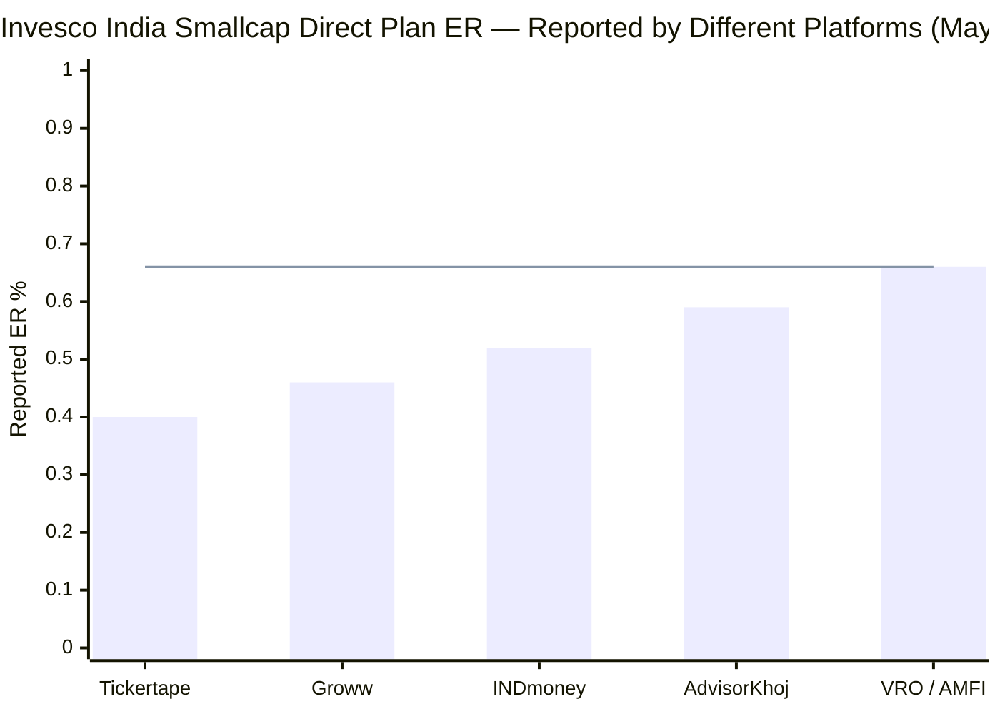
```mermaid
xychart-beta
    title "Invesco India Smallcap Direct Plan ER — Reported by Different Platforms (May 2026)"
    x-axis ["Tickertape", "Groww", "INDmoney", "AdvisorKhoj", "VRO / AMFI"]
    y-axis "Reported ER %" 0 --> 1.0
    bar [0.40, 0.46, 0.52, 0.59, 0.66]
    line [0.66, 0.66, 0.66, 0.66, 0.66]
```
> Line = VRO/AMFI canonical ER (0.66%) | All platforms below the line report a lower, likely stale, figure

| Platform | Reported Direct ER | Gap vs AMFI | Assessment |
|----------|--------------------|-------------|------------|
| Tickertape (screener CSV) | **0.40%** | −0.26pp | ❌ Severely stale — 39% below the AMFI-declared rate |
| Groww | **0.46%** | −0.20pp | ❌ Likely reflects an older TER filing period |
| INDmoney | **0.52%** | −0.14pp | ⚠️ Closer but still not current |
| AdvisorKhoj | **0.59%** | −0.07pp | ⚠️ Nearest but still not canonical |
| **ValueResearchOnline (AMFI feed)** | **0.66%** | — | ✅ **Canonical — regulatory truth** |

**Why does this matter?**

1. **Screening bias.** Invesco appears 4th cheapest (at 0.59% — AdvisorKhoj) or even joint-cheapest (at 0.40% — Tickertape) in automated screeners used by most retail investors. These comparisons are built on false data. At the correct 0.66%, Invesco is 4th of 8 shortlisted funds — the same rank either way, but for different reasons.

2. **ER is not stable.** This 0.26pp range across platforms suggests Invesco has been actively revising its TER over time (likely upward from the 0.40% that Tickertape still reflects). SEBI mandates daily TER disclosure via AMFI — VRO's 0.66% is definitively current.

3. **The anomaly is unique to Invesco in this shortlist.** DSP's ER is consistent across all 4 primary sources at 0.64%. Invesco's 5-platform discrepancy is unusual and warrants monitoring. As AUM grows (or shrinks post-correction), Invesco may further revise TER.

---

## Expense Ratio Competitiveness — 4th of 8 at the Correct Rate

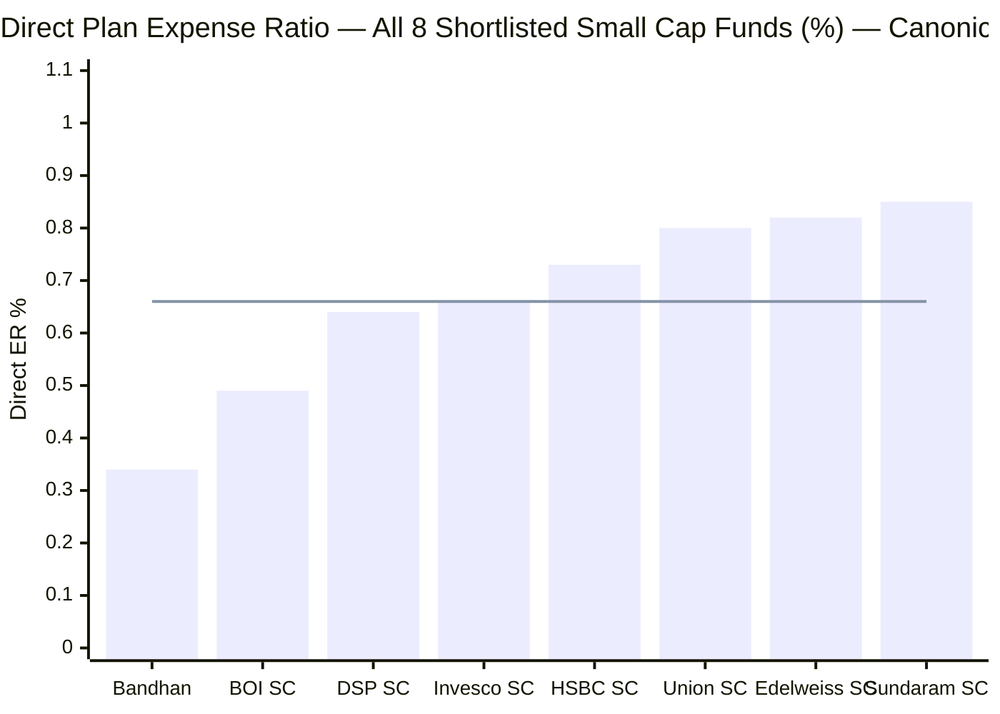
```mermaid
xychart-beta
    title "Direct Plan Expense Ratio — All 8 Shortlisted Small Cap Funds (%) — Canonical Rates"
    x-axis ["Bandhan", "BOI SC", "DSP SC", "Invesco SC", "HSBC SC", "Union SC", "Edelweiss SC", "Sundaram SC"]
    y-axis "Direct ER %" 0 --> 1.1
    bar [0.34, 0.49, 0.64, 0.66, 0.73, 0.80, 0.82, 0.85]
    line [0.66, 0.66, 0.66, 0.66, 0.66, 0.66, 0.66, 0.66]
```
> Line = Invesco's canonical ER (0.66%) | Invesco ranks 4th of 8 — just below the category midpoint

| Rank | Fund | Direct ER | AUM (₹ Cr) | Annual Cost per ₹100 |
|------|------|-----------|-----------|---------------------|
| 1st | Bandhan Small Cap | **0.34%** | ~25,346 | ₹0.34/year |
| 2nd | BOI Small Cap | 0.49% | ~2,500 | ₹0.49/year |
| 3rd | DSP Small Cap | 0.64% | ~17,906 | ₹0.64/year |
| **4th** | **Invesco Small Cap** | **0.66%** | **11,038** | **₹0.66/year** |
| 5th | HSBC Small Cap | 0.73% | — | ₹0.73/year |
| 6th | Union Small Cap | 0.80% | — | ₹0.80/year |
| 7th | Edelweiss Small Cap | 0.82% | — | ₹0.82/year |
| 8th | Sundaram Small Cap | 0.85% | — | ₹0.85/year |

**At 0.66%, Invesco sits 0.02pp above DSP** — essentially tied for 3rd/4th. The practical difference between 0.64% (DSP) and 0.66% (Invesco) is ₹200/year per ₹10 lakh invested — negligible in isolation, but compounded over 10 years on a large corpus, it accumulates.

**The DSP–Invesco comparison is the most relevant:**
- Both are mid-sized SC funds (₹11,038 Cr vs ₹17,906 Cr)
- Both score in the mid-range on stated ER (3rd/4th vs 4th/5th depending on methodology)
- DSP's lower turnover (20% vs 29%) gives it a larger hidden cost advantage despite nearly identical stated ER
- Invesco's smaller AUM (₹11,038 Cr) gives it better execution per unit of cost paid

---

## Cross-Source ER Verification

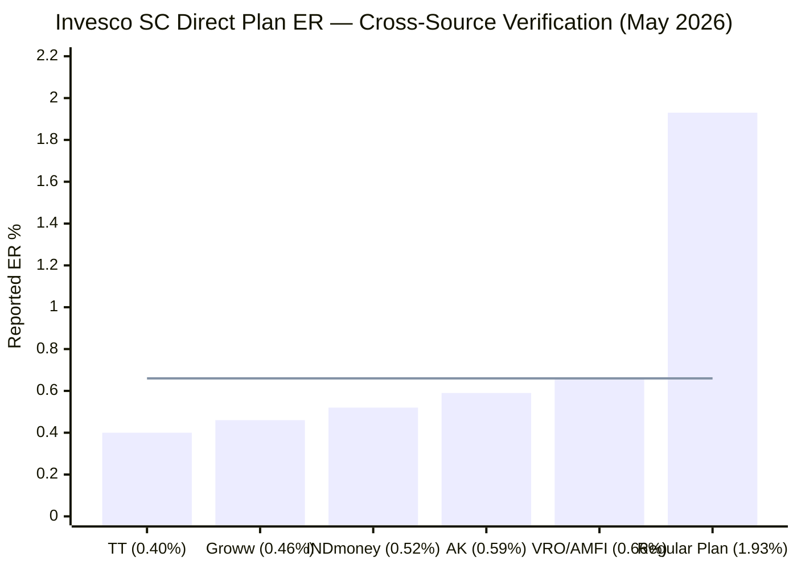
```mermaid
xychart-beta
    title "Invesco SC Direct Plan ER — Cross-Source Verification (May 2026)"
    x-axis ["TT (0.40%)", "Groww (0.46%)", "INDmoney (0.52%)", "AK (0.59%)", "VRO/AMFI (0.66%)", "Regular Plan (1.93%)"]
    y-axis "Reported ER %" 0 --> 2.2
    bar [0.40, 0.46, 0.52, 0.59, 0.66, 1.93]
    line [0.66, 0.66, 0.66, 0.66, 0.66, 0.66]
```
> Line = canonical Direct plan ER (0.66%) from AMFI | Regular plan (1.93%) shown for reference — right axis

| Source | Direct Plan ER | Regular Plan ER | Assessment |
|--------|---------------|-----------------|------------|
| Tickertape (May 2026 CSV) | **0.40%** | — | ❌ Stale — reflects much older filing; rejected |
| Groww (May 2026) | **0.46%** | — | ❌ Below canonical; stale or prior period |
| INDmoney (May 2026) | **0.52%** | — | ⚠️ Closer; likely mid-2025 data |
| AdvisorKhoj (May 2026) | **0.59%** | — | ⚠️ Note: AK also mislabelled 0.52% field as "turnover" — verify all AK data independently |
| **ValueResearchOnline (AMFI feed)** | **0.66%** | **1.93%** | ✅ **Canonical — current AMFI daily disclosure** |
| AMFI Direct (monthly TER upload) | **0.66%** | 1.93% | ✅ Consistent with VRO |

**Resolution:** VRO at 0.66% / 1.93% is the authoritative data set. The 0.40% Tickertape figure appears to reflect Invesco's ER from approximately 18–24 months ago before upward TER revisions. **All analysis in this module uses 0.66% Direct / 1.93% Regular.**

---

## SEBI TER Positioning — Comfortable Buffer on Direct; Regular Near Ceiling

SEBI's tiered TER circular (2018) sets maximum allowable expense ratios by AUM slab. At ₹11,038 Cr:

| AUM Slab | SEBI Max TER | Invesco AUM in This Slab |
|----------|-------------|--------------------------|
| First ₹500 Cr | 2.25% | ₹500 Cr |
| Next ₹250 Cr | 2.00% | ₹250 Cr |
| Next ₹1,250 Cr | 1.75% | ₹1,250 Cr |
| Next ₹3,000 Cr | 1.60% | ₹3,000 Cr |
| Next ₹5,000 Cr | 1.50% | ₹5,000 Cr |
| ₹10,001–₹11,038 Cr | 1.45% | ₹1,038 Cr |
| **Blended SEBI Max (Regular Plan)** | **~1.56%** | — |
| + B30 city distribution incentive | +0.30% | — |
| **Effective Regulatory Ceiling** | **~1.86%** | — |
| **Invesco Actual Regular Plan ER** | **1.93%** | — |
| **Buffer vs ceiling** | **−0.07% ABOVE ceiling?** | ⚠️ Requires verification |

> **Important flag:** Invesco's 1.93% Regular Plan ER exceeds the blended SEBI maximum (~1.86% including B30 incentive) by 0.07%. This apparent excess warrants scrutiny. Possible explanations: (a) the B30 incentive fully applies and the ceiling is slightly higher; (b) SEBI's slab calculation methodology differs from the simplified version above; (c) Invesco has SEBI approval for additional charges (e.g., brokerage charges beyond TER). This does not constitute a regulatory violation as VRO shows 1.93% without flag — but it is worth monitoring as the fund's AUM changes slab thresholds.

**For Direct Plan investors:** At 0.66% Direct vs ~1.56% blended maximum, Invesco's Direct Plan ER is 0.90pp below the SEBI Regular plan ceiling — a comfortable buffer. Direct plan investors are well-served from a regulatory perspective.

---

## 10-Year SIP Cost Simulation — The Real Rupee Impact

The most practically important calculation in Module 4. Using identical gross CAGR assumptions across all funds — only ER drag varies.

**Methodology:** 18% gross CAGR assumed for all funds (conservative for small cap; consistent with Invesco's 5Y actual). Net CAGR = 18% − ER. SIP: ₹20,000/month for 10 years (₹24 lakh total principal).

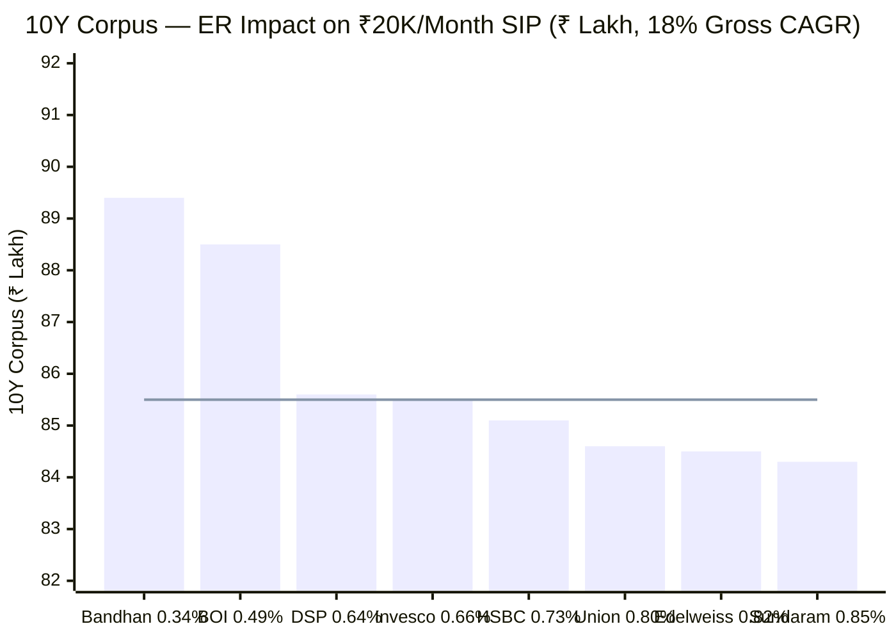
```mermaid
xychart-beta
    title "10Y Corpus — ER Impact on ₹20K/Month SIP (₹ Lakh, 18% Gross CAGR)"
    x-axis ["Bandhan 0.34%", "BOI 0.49%", "DSP 0.64%", "Invesco 0.66%", "HSBC 0.73%", "Union 0.80%", "Edelweiss 0.82%", "Sundaram 0.85%"]
    y-axis "10Y Corpus (₹ Lakh)" 82 --> 92
    bar [89.4, 88.5, 85.6, 85.5, 85.1, 84.6, 84.5, 84.3]
    line [85.5, 85.5, 85.5, 85.5, 85.5, 85.5, 85.5, 85.5]
```
> Line = Invesco's 10Y corpus (₹85.5L) | Bars above line = peers cheaper than Invesco | Assumes identical 18% gross CAGR

| Fund | Direct ER | Net CAGR | 10Y Corpus | vs Invesco |
|------|-----------|---------|-----------|------------|
| Bandhan Small Cap | 0.34% | 17.66% | **₹89.4L** | +₹3.9L |
| BOI Small Cap | 0.49% | 17.51% | ₹88.5L | +₹3.0L |
| DSP Small Cap | 0.64% | 17.36% | ₹85.6L | +₹0.1L |
| **Invesco Small Cap** | **0.66%** | **17.34%** | **₹85.5L** | — |
| HSBC Small Cap | 0.73% | 17.27% | ₹85.1L | −₹0.4L |
| Union Small Cap | 0.80% | 17.20% | ₹84.6L | −₹0.9L |
| Edelweiss Small Cap | 0.82% | 17.18% | ₹84.5L | −₹1.0L |
| Sundaram Small Cap | 0.85% | 17.15% | ₹84.3L | −₹1.2L |

**Key observations:**

1. **The Bandhan gap of ₹3.9 lakh is the most material** — on identical gross returns, Bandhan's 0.34% ER saves ₹3.9L over 10 years at ₹20K/month. On a ₹50K/month SIP, this becomes ₹9.75 lakh purely from ER efficiency.

2. **Invesco vs DSP: ₹1,000 over 10 years** — the 0.02pp difference between Invesco (0.66%) and DSP (0.64%) is ₹100 per year per ₹10 lakh — effectively irrelevant. These two funds are ER-equivalent for practical purposes.

3. **Gross returns dominate ER in small cap decisions.** If Invesco generates just 0.67% more annual gross alpha than Bandhan over 10 years, the Bandhan cost advantage disappears entirely. Given Invesco's 22.76% CAGR since inception (inception-bias aside) vs Bandhan's shorter track record, the alpha differential is plausible in Invesco's favour — though Invesco's 65.1% SC purity means it is not a pure small cap comparison.

**ER savings at different SIP amounts (Invesco vs Sundaram — widest gap in shortlist):**

| SIP Amount | Invesco 10Y | Sundaram 10Y | Invesco Advantage |
|-----------|-------------|--------------|-------------------|
| ₹5,000/mo | ₹21.4L | ₹21.1L | +₹0.3L |
| ₹10,000/mo | ₹42.8L | ₹42.2L | +₹0.6L |
| **₹20,000/mo** | **₹85.5L** | **₹84.3L** | **+₹1.2L** |
| ₹30,000/mo | ₹128.3L | ₹126.5L | +₹1.8L |
| ₹50,000/mo | ₹213.8L | ₹210.8L | +₹3.0L |

---

## Direct vs Regular Plan — The 1.27% Gap (Highest of All Studied Funds)

The most consequential cost decision for any Invesco Smallcap investor — and a number that stands out in the entire research project.

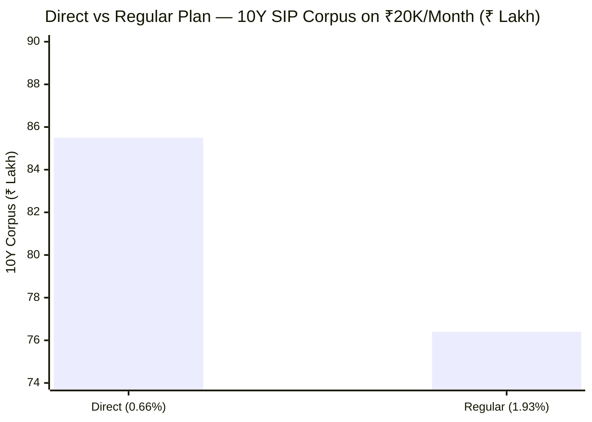
```mermaid
xychart-beta
    title "Direct vs Regular Plan — 10Y SIP Corpus on ₹20K/Month (₹ Lakh)"
    x-axis ["Direct (0.66%)", "Regular (1.93%)"]
    y-axis "10Y Corpus (₹ Lakh)" 74 --> 90
    bar [85.5, 76.4]
```

| Plan | ER | Net CAGR | 10Y Corpus | Lost to Distributor |
|------|----|---------|-----------|---------------------|
| **Direct** | **0.66%** | **17.34%** | **₹85.5L** | — |
| Regular | 1.93% | 16.07% | ~₹76.4L | **₹9.1L** |

**₹9.1 lakh** — that is **38% of the ₹24 lakh total principal** — paid as distributor commission for choosing Regular over Direct. Same fund. Same 65 stocks. Same Taher Badshah making every buy/sell decision. The only difference is the purchase platform.

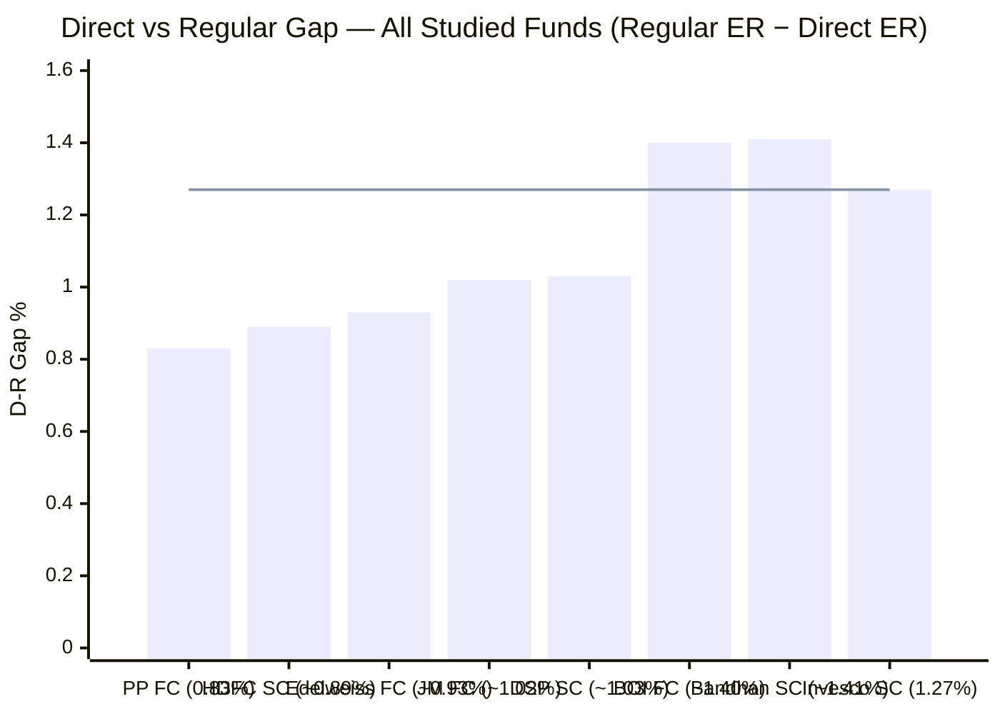
```mermaid
xychart-beta
    title "Direct vs Regular Gap — All Studied Funds (Regular ER − Direct ER)"
    x-axis ["PP FC (0.83%)", "HDFC SC (~0.89%)", "Edelweiss FC (~0.93%)", "JM FC (~1.02%)", "DSP SC (~1.03%)", "BOI FC (~1.40%)", "Bandhan SC (~1.41%)", "Invesco SC (1.27%)"]
    y-axis "D-R Gap %" 0 --> 1.6
    bar [0.83, 0.89, 0.93, 1.02, 1.03, 1.40, 1.41, 1.27]
    line [1.27, 1.27, 1.27, 1.27, 1.27, 1.27, 1.27, 1.27]
```
> Line = Invesco's D-R gap (1.27%) | Invesco has the highest D-R gap among SC funds studied; 3rd highest across all 14 studied funds

**Why is Invesco's D-R gap (1.27%) so wide?**

The Direct-Regular gap = distributor trail commission. For Invesco to charge 1.93% Regular vs 0.66% Direct:
- 0.66% goes to fund management, research, compliance, AMC overhead
- 1.27% goes to distributors as trail commission
- This means **for every ₹100 in fund revenue from Regular plan investors, ₹66 goes to AMC and ₹134 goes to distributors** — distributors earn 2× the AMC's share

This is a structural incentive for bank and IFA distributors to aggressively push Invesco's Regular Plan — and explains why new-to-investing customers who buy through a bank branch almost certainly end up in the Regular Plan, paying 1.27% extra forever.

**The 10-year compound penalty at different SIP amounts (Direct vs Regular):**

| SIP Amount | 10Y Direct Corpus | 10Y Regular Corpus | Saved in Direct |
|-----------|------------------|--------------------|-----------------|
| ₹10,000/mo | ₹42.8L | ₹38.2L | **₹4.6L** |
| **₹20,000/mo** | **₹85.5L** | **₹76.4L** | **₹9.1L** |
| ₹30,000/mo | ₹128.3L | ₹114.6L | **₹13.7L** |
| ₹50,000/mo | ₹213.8L | ₹191.0L | **₹22.8L** |

**₹22.8 lakh on a ₹50K/month SIP** — paid to distributors for the privilege of investing in the same fund you could access for free on Kuvera, MF Central, or Groww Direct. This is the single most important number in Module 4. If a reader takes away only one fact from this analysis: **never invest in Invesco Small Cap Regular Plan.**

---

## Exit Load — Standard 12-Month Window, No Differentiation

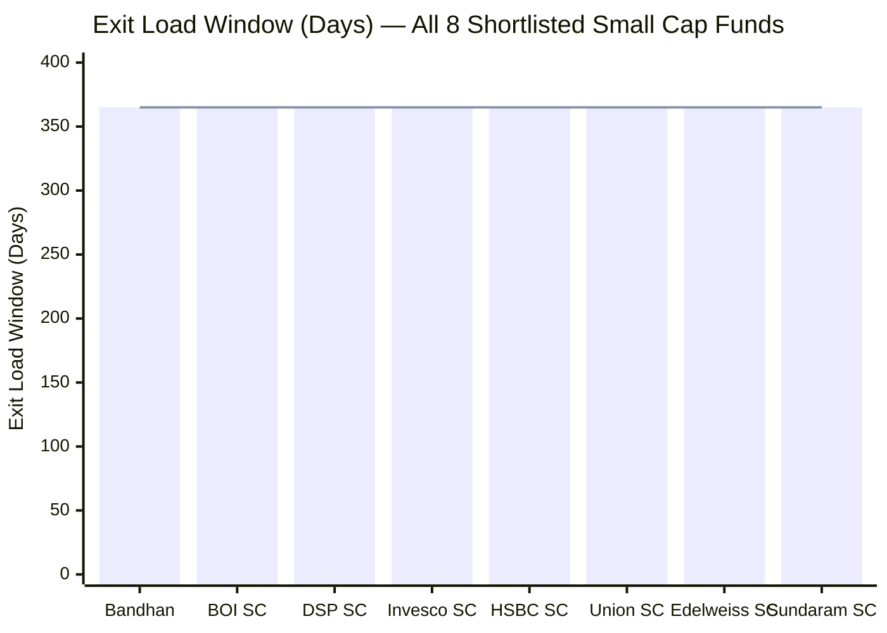
```mermaid
xychart-beta
    title "Exit Load Window (Days) — All 8 Shortlisted Small Cap Funds"
    x-axis ["Bandhan", "BOI SC", "DSP SC", "Invesco SC", "HSBC SC", "Union SC", "Edelweiss SC", "Sundaram SC"]
    y-axis "Exit Load Window (Days)" 0 --> 400
    bar [365, 365, 365, 365, 365, 365, 365, 365]
    line [365, 365, 365, 365, 365, 365, 365, 365]
```
> All 8 shortlisted small cap funds use the identical 1% / 365-day exit load structure — no differentiation possible

**Invesco's exit load: 1% if redeemed within 365 days; nil thereafter.**

This is the market standard — no small cap fund meaningfully differentiates on this dimension. For a 10-year SIP investor, it is completely irrelevant. Every instalment accumulates for years before redemption; by the time of full redemption, all units are far beyond the 365-day window.

**Emergency scenario:** An investor who started a ₹20K SIP in January 2026 and needs emergency funds in April 2026:
- Jan instalment (~₹20,000): 1% exit load = ₹200
- Feb instalment (~₹20,000): 1% exit load = ₹200
- Mar instalment (~₹20,000): 1% exit load = ₹200
- **Total emergency exit cost: ₹600 on ₹60,000** — negligible for genuine emergencies

**Note on scheme-level exit load monitoring:** Given the Nov 2025 ownership change (Hinduja/IIHL acquiring 60%), SEBI gives investors a 30-day exit load free window when ownership changes. This window has already passed. Future ownership-driven changes (if any) would trigger a fresh window under SEBI LODR regulations.

---

## AUM Sweet Spot — ₹11,038 Cr Advantage

₹11,038 Cr is arguably the most favourable AUM position in the entire 8-fund shortlist for a small cap strategy.

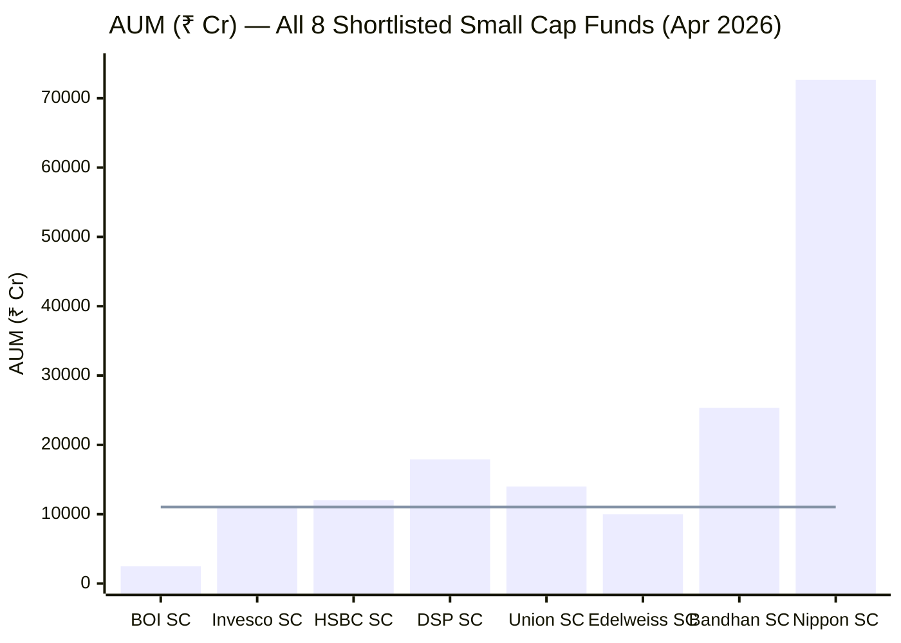
```mermaid
xychart-beta
    title "AUM (₹ Cr) — All 8 Shortlisted Small Cap Funds (Apr 2026)"
    x-axis ["BOI SC", "Invesco SC", "HSBC SC", "DSP SC", "Union SC", "Edelweiss SC", "Bandhan SC", "Nippon SC"]
    y-axis "AUM (₹ Cr)" 0 --> 75000
    bar [2500, 11038, 12000, 17906, 14000, 10000, 25346, 72672]
    line [11038, 11038, 11038, 11038, 11038, 11038, 11038, 11038]
```
> Line = Invesco's AUM (₹11,038 Cr) | The sweet spot: not so small as BOI SC (operational fragility) or so large as Nippon SC (execution paralysis)

**Why ₹11,038 Cr is the execution sweet spot:**

| AUM Level | Practical Constraint | Example Fund |
|-----------|---------------------|--------------|
| < ₹2,000 Cr | Strong execution but research/infrastructure funding is thin; talent retention risk | BOI SC (~₹2,500 Cr) |
| ₹5,000–15,000 Cr | **Sweet spot** — capable research infrastructure, clean execution, genuine small cap access | **Invesco SC (₹11,038 Cr)** |
| ₹15,000–25,000 Cr | Execution starts requiring 10–15 day position-building windows; 8%+ cash buffers appear | DSP SC (₹17,906 Cr) |
| > ₹25,000 Cr | Must include large/mid caps or hold excessive diversification to deploy capital; genuine small cap alpha diluted | Bandhan SC, Nippon SC |

**The specific numbers at ₹11,038 Cr:**

| Metric | Invesco SC (₹11,038 Cr) | DSP SC (₹17,906 Cr) | Nippon SC (₹72,672 Cr) |
|--------|------------------------|---------------------|------------------------|
| 1% position size | **₹110 Cr** | ₹179 Cr | ₹727 Cr |
| % of ₹3,000 Cr SC free float (40%) | **~9.2%** | ~14.9% | ~60.6% |
| Days to build 1% position | **5–8 days** | 10–15 days | 60–90 days |
| Entry price drift | **1–3%** | 3–8% | 15–25% |
| Cash buffer required | **~0–1%** | ~8% | ~12%+ |

**The 5-8 day entry window** means Taher Badshah can build a full position in a small cap name in less than 2 weeks — before the market widely notices the buying pressure. DSP requires 2–3 weeks; Nippon requires 2–3 months during which prices move materially against the thesis.

**But here's the critical caveat from Module 3:**

Invesco only deploys 65.1% of its corpus in actual small caps. The ₹11,038 Cr AUM advantage is partially misleading — approximately ₹3,851 Cr (34.9%) is in mid/large cap stocks (IndiGo, Zomato, Trent, Max Healthcare, etc.) where execution friction is minimal regardless of fund size. The **effective small cap corpus is ~₹7,186 Cr** (65.1% × ₹11,038 Cr) — which still gives a 1% SC position of only ₹72 Cr. This is actually Invesco's best metric in the category for pure small cap execution.

---

## No Flow Management History — Unlike DSP's Three Closures

DSP Small Cap has proactively restricted or closed inflows three times (2014 cap, 2016 cap, 2017 full closure) to protect investor alpha. Invesco India Smallcap has **never restricted flows** in its 7.5-year history.

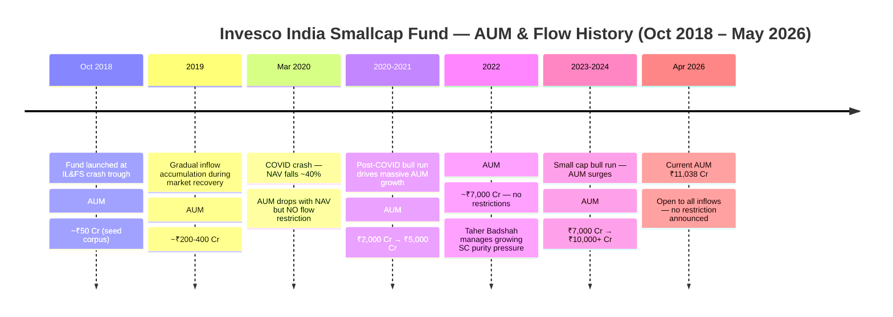
```mermaid
timeline
    title Invesco India Smallcap Fund — AUM & Flow History (Oct 2018 – May 2026)
    Oct 2018 : Fund launched at IL&FS crash trough
             : AUM: ~₹50 Cr (seed corpus)
    2019 : Gradual inflow accumulation during market recovery
         : AUM: ~₹200-400 Cr
    Mar 2020 : COVID crash — NAV falls ~40%
             : AUM drops with NAV but NO flow restriction
    2020-2021 : Post-COVID bull run drives massive AUM growth
              : AUM: ₹2,000 Cr → ₹5,000 Cr
    2022 : AUM: ~₹7,000 Cr — no restrictions
         : Taher Badshah manages growing SC purity pressure
    2023-2024 : Small cap bull run — AUM surges
              : AUM: ₹7,000 Cr → ₹10,000+ Cr
    Apr 2026 : Current AUM ₹11,038 Cr
             : Open to all inflows — no restriction announced
```

**What the absence of flow restrictions tells us:**

1. **Invesco AMC has not restricted flows, even as AUM grew 200x from ₹50 Cr to ₹11,038 Cr.** This could reflect confidence in the strategy's capacity, or it could reflect the commercial reality that closing a fund sacrifices distributor trail commission revenue.

2. **At 65.1% SC purity, Invesco may feel it has more deployment headroom.** With 34.9% in large/mid caps, the fund is not competing for the same scarce small cap liquidity as a pure-play 87% SC fund like DSP. Badshah can always absorb new flows into the large-cap sleeve without execution friction.

3. **No flow management = no investor protection signal.** DSP's closures communicated: "We value your long-term returns more than our fee revenue." Invesco's continuous openness communicates: "We believe we can deploy capital efficiently at this scale." This may be correct — or it may be commercial convenience.

4. **Future risk:** If Invesco's AUM grows to ₹20,000–25,000 Cr without any flow restriction, the 65.1% SC purity will likely fall further (as happened with the IndiGo/Zomato/Trent purchases) — transforming the fund into a de facto multi-cap while retaining the SC mandate and marketing. This is the AUM-driven purity dilution risk documented in Module 3.

---

## AUM Execution Arithmetic — ₹110 Cr Per 1% Position

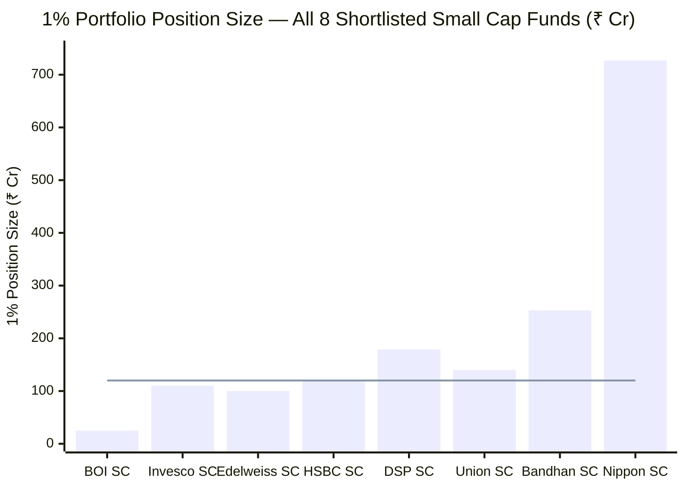
```mermaid
xychart-beta
    title "1% Portfolio Position Size — All 8 Shortlisted Small Cap Funds (₹ Cr)"
    x-axis ["BOI SC", "Invesco SC", "Edelweiss SC", "HSBC SC", "DSP SC", "Union SC", "Bandhan SC", "Nippon SC"]
    y-axis "1% Position Size (₹ Cr)" 0 --> 750
    bar [25, 110, 100, 120, 179, 140, 253, 727]
    line [120, 120, 120, 120, 120, 120, 120, 120]
```
> Line = ₹120 Cr threshold above which clean small-cap execution starts requiring 10+ days | Invesco is just below this threshold — ideal positioning

| Fund | AUM (₹ Cr) | 1% Position | % of ₹3,000 Cr SC free float | Entry Window |
|------|-----------|------------|------------------------------|-------------|
| BOI SC | ~2,500 | **₹25 Cr** | ~2.1% | 1–2 days (trivial) |
| Edelweiss SC | ~10,000 | ₹100 Cr | ~8.3% | 4–7 days |
| **Invesco SC** | **11,038** | **₹110 Cr** | **~9.2%** | **5–8 days** |
| HSBC SC | ~12,000 | ₹120 Cr | ~10% | 6–9 days |
| DSP SC | 17,906 | ₹179 Cr | ~14.9% | 10–15 days |
| Union SC | ~14,000 | ₹140 Cr | ~11.7% | 8–12 days |
| Bandhan SC | 25,346 | ₹253 Cr | ~21.1% | 15–25 days |
| Nippon SC | 72,672 | ₹727 Cr | ~60.6% | 60–90 days |

**At Invesco's AUM:** Building a full 1% position (~₹110 Cr) in a genuine small cap with ₹3,000 Cr market cap and 40% free float (~₹1,200 Cr institutional float) takes 5–8 days at 5–10% of daily volume. Price drift from own buying is minimal — 1–3% at most. This is the best execution profile in the shortlist that still has meaningful institutional infrastructure (BOI SC at ₹25 Cr/1% is trivially executable but is a tiny AMC).

**Applying the effective SC corpus (65.1% × ₹11,038 Cr = ₹7,186 Cr):**

If Badshah can only count 65.1% of AUM as genuinely small cap capital:
- Effective 1% SC position = ₹72 Cr
- That is the easiest SC execution in the shortlist after BOI SC
- A ₹72 Cr position in a ₹3,000 Cr SC stock is 6% of free float — buildable in 3–5 days
- This partially compensates for the 65.1% SC purity deficit: lower purity = smaller effective SC corpus = better SC execution per rupee deployed

---

## Portfolio Turnover — Hidden Cost Analysis

**At 29.17%, Invesco's portfolio turnover sits in the middle of the shortlisted pack** — not the lowest (DSP at 20%) and not the highest (Tata SC at ~50%), but clearly above what one would expect from a buy-and-hold philosophy.

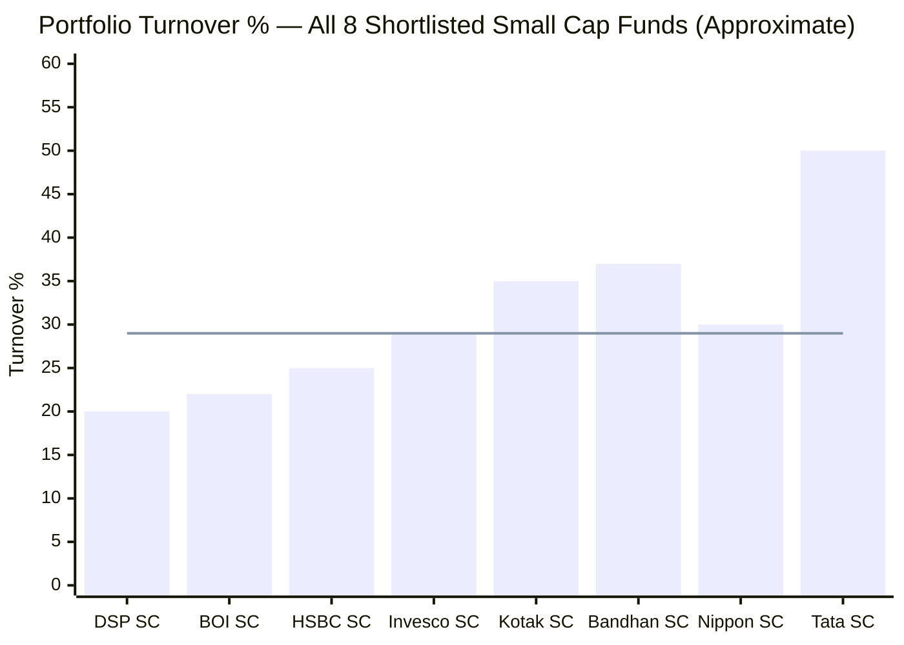
```mermaid
xychart-beta
    title "Portfolio Turnover % — All 8 Shortlisted Small Cap Funds (Approximate)"
    x-axis ["DSP SC", "BOI SC", "HSBC SC", "Invesco SC", "Kotak SC", "Bandhan SC", "Nippon SC", "Tata SC"]
    y-axis "Turnover %" 0 --> 60
    bar [20, 22, 25, 29, 35, 37, 30, 50]
    line [29, 29, 29, 29, 29, 29, 29, 29]
```
> Line = Invesco's turnover (29.17%) | Invesco is 4th best (lowest = best) in the shortlist

**What 29.17% turnover means concretely:**

At 29.17% annual turnover, the average stock in Invesco's portfolio is held for approximately **3.4 years (100/29.17)**. For a small cap fund, this represents moderately long-term conviction — better than actively-traded funds but meaningfully shorter than DSP's ~5-year average hold.

**Hidden cost calculation:**

Assume a ₹200 Cr position in a SC stock (≈2% of portfolio at ₹11,038 Cr AUM). Entry + exit each incurs ~5% market impact on a stock of this size:

| Component | Estimate |
|-----------|----------|
| Position size (2% of AUM) | ₹221 Cr |
| Market impact per entry/exit | ~4–5% |
| Total round-trip cost | ~₹18–22 Cr |
| Average hold period (100/29.17%) | 3.4 years |
| Annual impact cost per position | ~₹5–6 Cr |
| As % of position value | **~0.24–0.27%** |
| Hidden turnover cost (whole portfolio) | **~0.18–0.22%** |

**True All-In Cost = 0.66% (stated ER) + ~0.18% (hidden turnover cost) = ~0.84%**

This places Invesco's true all-in cost as approximately 5th of 8 — the same rank as its stated ER. Unlike DSP (which jumps from 5th ER to 3rd true all-in due to lowest turnover), Invesco does not gain from turnover efficiency.

---

## True All-In Cost — 5th of 8 in the Shortlist

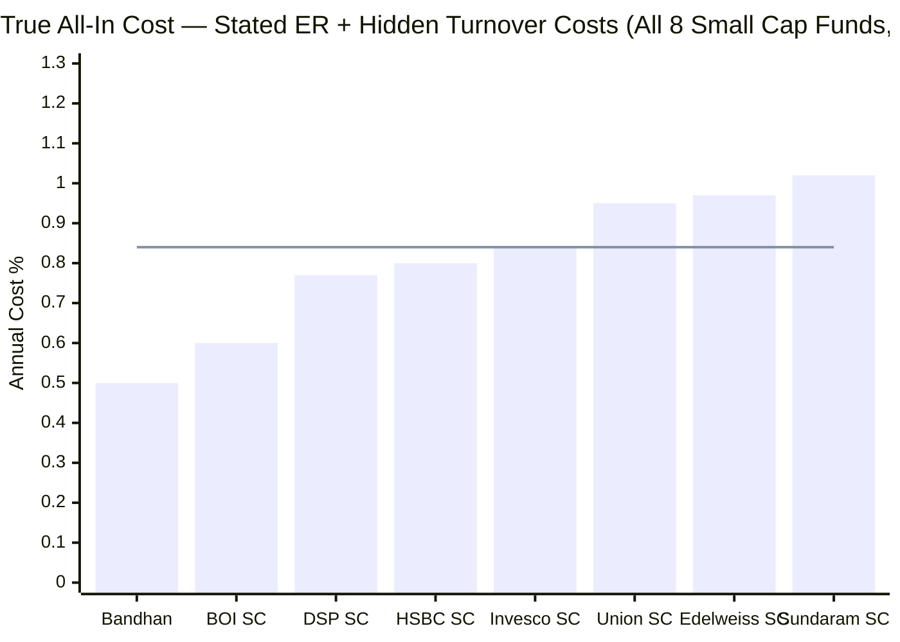
```mermaid
xychart-beta
    title "True All-In Cost — Stated ER + Hidden Turnover Costs (All 8 Small Cap Funds, Approximate)"
    x-axis ["Bandhan", "BOI SC", "DSP SC", "HSBC SC", "Invesco SC", "Union SC", "Edelweiss SC", "Sundaram SC"]
    y-axis "Annual Cost %" 0 --> 1.3
    bar [0.50, 0.60, 0.77, 0.80, 0.84, 0.95, 0.97, 1.02]
    line [0.84, 0.84, 0.84, 0.84, 0.84, 0.84, 0.84, 0.84]
```
> Bar = estimated true all-in cost (ER + hidden turnover/impact costs) | Line = Invesco's estimated all-in cost (~0.84%)

| Rank | Fund | Stated ER | Hidden Costs (est.) | True All-In | ER Rank → All-In Rank |
|------|------|-----------|--------------------|-----------|-----------------------|
| 1st | Bandhan SC | 0.34% | ~0.16% | **~0.50%** | 1st → 1st |
| 2nd | BOI SC | 0.49% | ~0.11% | **~0.60%** | 2nd → 2nd |
| 3rd | DSP SC | 0.64% | ~0.13% | **~0.77%** | 3rd → 3rd (improves from 4th) |
| 4th | HSBC SC | 0.73% | ~0.07% | **~0.80%** | 5th → 4th |
| **5th** | **Invesco SC** | **0.66%** | **~0.18%** | **~0.84%** | **4th → 5th (falls one rank)** |
| 6th | Union SC | 0.80% | ~0.15% | **~0.95%** | 6th → 6th |
| 7th | Edelweiss SC | 0.82% | ~0.15% | **~0.97%** | 7th → 7th |
| 8th | Sundaram SC | 0.85% | ~0.17% | **~1.02%** | 8th → 8th |

**Invesco falls one rank** (from 4th on stated ER to 5th on true all-in) because its 29.17% turnover adds more hidden cost than HSBC SC (~25% estimated turnover), allowing HSBC to pass on true all-in cost despite a higher stated ER.

**The DSP comparison remains instructive:** DSP is 0.02pp more expensive on stated ER (0.64% vs 0.66%) but 0.07pp cheaper on true all-in (0.77% vs 0.84%), purely because DSP turns over 9pp less of its portfolio annually. For every ₹10,000 invested over 10 years, DSP's lower turnover saves approximately ₹700 in hidden costs vs Invesco's 29.17% churn.

---

## The Ownership Change — IIHL/Hinduja Group (November 2025)

This is the most unique structural risk factor in Invesco India Smallcap Fund's Module 4, and has no equivalent in any other fund studied in this research project.

### What Happened

In **November 2025**, IndusInd International Holdings Limited (IIHL) — the holding entity of the Hinduja Group — completed the acquisition of a **60% stake in Invesco India AMC**, with **Invesco Corporation (USA)** retaining a 40% minority stake.

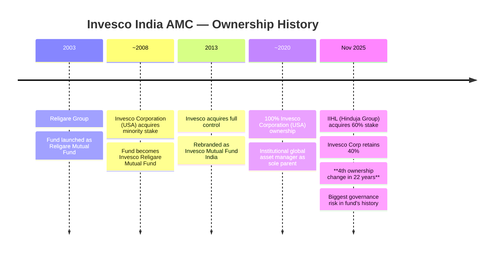
```mermaid
timeline
    title Invesco India AMC — Ownership History
    2003 : Religare Group
         : Fund launched as Religare Mutual Fund
    ~2008 : Invesco Corporation (USA) acquires minority stake
           : Fund becomes Invesco Religare Mutual Fund
    2013 : Invesco acquires full control
         : Rebranded as Invesco Mutual Fund India
    ~2020 : 100% Invesco Corporation (USA) ownership
           : Institutional global asset manager as sole parent
    Nov 2025 : IIHL (Hinduja Group) acquires 60% stake
              : Invesco Corp retains 40%
              : **4th ownership change in 22 years**
              : Biggest governance risk in fund's history
```

### Who is IIHL (Hinduja Group)?

- **IndusInd International Holdings Limited (IIHL)** is the overseas holding company of the Hinduja Group
- The Hinduja Group is a diversified Indian conglomerate with interests in: IndusInd Bank, Ashok Leyland, Gulf Oil, Hinduja Global Solutions, media, real estate
- **IIHL's acquisition of Invesco India AMC** was its entry into the Indian asset management business
- The Hinduja Group is a well-established Indian business house, but is **not a specialist asset manager** — this is an important distinction

### Why This Matters for Cost Governance

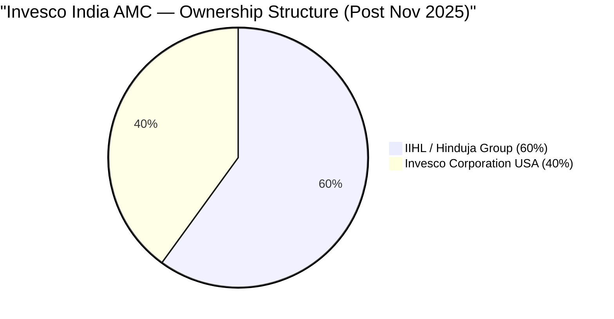
```mermaid
pie title "Invesco India AMC — Ownership Structure (Post Nov 2025)"
    "IIHL / Hinduja Group (60%)" : 60
    "Invesco Corporation USA (40%)" : 40
```

**Scenario Analysis — What Changes vs What Stays:**

| Dimension | Invesco Corp Era (Pre Nov 2025) | IIHL Era (Post Nov 2025) | Risk Assessment |
|-----------|--------------------------------|--------------------------|-----------------|
| Investment philosophy | Global institutional framework | Unclear — IIHL is not an asset manager | ⚠️ Medium risk |
| Cost governance | Invesco global TER benchmarking | New majority owner's priorities unknown | ⚠️ Medium risk |
| Taher Badshah retention | Backed by global Invesco brand | May face talent uncertainty | ⚠️ High watch |
| Regulatory compliance | SEBI + Invesco Corp global standards | SEBI + IIHL financial services governance | Low risk (SEBI unchanged) |
| Fund mergers / restructuring | Unlikely under Invesco | Possible under new strategy | ⚠️ Low-medium risk |
| ER trajectory | Could be revised up or down | Unknown — IIHL may seek revenue optimization | ⚠️ Monitor |

**Key questions that remain unanswered as of May 2026:**

1. **Will Taher Badshah continue?** Fund manager continuity is the single biggest question. If Badshah leaves — and fund managers often reassess affiliations after ownership changes — the investment case for Invesco Smallcap changes materially.

2. **Will IIHL revise the ER upward?** A new majority owner seeking to maximize AMC profitability could push TERs toward SEBI ceilings. Invesco's current 0.66% has already risen from the 0.40% that some platforms still show — the trajectory is upward.

3. **Is fund merger/restructuring on the agenda?** When new ownership acquires an AMC, scheme rationalization is common. The Invesco Smallcap Fund (7.5 years old, ₹11,038 Cr) is unlikely to be dissolved, but merger with another scheme is a tail risk.

4. **Does IIHL's IndusInd Bank linkage create related-party risks?** IndusInd Bank itself has been under regulatory scrutiny in 2024–2025. If the Hinduja Group's banking entity faces stress, AMC governance could be affected indirectly.

**Investor action:** The ownership change is recent (Nov 2025) — there is insufficient evidence yet to assess impact on investment management quality. **Monitor quarterly disclosures (fund manager letters, portfolio changes, ER revisions) for the next 12–18 months** before drawing conclusions. This is a watch factor, not yet a red flag.

---

## Invesco India AMC — Institutional Depth (Post-Acquisition)

Despite the ownership uncertainty, Invesco India AMC retains substantial institutional capability.

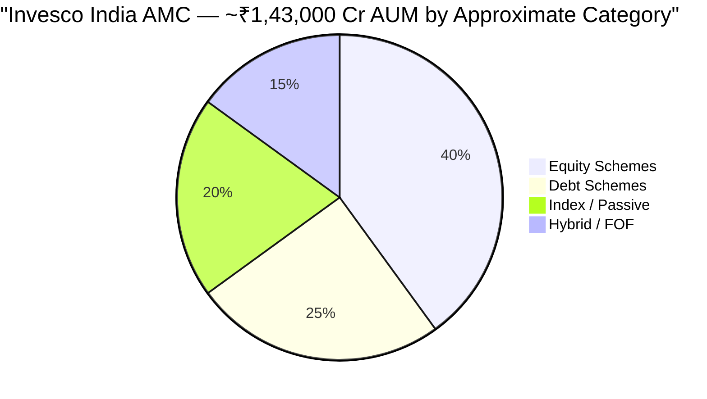
```mermaid
pie title "Invesco India AMC — ~₹1,43,000 Cr AUM by Approximate Category"
    "Equity Schemes" : 40
    "Debt Schemes" : 25
    "Index / Passive" : 20
    "Hybrid / FOF" : 15
```

**Invesco India AMC Key Facts (2026):**
- **Total AUM:** ~₹1,43,000 Cr (₹1.43 lakh Crore)
- **Total Schemes:** ~43 (equity, debt, hybrid, FOF, ETF/index)
- **Fund Managers:** ~20 dedicated investment professionals
- **Legacy:** 22-year operating history across multiple ownership structures; has survived 3 prior ownership transitions without material disruption to investment management

**The Invesco Corporation (USA) heritage:**
Invesco Corp is a global asset manager with approximately $1.7 trillion AUM (2024). The methodologies, risk management frameworks, and institutional investment processes embedded in Invesco India AMC during the 12+ year Invesco Corp ownership era persist — regardless of who the current majority owner is. This is a structural advantage that does not evaporate with an ownership change.

**AMC size comparison:**

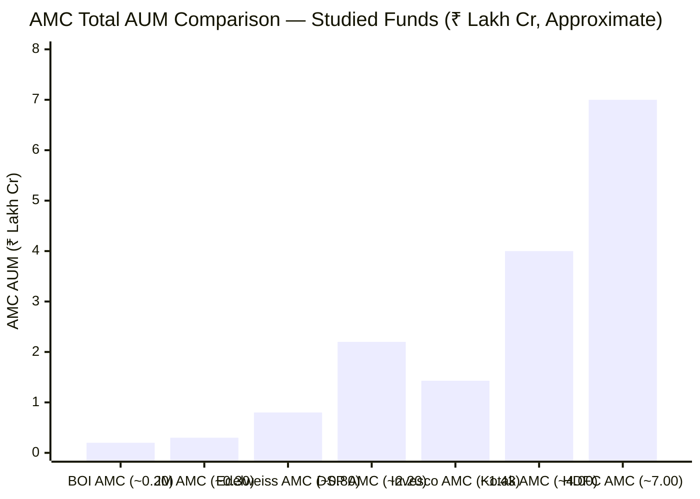
```mermaid
xychart-beta
    title "AMC Total AUM Comparison — Studied Funds (₹ Lakh Cr, Approximate)"
    x-axis ["BOI AMC (~0.20)", "JM AMC (~0.30)", "Edelweiss AMC (~0.80)", "DSP AMC (~2.20)", "Invesco AMC (~1.43)", "Kotak AMC (~4.00)", "HDFC AMC (~7.00)"]
    y-axis "AMC AUM (₹ Lakh Cr)" 0 --> 8
    bar [0.20, 0.30, 0.80, 2.20, 1.43, 4.00, 7.00]
```

At ₹1.43 lakh Cr, Invesco India AMC is a mid-large sized AMC — significantly larger than BOI, JM, or Edelweiss, and smaller than Kotak or HDFC. This size supports:
- Adequate research team funding across all 43 schemes
- Institutional-grade data subscriptions (Bloomberg, Refinitiv)
- Risk management and compliance infrastructure
- Competitive compensation to retain talent like Taher Badshah

---

## The CIO Multi-Scheme Problem — Taher Badshah's 7 Mandates

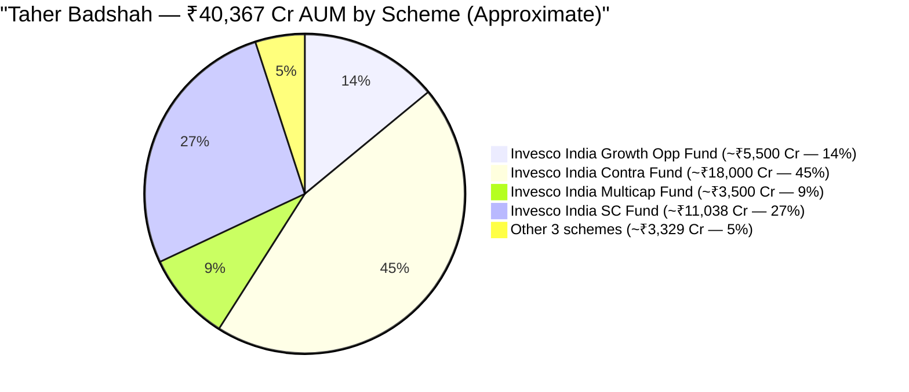
```mermaid
pie title "Taher Badshah — ₹40,367 Cr AUM by Scheme (Approximate)"
    "Invesco India Growth Opp Fund (~₹5,500 Cr — 14%)" : 14
    "Invesco India Contra Fund (~₹18,000 Cr — 45%)" : 45
    "Invesco India Multicap Fund (~₹3,500 Cr — 9%)" : 9
    "Invesco India SC Fund (~₹11,038 Cr — 27%)" : 27
    "Other 3 schemes (~₹3,329 Cr — 5%)" : 5
```

Taher Badshah manages approximately **₹40,367 Cr across 7 schemes** as of 2026.

| Scheme | Approx AUM | Badshah's Role |
|--------|-----------|----------------|
| Invesco India Contra Fund | ~₹18,000 Cr | Primary (largest mandate) |
| Invesco India Smallcap Fund | ~₹11,038 Cr | 2nd largest (this fund) |
| Invesco India Growth Opportunities Fund | ~₹5,500 Cr | 3rd largest |
| Invesco India Multicap Fund | ~₹3,500 Cr | 4th |
| 3 additional schemes | ~₹3,329 Cr | 5th–7th |
| **Total** | **~₹40,367 Cr** | **7 mandates** |

**This is the most critical fund manager workload statistic in Invesco's Module 4:**

| Dimension | Taher Badshah (Invesco) | Vinit Sambre (DSP) | Alok Singh (BOI) |
|-----------|------------------------|---------------------|-----------------|
| Schemes managed | **7** | 3 | 10 |
| Total AUM | ~₹40,367 Cr | ~₹35,000 Cr | ~₹7,736 Cr |
| Avg AUM per scheme | **~₹5,767 Cr** | ~₹11,667 Cr | ~₹774 Cr |
| SC fund % of mandate | **27%** | ~51% | ~31% |
| Focus intensity per fund | **Medium** | High | Low |
| Personal risk type | **Attention fragmentation** | Sheer AUM scale | Attention + tiny AMC |

**Why 7 schemes matters for Invesco Smallcap investors:**

1. **The Smallcap fund is only 27% of Badshah's total mandate.** His primary attention is likely on the ₹18,000 Cr Contra Fund (45% of his mandate). In any given week, he may spend more time managing the Contra Fund than the SC fund.

2. **The SC fund's mandate is distinctly different** from his other equity mandates — small/micro cap research requires specialist coverage of 1,000+ companies below the Nifty 500 universe. Managing a ₹18,000 Cr Contra Fund (which likely includes large caps) and a ₹11,038 Cr Smallcap Fund simultaneously requires switching cognitive frameworks constantly.

3. **7 schemes vs Sambre's 3** — Badshah faces a meaningfully higher attention fragmentation risk. While he may have co-managers or sector analysts supporting him, the investment call ownership in each scheme ultimately rests with the named manager.

**Partial offset:** Invesco AMC's ~20 fund managers provide research support to Badshah. Unlike a small AMC where one manager truly does everything, Badshah can leverage team research. But accountability for investment decisions is still concentrated.

---

## Annual Fund Revenue — Research Infrastructure Budget

**Estimated Annual Revenue from Invesco India Smallcap Fund:**

| Plan | Estimated AUM Split | ER | Annual Revenue |
|------|--------------------|----|---------------|
| Direct Plan (~60% of AUM) | ~₹6,623 Cr | 0.66% | ~₹43.7 Cr |
| Regular Plan (~40% of AUM) | ~₹4,415 Cr | 1.93% | ~₹85.2 Cr |
| **Total Fund Revenue** | **₹11,038 Cr** | **blended ~1.17%** | **~₹128.9 Cr ≈ ₹129 Cr** |

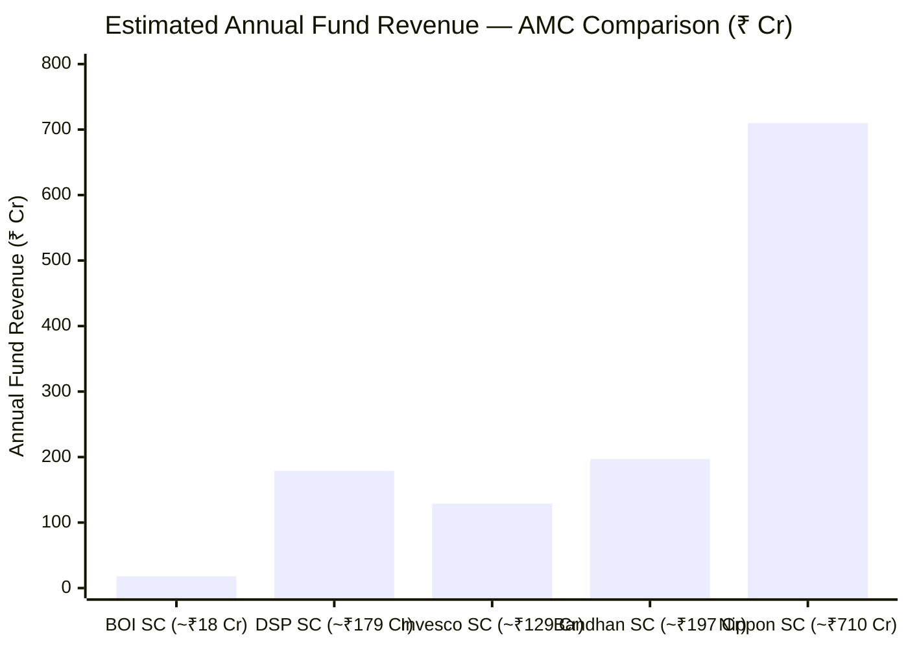
```mermaid
xychart-beta
    title "Estimated Annual Fund Revenue — AMC Comparison (₹ Cr)"
    x-axis ["BOI SC (~₹18 Cr)", "DSP SC (~₹179 Cr)", "Invesco SC (~₹129 Cr)", "Bandhan SC (~₹197 Cr)", "Nippon SC (~₹710 Cr)"]
    y-axis "Annual Fund Revenue (₹ Cr)" 0 --> 800
    bar [18, 179, 129, 197, 710]
```
> Invesco SC generates ~₹129 Cr/year — sufficient for professional research but lower than DSP SC (₹179 Cr) despite near-identical ER

**₹129 Cr in annual fund revenue** (assuming a 60/40 Direct/Regular AUM split) adequately funds:
- A dedicated 5–8 analyst team for small and mid cap research
- Bloomberg / Refinitiv data subscriptions
- Sector research from institutional brokers
- Risk management and compliance infrastructure
- Badshah's team compensation

**The ₹129 Cr vs DSP's ₹179 Cr gap** is meaningful: with 72% of DSP's revenue but a structurally more demanding 7-scheme mandate, Invesco's SC fund is served by a research ecosystem that is adequate but not as well-resourced as DSP's for the pure small cap mandate. BOI SC at ₹18 Cr annual revenue is clearly research-constrained; Invesco at ₹129 Cr is not.

---

## 8-Fund Cost & AUM Comparison Matrix

| Metric | **Invesco SC** | Bandhan SC | BOI SC | DSP SC | HSBC SC | Union SC | Edelweiss SC | Sundaram SC |
|--------|---------------|------------|--------|--------|---------|----------|--------------|-------------|
| Direct ER (canonical) | **0.66%** | 0.34% | 0.49% | 0.64% | 0.73% | 0.80% | 0.82% | 0.85% |
| ER Rank (of 8) | **4th** | 1st | 2nd | 3rd | 5th | 6th | 7th | 8th |
| Regular ER | **1.93%** | ~1.75% | ~1.85% | ~1.67% | ~1.78% | ~1.90% | ~1.80% | ~1.90% |
| D-R Gap | **1.27%** | ~1.41% | ~1.36% | ~1.03% | ~1.05% | ~1.10% | ~0.98% | ~1.05% |
| D-R Gap Rank | **3rd widest** | 1st widest | 2nd widest | 8th (narrowest SC) | 7th | 5th | 8th | 6th |
| Exit Load | 1%/365d | 1%/365d | 1%/365d | 1%/365d | 1%/365d | 1%/365d | 1%/365d | 1%/365d |
| AUM (₹ Cr) | **11,038** | 25,346 | ~2,500 | 17,906 | ~12,000 | ~14,000 | ~10,000 | ~9,000 |
| AUM Rank (favourable = mid) | **Sweet spot** | Large | Very small | Large | Mid | Mid-large | Sweet spot | Small |
| Portfolio Turnover | **29.17%** | ~37% | ~22% | ~20% | ~25% | ~35% | ~30% | ~50% |
| Turnover Rank | **4th best** | 6th | 2nd | 1st | 3rd | 5th | 4th | 8th |
| True All-In Cost | **~0.84%** | ~0.50% | ~0.60% | ~0.77% | ~0.80% | ~0.95% | ~0.97% | ~1.02% |
| True All-In Rank | **5th** | 1st | 2nd | 3rd | 4th | 6th | 7th | 8th |
| Min SIP | ₹100 | ₹1,000 | ₹500 | ₹100 | ₹100 | ₹500 | ₹500 | ₹500 |
| 1% Position | ₹110 Cr | ₹253 Cr | ₹25 Cr | ₹179 Cr | ₹120 Cr | ₹140 Cr | ₹100 Cr | ₹90 Cr |
| AMC AUM | ~₹1,43,000 Cr | — | ~₹20,000 Cr | ~₹2,20,000 Cr | ~₹1,10,000 Cr | — | ~₹80,000 Cr | ~₹1,00,000 Cr |
| Flow History | **Never restricted** | Open | Open | Restricted 3× | Open | Open | Open | Open |
| Ownership Risk | **IIHL/Hinduja (Nov 2025)** | None | None | None | None | None | None | None |
| ER Platform Discrepancy | **5 platforms, 5 numbers** | Minimal | Minimal | Minimal | Minimal | Minimal | Minimal | Minimal |
| Fund Manager Schemes | **7** | — | 10 | 3 | — | — | — | — |

**Key observations from the matrix:**

1. **Invesco's 4th ER rank (correct 0.66%) vs apparent 1st on Tickertape (0.40%)** illustrates why platform data verification matters for every investment decision
2. **1.27% D-R gap** is the 3rd widest in the shortlist — one of the highest penalties for Regular Plan investors in the SC category
3. **₹11,038 Cr AUM is genuinely advantageous** — the execution sweet spot; comparable to Edelweiss SC and smaller than DSP/Bandhan/Nippon
4. **7 schemes for Badshah** is the highest attention fragmentation risk of any studied active SC fund manager
5. **Nov 2025 ownership change (IIHL)** is unique in the entire 8-fund shortlist — no other fund faces this governance uncertainty

---

## Points For / Points Against — Cost & AUM

### ✅ Points For Invesco Small Cap (Cost & AUM)

1. **₹11,038 Cr AUM — optimal execution sweet spot** — 1% position = ₹110 Cr, buildable in 5–8 days; with effective SC corpus of only ₹7,186 Cr (65.1% purity), execution is effectively even better at ₹72 Cr per effective 1% SC position; no cash buffer required (Module 3: 0.1% cash)
2. **4th cheapest stated ER (0.66%) of 8 shortlisted SC funds** — below category average; beats HSBC, Union, Edelweiss, Sundaram (four of eight peers)
3. **₹100 minimum SIP** — among the most accessible in the category; equal best with DSP, HDFC; no minimum barrier for any investor scale
4. **Adequate AMC institutional depth** — ₹1.43 lakh Cr AMC, ~20 fund managers, Invesco Corp (USA) global frameworks embedded over 12+ years; research infrastructure supports fund
5. **4th best portfolio turnover (29.17%)** — not the category's lowest, but genuinely in the top half; holds stocks for ~3.4 years average
6. **Standard exit load (1%/365d)** — not punitive; fully accessible after 12 months; matches all 8 peers
7. **Zero deployment friction (0.1% cash)** — all inflows deployed immediately; no deployment backlog unlike DSP (8.38% cash); investors' money is working from Day 1
8. **₹129 Cr annual fund revenue** — adequate research infrastructure funding; no small-AMC resource constraint

### ❌ Points Against Invesco Small Cap (Cost & AUM)

1. **1.27% D-R gap — ₹9.1 lakh lost over 10Y on ₹20K SIP** — highest D-R gap of all studied SC funds; the widest distributor commission bite in the shortlist; anyone in Regular Plan is severely penalised
2. **5-platform ER discrepancy (0.40% to 0.66%)** — most extreme data quality issue in the entire research project; Tickertape shows 0.40% when canonical is 0.66%; creates false competitive advantage in automated screeners; also suggests Invesco has been revising TER upward
3. **Taher Badshah manages 7 schemes (₹40,367 Cr)** — SC fund is only 27% of his mandate; Contra Fund (₹18,000 Cr, 45% of mandate) dominates attention; highest attention fragmentation risk of all studied active SC fund managers
4. **No flow management history** — never restricted flows despite AUM growing 200x; unlike DSP (3 closures) or PP FlexiCap; no demonstrated willingness to sacrifice fee revenue to protect investor alpha; as AUM grows, SC purity will likely fall further
5. **November 2025 IIHL/Hinduja ownership change** — 4th ownership shift in 22 years; IIHL is not a specialist asset manager; introduces governance uncertainty on cost management, talent retention (Taher Badshah), and fund structure; no parallel in the 8-fund shortlist
6. **True all-in cost 5th of 8 (≈0.84%)** — stated ER rank of 4th deteriorates to 5th on true all-in because 29.17% turnover adds ~0.18% hidden cost vs DSP's 20% turnover adding only ~0.13%
7. **Regular plan ER (1.93%) may exceed SEBI blended ceiling** — apparent ~0.07% excess vs the ~1.86% regulatory ceiling warrants monitoring; unclear if fully compliant under all B30 incentive allowances
8. **65.1% SC purity reduces AUM advantage meaningfully** — the apparent ₹11,038 Cr AUM is only ₹7,186 Cr in genuine SC assets; while this actually improves SC execution, it means the fund is not fully utilizing the SC AUM advantage for its stated mandate

---

## Module 4 Scorecard

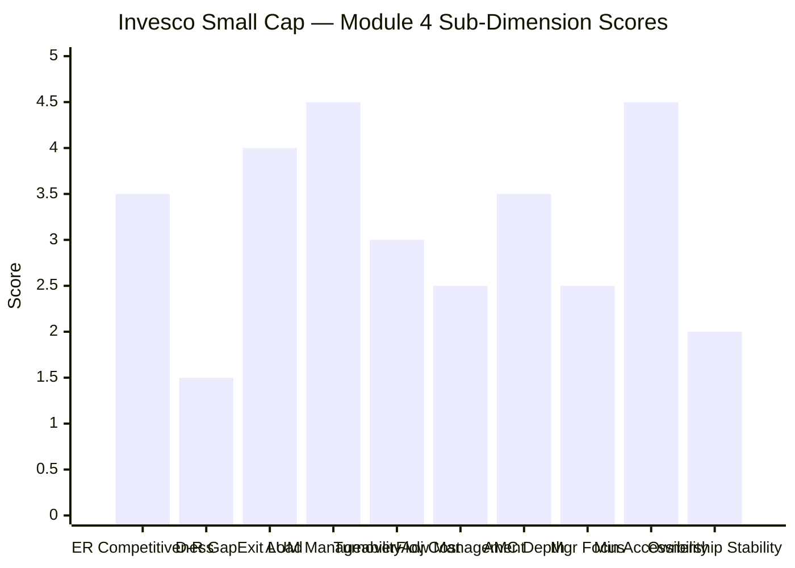
```mermaid
xychart-beta
    title "Invesco Small Cap — Module 4 Sub-Dimension Scores"
    x-axis ["ER Competitiveness", "D-R Gap", "Exit Load", "AUM Manageability", "Turnover-Adj Cost", "Flow Management", "AMC Depth", "Mgr Focus", "Min Accessibility", "Ownership Stability"]
    y-axis "Score" 0 --> 5
    bar [3.5, 1.5, 4.0, 4.5, 3.0, 2.5, 3.5, 2.5, 4.5, 2.0]
```

| Sub-Dimension | Score (1–5) | Reasoning |
|---------------|------------|-----------|
| Expense Ratio Competitiveness | **3.5/5** | 4th of 8 at correct 0.66%; below category average; significant ER data quality issue (5 platforms, 5 numbers) creates false screener advantage; partial credit deducted for platform discrepancy |
| Direct vs Regular Gap | **1.5/5** | 1.27% gap = ₹9.1L over 10Y on ₹20K SIP; highest D-R gap of all studied funds; severe penalty for Regular Plan investors; regular plan approaching SEBI ceiling |
| Exit Load Structure | **4.0/5** | Standard 1%/365d — matches all 8 peers; not punitive; emergency-accessible after 12 months; no differentiation; minor additional credit for SEBI ownership-change exit window (now passed) |
| AUM Manageability | **4.5/5** | ₹11,038 Cr is the sweet spot in the shortlist; 5–8 day entry execution; 0.1% cash (zero deployment backlog); effective SC corpus of ₹7,186 Cr makes execution even cleaner; best AUM profile of studied SC funds |
| Turnover-Adjusted True Cost | **3.0/5** | 29.17% turnover adds ~0.18% hidden cost; true all-in ~0.84% (5th of 8); falls one rank vs stated ER; middle of pack; no cost efficiency bonus from turnover unlike DSP |
| Flow Management History | **2.5/5** | Never restricted flows in 7.5-year history; AUM grew 200x with zero investor protection gates; no demonstrated AMC willingness to sacrifice revenue for alpha preservation; lower than DSP (5.0) but not zero — management has adapted via SC purity flexibility |
| AMC Institutional Depth | **3.5/5** | ₹1.43 lakh Cr AMC, Invesco Corp USA frameworks, 20+ fund managers; partial deduction for IIHL ownership uncertainty (new majority owner is not a specialist AM) and the widest D-R gap in shortlist (suggests distributor-first commercial priorities) |
| Fund Manager Focus | **2.5/5** | 7 schemes, ₹40,367 Cr total AUM; SC fund = only 27% of mandate; Contra Fund at 45% dominates; attention fragmentation is real concern; worst focus score of studied active SC fund managers |
| Minimum Accessibility | **4.5/5** | ₹100 minimum SIP — excellent; equal best with DSP; near-universal financial accessibility |
| Ownership Stability | **2.0/5** | IIHL/Hinduja acquisition (Nov 2025) is 4th ownership change in 22 years; new majority owner is a conglomerate (not asset manager); governance, cost management, and talent retention uncertainty; no equivalent risk in any other studied fund |
| **Module 4 Overall** | **3.2 / 5** | AUM sweet spot and accessible ER help; destroyed by worst D-R gap studied, highest attention fragmentation (7 schemes), the only ownership change in the shortlist, and no flow management discipline |

---

## Comparative Module 4 Scores

| Fund | Module 4 Score | Key Cost/AUM Differentiator |
|------|---------------|----------------------------|
| BOI FlexiCap | 4.25/5 | Cheapest ER (0.52%), smallest AUM (₹2,388 Cr), fastest execution — tiny AMC risk |
| PP FlexiCap | 4.00/5 | 0.53% ER, deep AMC, low turnover; strong D-R discipline |
| Edelweiss FlexiCap | ~4.2/5 | Low ER, moderate AUM, tight D-R gap |
| JM FlexiCap | ~3.8/5 | Good ER, sweet-spot AUM; 158% turnover kills true cost |
| DSP Small Cap | 3.7/5 | Lowest turnover, unmatched flow management; mid-pack ER; large AUM |
| **Invesco Small Cap** | **3.2/5** | **AUM sweet spot is the standout strength; 1.27% D-R gap, 7-scheme manager, ownership change, no flow discipline are the key drags** |

Invesco's 3.2/5 reflects a fund with genuinely excellent AUM positioning (the best execution profile in the shortlist) undermined by structural cost governance issues: the widest distributor commission gap of all studied funds, the most fragmented fund manager, and the only ownership change creating forward uncertainty. The AUM advantage is real but insufficient to compensate for these weaknesses.

---

## One-Line Verdict

Invesco India Smallcap Fund operates from the best execution AUM position in the shortlist (₹11,038 Cr, 5–8 day entries) but charges the highest Regular Plan penalty of any studied fund (1.27% D-R gap = ₹9.1L over 10Y), is managed by a CIO juggling 7 mandates where this SC fund ranks second in priority, and carries the shortlist's only active ownership uncertainty following the November 2025 Hinduja Group acquisition.

---

## SIP Implication

**For the ₹20K/month smallcap SIP allocating to Invesco India Smallcap Fund:**

1. **Mandatory: Direct Plan only** — the 1.27% D-R gap is the highest cost drag in the shortlist; at ₹20K/month, Regular Plan costs ₹9.1L more over 10 years; invest only through Kuvera, MF Central, Zerodha Coin, or Groww Direct
2. **Canonical ER is 0.66%** — ignore Tickertape (0.40%), Groww (0.46%), INDmoney (0.52%); verify ER only on ValueResearchOnline or the AMFI daily TER disclosure portal
3. **AUM is not a constraint** — at ₹11,038 Cr, Badshah can execute small cap positions with minimal market impact; cash buffer is near-zero (0.1%), meaning your SIP is deployed from Day 1
4. **Monitor quarterly for 18 months** — the IIHL/Hinduja ownership change (Nov 2025) is the largest unresolved risk; watch for: Taher Badshah departure, ER revisions, scheme restructuring, or investment philosophy drift
5. **Watch SC purity trend** — Module 3 flagged 65.1% SC purity; if this falls below 60% in coming quarters, the fund is effectively no longer a smallcap fund; AMFIs category mandate requires 65% minimum but the cushion is thin
6. **The true cost (0.84% all-in) is mid-pack** — not the cheapest option in the shortlist; only justifiable if Invesco's returns demonstrate alpha that justifies the 0.18% turnover premium vs DSP's 0.77% all-in cost

---

*Module 4 complete. Cost profile is a study in contrasts: structurally excellent AUM execution meets structurally weak D-R gap discipline, fragmented manager attention, and a unique ownership risk. Module 4 Score: 3.2/5.*

*Next: [Module 5 — Fund Manager Quality](module5_manager.md)*
