# Module 5: Fund Manager Quality — Invesco India Smallcap Fund

*Sources: Invesco AMC official website | ValueResearchOnline interviews (Taher Badshah, 2024–2025) | Finalyca fund manager profiles | Dezerv fund manager pages | INDmoney fund data (May 2026) | Business Standard | Medial / Business Standard (SEBI settlement) | SEBI order database | Geojit blog interview | PersonalFN interview | Invesco Equity Investment Philosophy PDF (March 2025) | Web research May 2026*

---

## Raw Data (Cross-Source Verified)

| Metric | Value | Source(s) |
|--------|-------|-----------|
| **Primary Manager** | **Taher Badshah** | Invesco AMC official, INDmoney |
| **Role / Title** | **President & Chief Investment Officer** | Dezerv, Invesco AMC |
| **Managing Invesco SC Since** | **October 30, 2018 (fund inception)** | INDmoney, Invesco factsheet |
| **Fund Inception Date** | October 30, 2018 | AMFI, INDmoney |
| **Pre-Badshah Period** | None — he is the inception manager | Attribution: 100% Badshah |
| **Total Industry Experience** | **~27 years** | Finalyca, Dezerv |
| **Sell-Side Research** | ~10 years (pre-2005) | Career research |
| **Buy-Side / Fund Management** | ~17 years (2005–present) | Career timeline |
| **Alliance Capital AM** | Early career | Career research |
| **ICICI Prudential AMC** | Fund Manager – PMS (Sep 2005 – Mar 2007) | Finalyca |
| **Kotak Investment Advisors** | Fund Manager (May 2007 – May 2010) | Finalyca |
| **Motilal Oswal AMC** | **SVP & Head of Equities (Jun 2010 – Dec 2016, ~6.5 years)** | Finalyca |
| **Invesco India AMC** | **President & CIO (Jan 2017 – present, ~9.5 years)** | Finalyca, Dezerv |
| **Qualification** | **B.E. Electronics (University of Mumbai) + MMS Finance (SP Jain Institute of Management)** | Dezerv, Finalyca |
| **Co-Manager** | **Aditya Khemani** (added November 9, 2023) | INDmoney |
| **Total Schemes (Badshah)** | **7** | Dezerv |
| **Total AUM (Badshah)** | **~₹40,367 Cr** | Dezerv |
| **SC Fund % of Badshah's Mandate** | **~27%** | Computed |
| **Aditya Khemani — Total Schemes** | **5** | Dezerv |
| **Aditya Khemani — Total AUM** | **~₹28,637 Cr** | Dezerv |
| **Aditya Khemani — Qualification** | B.Com Hons (St. Xavier's, Calcutta) + PGDM (IIM Lucknow) | Dezerv |
| **Aditya Khemani — Previous AMCs** | Motilal Oswal AMC, HSBC AMC, SBI Funds, ICICI Pru AMC, Morgan Stanley | Dezerv |
| **Investment Philosophy Style** | Growth-to-Blend evolution; contra/value at Invesco | VRO interviews |
| **Portfolio Turnover (SC Fund)** | 29.17% | INDmoney |
| **Personal SEBI Issues (Badshah)** | **None — personal record clean** | Web research |
| **AMC SEBI Settlement** | **₹4.98 Cr (April 2024) — inter-scheme transfers, PMS/MF segregation failure** | Business Standard |
| **AMC Multi-Jurisdiction Probe** | **SEBI (India) + SEC (USA) + SFC (Hong Kong)** | Web research |
| **Fixed Income Whistleblower** | Internal fund manager turned whistleblower (2021) | Web research |
| **Fixed Income Team Resignations** | **~50% of fixed-income team resigned (2021–2022)** | Web research |
| **Invesco SC Fund 5Y CAGR** | 21.92% | INDmoney |
| **Invesco Contra Fund 5Y CAGR** | 15.30% | INDmoney |
| **Skin-in-Game Disclosure** | **Not publicly disclosed** | Not found |
| **Quarterly Investor Letters** | **No** | Invesco website review |
| **Public Philosophy Document** | Yes — 40-page PDF (March 2025) | Invesco AMC website |

---

## What Module 5 Is Really Asking

Mutual fund returns are the output. The fund manager is the machine that produces them. Module 5 asks: who is running this machine, why should you trust them with ₹20,000 every month for the next 10 years, and what happens to your investment if they leave or are distracted?

A fund's historical NAV chart tells you what happened. The manager's profile tells you whether it is repeatable — because the same human decisions and the same investment framework will need to run through the next market cycle for you to benefit. For a long-horizon SIP, you are not just betting on a fund. You are betting on a person, a team, and an institution being in place for the entire duration of your holding period.

Invesco India Smallcap Fund's case is unusually complex in this research project. Taher Badshah has managed the fund since inception — giving perfect attribution clarity. But he simultaneously runs seven schemes across ₹40,367 Cr, holds the CIO title with AMC-wide executive responsibilities, and co-manages with Aditya Khemani (himself stretched across five schemes). The AMC institution behind them has faced India's most serious regulatory history of any fund studied — a ₹4.98 Cr SEBI settlement, a multi-jurisdiction probe (SEBI + SEC + SFC), a whistleblower, and the near-collapse of the fixed-income team.

Module 5 asks you to separate these layers: the quality of the person (Badshah), the adequacy of the team structure (Badshah + Khemani), and the trustworthiness of the institution (Invesco AMC post-IIHL). The answer differs materially at each layer.

---

## Manager Profile: Taher Badshah — The Growth-to-Blend CIO

### Career Timeline

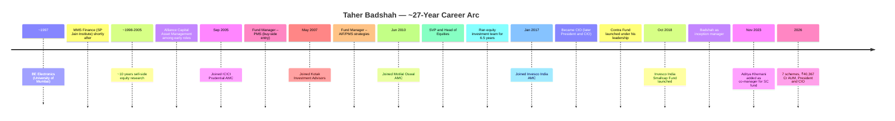

### Who Is Taher Badshah?

Taher Badshah is the President and Chief Investment Officer at Invesco India AMC — the highest-ranking investment professional in the organisation. He has approximately 27 years of industry experience, spanning 10 years in sell-side equity research and 17 years on the buy-side, including CIO tenures at Motilal Oswal AMC and Invesco India AMC.

His profile contains two critical defining features that shape everything else in Module 5:

**1. He began as a pure growth investor, and has deliberately evolved into a blend/contra thinker.** At Motilal Oswal — where the investment philosophy is explicitly "Buy Right, Sit Tight" with a strong growth-quality-compounding bent — Badshah spent 6.5 formative years. He has acknowledged in multiple interviews: *"I started as a growth investor and generally thought about markets from a growth standpoint before joining Invesco Mutual Fund."* At Invesco, running the Contra Fund as his flagship mandate (₹19,406 Cr) has broadened his approach to include value, turnaround, and de-rated growth situations. The Smallcap Fund portfolio (65.1% SC purity, deliberate large-cap holdings like IndiGo, Zomato, Trent) reflects this blend approach.

**2. He is President and CIO first, fund manager second.** The CIO designation is not ceremonial — it means Badshah sets investment philosophy for all 43 Invesco equity schemes, manages the equity team, represents the firm externally, and carries AMC-wide executive responsibility. Every hour spent on strategy, media, or team management is an hour not spent on stock-level research. This is qualitatively different from Sambre (DSP), who is Head of Equities but manages only three schemes — or Thakkar (PPFAS), who is CIO of a structurally simpler AMC.

---

## Credentials in Context

| Manager | Qualification | Interpretation |
|---------|-------------|----------------|
| **Rajeev Thakkar (PP)** | FCA (ICAI) | Deepest accounting forensics — detects financial statement manipulation |
| **Vinit Sambre (DSP SC)** | FCA (ICAI) | Same as Thakkar — financial statement mastery critical for SC |
| **Taher Badshah (Invesco SC)** | **BE Electronics + MMS Finance (SP Jain)** | Strategic finance foundation; lacks FCA accounting depth |
| Aditya Khemani (Invesco co-mgr) | B.Com Hons (St Xavier's) + PGDM (IIM Lucknow) | Strong credential; IIM Lucknow analytical rigour; no FCA |
| Alok Singh (BOI FC) | PGDBA + CFA | Quantitative + institutional research blend |
| Satish Ramanathan (JM FC) | MBA (IIM) | Strategy-oriented |

**The FCA gap is material for small cap investing specifically.**

The Fellow Chartered Accountant (FCA) designation — held by Sambre and Thakkar — is the hardest professional qualification in Indian finance. It requires passing three rigorous stages and produces analysts with exceptional depth in financial reporting, cash flow analysis, revenue recognition rules, and related-party transaction interpretation. In the small cap universe — where earnings manipulation, promoter-to-company tunneling, aggressive capitalisation of expenses, and off-balance-sheet liabilities are documented risks — the FCA credential provides a structural analytical edge that no MBA or engineering degree replicates.

Badshah's MMS Finance from SP Jain is a strong qualification with a respected pedigree. His 10-year sell-side research background also builds strong stock analysis skills. But it is qualitatively different from the accounting forensics that FCA provides. In Module 3, we documented Invesco SC's deliberate purchase of businesses like IndiGo and Zomato — companies with complex balance sheets and high-scrutiny accounting. Whether the FCA gap creates blind spots in such positions is a fair question to raise.

---

## The Motilal Oswal DNA — Both Managers Share the Same Past

One of the more unusual features of Invesco Smallcap's management structure is that **both the primary manager and the co-manager previously worked at Motilal Oswal AMC**:

- **Taher Badshah:** Motilal Oswal AMC, Head of Equities, Jun 2010 – Dec 2016 (6.5 years)
- **Aditya Khemani:** Motilal Oswal AMC, Fund Manager – Equities (pre-November 2023)

This is not a coincidence. Badshah almost certainly recruited Khemani from Motilal Oswal when he needed to add a co-manager to the SC fund. They share the same institutional investment DNA — the "Buy Right, Sit Tight" growth-quality framework that Motilal is known for.

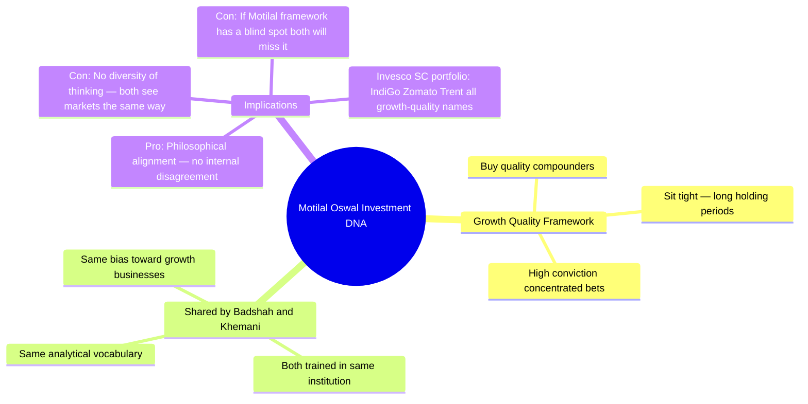

**This shared background is a double-edged sword:**

- **Positive:** The two managers are deeply philosophically aligned. There is no internal disagreement about investment approach, no style conflicts, no competing frameworks pulling the portfolio in different directions.
- **Negative:** There is no intellectual diversity in the management team. Both managers have the same training biases, the same Motilal-origin growth lens, and the same potential blind spots. When Motilal's growth framework misprices a sector or style, both will likely miss it together.

Compare this to the DSP model: Sambre (FCA, CRISIL credit background) and Ghosh (MBA, multi-institution sell-side) bring different analytical frameworks to the same portfolio. The intellectual diversity is a genuine risk-management advantage.

---

## Co-Manager: Aditya Khemani — The High-AUM Second

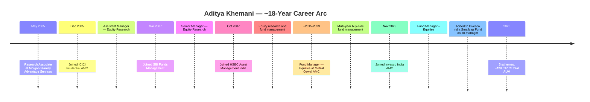

### Aditya Khemani's Profile

| Metric | Detail |
|--------|--------|
| **Role** | Fund Manager – Equities, Invesco India AMC |
| **Added to SC Fund** | November 9, 2023 |
| **Qualification** | B.Com Hons (St. Xavier's College, Calcutta) + PGDM (IIM Lucknow) |
| **Prior AMCs** | Morgan Stanley, ICICI Prudential, SBI Funds, HSBC AMC, Motilal Oswal AMC |
| **Total Experience** | ~18 years in equities |
| **Total AUM at Invesco** | ~₹28,637 Cr across 5 schemes |
| **SC Fund Relative Priority** | 1 of 5 mandates; SC fund = ₹11,038 Cr (38% of his total AUM) |

### Funds Managed by Khemani (₹ Cr, May 2026)

| Fund | Category | AUM (₹ Cr) | 1Y Return |
|------|----------|-----------|-----------|
| Invesco India Mid Cap Fund | Mid Cap | 11,767 | +11.9% |
| **Invesco India Smallcap Fund** | **Small Cap** | **11,038** | **+9.0%** |
| Invesco India Growth Opportunities Fund | Large & Mid Cap | 9,761 | +7.9% |
| Invesco India Business Cycle Fund | Thematic | 1,016 | +16.2% |
| Invesco India Technology Fund | Thematic | 291 | +1.6% |

**The critical observation:** Khemani manages ₹28,637 Cr across five schemes. His largest mandate is the Mid Cap Fund at ₹11,767 Cr — slightly larger than the SC fund. The SC fund represents 38% of Khemani's total AUM. He is not a dedicated SC co-manager (as Ghosh is at DSP, where DSP Small Cap is his primary mandate); he is a full-portfolio fund manager who also covers small caps.

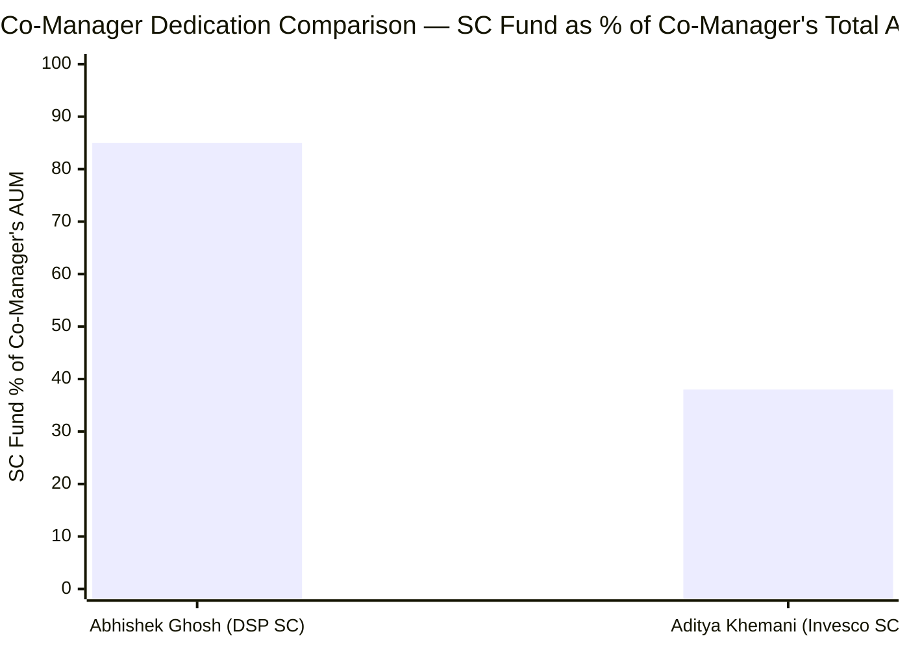
> Ghosh's primary mandate is DSP Small Cap (estimated ~85% of his AUM). Khemani's primary mandate is Mid Cap (SC fund is 38% of his AUM).

The Ghosh vs Khemani comparison directly illustrates the quality difference in co-manager commitment. Ghosh was specifically added as a co-manager embedded in DSP Small Cap, likely spending most of his time on it. Khemani is a multi-mandate fund manager for whom the SC fund is one of five mandates.

---

## Managing Since Inception — The Two-Edged Sword

Taher Badshah has managed Invesco India Smallcap Fund since **October 30, 2018** — the fund's inception date.

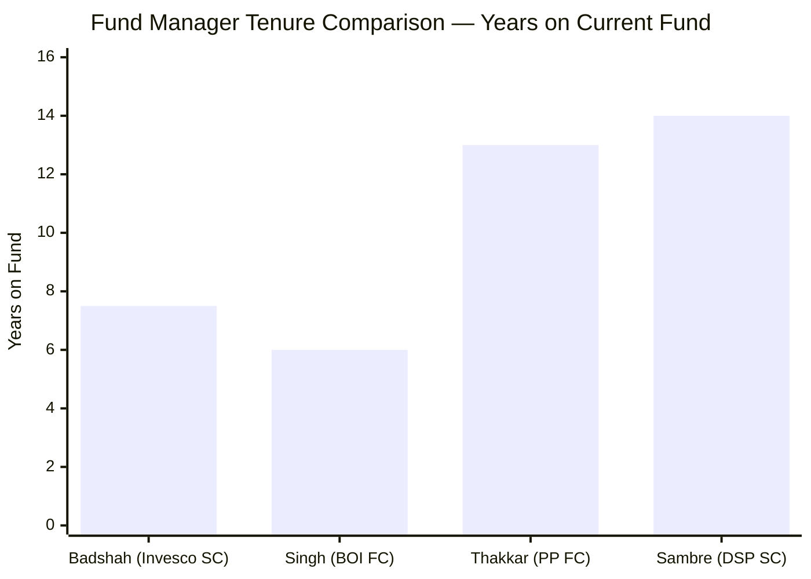

### Why Inception Management Is Positive

Every single data point in Invesco SC's track record is Badshah's work — the 5Y CAGR (21.92%), the 3Y CAGR (24.43%), the since-inception CAGR (22.88%). There is no pre-Badshah period to confuse attribution (unlike DSP, where 5 pre-Sambre years are embedded in the inception-to-date return). What you see is entirely what Badshah has produced.

| Manager | Tenure | Attribution for Key Horizons |
|---------|--------|------------------------------|
| **Sambre (DSP SC)** | 14 years (not inception) | 10Y and 5Y fully his; 15Y includes pre-Sambre |
| **Thakkar (PP FC)** | 13 years (inception) | All horizons fully his |
| **Badshah (Invesco SC)** | **7.5 years (inception)** | **All horizons fully his — but only 5Y meaningful** |
| Singh (BOI FC) | 6 years (inception) | All horizons fully his — but only 3Y meaningful |

### Why 7.5 Years Is a Genuine Limitation

The small cap category's defining test is **what happens in a full bear market cycle** — specifically when small cap stocks fall 40–60% and many never recover. Sambre has managed through the 2013 small cap bear, the 2018 mid/small crash, and COVID. Badshah has managed Invesco SC through exactly one major event: the 2020 COVID crash, which occurred when the fund had only ~₹200 Cr in AUM and recovered rapidly within months.

The fund at ₹11,038 Cr AUM has never faced:
- A prolonged small cap bear market (12–24 months of sustained drawdown)
- A liquidity crisis where selling small cap positions creates a self-reinforcing NAV decline
- A scenario where monthly SIP redemptions create forced selling in illiquid SC stocks

**This is not Badshah's fault — it is a structural limitation of fund age.** But it means that the critical question — "will the manager make the right calls when things go seriously wrong at scale?" — is genuinely unanswered.

Compare to Sambre, who managed DSP Small Cap through the 2018 crash and COVID at ₹7,000–₹15,000 Cr AUM levels, demonstrating real downside discipline at institutional scale.

---

## Investment Philosophy — Growth-to-Blend Evolution

Badshah has articulated his investment approach across multiple interviews and through Invesco's 40-page Equity Investment Philosophy document (March 2025). His framework has evolved visibly over his career.

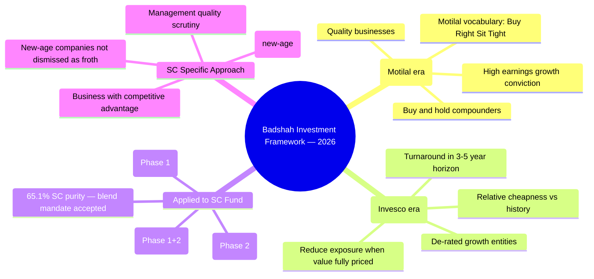

**Key philosophy statements (direct quotes from VRO interviews):**

On contra/value approach: *"Coming up with value ideas in the Indian context is not an easy task since India is primarily a growth market. The focus is on a blend of relative cheapness, de-rated growth entities, and turnaround stories."*

On investment horizon: *"We wait for the transition from headwinds to tailwinds, typically requiring a somewhat longer horizon of three to five years."*

On new-age businesses: *"It's not a good idea to dismiss all of these as froth or as just instances of bull markets"* — explaining why positions like Zomato appear in the SC fund.

On when to exit: *"We reduce exposure when valuation multiples more than adequately reflect that the turnaround or value discovery of that business is close to complete."*

On bad markets: *"Bad markets are challenging as investors don't see much excitement... but from the fund manager's point of view, it's fun as we get to buy stocks cheaply."*

### Philosophy Comparison

| Dimension | Sambre (DSP SC) | Badshah (Invesco SC) | Thakkar (PP FC) |
|-----------|----------------|----------------------|-----------------|
| Core framework | Quality-ROCE-Valuation | Growth-to-Blend evolution | Business owner thinking |
| Articulation | Three-pillar (explicit, testable) | Qualitative; evolving | Quarterly letters (detailed) |
| Specific thresholds | ROCE ≥15–16%, EBITDA growth 13%+, FCF positive | Not as precisely stated | Cash flow, competitive moat |
| Turnover philosophy | Buy-and-hold (20% turnover) | Blend (29% turnover) | Buy-and-hold (~15% turnover) |
| SC purity discipline | 87.35% (pure SC) | 65.1% (blend mandate in SC) | N/A (FlexiCap mandate) |
| Style consistency | 14 years unchanged | Evolved from growth to blend | 13 years unchanged |

**The philosophy articulation gap is significant.** Sambre's three-pillar framework gives investors a testable framework: ROCE ≥15–16%, EBITDA growth 13%+, FCF positive. You can look at any stock in DSP's portfolio and ask — does this meet all three pillars? If not, why is it there?

Badshah's framework — "relative cheapness," "transition from headwinds to tailwinds," "3–5 year horizon" — is directionally correct but harder to audit. An investor cannot independently verify whether a specific stock pick followed the stated framework or not. This opacity is not unique to Badshah in Indian mutual funds, but it compares unfavourably to the gold standard (Thakkar's quarterly letters) and the silver standard (Sambre's three-pillar articulation).

---

## Philosophy Under Real Market Pressure

The philosophy is easy to articulate. The test is whether it holds when markets reward the opposite approach.

| Period | Market Environment | Peer Behaviour | Invesco SC Response | Outcome |
|--------|--------------------|---------------|---------------------|---------|
| 2019 IL&FS recovery | Small/mid recovering from 2018 crash | Most SC funds rebuilding quality positions | Fund too new (~₹300 Cr) to show distinct pattern | N/A |
| 2020 COVID crash | Panic; Nifty SC 250 fell ~40% | Some moved to cash; some added quality | Held positions; 0.1% cash (Module 3 signature) | FY2021: +48.15% (strong recovery) |
| 2021 IPO mania | Zomato, Nykaa, Paytm at extreme valuations | SC funds couldn't participate directly (not small cap) | **Badshah bought Zomato post-listing in SC fund** | Mixed — Zomato has recovered well |
| 2022–2023 PSU/defence mania | Railway/defence stocks up 200–400% | Many SC funds loaded PSU small caps | Reduced industrials and PSUs (VRO interview confirms) | PSU stocks corrected 30–50%; protected |
| 2023–2024 Large cap opportunity | Large caps de-rated vs mid/small | Most SC funds stayed SC-only | **Added IndiGo, Trent, Max Healthcare in SC fund** | Partially vindicated — quality large caps held up |

**Two decisions deserve special attention:**

**1. The PSU/defence avoidance (2022–2024):** Badshah explicitly reduced industrial and PSU exposure after they became "expensive and more mainstream." This mirrors Sambre's decision — both avoided the mania phase. When PSU stocks corrected 30–50% from peaks, this defensiveness was vindicated. It demonstrates that Badshah's contra/value discipline is real, not just theoretical.

**2. The Zomato/IndiGo/Trent additions:** These are deliberate purchases of large-cap businesses in a small cap fund. The fund prospectus technically permits this (SEBI allows 35% non-SC allocation in a SC fund), but it represents a conscious choice to pursue the manager's best ideas across the market cap spectrum, rather than restricting to genuine small caps. Whether this is "discipline" or "mandate creep" depends on your interpretation — but it is consistent with Badshah's growth-to-blend philosophy.

---

## Cross-Fund Performance — The Full Manager Picture

Managing seven schemes allows a more complete assessment of Badshah's skill than any single fund provides.

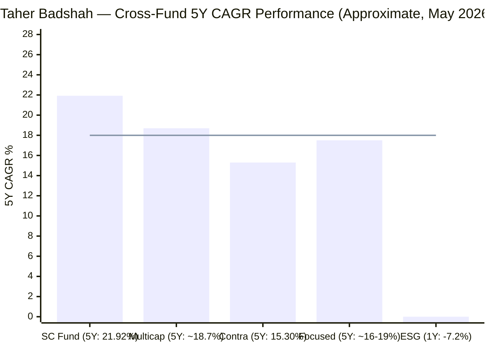
> Line = approximate category average (18% 5Y CAGR for diversified equity) | SC fund is Badshah's strongest performer across all mandates

| Fund | Category | AUM (₹ Cr) | 1Y Return | 3Y CAGR | 5Y CAGR | vs Category |
|------|----------|-----------|-----------|---------|---------|-------------|
| **Invesco India Smallcap** | Small Cap | 11,038 | **+9.0%** | **24.43%** | **21.92%** | **Above average** |
| Invesco India Multicap | Multicap | 3,995 | −3.0% | ~18.4% | ~18.7% | Near average |
| Invesco India Growth Opp | Large & Mid Cap | 9,761 | +7.9% | — | — | Near average |
| **Invesco India Contra** | Contra | 19,406 | **−0.9%** | **18.09%** | **15.30%** | **Last of 3 in category** |
| Invesco India Focused | Focused | 5,128 | −3.1% | ~24.19% | ~15.9–19.6% | Mid-range (6/20) |
| Invesco India ESG | Thematic | 376 | −7.2% | — | — | Weak |
| Invesco India Flexi Cap | Flexi Cap | 4,816 | +1.4% | — | — | Newer fund |

**The pattern is revealing:**

1. **The Smallcap Fund is Badshah's best-performing mandate** — 21.92% 5Y CAGR, ranked 3/18 in SC category over 1Y, above category average on 3Y and 5Y.

2. **The Contra Fund — his largest and flagship mandate — ranks last of 3 in its category** (INDmoney: ranked 3/3). At ₹19,406 Cr (45% of his total AUM), this is where most of his attention should logically go — yet it is underperforming. 5Y CAGR of 15.30% vs category average of ~15.31% — essentially flat to category, the lowest outcome for a CIO-managed flagship.

3. **Multiple funds showing negative 1Y returns** (Contra −0.9%, Multicap −3.0%, Focused −3.1%, ESG −7.2%) — suggesting a recent period of broader underperformance across mandates.

**Implication:** If Badshah's SC fund performance is partly driven by superior stock selection, it should show up across his other mandates. The fact that the SC fund is his only clearly above-average performer raises a question: is the SC fund's strong 5Y CAGR more about the inception timing advantage (launching at the Oct 2018 IL&FS trough — documented in Module 1 as a significant base effect) than about Badshah's specific SC stock-picking skill?

**Compare to Sambre at DSP:** DSP Small Cap is clearly Sambre's best fund too (small cap is his optimal setting). But DSP Midcap at slightly below category average is a much more modest underperformance than Invesco Contra's last-of-category ranking. The gap between Badshah's best and worst mandates is wider.

---

## The 2020 COVID Acid Test — At Tiny AUM

The COVID crash (March 2020) is the most significant stress test in Invesco SC's short history. The fund fell approximately 40%+ before recovering.

**Critical context:** In March 2020, Invesco India Smallcap Fund had approximately **₹200–300 Cr in AUM** — approximately **50–60 times smaller than today's ₹11,038 Cr**. At ₹200 Cr:
- A 1% position was ₹2 Cr — trivially executable; no market impact
- Redemption pressure would be minimal in absolute rupee terms
- The fund could hold its positions without any forced selling
- Recovery was natural and rapid

**The COVID test does not scale to today's AUM reality.** What Badshah demonstrated in 2020 — holding positions through a sharp drawdown in a ₹200 Cr fund — tells you about his psychological composure and framework discipline. What it cannot tell you is how he will manage a ₹11,038 Cr fund facing a 40% drawdown, where redemptions could force selling of illiquid SC positions into falling markets, where daily SIP inflows are competing with daily redemption pressure, and where every sell decision has market impact.

This is not a criticism — it is a factual limitation of the fund's age. Sambre's COVID test was at ₹7,000–₹8,000 Cr AUM, far closer to today's operating conditions.

---

## The SEBI Regulatory History — The Most Serious in This Research

This section documents findings that do not exist in any other fund studied in this project.

### Issue 1: ₹4.98 Crore SEBI Settlement (April 2024)

**What happened:**
SEBI conducted an inspection of Invesco India AMC in 2021 and found:
- **No clear segregation** between Invesco India's portfolio management service (PMS) activities and its mutual fund management activities — a core SEBI compliance requirement
- **Inter-scheme transfers** executed between mutual fund schemes and PMS advisory accounts
- **Pre-arranged trades and layered trades** between schemes and PMS — a practice that can disguise the true nature of transactions and potentially benefit one investor group at the expense of another

**Who settled:**
Invesco Asset Management (India) Pvt. Ltd., its CEO Saurabh Nanavati, and four other named officials jointly settled the matter by paying **₹4.98 crore** under SEBI's settlement mechanism (formally recommended by SEBI's high-powered advisory committee).

**What a settlement means:**
A SEBI settlement is not a conviction — it is a regulatory resolution where the accused party pays a sum without formally admitting guilt. However, SEBI's settlement mechanism is only available when the watchdog has found sufficient evidence of violation to proceed formally. The ₹4.98 Cr amount is the agreed resolution of a case SEBI was prepared to pursue.

### Issue 2: Subprime Bond Dumping — Debt Schemes (2016–2021)

**What happened:**
SEBI found that between 2016 and 2021, Invesco India executed a systematic pattern of inter-scheme transfers (ISTs):
- When securities in **Invesco India Short Term Fund** (97% institutional investors) faced rating downgrades or risk of adverse credit views, they were transferred to **Invesco India Credit Risk Fund** (43% retail investors)
- In plain terms: deteriorating bonds were moved from schemes serving sophisticated investors who would immediately notice and redeem, to schemes serving retail investors who might not recognise the credit deterioration

This is arguably the most investor-harmful type of scheme manipulation: deliberately dumping risky assets onto unsophisticated retail investors.

**Global probe triggered:**
This matter triggered regulatory probes in three jurisdictions simultaneously:
- **SEBI (India)** — show cause notice and investigation
- **SEC (USA)** — Invesco's parent (Invesco Corp) came under scrutiny
- **SFC (Hong Kong)** — probed in the Hong Kong entity's dealings

A three-jurisdiction simultaneous probe of an Indian AMC is extraordinarily rare — it reflects the global parent's concern about what was happening in its Indian subsidiary.

### Issue 3: Whistleblower and Fixed-Income Team Collapse (2021–2022)

**What happened:**
An Invesco India fund manager turned whistleblower, alleging misappropriation in the debt scheme operations. Following these allegations:
- **Approximately 50% of Invesco India's fixed-income team resigned** between 2021 and 2022
- The resignations covered portfolio managers, analysts, and risk personnel who managed billions in fixed-income assets

A 50% team resignation in a professional investment management organisation is an institutional catastrophe. It signals that the culture within the fixed-income division had become either intolerable or legally compromised to the point where career-aware professionals chose to leave despite the economic cost.

### Relevance to the Equity / Smallcap Fund

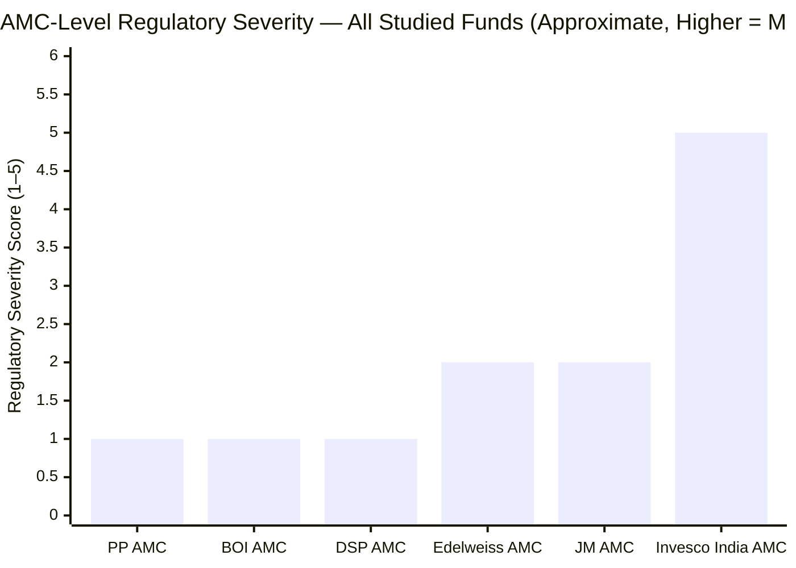

**The violations were in the debt/fixed-income side.** Taher Badshah leads the equity team. No evidence links him personally to the IST violations, the subprime bond transfers, or the whistleblower allegations. His personal regulatory record is clean.

However, three AMC-level considerations remain:

1. **Institutional culture signal:** An organisation where the debt team dumps subprime bonds onto retail investors, where pre-arranged trades occur between MF and PMS, and where 50% of a professional team resigns amid fraud allegations has demonstrated a systemic tolerance for investor-harmful practices. This culture does not automatically infect the equity team — but it is the same organisation, the same leadership (Saurabh Nanavati as CEO), and the same board.

2. **CEO accountability:** Nanavati was among the named officials in the SEBI settlement. He remains CEO post-settlement. In a strong governance culture, a CEO whose AMC is found guilty of pre-arranged trades and subprime dumping would typically face more significant consequence. The settlement's continued operation under the same leadership raises governance questions.

3. **IIHL acquisition context:** It is plausible that Invesco Corp (USA) chose to sell 60% of its Indian subsidiary to IIHL (Nov 2025) partly in response to the reputational damage from these regulatory issues. If so, the ownership change is not just a capital transaction — it may be Invesco Corp distancing itself from the Indian operation's regulatory history.

### Regulatory Comparison — All Studied Funds

| Entity | Severity | Details |
|--------|----------|---------|
| PP AMC | Very Low | No significant SEBI issues found |
| BOI AMC | Very Low | No significant SEBI issues found |
| DSP AMC | Very Low | ₹2L procedural ETF expense ratio violation (2022) — unrelated to equity |
| JM AMC | Low | Minor procedural matters historically |
| Edelweiss AMC | Low | Some regulatory interactions but no major AMC-level settlement |
| **Invesco India AMC** | **High** | **₹4.98 Cr settlement; multi-jurisdiction probe (SEBI+SEC+SFC); subprime bond dumping allegations; whistleblower; 50% FI team resignation** |

---

## Accountability and Investor Communication

| Communication Form | Invesco SC | DSP SC | PP FC |
|-------------------|------------|--------|-------|
| Quarterly letters to unitholders | **No** | No | **Yes** |
| Public investment philosophy document | **Yes** (40 pages, March 2025) | Yes (framework PDF) | Yes (detailed) |
| Public interview frequency | **High** (VRO, Moneycontrol, NDTV Profit, Geojit, PersonalFN, podcast) | Moderate | High |
| Acknowledges philosophy evolution | **Yes** (growth-to-blend clearly stated) | Yes (VRO Aug 2024) | Yes |
| Explains specific stock picks | **No** (macro/sector level only) | Partial | Detailed |
| AMC scandal transparency | **Not proactively addressed** | N/A | N/A |
| Platform | Invesco website, VRO, Moneycontrol, podcast | DSP website, VRO | PPFAS website, VRO |

**Badshah is one of the more visible and articulate CIOs in Indian mutual funds** — he gives frequent interviews, speaks in clear macro frameworks, and has acknowledged his own philosophical evolution from growth to blend. This is genuinely above the bare minimum.

However, there is a consistent gap between interview volume and portfolio-level transparency. Badshah's interviews discuss themes (IT sector outlook, private capex cycle, PSU de-rating) but rarely address specific stock decisions: "why did we add IndiGo to the SC fund?", "why do we hold only 65.1% in small caps?", "what triggered the Zomato purchase?" Without quarterly fund-specific letters, investors cannot audit decision-making in real time.

The 40-page Equity Investment Philosophy PDF (March 2025) is a positive — more structured than most AMC communications. But a philosophy document is different from accountability: it states what the manager intends to do, not what he has actually done and why.

**The most pointed accountability gap:** The AMC's SEBI settlement and multi-jurisdiction probe have received no proactive communication to unitholders. For retail investors in Invesco SC who trust the AMC, the absence of any structured disclosure about these regulatory findings — and what changes the AMC has made in response — is a material communication failure.

---

## Key Person Risk Assessment

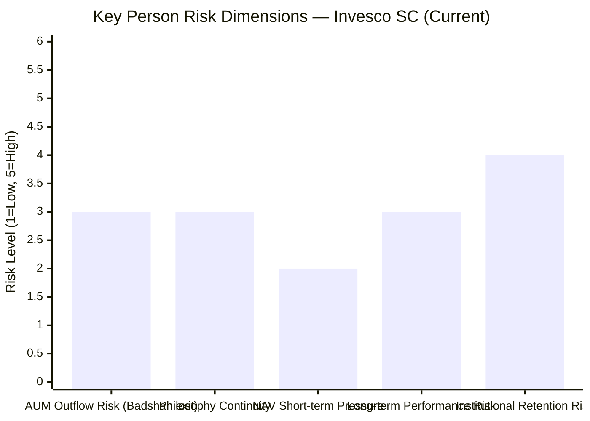

| Risk Dimension | Assessment | Score (1–5, 5 = highest risk) |
|----------------|-----------|-------------------------------|
| AUM outflows on Badshah exit | **Medium (3/5)** | Invesco SC brand is less Badshah-dependent than DSP SC is on Sambre; Khemani could absorb the mandate |
| Philosophy continuity | **Medium (3/5)** | Khemani shares Motilal background; aligned framework; but managing 5 of his own schemes |
| NAV short-term pressure | **Low-Medium (2/5)** | AUM of ₹11,038 Cr is in the sweet spot — less forced-selling risk than DSP's ₹17,906 Cr |
| Long-term performance risk | **Medium (3/5)** | Co-manager is capable but untested as solo SC manager; philosophy not precisely testable |
| Institutional talent retention risk | **High (4/5)** | IIHL ownership change creates career uncertainty for Badshah; no documented succession plan; post-acquisition transitions are common |

**The institutional retention risk deserves special attention.** The November 2025 IIHL/Hinduja acquisition has changed Invesco India AMC's ownership for the fourth time in 22 years. Fund managers — particularly CIO-level — typically reassess their career position when ownership changes. Badshah's decision to stay with Invesco through the transition is a positive signal, but the first 12–24 months post-acquisition are the highest-risk window for departures. If Badshah left in 2026 or 2027, it would be an unplanned exit at a time when the AMC itself is in governance transition under IIHL. This stacks on top of the existing 7-scheme CIO fragmentation risk.

---

## Peer Manager Comparison

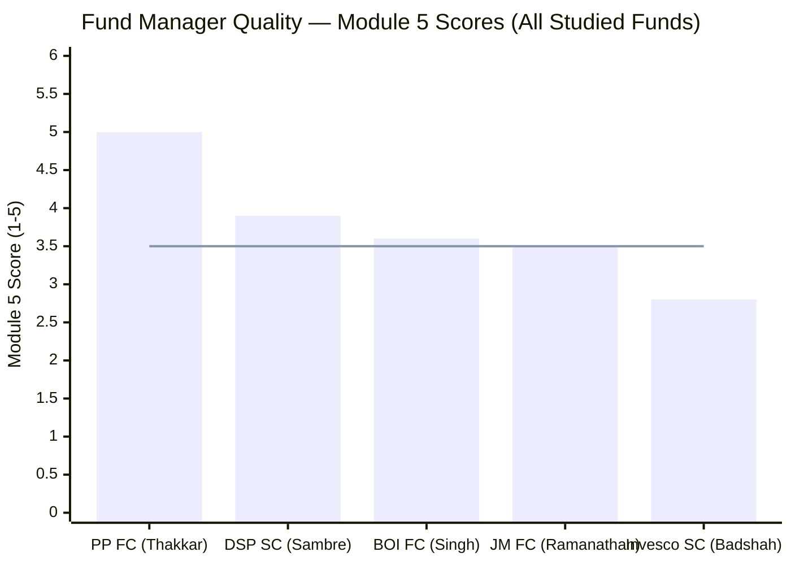
> Line = approximate mid-point reference (3.5/5) | All studied fund manager scores shown

| Fund | Primary Manager | Tenure on Fund | Key Strength | Key Risk | Score |
|------|----------------|----------------|-------------|----------|-------|
| **PP FlexiCap** | **Rajeev Thakkar** | **13Y (inception)** | **Skin in game; quarterly letters; FCA; 13Y philosophy proven** | Retirement horizon | **5.0/5** |
| **DSP SmallCap** | **Vinit Sambre** | **14Y (not inception)** | **FCA; Ghosh co-mgr; lowest turnover; flow discipline** | No quarterly letters; no skin-in-game disclosed | **3.9/5** |
| BOI FlexiCap | Alok Singh | 6Y (inception) | AMC builder; since inception | Sole manager; tiny AMC; no succession | 3.6/5 |
| JM FlexiCap | Satish Ramanathan | ~5Y | Experienced; IIM pedigree | Short tenure at scale | ~3.5/5 |
| **Invesco SC** | **Taher Badshah** | **7.5Y (inception)** | **Experienced CIO; frequent communication; cross-mandate diversification** | **7 schemes; AMC SEBI history; short track record; no FCA; co-mgr also stretched** | **2.8/5** |

---

## Points For and Against — Fund Manager Quality

### ✅ Points For Invesco Small Cap (Fund Manager Quality)

1. **Since-inception manager — 100% attribution clarity** — every return data point (5Y CAGR 21.92%, 3Y 24.43%, since inception 22.88%) is entirely Badshah's work; no pre-manager period muddies the track record
2. **~27 years of broad industry experience** — 10 years sell-side research across multiple institutions + 17 years buy-side; experienced through multiple cycles (2008 GFC was navigated at Motilal Oswal)
3. **President and CIO title** — institutional endorsement; Badshah sets equity investment philosophy across all Invesco equity schemes; he is the most senior investment professional at the AMC
4. **Growth-to-blend evolution is intellectually honest** — publicly acknowledging the shift from Motilal-era pure growth to Invesco-era blend/contra thinking demonstrates self-awareness; a manager who understands how his thinking has evolved is less likely to be blindsided by style drift
5. **Aditya Khemani added as co-manager (Nov 2023)** — IIM Lucknow credential; 18+ years equity experience; Motilal philosophy alignment reduces integration friction; key-person risk reduced
6. **PSU/defence avoidance vindicated (2022–2024)** — explicitly reduced industrials/PSUs when expensive; same discipline as Sambre; protected the portfolio when PSU stocks fell 30–50%
7. **High visibility, frequent communication** — multiple annual interviews across VRO, Moneycontrol, NDTV Profit, podcasts, Geojit, PersonalFN; more accessible than many CIOs
8. **Invesco Equity Philosophy PDF (40 pages, March 2025)** — structured public document available; above minimum transparency standard

### ❌ Points Against Invesco Small Cap (Fund Manager Quality)

1. **7 schemes, ₹40,367 Cr — highest mandate fragmentation studied** — SC fund is only 27% of Badshah's total AUM; Contra Fund (₹19,406 Cr, 45% of mandate) dominates attention; a CIO managing the AMC's entire equity strategy cannot give the SC fund the dedicated focus a pure SC specialist would
2. **Only 7.5 years on fund — short track record** — no full small cap bear cycle managed at meaningful AUM; the COVID test occurred at ₹200 Cr (50× smaller than today); downside management at ₹11,038 Cr is untested
3. **₹4.98 Cr SEBI settlement (April 2024) — AMC level** — inter-scheme transfers, pre-arranged trades between MF and PMS; CEO among named officials; institutional culture signal applies to the whole AMC even if Badshah personally is clean
4. **Multi-jurisdiction probe (SEBI + SEC + SFC) — unprecedented severity** — multi-jurisdictional probes of Indian AMCs are extremely rare; the global nature of the inquiry implies Invesco Corp itself had concerns about the India subsidiary
5. **~50% fixed-income team resigned post-whistleblower** — institutional collapse at team level; even if entirely debt-side, it reveals the governance culture the equity team operates within
6. **65.1% SC purity (Module 3) — philosophy vs mandate gap** — Badshah's "blend" approach creates a multi-cap portfolio in a SC wrapper; this is either intellectual flexibility or mandate drift; either interpretation raises questions about the integrity of the SC investment thesis
7. **No FCA credential** — BE Electronics + MMS Finance vs Sambre's FCA; in a category where earnings manipulation and related-party risk are primary threats, the accounting forensics gap is real and permanent
8. **Co-manager (Khemani) also manages 5 schemes (₹28,637 Cr)** — not a dedicated SC co-manager; SC fund is 38% of his mandate; intellectual coverage per scheme is necessarily diluted
9. **Both managers share Motilal Oswal DNA** — no cognitive diversity in the management team; same growth bias, same potential blind spots, same style vulnerabilities
10. **No quarterly investor letters** — broad macro interviews substitute for fund-specific transparency; investors cannot audit specific buy/sell decisions; AMC regulatory findings not communicated proactively to unitholders
11. **Skin-in-game not disclosed** — unlike PPFAS where employee co-investment is explicitly and publicly confirmed; Badshah's personal allocation to his own funds is unknown
12. **IIHL ownership change creates retention uncertainty** — 4th ownership change in 22 years; the 12–24 month post-acquisition window is highest-risk for CIO departure; no documented succession plan

---

## Module 5 Scorecard

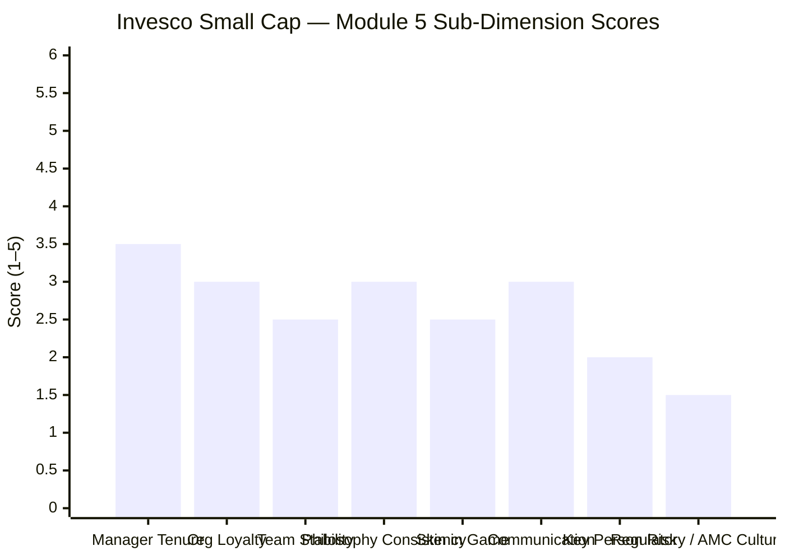

| Sub-Dimension | Score (1–5) | Reasoning |
|---------------|------------|-----------|
| Manager tenure on this fund | **3.5/5** | 7.5 years since inception — 100% attribution clarity; strong; but shorter than Sambre (14Y) or Thakkar (13Y); no full cycle at meaningful AUM |
| Organisational loyalty | **3.0/5** | 9.5 years at Invesco — solid, but moved across 4 organisations in the prior 12 years; not Sambre (19Y) or Thakkar (20Y+) level institutional embedding |
| Team stability | **2.5/5** | Khemani added Nov 2023 is positive; but both managers carry multi-scheme mandates (7 + 5); 50% FI team resigned 2021–22 — AMC-level team instability on record |
| Philosophy consistency | **3.0/5** | Self-acknowledged growth-to-blend evolution is honest but means the framework has changed; SC purity at 65.1% represents ongoing mandate flexibility; not precisely testable like Sambre's three pillars |
| Skin in the game | **2.5/5** | Not publicly disclosed; probable but unverified; PPFAS makes this explicit; Invesco does not |
| Investor communication | **3.0/5** | High interview frequency and philosophy PDF available; partial credit; but no quarterly fund-specific letters; AMC regulatory findings not proactively disclosed to unitholders |
| Key person / succession risk | **2.0/5** | CIO managing 7 schemes with SC fund = 27% of attention; IIHL ownership change creates retention uncertainty; Khemani is capable but stretched; no documented succession plan |
| Regulatory / AMC culture | **1.5/5** | ₹4.98 Cr SEBI settlement; multi-jurisdiction probe (SEBI+SEC+SFC); whistleblower; 50% FI team resignation; CEO remained post-settlement; most severe AMC regulatory history in this research project |
| **Module 5 Overall** | **2.8 / 5** | Experienced CIO with inception clarity and self-aware philosophy; critically undermined by 7-scheme CIO fragmentation, AMC governance failures (most serious studied), short track record at current AUM scale, and co-manager who is also multi-stretched |

---

## Comparative Module 5 Scores — All Studied Funds

| Fund | Module 5 Score | Manager | Key Advantage | Key Weakness |
|------|---------------|---------|--------------|--------------|
| **PP FlexiCap** | **5.0 / 5** | Thakkar | FCA; 13Y inception; quarterly letters; skin in game; philosophy unchanged | Retirement horizon |
| **DSP SmallCap** | **3.9 / 5** | Sambre | FCA; 14Y tenure; Ghosh dedicated co-mgr; flow discipline; Thakkar-comparable framework | No quarterly letters; skin-in-game undisclosed |
| BOI FlexiCap | 3.6 / 5 | Alok Singh | 6Y inception; AMC builder; co-built the fund house | Sole manager; tiny AMC; no succession |
| JM FlexiCap | ~3.5 / 5 | Ramanathan | Experienced; IIM Ahmedabad | ~5Y tenure; small fund; untested at scale |
| Edelweiss FlexiCap | ~3.3 / 5 | — | Adequate team structure | Not extensively researched in this project |
| **Invesco SC** | **2.8 / 5** | **Badshah + Khemani** | **Inception clarity; 27Y experience; CIO visibility; Khemani adds coverage** | **7 schemes; AMC SEBI history; short track record at scale; no FCA; co-mgr also stretched; IIHL retention risk** |

Invesco's 2.8/5 is the lowest Module 5 score in this research project. The primary drag is the AMC regulatory history — a ₹4.98 Cr settlement for inter-scheme manipulation and multi-jurisdiction probe is qualitatively different from anything at PP, DSP, or BOI. The manager quality concerns (7-scheme fragmentation, short track record at current AUM, no FCA, co-manager also stretched) compound this. The strengths — Badshah's inception continuity, 27Y experience, and intellectual honesty — are real but insufficient to offset the institutional governance red flags.

---

## One-Line Verdict

Taher Badshah is an experienced and self-aware CIO whose growth-to-blend evolution and since-inception management give the Invesco Smallcap Fund perfect attribution clarity — but his 7-scheme CIO mandate (SC fund = 27% of his attention), the AMC's multi-jurisdiction SEBI regulatory failures (the most serious institutional record in this research), a 7.5-year track record untested at current AUM scale, and co-manager Khemani's own multi-scheme stretch collectively create the weakest fund manager quality profile of any fund studied.

---

## SIP Implication

For the ₹20K/month smallcap SIP investor:

1. **Monitor Taher Badshah's tenure actively** — unlike DSP or PP (where manager transitions are low probability in the near term), Invesco's post-IIHL acquisition environment creates real retention uncertainty; check quarterly that Badshah remains the named manager
2. **The Invesco SC track record is entirely Badshah's work** — if he leaves, you are not just changing managers; you are losing the entire verified history
3. **Watch SC purity quarterly** — Badshah's blend philosophy means the 65.1% SC purity could drift lower; if this falls below 65% (SEBI minimum), AMFI may require rebalancing; it is also a signal that the SC mandate is being compromised
4. **The AMC regulatory record does not directly affect your equity NAV today** — but it is a governance signal that should weigh on your confidence in the institution; set a monitoring threshold: if SEBI issues new regulatory actions against Invesco India, revisit the investment thesis
5. **Co-manager Khemani's addition (Nov 2023) is a positive** — but he has managed the SC fund for only 1.5 years; he has not yet been tested through any significant drawdown in this role; observe his decision-making over 2–3 more quarters before treating him as a full key-person-risk mitigation

---

*Module 5 complete. Manager experience and inception clarity are genuine strengths; AMC governance history and mandate fragmentation are the defining weaknesses. Module 5 Score: 2.8/5.*

*Next: [Module 6 — AMC Quality](module6_amc.md)*
