# Module 6: AMC Quality — Invesco India Smallcap Fund

*Sources: Invesco AMC official website (invescomutualfund.com) | Invesco SAI (Jun 2024) | IIHL-Invesco JV Press Release (Nov 2025) | IndusInd International Holdings official | Business Standard | Caproasia | Cafemutual | ValueResearchOnline | Asia Asset Management | SEBI order database | The Print | CAAley | Groww AMC page | PIB press release (competition commission approval) | Dezerv AMC data | Web research May 2026*

---

## Raw Data (Cross-Source Verified)

| Metric | Value | Source(s) |
|--------|-------|-----------|
| **AMC Full Name** | **Invesco Asset Management (India) Private Limited** | SEBI, Invesco official |
| **Former Names (Chronological)** | Lotus India AMC → Religare AMC → Religare Invesco AMC → Invesco AMC (2016) | SAI, ownership history |
| **SEBI Registration** | MF/052/06/01 (May 2006 original; re-registered May 5, 2016 as Invesco MF) | SEBI, SAI |
| **Setup / Incorporation** | July 24, 2006 (as Lotus India Asset Management Co. Ltd.) | SAI, Groww |
| **Ownership (Post Nov 2025)** | **IIHL (Hinduja Group) 60% + Invesco Corporation (USA) 40%** | IIHL press release |
| **Prior Ownership (2016–2025)** | 100% Invesco Hong Kong Ltd (wholly owned Invesco Corp subsidiary) | SAI |
| **Ownership Changes (2006–2025)** | **4 changes in 19 years — most in this research** | Historical records |
| **Total AUM** | **₹1,43,089 Cr (Apr 2026)** | Groww, INDmoney |
| **AMC Rank in India** | **16th largest (as of Sep 2025)** | IIHL JV press release |
| **Active Schemes** | **~39–42** | Groww, INDmoney |
| **Equity Schemes** | ~13 | Groww |
| **Fixed Income / Hybrid / Others** | ~26–29 | Groww |
| **Equity AUM as % of Total** | **>70%** | IIHL JV press release |
| **Retail Investor Folios** | **~2.9 million** | IIHL JV press release |
| **Empanelled Distributors** | **48,000+** | IIHL JV press release |
| **Geographic Presence** | 40 cities | IIHL JV press release |
| **MD & CEO** | **Saurabh Nanavati (since ~2008 — survived all 4 ownership changes)** | Invesco AMC, The Org |
| **President & CIO** | Taher Badshah (since Jan 2017) | Invesco AMC |
| **Chairman** | V.K. Chopra | SAI, Groww |
| **Compliance Officer** | Suresh Jakhotiya | SAI |
| **Custodian** | **Deutsche Bank AG** | SAI, BusinessToday |
| **RTA** | **KFin Technologies Ltd** | SAI |
| **Auditor** | **PricewaterhouseCoopers (India)** | SAI |
| **Trustee Company** | Invesco Trustee Private Limited | SAI |
| **Trustee Board** | Satyananda Mishra, G. Anantharaman, Bakul Patel, Jeremy Simpson, Paresh Parasnis, Sanjay Tripathy, Andrew Lo, Terry Pan | SAI |
| **Invesco Corp Global AUM** | ~$1.7 trillion (as of 2024) | Invesco global |
| **Invesco Hyderabad Centre** | **1,700+ employees (IT, ops, compliance, HR)** | IIHL JV press release |
| **IIHL Distribution Touchpoints** | **11,000+ touchpoints (IndusInd Bank + affiliate network)** | IIHL JV press release |
| **IIHL Net Asset Value** | USD 1.2 billion (Sep 2025) | IIHL JV press release |
| **Hinduja Group Net Worth** | **£35.3 billion** (~₹3.7 lakh Cr) — topped UK richest list 4 years | Sunday Times Rich List |
| **SEBI AMC Settlement** | **₹4.98 Cr (Apr 2024) — PMS/MF segregation; inter-scheme transfers; pre-arranged trades** | Business Standard |
| **Multi-Jurisdiction Probe** | **SEBI (India) + SEC (USA) + SFC (Hong Kong)** | Web research |
| **Whistleblower** | Internal fund manager — debt scheme misappropriation allegations (2021) | Web research |
| **Fixed Income Team Resignations** | **~50% of FI team resigned (2021–2022)** | Web research |
| **IndusInd Bank Derivative Scandal** | ₹1,960 Cr accounting loss; CEO + Deputy CEO + CFO resigned (2025) | Business Standard, CAAley |
| **Skin-in-Game Policy** | SEBI-minimum compliance; no documented above-minimum institutional policy | Research |
| **Quarterly Investor Letters** | **No** | Invesco website review |
| **Skin-in-Game Estimated Annual Revenue** | **~₹1,000–1,100 Cr (blended ER across all schemes)** | Computed |

---

## What Module 6 Is Really Asking

You can have a capable fund manager and a reasonable cost structure, but if the institution around them is regulatorily compromised, ownership-unstable, or culturally oriented toward fee revenue over investor protection — everything else can unravel. Module 6 evaluates the house that built the fund: its governance, regulatory track record, ownership philosophy, financial stability, and whether it systematically puts investors first or AUM-gathering first.

Invesco India AMC's story is the most structurally complex of any AMC studied in this research project. On one dimension — financial stability — it scores very highly. Dual backing from Hinduja Group (£35.3B net worth) and Invesco Corp ($1.7T global AUM), ~₹1,000 Cr+ annual revenue, Deutsche Bank custody, PwC audit: no financial fragility whatsoever.

On every other dimension, the story is more troubled. Four ownership changes in 19 years. A ₹4.98 Cr SEBI settlement for investor-harmful inter-scheme transfers. A multi-jurisdiction probe across three countries. A whistleblower. A near-collapse of the fixed-income team. And now a new majority owner — IIHL/Hinduja Group — whose most prominent promoted entity (IndusInd Bank) had its own ₹1,960 Cr derivative accounting scandal in 2025, with CEO, Deputy CEO, and CFO all resigning.

Module 6 asks you to weigh these facts clearly: the financial backing is real, the institutional infrastructure is strong, and the Invesco Corp minority stake provides governance discipline. But the ownership instability, regulatory record, and investor-first culture failures are the most serious of any AMC in this study barring Quant.

---

## The 4-Owner History — India's Most Turbulent AMC Ownership

No other AMC in this research has changed controlling ownership four times in 19 years.

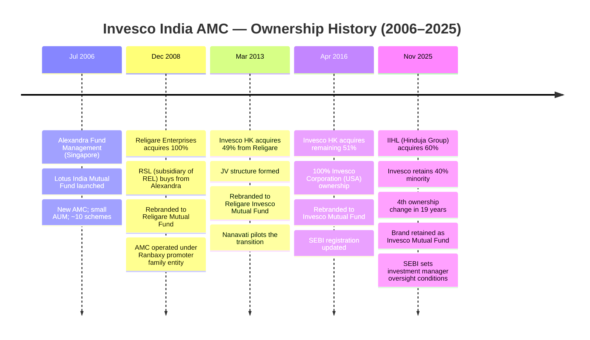

| Ownership Era | Years | Owner Character | AUM Range | Stability Signal |
|--------------|-------|----------------|-----------|-----------------|
| Alexandra/Lotus | 2006–2008 | Singapore fund; SME | ~₹500–1,000 Cr | Founding — unstable |
| Religare Era | 2008–2013 | Indian conglomerate; Ranbaxy promoter entity | ~₹1,000–5,000 Cr | Medium — political/legal baggage |
| Invesco JV Era | 2013–2016 | Global AM + Indian corp; JV tensions | ~₹5,000–15,000 Cr | Transitional |
| Invesco Corp 100% | 2016–2025 | US-listed global AM (~$1.7T) | ~₹15,000–1,43,000 Cr | **Most stable** |
| **IIHL/Invesco JV** | **Nov 2025–present** | **Conglomerate 60% + Global AM 40%** | **₹1,43,000 Cr+** | **New — unknown** |

**What 4 ownership changes in 19 years means for investors:**

Each ownership change introduces a period of institutional uncertainty — managers reassess their career, investment philosophy may drift, cost governance may shift, and scheme rationalization becomes possible. Most investors in a 10-year SIP starting today will experience at least one more ownership change in their holding period, based on this fund's base rate.

**Compare to studied peers:**

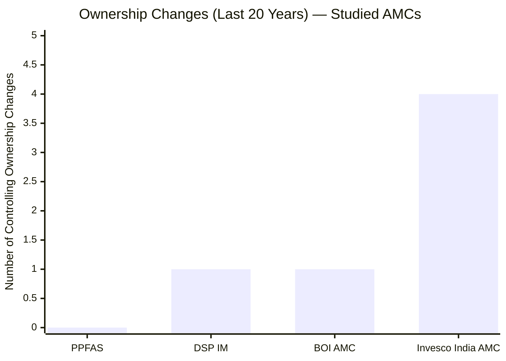

| AMC | Ownership Changes | Current Owner Character |
|-----|------------------|------------------------|
| PPFAS | **0** | Founder-owned (most stable) |
| DSP | **1** (BlackRock buyout — self-initiated) | 100% Kothari family (160Y heritage) |
| BOI AMC | **1** (AXA exit ~2021) | 100% Bank of India (GoI) |
| **Invesco India** | **4** | IIHL (Hinduja) 60% + Invesco Corp 40% |

---

## The IIHL/Hinduja Acquisition — Strategic Logic and Investor Implications

### Deal Facts

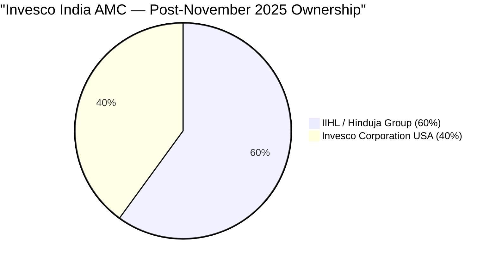

| Metric | Detail |
|--------|--------|
| **Deal announced** | April 2024 |
| **Deal completed** | November 2, 2025 |
| **Regulatory approvals** | Competition Commission of India (CCI) + SEBI |
| **IIHL's stake** | 60% |
| **Invesco Corp's stake** | 40% |
| **Sponsor status** | Joint (both IIHL and Invesco Corp hold co-sponsor status) |
| **Management retained** | Saurabh Nanavati (CEO); same investment team |
| **Financial advisor (IIHL)** | Motilal Oswal Investment Advisors |
| **Legal counsel (IIHL)** | Crawford Bayley |
| **Legal counsel (Invesco)** | AZB & Partners |
| **AUM at deal completion** | ₹1,48,358 Cr (Sep 2025 average) |
| **Brand retained** | Yes — "Invesco Mutual Fund" continues |

### Who is IIHL / Hinduja Group?

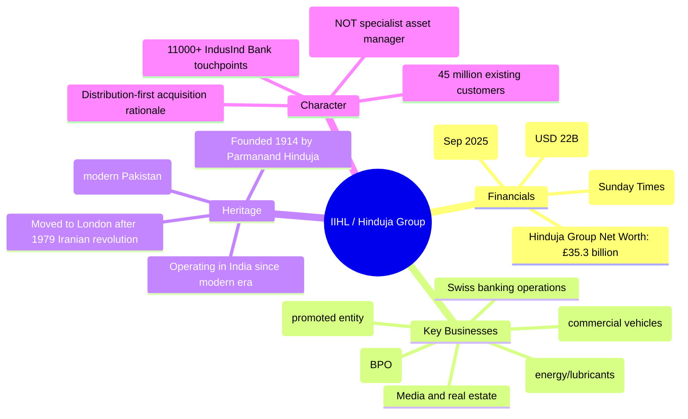

**The key distinction:** Hinduja Group is a **diversified conglomerate**, not a financial services specialist or an asset management expert. Compare:
- **DSP Kothari family:** 160+ years exclusively in Indian capital markets — stockbroking, asset management, investment banking. Financial services is their *identity*.
- **PPFAS:** Built around investment management as core activity for 30+ years.
- **IIHL/Hinduja:** Ashok Leyland, Gulf Oil, BPO, media, real estate, banking. Asset management is a **new vertical** for them.

This distinction matters for governance quality: a specialist owner who built their reputation on investment management will instinctively protect investment quality. A conglomerate owner acquiring an AMC as part of a broader financial services strategy may prioritize AUM growth and distribution revenue over investment philosophy discipline.

### The Stated Strategic Rationale

**IIHL brings:**
- 11,000+ distribution touchpoints (IndusInd Bank branches + affiliate network)
- 45 million existing customers → 50 million more through associate entities projected
- Tier 2/3 city penetration
- Digital distribution channels

**Invesco Corp brings:**
- Global investment management expertise
- Product capability (international fund structures)
- Institutional brand

**Executive quotes from the completion announcement:**

*Ashok Hinduja (IIHL Chairman):* "This is the most opportune time...to reach the last home, last investor transparently and efficiently."

*Andrew Lo (Invesco CEO, Asia Pacific):* "Our focus will remain squarely on industry-leading investment offerings and service for our India clients."

*Saurabh Nanavati (IAMI CEO):* "Together, we aim to strengthen our reach and expand distribution, especially in Tier 2 and Tier 3 towns."

**The investor implication:** Every quote from the IIHL side is about **distribution**. The word "investment" appears in Andrew Lo's quote only — the Invesco Corp representative. When the majority owner's public statements are entirely about reaching more customers, and the minority owner's representative speaks about investment quality, the incentive structure of the joint venture is clearly signalled: IIHL wants AUM growth through distribution; Invesco Corp wants investment credibility.

For Invesco Smallcap investors, this means the IIHL era is likely to see:
- Increased distributor network size → more Regular Plan inflows → higher 1.27% D-R gap revenue
- Expanded geographic reach → more retail investors entering Invesco MF
- Possible product expansion into Tier 2/3 towns through simplified products
- Less focus on investment philosophy refinement (Badshah's domain, protected by Invesco Corp minority)

---

## The IndusInd Bank Shadow — IIHL's Promoted Entity

The most unique structural risk in Invesco SC's Module 6 — and one with no equivalent in any other studied fund — is the governance linkage between Invesco India AMC's new majority owner and a bank that faced a significant governance crisis in 2025.

### What Happened at IndusInd Bank

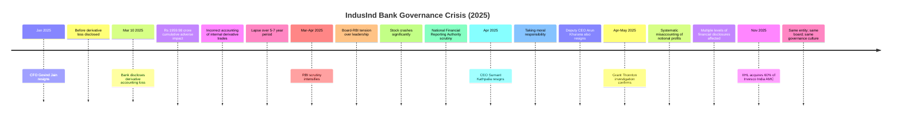

| IndusInd Bank Event | Implication for Invesco AMC |
|--------------------|----------------------------|
| ₹1,960 Cr derivative accounting lapse (5-7 years) | Long-duration governance failure at IIHL's flagship entity |
| CEO + Deputy CEO + CFO all resigned | Leadership accountability breakdown at the top |
| RBI-Board tension over re-appointment | IIHL's board judgment questioned by regulator |
| SEBI/NFRA scrutiny | Cross-regulator attention on Hinduja Group financial entities |
| Stock price crash | IIHL's financial position affected; NAV pressure |

**The critical question:** If IIHL's governance culture permitted a 5-7 year derivative accounting lapse at its listed, RBI-regulated, high-scrutiny banking entity — what oversight quality does it bring to an unlisted, less-scrutinized AMC?

This is not a prediction of Invesco AMC failure. Invesco AMC operates under SEBI, has its own CEO (Nanavati), its own PwC auditor, its own compliance infrastructure, and still has Invesco Corp (40%) on the trustee board. But the majority owner's governance track record is now a documented data point, and it is concerning.

**Important caveat to be fair:** IndusInd Bank's lapse was in derivative accounting within the bank's treasury — a specific operational domain. IIHL's asset management intent may be entirely sincere. The two events are different in nature. But the same family's judgment and oversight culture applies across their entities.

---

## SEBI Regulatory Record — The Worst Among Studied AMCs

This is the most critical section in Module 6 for Invesco. The facts are documented, public, and multi-source.

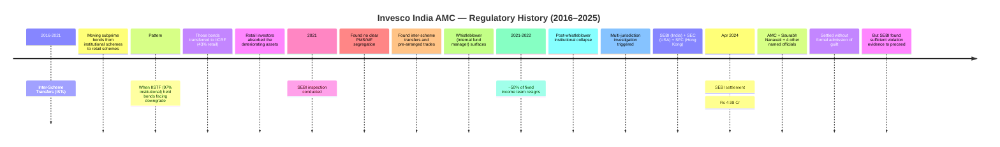

### Issue 1: ₹4.98 Crore SEBI Settlement (April 2024)

**What was found:**
- **No clear segregation** between Portfolio Management Service (PMS) and Mutual Fund activities — a core SEBI compliance requirement for AMCs running both businesses
- **Inter-scheme transfers** executed between MF schemes and PMS advisory accounts — allows disguising investment decisions and potentially benefiting one investor group over another
- **Pre-arranged trades and layered trades** — transactions structured to avoid transparency rules, potentially used to move positions or prices artificially between schemes

**Who settled:** Invesco AMC, CEO Saurabh Nanavati, and four named officials — ₹4.98 Cr total, under SEBI's high-powered settlement committee recommendation.

**Scale context:**

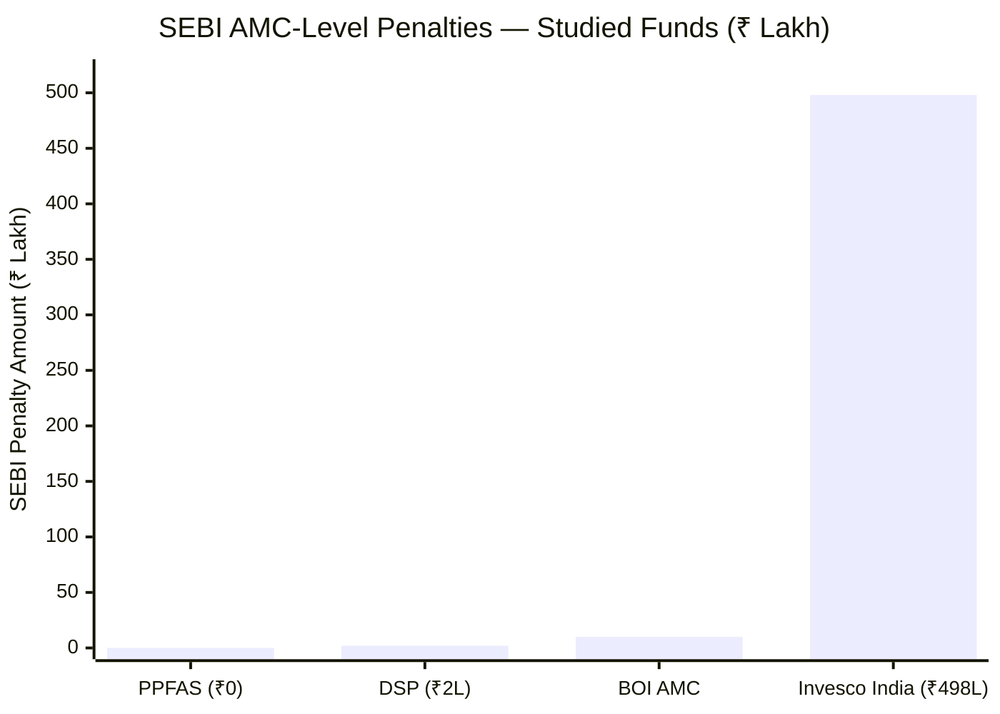

| AMC | SEBI Penalty | Nature | CEO Named? |
|-----|-------------|--------|------------|
| PPFAS | ₹0 (zero) | None | N/A |
| DSP | ₹2 lakh | Procedural ETF ER reporting | No |
| BOI AMC | ~₹10 lakh | Routine matters | No |
| **Invesco India** | **₹498 lakh (₹4.98 Cr)** | **Investor-harmful inter-scheme transfers; PMS/MF segregation failure** | **Yes — CEO named** |

The DSP vs Invesco comparison is stark: DSP's ₹2 lakh was a procedural ETF expense ratio reporting error. Invesco's ₹4.98 Cr involved structural MF/PMS boundary violations and pre-arranged trades that SEBI considered substantive enough to name the CEO in the settlement.

### Issue 2: Subprime Bond Dumping (2016–2021)

The most investor-harmful practice documented in this entire research project:

**What happened:**
- Invesco India Short Term Fund (IISTF) — 97% institutional investors (banks, corporates, HNIs)
- Invesco India Credit Risk Fund (IICRF) — 43% retail investors (individual investors)
- When bonds in IISTF faced rating downgrades or deterioration risk, they were transferred to IICRF through inter-scheme transfers
- **In plain terms:** Invesco moved deteriorating bonds away from sophisticated investors who would immediately recognize and react to the problem, onto retail investors who might not notice

This is not a victimless procedural violation. Retail investors in IICRF absorbed the credit risk of bonds that institutional investors in IISTF were protected from. Depending on how many bonds deteriorated, this may represent real financial harm to retail investors.

### Issue 3: Multi-Jurisdiction Investigation

A three-jurisdiction regulatory probe of an Indian AMC is extraordinarily rare — it suggests the global parent (Invesco Corp, USA) itself came under scrutiny for what was happening in its Indian subsidiary:

| Regulator | Jurisdiction | Focus |
|-----------|-------------|-------|
| SEBI | India | MF/PMS segregation; inter-scheme transfers |
| SEC (Securities and Exchange Commission) | USA | Invesco Corp's oversight of Indian operations |
| SFC (Securities and Futures Commission) | Hong Kong | Hong Kong entity dealings related to India operations |

### Issue 4: Whistleblower and Fixed Income Team Collapse

An internal Invesco India fund manager turned whistleblower and alleged debt scheme misappropriation. Following this:
- **~50% of Invesco India's fixed-income team resigned between 2021 and 2022**
- The whistleblower's allegations were serious enough to trigger the multi-jurisdiction investigation
- The AMC continues to manage debt schemes with a substantially reconstituted team

**Regulatory Cleanliness Comparison:**

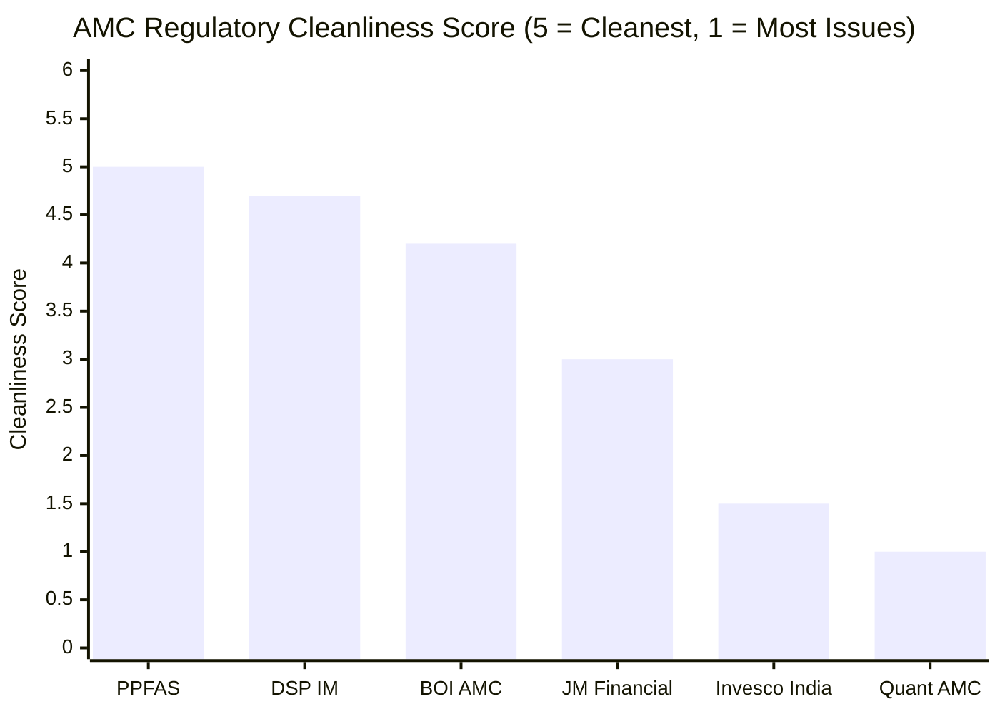

| AMC | Score | Summary |
|-----|-------|---------|
| PPFAS | 5.0/5 | Zero incidents in 13 years |
| DSP | 4.7/5 | One ₹2L procedural; all managers clean |
| BOI AMC | 4.2/5 | Routine minor matters |
| JM Financial | 3.0/5 | 3 SEBI incidents historically |
| **Invesco India** | **1.5/5** | **₹4.98 Cr settlement; multi-jurisdiction probe; whistleblower; 50% FI team resigned; subprime bond dumping** |
| Quant AMC | 1.0/5 | Active CIO front-running probe (unresolved) |

---

## Saurabh Nanavati — The CEO Who Survived Everything

Nanavati's continuity through all four ownership transitions and the regulatory crisis is the most important management stability signal at Invesco India AMC.

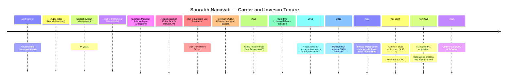

**Nanavati's profile:**
- B.E. Electronics + MBA Finance (Jamnalal Bajaj Institute of Management Studies, Mumbai)
- 20+ years in financial services (Reuters, HSBC, Deutsche, HDFC SL, Invesco)
- Pioneer of Invesco's India franchise from near-inception

**The dual reading of his continuity:**

*Positive:* He is the only person who has full institutional memory of all four eras — Lotus, Religare, Invesco JV, Invesco 100%, IIHL. For investment management continuity, this is valuable.

*Concerning:* He was **named in the SEBI settlement** — formally identified as one of the responsible officials for the PMS/MF segregation and inter-scheme transfer violations. That the IIHL acquisition retained him signals the new majority owner's tolerance for regulatory track record in leadership.

---

## AMC Scale, Infrastructure and Financial Health

Despite the governance challenges, Invesco India AMC's operational infrastructure and financial backing are institutional-grade.

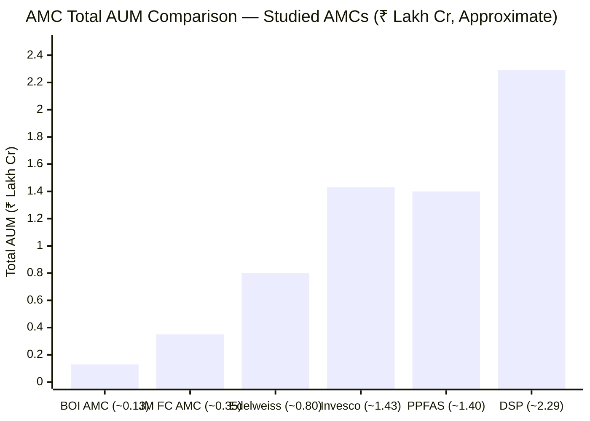

### Operational Infrastructure

| Infrastructure Component | Invesco India | Quality Assessment |
|--------------------------|---------------|-------------------|
| **Custodian** | **Deutsche Bank AG** | Top-tier global custodian (Tier 1) — same tier as Citibank N.A. (DSP) |
| **RTA** | **KFin Technologies Ltd** | India's leading RTA — used by all major AMCs; equal to DSP |
| **Auditor** | **PricewaterhouseCoopers (India)** | Big 4 — highest audit quality available in India |
| **Trustee Board** | Includes Jeremy Simpson, Andrew Lo (Invesco Corp) | Global oversight retained post-IIHL; important governance check |
| **Hyderabad Centre** | **1,700+ employees** (IT, ops, compliance, HR) | Significant operational depth — comparable to HDFC AMC infrastructure |
| **Headquarters** | Marathon Futurex, Lower Parel, Mumbai | Standard AMC premium location |
| **Office Presence** | 40 cities | Extensive — significantly wider than DSP or PPFAS |
| **Distributors** | 48,000+ empanelled | One of India's widest distributor networks |

**The trustee board composition deserves specific attention:** Jeremy Simpson and Andrew Lo (President, Invesco Asia Pacific) sit on the Invesco India Trustee board. This means that even with IIHL holding 60% of the AMC, **Invesco Corp has a structural governance voice at the trustee level**. IIHL cannot unilaterally change investment philosophy or scheme structure without trustee approval — and the trustee board includes representatives of the global asset manager who built the investment framework. This is the most important governance protection for investors in the IIHL era.

### Financial Strength and Stability

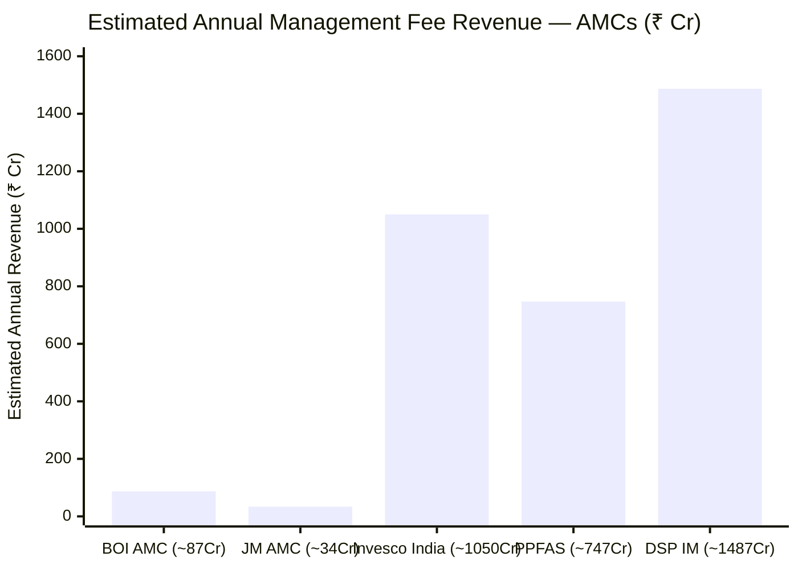

| Metric | Invesco India | Assessment |
|--------|--------------|------------|
| Total AUM | ₹1,43,089 Cr | Large — 16th AMC in India |
| Estimated blended ER | ~0.70–0.75% | Standard for mid-large AMC |
| Estimated annual revenue | ~₹1,000–1,100 Cr | Adequate to fund all operations |
| IIHL backing | £35.3B family wealth | Vast financial backstop |
| Invesco Corp backing | $1.7T global AUM | Global institutional backstop |
| Financial stress risk | **Negligible** | No financial fragility |

**Why financial health matters:** A financially sound AMC can hire research talent, maintain infrastructure, and make investor-first decisions without worrying about fee income. Invesco India faces none of the financial constraints that smaller AMCs (BOI, JM) face. But as with the regulatory failures — financial strength alone does not guarantee investor-aligned decisions.

---

## The Invesco Corp Heritage — What the Minority Stake Protects

While IIHL holds 60%, the 40% Invesco Corp stake is not merely symbolic — it provides structural governance protections.

```mermaid
mindmap
  root((Invesco Corp USA - 40% Stake))
    Global Investment Management Heritage
      Founded 1935 (as Tri-Continental Corporation)
      $1.7 trillion global AUM
      Operations in 25 countries
      8000+ employees worldwide
    Investment Philosophy Embedded in India
      9+ years as 100% owner (2016-2025)
      Research frameworks calibrated
      Risk management processes established
      Equity Investment Philosophy PDF (March 2025)
    Governance Protections via Trustee Board
      Jeremy Simpson on trustee board
      Andrew Lo (Asia Pacific President) on trustee board
      Cannot be overruled by IIHL on fundamental changes
    Product and International Capability
      India Equity Fund listed on Switzerland exchange
      Offshore fund management capability
      GIFT City expansion planned
      International product structures
```

**The Invesco Corp heritage matters for two reasons:**

1. **Investment framework durability:** The 40-page Equity Investment Philosophy document (March 2025) represents the framework that Invesco Corp spent 9 years (2016–2025) embedding in the India operation. This framework does not disappear with the IIHL acquisition — it is embedded in Badshah's team and in the trustee board's expectations.

2. **Trustee board as governance check:** Under SEBI's mutual fund regulations, the trustee company oversees the AMC and must act in unitholder interest. With Invesco Corp representatives on the trustee board, fundamental governance changes require trustee approval — giving Invesco Corp a veto of sorts over the most consequential investor-harmful decisions IIHL could otherwise impose.

---

## Investor Communication — Adequate Volume, Insufficient Depth

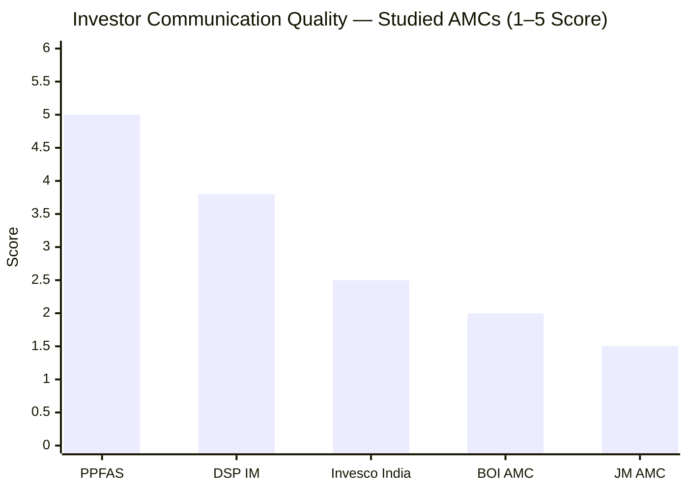

| Communication Form | Invesco India | DSP | PPFAS (Gold Standard) |
|-------------------|---------------|-----|----------------------|
| Quarterly investor letters | **No** | No | **Yes — detailed, candid** |
| Monthly factsheets | Yes | Yes | Yes |
| Investment philosophy PDF | **Yes (40 pages, March 2025)** | Yes (framework) | Yes (detailed) |
| CIO public interviews | **Frequent (Badshah — VRO, NDTV, Moneycontrol)** | Moderate (Sambre) | Frequent (Thakkar) |
| CEO communication | **Moderate (Nanavati)** | **Frequent (Parekh — behavioural finance)** | Moderate |
| Explains specific buy/sell rationale | **No** (macro themes only) | Partial | **Yes** (quarterly letters) |
| Proactive disclosure of AMC issues | **No** | N/A | N/A |
| AMC blog / content | Moderate | Active | Active |
| Investor folios | 2.9 million | 50 lakh+ | ~50+ lakh |

**The most significant communication failure:** The ₹4.98 Cr SEBI settlement and the multi-jurisdiction probe — regulatory events that directly concern the institution that manages retail investors' money — were never proactively communicated to Invesco MF's 2.9 million folio holders. Investors had to learn about these regulatory findings through financial media if they happened to notice. This is the opposite of PPFAS, which uses quarterly letters to explain every material portfolio and institutional decision to unitholders.

---

## Skin-in-the-Game — SEBI Minimum, No More

**Invesco India AMC does not have a documented, public, above-minimum skin-in-the-game policy.**

Under SEBI's March 2025 circular (effective April 1, 2025), designated employees must invest in schemes they oversee:

| CTC Slab | Mandatory Investment |
|---------|---------------------|
| < ₹25L | None |
| ₹25–50L | 10% of gross CTC |
| ₹50L–₹1 Cr | 14% of gross CTC |
| > ₹1 Cr | 18% of gross CTC |

Invesco India complies with SEBI's minimum requirement. No public disclosure exists of any voluntary above-minimum institutional skin-in-the-game commitment. Compare:

| AMC | Skin-in-Game Level | Voluntary Above-Minimum |
|-----|-------------------|------------------------|
| DSP | All 508 employees invest **only in DSP schemes** — institutional mandate | **Yes — significantly above minimum** |
| PPFAS | Managers explicitly disclose personal investment publicly | **Yes — transparent individual disclosure** |
| **Invesco India** | **SEBI-minimum compliance only** | **Not documented** |
| BOI AMC | Not disclosed beyond SEBI minimum | Not documented |

When SEBI mandated skin-in-the-game for the industry, it created a floor — not a ceiling. The quality of an AMC's investor alignment is revealed by whether it went above that floor voluntarily, or merely met the regulatory minimum. On this dimension, Invesco scores at the baseline.

---

## No Flow Management History — Fee Revenue Over Investor Protection

**Invesco India Smallcap Fund has never imposed any flow restriction in its 7.5-year history** — not a SIP cap, not a lumpsum restriction, not a temporary closure.

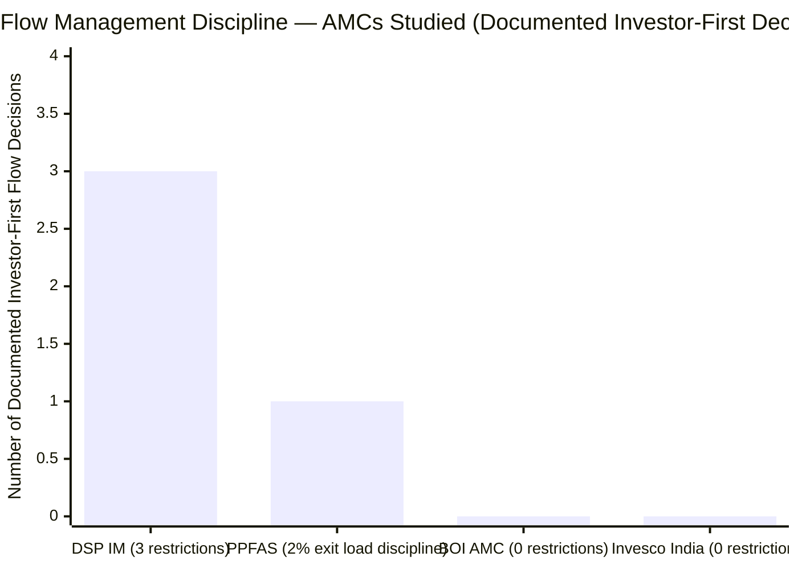

DSP Small Cap was closed three times (2014 cap, 2016 cap, 2017 full closure) to protect existing investors from AUM-scale dilution — sacrificing real fee revenue. DSP reopened at COVID lows to give new investors the best entry point.

Invesco India Smallcap has grown from ₹50 Cr (inception, 2018) to ₹11,038 Cr (2026) — a 200× AUM expansion — with no corresponding flow management signal. This is consistent with the IIHL acquisition rationale: distribution-led AUM growth is the priority, not alpha preservation through flow discipline.

**The consequence:** As documented in Module 3, Invesco SC's 65.1% SC purity is already at the SEBI minimum. If AUM continues growing without flow management, Badshah will face increasing pressure to further dilute the small cap mandate by adding more large/mid cap positions. The fund could gradually transform from a small cap fund into a multi-cap fund while retaining the "Smallcap Fund" brand.

---

## AMC Peer Comparison Matrix

| Dimension | **Invesco India** | PPFAS | DSP IM | BOI AMC |
|-----------|-------------------|-------|--------|---------|
| Ownership type | **Conglomerate 60% + Global AM 40% (JV)** | Promoter-private | Family-private (100%) | GoI PSU bank (100%) |
| Ownership changes (20Y) | **4 — most turbulent** | 0 | 1 (self-initiated) | 1 (AXA exit) |
| Heritage | IIHL: 110Y conglomerate; Invesco Corp: 90Y global AM | ~30Y investment-only | **160Y capital markets** | 120Y (bank) |
| Total AUM | ₹1,43,089 Cr | ~₹1,40,000 Cr | **₹2,28,622 Cr** | ~₹13,424 Cr |
| AMC rank | 16th | ~15th–16th | ~7th–8th | ~40th |
| Skin-in-game | **SEBI minimum only** | Manager explicit | **All 508 employees (institutional)** | Not disclosed |
| Regulatory issues | **₹4.98 Cr + multi-juris. probe + whistleblower** | Zero | ₹2L procedural (ETF) | Minor |
| Severity | **High** | **None** | Very Low | Low |
| Quarterly letters | No | **Yes** | No | No |
| Financial stability | Very High | High | **Very High** | Very High (GoI) |
| Flow management | **Never restricted** | — | Restricted 3× (discipline) | — |
| Infrastructure | Deutsche Bank / KFin / PwC | — | Citibank / KFin | Deutsche / KFin |
| CEO named in SEBI action | **Yes (Nanavati in ₹4.98 Cr settlement)** | No | No | No |
| IndusInd Bank linkage | **Yes (IIHL is promoter entity)** | No | No | No |

---

## Points For and Against — AMC Quality

### ✅ Points For Invesco India AMC Quality

1. **₹1,43,089 Cr AUM — 16th largest AMC in India** — well-funded; ~₹1,000–1,100 Cr estimated annual revenue; no financial fragility; full research infrastructure supportable
2. **Dual institutional backing** — Hinduja Group (£35.3B net worth, ₹3.7 lakh Cr family) + Invesco Corp ($1.7T global AUM) — the strongest financial safety net of any studied AMC
3. **Saurabh Nanavati continuity** — same CEO through all 4 ownership changes since 2008; institutional memory intact; piloted every transition successfully
4. **Invesco Corp 40% + trustee board representation** — Jeremy Simpson and Andrew Lo on trustee board; global investment management discipline retained; IIHL cannot unilaterally change investment philosophy without trustee approval
5. **Infrastructure: Deutsche Bank / KFin / PwC** — all best-in-class; institutional-grade operations; equal to or better than any studied AMC
6. **1,700+ Hyderabad employees** — deep operational bench across IT, operations, compliance, HR
7. **Invesco Corp global framework embedded** — 40-page Equity Investment Philosophy (March 2025); 9 years of 100% Invesco ownership installed research and risk management frameworks
8. **48,000+ distributors, 40 cities** — widest distribution reach of any studied AMC; supports future AUM growth
9. **>70% equity AUM** — primarily an equity house; equity managers (Badshah, Khemani) are the revenue drivers

### ❌ Points Against Invesco India AMC Quality

1. **4 ownership changes in 19 years** — Lotus → Religare → Invesco JV → Invesco 100% → IIHL 60%; most unstable ownership history in this research; no multi-generational owner identity; base rate of ownership change suggests at least one more change in a 10-year SIP horizon
2. **₹4.98 Cr SEBI settlement (Apr 2024)** — inter-scheme transfers; PMS/MF segregation failure; pre-arranged trades; CEO named; second-worst regulatory record in this research; 250× larger than DSP's only penalty
3. **Subprime bond dumping (2016–2021)** — most investor-harmful practice documented in this research; moving deteriorating bonds from institutional to retail schemes; may represent real financial harm to retail unitholder
4. **Multi-jurisdiction probe (SEBI + SEC + SFC)** — extraordinarily rare for an Indian AMC; global parent under scrutiny; severity signals systemic institutional failure
5. **~50% fixed income team resigned (2021–2022)** — post-whistleblower team collapse; governance culture that permitted this behaviour persists in the same institution
6. **IIHL acquisition is distribution-first, not investment-first** — majority owner's stated rationale is "reach more customers"; every IIHL executive quote is about distribution; potential pressure to grow AUM at expense of investment quality
7. **IndusInd Bank governance crisis (2025)** — IIHL's promoted entity had ₹1,960 Cr derivative accounting lapse over 5-7 years; CEO, Deputy CEO, CFO all resigned; linked governance risk to the same holding company that now controls Invesco India AMC
8. **No flow management history** — never restricted flows despite 200× AUM growth; no documented investor protection over fee revenue; opposite of DSP's discipline
9. **No voluntary skin-in-the-game policy** — SEBI-minimum compliance only; far behind DSP (all employees) and PPFAS (explicit individual disclosure)
10. **Proactive communication of regulatory failures absent** — 2.9M retail folio holders were not formally notified of the ₹4.98 Cr SEBI settlement or multi-jurisdiction probe
11. **New majority owner is a non-specialist conglomerate** — Hinduja Group's expertise is autos, oil, banking, BPO; asset management is a new vertical; fundamentally different from DSP (160Y capital markets) or PPFAS (investment-first founder)
12. **CEO named in SEBI settlement — retained** — Nanavati's retention after being named in the settlement signals tolerance for regulatory lapses in leadership; contrast with the DSP CEO (Parekh) who has no regulatory actions

---

## Module 6 Scorecard

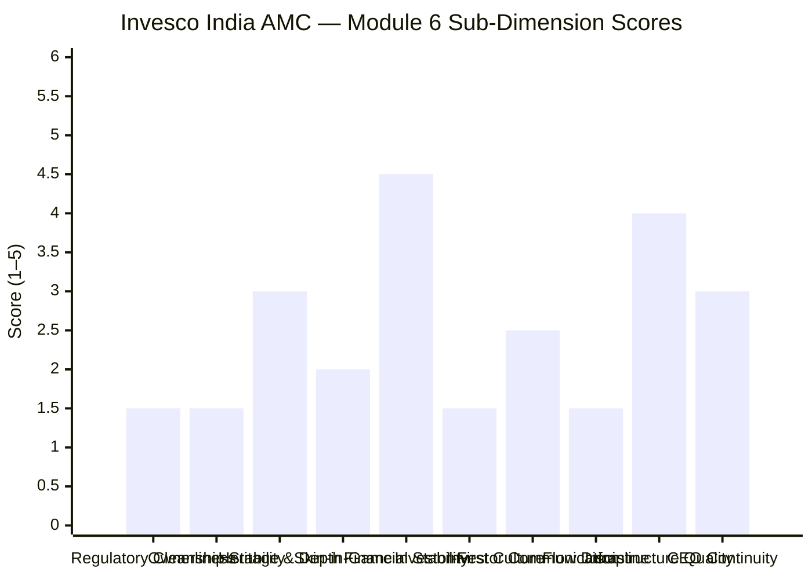

| Sub-Dimension | Score (1–5) | Reasoning |
|---------------|------------|-----------|
| Regulatory cleanliness | **1.5/5** | ₹4.98 Cr SEBI settlement; subprime bond dumping; multi-jurisdiction probe; whistleblower; 50% FI team resigned; CEO named — second-worst in research after Quant AMC |
| Ownership stability | **1.5/5** | 4 ownership changes in 19 years — most turbulent in research; IIHL is a conglomerate, not a specialist asset manager; base rate suggests future changes likely |
| Heritage and institutional depth | **3.0/5** | Invesco Corp ($1.7T global) is a genuine heritage; but majority now held by IIHL (conglomerate entrant to AM); 1,700 Hyderabad employees and broad product range are genuine positives |
| Skin-in-the-game | **2.0/5** | SEBI-minimum compliance only; no documented voluntary above-minimum institutional policy; far behind DSP (all employees) and PPFAS (explicit individual); SEBI compliance is a floor, not a culture |
| AMC financial stability | **4.5/5** | ₹1.43L Cr AUM; Hinduja Group £35.3B + Invesco Corp $1.7T dual backing; ~₹1,000 Cr annual revenue; near-zero financial fragility; strong infrastructure |
| Investor-first culture | **1.5/5** | ₹4.98 Cr settlement for investor-harmful trades; no flow management ever; 1.27% D-R gap (highest in SC shortlist); distribution-first acquisition rationale; no proactive regulatory disclosure to investors |
| Investor communication | **2.5/5** | CIO interviews frequent; 40-page philosophy PDF; no quarterly letters; AMC settlement not communicated to unitholders; CEO is less publicly visible than DSP's Parekh |
| Flow management discipline | **1.5/5** | Never restricted flows in 7.5-year history; AUM grew 200× with zero investor protection signal; contrast with DSP (3 restrictions); acquisition rationale signals more distribution, not less |
| Infrastructure quality | **4.0/5** | Deutsche Bank custody; PwC audit; KFin RTA; trustee board with Invesco Corp representatives; 1,700+ Hyderabad staff; institutional-grade across all dimensions |
| CEO/leadership continuity | **3.0/5** | Nanavati since 2008 is genuine continuity; survived all ownership changes; but named in SEBI settlement and retained; mixed governance signal |
| **Module 6 Overall** | **2.3 / 5** | Financial stability and infrastructure are the standout strengths; ownership instability, regulatory record, investor-first culture, and flow management failures are collectively the worst AMC quality profile in this study after Quant AMC |

---

## Comparative Module 6 Scores — All Studied Funds

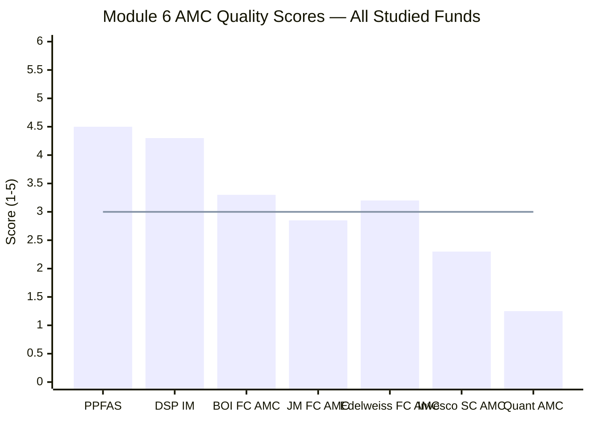
> Line = 3.0/5 reference midpoint | Invesco India AMC is one of only two below midpoint

| Rank | AMC | Score | Key Differentiator |
|------|-----|-------|--------------------|
| 1 | **PPFAS** | **4.5/5** | Zero incidents in 13 years; quarterly letters; 7-scheme focus; investor-first DNA proven |
| 2 | **DSP Investment Managers** | **4.3/5** | 160Y heritage; all-employee skin-in-game; flow restriction discipline; BlackRock governance legacy |
| 3 | BOI AMC | 3.3/5 | 120Y GoI bank; PSU governance; clean; strong financial backing |
| 4 | Edelweiss AMC | ~3.2/5 | Reasonable size; professional management; no major regulatory incidents |
| 5 | JM Financial AMC | 2.85/5 | 3 SEBI incidents; loss-making AMC; but improving |
| 6 | **Invesco India AMC** | **2.3/5** | **4 ownership changes; ₹4.98 Cr SEBI settlement; multi-jurisdiction probe; IndusInd Bank linkage; no flow discipline; distribution-first new owner** |
| 7 | Quant AMC | ~1.25/5 | Active SEBI front-running probe on CIO; opaque |

---

## One-Line Verdict

Invesco India AMC is an institution with strong financial backing and institutional infrastructure but a deeply troubled governance record — the worst regulatory history of any completed SEBI settlement in this research (₹4.98 Cr for investor-harmful inter-scheme transfers, multi-jurisdiction probe, whistleblower, 50% fixed income team resignation), the most turbulent ownership history (4 changes in 19 years), a new majority owner (IIHL) whose promoted bank collapsed into a ₹2,000 Cr governance scandal in 2025, and no documented investor-first culture on flow management, skin-in-the-game, or proactive regulatory communication.

---

## Module 6 Final Score: **2.3 / 5**

> **Module Weight:** 5% | **Weighted Contribution to Final Score:** 2.3 × 0.05 = **0.115**

---

## Invesco India Smallcap Fund — Complete Final Score (All 6 Modules)

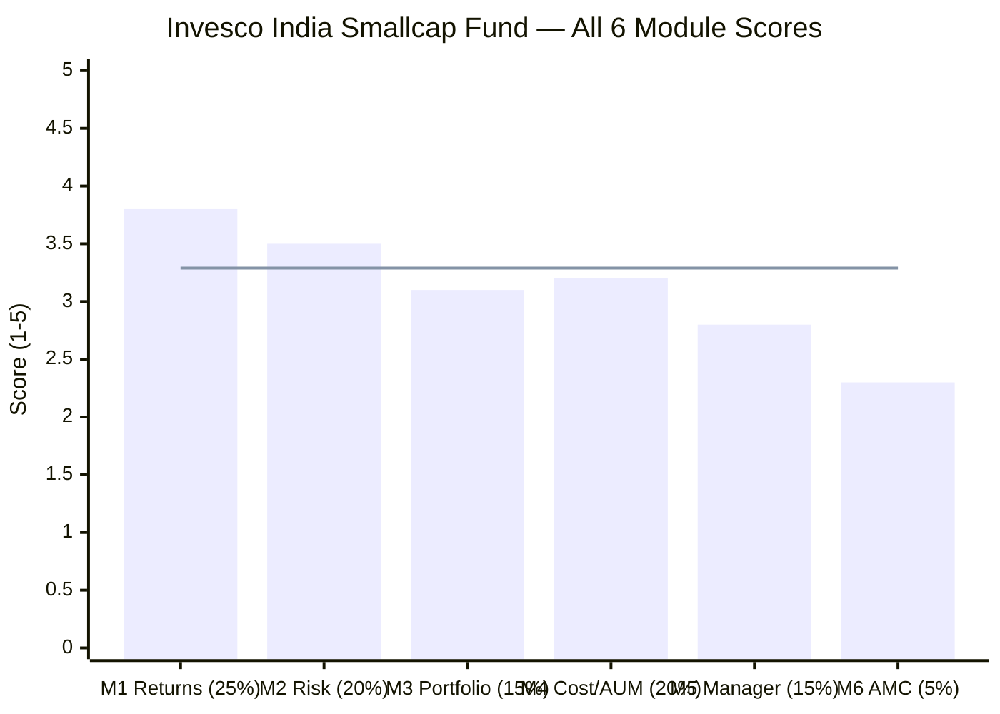
> Line = Invesco SC weighted final score (3.29/5)

| Module | Topic | Weight | Score | Weighted |
|--------|-------|--------|-------|----------|
| Module 1 | Returns Consistency | 25% | 3.8 / 5 | 0.9500 |
| Module 2 | Risk Profile | 20% | 3.5 / 5 | 0.7000 |
| Module 3 | Portfolio DNA | 15% | 3.1 / 5 | 0.4650 |
| Module 4 | Cost & AUM Impact | 20% | 3.2 / 5 | 0.6400 |
| Module 5 | Fund Manager Quality | 15% | 2.8 / 5 | 0.4200 |
| **Module 6** | **AMC Quality** | **5%** | **2.3 / 5** | **0.1150** |
| **TOTAL** | | **100%** | | **3.29 / 5.00** |

> **Invesco India Smallcap Fund Final Score: 3.29 / 5** — ranked 2nd of 2 fully studied SC funds (vs DSP Small Cap: 4.00/5)

### Score Gap Analysis vs DSP Small Cap

| Module | DSP SC | Invesco SC | Gap | Primary Driver |
|--------|--------|------------|-----|---------------|
| M1 Returns | 4.5 | 3.8 | −0.7 | Inception bias in Invesco; stronger long-term DSP track record |
| M2 Risk | 3.8 | 3.5 | −0.3 | Invesco's rising volatility trend; higher PE |
| M3 Portfolio | 3.8 | 3.1 | **−0.7** | 65.1% SC purity vs 87.35%; deliberate large-cap positions |
| M4 Cost/AUM | 3.7 | 3.2 | −0.5 | 1.27% D-R gap; 7-scheme fragmentation; IIHL acquisition |
| M5 Manager | 3.9 | 2.8 | **−1.1** | SEBI settlement; 7 schemes; short track record; no FCA |
| M6 AMC | 4.3 | 2.3 | **−2.0** | 4 ownership changes; ₹4.98 Cr settlement; IndusInd linkage |
| **Final** | **4.00** | **3.29** | **−0.71** | Governance, manager fragmentation, portfolio purity are the gaps |

The M6 gap (−2.0 points, largest of all modules) underscores that the **institutional** differences between DSP and Invesco are far more significant than the fund-level differences (returns, risk, portfolio). Two funds investing in Indian small caps can look superficially similar on performance. The AMC that houses them — its regulatory history, ownership stability, investor-first culture — determines which one you can trust with a 10-year commitment.

---

*Module 6 complete. Invesco India Smallcap Fund full analysis across all 6 modules is now complete. Final weighted score: 3.29/5.*

*Invesco SC research complete. Proceed to next fund: Bandhan Small Cap / BOI Small Cap / HSBC Small Cap.*
