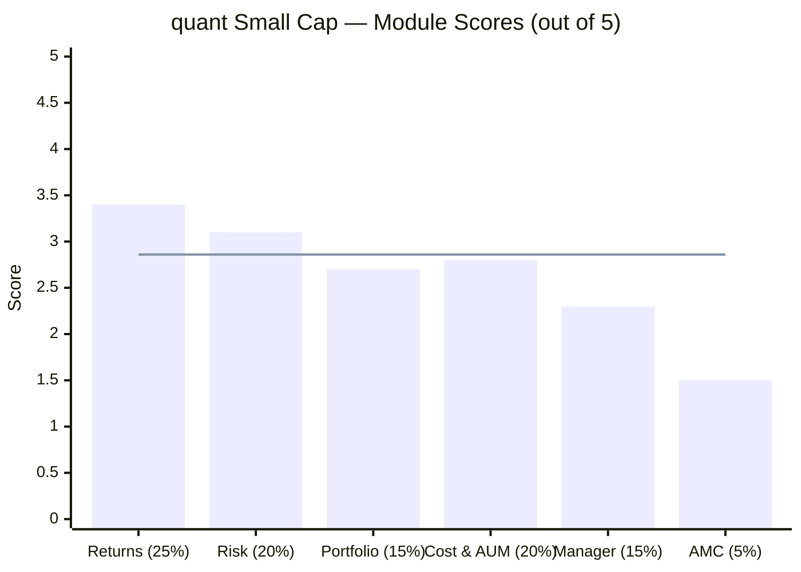
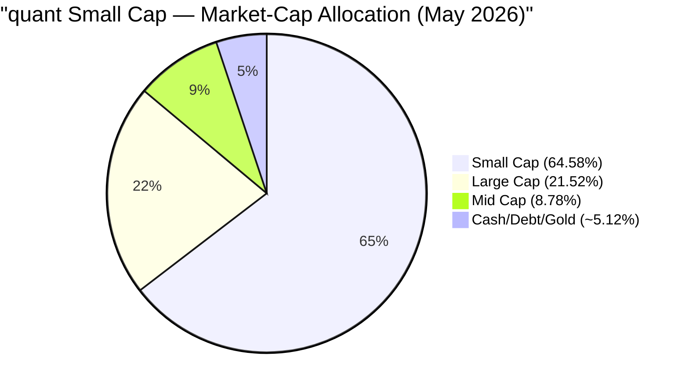
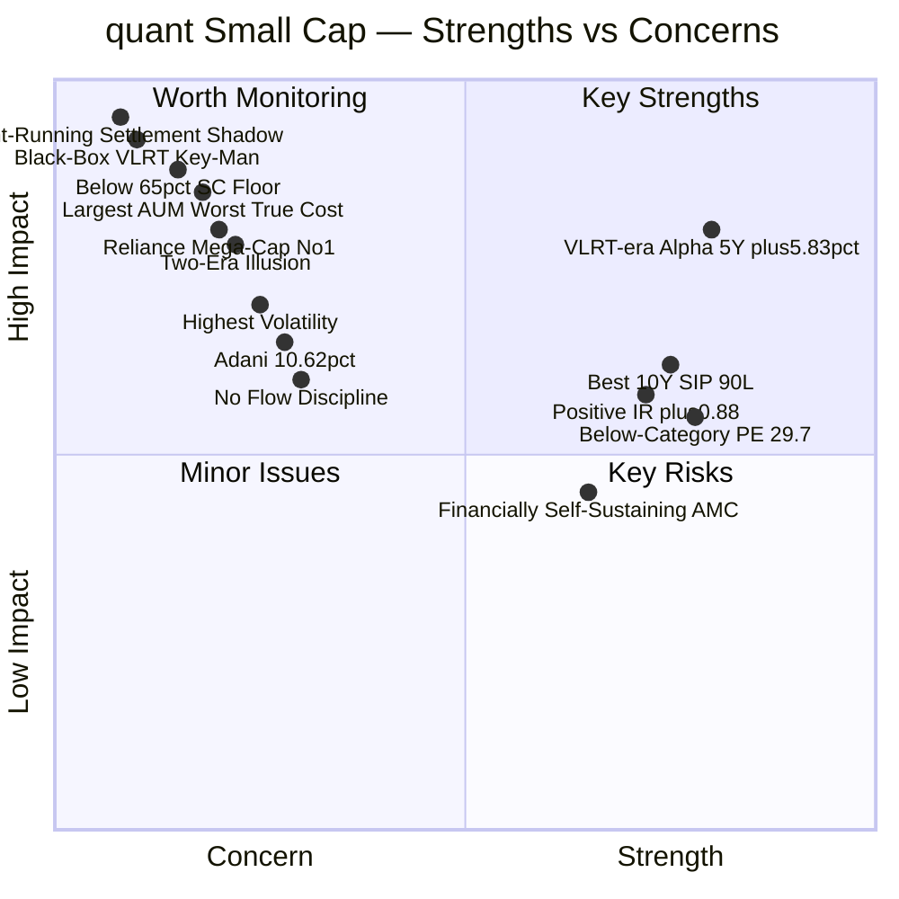
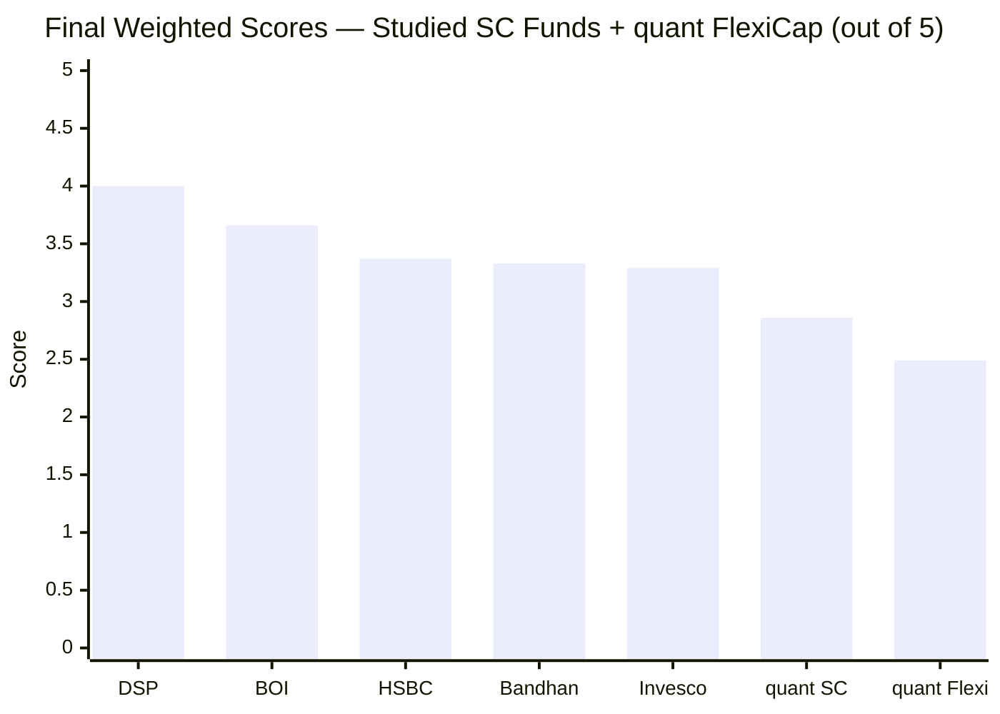
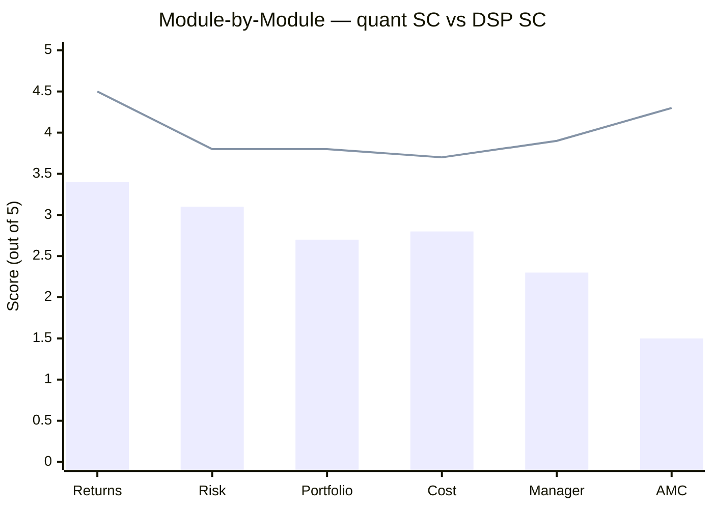
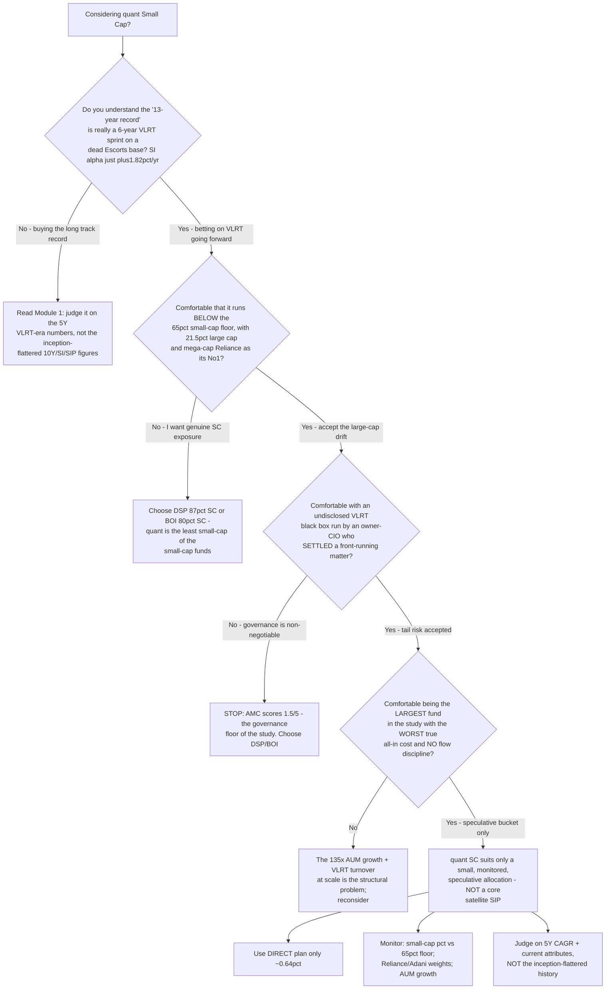
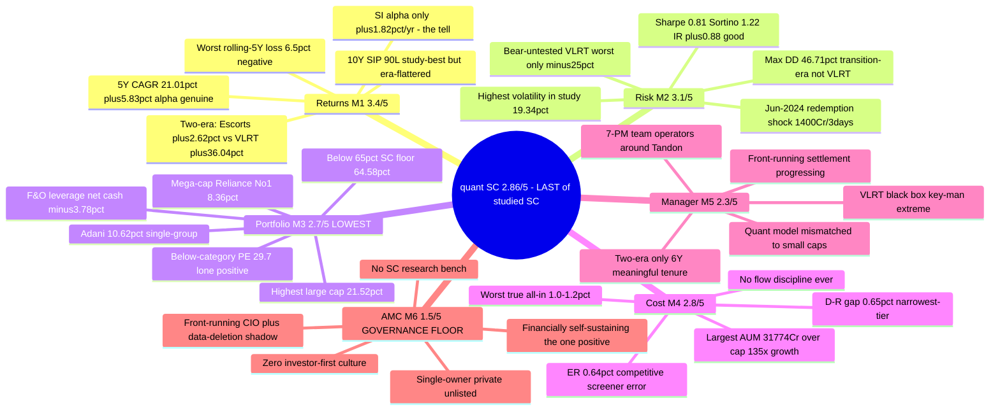

# quant Small Cap Fund — Deep Study

> **⚠️ OUT-OF-SHORTLIST STUDY.** quant Small Cap was **eliminated in Stage 1** and is **not** one of the 8 shortlisted funds. It is studied here as an instructive case — a high-profile, top-raw-return fund the screen rejected. On corrected data it fails **only the AUM cap** (the screener's ER "fail" was a data error). Final score **≈ 2.86/5 — last of the studied small caps, but above its FlexiCap sibling (2.49).**

---

## Fund Identity

| Field | Value |
|-------|-------|
| **AMC** | **Quant Money Managers Ltd** *(formerly Escorts AMC; acquired by Sandeep Tandon / quant Capital in 2018)* |
| **AMC Parent** | **None** — independent, private, unlisted; Sandeep Tandon majority owner (also MD + CEO + CIO) |
| **Fund Inception (Direct)** | **07 January 2013** (Escorts-era legacy NAV ₹34.11) — **VLRT-era management only from ~2019–2020** |
| **MFAPI Scheme Code** | 120828 (Direct Growth) / 100177 (Regular Growth) |
| **Investment Model** | **VLRT** (Valuation, Liquidity, Risk-Reward, Timing) — proprietary, undisclosed "black box" |
| **Fund Managers** | **7-PM team** — Sandeep Tandon (CIO/architect), Ankit A. Pande, Sanjeev Sharma, Varun Pattani, Ayusha Kumbhat, Sameer Kate, Yug Tibrewal |
| **Category / Benchmark** | Small Cap Fund / **Nifty Smallcap 250 TRI** |
| **AUM (Direct)** | **₹31,774 Cr** (Jun 2026) — **largest of any fund in either study; over the ₹30,000 Cr cap; grown ~135× since 2018** |
| **Expense Ratio (Direct)** | **~0.64%** (VRO 0.59 / AdvisorKhoj 0.69) — *screener's 1.13% was a data error* |
| **Expense Ratio (Regular)** | **1.34%** — Direct–Regular gap ~0.65% (narrowest-tier of the study) |
| **Exit Load** | 1% if redeemed within 365 days; nil after |
| **Min SIP / Lumpsum** | ₹1,000 / ₹5,000 |
| **Current NAV (15-Jun-2026)** | ₹298.11 (−2.74% from the ₹306.52 ATH of 27-Sep-2024) |
| **VRO Star Rating** | 3–4 ★ (sources differ) |

---

## The One-Line Context

quant Small Cap is the study's **highest-octane, lowest-trust fund** — strong VLRT-era returns (21.01% 5Y, the study's best 10Y SIP outcome) whose celebrated "13-year record" is really a **6-year momentum sprint glued to a near-dead Escorts legacy** (since-inception alpha just +1.82%/yr). It is **barely a small-cap fund** (64.58% small cap — *below* the SEBI floor; 21.52% large cap — the highest of any peer; mega-cap **Reliance** as its #1 holding), carries the **highest volatility and likely worst true all-in cost** in the study, and is run by an **undisclosed quant model under a settled-but-not-exonerated front-running matter** with a **data-deletion shadow**. The screen eliminated it on scale (₹31,774 Cr, over the cap); the deep study confirms the elimination on every axis except raw returns. **Final: 2.86/5 — last of the studied small caps, the "less bad" of the two quant funds.**

---

## Module Status

| Module | Weight | Status | Score | File |
|--------|--------|--------|-------|------|
| 1 — Returns Consistency | 25% | ✅ Complete | 3.4/5 | [module1_returns.md](module1_returns.md) |
| 2 — Risk Profile | 20% | ✅ Complete | 3.1/5 | [module2_risk.md](module2_risk.md) |
| 3 — Portfolio DNA | 15% | ✅ Complete | 2.7/5 | [module3_portfolio.md](module3_portfolio.md) |
| 4 — Cost & AUM Impact | 20% | ✅ Complete | 2.8/5 | [module4_cost.md](module4_cost.md) |
| 5 — Fund Manager Quality | 15% | ✅ Complete | 2.3/5 | [module5_manager.md](module5_manager.md) |
| 6 — AMC Trustworthiness | 5% | ✅ Complete | 1.5/5 | [module6_amc.md](module6_amc.md) |

---

## Final Scorecard

> Bars = module scores | Line = overall weighted score (2.86/5)

| Module | Score | Weight | Weighted Score |
|--------|-------|--------|----------------|
| 1 — Returns Consistency | 3.4/5 | 25% | 0.850 |
| 2 — Risk Profile | 3.1/5 | 20% | 0.620 |
| 3 — Portfolio DNA | 2.7/5 | 15% | 0.405 |
| 4 — Cost & AUM Impact | 2.8/5 | 20% | 0.560 |
| 5 — Fund Manager Quality | 2.3/5 | 15% | 0.345 |
| 6 — AMC Trustworthiness | 1.5/5 | 5% | 0.075 |
| **Overall** | — | **100%** | **≈ 2.86 / 5** |

> **The structural story:** unlike BOI (whose weaknesses were quarantined in the low-weight modules), quant's problems are **pervasive** — its strengths are *modest* (no module above 3.4) and its weaknesses are *severe* and span both high- and low-weight modules. A strong-but-unverifiable return engine sits atop a portfolio that abandons the mandate, the worst true-all-in cost, a quant process mismatched to small caps, and a governance-floor AMC.

---

## Key Performance Metrics

| Metric | Value | Context |
|--------|-------|---------|
| **1Y CAGR** | 8.36% | +9.35% alpha (benchmark −0.99%) |
| **3Y CAGR** | 20.68% | +2.30% alpha |
| **5Y CAGR** | **21.01%** | ⭐ #3 of 9; +5.83% alpha — the trustworthy VLRT-era headline |
| **10Y CAGR** | 20.52% | ⚠️ **Blended** — dead era + sprint |
| **Since Inception (13.4Y)** | 17.51% | ⚠️ **SI alpha only +1.82%/yr** — the dead era erased lifetime alpha |
| **Escorts-era CAGR (2013–19)** | **+2.62%** | 7 dead years (sub-2% vol — not an equity fund) |
| **VLRT-era CAGR (2020+)** | **+36.04%** | The real, explosive record |
| **Max Drawdown** | **−46.71%** | Transition-era (Dec-2018→Mar-2020); VLRT-era worst only ~−25% |
| **Volatility (5Y)** | **19.34%** | ⚠️ **Highest of any studied fund** |
| **Sharpe / Sortino (3Y, computed)** | **0.81 / 1.22** | Good (screener's 0.149 is an artifact) |
| **Jensen Alpha / IR (5Y)** | **+6.29% / +0.875** | ⭐ Active risk genuinely rewarded (anti-HSBC) |
| **Rolling 5Y % negative** | **6.5%** | ⚠️ **Worst of any studied fund** (peers ~0%) |
| **10Y SIP XIRR** | **25.20% → ₹90.3L** | ⚠️ Study-best, but era-flattered (one-off VLRT regime) |
| **% from ATH** | −2.74% | Mild; 626 days since ATH |

---

## Portfolio DNA

| Metric | Value | Significance |
|--------|-------|--------------|
| **Small Cap %** | **64.58%** | ⚠️ **Below the 65% SEBI floor — lowest of any studied fund** |
| **Large Cap %** | **21.52%** | ⚠️ **Highest of any studied SC fund** (next: Invesco 13.8%) |
| Mid Cap % | 8.78% | Low |
| **Top Holding** | **Reliance Industries 8.36%** | ⚠️ **A mega-cap as #1 — largest single position of any studied SC fund** |
| **Adani Group** | **10.62%** (Power + Green + Enterprises) | Single-group concentration no peer carries |
| Top-10 Concentration | ~39% | Concentrated but far below FlexiCap sibling's 71.4% |
| Total Holdings | 119 | Broad tail |
| **F&O Overlay / Net Cash** | **3.88% / −3.78%** | ⚠️ Structural leverage (effective exposure >100%) |
| **Portfolio PE** | **~27.89–29.71** (cat ~31.5) | ⭐ **Below category — the lone genuine portfolio positive** |
| Turnover | VLRT-high (undisclosed) | Rotational momentum; large hidden cost at scale |

---

## ⚠️ The Five Critical Flags — Read Before the Numbers

### Flag 1 — The Two-Era Illusion: the "13-year record" is a 6-year sprint
The fund was a **near-dead Escorts legacy scheme until ~2019–2020** (+2.62% CAGR over 2013–19; sub-2% annual volatility in 2014/2016/2017 — it wasn't really holding equities). The explosive record belongs entirely to the **VLRT era (2020+)**, which effectively begins at the COVID floor. The blended 10Y CAGR (20.52%) and the study-best 10Y SIP (₹90.3L) **mask this regime change** — the tell is the **since-inception alpha of just +1.82%/yr** over 13.4 years. Judge the fund on its 5Y (VLRT-era) numbers, not the inception-flattered long-horizon figures.

### Flag 2 — It's Barely a Small-Cap Fund
At **64.58% small cap, the fund sits *below* the 65% SEBI floor** — the lowest of any studied fund — with the **highest large-cap allocation of any peer (21.52%)** and **mega-cap Reliance (8.36%) as its #1 holding.** The VLRT model, unable to deploy ₹318 Cr-per-1% positions into genuine micro-caps at ₹31,774 Cr, **drifts up into liquid large/mega-caps.** For a satellite allocation meant to deliver *differentiated small-cap* exposure, quant delivers the least of it — and duplicates large caps an investor likely already owns.

### Flag 3 — The Black-Box / Front-Running Governance Shadow
The entire VLRT-era record was produced by an **undisclosed quant model** run by **Sandeep Tandon, who is the subject of a SEBI front-running matter** (₹70–80 Cr trail; June-2024 raid) compounded by an **alleged data deletion the day before the raid.** The **consent settlement has reportedly been accepted** — closing the legal case, but with **no admission of guilt and no validation of the alpha.** An investor cannot verify whether the celebrated 2020–21 years were cleanly earned. Extreme key-man risk: the model dies with Tandon.

### Flag 4 — Largest AUM, Worst True Cost, No Flow Discipline
At **₹31,774 Cr (135× growth since 2018)**, quant is the largest fund in either study and over the disqualification cap. The headline ER (~0.64%) is competitive, but **VLRT's very-high turnover × the largest AUM × illiquid small caps = the likely worst true all-in cost in the study (~1.0–1.2%).** The AMC has **never gated** the fund despite the explosive growth — and the largest-AUM redemption surface already showed its fragility (₹1,400–2,800 Cr pulled in 3 days on the June-2024 SEBI news).

### Flag 5 — The Data-Quality Pattern (5 issues)
quant's third-party data is unusually error-prone — every figure required independent verification: (1) the **ER error** (screener 1.13% vs true ~0.64%), (2) a **2015 NAV glitch** that corrupted the drawdown until cleaned, (3) a **DHFL phantom holding** (a company delisted in 2021 listed at 2.63%), (4) an **implausible 0.86% turnover** figure, and (5) **undisclosed per-manager start dates.** A soft negative for any investor relying on platform data to monitor the fund.

---

## Strengths vs Concerns

### Key Strengths
- **Genuine VLRT-era alpha** — 5Y CAGR 21.01% (#3 of 9, +5.83% alpha), positive Jensen alpha (+6.29% 5Y) and Information Ratio (+0.875) — active risk *rewarded* (the anti-HSBC)
- **Study-best 10Y SIP outcome** (₹90.3L) — though era-flattered and non-repeatable
- **Below-category portfolio PE (~29.7)** — a genuine valuation cushion; 2nd-cheapest of the studied funds
- **Good computed risk-adjusted metrics** — Sharpe 0.81, Sortino 1.22 (the screener's 0.149 is an artifact)
- **Competitive headline ER (~0.64%) + narrowest-tier D-R gap (~0.65%)** — the screener's "expensive" verdict was wrong
- **Financially self-sustaining AMC** (~₹92K Cr) — won't fail (the one axis it beats sub-scale BOI)

### Key Concerns
- **Below the 65% small-cap floor (64.58%)** + highest large-cap (21.52%) + mega-cap Reliance #1 — barely a small-cap fund
- **Settled-not-exonerated front-running matter on the owner-CIO** + data-deletion shadow — the unverifiable, opaque return engine
- **Extreme key-man risk** — VLRT is a black box that dies with Tandon; no succession
- **Largest AUM (₹31,774 Cr, 135× growth) + likely worst true all-in cost (~1.1%) + no flow discipline**
- **Highest volatility in the study (19.34%)** + worst rolling-5Y loss record (6.5% negative)
- **Two-era illusion** — the long record is a 6-year sprint; SI alpha just +1.82%/yr
- **Quant model structurally mismatched to small-cap research** — no bottom-up analyst bench
- **Adani 10.62%** single-group concentration; **F&O structural leverage**; **data-quality issues**

---

## Comparison vs Small Cap Shortlist

| Rank | Fund | Score | Status | Key Differentiator |
|------|------|-------|--------|-------------------|
| 1 | **DSP Small Cap** | **4.00/5** | ✅ Shortlist | 14Y manager; 87% SC; flow discipline; all-employee skin-in-game |
| 2 | **BOI Small Cap** | **3.66/5** | ✅ Shortlist | Cheap + nimble + differentiated; best IR; small-AUM advantage |
| 3 | **HSBC Small Cap** | **3.37/5** | ✅ Shortlist | Genuine 12Y record, 2018-tested; but index-hugging, costly |
| 4 | **Bandhan Small Cap** | **3.33/5** | ✅ Shortlist | Cheapest ER; CA+CS PM; but inception bias, AUM explosion |
| 5 | **Invesco India SC** | **3.29/5** | ✅ Shortlist | AUM sweet spot; raw returns; but SEBI settlement, ownership churn |
| **6** | **quant Small Cap** | **2.86/5** | ❌ **Out-of-shortlist** | **Top raw returns; but mandate drift, governance floor, worst true cost** |
| — | *quant Flexi Cap (sibling)* | *2.49/5* | *❌ (FlexiCap study)* | *Same model; 71% top-10; 24.56% Adani; active probe (May-26)* |

> **quant Small Cap ranks LAST of the studied small-cap funds** — below even Invesco — but **above its own FlexiCap sibling (2.49)**. It is the **"less bad" of the two quant funds**: better M2 (shallower drawdown, positive IR), better M3 (less concentrated, below-cat PE), better M4 (cheaper ER) — the SEBI 65%-floor mercifully forces more diversification than the FlexiCap's 71% top-10. But it remains well below shortlist grade.

---

## Score Gap Analysis — quant vs DSP (Reference Fund)

> Bars = quant SC | Line = DSP SC

| Module | quant | DSP | Gap | Primary Driver |
|--------|-------|-----|-----|----------------|
| Returns (25%) | 3.4 | 4.5 | **−1.1** | Two-era illusion; unverifiable VLRT alpha; worst rolling-5Y loss |
| Risk (20%) | 3.1 | 3.8 | **−0.7** | Highest volatility; bear-untested VLRT; transition-era drawdown |
| Portfolio (15%) | 2.7 | 3.8 | **−1.1** | Below SC floor; 21.5% large cap; mega-cap #1; F&O leverage |
| Cost (20%) | 2.8 | 3.7 | **−0.9** | Largest AUM (over cap); worst true all-in; no flow discipline |
| Manager (15%) | 2.3 | 3.9 | **−1.6** | Black box; key-man; quant mis-fit for SC; settling probe |
| AMC (5%) | 1.5 | 4.3 | **−2.8** | Single-owner; front-running + data-deletion; zero investor-first |
| **Overall** | **2.86** | **4.00** | **−1.14** | Pervasive weakness vs DSP's transparent, disciplined, FCA-led franchise |

**Key insight:** quant trails DSP on *every* module — the inverse of BOI, which beat DSP on Cost. The gap is widest on Manager (−1.6) and AMC (−2.8): the difference between a transparent, FCA-led, flow-disciplined small-cap specialist and an opaque quant momentum model under a front-running settlement.

---

## ₹20K/Month SIP Projections (10 Years)

| Scenario | CAGR Assumption | Projected Corpus | Multiple |
|----------|----------------|------------------|----------|
| Bear (AUM bloat + SC bear + governance event) | 12% | ₹46.3 lakh | 1.93× |
| Conservative (mandate drift + true-cost drag) | 16% | ₹61.2 lakh | 2.55× |
| Base (VLRT process holds, large-cap-tilted) | 18% | ₹70.1 lakh | 2.92× |
| Optimistic (VLRT-era pace continues) | 22% | ₹88.4 lakh | 3.68× |

**Total invested over 10 years:** ₹24,00,000

> **The true-cost reality:** the headline ER (~0.64%) implies a 10Y corpus of ~₹64.6L at 18% gross — but the true all-in (~1.1%, the worst in the study, from VLRT turnover at scale) cuts it to ~₹63L. The historical ₹90.3L 10Y SIP outcome is a **one-off VLRT-regime artifact** (cheap pre-2020 units revalued by the 2020–21 explosion) and should not be extrapolated from today's ₹298 NAV and ₹31,774 Cr AUM.

---

## Investment Decision Framework

---

## quant Small Cap — In One View

---

## The Critical Facts — In 10 Sentences

1. quant Small Cap is the **last of the studied small-cap funds (2.86/5)**, but **above its own FlexiCap sibling (2.49)** — the "less bad" of the two quant funds.
2. The "13-year track record" is a **two-era illusion**: a near-dead Escorts legacy (2013–19, +2.62% CAGR) glued to an explosive VLRT sprint (2020+, +36% CAGR); the since-inception alpha is just **+1.82%/yr**.
3. It is **barely a small-cap fund** — 64.58% small cap (below the SEBI floor, lowest of any studied fund), 21.52% large cap (highest), with **mega-cap Reliance (8.36%) as its #1 holding**.
4. The VLRT-era *returns* are genuinely strong (5Y 21.01%, +5.83% alpha, IR +0.875) — but **unverifiable**, produced by an undisclosed black box.
5. It carries the **highest volatility in the study (19.34%)** and the **worst rolling-5Y loss record (6.5% negative vs ~0% for peers)**; its −46.71% max drawdown is a transition-era event, and the VLRT process is **bear-untested** (worst VLRT dip ~−25%).
6. The headline ER (~0.64%) is competitive, but the **true all-in cost (~1.0–1.2%) is likely the worst in the study** — VLRT's very-high turnover × the **largest AUM in either study (₹31,774 Cr, 135× growth since 2018)** × illiquid small caps.
7. The AMC is a **single-owner, private, unlisted firm** whose owner-CIO (Sandeep Tandon) **settled a ₹70–80 Cr front-running matter** shadowed by an **alleged data deletion** the day before the SEBI raid — settled ≠ exonerated.
8. **Key-man risk is extreme** (VLRT dies with Tandon), the AMC has **zero investor-first culture** and **never gated** the fund, and the quant model is **structurally mismatched to genuine small-cap research** (the cause of the up-cap drift).
9. The **lone genuine portfolio positive** is a **below-category PE (~29.7)** — a real valuation cushion — alongside competitive cost and a financially self-sustaining AMC.
10. On corrected data the fund fails **only the AUM cap** (the screener's 1.13% ER was one of **five data errors** found); the deep study confirms the elimination on every axis except raw returns.

---

## Quick Verdict

**Best suited for (a small, monitored, speculative allocation only):**
- Investors who **explicitly understand** they are buying a *large-cap-tilted VLRT momentum book* labelled small-cap, judged on its 5Y (not inception) numbers
- Those who accept an **unverifiable black-box process** run by an owner-CIO who settled a front-running matter, and who can monitor the fund actively
- Investors who want the **VLRT-era return power** and accept the highest volatility, worst true cost, and governance-floor AMC as the price

**Not suited for:**
- **Anyone seeking genuine small-cap satellite exposure** — at 64.58% SC (below the floor) with 21.52% large cap and Reliance #1, it delivers the least small-cap exposure of the studied funds; choose DSP (87%) or BOI (80%)
- **Governance-conscious 10-year SIP investors** — the AMC (1.5/5) is the governance floor of the study; the return engine cannot be verified
- **Cost-and-execution-focused investors** — the largest AUM in the study, the likely worst true all-in cost, and no flow discipline
- **Investors who take the 10Y/SIP headline numbers at face value** — they are a one-off VLRT-regime artifact on a dead-fund base
- **Set-and-forget investors** — this fund requires monitoring the small-cap %, the Reliance/Adani weights, AUM growth, and the manager/regulatory situation

---

## quant SC vs DSP vs the FlexiCap Sibling

| Dimension | quant SC | DSP SC | quant Flexi (sibling) |
|-----------|----------|--------|----------------------|
| **Final Score** | **2.86/5 (last of SC)** | **4.00/5 (#1)** | 2.49/5 |
| 5Y CAGR | 21.01% | 19.18% | 19.08% |
| Small-cap purity | **64.58% (below floor)** | **87.35% ✅** | n/a |
| Top holding | **Reliance 8.36% (mega)** | 5.38% | Adani Power 9.66% |
| Top-10 concentration | ~39% | 28.5% | 71.40% ⚠️ |
| Single-group | Adani 10.62% | none ✅ | Adani 24.56% ⚠️ |
| Volatility | **19.34% (highest)** | 15.85% | 16.00% |
| Max drawdown | −46.71% | −49.06% | −54.60% |
| True all-in cost | **~1.0–1.2% (worst)** | ~0.77% | ~1.10–1.62% |
| Process transparency | **Black box** | Documented ✅ | Black box |
| Manager | Tandon + 6 (quant mis-fit) | Sambre (FCA, 14Y) ✅ | Tandon |
| AMC governance | **Floor (front-running, settled)** | Family, clean ✅ | Floor (active probe) |

> **quant SC is the lower-risk, less-concentrated of the two quant funds** (the SEBI floor forces diversification the FlexiCap lacks) — but it is the polar opposite of DSP on transparency, mandate fidelity, and governance, which is why it ranks last of the studied small caps while DSP ranks first.

---

## One-Line Verdict

quant Small Cap is the study's highest-octane, lowest-trust fund — genuine VLRT-era returns (21.01% 5Y, study-best 10Y SIP) wrapped around a two-era illusion (the long record is a 6-year sprint on a dead Escorts base; SI alpha just +1.82%/yr), a portfolio that **abandons the small-cap mandate** (64.58% SC, mega-cap Reliance #1, 21.52% large cap), the **highest volatility and worst true all-in cost** in the study, and an **undisclosed quant model run by an owner-CIO who settled a front-running matter** with a data-deletion shadow — making it **the last of the studied small caps (2.86/5)**, redeemed only relative to its own worse FlexiCap sibling (2.49). **A fund whose strong raw returns cannot be verified, bought at the largest AUM in the study, that barely qualifies as small-cap: the Stage-1 elimination is confirmed.**

---

*Study completed: June 2026 | Framework: 6-Module Weighted Scoring (Small Cap adaptation) | Final Score: 2.86/5 | Status: out-of-shortlist study (Stage-1 elimination on the AUM cap; the ER "fail" was a data error) | Rank: last of 6 evaluated small caps, above the FlexiCap sibling (2.49) | Data: MFAPI (scheme 120828) + cross-source, June 2026 | Methodology note: 5 data-quality issues required independent verification (ER error, 2015 NAV glitch, DHFL phantom holding, implausible turnover, undisclosed PM dates).*
