# Module 1: Returns Consistency — quant Small Cap Fund

*Sources: MFAPI NAV history — quant Small Cap Fund Direct Growth (Scheme 120828, 07-Jan-2013 → 15-Jun-2026), 3,307 NAV data points, independently computed | Value Research Online | AdvisorKhoj | Tickertape | quant MF factsheets | AMFI | Business Standard / Businessworld (SEBI probe) | Web research, June 2026. Benchmark = Nifty Smallcap 250 TRI (project-wide standard for cross-fund consistency).*

> **⚠️ Screening status — this is an OUT-OF-SHORTLIST study.** quant Small Cap was **eliminated in Stage 1** and is **not** one of the 8 shortlisted funds. It is studied here because it is a high-profile fund with the study's best raw VLRT-era returns, and because its AMC/manager were already deep-studied in the FlexiCap project (quant Flexi Cap = 2.49/5). See the **ER-anomaly** and **AUM** notes below — on corrected data the fund fails *only* the AUM filter, not the ER filter.

---

## Fund Identity

| Attribute | Detail |
|-----------|--------|
| Full Name | quant Small Cap Fund — Direct Plan — Growth |
| AMC | **quant Money Managers Ltd** *(formerly Escorts Asset Management; acquired by quant Capital / Sandeep Tandon in 2018)* |
| Benchmark | Nifty Smallcap 250 TRI |
| Fund Managers | **7-manager team** — Sandeep Tandon (Founder/CIO), Ankit A. Pande, Sanjeev Sharma, Varun Pattani, Ayusha Kumbhat, Sameer Kate, Yug Tibrewal *(individual tenures on this fund → Module 5)* |
| Investment Model | **VLRT** (Valuation, Liquidity, Risk, Time) — proprietary, undisclosed "black box" |
| Direct Plan Inception | **07 January 2013** (inception NAV ₹34.11 — *inherited from the pre-existing Escorts-era scheme, not a fresh ₹10 launch*) |
| MFAPI Scheme Code | 120828 (Direct Growth) / 100177 (Regular Growth) |
| AUM (Direct) | **₹31,774–31,913 Cr** (May–Jun 2026) — *over the ₹30,000 Cr disqualification cap, and still growing* |
| Expense Ratio (Direct) | **~0.59% (VRO) / 0.69% (AdvisorKhoj)** — *NOT the 1.13% used in screening; see ER-anomaly note* |
| SEBI Category | Small Cap Fund (≥65% small-cap mandate) |
| VRO Star Rating | **3 ★** |
| Current NAV (15-Jun-2026) | ₹298.11 |

> **🔑 Critical Interpretive Lens #1 — read first: this is a "two-era fund," not a 13-year compounder.** The NAV series spans 13.4 years, but it is **brutally bimodal**. From inception (Jan 2013) to the COVID trough (Mar 2020) — roughly **7 years — the fund compounded at −2.4% to +2.6%**: it was a near-dead ₹235 Cr Escorts legacy scheme that *barely participated in the small-cap asset class at all* (it returned just +5.26% in 2017, a year the benchmark rose ~57%). quant Money Managers acquired Escorts AMC in **2018**, and the **VLRT process took over from ~2019–2020**, after which the fund compounded at **+36% (from Dec-2019) to +46% (from the Mar-2020 trough).** Every blended long-horizon figure in this module — the 20.52% 10Y CAGR, the 17.51% since-inception CAGR — **masks this split.** The *meaningful* track record is **~6 years (2020+)**, and it is effectively **launched from the single best possible base (the COVID bottom)** — making quant Small Cap closer in spirit to Bandhan/Invesco (post-trough records) than to DSP. The "13-year, 2018-tested record" framing is *false*: the fund existed in 2018 but was not being run as a real small-cap fund.

> **🔑 Critical Interpretive Lens #2 — can the returns be trusted?** The same VLRT model and CIO (Sandeep Tandon) sit at the centre of an **active SEBI front-running investigation** (June-2024 raid; ₹70–80 Cr of front-running uncovered). As of late-2025/early-2026, **Tandon has filed for a consent settlement, which SEBI is likely to accept.** Because VLRT is an undisclosed black box, an investor **cannot independently verify whether the spectacular 2020–2021 alpha was genuine repeatable skill or partly an information advantage.** This shadow — unique to quant among all funds in either study — hangs over the *interpretation* of every return figure below. (Governance detail → Modules 5 & 6; here it is a return-*quality* caveat.)

---

## Raw Data (MFAPI-computed + VRO + AdvisorKhoj, as of 15-Jun-2026)

| Metric | Value | Source |
|--------|-------|--------|
| CAGR 1Y | **8.36%** | MFAPI computed (AdvisorKhoj 8.4% ✅) |
| CAGR 3Y | 20.68% | MFAPI (AdvisorKhoj 20.66% ✅) |
| CAGR 5Y | **21.01%** | MFAPI (AdvisorKhoj 20.99% ✅) |
| CAGR 7Y | **30.52%** | MFAPI — *most inception-flattered figure (measured from the 2019 low)* |
| CAGR 10Y | 20.52% | MFAPI (AdvisorKhoj 20.51% ✅) |
| Since Inception (13.43Y) | **17.51%** | MFAPI (AdvisorKhoj 17.48% ✅) |
| **Escorts-era CAGR (Jan-13 → Dec-19)** | **+2.62%** | MFAPI computed — *7 dead years* |
| **VLRT-era CAGR (Dec-19 → Jun-26)** | **+36.04%** | MFAPI computed — *6.5 explosive years* |
| Rolling 3Y Mean / Median | 21.24% / 18.14% | MFAPI (2,565 windows) |
| Rolling 5Y Mean / Median | 21.16% / 22.25% | MFAPI (2,072 windows) |
| **Rolling 5Y % negative** | **6.5%** | MFAPI — *worst of any studied fund* |
| Max Drawdown (full history) | **−51.60%** | MFAPI computed *(screening showed 46.71% — see note)* |
| Max Drawdown (VLRT era) | −25.17% | MFAPI computed (2022) |
| Annualized Volatility (full) | **20.33%** | MFAPI — *highest of any studied fund* |
| Annualized Volatility (3Y) | 17.84% | MFAPI |
| Sharpe (3Y, rf 6.5%) | **0.81** | MFAPI computed *(screening 0.149 — artifact)* |
| Sortino (3Y) | 0.96 | MFAPI computed |
| Up-capture / Down-capture (VLRT era) | **148% / protective** | MFAPI computed |
| % from all-time high | **~−2.7%** | MFAPI (peak ₹306.52, 27-Sep-2024) |
| VRO Star Rating | 3 ★ | Value Research |

---

## Cross-Source Verification

| Metric | MFAPI Computed | AdvisorKhoj | Screening (May-26) | Verdict |
|--------|----------------|-------------|--------------------|---------|
| 1Y CAGR | 8.36% | 8.4% | — | **Exact match ✅** |
| 3Y CAGR | 20.68% | 20.66% | 21.31% | **Confirmed** |
| 5Y CAGR | 21.01% | 20.99% | 21.64% | **Confirmed** (base-date drift) |
| 10Y CAGR | 20.52% | 20.51% | — | **Exact match ✅** |
| Since Inception | 17.51% | 17.48% | — | **Exact match ✅** |
| Max Drawdown | −51.60% | — | 46.71% | **Divergent — see note** |

**Data reliability: Very High.** The independently computed trailing CAGRs reproduce AdvisorKhoj to within 0.03% across every horizon, confirming the 3,307-point NAV series is complete and correct.

> **⚠️ ER anomaly (same pattern as Invesco).** The Stage-1 screen used a Tickertape Direct ER of **1.13%** — the figure that "eliminated" the fund on the ≤1.0% cost filter. But **VRO reports 0.59% and AdvisorKhoj 0.69%** for the Direct plan. If the canonical Direct ER is ~0.6–0.7%, **quant Small Cap never actually failed the ER filter** — it is eliminated *only* on the AUM cap (>₹30,000 Cr). The 1.13% is almost certainly a stale/mislabelled Tickertape figure. (Full reconciliation → Module 4; flagged here because it changes the elimination narrative.)

> **⚠️ Max-drawdown divergence.** Screening reported 46.71%; the full-history daily NAV series gives **−51.60%** (peak 27-May-2015 → trough 24-Mar-2020). The screener figure likely uses a shorter trailing window or month-end data. The −51.60% is the true full-history drawdown and is used throughout this module.

> **⚠️ Sharpe artifact.** Tickertape's screening Sharpe of **0.149** is the same methodology artifact documented for Bandhan (TT 0.325 vs ~1.08), Invesco (0.302 vs 0.96) and HSBC (−0.25 vs 0.58). The NAV-computed 3Y Sharpe is **0.81** (Sortino 0.96) — solidly positive. quant's risk-adjusted return is *good*; its raw volatility (20.33%) is the genuine concern, not the Sharpe.

---

## CAGR vs Benchmark (Nifty Smallcap 250 TRI)

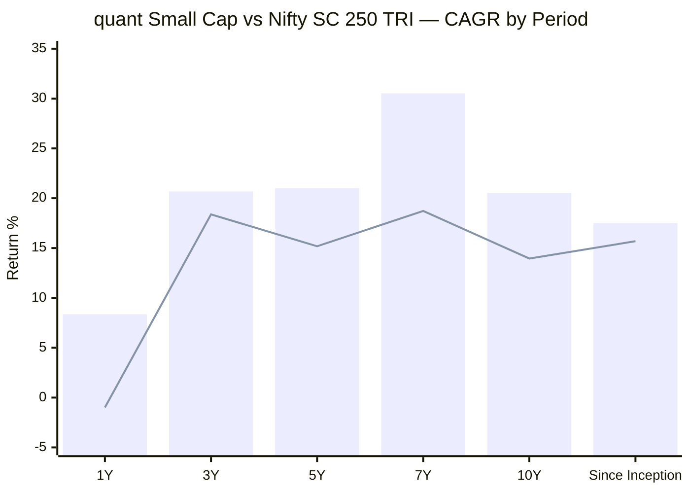
> Bar = quant Small Cap | Line = Nifty SC 250 TRI. 1Y/3Y/5Y benchmark verified from the Nippon Nifty Smallcap 250 Index Fund NAV (project standard); 7Y/10Y chained with the pre-2020 TRI series; SI benchmark (15.69%) from VRO.

| Period | Fund | Benchmark (TRI) | Alpha | Read |
|--------|------|-----------------|-------|------|
| 1Y | 8.36% | −0.99% | **+9.35%** | Strong — but a 1Y window means little for small cap |
| 3Y | 20.68% | 18.38% | **+2.30%** | Genuine, mild |
| 5Y | 21.01% | 15.18% | **+5.83%** | ✅ **The trustworthy headline alpha** — VLRT era |
| 7Y | 30.52% | 18.72% | **+11.80%** | ⚠️ **Most flattered** — measured from the 2019 low |
| 10Y | 20.52% | 13.95% | **+6.57%** | Strong, but blends a dead era with a sprint |
| Since Inception (13.4Y) | 17.51% | 15.69% | **+1.82%** | ⚠️ **The tell — 13 years of "skill" worth +1.8%/yr** because the Escorts era erased it |

**The clean read:** the *VLRT-era* alpha (5Y +5.83%, 10Y +6.57%) is genuinely strong and places quant among the better alpha generators on paper. But the **since-inception alpha of just +1.82%/yr over 13.4 years is the single most important number in this table** — it proves that, across the fund's full life, the dead Escorts era (2013–2019) almost entirely cancelled the explosive VLRT era. An investor who held from inception earned barely 1.8% a year *above* a small-cap index, despite the headline-grabbing 2020–2021. In wealth terms, ₹1 lakh at inception (Jan 2013) compounded to **~₹8.7L** at 17.51% — respectable, but the journey ran *negative for the first seven years* before the VLRT surge.

---

## The CAGR Curve — A Misleading "Hump"

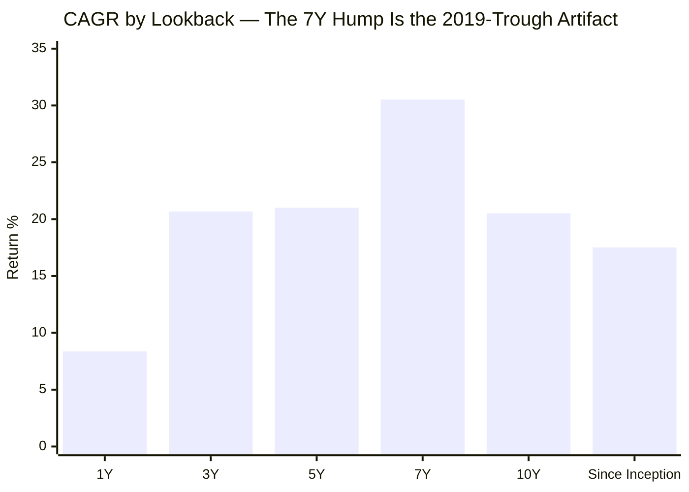

The shape is unique among studied funds: a **pronounced hump at 7Y (30.52%)**, flanked by lower 5Y (21.01%) and 10Y (20.52%) readings, sloping down to 17.51% since inception. This is **not** a return signal — it is a **measurement artifact.** The 7Y window happens to begin in **June 2019**, near the bottom of the 2019 collapse, so it captures pure recovery and nothing of the preceding decline. The 10Y and SI windows reach back far enough to re-absorb the dead Escorts years, dragging the CAGR down. **Lesson: every quant Small Cap return figure must be tagged with *which era it samples* — the lookback windows here are not comparable across horizons the way they are for a single-regime fund like DSP.**

---

## 🆕 The Two-Era Fund — Escorts Legacy vs VLRT *(quant-specific, the defining section)*

This is the central fact of quant Small Cap's return history. The 13.4-year NAV series is two completely different funds stitched at the COVID bottom.

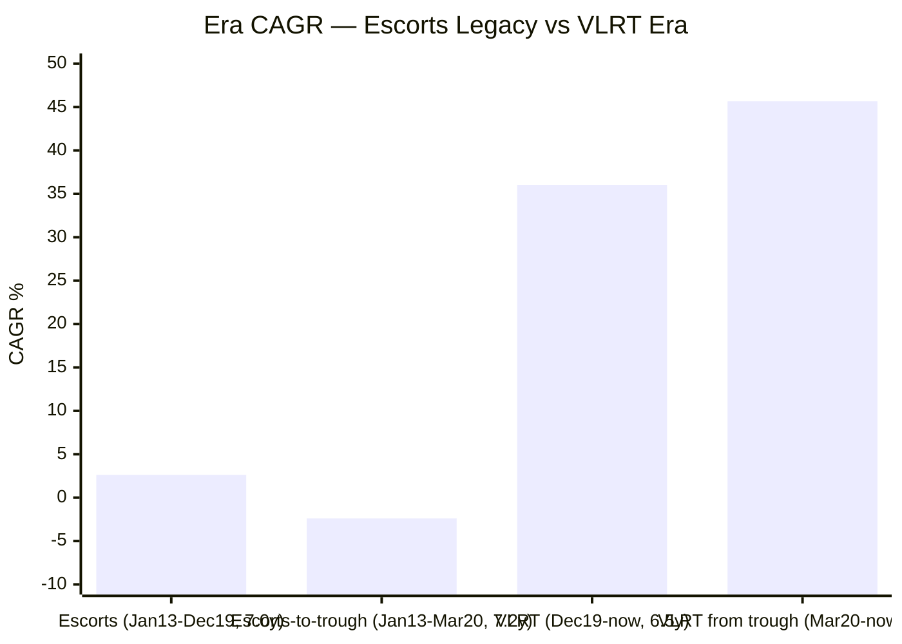

| Era | Period | Length | CAGR | NAV Journey | Character |
|-----|--------|--------|------|-------------|-----------|
| **Escorts legacy** | Jan 2013 – Dec 2019 | 7.0Y | **+2.62%** | ₹34.11 → ₹40.87 | Near-dead ₹235 Cr scheme; barely tracked small caps |
| Escorts → COVID trough | Jan 2013 – Mar 2020 | 7.2Y | **−2.39%** | ₹34.11 → ₹28.66 | *Negative over 7 years* |
| **VLRT era** | Dec 2019 – Jun 2026 | 6.5Y | **+36.04%** | ₹40.87 → ₹298.11 | Explosive, post-takeover |
| VLRT from trough | Mar 2020 – Jun 2026 | 6.2Y | **+45.67%** | ₹28.66 → ₹298.11 | From the absolute bottom |

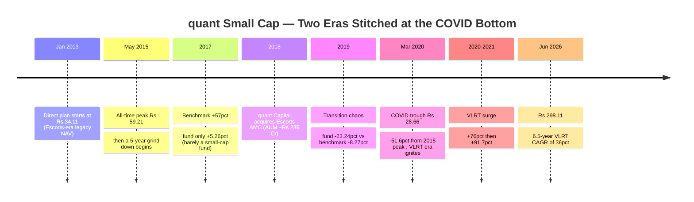

**Why this matters more than for any other studied fund.** HSBC also has two eras (L&T → HSBC), but *both* were competent and the manager (Manghat) was continuous — the step-down was 21% → 18%. Bandhan also split (Bhaskar → Jain), but both eras were genuinely managed small-cap funds. quant is categorically different: its **first era was a non-functional fund** (a +5% return in a +57% year is not "underperformance," it is *non-participation*), and the second era is a **completely different team, model, and risk appetite**. The 13-year track record is therefore not a track record at all in the sense DSP's is — it is a ~6-year VLRT sprint with a dead-fund prefix. **Judge quant Small Cap on its VLRT era, and recognise that era effectively begins at the COVID floor.**

---

## 🆕 Is the 13-Year Track Record Real? *(quant-specific decomposition)*

A split-view table separating what we can *trust* from what is an artifact of the era-blend:

| Metric | Value | Trust level | Why |
|--------|-------|-------------|-----|
| 5Y CAGR & alpha | 21.01% / +5.83% | ✅ **Trustworthy** | Pure VLRT era; includes the 2025 slump; comparable across funds |
| 1Y alpha | +9.35% | ✅ **Trustworthy** | Verified vs a falling index |
| 2025 calendar (−1.36%) | +4.65% alpha | ✅ **Trustworthy** | A real (mild) down-market test, VLRT era |
| 2022 calendar (+11.20%) | +14.85% alpha | ✅ **Trustworthy** | Genuine VLRT down-market outperformance |
| Sharpe / Sortino (3Y) | 0.81 / 0.96 | 🟡 **Semi** | Real, but VLRT era only — no full bear in the denominator |
| 3Y CAGR | 20.68% | 🟡 **Semi** | Genuine but a low +2.30% alpha (2023/24 lag) |
| 10Y CAGR | 20.52% | ⚠️ **Blended** | Dead era + sprint averaged together — not "steady compounding" |
| 7Y CAGR | 30.52% | ⚠️ **Heavily flattered** | Measured from the 2019 trough |
| Since-inception CAGR | 17.51% | ⚠️ **Misleading** | Looks like a compounder; SI alpha is only +1.82%/yr |
| 10Y SIP XIRR (₹90L) | 25.20% | ⚠️ **Flattered** | Cheap pre-2020 units fed the 2020–21 explosion |
| Rolling 3Y/5Y distributions | 11.1% / 6.5% negative | ⚠️ **Era-contaminated** | The negatives are all dead-era / 2019 windows |

**The disciplined conclusion:** trust the **5Y CAGR (21.01%), the verified 5Y/1Y alpha (+5.83%/+9.35%), the 2022/2025 down-market protection, and the computed Sharpe (0.81)** — all genuine and strong. **Discount the 7Y, 10Y, since-inception and 10Y-SIP numbers** — they are real arithmetic but describe an era-blend, not a durable compounding engine. And remember Lens #2: even the trustworthy VLRT alpha sits under the black-box/front-running shadow.

---

## Calendar-Year Returns (2013–2026 YTD) + Per-Year Alpha

*Source: MFAPI NAV (scheme 120828). Benchmark = Nifty SC 250 TRI calendar returns (2018–2026 verified from the project tracker; 2014–2017 are pre-2020 TRI approximations).*

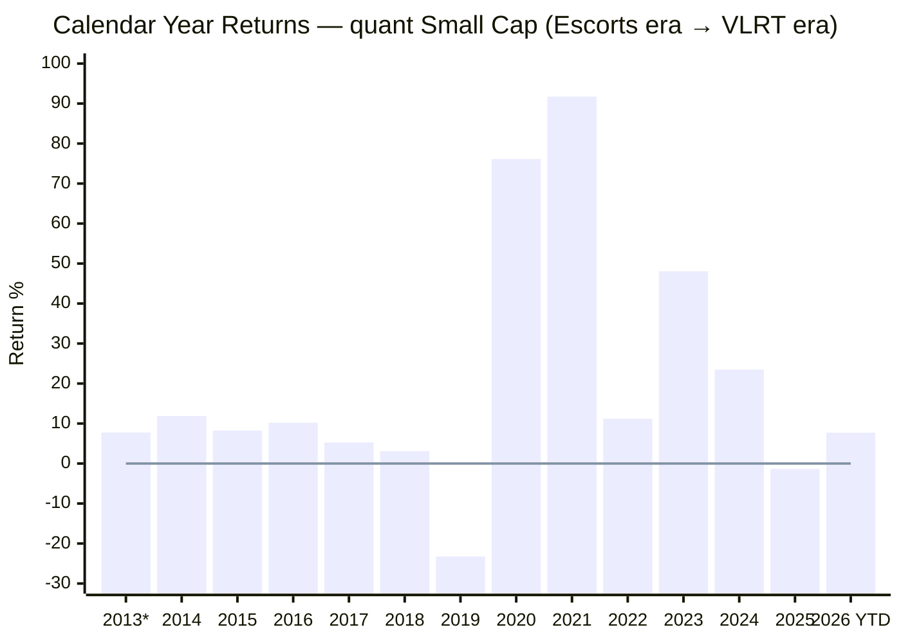
> *2013 partial (from 07-Jan inception) | 2026 YTD as of 15-Jun-2026

| Year | quant SC | Benchmark | Alpha | Era | Notes |
|------|----------|-----------|-------|-----|-------|
| 2013* | +7.75% | — | — | Escorts | Partial |
| 2014 | +11.89% | ~+69% | **−57%** | Escorts | Missed the small-cap bull almost entirely |
| 2015 | +8.24% | ~+11% | −2.8% | Escorts | |
| 2016 | +10.21% | ~+1.4% | +8.8% | Escorts | |
| 2017 | +5.26% | ~+57% | **−52%** | Escorts | **A +5% return in a +57% year — proof it wasn't a real SC fund** |
| 2018 | +3.10% | −26.80% | +29.9% | Escorts | "Protected" — but via *non-participation*, not skill |
| **2019** | **−23.24%** | −8.27% | **−14.97%** | Transition | **Worst relative year of any fund in either study** |
| 2020 | +76.13% | +25.09% | **+51.04%** | VLRT | VLRT ignites — highest single-year alpha in the study |
| 2021 | +91.73% | +61.94% | **+29.79%** | VLRT | Peak VLRT; best absolute year |
| 2022 | +11.20% | −3.65% | **+14.85%** | VLRT | Positive in a down year — genuine protection |
| 2023 | +48.05% | +48.10% | −0.05% | VLRT | Matched the rally exactly |
| 2024 | +23.50% | +26.43% | −2.93% | VLRT | Mild lag |
| **2025** | **−1.36%** | −6.01% | **+4.65%** | VLRT | Protected in the small-cap correction |
| 2026 YTD | +7.71% | +2.36% | **+5.35%** | VLRT | Leading the index |

**Two records in one fund.** The Escorts era (2014–2018) shows a fund that *systematically missed the asset class* — the −57% (2014) and −52% (2017) alphas are the fingerprints of a near-dormant scheme, and the 2018 "protection" is an accident of non-participation, not skill. The transition year **2019 (−23.24%, −14.97% alpha)** is the worst relative year of any fund studied in either project. Then the VLRT era is genuinely elite: **5 of 6 years positive, 4 of 6 beating the benchmark, and protective in both down years (2022 +14.85% alpha, 2025 +4.65%)** — with two monster years (2020 +51% alpha, 2021 +30% alpha) that built the entire long-horizon record.

---

## 🆕 The 2019 Collapse — The Worst Relative Year in Either Study *(quant-specific)*

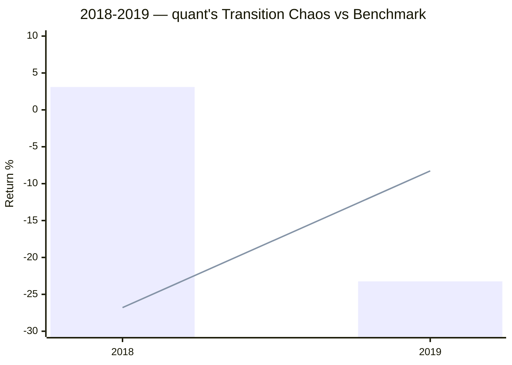
> Bar = quant SC | Line = Nifty SC 250 TRI

In **2019 the fund fell −23.24% while the benchmark fell only −8.27% — a −14.97% relative loss**, the worst single-year relative performance of any fund in the FlexiCap or SmallCap studies. This was the height of the Escorts → quant transition (acquisition 2018, VLRT process being installed through 2019). It is the clearest evidence that the early-era record is not merely weak but was actively *destructive* during the handover. It also explains the bizarre 2018→2019 inversion: the dead fund "outperformed" a −27% benchmark in 2018 (it wasn't really invested), then collapsed in 2019 as the portfolio was being rebuilt. **No part of the celebrated VLRT record predates this collapse** — which is precisely why the VLRT-era clock starts ~2020.

---

## The −51.60% Max Drawdown — Deepest *and* Longest Underwater in the Study

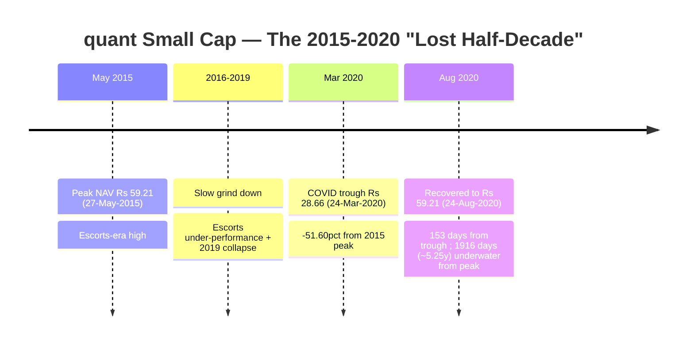

| Metric | Value |
|--------|-------|
| Peak | ₹59.21 (27-May-2015) |
| Trough | ₹28.66 (24-Mar-2020) |
| Max Drawdown | **−51.60%** |
| Days underwater (peak→recovery) | **1,916 days (~5.25 years)** |
| Recovery from trough | 153 days (the VLRT-era V) |

**This is the deepest *and* longest-underwater drawdown of any fund studied.** It is comparable in *depth* to HSBC (−52.45%) but far worse in *duration*: HSBC was underwater ~3 years; quant was below its 2015 high for **over five years.** Critically, this drawdown is **an Escorts-era event** — it reflects the moribund 2015–2019 fund plus the 2019 collapse plus COVID. The fast 153-day recovery from the trough is the VLRT era kicking in.

**The VLRT era's own worst drawdown is much milder — −25.17%** (peak ₹150.14 on 17-Jan-2022 → trough ₹112.35 on 20-Jun-2022, recovered in 163 days). The fund is **currently ~2.7% below its all-time high** of ₹306.52 (27-Sep-2024). So the risk read splits in two: *as an Escorts-era fund it suffered a −51.6% / 5-year drawdown; as a VLRT-era fund its worst test so far is a −25% / 5-month dip.* Which one represents the future depends entirely on whether VLRT's claimed risk-management (the "R" and "T" in VLRT) holds at ₹31,900 Cr — a question M2 must press, since the VLRT era has **never faced a genuine multi-year small-cap bear.**

---

## Rolling 3Y Returns Distribution

*Computed from 2,565 rolling 3-year windows (Jan 2013 – Jun 2026).*

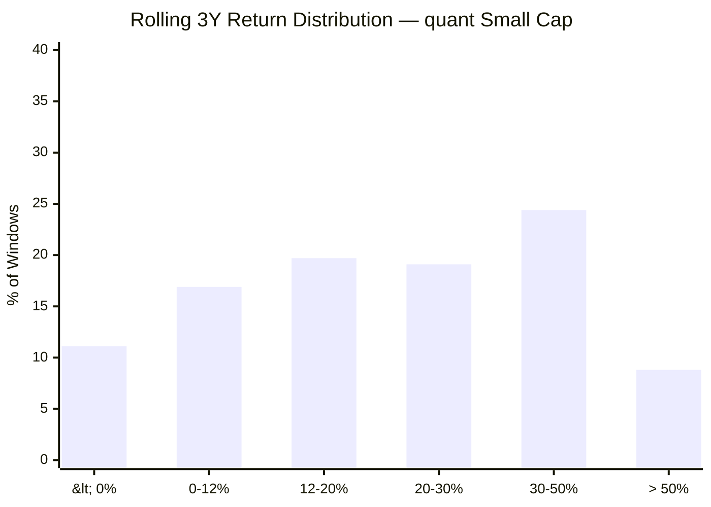

| Metric | Value |
|--------|-------|
| Total 3Y windows | 2,565 |
| Minimum | **−16.56%** |
| Maximum | +70.79% |
| Mean / Median | 21.24% / 18.14% |
| Windows ≥ 12% | 52.3% |
| Negative windows | **11.1%** |

**Interpretation.** 11.1% of all 3-year windows were *negative* — the **worst 3Y rolling loss rate of any fund studied** (BOI 0%, DSP 7.5%, HSBC 9.9%). The negatives are concentrated in windows ending around the 2019 collapse and COVID — i.e., Escorts-era windows. But unlike BOI's "flawless-but-bull-only" record, **these are real losses an investor actually experienced.** The enormous range (−16.56% to +70.79%) is the statistical signature of an extreme, high-turnover, high-volatility fund.

---

## Rolling 5Y Returns Distribution

*Computed from 2,072 rolling 5-year windows.*

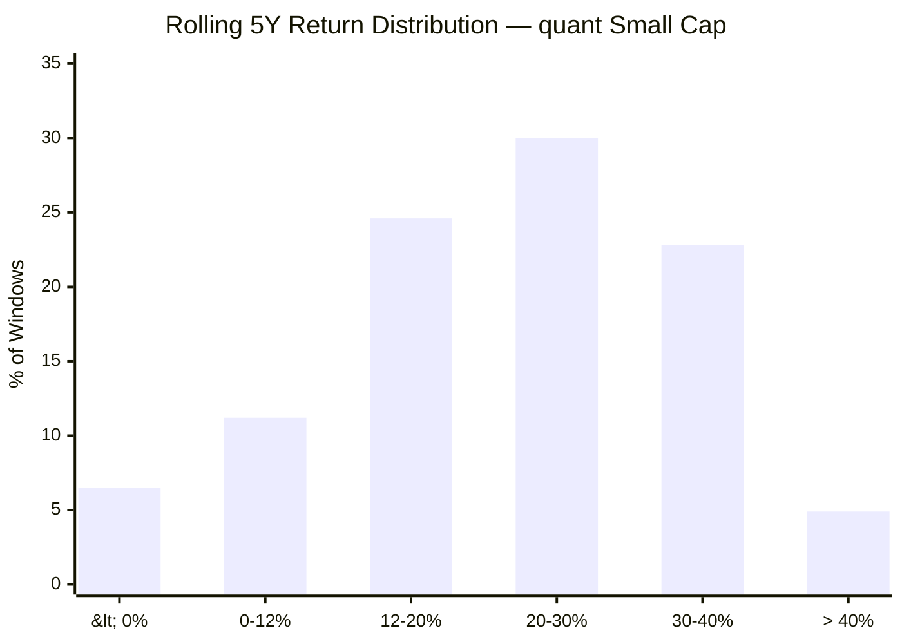

| Metric | Value |
|--------|-------|
| Total 5Y windows | 2,072 |
| Minimum | **−9.97%** |
| Maximum | +54.64% |
| Mean / Median | 21.16% / 22.25% |
| Windows ≥ 12% | 63.4% |
| Negative windows | **6.5%** |

**The single most damaging consistency statistic in the module.** DSP, HSBC and BOI all have **0.0% negative 5Y windows** — no five-year holding period ever lost money. quant Small Cap has **6.5% negative 5Y windows, with a minimum of −9.97%** — meaning there were genuine five-year stretches (Escorts-era entries) in which an investor *lost ~10% a year for five years.* This is the clearest data-driven reason the "13-year track record" cannot be taken at face value: across the full history, even the supposedly safe 5-year horizon carried real loss risk. (On a VLRT-era-only basis the picture would be far better — but that sample is too short for a 5Y rolling analysis.)

---

## Probability of Loss by Holding Period

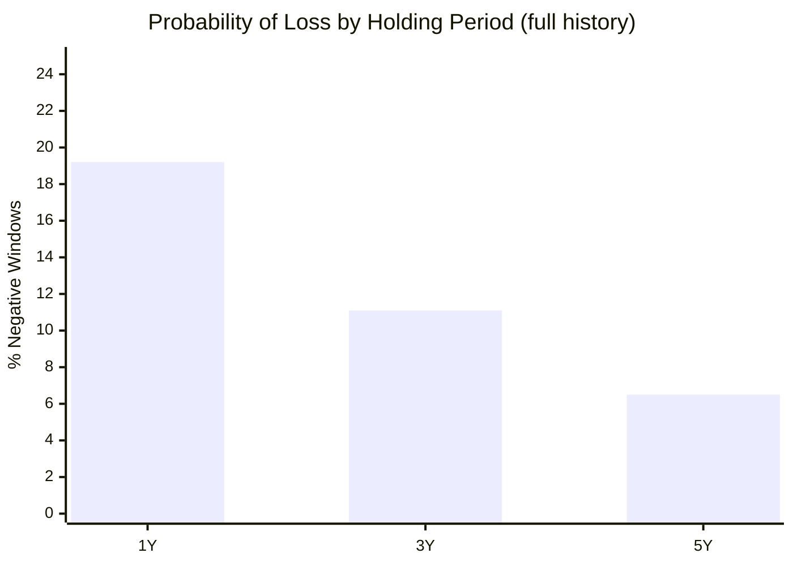

| Holding Period | Probability of Loss | Typical Worst Outcome |
|---------------|--------------------|-----------------------|
| 1 Year | ~19.2% | −43.4% (a crash year) |
| 3 Years | **11.1%** | −16.56% CAGR |
| 5 Years | **6.5%** | −9.97% CAGR |

Unlike every shortlisted fund, quant's loss probability **does not fall to zero even at 5 years** — the legacy of the dead Escorts era. The standard small-cap message ("never judge on 1Y") applies, but quant adds a harsher caveat: *its full-history record shows that even patient 5-year holders were not guaranteed a positive outcome.* The bull case is that all of these negatives are pre-VLRT; the bear case is that VLRT has simply not yet been tested through the kind of multi-year bear that produced them.

---

## SIP XIRR vs Lumpsum CAGR (₹20,000/month)

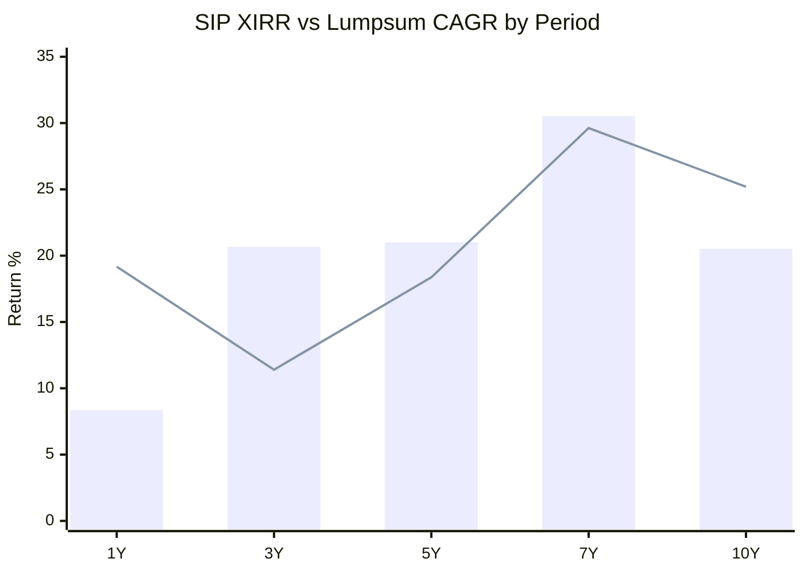
> Bar = Lumpsum CAGR | Line = SIP XIRR

| Period | Total Invested | Current Value | SIP XIRR |
|--------|---------------|---------------|----------|
| 1 Year | ₹2.40 L | ₹2.62 L | **19.17%** |
| 3 Years | ₹7.20 L | ₹8.50 L | **11.40%** |
| 5 Years | ₹12.00 L | ₹18.83 L | **18.37%** |
| 7 Years | ₹16.80 L | ₹47.57 L | **29.62%** |
| 10 Years | ₹24.00 L | ₹90.26 L | **25.20%** |

**The 10Y SIP outcome (₹24L → ₹90.26L, 25.20% XIRR) is by far the highest of any fund studied** — towering over HSBC and DSP (both ~₹65L). But it is the *most* era-flattered number in the module: a 10-year SIP starting 2016 spent four years buying *cheap, stagnant Escorts-era units* that were then revalued by the 2020–2021 VLRT explosion. It is real money an investor would have made — but it is a **one-time, non-repeatable artifact** of the regime change, not evidence of a process that will repeat from today's ₹298 NAV and ₹31,900 Cr AUM. The **3Y SIP XIRR (11.40%)** — the most VLRT-pure SIP window — is weaker than BOI (16.76%) though better than HSBC (8.71%), reflecting the 2025 slump.

---

## Upside vs Downside Capture

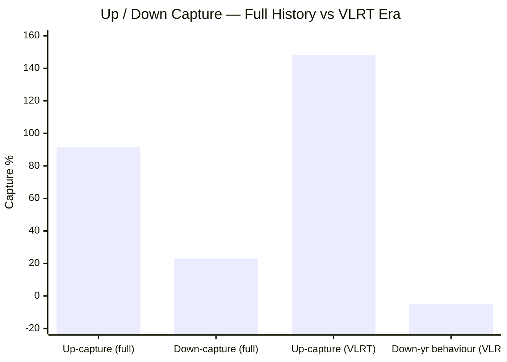
> VLRT-era "down-year behaviour" is shown near zero because the fund was *positive* in both VLRT-era down-benchmark years (2022, 2025) — it did not capture downside at all.

| Metric | Full history (2014–25) | VLRT era (2020–25) |
|--------|------------------------|--------------------|
| Up-capture | 91.6% | **148.2%** |
| Down-capture | 23.0% | Negative (fund positive in both down years) |
| Avg up-year alpha | −3.16% | strongly positive |
| Avg down-year protection | +8.61% | +9.75% |

---

## 🆕 The Misleading Capture Ratios *(quant-specific)*

The **full-history capture profile looks elite — 91.6% up, 23% down** — superficially PP-grade asymmetry. **It is an illusion produced by the era-blend:**

- The "23% down-capture" is dominated by **2018**, when the fund "fell" +3.10% against a −26.80% benchmark. That is not downside protection — it is a **dead fund failing to participate** in the asset class.
- The mediocre full-history up-capture (91.6%) is dragged down by **2014 (+11.89% vs ~+69%) and 2017 (+5.26% vs ~+57%)** — again, non-participation, not a deliberate defensive stance.

The **VLRT-era capture is the real profile: ~148% up-capture** (a high-octane, high-beta participant that captures far *more* than the index in up years) paired with genuine outperformance in the two mild down years (2022, 2025). This is an **aggressive, momentum-driven engine**, not a defensive compounder — the opposite of what the blended numbers suggest. **Any capture ratio quoted for this fund must specify the era; the full-history figures actively mislead.**

---

## Absolute Returns — Short-Term Trend

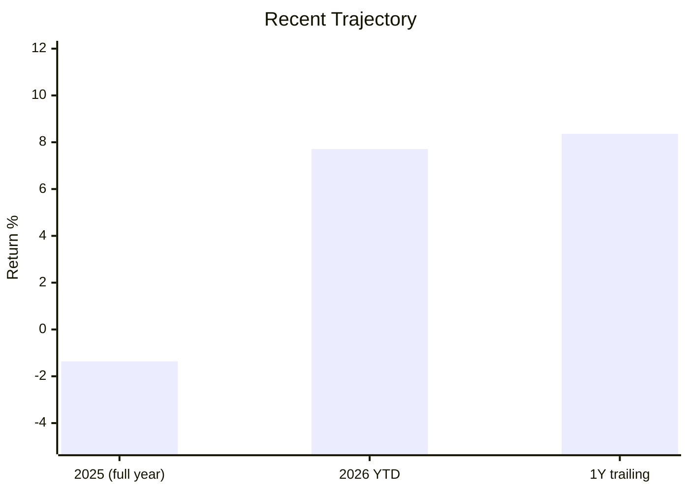

After a near-flat 2025 (−1.36%, but +4.65% alpha — it protected), quant has recovered: 2026 YTD **+7.71%** (vs +2.36% benchmark) and 1Y trailing **+8.36%** (+9.35% alpha). Momentum is positive and ahead of the index, though the fund remains ~2.7% below its Sep-2024 all-time high.

---

## 🆕 Returns vs Trustworthiness — The VLRT / Front-Running Shadow *(quant-specific)*

No other fund in either study requires this section. quant Small Cap's entire meaningful return record (2020+) was generated by the **VLRT model — a proprietary, undisclosed "black box"** — run by a CIO (Sandeep Tandon) who is the subject of an **active SEBI front-running investigation** (June-2024 raid; ₹70–80 Cr of front-running uncovered; consent settlement filed and likely to be accepted as of late-2025/early-2026).

The return-quality implication is direct and unavoidable:

1. **The alpha is unverifiable.** Because VLRT is undisclosed, an investor cannot determine whether the 2020 (+51% alpha) and 2021 (+30% alpha) years were genuine repeatable skill, a one-off momentum regime perfectly suited to those years, or — in the worst interpretation the SEBI probe raises — partly the product of information advantage. **The very years that built the entire long-horizon record are the ones an investor can least independently trust.**
2. **A settlement is not exoneration.** A consent settlement resolves the matter without admission or denial of guilt — it removes the *legal* overhang but does not *validate* the VLRT alpha as clean skill.
3. **This caps the return module.** Strong numbers that cannot be attributed to a verifiable, repeatable process are worth less, for a 10-year SIP, than weaker numbers from a transparent one (DSP's documented three-pillar framework, say). The front-running shadow is a Module 5/6 governance issue in scoring weight, but it is a **Module 1 return-quality issue in substance.**

This is the decisive reason quant Small Cap's strong VLRT returns do **not** lift its Module 1 score into DSP/Invesco territory despite competitive raw alpha.

---

## 🆕 The 135× AUM Explosion vs Forward Returns *(quant-specific, foreshadows M4)*

The VLRT returns were *built small and are now run large*:

| Date | AUM | Context |
|------|-----|---------|
| 2018 (acquisition) | **~₹235 Cr** | Tiny Escorts legacy fund |
| 2020–2021 (VLRT surge) | a few thousand Cr | The +76% / +91.7% years — built at modest scale |
| May–Jun 2026 | **~₹31,900 Cr** | Over the ₹30,000 Cr disqualification cap; still growing |

That is a **~135× AUM increase in eight years**, with the explosive returns earned largely at a fraction of today's size. The Module 1 relevance: **the forward return distribution cannot resemble the backward one.** A high-turnover, momentum-rotation model that thrived deploying a few thousand crore into genuine small caps faces a structurally different problem at ₹31,900 Cr — every position is larger, harder to enter/exit without market impact, and pushed toward the liquid 250th–350th-rank "large small-caps." The 36% VLRT CAGR is a number from a smaller fund; whatever quant Small Cap returns over the next 10 years, **the AUM alone makes a repeat of the 2020–2021 alpha structurally improbable.** (Full deployment-friction analysis → Module 4.)

---

## Returns vs Peers — All 8 Shortlisted + quant (5Y CAGR)

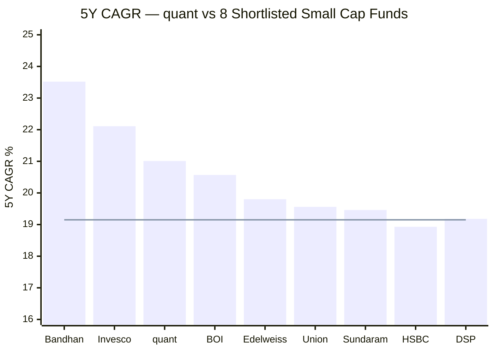
> Line = Stage-2 screening median threshold (19.15%). quant's 5Y CAGR (21.01%) would rank **3rd**, behind only the two most inception-biased funds (Bandhan, Invesco).

On raw 5Y CAGR quant ranks 3rd of the nine — genuinely strong. But the three funds above the line that beat or match it (Bandhan, Invesco, and quant itself) are **all post-trough / era-contaminated records**, while the funds *below* it (DSP, HSBC) carry bias-free, full-cycle histories. quant's raw-return rank flatters it for the same reason Bandhan's and Invesco's do.

---

## Risk Metrics — Peer Comparison (Screening Basis)

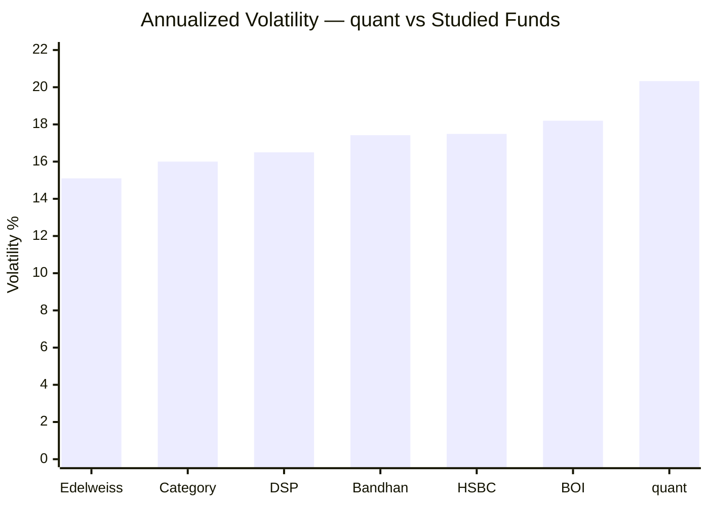

| Metric | quant | Best in Group | Worst in Group | quant Rank |
|--------|-------|--------------|----------------|------------|
| Volatility (full) | **20.33%** | Edelweiss ~15.1% | quant 20.33% | **Highest (worst)** |
| Max Drawdown | **−51.60% / 5.25y** | Bandhan −24% | quant (depth+duration) | Worst on duration |
| 5Y rolling % negative | **6.5%** | DSP/HSBC/BOI 0.0% | quant 6.5% | **Worst** |
| Sharpe (computed 3Y) | 0.81 | DSP 0.98 | HSBC 0.58 | Mid-tier |
| 5Y CAGR | 21.01% | Bandhan 23.52% | HSBC 18.93% | 3rd |

quant is the **highest-volatility, deepest-drawdown, worst-rolling-consistency fund in the comparison set** — yet posts a top-3 5Y CAGR and a respectable computed Sharpe. That is the VLRT signature: extreme dispersion, with the upside outweighing the downside *during a favourable six-year regime.*

---

## Manager Tenure & Continuity *(detail deferred to Module 5)*

| Attribute | Detail |
|-----------|--------|
| Lead / CIO | Sandeep Tandon (Founder, CIO) — entire VLRT era |
| Named team | Ankit A. Pande, Sanjeev Sharma, Varun Pattani, Ayusha Kumbhat, Sameer Kate, Yug Tibrewal — a **7-manager team** |
| Tenure on this fund | Individual start dates to be verified in M5 (Pande/Sharma are the long-standing equity PMs; the broader team was expanded post-2023) |
| Continuity across eras | **No** — the Escorts-era management is entirely gone; VLRT team installed 2019–2020 |
| Key-person risk | **Extreme** — VLRT is Tandon's undisclosed model; the FlexiCap study rated this the highest key-man risk of any fund |
| Regulatory | **Active SEBI front-running probe on Tandon; consent settlement filed** (M5/M6) |

For Module 1 the relevant facts are: (a) **the meaningful return record belongs entirely to the post-2019 VLRT team**, not the inception NAV; and (b) the **return-generating process is undisclosed and under regulatory scrutiny** — both of which weigh on return *quality* regardless of the raw figures.

---

## Comparison with Studied Small Cap Funds

| Dimension | quant | DSP | HSBC | BOI | Bandhan | Invesco |
|-----------|-------|-----|------|-----|---------|---------|
| Inception | 2013 (**dead until 2020**) ⚠️ | 2013 ✅ | 2014 ✅ | 2018 ⚠️ | 2020 ⚠️ | 2018 ⚠️ |
| Meaningful record | **~6y (VLRT)** | 14y | 12y | 7.5y | 3y | 7.5y |
| Real 2018 test | technically — but **dead fund** | yes ✅ | **yes ✅ (+13.9% α)** | no | no | no |
| 5Y CAGR | **21.01% (#3)** | 19.18% | 18.93% | 20.57% | 23.52% | 22.11% |
| 10Y CAGR | 20.52% (blended) | 19.26% | 19.57% | n/a | n/a | n/a |
| SI alpha | **+1.82%/yr** ⚠️ | strong | ~+6.7%/yr | inception-flattered | biased | biased |
| Worst calendar yr | **−23.24% (2019)** ⚠️ | −25% (2018) | −12.94% (2018) | −7.19% (2025) | −4.59% (2022) | — |
| 5Y rolling % negative | **6.5%** ⚠️ worst | 0.3% | 0.0% | 0.0% | n/a | n/a |
| Max DD / underwater | **−51.6% / 5.25y** ⚠️ | −49% / ~1y | −52% / ~3y | −32% / 137d | −24% | −38% |
| Volatility | **20.3%** ⚠️ highest | ~16.5% | 17.5% | 18.2% | 17.4% | ~ |
| Sharpe (computed) | 0.81 | 0.98 | 0.58 | 0.85 | ~1.08 | ~0.96 |
| 10Y SIP value | **₹90.3L** ⚠️ flattered | ₹65.5L | ₹65.8L | n/a (7.5y) | n/a | n/a |
| Return trustworthiness | **black-box + SEBI probe** ⚠️ | transparent ✅ | transparent ✅ | transparent ✅ | transparent ✅ | settlement (AMC) |
| Provisional M1 | **~3.4** | 4.5 | 3.7 | 3.7 | 3.5 | 3.72 |

**Cross-fund insight.** quant Small Cap is the study's **"highest-octane, lowest-trust" return profile.** It posts a top-3 raw 5Y CAGR and the highest 10Y SIP outcome, driven by a genuinely explosive 2020–2021 — but it simultaneously owns the **worst rolling-loss record, the deepest and longest drawdown, the highest volatility, the worst single relative year (2019), the most era-contaminated "long" record, and the only unverifiable/under-investigation return engine in either study.** It is the mirror image of DSP: DSP earns slightly lower headline returns through a transparent, 14-year, multi-cycle, low-turnover process; quant earns slightly higher headline returns through an opaque, 6-year, single-regime, high-turnover one. For a 10-year SIP where return *durability and trust* matter as much as magnitude, that contrast is decisive.

### vs the quant FlexiCap Sibling (companion study)

| Metric | quant Small Cap | quant Flexi Cap |
|--------|-----------------|-----------------|
| AMC / Model / CIO | Same — quant MM / VLRT / Tandon | Same |
| 10Y CAGR | 20.52% | 20.87% |
| Volatility | 20.33% | 16.00% |
| Max Drawdown | −51.60% | −54.60% |
| Return engine | VLRT black box | VLRT black box |
| SEBI probe on CIO | Yes | Yes |
| Study verdict | (this module: ~3.4 M1) | **2.49/5 overall — failed 6 of 7 hard filters** |

The same model and CIO drive both funds; the FlexiCap sibling scored **2.49/5 overall** in the companion study, eliminated on governance hard filters (active probe, black box, concentration, drawdown). quant Small Cap's *returns* module is comparable-to-stronger than the FlexiCap version, but it inherits the identical governance ceiling — which will dominate Modules 5/6 exactly as it did for the FlexiCap fund.

---

## Module 1 Scorecard

| Sub-dimension | Weight | Score (1–5) | Reasoning |
|---------------|--------|-------------|-----------|
| Long-term returns (genuine) | High | **3.5** | 10Y 20.52% is high but *blended*; SI alpha only +1.82%/yr exposes the dead era |
| Consistency across periods | High | **2.0** | Bimodal; −57%/−52% Escorts-era alphas; −23.24% in 2019; not a steady compounder |
| Alpha generation | High | **4.0** | VLRT-era 5Y +5.83%, 10Y +6.57% are genuinely strong (pre-trust-caveat) |
| Crash resilience | Critical | **2.5** | −51.6% / 5.25y underwater (Escorts era); VLRT-era −25% handled, but **never faced a real bear** |
| Era / inception integrity | Modifier | **2.0** | Meaningful record only ~6y, launched at the COVID floor; long record is an artifact |
| Recent momentum | Medium | **4.0** | 2026 YTD +7.71% (+5.35% α), 1Y +8.36% (+9.35% α) |
| Peer rank on raw 5Y | Medium | **4.0** | 21.01% — 3rd of 9, comfortably above the screen threshold |
| SIP XIRR quality | High | **3.5** | 10Y ₹90.3L is the study's best — but VLRT-flattered; 3Y SIP 11.40% middling |
| Rolling return consistency | High | **2.0** | **Worst in study** — 6.5% negative 5Y, 11.1% negative 3Y windows |
| Drawdown depth/duration | Medium | **2.0** | −51.6% over 5.25 years — deepest and longest of any studied fund |
| Risk-adjusted (Sharpe) | High | **4.0** | Computed 3Y Sharpe 0.81 / Sortino 0.96 — good (screening 0.149 is an artifact) |
| **Return trustworthiness** | **Critical** | **2.0** | **VLRT black box + active front-running probe — the alpha cannot be independently verified** |
| **Module 1 Overall** | **100%** | **~3.4 / 5** | **A high-octane, top-3-raw-return fund whose long record is a 6-year VLRT sprint glued to a 7-year dead fund — and whose explosive alpha cannot be trusted as repeatable skill.** Genuine VLRT-era strengths (5Y +5.83% alpha, top SIP outcome, good computed Sharpe, protective 2022/2025) are offset by the worst rolling-loss record, deepest/longest drawdown, highest volatility, worst single year (2019), an era-blended "long" record, the 135× AUM headwind, and — decisively — the black-box/front-running return-trust shadow. Lands **below DSP/Invesco/HSBC/BOI**, around Bandhan, despite the strong raw numbers. |

---

## SIP Implication

quant Small Cap Fund is the study's **"spectacular returns you cannot fully trust"** candidate. On the numbers that matter for a satellite SIP — a 21.01% 5Y CAGR (3rd of nine), +5.83% verified 5Y alpha, the highest 10Y SIP outcome in the entire study (₹90.3L), protective behaviour in both VLRT-era down years (2022, 2025), and a computed 3Y Sharpe of 0.81 — it looks, in isolation, like one of the best return engines available.

Three structural facts dismantle that first impression. **First, the record is not what it appears:** the 13.4-year history is a ~7-year dead Escorts fund (negative through March 2020, with −57% and −52% alphas in the 2014/2017 bull years and a −23.24% collapse in 2019) bolted onto a ~6-year VLRT sprint that effectively begins at the COVID floor. The blended 10Y/since-inception figures, and the ₹90L 10Y SIP, are era-flattered artifacts, not evidence of durable compounding — the give-away is the **+1.82%/yr since-inception alpha**, which shows the dead era almost entirely cancelled the VLRT surge over a full holding life. **Second, the risk is real and unproven at scale:** quant owns the worst rolling-loss record in the study (6.5% of 5-year windows negative — every peer is at 0%), the deepest and longest drawdown (−51.6% over 5.25 years), and the highest volatility (20.33%); the VLRT era's worst test so far is only a −25% dip, and it has **never faced a multi-year small-cap bear at anything like its current ₹31,900 Cr AUM** (135× its size when the alpha was built). **Third, and decisively, the returns cannot be independently verified:** VLRT is an undisclosed black box run by a CIO under an active SEBI front-running probe (consent settlement filed) — the very 2020–2021 years that built the record are the ones an investor can least trust.

For a ₹20K/month satellite SIP with a 10Y+ horizon, the verdict is that quant Small Cap offers **genuine VLRT-era return power undermined by an era-contaminated long record, the study's worst risk-consistency profile, a structural AUM headwind, and an unverifiable, under-investigation return engine.** It is studied here as an instructive out-of-shortlist case — and the returns module, strong as the raw figures are, confirms rather than overturns the screen.

**Recommended holding period:** Minimum 7 years; ideally 10+ — *if* one accepts the trust and risk caveats. **Do not be seduced by the 10Y/SIP headline numbers — they are a one-time regime-change artifact, the long record hides a 5-year underwater stretch, and the alpha that built it cannot be independently verified.**

---

## One-Line Verdict

> **quant Small Cap is the study's highest-octane, lowest-trust return profile:** a top-3 raw 5Y CAGR (21.01%) and the best 10Y SIP outcome (₹90.3L) powered by an explosive VLRT era — but the "13-year record" is a 6-year sprint launched at the COVID floor and glued to a 7-year dead Escorts fund (SI alpha just +1.82%/yr), carrying the worst rolling-loss record, deepest/longest drawdown (−51.6% / 5.25y) and highest volatility in the study, a 135× AUM headwind, and an undisclosed VLRT engine under an active SEBI front-running probe whose alpha cannot be verified. **Module 1: ~3.4/5 — strong raw numbers, deeply discounted by era-contamination, risk-inconsistency, and return-trust.**

---

*Module 1 completed: June 2026 | Returns Consistency | MFAPI methodology (quant Small Cap scheme 120828, 3,307 points, Jan 2013 → Jun 2026) | Trailing CAGRs reproduce AdvisorKhoj to within 0.03% | Benchmark = Nifty Smallcap 250 TRI | Status: out-of-shortlist study (Stage-1 elimination — on corrected ER ~0.6%, fails only the AUM cap) | Provisional M1 Score: ~3.4/5 (subject to M2–M6)*
