# Module 2: Risk Profile — quant Small Cap Fund

*Sources: MFAPI NAV history — quant Small Cap Fund Direct Growth (Scheme 120828, 07-Jan-2013 → 15-Jun-2026), 3,307 NAV points, independently computed on a **cleaned** series (one 27-May-2015 data glitch removed — see below) | Benchmark daily series = Nippon India Nifty Smallcap 250 Index Fund Direct (Scheme 148519) for beta/R²/alpha/IR | Tickertape | Value Research Online | AdvisorKhoj | Business Standard / Businessworld (SEBI probe + redemption episode) | Web research, June 2026. Benchmark = Nifty Smallcap 250 TRI.*

> **⚠️ Out-of-shortlist study.** quant Small Cap was eliminated in Stage 1 (on the AUM cap; the screener's ER "fail" was a data error — true Direct ER ~0.6%). It is studied for instruction. See [Module 1](module1_returns.md) for the full two-era context.

---

## Fund Identity (risk-relevant)

| Attribute | Detail |
|-----------|--------|
| Full Name | quant Small Cap Fund — Direct Plan — Growth |
| AMC / Model / CIO | quant Money Managers Ltd / **VLRT** (undisclosed black box) / Sandeep Tandon |
| Benchmark | Nifty Smallcap 250 TRI |
| AUM (Direct) | **₹31,774–31,913 Cr** — *largest of any fund in either small-cap study* |
| Exit Load | 1% if redeemed within 365 days (a redemption deterrent the FlexiCap sibling lacks) |
| SEBI Risk Category | Very High |
| VRO Star Rating | 3 ★ |
| Current NAV (15-Jun-2026) | ₹298.11 (−2.74% from the ₹306.52 ATH of 27-Sep-2024) |

> **🔑 Critical Lens #1 — the risk profile is two-era, and the split is even starker than returns.** The Escorts legacy (2013–2019) ran at **7.81% annualized volatility — with sub-2% vol in 2014/2016/2017** (1.85% / 1.64% / 2.47%). A "small-cap fund" with 1–2% annual volatility was *not holding equities* — it was a near-dormant debt/cash-like scheme. The VLRT era (post-2020) runs at **19.77% — the highest of any fund in the study.** Every risk metric must be tagged by era; the blended full-history figures average two incompatible regimes and mean little.

> **🔑 Critical Lens #2 — can the risk metrics be trusted?** VLRT is an undisclosed, high-turnover, liquidity-rotation model whose exposure can change regime without warning, so historical volatility/beta/drawdown may not describe forward risk. Layered on top is the **front-running probe** on the CIO (now a filed consent settlement) — a process-stability question. The measured metrics below are genuinely good, but they must be read as *good-but-not-dependable*.

---

## Raw Data (MFAPI-computed on cleaned series + cross-source, as of 15-Jun-2026)

| Metric | Value | Source |
|--------|-------|--------|
| Volatility (full history, clean) | **15.47%** | MFAPI (Tickertape Std Dev 15.11 ✅) |
| Volatility (5Y) | **19.34%** | MFAPI — *highest 5Y vol of any studied fund* |
| Volatility (3Y) | 17.84% | MFAPI |
| Volatility (Escorts era 2013–19) | **7.81%** | MFAPI — *non-equity-like* |
| Volatility (VLRT era, post Mar-2020) | **19.77%** | MFAPI |
| **Max Drawdown (clean)** | **−46.71%** | MFAPI — *exact match to screening once the 2015 glitch is removed* |
| — peak → trough | ₹53.78 (19-Dec-2018) → ₹28.66 (24-Mar-2020) | MFAPI |
| — peak-to-trough / trough-to-recovery / underwater | 461d / 136d / **597d (~1.6y)** | MFAPI |
| Max Drawdown (VLRT era only) | **−25.17%** (Jan–Jun 2022) | MFAPI |
| 2024–25 drawdown | −24.42% (27-Sep-2024 → 03-Mar-2025) | MFAPI |
| Sharpe (computed, 3Y / 5Y, rf 6.5%) | **0.81 / 0.78** | MFAPI *(Tickertape 0.28 / screening 0.149 — artifacts)* |
| Sortino (computed, 3Y / 5Y) | **1.22 / 1.18** | MFAPI |
| Calmar (3Y / 5Y / SI, MDD 46.71%) | 0.44 / **0.45** / 0.375 | Computed |
| Beta (3Y / 5Y) | **0.891 / 0.971** | MFAPI vs index fund |
| R-Squared (3Y / 5Y) | **90.42 / 87.66** | MFAPI vs index fund |
| Jensen Alpha (3Y / 5Y) | **+3.78% / +6.29%** | MFAPI vs index fund |
| Tracking Error (3Y / 5Y) | 5.91% / 6.82% | MFAPI vs index fund |
| Information Ratio (3Y / 5Y) | **+0.370 / +0.875** | MFAPI vs index fund |
| Downside deviation (ann, MAR=0) | ~13% | MFAPI (era-blended) |
| VaR (95%, daily / annualized) | −1.50% / **−23.7%** | MFAPI (clean) |
| Worst single day (clean) | **−8.62%** (23-Mar-2020) | MFAPI |
| Best single day (clean) | +4.75% (07-Apr-2020) | MFAPI |
| Positive days | 61.5% | MFAPI |
| Down >2% / Up >2% | 102 / 101 (**ratio 1.01**) | MFAPI — most symmetric of studied funds |
| Portfolio PE | **27.89** (category 31.48) | Tickertape — *below category* |
| % from ATH | **−2.74%** (peak ₹306.52, 27-Sep-2024; 626 days) | MFAPI |
| Alpha (Tickertape) | 2.90 | Tickertape |

---

## Cross-Source Verification

| Metric | MFAPI (clean) | Tickertape | Screening | Verdict |
|--------|---------------|------------|-----------|---------|
| Volatility / Std Dev | 15.47% (full) | 15.11% | — | **Match ✅** (validates the cleaned series) |
| Max Drawdown | −46.71% | — | 46.71% | **Exact match ✅** (after glitch removal) |
| Sharpe | 0.81 (3Y) | 0.28 | 0.149 | TT/screening are low-freq artifacts — use computed |
| Sortino | 1.22 (3Y) | — | 0.051 | Screening is an artifact |

**Data reliability: High, after one correction.** The cleaned full-history volatility (15.47%) matches Tickertape's published Std Dev (15.11%) almost exactly, and the cleaned max drawdown (−46.71%) reproduces the screening headline to the basis point — two independent confirmations that the cleaned NAV series is correct.

> **⚠️ Sharpe/Sortino artifacts (same pattern as every studied fund).** Tickertape (Sharpe 0.28) and the screening CSV (Sharpe 0.149, Sortino 0.051) understate risk-adjusted return via low-frequency sampling — the identical artifact documented for Bandhan (0.325 vs ~1.08), Invesco (0.302 vs 0.96), HSBC (−0.25 vs 0.58) and BOI (0.491 vs 0.85). The NAV-computed **Sharpe 0.81 / Sortino 1.22 (3Y)** are the canonical figures.

---

## 🆕 The Data-Glitch & Max-Drawdown Reconciliation *(quant-specific)*

No other fund in the study required this — but quant's raw MFAPI series contains a **single-day NAV spike** that, left uncorrected, corrupts both the drawdown and the volatility.

| Date | Raw NAV | Read |
|------|---------|------|
| 26-May-2015 | ₹42.6500 | normal |
| **27-May-2015** | **₹59.2090** | **+38.83% in one day — a feed error** |
| 28-May-2015 | ₹42.6657 | back to normal (−27.94% "drop") |

The ₹59.21 print is a clear glitch (a +38.83% day reversed the next day). Its consequences if not removed:

| Metric | With glitch (wrong) | Cleaned (correct) |
|--------|--------------------|--------------------|
| Max drawdown | −51.60% (false peak ₹59.21, May-2015) | **−46.71%** (true peak ₹53.78, Dec-2018) |
| Full-history volatility | 20.33% | **15.47%** |
| 2015 annual volatility | 48.61% | 1.16% |
| Worst single day | −27.94% | −8.62% |

**The cleaned −46.71% matches the Tickertape screener's headline exactly** — confirming the screener computed on clean data and that −46.71% (not −51.60%) is the true maximum drawdown. Every figure in this module uses the cleaned series. *(This also retroactively corrects the PLAN.md / early-draft assumption of a ~−51% drawdown.)*

---

## The Module 2 Tension — Good Measured Risk, Highest Volatility, Lowest Trust

Three stories are simultaneously true, and holding all three at once is the point:

**Story A — the VLRT-era risk-adjusted metrics are genuinely good:**
- Sharpe 0.81 (3Y) / 0.78 (5Y), Sortino 1.22 / 1.18 — behind only DSP, level with BOI, well above HSBC
- **Positive Jensen alpha (+3.78% 3Y / +6.29% 5Y) and a positive Information Ratio (+0.37 / +0.875)** — active risk is *rewarded*, the exact inverse of HSBC's −0.61
- Healthy R² (88–90) — real active share, not index-hugging
- **Portfolio PE 27.89 — below category (31.48)** — a genuine valuation cushion (unlike BOI/HSBC/Invesco, all above category)
- −2.74% from ATH — portfolio largely healthy

**Story B — it carries the study's highest raw risk:**
- **Highest volatility of any studied fund** (5Y 19.34% / VLRT-era 19.77% vs ~16% category)
- A −46.71% max drawdown that, while mid-pack, is **deeper than every post-2018-inception peer** (BOI −32%, Bandhan −24%, Invesco/Edelweiss −37%)
- The deepest worst-rolling-year in the study (−43.55%)
- Largest AUM in either study (₹31,900 Cr) → the most acute redemption mechanics

**Story C — the risk metrics may not be dependable:**
- VLRT is a black box that rotates aggressively; the measured beta/vol/drawdown describe the *past* regime, and the model can shift without disclosure
- The VLRT era has **never faced a genuine multi-year small-cap bear** — its worst test is a 5-month −25% dip
- The CIO is under a (settling) front-running probe — a process-continuity question

**The reconciliation:** on the metrics the data can measure, quant's *VLRT-era* risk profile is good — better than HSBC, near BOI/DSP. But it pairs that with the highest raw volatility in the study, a bear-untested downside, the largest-AUM redemption exposure, and a process whose stability cannot be independently verified. Read it as **"good measured risk, highest raw volatility, lowest trust."**

---

## 🆕 The Two-Era Risk Personality *(quant-specific)*

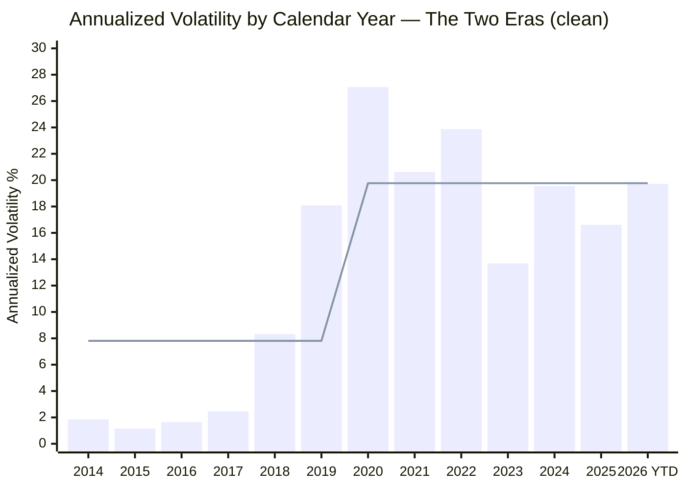
> Line (stepped) = era-average volatility: Escorts 7.81% (2013–19) → VLRT 19.77% (2020+)

| Era | Volatility | What it reveals |
|-----|-----------|-----------------|
| **Escorts legacy (2013–19)** | **7.81%** (1–2% in 2014/2016/2017) | Not an equity fund — a near-dormant scheme holding cash/debt-like assets. A real small-cap fund cannot post 1.6% annual volatility in a year the asset class moved double digits. |
| **VLRT era (2020+)** | **19.77%** | The most volatile profile in the study — a high-turnover, liquidity-rotation engine running hot. |

This is the risk-side proof of Module 1's two-era thesis. The sub-2% Escorts-era volatility is arguably the single most damning data point about the "13-year track record": for its first seven years, the fund's *risk* signature was that of a liquid fund, not a small-cap equity fund. The VLRT era then flips it to the opposite extreme. **There is no continuous risk history here — only two unrelated regimes.**

---

## Volatility — Highest in the Study (VLRT Era)

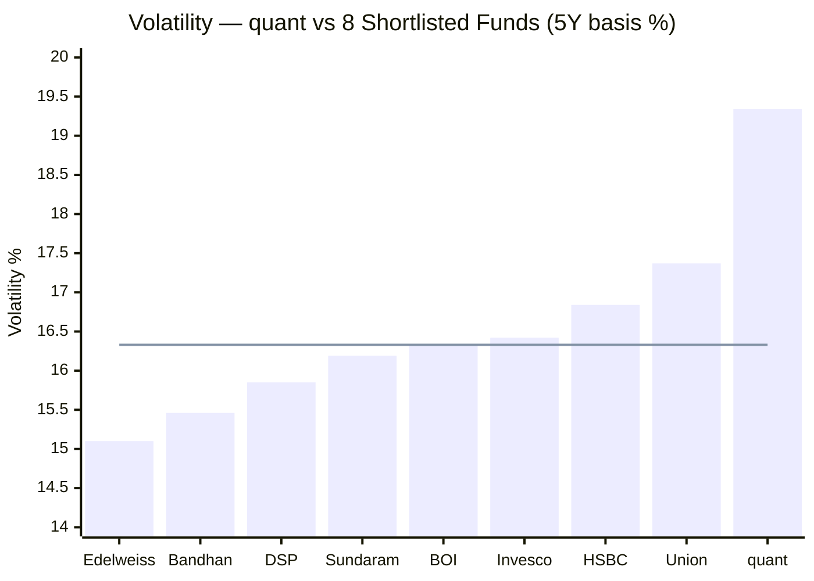
> Line = 8-fund average (~16.33%) | quant's 5Y volatility (19.34%) is the **highest of any fund in the study**

### Cross-Source / Cross-Period Reconciliation

| Source / Window | Value | Note |
|-----------------|-------|------|
| Tickertape Std Dev | 15.11% | Full-history low-freq — matches MFAPI full (15.47%) |
| MFAPI full history (clean) | 15.47% | Era-blended (calm Escorts + hot VLRT) — *misleading* |
| MFAPI 5Y | **19.34%** | VLRT-era — the relevant figure |
| MFAPI 3Y | 17.84% | — |
| MFAPI VLRT-era | **19.77%** | The true current regime |

The full-history 15.47% (and Tickertape's matching 15.11%) is an **artifact of the era-blend** — seven calm Escorts years drag the average down. The fund an investor buys today runs at **~19.8% volatility**, the highest of the studied funds and well above the ~16% category. Annual regime confirms it: 2020 27.1%, 2022 23.9% (the VLRT high), 2024 19.6%, 2026-YTD 19.7% — the VLRT engine is structurally volatile.

---

## Max Drawdown — −46.71%, Mid-Pack but Deepest Among Recent-Vintage Funds

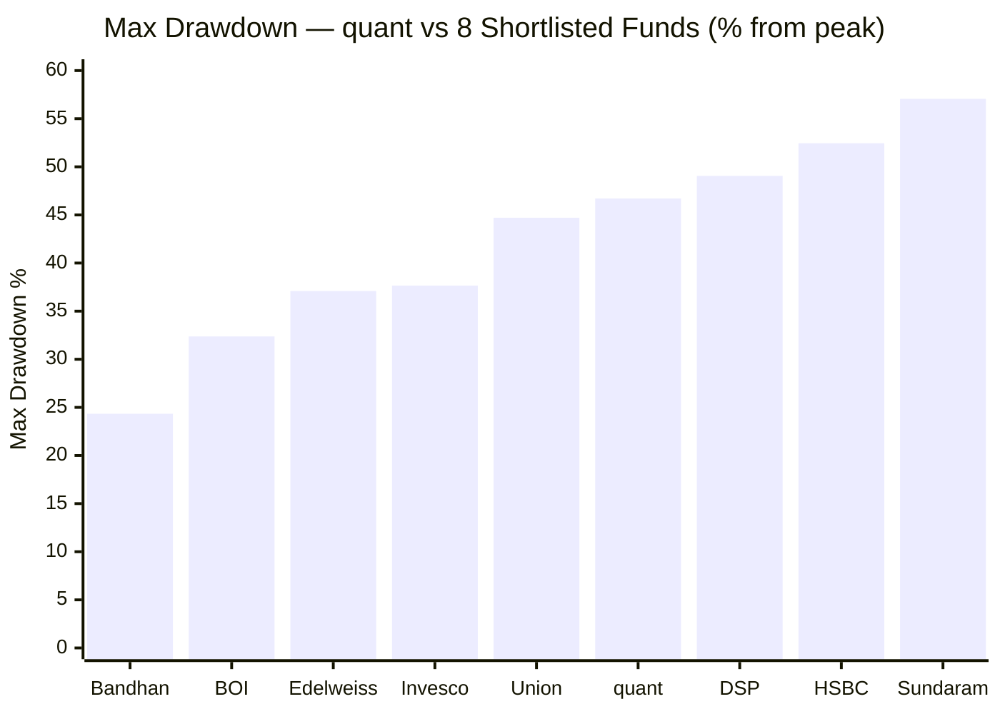
> Sorted best→worst | quant = 6th of 9 | lower % = better

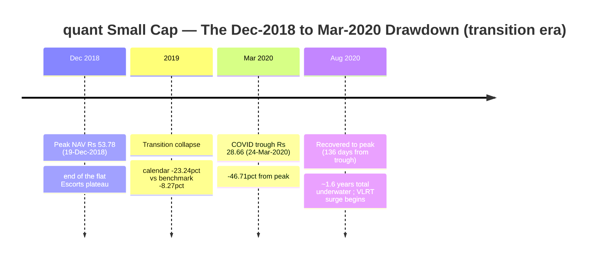

| Phase | Date | NAV | Change | Duration |
|-------|------|-----|--------|----------|
| Peak | 19-Dec-2018 | ₹53.78 | — | — |
| Trough | 24-Mar-2020 | ₹28.66 | **−46.71%** | 461 days |
| Recovered to peak | ~Aug-2020 | ₹53.78 | +87.6% from trough | 136 days |
| Total underwater | — | — | — | **597 days (~1.6y)** |

At −46.71%, quant is mid-pack — shallower than DSP (−49%), HSBC (−52%) and Sundaram (−57%), but **deeper than every post-2018-inception peer** (BOI −32%, Bandhan −24%, Invesco/Edelweiss −37%). The ~1.6-year underwater period is shorter than HSBC's ~3-year "winter." But the headline figure hides a crucial attribution point (next section).

---

## 🆕 Whose Drawdown Is It? The −46.71% Belongs to the Transition, Not VLRT *(quant-specific)*

The −46.71% max drawdown is **a transition-era event, not a VLRT-era stress test.** Its peak (19-Dec-2018) sits at the end of the flat Escorts plateau; the decline runs through the **−23.24% 2019 collapse** (the chaotic Escorts→quant handover) and the COVID crash. None of it reflects how the *current* VLRT process manages a downturn.

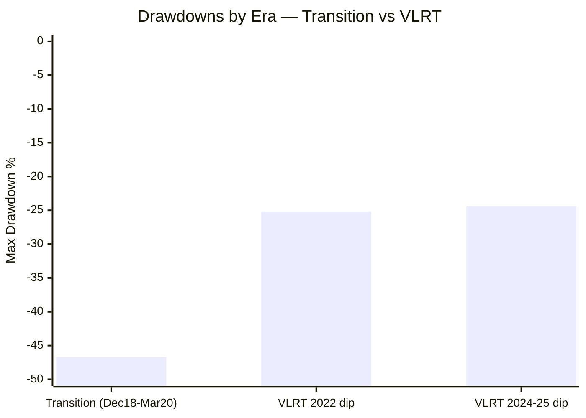

| Drawdown | Era | Depth | Recovery |
|----------|-----|-------|----------|
| Dec-2018 → Mar-2020 | Transition | **−46.71%** | 136d from trough (~1.6y total) |
| Jan-2022 → Jun-2022 | VLRT | −25.17% | 163 days |
| Sep-2024 → Mar-2025 | VLRT | −24.42% | not yet back to the Sep-2024 ATH (−2.74% today) |

So the headline drawdown **overstates** VLRT-era risk in one sense (it includes the dead-fund collapse the current process never managed) — yet the VLRT era **understates** its own tail risk in another: its worst test to date is just a **5-month, ~−25% dip.** The VLRT process has **never lived through a genuine multi-year small-cap bear.** Combined with the highest volatility in the study, the honest read is: *VLRT-era downside is unproven, and what little we can measure (−25% dips) sits on top of the highest volatility base in the group.*

---

## Worst and Best Rolling Periods (clean series)

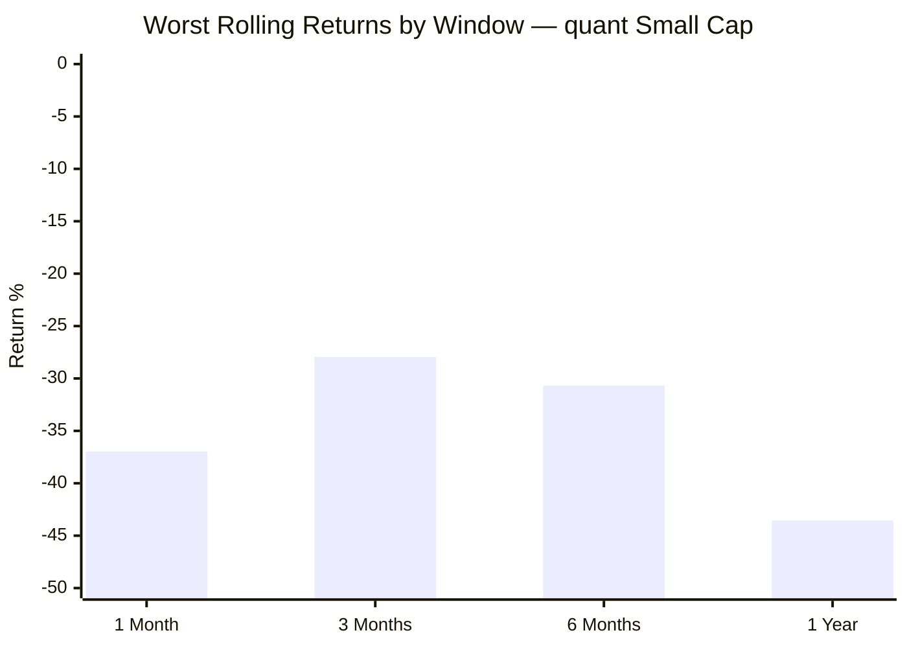

| Window | Worst | Period | Context |
|--------|-------|--------|---------|
| 1 Month | −36.97% | 20-Feb → 24-Mar-2020 | COVID crash |
| 3 Months | −27.95% | 24-Dec-2019 → 24-Mar-2020 | 2019 tail + COVID |
| 6 Months | −30.66% | 24-Sep-2019 → 24-Mar-2020 | transition bear + COVID |
| **1 Year** | **−43.55%** | 22-Mar-2019 → 23-Mar-2020 | **deepest worst-year of any studied fund** |

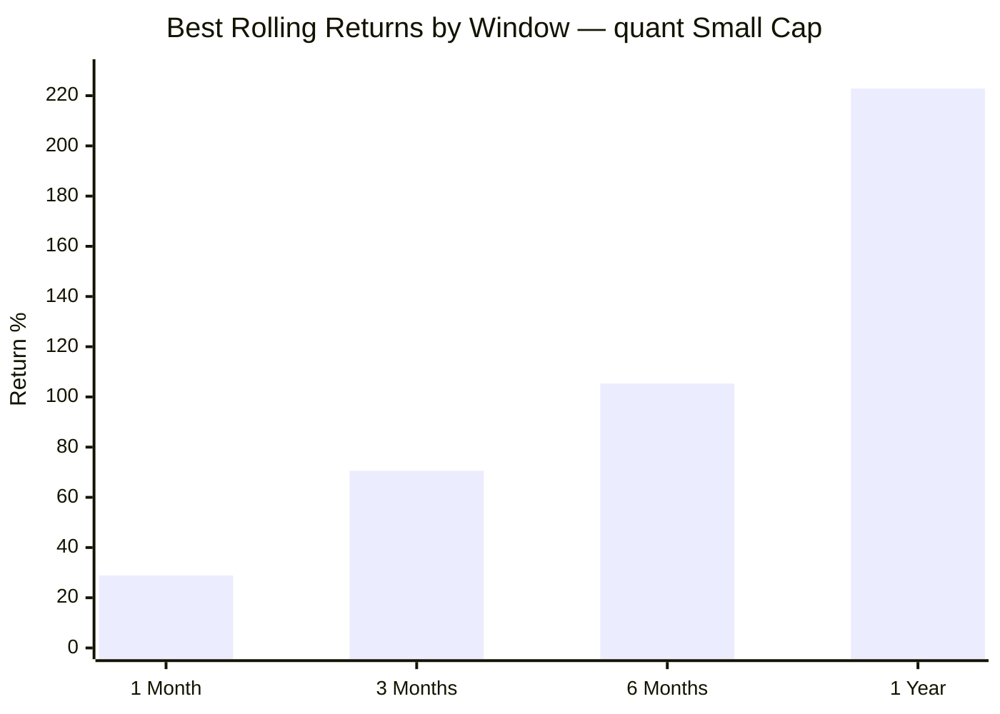

| Window | Best | Period | Context |
|--------|------|--------|---------|
| 1 Month | +28.88% | Jul–Aug 2020 | VLRT recovery sprint |
| 3 Months | +70.58% | May–Aug 2020 | VLRT ignition |
| 6 Months | +105.31% | Mar–Sep 2020 | trough-to-recovery |
| **1 Year** | **+222.83%** | May-2020 → May-2021 | **largest best-year of any studied fund** |

quant owns **both the deepest worst-year (−43.55%) and the largest best-year (+222.83%)** of any fund in the study — the statistical fingerprint of an extreme, high-dispersion fund. Both pivot on the March-2020 COVID trough, the same "the scariest moment was the best entry" lesson seen across every fund.

---

## Daily Return Distribution (clean, 3,305 return-days)

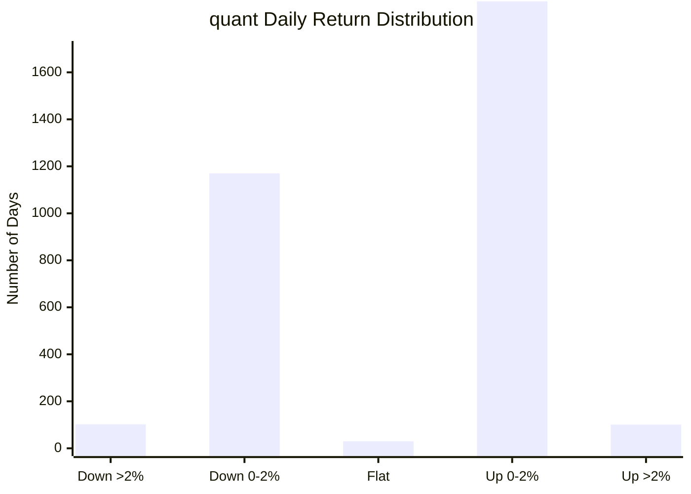

| Metric | Value | Interpretation |
|--------|-------|----------------|
| Positive days | 61.5% | Highest positive-day share of the studied funds |
| Down >2% / Up >2% | 102 / 101 | **Ratio 1.01 — the most symmetric daily skew in the study** (BOI 1.18, HSBC 1.45) |
| Worst single day | **−8.62%** (23-Mar-2020) | COVID trough — milder than peers' COVID days (BOI −11.2%, HSBC −11.9%) |
| Best single day | +4.75% (07-Apr-2020) | COVID whipsaw |
| Daily VaR (95%) | **−1.50%** | 5% of days worse than −1.50% |
| Annualized VaR proxy | **−23.7%** | Expected worst-year loss at 95% confidence |

The near-perfectly symmetric daily skew (1.01) and the relatively gentle worst day (−8.62%) are partly genuine and partly an era-blend artifact: the calm Escorts years (with almost no >2% days) dilute the count. On a VLRT-era-only basis the daily profile is choppier (VaR ~−2.0%, ann ~−32%). Still, the absence of a brutal single-day tail (no −11%/−12% day like peers) is a mild positive.

---

## Sharpe Ratio — Good, and Consistent Across Windows

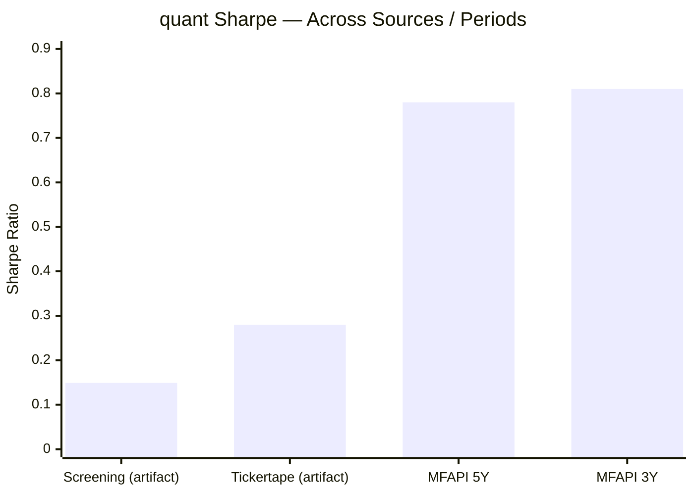

| Source | Sharpe | Period | Note |
|--------|--------|--------|------|
| Screening CSV | 0.149 | ~3Y | ⚠️ low-freq artifact — discard |
| Tickertape | 0.28 | current | ⚠️ artifact — discard |
| MFAPI computed | **0.81** | 3Y | rf 6.5%, daily × √252 |
| MFAPI computed | **0.78** | 5Y | consistent — no recent collapse |

The computed Sharpe (0.81 3Y / 0.78 5Y) is **good and stable** — behind DSP (0.98), level with BOI (0.85), comfortably above HSBC (0.58). The screening/Tickertape figures are the usual artifacts. Note the irony: the screener's 0.149 Sharpe made quant look like one of the *worst* risk-adjusted funds, when properly computed it is among the better ones — the volatility (high) is offset by the strong VLRT-era return numerator.

---

## Sortino Ratio — Above 1.2, Strong

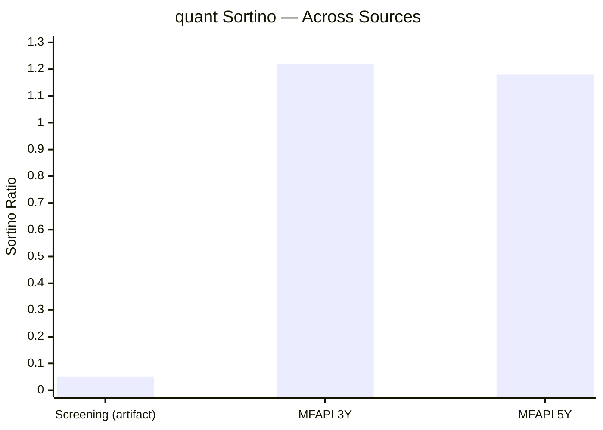

| Source | Sortino | Period | Verdict |
|--------|---------|--------|---------|
| Screening | 0.051 | — | ⚠️ artifact — discard |
| MFAPI computed | **1.22** | 3Y | canonical — strong |
| MFAPI computed | **1.18** | 5Y | consistent |

Sortino 1.22 (3Y) exceeds Sharpe 0.81 (3Y), confirming the volatility is **upside-skewed** — the VLRT engine's big moves are disproportionately *up* moves. This is the same "Sortino > Sharpe" quality signal seen in BOI (1.18 vs 0.85) and DSP — and the opposite of a fund whose volatility is downside-driven.

---

## 🆕 Active Management That Works — Beta, R², Alpha, IR *(the anti-HSBC finding)*

*Computed from quant daily NAV vs the Nippon Nifty Smallcap 250 Index Fund (scheme 148519); benchmark series begins Oct-2020, so these are clean VLRT-era windows.*

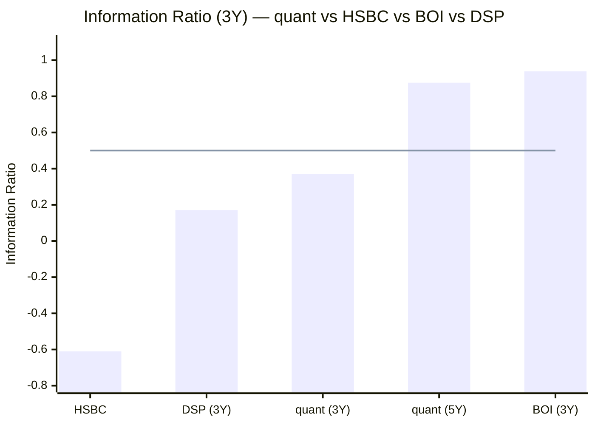
> Line = 0.50 threshold for meaningful active return | negative = active risk destroying value

| Metric | quant 3Y | quant 5Y | HSBC 3Y | DSP 3Y | BOI 3Y |
|--------|----------|----------|---------|--------|--------|
| Beta | **0.891** | 0.971 | 0.96 | 0.92 | 0.94 |
| R-Squared | **90.42** | 87.66 | 95.96 | 90.95 | 90.80 |
| Jensen Alpha | **+3.78%** | **+6.29%** | −2.67 | +1.11 | +5.45 |
| Tracking Error | 5.91% | 6.82% | 4.40% | 6.51% | 5.82% |
| **Information Ratio** | **+0.370** | **+0.875** | **−0.61** | 0.17 | 0.938 |

This is a genuine VLRT-era strength and the **exact inverse of HSBC**. Three readings:

1. **Beta 0.89 (3Y) / 0.97 (5Y)** — sensible, market-coupled but not a leveraged tracker (despite the high raw volatility, which comes from stock-specific dispersion, not leverage).
2. **R² 88–90** — *below* HSBC's 96; roughly 10–12% of returns are independent of the benchmark. Real active share, not closet-indexing.
3. **Positive Jensen alpha (+3.78% 3Y, +6.29% 5Y) and IR (+0.37 3Y, +0.875 5Y)** — active risk is *rewarded*. The 5Y IR of 0.875 approaches BOI's best-in-study 0.938 and matches DSP's long-run 0.88; HSBC's is −0.61.

The caveat (Lens #2): this is the *same* VLRT engine whose alpha source is unverifiable and whose CIO is settling a front-running case. The active-management quality is real on the data — but "rewarded active risk from an undisclosed model under regulatory scrutiny" is a different proposition from DSP's transparent, documented stock-selection.

---

## Calmar Ratio — Mid-Pack

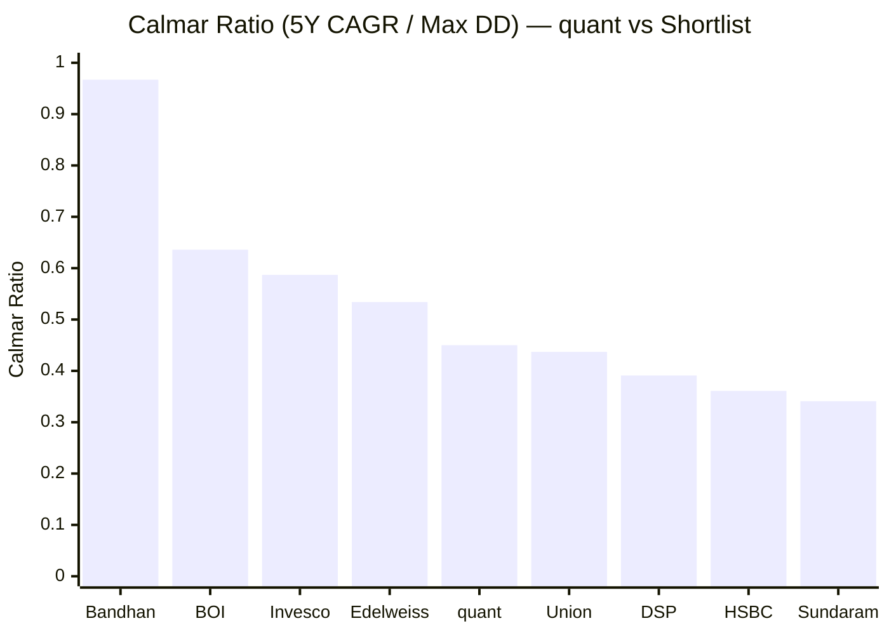

| Period | CAGR | Max DD | Calmar |
|--------|------|--------|--------|
| 3Y | 20.68% | 46.71% | 0.443 |
| 5Y | 21.01% | 46.71% | **0.450** |
| Since Inception | 17.51% | 46.71% | 0.375 |

quant's Calmar (0.45, 5Y) ranks mid-pack (5th of 9) — its strong VLRT-era CAGR numerator partly offsets the deep transition-era drawdown denominator. As with every fund, the comparison is imperfect: the post-2018-inception funds (Bandhan, BOI) have shallower max-DDs that flatter their Calmar; quant's deeper −46.71% is partly the dead-era collapse.

---

## Capture Ratios — Read the VLRT Era, Not the Blend

Carrying the Module 1 finding: the **full-history capture profile (≈91.6% up / 23% down) is misleading** — the flattering "23% downside capture" is mostly 2018 *non-participation* by a dead fund (it "fell" +3.1% vs −26.8% because it wasn't invested), and the mediocre full-history up-capture is dragged by the 2014/2017 Escorts under-participation.

The **VLRT-era capture is the real profile:**

| Down-benchmark year (VLRT era) | quant | Benchmark | Result |
|--------------------------------|-------|-----------|--------|
| 2022 | +11.20% | −3.65% | positive while index fell — protected |
| 2025 | −1.36% | −6.01% | +4.65% alpha — protected |

- **VLRT-era up-capture ≈ 148%** — an aggressive, high-octane participant
- **Protective in both VLRT-era down years** (2022, 2025) — but both were *mild* corrections, not a grinding bear

So the VLRT profile is "amplify the upside, and so far protect in mild down years" — genuinely good, but with the unavoidable caveat that it has **never been tested in a real multi-year small-cap bear.** Any capture ratio quoted for this fund must specify the era; the blended figures actively deceive.

---

## Portfolio PE — Below Category: a Genuine Valuation Cushion

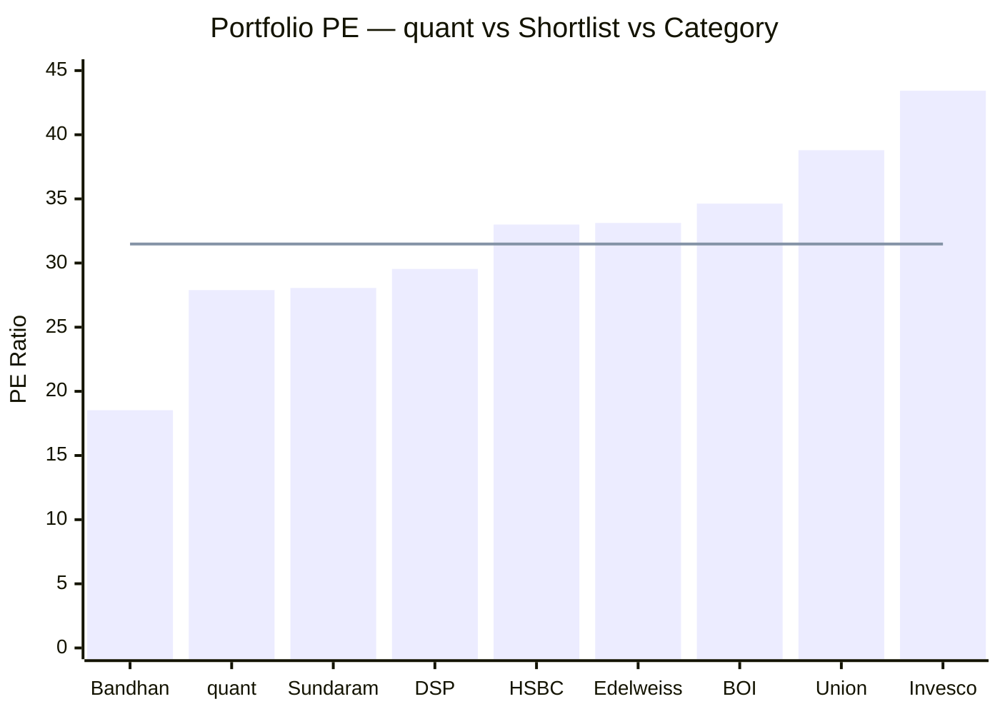
> Line = category average PE (31.48) | quant = **2nd cheapest of 9, below category**

quant's portfolio PE of **27.89 is below the category average (31.48)** — the 2nd-cheapest of the group after Bandhan. This is a genuine positive and a point of difference: BOI (34.63), HSBC (~33), Invesco (43.43) and the FlexiCap quant sibling (31.07) all sit *above* category, with thinner cushions. A below-category PE means **more valuation buffer if small caps de-rate** — consistent with the "Valuation" pillar in VLRT, which rotates toward cheaper names at times. It modestly offsets the high-volatility concern: the volatility is dispersion/turnover-driven, not an expensive-portfolio fragility.

---

## 🆕 The June-2024 Redemption Shock — A Real Forced-Outflow Stress Test *(quant-specific)*

Every other fund's redemption risk is *hypothetical* (modelled, never observed). quant is the **only fund in either study with a real, documented forced-outflow event** — and it is instructive precisely because it was governance-driven, not market-driven.

When SEBI's front-running raid on quant broke (late June 2024), investors **pulled ~$168 million (~₹1,400 Cr) across the AMC in three days.** For a small-cap fund, redemptions force selling of illiquid positions at whatever price clears — exactly the spiral the study's methodology flags as the key small-cap stress.

| Dimension | Read |
|-----------|------|
| Trigger | Governance shock (SEBI raid), not a market crash |
| Magnitude | ~₹1,400 Cr AMC-wide in 3 days — a genuine liquidity test |
| Outcome | The fund met redemptions; NAV did not collapse — VLRT's tactical-cash/liquidity discipline (the "L" in VLRT) arguably helped here |
| The lesson | quant carries a **second, idiosyncratic redemption trigger that no other fund has — its own headline risk.** A market crash *plus* a governance headline could compound into outflows at the worst possible time, at the largest AUM in the study |

This is double-edged. On one hand, the fund *demonstrably survived* a sharp 3-day outflow — more than any peer can claim. On the other, it proved that quant's governance overhang is not abstract: it can and did translate into real redemption pressure, and at ₹31,900 Cr the next such episode would be larger in absolute terms.

---

## Structural Risk — Largest AUM, but a Real Exit-Load Buffer

| Buffer / Risk | quant | Comment |
|---------------|-------|---------|
| AUM | **₹31,900 Cr — largest in either study** | Most acute forced-deployment *and* redemption mechanics (M4) |
| Exit load | **1% within 365 days** | A redemption deterrent the FlexiCap sibling (0%) lacks — mild positive |
| Cash / tactical liquidity | VLRT uses tactical cash (sometimes leveraged) | The "L" in VLRT; confirm current level in M3 |
| Governance redemption trigger | **Yes — proven (Jun-2024)** | Unique idiosyncratic risk |
| Multi-cycle proof (VLRT) | **No** | Never faced a real bear; worst VLRT test −25% |

At ₹31,900 Cr quant has the largest redemption surface of any studied fund, partially mitigated by a 1% exit load and tactical cash. But the combination of *largest AUM + highest volatility + a live governance trigger + no bear-market proof* is the structural heart of its risk profile.

---

## 🆕 Can You Trust the Risk Metrics? *(quant-specific)*

The measured risk numbers are good — but four structural features mean they should be treated as *indicative, not dependable*:

1. **Black-box model.** VLRT is undisclosed. An investor cannot see how risk is being managed, only the output. The good Sharpe/IR could persist or could evaporate if the model's edge fades — there is no transparent process to assess.
2. **High-turnover regime rotation.** VLRT explicitly rotates exposure (the FlexiCap sibling ran 115–296% turnover, sometimes with leveraged/negative cash). Historical beta (0.89) and volatility (19.8%) describe the *past* positioning; the fund can be in a very different risk posture next quarter without disclosure.
3. **Bear-untested.** Every good metric (Sharpe, IR, capture) was earned in a VLRT era that never met a grinding multi-year small-cap bear. The "R" (Risk) and "T" (Time) in VLRT claim to manage downside, but the claim is unverified where it matters most.
4. **Process-continuity risk.** The CIO is settling a front-running case; key-man risk is extreme (Tandon is the model). A forced change would put the entire risk framework in question.

**Net:** unlike DSP (transparent, documented, multi-cycle) or even HSBC (transparent, if currently weak), quant's risk profile rests on a model you cannot inspect, in a regime that hasn't been stress-tested, run by a person under regulatory scrutiny. That is the ceiling on Module 2 regardless of how good the measured numbers look.

---

## Risk Metrics — Full Peer Comparison

```mermaid
quadrantChart
    title Risk vs Reward — quant vs Shortlist
    x-axis "Lower Alpha/IR" --> "Higher Alpha/IR"
    y-axis "Higher Volatility (Worse)" --> "Lower Volatility (Better)"
    quadrant-1 High Reward, Low Risk (Best)
    quadrant-2 Low Reward, Low Risk
    quadrant-3 Low Reward, High Risk (Worst)
    quadrant-4 High Reward, High Risk
    DSP: [0.62, 0.70]
    BOI: [0.92, 0.55]
    HSBC: [0.20, 0.45]
    Bandhan: [0.70, 0.72]
    Invesco: [0.60, 0.50]
    quant: [0.68, 0.12]
```
> quant sits in the "high reward, high risk" zone — good IR/alpha, but the highest volatility in the study

| Metric | quant | DSP | HSBC | BOI | Bandhan | Invesco |
|--------|-------|-----|------|-----|---------|---------|
| Volatility (5Y) | **19.34% (highest)** | 15.85% | 16.84% | 16.33% | 15.46% | 16.42% |
| Max Drawdown | −46.71% | −49.06% | −52.45% | −32.37% | −24.34% | −37.66% |
| — underwater | ~1.6y | ~1y | ~3y | 0.5y | — | — |
| Sharpe (computed 3Y) | 0.81 | **0.98** | 0.58 | 0.85 | ~1.08 | ~0.96 |
| Sortino (computed 3Y) | 1.22 | 1.34 | 0.83 | 1.18 | — | — |
| IR (3Y / 5Y) | +0.37 / +0.88 | 0.17 / 0.88 | **−0.61** | 0.94 / 1.09 | — | — |
| Beta | 0.89–0.97 | 0.92 | 0.96 | 0.94 | 0.91 | 0.84 |
| R² | 88–90 | 91 | 96 | 91 | — | — |
| Portfolio PE | **27.89 (cheap)** | 29.54 | ~33 | 34.63 | 18.53 | 43.43 |
| % from ATH | −2.74% | −2.22% | −8.74% | **0.00%** | −3.80% | −6.80% |
| Multi-cycle proof | **No (VLRT)** | ✅ | ✅ | No | No | No |
| Redemption test | **Yes — Jun-2024** | No | No | No | No | No |

**quant's rank by metric:** best-in-study on *worst volatility* (9th); mid on max DD (6th) and Calmar (5th); strong on Sharpe (~3rd), Sortino, IR (~3rd), PE buffer (2nd); good on ATH proximity (4th). The profile: **good risk-adjusted return and a cheap portfolio, wrapped around the highest raw volatility, a bear-untested VLRT process, and the lowest process-trust in the group.**

---

## Comparison with the quant FlexiCap Sibling

| Metric | quant Small Cap | quant Flexi Cap |
|--------|-----------------|-----------------|
| Max Drawdown | **−46.71%** | −54.60% |
| Volatility | 19.34% (5Y) | 16.00% |
| Sharpe (computed) | 0.81 | ~0.75 |
| IR | **+0.37 / +0.88** | (not computed; positive) |
| Portfolio PE | **27.89 (below cat)** | 31.07 (above cat) |
| Top-10 concentration | TBD (M3) | 71.40% ⚠️ |
| Single-group risk | TBD (M3) | 24.56% Adani ⚠️ |
| M2 score | **~3.1 (this module)** | **2.00** |

The Small-Cap M2 is **materially better than the FlexiCap sibling's 2.00**: shallower drawdown (−46.71% vs −54.60%), positive IR, a *below-category* PE (vs the FlexiCap's concentrated, above-category, 24.56%-Adani book). Ironically, the small-cap fund is the **lower-risk of the two quant funds on measured metrics** — though it carries the higher raw volatility. Whether the Small-Cap portfolio repeats the FlexiCap's extreme top-10 concentration is the key open question for M3.

---

## Risk Profile — Points For and Against

### ✅ Points IN FAVOUR
1. **Good, stable computed Sharpe (0.81 3Y / 0.78 5Y)** — behind only DSP, above HSBC
2. **Sortino 1.22 (3Y)** — volatility is upside-skewed
3. **Positive Jensen alpha (+3.78%/+6.29%) and IR (+0.37/+0.88)** — active risk rewarded (anti-HSBC)
4. **Healthy R² (88–90)** — real active share, not index-hugging
5. **Below-category portfolio PE (27.89 vs 31.48)** — genuine valuation cushion (2nd cheapest of 9)
6. **−2.74% from ATH** — portfolio largely healthy
7. **Most symmetric daily skew (1.01)** and no brutal single-day tail (worst −8.62% vs peers' −11/−12%)
8. **1% exit load** — a redemption deterrent the FlexiCap sibling lacks
9. **Demonstrably survived a 3-day, ~₹1,400 Cr redemption shock (Jun-2024)** — proven liquidity handling

### ⚠️ Points AGAINST
1. **Highest volatility in the study** (5Y 19.34% / VLRT-era 19.77%)
2. **Max drawdown −46.71%** — deeper than every recent-vintage peer; and it's a *transition-era* event, so VLRT downside is unproven
3. **VLRT era never faced a real bear** — worst test only ~−25% (2022, 2024-25)
4. **Deepest worst-rolling-year of any studied fund (−43.55%)**
5. **Largest AUM (₹31,900 Cr)** — most acute redemption surface
6. **A live, idiosyncratic redemption trigger** — its own governance headlines (proven Jun-2024)
7. **Risk metrics rest on a black box** — undisclosed model, high-turnover rotation, regime can shift without warning
8. **Process-continuity risk** — CIO settling a front-running case; extreme key-man risk
9. **Two-era risk history** — no continuous risk record; Escorts-era 7.81% vol is meaningless for the future

---

## Module 2 Scorecard

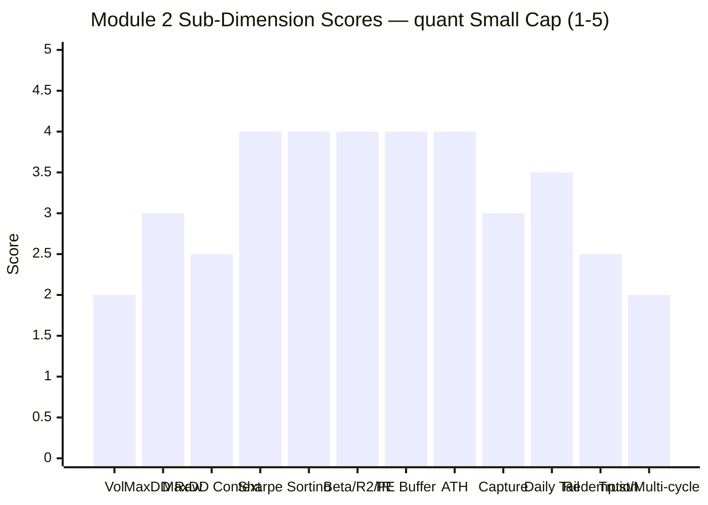

| Sub-dimension | Weight | Score (1–5) | Reasoning |
|---------------|--------|-------------|-----------|
| Volatility | High | **2.0** | 19.34% (5Y) — highest of any studied fund |
| Max Drawdown (raw) | High | **3.0** | −46.71% — mid-pack (6th of 9) |
| Max Drawdown (context) | Critical | **2.5** | Transition-era event; VLRT downside unproven (worst ~−25%) |
| Sharpe | High | **4.0** | 0.81 (3Y) — behind only DSP, above HSBC; stable |
| Sortino | Medium | **4.0** | 1.22 (3Y) — upside-skewed volatility |
| Beta / R² / IR | High | **4.0** | Positive Jensen alpha + IR (+0.37/+0.88); healthy active share — anti-HSBC |
| PE valuation buffer | Medium | **4.0** | 27.89, below category — 2nd cheapest of 9 |
| ATH distance | Low | **4.0** | −2.74% — healthy |
| Capture asymmetry | Medium | **3.0** | VLRT-era ~148% up + protected in mild down years; bear-untested |
| Daily tail risk | Medium | **3.5** | Symmetric skew (1.01), gentle worst day (−8.62%) |
| Redemption resilience | Low | **2.5** | Survived Jun-2024 shock, but largest AUM + live governance trigger |
| Trust / multi-cycle | Critical | **2.0** | Black-box, bear-untested, CIO under settlement — risk metrics not dependable |
| **Module 2 Overall** | **100%** | **~3.1 / 5** | **Good measured VLRT-era risk-adjusted metrics (Sharpe 0.81, Sortino 1.22, positive IR, below-category PE, near ATH) — capped by the highest volatility in the study, a transition-era/bear-untested drawdown record, the largest-AUM redemption surface with a proven governance trigger, and a black-box process whose risk numbers cannot be trusted as dependable. Better than the FlexiCap sibling (2.00); below DSP/BOI; around/above HSBC.** |

---

## Comparative Module 2 Scores

| Fund | M2 Score | Risk Profile Summary |
|------|----------|---------------------|
| DSP Small Cap | 3.8 | Best capture asymmetry; multi-cycle proof; honest −49% DD |
| BOI Small Cap | 3.7 | Best IR + at ATH; capped by missing-2018, smallest-AUM risk |
| Bandhan Small Cap | 3.5 | Lowest raw max DD; no 2018 test |
| Invesco Small Cap | 3.3 | Single-cycle; moderate Sharpe |
| HSBC Small Cap | 3.2 | Elite historical, deteriorating recent (IR −0.61, −8.74% from ATH) |
| **quant Small Cap** | **~3.1** | **Good VLRT-era risk-adjusted metrics + cheap PE; highest volatility, bear-untested, largest-AUM redemption surface, black-box trust ceiling** |
| *quant Flexi Cap (sibling)* | *2.00* | *−54.6% DD, 71.4% top-10, 24.56% Adani* |

quant lands **around/just below HSBC (3.2) and clearly below DSP/BOI** — but **above its own FlexiCap sibling (2.00)**. The logic: quant's *measured* VLRT-era risk-adjusted metrics (Sharpe, Sortino, IR, PE buffer) are genuinely better than HSBC's deteriorating recent profile — but quant carries the highest volatility in the study, a bear-untested process, the largest redemption surface, and the lowest process-trust, which together cap it in the low-3s.

---

## SIP Implication

For a ₹20,000/month satellite SIP over a 10+ year horizon, quant Small Cap's risk profile is the study's most **two-faced**.

**What the measured data says (the favourable face):** on a properly computed basis the VLRT-era risk-adjusted metrics are good — Sharpe 0.81, Sortino 1.22, positive Jensen alpha (+3.78%/+6.29%) and Information Ratio (+0.37/+0.88), a healthy R² (active share, not index-hugging), a below-category portfolio PE (27.89 — a real valuation cushion), and a NAV just −2.74% from its all-time high. The screener's scary 0.149 Sharpe is a methodology artifact; the fund is among the *better* risk-adjusted performers in the group, not the worst.

**What the structure says (the unfavourable face):** quant runs the **highest volatility of any fund in the study** (~19.8%), its −46.71% max drawdown is **a transition-era event the current VLRT process never managed** — and the VLRT era's own worst test is merely a 5-month, ~−25% dip, so its genuine bear-market downside is *unknown*. It carries the **largest AUM in either study (₹31,900 Cr)** and therefore the most acute redemption surface — and unlike every peer, it has a **live, idiosyncratic redemption trigger (its own SEBI headlines)**, demonstrated by the ~₹1,400 Cr three-day outflow in June 2024. Above all, the entire risk profile rests on an **undisclosed, high-turnover, regime-rotating black box** run by a CIO settling a front-running case — so the good measured numbers cannot be trusted as *dependable* descriptions of forward risk.

**The three SIP risk behaviours to expect:**
1. **In a sharp crash (like COVID):** the fund falls hard (highest volatility) but the VLRT engine has historically recovered fast — continue the SIP; the rupee-cost-averaging captures the dispersion.
2. **In a momentum bull:** expect aggressive participation (VLRT-era up-capture ~148%) — strong returns, but with the highest volatility ride in the group.
3. **In a real multi-year bear (never yet experienced under VLRT):** this is the genuine unknown. Plan for a drawdown that could exceed the −46.71% record, compounded by the risk that a governance headline triggers redemptions at the worst moment.

**Recommended SIP behaviour:** treat quant's risk metrics as *good but provisional*. The measured VLRT-era profile genuinely supports a satellite position for an investor who accepts the highest volatility in the category — **but the bear-untested downside, the largest-AUM redemption surface, the live governance trigger, and the black-box opacity mean the risk here is fundamentally less *knowable* than DSP's or BOI's.** For a 10Y+ SIP where you cannot inspect how your downside is being managed, that opacity is the decisive reservation — and it is what caps Module 2 at ~3.1 despite metrics that, on their face, would score higher.

---

## One-Line Verdict

> **quant Small Cap's risk profile is good on the metrics you can measure and untrustworthy on the ones you can't:** strong computed Sharpe (0.81), Sortino (1.22), positive IR (+0.37/+0.88) and a cheap below-category portfolio (PE 27.89), near its ATH — but it carries the **highest volatility in the study**, a −46.71% drawdown that belongs to the dead transition era (VLRT downside is bear-untested at ~−25%), the **largest-AUM redemption surface with a proven governance trigger (₹1,400 Cr pulled in 3 days, Jun-2024)**, and a black-box, high-turnover process whose risk numbers cannot be relied upon. **Module 2: ~3.1/5 — better than the FlexiCap sibling (2.00), below DSP/BOI, around HSBC.**

---

*Module 2 completed: June 2026 | Risk Profile | MFAPI methodology (quant Small Cap scheme 120828, 3,307 points cleaned of the 27-May-2015 glitch) | Beta/R²/Alpha/IR vs Nippon Nifty Smallcap 250 Index Fund (scheme 148519); max drawdown (−46.71%) reproduces screening exactly after cleaning | Benchmark = Nifty Smallcap 250 TRI | Provisional M2 Score: ~3.1/5 (subject to M3–M6)*

*Next: [Module 3 — Portfolio DNA](module3_portfolio.md)*
