# Module 3: Portfolio DNA — quant Small Cap Fund

*Sources: Tickertape screening CSVs (market-cap split + concentration, May 2026), Groww (top-10 holdings + 119-holding count + asset mix, Jun 2026), Value Research Online (holdings + AUM + ER, Jun 2026), MoneyWorks4me (concentration + sector groups, Jun 2026), Tickertape live (holdings + PE + sector, Jun 2026), the FlexiCap Quant module files (carry-forward VLRT/concentration findings). Benchmark = Nifty Smallcap 250 TRI.*

> **⚠️ Out-of-shortlist study.** quant Small Cap was eliminated in Stage 1 (AUM cap; the ER "fail" was a data error). Studied for instruction. See [Module 1](module1_returns.md) for the two-era context and [Module 2](module2_risk.md) for the risk profile.

---

## Module 3 Score: ~2.7 / 5 — the lowest of any studied small-cap fund

quant Small Cap's portfolio is the study's clearest case of a fund whose **construction contradicts its label.** Where Modules 1–2 showed strong VLRT-era returns and good (if untrustworthy) risk-adjusted metrics, Module 3 exposes the structural problem underneath: this is **the least "small-cap" small-cap fund in the study** — it runs *below* the 65% SEBI floor in small caps (64.58%), carries the **highest large-cap allocation of any peer (21.52%)**, holds **mega-cap Reliance Industries as its single largest position (8.36%)**, layers on an **F&O overlay with net-negative cash (structural leverage)**, and re-imports the **Adani complex (10.62%)** from its FlexiCap sibling. The VLRT momentum model uses (and overshoots) its full 35% non-small-cap bucket to chase large-cap momentum. The lone genuine positive — a **below-category portfolio PE (~29.7)** — and a broad 119-stock book keep it above the FlexiCap sibling's M3 of 2.00, but the mandate-fidelity failures place it last among the studied small-cap funds.

---

## The Headline Finding — Is This Even a Small-Cap Fund?

Modules 1–2 circled a return/risk story. Module 3 introduces a different and more damaging axis: **mandate fidelity.** On this axis, quant is an outlier in the wrong direction.

| The Mandate Test | quant SC | What a small-cap fund "should" look like |
|---|---|---|
| **Small-cap %** | **64.58%** — *below* the 65% SEBI floor | DSP 87%, BOI 80% |
| **Large-cap %** | **21.52%** — *highest of any studied SC fund* | DSP ~0%, BOI 3%, HSBC 2% |
| **#1 holding** | **Reliance Industries 8.36% (mega-cap)** | a genuine small cap at 3–5% |
| **Single-group** | Adani complex **10.62%** | none for any peer |
| **Structure** | F&O overlay + net cash −3.78% (leverage) | long-only equity |

This is the **inverse of BOI** (Module 3's positive case). BOI used its *small* ₹2,318 Cr AUM to fish *deeper* into genuine micro-caps (79.5% SC, differentiated book). quant uses its *huge* ₹31,900 Cr AUM — the largest in either study — to drift *up* into mega-caps and large-cap momentum, running the small-cap sleeve at the bare regulatory minimum. For an investor whose entire purpose in buying a small-cap fund is *differentiated small-cap exposure to complement a large-cap core*, quant delivers the **least** of it — and partially duplicates the large-cap holdings an investor likely already owns elsewhere.

```mermaid
quadrantChart
    title Portfolio Positioning Matrix (Studied SC Funds)
    x-axis Low Large-Cap Drift → High Large-Cap Drift
    y-axis Low SC Purity → High SC Purity
    quadrant-1 Pure but Drifting
    quadrant-2 Pure + True-to-Mandate (Ideal)
    quadrant-3 Diluted + Large-Cap Heavy (Worst)
    quadrant-4 Diluted + Concentrated
    DSP SC: [0.05, 0.95]
    BOI SC: [0.12, 0.80]
    HSBC SC: [0.08, 0.70]
    Bandhan SC: [0.20, 0.67]
    Invesco SC: [0.70, 0.10]
    quant SC: [0.95, 0.05]
```
> quant sits alone in the "diluted + large-cap-heavy" corner — the polar opposite of DSP/BOI's true-to-mandate positioning, and even beyond Invesco's "floor-runner" profile.

---

## Raw Data (Compiled and Cross-Verified Across Sources)

| Metric | Value | Source(s) | Confidence |
|---|---|---|---|
| **Total holdings** | **119** (equity + F&O + T-bills + repo + MF) | Groww | ✅ |
| **Small Cap %** | **64.58%** | Tickertape screening | ✅ *(below 65% floor)* |
| **Mid Cap %** | **8.78%** | Tickertape screening | ✅ |
| **Large Cap %** | **21.52%** | Tickertape screening | ✅ *(highest of studied SC funds)* |
| **Equity %** | **94.88%** | Tickertape screening (Groww 93.24%) | ✅ |
| **F&O overlay** | **3.88%** | Tickertape / Groww | ✅ |
| **Cash (incl repo/TREPS)** | **~3.5%** | Screening 3.53% | ✅ |
| **Debt (T-bills)** | **~1.3%** | Screening 1.26% | ✅ |
| **Gold** | **~1.65–1.73%** | Groww / MoneyWorks4me | ✅ |
| **Net payables** | **−3.78%** | Groww | ✅ *(F&O margin artifact → leverage)* |
| **Top Holding (Reliance)** | **8.36%** | Groww / VRO / Tickertape | ✅✅✅ |
| **Top 3 concentration** | **22.1%** (May) → ~18% (Jun) | Screening / MoneyWorks4me | ✅ |
| **Top 5 concentration** | **29.9%** (May) → ~26% (Jun) | Screening / MoneyWorks4me | ✅ |
| **Top 10 concentration** | **43.5%** (May) → ~39% (Jun) | Screening / Groww / MW4me | ✅ |
| **Adani group exposure** | **10.62%** (Power 4.59 + Green 3.23 + Enterprises 2.80) | Groww | ✅ |
| **Portfolio PE** | **~27.89–29.71** (cat ~31.5) | Tickertape | ✅ *(below category)* |
| **Portfolio Turnover** | **Undisclosed; VLRT very high** (FlexiCap 115–296%) | — | ⚠️ → M4 |
| **AUM** | **₹30,374 Cr (May) → ₹31,774–31,913 Cr (Jun)** | Screening / VRO | ✅ Largest in either study |
| **% from ATH** | **−2.74%** | MFAPI computed | ✅ |
| **Top sectors** | Pharma 11.88%, Private Banks 8.59%, Oil&Gas R&M 8.36%, Power Gen 7.98% | Tickertape | ✅ |
| **Top-3 sector groups** | BFSI + Healthcare + Construction/Infra = **48%** | MoneyWorks4me | ✅ |
| **SEBI SC Mandate Minimum** | 65% | Universal | — |
| **quant SC vs Minimum** | **−0.42pp BELOW floor** | Computed | ⚠️ |

---

## 🆕 "Is This Even a Small-Cap Fund?" — The Below-Floor, Large-Cap-Heavy Book *(quant-specific, the defining section)*

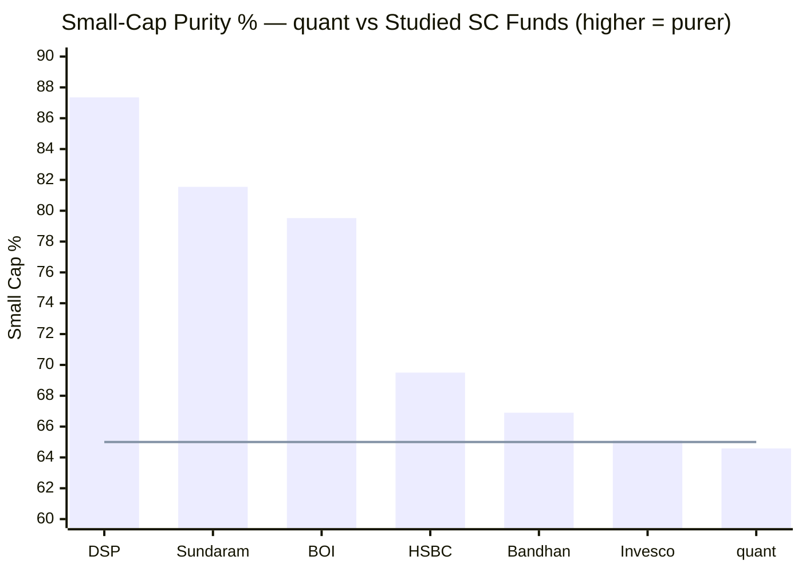
> Line = SEBI 65% minimum. quant (64.58%) is the **only studied fund sitting *below* the floor** — and the least pure of all.

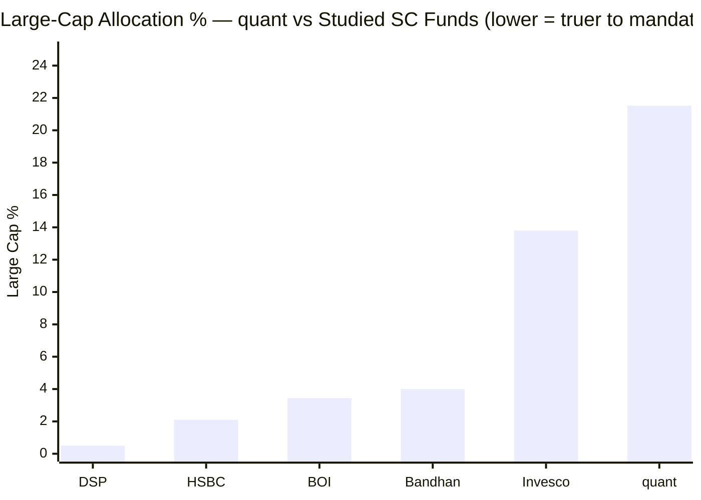
> quant's 21.52% large-cap allocation is ~1.6× the next-highest (Invesco 13.8%) and ~6× BOI's.

| Fund | Small Cap | Mid Cap | Large Cap | Identity |
|---|---|---|---|---|
| DSP SC | **87.35%** | 4.29% | ~0% | Purest — true to mandate |
| BOI SC | 79.52% | 12.57% | 3.44% | Nimble, pure |
| HSBC SC | 69.5% | 27.0% | 2.1% | Smid-cap, clean mandate |
| Bandhan SC | 66.9% | 15.0% | 4.0% | Diffuse, near-floor |
| Invesco SC | 65.1% | 19.6% | 13.8% | Floor-runner (large-cap blend) |
| **quant SC** | **64.58%** | **8.78%** | **21.52%** | **Below-floor; large-cap momentum book** |

**The interpretation.** SEBI requires ≥65% in small caps "at all times"; quant's May-2026 snapshot of 64.58% is *below* that floor (regulators tolerate short, market-driven deviations, but the *direction and structure* matter). Combined with the **highest large-cap allocation of any studied SC fund (21.52%)** and only 8.78% mid cap, the picture is unambiguous: **the VLRT model is allocating as much as it possibly can away from small caps and into large-cap momentum.** The 35% non-small-cap bucket isn't being used for strategic mid-cap quality (as DSP/BOI use their flexibility) — it's a large-cap momentum sleeve. This is the deepest mandate-fidelity problem in the study, worse even than Invesco's floor-running because quant pairs the low SC% with a far higher large-cap weight and a mega-cap top holding.

---

## 🆕 The Mega-Cap Top Holding — Reliance at 8.36% *(quant-specific)*

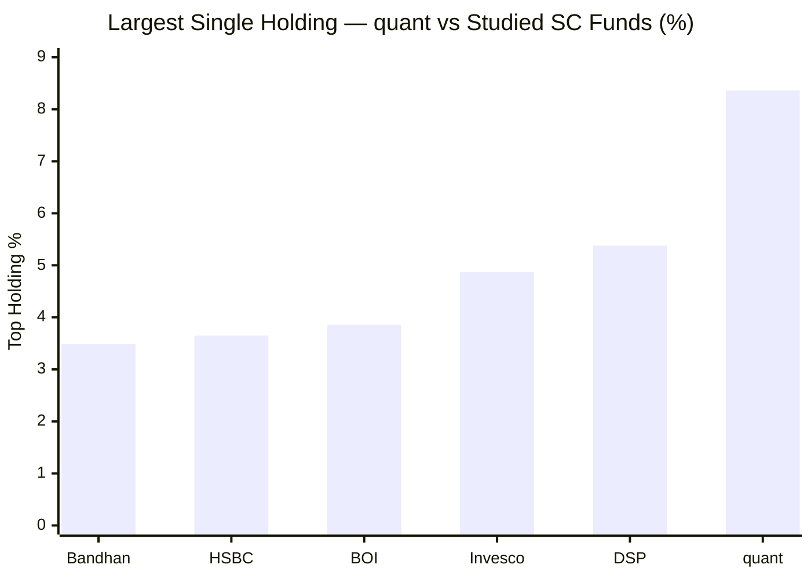

quant's single largest position is **Reliance Industries at 8.36%** — simultaneously:
- The **largest single holding of any studied small-cap fund** (next: DSP 5.38%), and
- A **mega-cap** (Reliance is the largest company in India, ~₹20 lakh-Cr market cap).

A small-cap fund whose #1 position is the country's biggest company, at more than double any peer's top weight, is the single most vivid expression of the mandate drift. It also concentrates risk: an 8.36% position means a 25% fall in one mega-cap costs ~2.1% of NAV — and it is a name most investors already hold in their large-cap/index core, so it adds *overlap*, not *diversification*, to a portfolio. The VLRT momentum signal evidently favoured Reliance; the cost is that the "small-cap satellite" is anchored by a mega-cap.

---

## 🆕 The Adani Complex Returns — 10.62% Single-Group *(carry-forward from FlexiCap)*

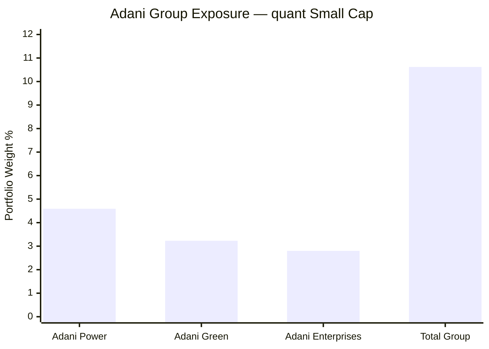

The Adani conviction that defined the FlexiCap sibling (24.56%) reappears here at **10.62%** across three group companies (Power 4.59%, Green 3.23%, Enterprises 2.80%). It is *less* extreme than the FlexiCap version, but still a **single-group concentration no other studied small-cap fund carries.** The Module 1/Module 6 governance context applies: the same group that triggered the FlexiCap fund's late-2024 drawdown (the US-DOJ bribery charges, Nov 2024) is a top-cluster bet here too. A group-specific shock would hit ~10.6% of the portfolio simultaneously — a correlated risk that the headline 119-stock breadth masks. (Note: at 10.62% it is below the FlexiCap-study hard-filter threshold of 20% single-group, but it remains a flag.)

---

## 🆕 The F&O Overlay & Structural Leverage *(quant-specific)*

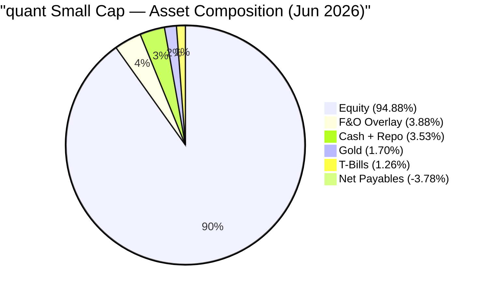
> The −3.78% net payables (F&O settlement/margin artifact) is not shown as a slice; it means the fund's *effective* market exposure exceeds 100% — structural leverage.

Like its FlexiCap sibling (which ran a 14.35% F&O overlay and −2.0% net cash), quant Small Cap layers **individual stock futures (3.88%) on top of 94.88% equity, with net payables of −3.78%** — i.e. the portfolio carries **more market exposure than it has capital.** No other studied small-cap fund uses this structure. Three consequences:

1. **Amplified both ways.** Futures magnify gains in up-markets and losses in down-markets — the fund cannot "sit out" a position where it holds futures. This is consistent with the highest volatility in the study (Module 2).
2. **A small cross-asset rotation sleeve.** The ~1.7% gold holding is itself unusual for a small-cap equity fund — another VLRT cross-asset tell.
3. **Opacity.** The overlay is part of the undisclosed VLRT machinery; an investor cannot see the net leverage at any moment.

The overlay is smaller than the FlexiCap fund's, so the leverage is milder here — but its mere presence in a small-cap mandate is a portfolio-construction outlier.

---

## Top 10 Holdings — A Large-Cap Momentum Book

Total portfolio: **119 holdings**. Top 10 ≈ **39%** (current; 43.5% at the May screener). The composition tells the story:

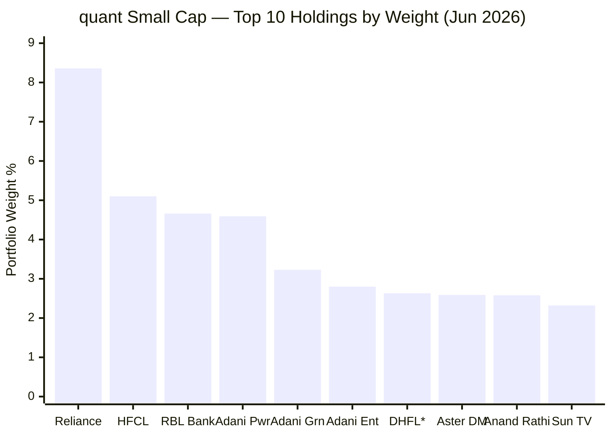
> *DHFL line is a probable data error — see the Data-Quality section.

| # | Stock | Wt% | Cap | Note |
|---|---|---|---|---|
| 1 | **Reliance Industries** | 8.36% | **Mega** | Largest co. in India — the mandate-drift flagship |
| 2 | HFCL | 5.10% | Small/Mid | Telecom equipment/optical fibre — a genuine smaller-cap |
| 3 | RBL Bank | 4.66% | Mid | Private bank — momentum/turnaround |
| 4 | **Adani Power** | 4.59% | **Large** | Adani complex (1 of 3) |
| 5 | **Adani Green Energy** | 3.23% | **Large** | Adani complex (2 of 3) |
| 6 | **Adani Enterprises** | 2.80% | **Large** | Adani complex (3 of 3) |
| 7 | DHFL (Dewan Housing) | 2.63% | ⚠️ | **Delisted 2021 — almost certainly a data error** |
| 8 | Aster DM Healthcare | 2.59% | Mid/Large | Hospitals |
| 9 | Anand Rathi Wealth | 2.58% | Mid | Wealth management — financialisation |
| 10 | Sun TV Network | 2.32% | Mid | Media |

**The pattern:** of the genuine top-10, the largest weights are a **mega-cap (Reliance)**, a **mid-cap bank (RBL)**, and the **large-cap Adani trio** — only HFCL (and arguably one or two others) is a true small cap. The actual small-cap exposure (64.58% of the fund) is therefore concentrated in the **tail (holdings ~11–119)**, while the high-conviction top of the book is large/mid-cap momentum. This is the precise inverse of BOI, whose top-10 was a differentiated set of genuine small caps (Wockhardt, Sky Gold, Quality Power).

---

## Concentration Analysis — Concentrated at the Top, Diffuse in the Tail

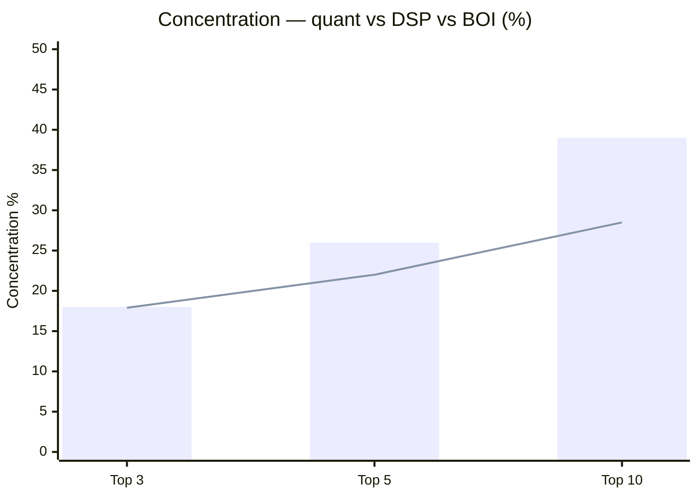
> Bar = quant | Line ≈ DSP. quant's top-10 (39%) is more concentrated than DSP/BOI (~28%), but far below the FlexiCap sibling's 71.4%.

| Metric | quant SC | DSP SC | BOI SC | Invesco SC | quant FlexiCap |
|---|---|---|---|---|---|
| Total holdings | 119 | 81 | 84 | 67 | 43 |
| Top holding | **8.36%** | 5.38% | 3.86% | 4.87% | 9.66% |
| Top 3 | ~18–22% | ~14% | ~9.6% | — | 31.1% |
| Top 5 | ~26–30% | 17.9% | 15.0% | 21.5% | 46.1% |
| Top 10 | **~39–43%** | 28.5% | 26.6% | 37.8% | 71.4% |

quant's concentration profile sits **between BOI/DSP (conviction-diversified ~27%) and Invesco (concentrated 37.8%)**, and is far healthier than the FlexiCap sibling's extreme 71.4%. The 119-stock breadth genuinely dilutes single-name risk in the tail (positions ~11–119 average well under 1% each). The concern is not the *number* of stocks but *what sits at the top* — a mega-cap and a large-cap group, not the differentiated small caps a satellite investor is paying for.

---

## Sector Allocation — Moderate Concentration, Financial/Healthcare/Energy Lead

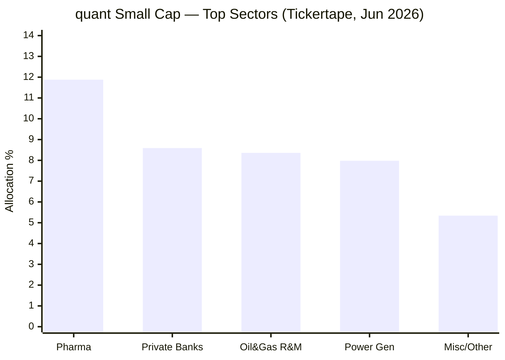

| Sector | quant % | Read |
|---|---|---|
| Pharmaceuticals | 11.88% | Genuine multi-name healthcare (Aster, others) |
| Private Banks | 8.59% | RBL + others — financialisation/turnaround |
| Oil & Gas (Refining & Mktg) | 8.36% | *= the single Reliance position* |
| Power Generation | 7.98% | Adani Power + others |
| (MoneyWorks4me top-3 groups) | **48%** | BFSI + Healthcare + Construction/Infra |

**Sector concentration is moderate** — no single sector exceeds ~12%, materially better than the FlexiCap sibling's 36% Energy+Utilities. But two caveats: (1) the "Oil & Gas 8.36%" line is *entirely Reliance* — a single-stock sector; and (2) the BFSI + Healthcare + Construction/Infra cluster (48%) plus the Adani/Reliance energy names still concentrate a macro bet. The book is more sector-diversified than the FlexiCap version, but the *cap* drift (not the sector spread) is the real Module 3 problem.

---

## The Valuation Paradox — Below-Category PE Despite the Momentum/Mega-Cap Tilt

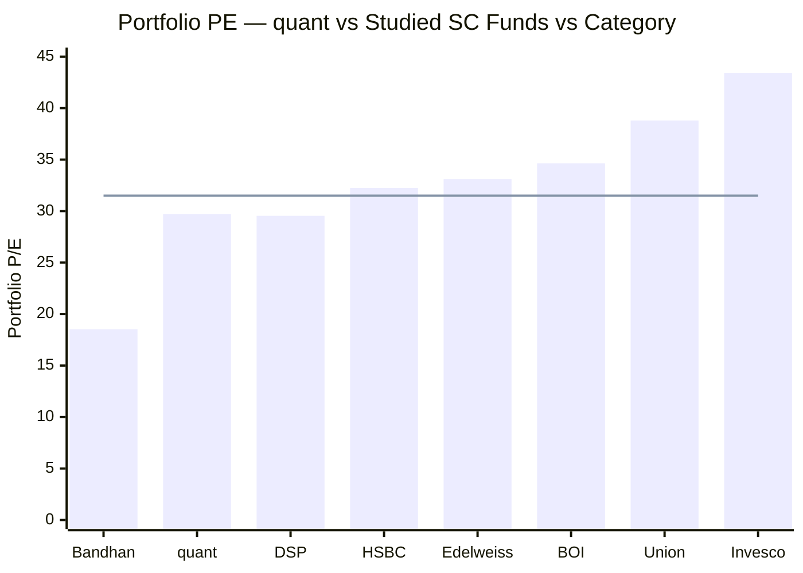
> Line = category average PE (~31.5). quant (~29.7) is **below category — the 2nd-cheapest of the studied funds** after Bandhan.

This is quant Small Cap's **one genuine portfolio positive — and a paradox.** Despite the momentum tilt, the mega-cap top holding, and the Adani complex, the portfolio PE (~27.89–29.71) sits **below the category average (~31.5)** — cheaper than DSP, HSBC, BOI, Union and Invesco, and far cheaper than the FlexiCap sibling (31.07, *above* category). Two explanations:
1. **The "Valuation" pillar in VLRT** genuinely rotates toward cheaper names at times (RBL, Sun TV, the Adani names at corrected prices are not expensive-growth stocks).
2. **The small-cap tail (holdings 11–119)** likely holds cheaper, less-covered names that pull the average down.

The consequence is favourable: **a below-category PE means more valuation cushion in a de-rating** — the opposite of BOI (34.63) and Invesco (43.43). It modestly offsets the high-volatility concern from Module 2: the volatility is turnover/dispersion-driven, not expensive-portfolio fragility. It does not, however, redeem the mandate-drift problem — a cheap large-cap-heavy book is still a large-cap-heavy book.

---

## Portfolio Turnover — Undisclosed, but VLRT-High *(→ Module 4)*

quant Small Cap's turnover ratio is **not disclosed** on any platform checked. But two strong indirect signals point to **very high turnover**:
1. **The FlexiCap sibling runs 115–296%** turnover — the same VLRT model, the same CIO.
2. **The top-10 concentration dropped ~4pp in a single month** (43.5% May → 39% Jun) — direct evidence of active rotation.

For a small-cap fund at ₹31,900 Cr, very high turnover is materially more costly than for the FlexiCap fund, because **small caps are far less liquid** — every rotation incurs wider bid-ask spreads and price impact. The hidden transaction cost (and the STCG tax drag from short holding periods) could add 0.3–0.6%+ to the true all-in cost, potentially swamping the low headline ER (~0.6%). **This is the central Module 4 question, deferred there.** The portfolio-level read: this is a *rotational momentum* book, not a patient buy-and-hold one — the opposite of DSP (19–24% turnover).

---

## 🆕 The DHFL Anomaly & the quant Data-Quality Pattern *(quant-specific)*

Groww's holdings list shows **"Dewan Housing Finance Corp Ltd (DHFL) — 2.63%"** at rank 7. **DHFL's equity was extinguished and the stock delisted in 2021** following the Piramal-led insolvency resolution — so a live 2.63% equity position in 2026 is almost certainly a **data error** (a stale or mislabelled feed entry), not a real holding. It is flagged here and **not relied upon** in the concentration figures.

It matters because it is the **third quant-specific data-quality issue** in this study:
1. **ER error** — Tickertape's 1.13% vs the true ~0.6% (M2/M4)
2. **NAV glitch** — the 27-May-2015 spike that corrupted drawdown/volatility (M2)
3. **Phantom holding** — the DHFL line here (M3)

The pattern is itself a finding: **quant's data across third-party platforms is unusually error-prone**, plausibly because the VLRT model's high turnover and F&O overlay make the fund harder for aggregators to map accurately. Every quant data point in this study has required independent verification — a soft negative for an investor relying on platform data to monitor the fund.

---

## Structural Buffers — Leverage, Not Cushion

| Buffer Type | quant SC | DSP SC | Parag Parikh FlexiCap | Comment |
|---|---|---|---|---|
| Bonds / Debt | ~1.3% (T-bills, margin collateral) | ~0% | 9.92% | Token; not a true defensive sleeve |
| International | 0% | 0% | 11.81% | None |
| Gold | ~1.7% | 0% | 0% | Small cross-asset rotation sleeve |
| Cash | ~3.5% | 8.4% | 4.25% | Modest; less than DSP's war chest |
| Net cash position | **−3.78% (leveraged)** | +8.4% | +4.25% | **The opposite of a buffer** |

quant Small Cap has **no structural shock absorber** — and worse, its net-negative cash means it enters a correction *leveraged*, with effective exposure above 100%. The ~1.7% gold is the only low-correlation asset, and it is too small to dampen a small-cap drawdown. Protection rests entirely on the VLRT model's ability to rotate out ahead of trouble — an unverifiable, bear-untested claim (Module 2). This is the same "zero buffer" finding as the FlexiCap sibling, mildly softened by the gold sleeve.

---

## Same-Manager Portfolio Transfer — vs the FlexiCap Sibling

| Construction Dimension | quant Small Cap | quant Flexi Cap |
|---|---|---|
| Model / CIO | VLRT / Tandon | VLRT / Tandon |
| #1 holding | **Reliance 8.36% (mega)** | Adani Power 9.66% |
| Top-10 concentration | ~39% | **71.40%** |
| Adani group | **10.62%** | 24.56% |
| F&O overlay | 3.88% | 14.35% |
| Net cash | −3.78% | −2.00% |
| Large-cap % | **21.52%** | 75.8% (FlexiCap — expected) |
| Holdings | 119 | 43 |
| Portfolio PE | **~29.7 (below cat)** | 31.07 (above cat) |
| Module 3 score | **~2.7** | 2.00 |

**The same VLRT fingerprints transfer** — large-cap momentum, the Adani complex, F&O leverage, a mega-cap top holding, high turnover. But the Small-Cap fund is a **diluted, less-extreme version**: broader (119 vs 43 stocks), less concentrated (top-10 39% vs 71%), smaller Adani bet (10.6% vs 24.6%), milder overlay, and — crucially — a *below-category* PE versus the FlexiCap's above-category one. The SEBI 65%-small-cap floor *forces* quant Small Cap to be less concentrated and less large-cap than the FlexiCap sibling would naturally be. In other words, **the mandate constraint is doing the risk management the manager's style otherwise wouldn't** — which is why M3 lands at 2.7 vs the FlexiCap's 2.00, but still last among genuine small-cap funds.

---

## AUM Scalability — The Anti-BOI Problem

| Scenario | quant (₹31,900 Cr) | BOI (₹2,318 Cr) | DSP (₹17,906 Cr) |
|---|---|---|---|
| 1% position requires | **~₹319 Cr** | ₹23 Cr | ₹179 Cr |
| Access to sub-₹2,000 Cr micro-caps | **Largely closed** | Full | Largely closed |
| Coping mechanism | **Drift up to large caps + 119 names** | None needed | 8.4% cash + 81 names |
| Deployment friction | **Severe** | None | Significant |

At ₹31,900 Cr — the **largest in either study** — quant faces the most acute version of the Nippon problem: a 1% position requires ~₹319 Cr, which is impossible to build in genuine micro-caps without moving prices. The **structural escape valve has been to drift up the cap spectrum** — into Reliance, the Adani complex, RBL, and the broad 119-name spread. This is the portfolio-construction *cause* of the below-floor small-cap %: at this AUM, with this turnover, genuine deep small-cap execution is structurally impaired, so the VLRT model expresses itself through larger, more liquid names. The AUM is not just an M4 cost issue — it is the root of the M3 mandate-fidelity problem.

---

## Points For / Points Against (Portfolio Angle)

### ✅ Points For
1. **Below-category portfolio PE (~29.7)** — 2nd-cheapest of the studied funds; a genuine valuation cushion (the lone clear positive)
2. **Broad 119-stock book** — dilutes single-name tail risk; far healthier than the FlexiCap sibling's 43-stock / 71% top-10 concentration
3. **Moderate sector concentration** — no sector >~12%; better than the FlexiCap's 36% Energy+Utilities
4. **Mandate floor caps the damage** — the SEBI 65% rule forces more diversification and less large-cap than VLRT's style would otherwise produce
5. **Some genuine smaller-cap names** in the book (HFCL and the tail) — real, if minority, small-cap exposure

### ❌ Points Against
1. **Below the 65% small-cap floor (64.58%)** — the least pure small-cap fund in the study; a mandate-fidelity failure
2. **Highest large-cap allocation of any studied SC fund (21.52%)** — the 35% bucket is a large-cap momentum sleeve, not strategic mid-cap quality
3. **Mega-cap #1 holding (Reliance 8.36%)** — largest single position in the study, adds overlap not diversification to a portfolio
4. **Adani single-group concentration (10.62%)** — a correlated bet no peer carries
5. **F&O overlay + net cash −3.78%** — structural leverage; effective exposure >100%; no buffer
6. **Very high (undisclosed) turnover** — rotational momentum book; large hidden cost in illiquid small caps (→ M4)
7. **Largest AUM in either study (₹31,900 Cr)** — the root cause of the up-cap drift; severe deployment friction
8. **Data-quality issues** — the DHFL phantom holding; the broader pattern of error-prone platform data
9. **No defensive buffer** — ~1.7% gold is the only low-correlation asset; protection rests on the black-box VLRT rotation

---

## Module 3 Scorecard

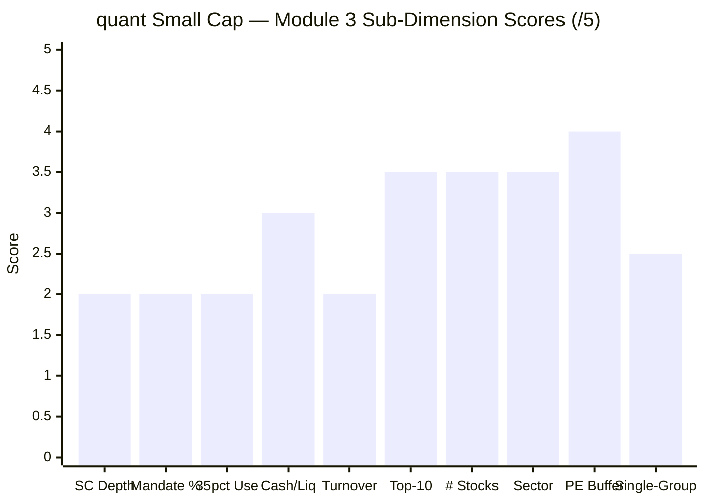

| Sub-dimension | Weight | Score (1–5) | Reasoning |
|---|---|---|---|
| Genuine small-cap depth | High | **2.0** | 64.58% SC (lowest), 21.52% large cap (highest), mega-cap #1 — drifts up, not down |
| Smallcap % (mandate honour) | Medium | **2.0** | Below the 65% floor — the only studied fund there |
| Quality of the 35% bucket | Medium | **2.0** | Used for large-cap momentum (Reliance/Adani), not strategic mid-cap |
| Cash & liquidity management | High | **3.0** | ~3.5% cash + gold, but net −3.78% leverage offsets |
| Portfolio turnover | Medium | **2.0** | Undisclosed but VLRT-high; rotational; large hidden cost in illiquid SC |
| Top-10 concentration | Medium | **3.5** | ~39% — concentrated but reasonable; far below FlexiCap's 71% |
| Number of stocks | Low | **3.5** | 119 — broad; dilutes tail risk |
| Sector diversification | Medium | **3.5** | No sector >~12%; moderate |
| PE valuation buffer | Low | **4.0** | ~29.7, below category — the lone clear positive |
| Single-group concentration | Medium | **2.5** | Adani 10.62% — a flag, below 20% threshold |
| **Module 3 Overall** | **100%** | **~2.7 / 5** | **The lowest M3 of any studied small-cap fund.** A large-cap-heavy momentum book running *below* the small-cap floor, anchored by mega-cap Reliance, carrying a 10.62% Adani complex and F&O leverage, with very high turnover — only partly redeemed by a below-category PE, a broad 119-stock tail, and moderate sector spread. Above the FlexiCap sibling (2.00) because the mandate floor forces diversification VLRT's style otherwise wouldn't. |

---

## Comparison with All Studied Funds

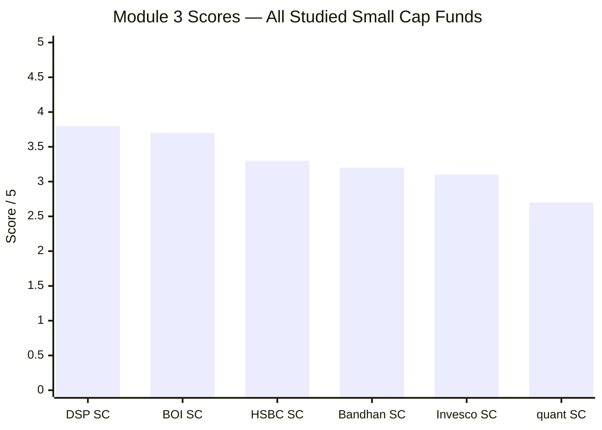

| Dimension | quant SC | DSP SC | BOI SC | HSBC SC | Invesco SC | Bandhan SC |
|---|---|---|---|---|---|---|
| Small Cap % | **64.58% (lowest)** | 87.35% | 79.52% | 69.5% | 65.1% | 66.9% |
| Large Cap % | **21.52% (highest)** | ~0% | 3.44% | 2.1% | 13.8% | 4.0% |
| Top holding | **Reliance 8.36% (mega)** | 5.38% | 3.86% | 3.65% | 4.87% | 3.49% |
| Top-10 | ~39% | 28.5% | 26.6% | 20.3% | 37.8% | 18.9% |
| # stocks | 119 | 81 | 84 | 109 | 67 | 256 |
| Single-group | **Adani 10.62%** | none | none | none | none | none |
| Leverage (F&O) | **Yes** | no | no | no | no | no |
| Portfolio PE | **29.7 (below cat)** | 29.54 | 34.63 | 32.25 | 43.43 | 18.53 |
| AUM constraint | **Severe (largest)** | High | Advantage | High | Low | Severe |
| Style | **Large-cap momentum (mislabelled)** | Pure quality SC | Nimble pure SC | Broad smid-cap | Multi-cap growth | Diffuse deep-value |
| Module 3 Score | **2.7/5** | 3.8/5 | 3.7/5 | 3.3/5 | 3.1/5 | 3.2/5 |

**quant's distinctive (negative) positioning:** it is the **only studied fund below the small-cap floor**, the **only one with a mega-cap top holding**, the **only one carrying a single-group concentration**, and the **only one using F&O leverage** — the inverse of BOI's true-to-mandate nimbleness on nearly every axis. Its lone edges (below-category PE, broad book) are real but cannot offset a construction that barely qualifies as small-cap.

---

## SIP Implication

For a ₹20,000/month satellite SIP with a 10+ year horizon, Module 3 surfaces the most fundamental problem with quant Small Cap as a *small-cap satellite*: **it does not deliver the thing the allocation is for.**

**What you are actually buying:** not a differentiated small-cap book, but a **VLRT large-cap momentum portfolio that runs the small-cap sleeve at the bare regulatory minimum (64.58%, below the floor) while putting its highest-conviction weight into mega-cap Reliance (8.36%), the large-cap Adani complex (10.62%), and mid-cap turnarounds — amplified by an F&O overlay that leaves the fund net-leveraged.** For an investor who already owns Reliance and large caps through a core fund or index, quant adds *overlap* and *correlated risk* rather than the small-cap diversification a satellite is meant to provide. The genuine small-cap exposure exists, but it sits in the 119-name tail, not where the conviction is.

**What's genuinely good:** the below-category PE (~29.7) gives a real valuation cushion, the broad 119-stock book limits single-name blow-up risk, and sector concentration is moderate. These keep the portfolio from being *fragile* — but they don't make it a *small-cap* fund.

**The structural diagnosis:** the up-cap drift is not a temporary tilt — it is the **structural consequence of running VLRT's high-turnover momentum model at ₹31,900 Cr**, the largest AUM in either study. At this scale, genuine deep small-cap execution is impossible without moving prices, so the model expresses itself through larger, liquid names. As AUM grows, expect the drift to persist or worsen.

**What to monitor:**
1. **Small-cap % vs the 65% floor** — if it stays below or near 65%, the mandate-fidelity problem is structural, not a blip.
2. **Reliance / Adani weights** — a rising mega-cap or single-group weight further erodes the small-cap thesis.
3. **AUM** — the larger it gets, the more the up-cap drift entrenches.
4. **Turnover** (M4) — if confirmed >100%, the hidden cost in illiquid small caps materially raises the true all-in cost.

**SIP verdict:** on portfolio DNA, quant Small Cap is the **weakest of the studied small-cap funds (M3 ~2.7)** — a large-cap momentum book wearing a small-cap label, structurally driven by its outsized AUM, redeemed only partially by a cheap valuation and a broad tail. For a satellite allocation whose purpose is *differentiated small-cap alpha*, it is the wrong tool; an investor wanting genuine small-cap exposure should look to DSP (87% SC) or BOI (80% SC, nimble) instead.

---

## Comparative Module 3 Scores

| Fund | M3 Score | Portfolio Identity |
|---|---|---|
| DSP SC | 3.8/5 | Purest SC (87%); concentrated quality conviction; AUM ceiling the only constraint |
| BOI SC | 3.7/5 | Nimble pure SC (80%); AUM *advantage*; differentiated non-consensus book |
| HSBC SC | 3.3/5 | Broad smid-cap; clean 69.5% mandate; consensus construction |
| Bandhan SC | 3.2/5 | Diffuse deep-value; lowest PE; highest cash; near-floor SC |
| Invesco SC | 3.1/5 | Multi-cap growth wrapper; floor-runner (65.1%); highest PE |
| **quant SC** | **2.7/5** | **Below-floor (64.58%); highest large-cap (21.5%); mega-cap #1; Adani 10.6%; F&O leverage; cheap PE the lone positive** |

quant's M3 of 2.7/5 is the **lowest of the studied small-cap funds** — below even Invesco's floor-running multi-cap wrapper, because quant pairs the low SC% with a higher large-cap weight, a mega-cap top holding, single-group concentration, and structural leverage. The 0.4-point gap to Invesco is the price of those incremental mandate-fidelity failures. It sits well above only its own FlexiCap sibling (2.00), which the SEBI floor mercifully prevents quant Small Cap from resembling.

---

*Module 3 complete. Portfolio DNA is a large-cap-tilted VLRT momentum book mislabelled as small-cap: 64.58% small cap (below the SEBI floor, lowest of any studied fund), 21.52% large cap (highest), mega-cap Reliance as the #1 holding (8.36%), a 10.62% Adani complex, an F&O overlay with net-negative cash (structural leverage), 119 holdings, ~39% top-10, very high (undisclosed) turnover — partly redeemed by a below-category PE (~29.7) and a broad tail. The outsized ₹31,900 Cr AUM is the structural cause of the up-cap drift. Module 3 score: ~2.7/5 — the lowest of the studied small-cap funds.*

*Next: [Module 4 — Cost & AUM Impact](module4_cost.md)*
