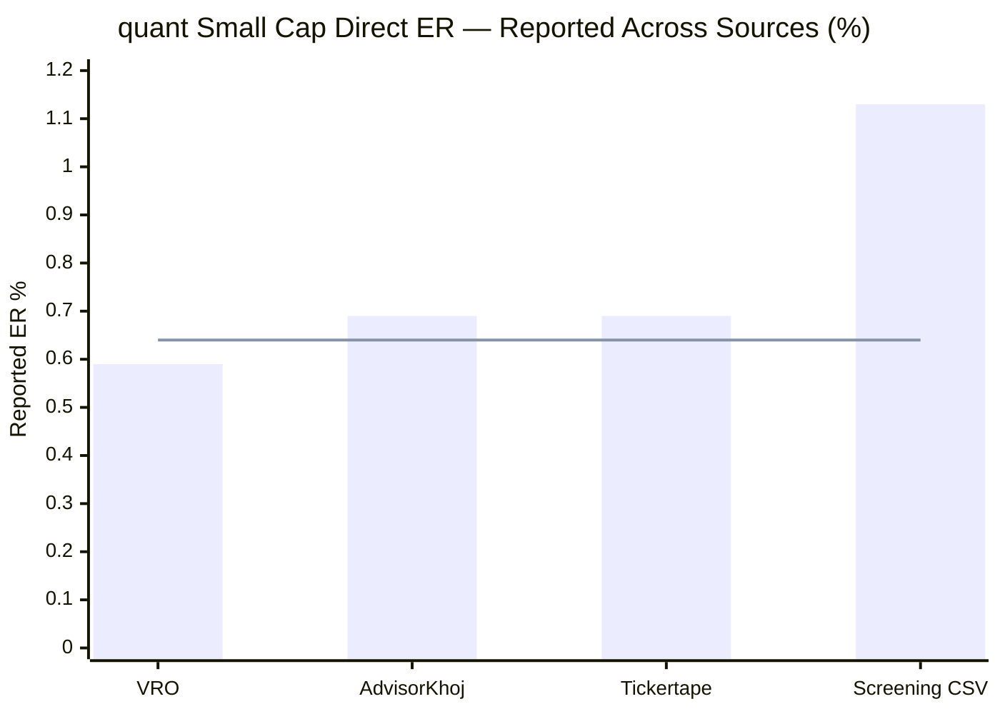
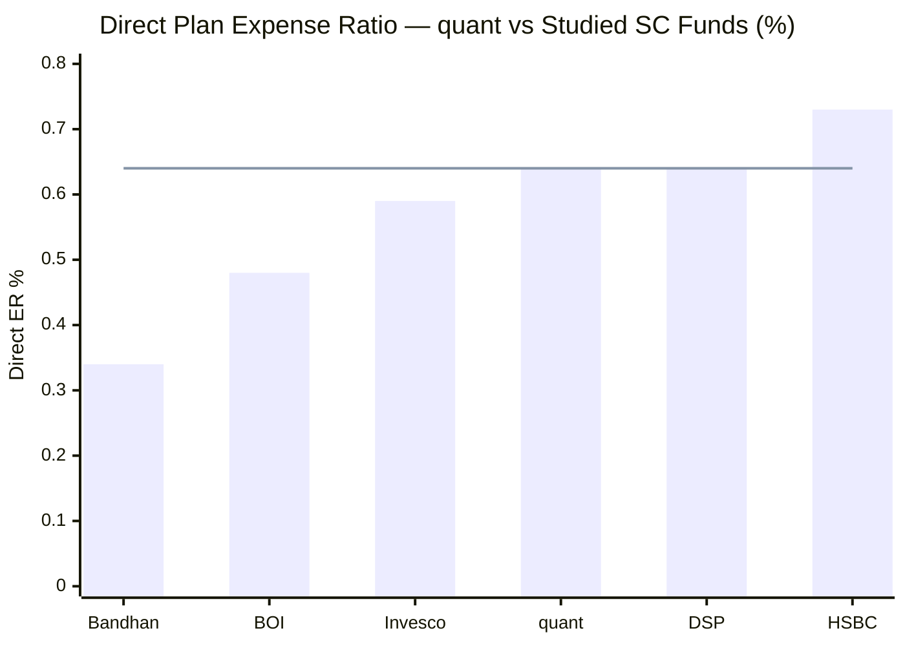
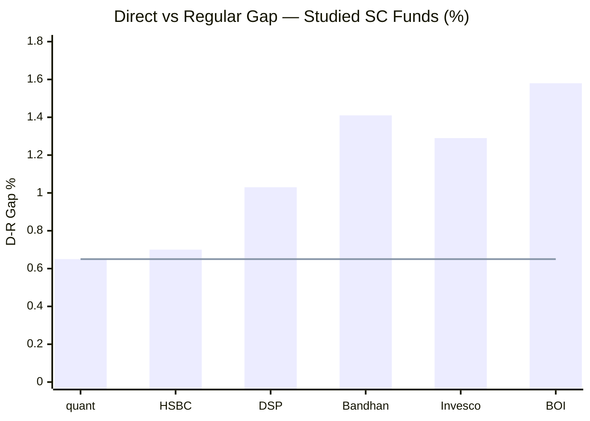
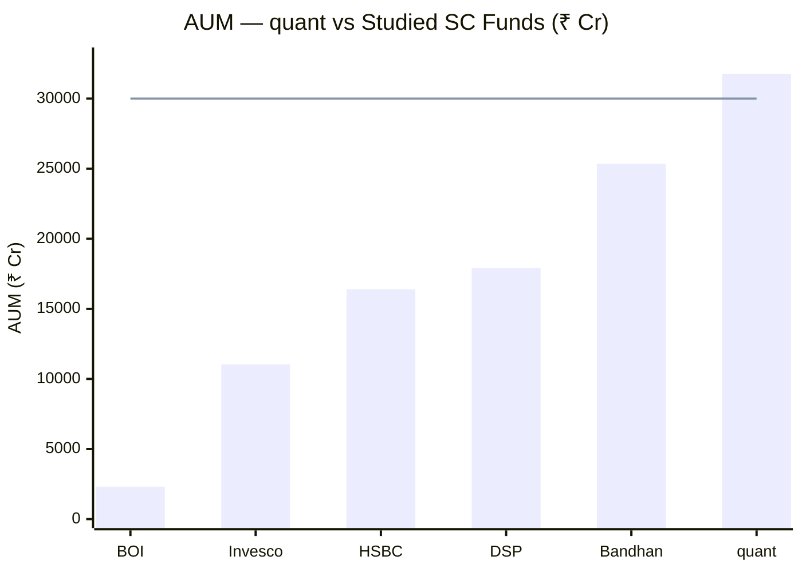
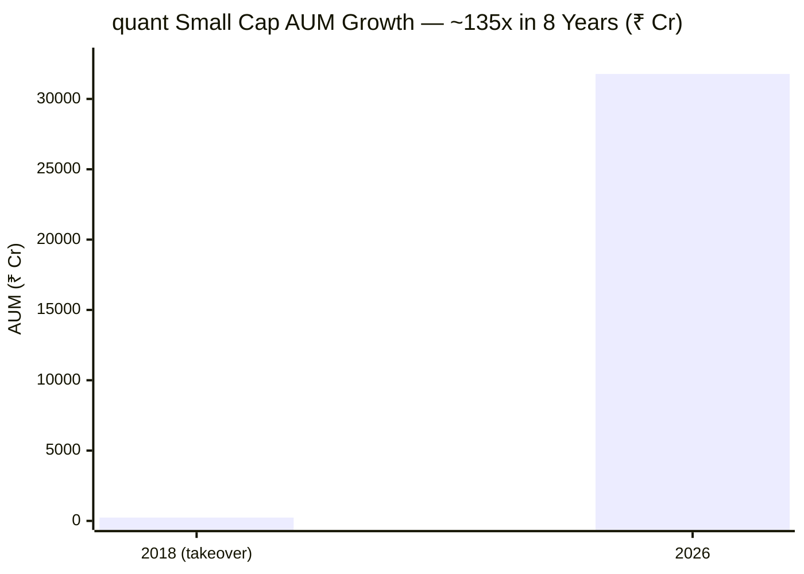
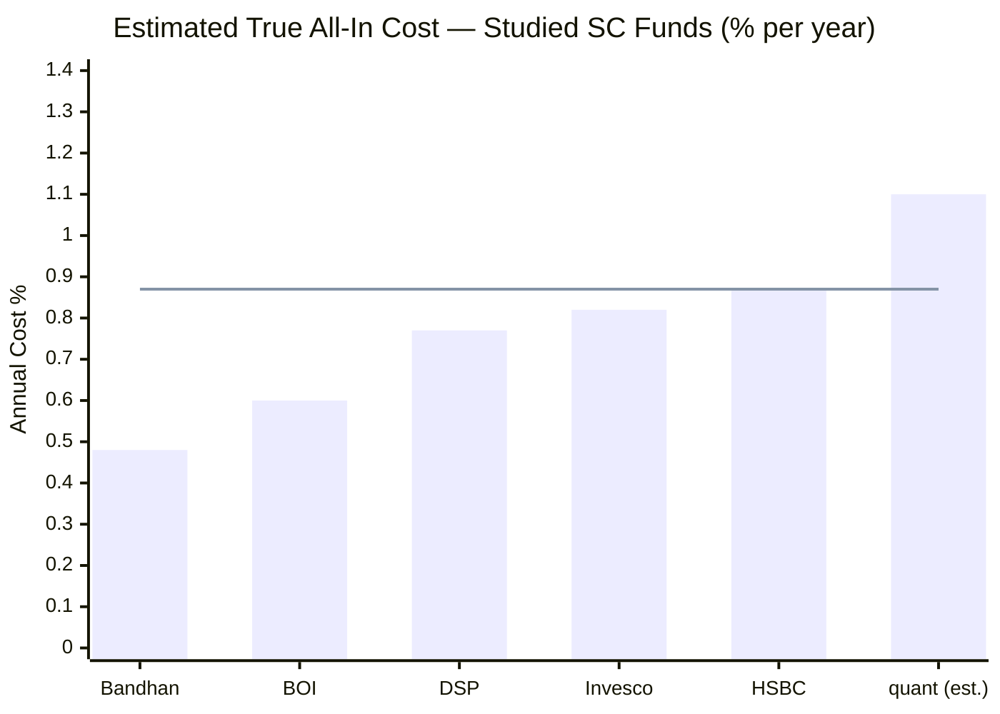
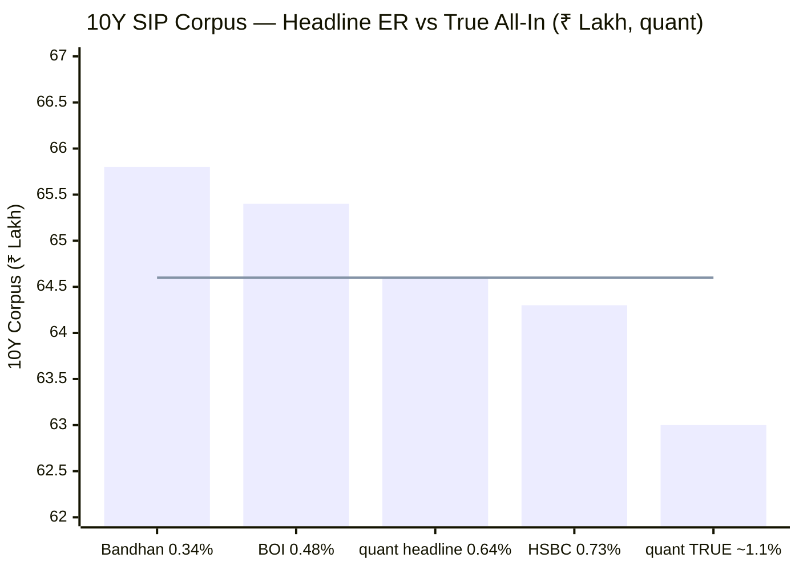
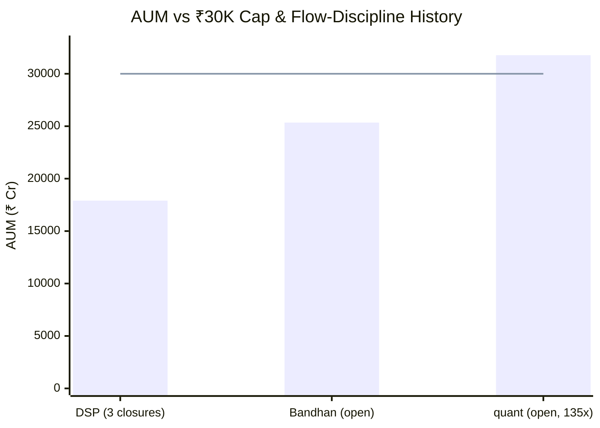
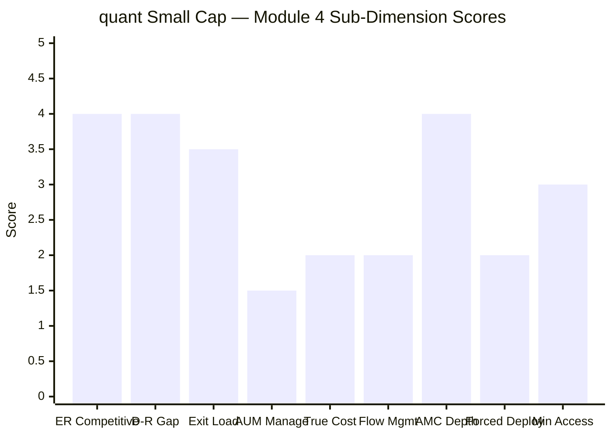
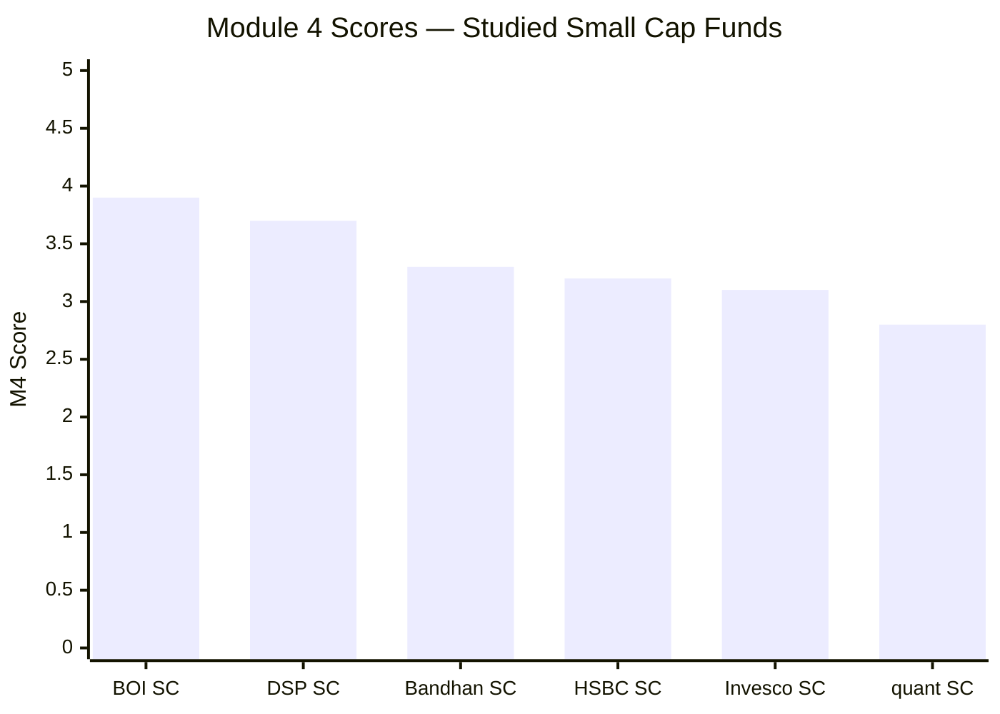

# Module 4: Cost & AUM Impact — quant Small Cap Fund

*Sources: Value Research Online (ER Direct/Regular, AUM, exit load, min investment — Jun 2026), AdvisorKhoj (Direct ER, turnover, min investment — Jun 2026), Tickertape (ER, AUM — Jun 2026), screening CSV (May 2026), the FlexiCap Quant module files (carry-forward AMC/turnover findings), SEBI TER circular (2018), Business Standard (Jun-2024 redemption episode). Benchmark = Nifty Smallcap 250 TRI.*

> **⚠️ Out-of-shortlist study.** quant Small Cap was eliminated in Stage 1 — and Module 4 is where that elimination is *explained and partly corrected*: the screener "failed" it on a phantom 1.13% ER, but the true Direct ER is ~0.64%, so the genuine — and sole — disqualifier is **AUM scale**, analysed here.

---

## Module 4 Score: ~2.8 / 5 — the lowest of the studied small caps (the inverse of BOI)

quant Small Cap is the **mirror image of BOI on cost-and-AUM.** BOI paired a cheap ER with the smallest AUM in the study — cheap *and* nimble — for the best Module-4 profile (3.9/5). quant pairs a **competitive headline ER (~0.64%)** and **one of the narrowest Direct–Regular gaps in the study (~0.65%)** with the **largest AUM of any fund in either study (₹31,774 Cr — over the ₹30,000 Cr cap, grown 135× in eight years)** and the **likely worst true all-in cost** once VLRT's very-high turnover is folded in. The headline cost is fine; the *structural* cost — scale plus churn in an illiquid asset class — is the worst in the group. The AMC is well-resourced (unlike BOI's), but that is an M5/M6 governance story, not an M4 rescue. Net: the lowest cost-and-AUM score of the studied small caps, dragged down entirely by scale and hidden cost, not by the expense ratio the screener flagged.

---

## Raw Data (Compiled and Cross-Verified Across Sources)

| Metric | Value | Source | Notes |
|--------|-------|--------|-------|
| **Expense Ratio (Direct)** | **~0.64%** (VRO 0.59 / AdvisorKhoj 0.69) | VRO / AdvisorKhoj | ⚠️ **Screener's 1.13% is wrong** — see ER anomaly |
| **Expense Ratio (Regular)** | **1.34%** | VRO | Low — large AUM pushes the SEBI ceiling down |
| **Direct–Regular Gap** | **~0.65–0.70%** | Computed | **Narrowest-tier of the study** (tied HSBC) |
| **AUM** | **₹31,774 Cr** | VRO (Tickertape 30,374 May) | **Largest of any fund in either study; over the ₹30K cap** |
| **AUM growth since 2018 takeover** | **~₹235 Cr → ₹31,774 Cr = ~135×** | FlexiCap study / VRO | Fastest, largest scaling in the study |
| **Exit Load** | **1% within 365 days; nil after** | VRO / AdvisorKhoj | Standard; switch Regular↔Direct exempt |
| **Min SIP / Lumpsum** | **₹1,000 / ₹5,000** | VRO / AdvisorKhoj | Less accessible than DSP's ₹100 |
| **Portfolio Turnover** | **Undisclosed / unreliable** (AdvisorKhoj "0.86%" not credible) | — | VLRT-high estimate >100% (sibling 115–296%) |
| **True All-In Cost (est.)** | **~1.0–1.2%** (range 0.8–1.3%) | Computed | **Likely the highest of the studied funds** |
| **1% Position Size** | **~₹318 Cr** | Computed | Largest of the study (BOI ₹23 Cr) |
| **AMC Total AUM** | **~₹90,000–94,000 Cr** | FlexiCap study | Well-resourced (33 schemes) |
| **AMC** | quant Money Managers Ltd | — | Tandon-controlled; governance overhang → M6 |
| **Fund Managers** | 7-PM team (Tandon CIO + 6) | VRO | Tenure on this fund → M5 |
| **Flow Restriction History** | **None** despite 135× growth | AMFI | The opposite of DSP's 3 closures |
| **VRO Star Rating** | 3–4 ★ (sources differ) | Value Research | — |

> **Direct ER note:** VRO shows 0.59%, AdvisorKhoj/Tickertape 0.69%; central estimate **~0.64%**. The screening CSV's 1.13% is a data error (resolved below). Even at the 0.69% ceiling of the credible cluster, quant is mid-pack — *not* the costly outlier the screen implied.

> **Turnover note (the 4th quant data issue):** AdvisorKhoj reports a portfolio turnover of "0.86%" — **not credible** for a VLRT fund (the FlexiCap sibling runs 115–296%, and Module 3 observed the top-10 churning ~4pp in a single month). It is almost certainly mis-scaled or stale. Turnover is treated as **effectively undisclosed**, and the VLRT-high prior (>100%, likely 150–250%) is used. This follows the ER error (here), the 2015 NAV glitch (M2), and the DHFL phantom holding (M3) — quant's third-party data is unusually error-prone.

---

## What Module 4 Is Really Asking

**Question 1 — How much of your return is silently consumed by fund costs every year?**
At ~0.64% Direct, quant's headline ER is **mid-pack and competitive** — not the problem the screener's 1.13% implied. But the *true* all-in cost (ER + turnover/impact) is a different story (see below).

**Question 2 — Is the AUM so large that the manager can no longer run the strategy?**
This is quant's defining Module-4 answer, and it is **emphatically unfavourable.** At **₹31,774 Cr — the largest in either study, over the ₹30,000 Cr cap** — genuine deep small-cap execution is structurally impossible. This is the *root cause* of the Module-3 finding (the up-cap drift below the 65% floor): the AUM forces the VLRT model into liquid large/mega-caps. AUM is not a drag here — it is *the* drag.

**Question 3 — Is the institutional machine robust enough?**
Here quant scores *better* than BOI: the AMC is ~₹90,000–94,000 Cr with substantial revenue from this fund alone (~₹150–300 Cr gross), so research-funding capacity is not a constraint. The catch is that quant's institutional problem is **governance, not resources** — and that belongs to Modules 5/6, not here.

---

## 🆕 The ER Anomaly Resolved — 1.13% Was a Data Error *(quant-specific)*

> Line = credible central estimate (~0.64%). The screening CSV's 1.13% is an outlier/error — the same pattern as the Invesco ER anomaly.

The Stage-1 screen used a Tickertape-sourced Direct ER of **1.13%** — the figure that "eliminated" quant on the ≤1.0% cost filter. **VRO (0.59%) and AdvisorKhoj (0.69%) both contradict it**, clustering at ~0.64%. This is decisive: **quant never actually failed the ER filter.** It is eliminated *only* on the AUM cap. The 1.13% is a stale/erroneous platform figure (Tickertape still displays it), exactly like Invesco's five-source ER spread. The practical consequence: the "expensive fund" narrative the screen created is false — quant's headline cost is competitive, and the real objection is scale.

---

## Expense Ratio — Mid-Pack, Competitive

> Line = quant's ER (~0.64%). It ties DSP, beats HSBC, sits below the small-cap category average.

| Fund | Direct ER | AUM (₹ Cr) | Studied Rank |
|------|-----------|-----------|-------------|
| Bandhan | 0.34% | 25,346 | 1st (cheapest) |
| BOI | 0.48% | 2,318 | 2nd |
| Invesco | 0.59% | 11,038 | 3rd |
| **quant** | **~0.64%** | **31,774** | **4th (= DSP)** |
| DSP | 0.64% | 17,906 | 4th |
| HSBC | 0.73% | 16,394 | 6th (most expensive) |

quant's ~0.64% Direct ER is **genuinely competitive** — tied with DSP, cheaper than HSBC, below the category average (~0.65–0.75%). The published returns (Module 1: 21.01% 5Y) are already net of it. On the *headline* expense ratio, quant has no cost problem. The cost problem is hidden in turnover (below), and the structural problem is AUM.

---

## SEBI TER Positioning — Low Ceiling Due to Large AUM

The ₹31,774 Cr AUM is large enough that most of it sits in SEBI's *lowest-TER* slabs (the ≥₹10,000 Cr / ≥₹50,000 Cr tiers at ~1.05%), so the regulatory ceiling is structurally low:

| AUM Slab | SEBI Max TER | quant AUM in slab |
|----------|-------------|-------------------|
| First ₹500 Cr | 2.25% | ₹500 Cr |
| Next ₹250 Cr | 2.00% | ₹250 Cr |
| Next ₹1,250 Cr | 1.75% | ₹1,250 Cr |
| Next ₹3,000 Cr | 1.60% | ₹3,000 Cr |
| Next ₹5,000 Cr | 1.50% | ₹5,000 Cr |
| Above ₹10,000 Cr | ~1.05% | ₹21,774 Cr |
| **Blended SEBI Max (Regular)** | **~1.23%** | — |
| + B30 incentive (if any) | +0.30% | — |
| **quant Actual Regular ER** | **1.34%** | — |

quant's Regular ER (1.34%) sits modestly above the base blended max (~1.23%) but within the B30-inclusive ceiling — **reasonably disciplined**, and far from the near-ceiling positioning of BOI's regular plan. The large AUM is the reason both the regular ER (1.34%) and the D-R gap (~0.65%) are low — the one way the outsized scale *helps* the investor.

---

## 🆕 The Narrow Direct–Regular Gap — a Genuine Positive *(quant-specific)*

> Line = quant's ~0.65% gap — the narrowest of the studied funds (tied with HSBC).

| Plan | ER | Net CAGR (18% gross) | 10Y Corpus (₹20K/mo) | Lost to Distributor |
|------|----|---------------------|----------------------|---------------------|
| **Direct** | **~0.64%** | ~17.36% | **~₹64.6L** | — |
| Regular | 1.34% | ~16.66% | ~₹61.6L | **~₹3.0L** |

A regular-plan quant investor surrenders **~₹3.0L over a 10-year ₹20K SIP** — roughly *half* the penalty a BOI regular-plan investor pays (₹6.6L). This is a real, if modest, positive: the huge AUM compresses both the regular ER and the D-R gap. Direct is still the right choice (it always is), but the cost of getting it wrong is the lowest in the study. The exit-load note confirms switching Regular→Direct is free, so the fix is costless.

---

## 🆕 The AUM Disqualifier — 135× Growth & the Nippon Problem *(quant-specific, the dominant negative)*

> Line = ₹30,000 Cr Stage-1 disqualification cap. quant is the **only studied fund above it.**

The defining Module-4 fact: at **₹31,774 Cr, quant is the largest fund in either study and the only one over the ₹30,000 Cr cap** — having grown **~135× from ₹235 Cr at the 2018 Escorts takeover.** The consequences:

| Scenario | quant (₹31,774 Cr) | BOI (₹2,318 Cr) | DSP (₹17,906 Cr) |
|----------|--------------------|------------------|------------------|
| 1% position requires | **~₹318 Cr** | ₹23 Cr | ₹179 Cr |
| 1% = % of a ₹3,000 Cr SC free float | **~26%** (impossible) | ~1.9% | ~14.9% |
| Clean entry/exit in genuine micro-caps | **No** | Yes (1–3 days) | Hard (10–15 days) |
| Monthly inflow deployment | **Severe forced-buyer** | Trivial | ₹200–350 Cr backlog |

A ₹318 Cr position is ~26% of a ₹3,000 Cr small-cap's free float — far beyond what SEBI permits or liquidity allows. **This is the Nippon problem in its most extreme studied form**, and it is the *structural cause of the Module-3 mandate drift*: unable to deploy ₹318 Cr chunks into genuine micro-caps, the VLRT model drifts up into liquid large/mega-caps (Reliance, Adani), pulling small-cap % below the 65% floor. **The AUM is not just an M4 cost issue — it is the root of the fund's identity problem.** The study_plan places >₹30,000 Cr in the "disqualified" AUM zone; quant is there, and growing.

---

## 🆕 The True-All-In Paradox — Competitive ER, Likely Worst True Cost *(quant-specific)*

This is the key Module-4 insight and the **exact inverse of BOI.** BOI's small AUM *caps* hidden trading costs regardless of turnover. quant has the opposite setup: **very-high VLRT turnover × the largest AUM × an illiquid asset class** = the worst-case hidden-cost structure.

> Line = HSBC's 0.87% (previously the study's worst). quant's estimated ~1.1% true all-in would be the new worst.

| Fund | Headline Direct ER | Est. turnover/impact | True All-In | Turnover |
|------|-------------------|---------------------|-------------|----------|
| Bandhan | 0.34% | ~0.14% | ~0.48% | ~52% |
| BOI | 0.48% | ~0.05–0.20% | ~0.53–0.68% | undisc (small AUM caps it) |
| DSP | 0.64% | ~0.13% | ~0.77% | ~20% |
| Invesco | 0.59% | ~0.23% | ~0.82% | ~29% |
| HSBC | 0.73% | ~0.14% | ~0.87% | ~31% |
| **quant** | **~0.64%** | **~0.4–0.6%** | **~1.0–1.2%** | **VLRT-high (>100%)** |

**quant's true all-in (~1.0–1.2%) is likely the highest of any studied fund** — *despite* a competitive headline ER — because it is the only fund combining very-high turnover with the largest AUM in an illiquid asset class. On a 10Y ₹20K SIP at 18% gross, the headline ER (0.64%) implies ~₹64.6L, but the true all-in (~1.1%) implies ~₹63L — **the largest headline-vs-true gap of any studied fund.**

**The perverse mitigant (the M3↔M4 link).** The up-cap drift that *hurt* Module 3 actually *limits* Module 4's hidden cost: churning liquid Reliance/Adani/RBL incurs low market impact, while only the small-cap tail (64.58%) bleeds heavy impact. So VLRT's drift into large caps is partly a **cost-management adaptation to the AUM** — the fund trades mandate-fidelity (M3) for tradability (M4). A *genuine* small-cap fund churning this hard at ₹31,774 Cr would bleed far more than ~1.1%. This is why the estimate is ~1.1% rather than ~1.5%+ — the large-cap tilt caps it. It is a genuine analytical nuance, but it does not rescue M4: ~1.1% is still the worst true all-in in the study.

> **Caveat:** turnover is unconfirmed (the 0.86% figure is not credible). If turnover were genuinely low, the true all-in would fall toward ~0.8% and M4 would rise toward ~3.2. The ~1.1% estimate rests on the VLRT-high prior, which the Module-3 churn evidence (top-10 −4pp in a month) and the FlexiCap sibling (115–296%) strongly support.

---

## 10-Year SIP Cost Simulation

**Methodology:** 18% gross CAGR for all funds; Net = 18% − cost; SIP ₹20,000/month for 10 years (₹24L principal). Illustrative — gross returns differ in practice; the *relative* gaps are the point.

> Line = quant's headline-ER corpus (~₹64.6L). On true all-in (~₹63L), quant slips to the worst of the group — the headline understates the real cost more than for any peer.

On the **headline ER**, quant is mid-pack (~₹64.6L, = DSP). On the **true all-in**, it is the **worst** (~₹63L) — the ~₹1.6L gap between its headline and true cost is the largest in the study, the direct consequence of VLRT turnover at scale. The investor's *experienced* cost is materially higher than the ER suggests.

---

## Exit Load — Standard 12-Month Window

| Fund | Exit Load | Window |
|------|-----------|--------|
| quant / DSP / Bandhan / Invesco | 1% | 365 days |
| HSBC / BOI | 1% (+10% free allowance) | 365 days |

quant's 1%/365-day exit load is **standard** and, for a 10-year SIP, essentially irrelevant (every instalment ages past 12 months before redemption). Notably, it is *more* restrictive than the **FlexiCap sibling's 0% exit load** — a mild positive for quant Small Cap, as it adds a small redemption deterrent (relevant given the Jun-2024 redemption-shock fragility from M2). Switching Regular→Direct is exempt.

---

## 🆕 No Flow Discipline + the June-2024 Redemption Shock *(quant-specific)*

quant has **never restricted flows** despite growing ~135× to ₹31,774 Cr and crossing the ₹30,000 Cr cap — the polar opposite of DSP's three disciplined closures (2014–2020) and worse than even HSBC's open-door (which at least plateaued near ₹16K Cr). The incentive structure leans against gating: the AMC earns more as AUM grows, and there is no track record of investor-first flow control.

The fragility this creates was demonstrated in **June 2024**, when the SEBI front-running raid triggered **~₹1,400 Cr ($168M) of redemptions across quant in three days** (Module 2). For an SC fund at the largest AUM in the study, with no flow gate and a live governance trigger, the combination is a genuine M4/M6 risk: a market crash *plus* a governance headline could force selling of illiquid small-caps at distressed prices at the worst moment. The fund met the June-2024 outflow, but the episode proved the risk is real, not hypothetical.

---

## AMC & Manager Context — Well-Resourced (the one BOI-beating axis)

| Dimension | quant | BOI | DSP |
|-----------|-------|-----|-----|
| AMC total AUM | **~₹90,000–94,000 Cr** | ~₹12,000 Cr | ₹2,20,000 Cr |
| Est. revenue (this fund) | **~₹150–300 Cr gross** | ~₹13–15 Cr | ~₹179 Cr |
| Research-funding capacity | **Ample** | Constrained | Deep |
| Schemes (AMC) | ~33 (proliferating) | ~19 | 65 |
| Institutional concern | **Governance (→ M6)** | Small-AMC depth | Low |

Unlike BOI's tiny AMC, **quant is well-resourced** — this fund alone generates substantial revenue, and the AMC manages ~₹90–94K Cr across ~33 schemes. So research-funding capacity is *not* a Module-4 constraint (a point where quant beats BOI and matches DSP). The institutional problem with quant is **governance and key-man risk (Tandon's black box, the SEBI probe, scheme proliferation)** — which is scored in Modules 5/6, not here. Module 4 records the resources as adequate; Module 6 will record what sits on top of them.

---

## 8-Fund Cost & AUM Comparison Matrix

| Metric | **quant SC** | DSP SC | HSBC SC | BOI SC | Bandhan SC | Invesco SC |
|--------|--------------|--------|---------|--------|------------|------------|
| Direct ER | **~0.64%** | 0.64% | 0.73% | 0.48% | 0.34% | 0.59% |
| Regular ER | **1.34%** | 1.67% | 1.43% | 2.07% | 1.75% | 1.88% |
| D-R Gap | **~0.65% (narrowest)** | 1.03% | 0.70% | 1.58% | 1.41% | 1.29% |
| Exit Load | 1%/365d | 1%/365d | 1%/365d | 1%/365d | 1%/365d | 1%/365d |
| AUM (₹ Cr) | **31,774 (largest, over cap)** | 17,906 | 16,394 | 2,318 | 25,346 | 11,038 |
| 1% Position | **₹318 Cr** | ₹179 Cr | ₹164 Cr | ₹23 Cr | ₹253 Cr | ₹110 Cr |
| Turnover | **VLRT-high (undisc)** | ~20% | ~31% | undisc | ~52% | ~29% |
| True All-In (est.) | **~1.0–1.2% (worst)** | ~0.77% | ~0.87% | ~0.53–0.68% | ~0.48% | ~0.82% |
| AMC AUM | **~₹90–94K Cr** | ~₹12K Cr | ₹1.37L Cr | ~₹12K Cr | — | — |
| Flow Restriction History | **None (135× growth)** | 3 closures | None | None (too small) | None | None |
| M4 Score | **~2.8/5** | 3.7/5 | 3.2/5 | 3.9/5 | 3.3/5 | 3.1/5 |

**Key observations:**
1. **quant's headline ER and D-R gap are genuine strengths** — competitive ER, narrowest-tier gap, well-resourced AMC.
2. **But AUM and true all-in are the worst in the study** — largest fund, over the cap, 135× growth, no flow discipline, and the highest true all-in once turnover is counted.
3. **quant is the inverse of BOI:** BOI is cheap *and* nimble (M4 3.9); quant is cheap on headline but the worst on scale and hidden cost (M4 ~2.8).
4. **The cost objection the screener raised (1.13% ER) was false;** the real M4 objection is structural scale, which the screen captured correctly via the AUM cap.

---

## vs the FlexiCap Sibling

| Metric | quant Small Cap | quant Flexi Cap |
|--------|-----------------|-----------------|
| Direct ER | **~0.64%** | 0.82% |
| Regular ER | 1.34% | ~1.95% |
| AUM | **₹31,774 Cr (over SC cap)** | ₹6,593 Cr (FlexiCap sweet spot) |
| Exit load | 1%/365d | **0%** |
| Turnover | VLRT-high | 115–296% |
| True all-in | ~1.0–1.2% | ~1.10–1.62% |
| M4 score | **~2.8** | 3.00 |

The small-cap fund has a **cheaper ER (0.64 vs 0.82) and a redemption-deterring exit load** the FlexiCap lacks — but a **far worse AUM position** (₹31,774 Cr over the small-cap cap vs ₹6,593 Cr in the FlexiCap sweet spot). Because AUM is the *Critical* sub-dimension for a small-cap fund (illiquidity makes scale far more damaging than for a flexicap), the small-cap M4 (~2.8) lands just below the FlexiCap sibling's 3.00 despite the cheaper headline cost. The same VLRT turnover hurts both, but it hurts the illiquid small-cap book more.

---

## Points For / Points Against — Cost & AUM

### ✅ Points For
1. **Competitive Direct ER (~0.64%)** — mid-pack, tied DSP, cheaper than HSBC; the screener's 1.13% was an error
2. **Narrowest-tier D-R gap (~0.65%)** — regular-plan penalty (~₹3L/10Y) is the lowest of the study, half of BOI's
3. **Low regular ER (1.34%)** — the large AUM pushes the SEBI ceiling down (the one way scale helps the investor)
4. **Well-resourced AMC (~₹90–94K Cr)** — ample research funding, unlike BOI's tiny base
5. **1% exit load** — a mild redemption deterrent the FlexiCap sibling (0%) lacks
6. **ER already competitive net of returns** — published 21.01% 5Y is net of the low ER

### ❌ Points Against
1. **Largest AUM in either study (₹31,774 Cr), over the ₹30K cap** — the sole genuine disqualifier; the Nippon problem at its worst
2. **~135× AUM growth since 2018 with zero flow discipline** — never gated; incentives lean against it
3. **Likely worst true all-in cost (~1.0–1.2%)** — VLRT turnover × largest AUM × illiquid SC; the largest headline-vs-true gap in the study
4. **AUM is the root of the M3 mandate drift** — scale forces the up-cap drift below the 65% floor
5. **Jun-2024 redemption shock (₹1,400 Cr/3 days)** — proven flow fragility at the largest AUM, with a live governance trigger
6. **Turnover undisclosed/unreliable** — true all-in is a range; data-quality issue #4
7. **₹1,000 SIP / ₹5,000 lumpsum** — less accessible than DSP's ₹100

---

## Module 4 Scorecard

| Sub-Dimension | Weight | Score (1–5) | Reasoning |
|---------------|--------|------------|-----------|
| Expense Ratio Competitiveness | High | **4.0** | ~0.64% — mid-pack, tied DSP, cheaper than HSBC; screener's 1.13% was wrong |
| Direct vs Regular Gap | Medium | **4.0** | ~0.65% — narrowest-tier of the study; lowest regular-plan penalty |
| Exit Load Structure | Medium | **3.5** | 1%/365d standard; mild deterrent the FlexiCap lacks |
| AUM Manageability | **Critical** | **1.5** | ₹31,774 Cr — largest in either study, over the cap; the Nippon problem; root of the M3 drift |
| True (Turnover-Adj) Cost | Medium | **2.0** | ~1.0–1.2% — likely the worst of the study; VLRT turnover × largest AUM |
| Flow Management | Medium | **2.0** | None despite 135× growth; Jun-2024 redemption shock; incentives lean against gating |
| AMC Institutional Depth | Low | **4.0** | Well-resourced (~₹90–94K Cr); ample research funding (governance is M6, not M4) |
| Forced Deployment | High | **2.0** | Severe — ₹318 Cr per 1% position; monthly inflows cannot reach genuine micro-caps |
| Minimum Accessibility | Low | **3.0** | ₹1,000 SIP / ₹5,000 lumpsum — acceptable but below DSP's ₹100 |
| **Module 4 Overall** | **100%** | **~2.8 / 5** | **The lowest cost-and-AUM score of the studied small caps — the inverse of BOI.** A competitive headline ER, narrowest-tier D-R gap, and a well-resourced AMC are real positives, but they are overwhelmed by the largest AUM in either study (over the cap, 135× growth, no flow discipline), the likely worst true all-in cost, and severe forced-deployment friction that is the structural cause of the M3 mandate drift. Just below the FlexiCap sibling (3.00). |

---

## Comparative Module 4 Scores

| Fund | M4 Score | Key Cost/AUM Differentiator |
|------|---------|-----------------------------|
| BOI Small Cap | 3.9/5 | Cheap + nimble; best execution headroom |
| DSP Small Cap | 3.7/5 | Flow-management discipline (3 closures); deep AMC |
| Bandhan Small Cap | 3.3/5 | Cheapest ER + true all-in; open-door at ₹25K Cr |
| HSBC Small Cap | 3.2/5 | Narrowest gap; but priciest ER + worst-till-now true all-in |
| Invesco Small Cap | 3.1/5 | Decent ER + manageable AUM; no flow restrictions |
| **quant Small Cap** | **~2.8/5** | **Competitive ER + narrow gap + resourced AMC; but largest AUM (over cap, 135× growth), worst true all-in, no flow discipline** |

quant takes the **lowest M4 slot of the studied small caps** — the precise inverse of BOI's category-best 3.9. The competitive ER and narrow D-R gap (genuine positives that the screener obscured) cannot offset the structural reality: this is the largest fund in either study, over the disqualification cap, with the worst true all-in cost and no flow discipline — and that scale is the root cause of the mandate drift documented in Module 3. The 0.3-point gap to Invesco is the price of quant's larger AUM and higher hidden cost.

---

## One-Line Verdict

quant Small Cap's cost-and-AUM profile is the inverse of BOI's: a competitive headline ER (~0.64%), the narrowest-tier Direct–Regular gap (~0.65%), and a well-resourced AMC — all undone by the **largest AUM in either study (₹31,774 Cr, over the ₹30,000 Cr cap, grown 135× since 2018)**, the **likely worst true all-in cost (~1.0–1.2%, driven by VLRT turnover at scale)**, and **zero flow discipline** — with the scale itself the structural cause of the small-cap mandate drift; the screener's "expensive" verdict (1.13% ER) was a data error, but its AUM-based elimination was correct.

---

*Module 4 complete. The ER objection from screening was a data error (true Direct ER ~0.64%, mid-pack); the genuine cost-and-AUM problem is structural scale — the largest AUM in either study (over the cap, 135× growth, no flow discipline), the likely worst true all-in (~1.0–1.2% on VLRT turnover), and severe forced-deployment friction that drives the Module-3 up-cap drift. Partly offset by a narrow D-R gap and a resourced AMC. Module 4 score: ~2.8/5 — lowest of the studied small caps, the inverse of BOI.*

*Next: [Module 5 — Fund Manager Quality](module5_manager.md)*
