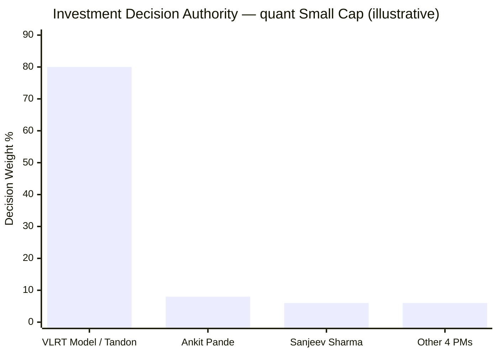
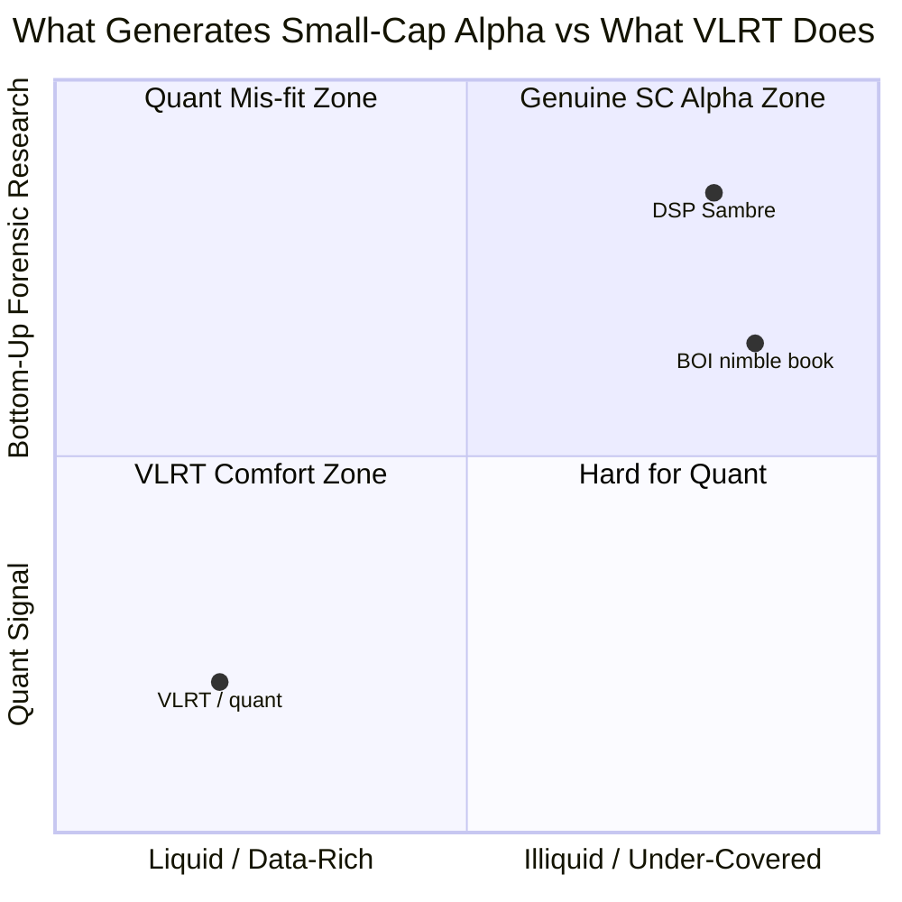
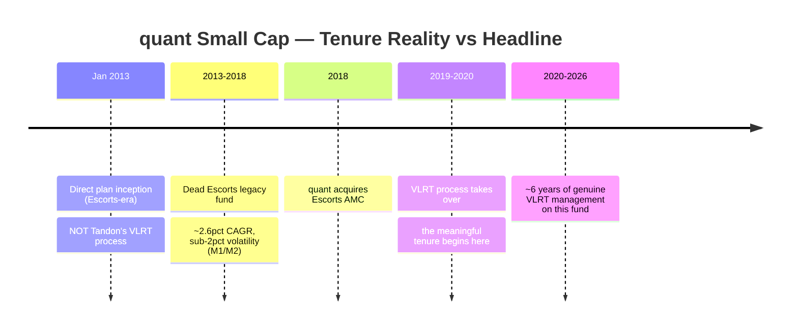
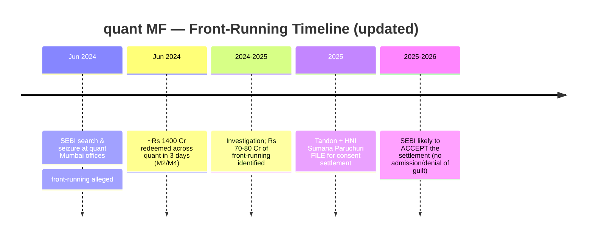
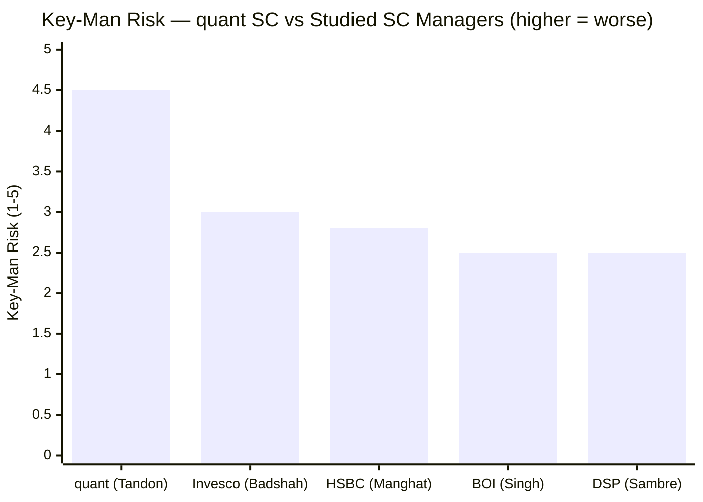
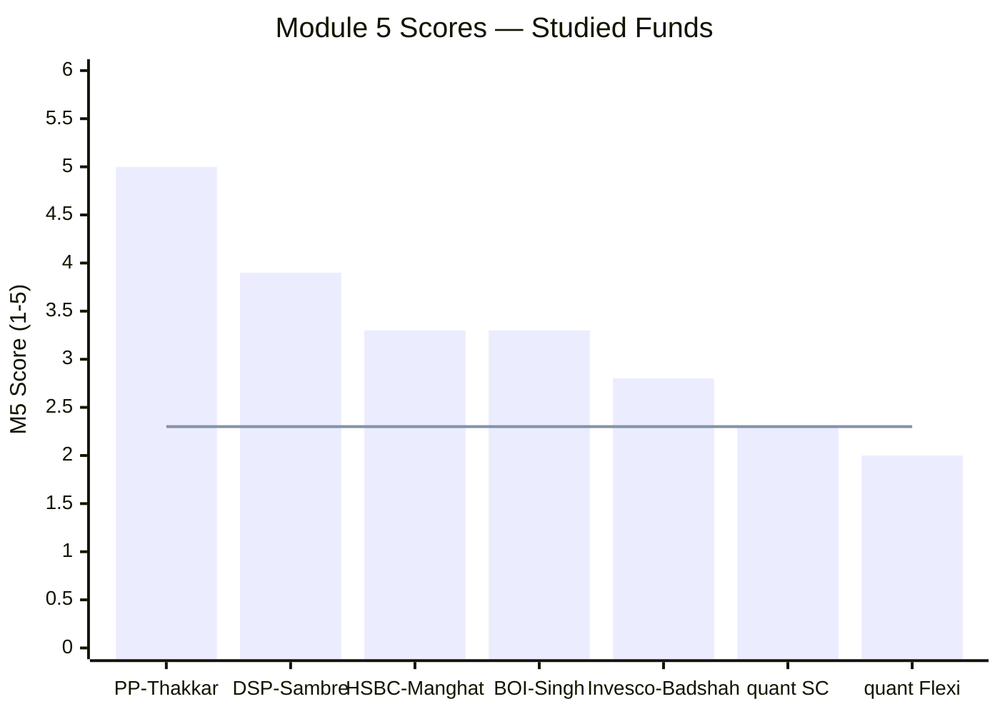
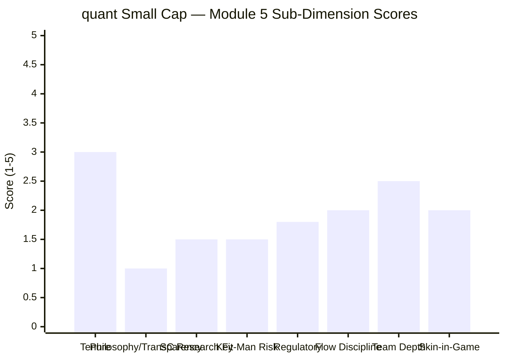

# Module 5: Fund Manager Quality — quant Small Cap Fund

*Sources: Value Research Online (manager roster), AdvisorKhoj (fund data), the FlexiCap Quant module files (carry-forward manager/VLRT findings), Business Standard / Businessworld (SEBI probe + settlement — accessed via earlier research; article pages now paywalled), LinkedIn (Ankit Pande credentials), Module 1–4 of this study (two-era attribution, portfolio drift, AUM). Benchmark = Nifty Smallcap 250 TRI.*

> **⚠️ Out-of-shortlist study.** quant Small Cap was eliminated in Stage 1 (AUM cap). Module 5 is **largely a carry-forward** from the FlexiCap Quant study (same AMC, same CIO, same VLRT model — M5 there scored 2.00), updated for small-cap-specific factors and the latest SEBI settlement status.

---

## Module 5 Score: ~2.3 / 5 — the lowest of the studied small caps (the governance ceiling)

Module 5 is where quant Small Cap's ceiling is set. Everything that sank the **FlexiCap sibling's manager score (2.00)** carries over unchanged: the same **Sandeep Tandon**, the same **undisclosed VLRT "black box,"** the same **extreme key-man risk**, the same **zero investor transparency**, the same **undisclosed skin-in-the-game**, and the same **SEBI front-running matter**. Layered on top are three small-cap-specific *negatives* — a **two-era tenure** (the meaningful VLRT record on this fund is ~6 years, not the 13 the inception date implies), a **structural mismatch between a liquidity/momentum quant model and the bottom-up research genuine small-caps demand**, and **no flow discipline** despite 135× AUM growth — partly offset by two mild *positives*: the **front-running matter is now in a consent-settlement process** (a clearer resolution path than the FlexiCap study's "live, unresolved" framing) and a **larger 7-person operating team**. Net: ~2.3, the lowest manager score of the studied small-cap funds, fractionally above the FlexiCap sibling.

---

## What Module 5 Is Really Asking

Fund returns are the output; the manager is the machine. Module 5 asks: who runs this machine, can you trust them with ₹20,000/month for a decade, can you *understand and verify* what they do, and what happens to your money if they leave?

For quant, every one of those questions returns an uncomfortable answer. The decision-maker is one man running an undisclosed model; there are no investor letters to explain a bad patch; the intellectual capital cannot be inherited; and the man is settling a front-running case. For a *small-cap* mandate specifically, a further question arises that the FlexiCap study did not have to ask: **is a quant momentum model even the right tool for an asset class whose alpha comes from forensic, feet-on-the-ground research on uncovered companies?** Module 5 concludes: largely no.

---

## Manager Roster — Seven Names, One Decision-Maker

| Manager | Role | Credential | Function |
|---------|------|-----------|----------|
| **Sandeep Tandon** | Founder, MD & CIO | Equity-analyst → quant; no FCA | **VLRT architect; the decisive figure; override authority** |
| **Ankit A. Pande** | Fund Manager | CFA + MBA (CUHK) | Most-cited operating PM on this fund; signal execution |
| **Sanjeev Sharma** | Fund Manager | — | Co-execution / dealing |
| Varun Pattani | Fund Manager | — | Execution / monitoring |
| Ayusha Kumbhat | Fund Manager | — | Execution / compliance |
| Sameer Kate | Fund Manager | — | Execution / dealing |
| Yug Tibrewal | Fund Manager | — | Execution (junior) |

> **Data gap:** the exact "managing since" date for each manager *on this specific fund* is **not disclosed** on any platform checked (VRO/AdvisorKhoj list the roster but omit start dates; news pages are paywalled; web search rate-limited). Tenure is reconstructed below from the Module-1 era analysis (VLRT took over ~2019–2020). This is the **fifth quant data gap/anomaly** in the study (after the ER error, the 2015 NAV glitch, the DHFL phantom holding, and the implausible 0.86% turnover).

The seven-name roster is a **compliance and operational structure, not a distributed investment committee.** The intellectual capital — VLRT's parameters, factor weights, signal thresholds, override criteria — resides almost entirely with Sandeep Tandon. The other six execute signals, monitor risk, and handle trade operations. This is the same conclusion the FlexiCap study reached (where four names surrounded Tandon); the small-cap fund simply lists more operators. There is **no equivalent of PP's Onkar/Mehta** — independent thinkers who can each articulate the philosophy. At quant, there is one mind and a larger operations bench.

---

## ⭐ The VLRT Black-Box Problem *(carry-forward, unchanged)*

VLRT (Valuation, Liquidity, Risk-Reward, Timing) is quant's proprietary quantitative framework — and the entire intellectual basis for choosing this fund. quant has **never published** its parameters, factor weights, signal thresholds, or override criteria. No white papers, no detailed investor letters, no framework document. Investors know only that the model exists, that it drives very high turnover, and that it has historically produced strong returns.

This creates a **fundamental due-diligence gap** identical to the FlexiCap sibling's: an investor cannot distinguish between (1) the model working as designed, (2) human overrides helping, (3) human overrides hurting (the Adani case), or (4) returns partly affected by the front-running now under settlement. When a track record cannot be cleanly attributed to a *verifiable, documented* process, it is a weaker predictor of future returns — and for a 10-year SIP, "trust us, the model said so" is not an adequate basis.

**For small caps the opacity is more consequential than for the FlexiCap**, because the small-cap universe carries the highest governance/accounting risk (revenue-recognition games, related-party tunneling), and an investor has no way to see how — or whether — VLRT screens for it.

---

## 🆕 Is a Quant Model Even Suited to Small Caps? *(quant-small-cap-specific — the sharpest new concern)*

This is the question the FlexiCap study never had to ask, and it is the most important small-cap-specific manager finding.

> Genuine small-cap alpha lives in the top-right (forensic research on under-covered names). VLRT operates in the bottom-left (quant signals on liquid, data-rich names) — a structural mismatch with the mandate.

**The mismatch, in three points:**

1. **VLRT is a liquidity/momentum/timing model.** It thrives on **liquid, well-traded, data-rich names** where price/volume signals are meaningful. Genuine small-cap alpha comes from the *opposite* — **bottom-up forensic research on under-covered companies** with thin data and no sell-side coverage (the FCA-style work that defines DSP's Sambre and PP's Thakkar).

2. **No dedicated small-cap research bench.** quant's edge is a *quant signal*, not a team of analysts visiting factories and dissecting related-party transactions. For an asset class where original primary research *is* the alpha, the absence of that bench is a structural gap. The FCA-forensic credential that matters most here is absent across the team.

3. **The M3 smoking gun.** At ₹31,900 Cr, the fund **drifts up into Reliance/Adani/large caps and runs *below* the 65% small-cap floor** (Module 3) — precisely because the model cannot do deep micro-cap stock-picking at that scale. The portfolio drift is the *observable evidence* that the process is mis-fit to the mandate: VLRT expresses itself through liquid large caps because that is where a quant signal at ₹31,900 Cr can operate. **The manager/process is the least suited to genuine small-cap investing of any fund studied** — not a stylistic preference, but a structural mismatch confirmed by the portfolio.

This is why Module 5 lands below even the FlexiCap sibling's *process* fit: the same model that is merely opaque in a flexicap is **opaque *and* mandate-mismatched** in a small-cap fund.

---

## ⭐ The Two-Era Tenure Problem *(quant-small-cap-specific)*

On paper, the team's association with the fund looks long (inception 2013). In reality — established in Module 1 — the fund was a **near-dead Escorts scheme until ~2019–2020**, so the **meaningful VLRT-era management of this fund is only ~6 years.** This is weaker than the FlexiCap sibling, where Tandon ran the fund under VLRT essentially from its inception. The "long tenure" credit that partly cushioned the FlexiCap M5 (3.5/5 on tenure) is **smaller here** — the team has run *this* fund under the current process for about six years, and through only mild corrections (2022, 2024-25), never a genuine small-cap bear.

| Manager | DSP Sambre | quant team (this fund) |
|---------|-----------|------------------------|
| Tenure on fund | 14 years (continuous, one process) | ~6 years meaningful VLRT (13 nominal) |
| Crises navigated on fund | 2018 IL&FS + 2020 COVID | 2022 dip, 2024-25 dip (mild) |
| 2018 test | Yes (−25% / recovered) | **Moot — dead fund in 2018** |

---

## ⭐ The SEBI Front-Running Matter — Now in Settlement *(updated)*

The FlexiCap study (May 2026 snapshot) scored regulatory standing **1/5** — "cannot be scored higher while the investigation is live and unresolved." The **update for this study:** Tandon (with HNI Sumana Paruchuri) has **filed for a consent settlement, which SEBI is likely to accept.** The June-2024 raid identified **₹70–80 Cr of front-running**.

**What the settlement changes — and doesn't:**

| Changes (mild positive) | Does NOT change (the core flag) |
|---|---|
| Clearer resolution path vs an open-ended probe | Settlement = **no admission/denial of guilt**; not exoneration |
| No interim trading ban was imposed; fund operates normally | Does **not validate** the VLRT alpha as cleanly earned |
| Removes the acute "interim order halts the manager mid-SIP" tail risk | The high-turnover order flow that *created* the front-running opportunity is intrinsic to VLRT |
| — | A ₹1,400 Cr/3-day redemption shock already occurred on the news (M2/M4) |

So regulatory standing ticks up modestly (from ~1 to ~1.5–2) versus the FlexiCap study — the resolution path is clearer — but it remains the **dominant governance flag.** A settlement closes the legal chapter without making the manager more transparent or the model more verifiable.

---

## Track-Record Attribution & Key-Man Risk *(carry-forward + small-cap nuance)*

**Key-man risk is extreme — identical to the FlexiCap sibling.** If Tandon were to leave or be impaired:
- VLRT's parameters live in his head and proprietary software; the six co-PMs are operators who cannot reverse-engineer it.
- A successor inherits ~119 holdings (incl. a 10.62% Adani complex and an F&O overlay) with **no written investment rationale** for any position.
- There is **no documented succession plan.**

The small-cap-specific aggravation: the larger 7-person team *marginally* reduces **operational** single-point-of-failure (more hands to keep the lights on), but does **nothing** for the **intellectual** single-point-of-failure — VLRT still dies with Tandon. The team is wider, not deeper.

---

## The Adani Decision — Now a Live 10.62% Holding *(carry-forward, sharpened)*

The FlexiCap M5 hung partly on the **Adani QIP decision** (₹2,000 Cr bought across schemes six weeks before the US-DOJ bribery charges of Nov 2024). For the small-cap fund, Module 3 found a **live 10.62% Adani complex** (Adani Power 4.59% + Green 3.23% + Enterprises 2.80%) — so the same question applies to a *current* position, not just a past trade:

- **If VLRT signalled it:** the model has a structural blind spot for binary governance/legal risk (DOJ charges are not in any price/liquidity signal).
- **If Tandon overrode the model:** the "systematic, unbiased" claim is selectively true; the record is a composite of model + discretionary judgment investors cannot verify.

Either way, it is an M5 negative — and identical in character to the FlexiCap finding, now embedded in the small-cap portfolio.

---

## Transparency, Communication & Skin-in-the-Game *(carry-forward, unchanged)*

| Dimension | quant | DSP | PP (gold standard) |
|---|---|---|---|
| Quarterly investor letters | **None** | None | Yes |
| Position-level rationale | **None** | Partial | Yes |
| Model/framework disclosure | **None (VLRT undisclosed)** | Documented | Documented |
| Underperformance explanation | **None** | Interviews | Detailed letters |
| Skin-in-the-game disclosure | **Not disclosed** | Not disclosed | Disclosed |

quant's transparency is the **worst of the studied funds** — no letters, no position rationale, no model explanation. For a small-cap fund whose record was built by an opaque model now under a front-running settlement, the inability to explain *why* it holds what it holds (a 10.62% Adani complex, a mega-cap Reliance #1) is a genuine accountability failure. When the fund has a bad patch, there is nothing for a SIP investor to read — the opacity drives the redemption fragility seen in June 2024.

---

## 🆕 No Flow Discipline as a Manager-Alignment Signal *(quant-small-cap-specific)*

Voluntary flow restriction is the clearest investor-first signal a small-cap manager can send (DSP closed its fund **three times**, at real fee cost, to protect the strategy). quant has **never gated this fund** despite **135× AUM growth to ₹31,900 Cr** (M4) — past the disqualification cap, and into the up-cap drift that broke the mandate (M3). The incentive structure (AUM-driven fees) and the absence of any gating history both point the same way: **AUM accumulation over strategy protection.** As a manager-alignment signal, this is a negative — the opposite of DSP's discipline.

---

## Credentials in Context

| Manager | Qualification | SC-research fit |
|---------|--------------|-----------------|
| Vinit Sambre (DSP) | FCA | **Best** — forensic accounting for SC governance risk |
| Rajeev Thakkar (PP) | FCA | Best |
| Ankit Pande (quant) | CFA + MBA | Strong institutional/quant; **no FCA forensics** |
| Sandeep Tandon (quant) | Equity-analyst → quant | Macro/quant; no FCA; **process substitutes for research** |

The team's CFA/MBA credentials are solid, but they **lack the FCA forensic depth** most valuable in the governance-risky small-cap universe — and, more fundamentally, the *process* (a quant signal) **substitutes for** bottom-up small-cap research rather than performing it. This is the weakest research-fit for the small-cap mandate of any studied fund.

---

## Peer Manager Comparison

> Line = quant Small Cap's M5 (~2.3) — the lowest of the studied small caps.

| Fund | Manager | Tenure | Key Strength | Key Weakness | M5 |
|------|---------|--------|-------------|--------------|----|
| PP FlexiCap | Thakkar | 13Y | FCA; letters; skin-in-game | Retirement horizon | 5.0 |
| DSP SC | Sambre | 14Y | FCA; flow discipline; dedicated co | No letters | 3.9 |
| HSBC SC | Manghat | 6.5Y | 29Y exp; built recent record | Co-mgr carousel; benchmark-hug | 3.3 |
| BOI SC | Singh | 20mo | 14Y CIO continuity; FlexiCap #2 | Carousel; 23 schemes | 3.3 |
| Invesco SC | Badshah | 7.5Y | Inception clarity | Severe AMC SEBI history | 2.8 |
| **quant SC** | **Tandon +6** | **~6Y VLRT** | **Settlement progressing; larger team** | **Black box; key-man; quant mis-fit for SC; settling probe** | **~2.3** |
| *quant Flexi* | *Tandon* | *~13Y* | *—* | *Black box; active probe; key-man* | *2.00* |

**quant Small Cap is the lowest M5 of the studied small caps** — below Invesco (2.8) — and only fractionally above its FlexiCap sibling (2.00). The gap to DSP/PP is the difference between a transparent, FCA-led, flow-disciplined small-cap specialist and an opaque, quant-momentum, ungated model under a front-running settlement that is structurally mismatched to the mandate.

---

## Points For / Points Against — Fund Manager Quality

### ✅ Points For
1. **Settlement progressing** — a clearer resolution path than the FlexiCap study's "live, unresolved" probe; no interim trading ban; fund operating normally
2. **Larger 7-person operating team** — marginally reduces operational single-point-of-failure
3. **VLRT delivered real VLRT-era alpha** (M1: 5Y +5.83%, IR +0.37/+0.88) — the model demonstrably worked in the post-2020 window
4. **Tandon's long industry experience** and genuine first-mover quant credibility in Indian MF
5. **Ankit Pande's CFA + MBA** — solid institutional credential on the operating PM

### ❌ Points Against
1. **VLRT black box — worst transparency of the studied funds**; no letters, no rationale, no framework
2. **Front-running settlement** — ₹70–80 Cr matter; settlement ≠ exoneration; doesn't validate the alpha; the high-turnover order flow that created the opportunity is intrinsic to VLRT
3. **Extreme key-man risk** — VLRT dies with Tandon; six operators can't inherit it; no succession plan
4. **Quant model structurally mismatched to small caps** — no bottom-up research bench; M3 up-cap drift is the evidence; weakest SC-research-fit of any studied fund
5. **Two-era tenure** — only ~6 years of meaningful VLRT management on this fund; 2018 crisis test is moot
6. **No flow discipline** — never gated despite 135× growth; AUM-over-strategy alignment signal
7. **Live 10.62% Adani complex** — the same governance-blind-spot/override question as the FlexiCap QIP, now in the portfolio
8. **No FCA forensic depth** — least suited credential mix for the governance-risky SC universe
9. **No disclosed skin-in-the-game**
10. **Weak attribution transparency** — manager/process changes communicated only via dry addenda

---

## Module 5 Scorecard

| Sub-Dimension | Score (1–5) | Reasoning |
|---------------|------------|-----------|
| Manager tenure (on this fund) | **3.0** | ~6Y meaningful VLRT (13 nominal); through only mild dips; 2018 moot |
| Philosophy clarity / transparency | **1.0** | VLRT black box; no letters, no rationale — worst of studied funds |
| Small-cap research fit | **1.5** | Quant momentum model; no bottom-up bench; M3 up-cap drift proves the mismatch |
| Key-man risk | **1.5** | Extreme — model dies with Tandon; six operators can't inherit it; no succession |
| Regulatory standing | **1.8** | Front-running settlement filed/likely accepted — ticks up from FlexiCap's 1.0 (resolution path), but ≠ exoneration |
| Flow discipline / alignment | **2.0** | Never gated despite 135× growth; AUM-over-strategy |
| Team depth | **2.5** | 7 names, but operators around one architect; wider, not deeper |
| Skin in the game | **2.0** | Not disclosed |
| **Module 5 Overall** | **~2.3 / 5** | **The governance ceiling, and the lowest M5 of the studied small caps.** The carry-forward floor (black box, extreme key-man, no transparency, settling front-running matter) dominates; small-cap-specific factors (quant-model mismatch, two-era tenure, no flow discipline) pull it further down; partly offset by the progressing settlement and a larger team. Fractionally above the FlexiCap sibling (2.00). |

---

## Comparative Module 5 Scores

| Fund | M5 Score | Manager One-Liner |
|------|---------|-------------------|
| PP FlexiCap | 5.0/5 | FCA; 13Y inception; letters; skin-in-game |
| DSP SC | 3.9/5 | FCA; 14Y; flow discipline; dedicated co-manager |
| HSBC SC | 3.3/5 | 29Y; built recent record; co-manager carousel |
| BOI SC | 3.3/5 | 14Y CIO continuity; FlexiCap #2; but 23 schemes |
| Invesco SC | 2.8/5 | Inception clarity; severe AMC SEBI history |
| **quant SC** | **~2.3/5** | **Opaque VLRT; extreme key-man; quant mis-fit for SC; settling front-running matter** |
| *quant Flexi (sibling)* | *2.00/5* | *Same manager/model; active probe (May-26 snapshot)* |

quant Small Cap sits at the **bottom of the studied small-cap managers**, the inverse of DSP's gold-standard FCA-led, flow-disciplined specialist. The only reason it edges above the FlexiCap sibling (2.00) is the settlement's progression and the larger operating team — neither of which addresses the core problems of opacity, key-man concentration, and a process ill-suited to the mandate.

---

## SIP Implication — What Module 5 Means for Your ₹20,000/Month

For a 10-year satellite SIP, Module 5 is the **decisive negative** and the reason the strong VLRT-era returns (M1) cannot be trusted as a durable basis:

1. **You are buying an unverifiable process run by one man under a front-running settlement.** The VLRT alpha is real in the post-2020 window, but you cannot see how it is produced, cannot read why it holds a 10.62% Adani complex or a mega-cap Reliance, and cannot know whether the historical returns were cleanly earned. For a decade-long commitment, that is the opposite of the "trust infrastructure" Module 5 demands.

2. **A quant momentum model is the wrong tool for genuine small-cap investing.** The alpha in small caps comes from forensic research on uncovered names; quant applies a liquidity/timing signal to liquid ones — which is *why* the portfolio drifts into large caps (M3) and runs below the small-cap floor. You are not getting a small-cap specialist; you are getting a quant model stretched onto a small-cap label.

3. **Key-man risk is extreme and the model dies with Tandon.** There is no succession plan and no one who can inherit VLRT. A regulatory, health, or departure event changes the fund's character entirely — and you would have no choice in the matter.

4. **The settlement closes a legal chapter, not a trust gap.** It is a mild positive versus an open probe, but it does not make the model transparent, the manager accountable, or the alpha verifiable.

**The honest verdict:** the manager dimension confirms the elimination. Even granting the genuine VLRT-era skill, a small-cap SIP requires a process you can understand, a manager whose interests are disclosed and aligned, a succession plan, and a clean regulatory standing — and quant fails on all four, while also being structurally mismatched to the asset class. If you want a small-cap manager, DSP's Sambre (FCA, 14 years, flow-disciplined) is the antithesis of this profile and the correct choice.

---

## One-Line Verdict

quant Small Cap's manager dimension is its governance ceiling: the same opaque VLRT black box, extreme key-man risk, and zero transparency that sank the FlexiCap sibling (2.00) — now compounded by a structural mismatch between a quant-momentum model and the bottom-up research genuine small-caps demand (the cause of the Module-3 up-cap drift), a two-era tenure of only ~6 meaningful VLRT years, and no flow discipline — only fractionally lifted by a front-running matter that has moved into a (non-exonerating) consent settlement and a larger operating team. **Module 5: ~2.3/5 — the lowest manager score of the studied small caps.**

---

*Module 5 complete. Fund-manager quality is the governance ceiling: an undisclosed VLRT model run by one man (Sandeep Tandon) under a front-running consent settlement, with extreme key-man risk, the worst transparency of the studied funds, and — uniquely — a quant process structurally mismatched to the small-cap mandate (evidenced by the Module-3 up-cap drift). Two-era tenure (~6 meaningful VLRT years) and no flow discipline compound it; a progressing settlement and a 7-person operating team mildly offset. Module 5 score: ~2.3/5, lowest of the studied small caps, just above the FlexiCap sibling (2.00).*

*Next: [Module 6 — AMC Quality](module6_amc.md)*
