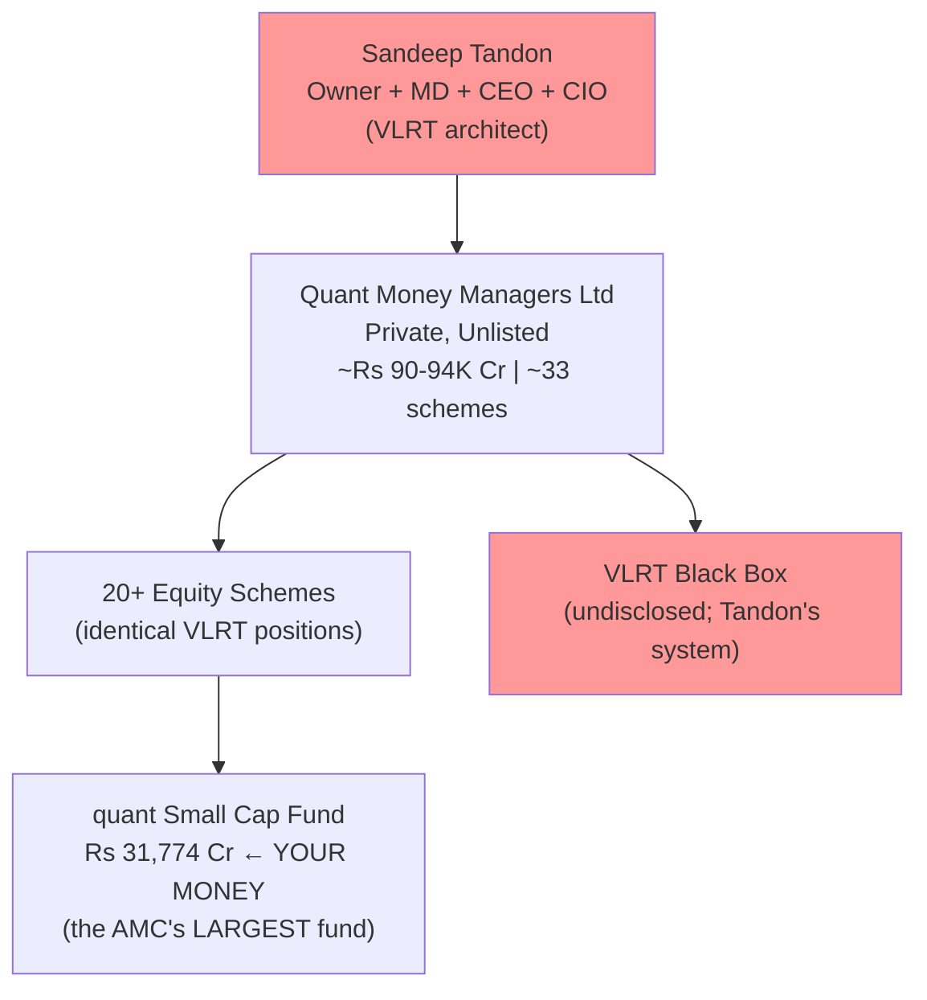
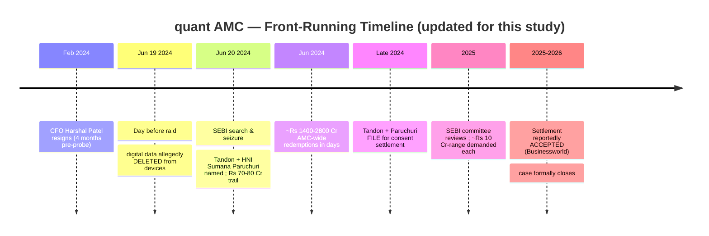
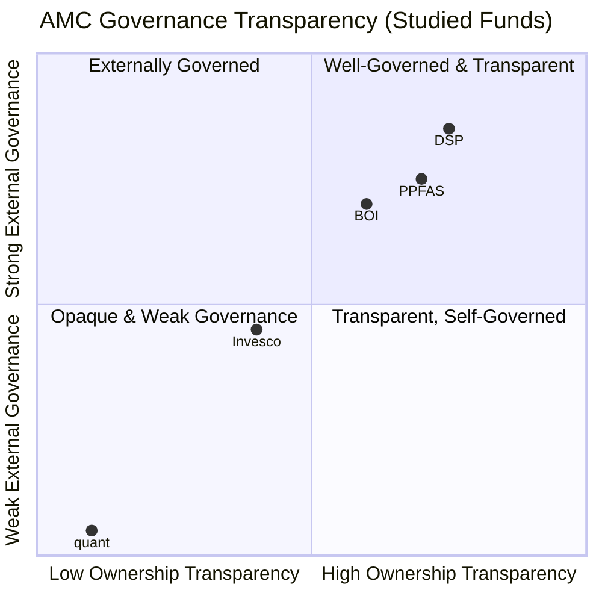
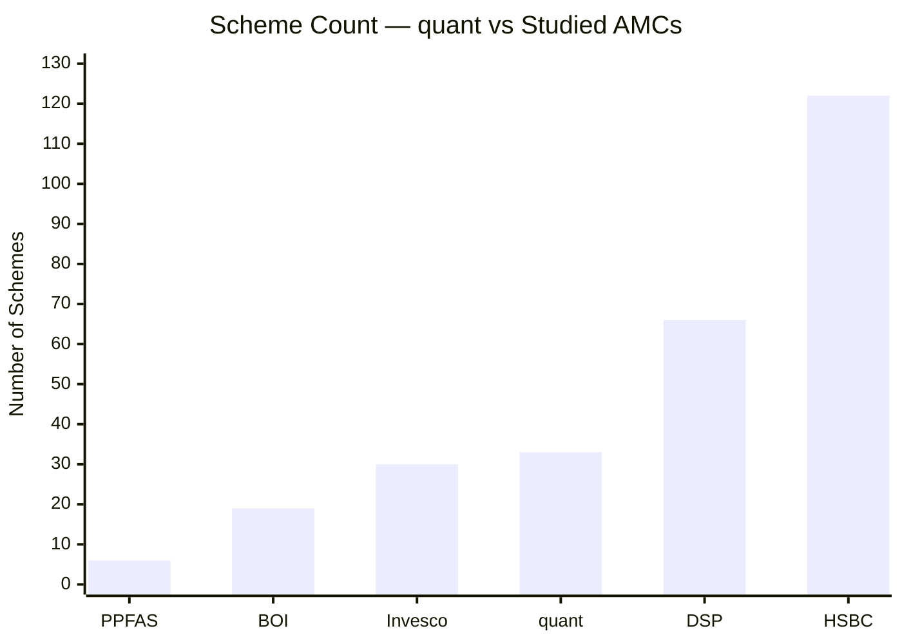
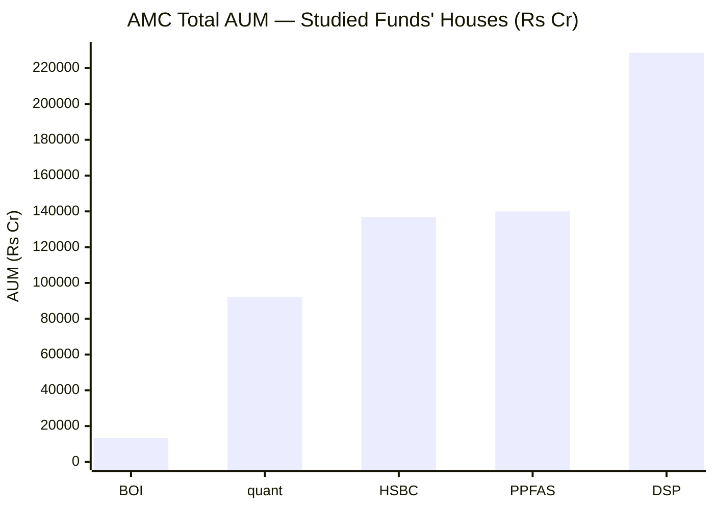
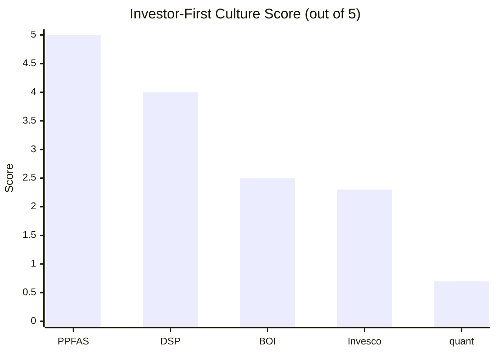
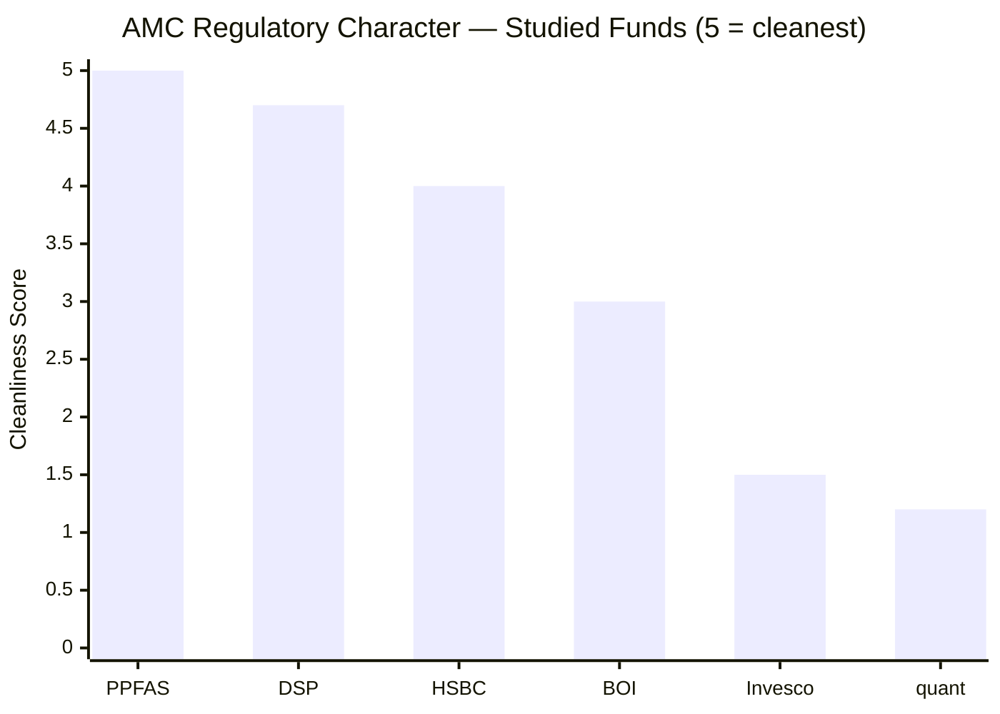
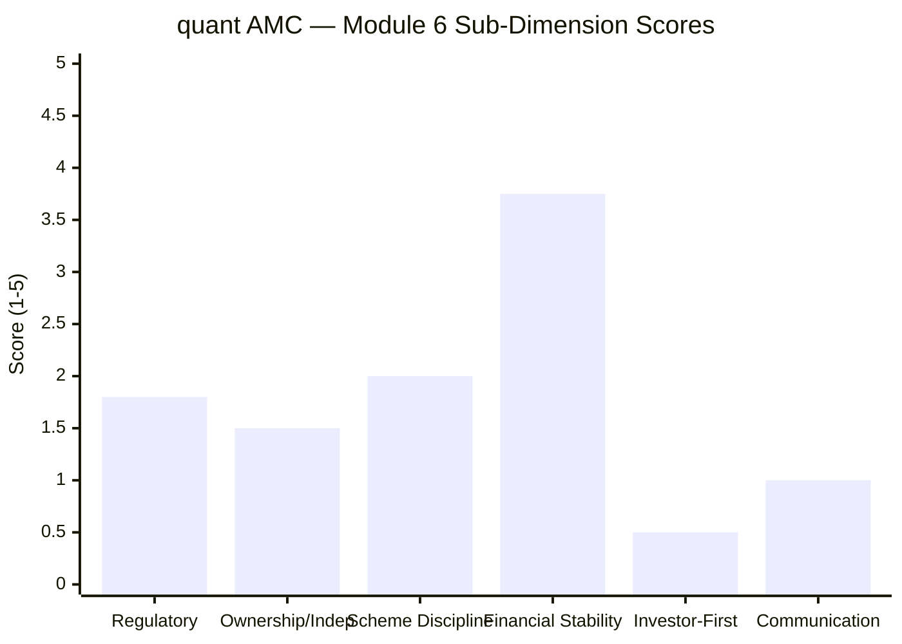
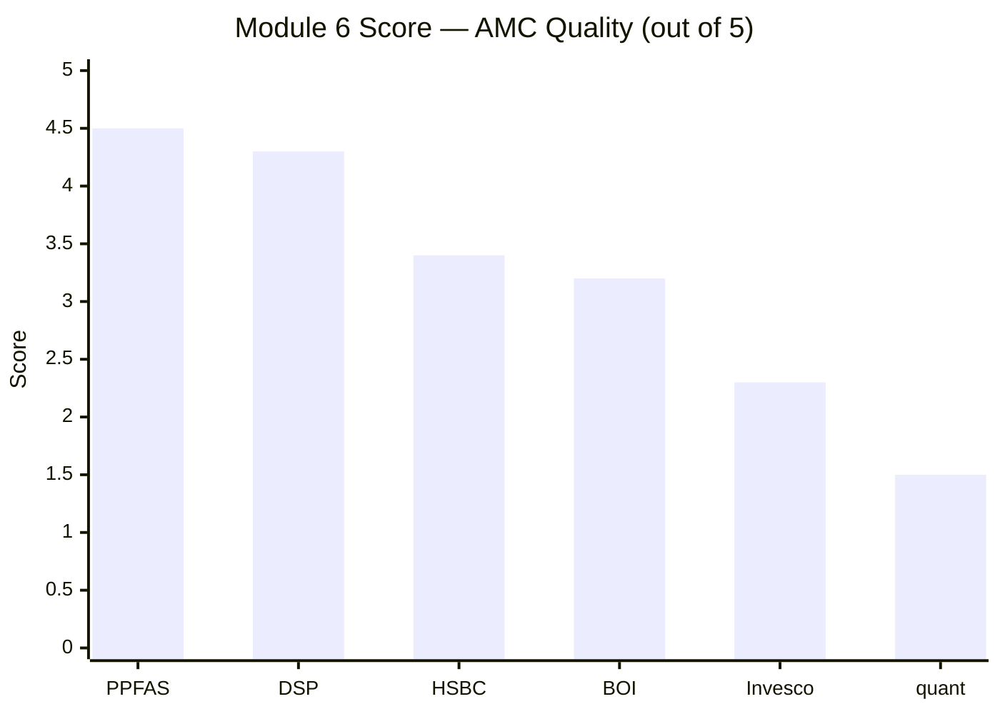
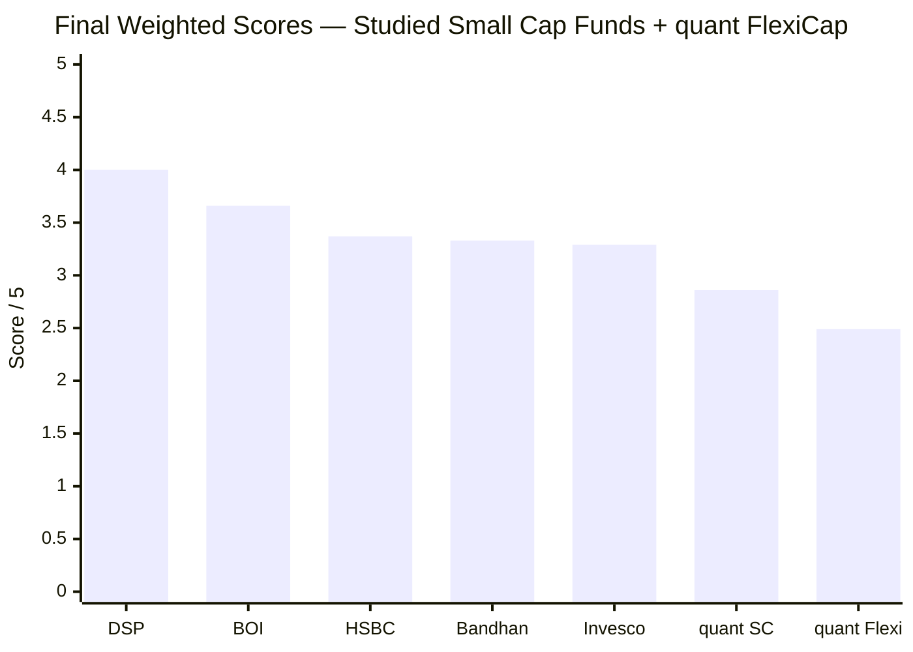

# Module 6: AMC Trustworthiness — quant Small Cap Fund

*Sources: SEBI orders / settlement reports | Businessworld (settlement filing + reported acceptance — article pages paywalled, accessed via earlier research) | Business Standard / Moneylife / Outlook Money (front-running probe) | the FlexiCap Quant module files (carry-forward AMC findings — M6 there scored 1.25/5) | Value Research / Groww (AMC data) | Modules 2–5 of this study. Benchmark = Nifty Smallcap 250 TRI.*

> **⚠️ Out-of-shortlist study + heavy carry-forward.** quant Small Cap was eliminated in Stage 1 (AUM cap). Module 6 evaluates **Quant Money Managers Ltd (QMML)** — the *same AMC* studied in the FlexiCap Quant project, where it scored **1.25/5 (the lowest AMC score in either study)**. The AMC-level facts are identical; this module updates the SEBI settlement status and adds small-cap-specific angles.

---

## Module 6 Score: ~1.5 / 5 — the lowest AMC score of the studied small caps

Module 6 is the **governance floor** of the quant Small Cap study, and it confirms the elimination. The AMC is **Quant Money Managers — a single-owner, private, unlisted firm** where Sandeep Tandon is simultaneously owner, MD, CEO, and CIO, with **no listed parent, no external board check, and no institutional accountability.** It is the subject of a **SEBI front-running matter** (June-2024 raid, ₹70–80 Cr trail) compounded by an **alleged data deletion the day before the raid** — and it runs a **near-zero investor-first culture** (no letters, no skin-in-game, scheme proliferation, initial denial of the probe). The single genuine positive — **financial self-sustenance** (~₹90–94K Cr AUM, won't fail) — is governance-irrelevant. The one *update* from the FlexiCap study is that the **consent settlement has reportedly moved to acceptance** (vs "pending"), which eases the acute regulatory tail risk and nudges the score marginally above the FlexiCap sibling's 1.25 — but it is not exoneration, and the governance-culture failures are entirely unchanged. Small-cap-specific factors (no flow discipline at ₹31,900 Cr, the largest redemption surface in the study, no small-cap research bench) keep it from rising further.

---

## Raw Data (Cross-Source; mostly carried from the FlexiCap study)

| Metric | Value | Notes |
|--------|-------|-------|
| **AMC Full Name** | **Quant Money Managers Ltd (QMML)** | Unlisted, private |
| **Founded / rebuilt** | 1996 (SEBI approval); **rebuilt from ~zero post-2008** by Tandon | Acquired erstwhile Escorts AMC franchise |
| **Promoter / Owner** | **Sandeep Tandon** (majority; sole visible promoter) | Owner + MD + CEO + CIO |
| **Parent company** | **None** | Fully independent; no group/bank backing |
| **Listing status** | **Unlisted, private** | No public shareholders; no external governance check |
| **Total AMC AUM** | **~₹90,000–94,000 Cr** | Financially self-sustaining |
| **Total schemes** | **~33** (20+ equity) | Proliferating (from ~10 in 2020) |
| **This fund's AUM** | **₹31,774 Cr** | The AMC's largest fund; largest redemption surface |
| **SEBI matter** | Front-running; **₹70–80 Cr** trail; Tandon + HNI Sumana Paruchuri named | Raid June 2024 |
| **Settlement status** | **Consent settlement reportedly ACCEPTED** (vs "pending" in the FlexiCap May-26 snapshot) | ~₹10 Cr-range demanded each; no admission of guilt |
| **Data-deletion allegation** | **Yes** — devices allegedly wiped day before the raid | Obstruction concern; unchanged |
| **CFO resignation** | Harshal Patel resigned Feb 2024 (4 months pre-probe) | Timing unexplained |
| **Jun-2024 redemption shock** | **~₹1,400–2,800 Cr** AMC-wide outflows in days | M2/M4 cross-link |
| **Flow-restriction history (this fund)** | **None** despite 135× growth | No gating at ₹31,774 Cr |
| **Investor letters** | **None** | No periodic communication |
| **Skin-in-game disclosure** | **Not disclosed** | — |
| **Small-cap research bench** | **None dedicated** — VLRT quant model | M5 bridge |
| **Custodian / RTA** | Standard providers | — |

---

## What Module 6 Is Really Asking

You can have a capable return engine, but if the institution behind it is regulatorily compromised, culturally indifferent to investors, or structurally unaccountable, everything else can unravel. Module 6 evaluates the *house*: governance, regulatory record, ownership, financial stability, and whether it puts investors first or AUM/fees first.

For quant, Module 6 is not a secondary check — it is the **central question and the binding constraint.** Every prior module assessed a fund with genuine VLRT-era return power but escalating structural problems. Module 6 asks whether the institution behind it is a trustworthy 10-year custodian for a small-cap SIP. The answer — a single-owner private firm whose owner-CIO settled a front-running matter, with an alleged data deletion, zero investor-first culture, and no external accountability — is **no.** This is the same conclusion the FlexiCap study reached (1.25/5); the small-cap context changes it only at the margin.

---

## The AMC Structure — A One-Person Institution

| Dimension | quant | DSP | PPFAS | BOI | Invesco |
|-----------|-------|-----|-------|-----|---------|
| Ownership | **Single-owner private** | Family-private | Promoter-private | Govt-bank | Hinduja/IIHL |
| Listed parent / public scrutiny | **None** | No (family) | No | Govt bank | No |
| External board check | **Minimal** | Yes | Yes | Govt/board | Board |
| Owner = CIO = CEO? | **Yes (all Tandon)** | No | No (separated) | No | No |
| Acquisition risk | Low (Tandon owns it) | Very low | Low | None | **High (4 changes)** |
| Single-point-of-failure | **Extreme** | Low | Moderate | Low-Med | Moderate |

**Why this structure is uniquely risky:** there is no listed parent with reputational accountability, no institutional shareholders with standing to question decisions, and no independent board with genuine power over the owner-CIO. Tandon holds every key role. If he is barred, incapacitated, or departs, **the AMC loses its operational brain and the VLRT model with it** — there is no equivalent of DSP's institutional depth or PP's professional management layer. This is the most concentrated single-point-of-failure ownership of any AMC in either study, and it is *unchanged* from the FlexiCap finding.

---

## ⭐ The SEBI Front-Running Matter — Now Reportedly Settled *(centerpiece, updated)*

The mechanics (carried forward): an HNI (Paruchuri) allegedly traded ahead of quant's large VLRT-driven orders, a **₹70–80 Cr front-running trail**, with the Tandon–Paruchuri connection making it a CIO-level matter. The **data-deletion allegation** (devices wiped the day before the raid) is the most alarming detail — if true, it implies obstruction, categorically worse than the underlying front-running.

**The update — and what it does / doesn't change:**

| Eases (mild positive) | Unchanged (the governance core) |
|---|---|
| Settlement reportedly **accepted** → case formally closes; the acute "interim order bars Tandon mid-SIP" tail risk recedes | Settlement = **no admission/denial of guilt** — *not* exoneration |
| Removes the open-ended-probe overhang the FlexiCap study scored at 0.5/5 | Does **not validate** the VLRT alpha as cleanly earned |
| Markets have largely priced it (AUM recovered) | The **data-deletion allegation** still stands unresolved in character |
| | Ownership opacity, scheme proliferation, zero investor-first culture — all untouched |

So **regulatory cleanliness ticks up modestly** (from ~0.5 in the FlexiCap study to ~1.8 here): the legal chapter closes, but via payment-in-lieu with a data-deletion shadow, not a clean bill. Crucially, the *governance-culture* concerns are **independent of the settlement** and dominate the rest of the score.

> **Verification note:** the "accepted" status rests on a Businessworld report (article paywalled; corroborated by the headline surfaced in research). The FlexiCap study had it as "filed/pending." Reflected conservatively — if still merely pending, M6 would be ~1.3 (immaterial to the verdict).

---

## Ownership Transparency & Governance — Opaque

Because QMML is a **private, unlisted, single-owner firm**, governance transparency is the weakest of any AMC studied: no quarterly earnings calls, no public AMC P&L, no institutional shareholders, no independent board with power over the owner-CIO. Tandon can maintain his roles indefinitely absent a SEBI bar. This sits in the bottom-left "opaque & weak governance" quadrant — alone.

---

## Scheme Proliferation — 33 and Growing, Mid-Probe

quant tripled its scheme count (≈10 in 2020 → ~33 in 2026) on the back of the AUM surge, and **launched a complex SIF (Hybrid Long-Short) in late 2025 — during the active investigation.** Two small-cap-relevant consequences:
1. **20+ equity schemes run identical VLRT signals** — the same positions (Reliance, the Adani complex) are replicated across mandates, so the small cap fund's book is not unique to it, and simultaneous large orders across schemes **amplify the very market-impact/front-running dynamic** that drew SEBI's attention.
2. **Launching complex products mid-probe** signals AUM-growth-over-governance restraint — a culture read, not just a count.

DSP (66 schemes) and HSBC (122) have more schemes but disciplined, institutionally-governed platforms; quant's proliferation sits on a single-owner base with an active regulatory matter.

---

## 🆕 No Flow Discipline at ₹31,900 Cr *(small-cap-specific)*

The clearest small-cap investor-first signal an AMC can send is **voluntary flow restriction** to protect the strategy. DSP closed its small cap fund **three times** at real fee cost. quant has **never gated this fund** despite **135× AUM growth** to ₹31,774 Cr — the largest in either study, past the disqualification cap, and into the up-cap drift that broke the mandate (M3). For a single-owner AMC whose revenue scales with AUM, the absence of any gating is an **AUM-over-strategy alignment signal** — the opposite of DSP's discipline, and a small-cap-specific AMC failure the FlexiCap study did not have to weigh as heavily.

---

## 🆕 The Largest-AUM Redemption Surface + the Jun-2024 Shock *(small-cap-specific)*

As the **AMC's largest fund (₹31,774 Cr)**, the small cap fund carries the **biggest redemption surface** in either study — and the AMC has *already demonstrated* the fragility. When the SEBI raid broke (June 2024), **~₹1,400–2,800 Cr of redemptions hit quant AMC-wide in days** (M2/M4). For a small-cap fund, forced selling of illiquid positions at distressed prices is the defining stress — and quant uniquely carries a **second, idiosyncratic trigger: its own governance headlines.** A market crash *plus* a quant-specific SEBI/Tandon headline could compound into outflows at the worst moment, at the largest AUM in the study. This is an AMC-level risk that is sharpest precisely here.

---

## 🆕 No Small-Cap Research Infrastructure *(M5 ↔ M6 bridge)*

A small-cap fund's edge should rest on an AMC's **dedicated analyst bench** doing original, forensic research on under-covered companies (DSP's institutional depth, PP's research culture). quant's AMC instead funds a **black-box quant model (VLRT)** — there is no evidence of a feet-on-the-ground small-cap research team. As established in Module 5, this is *why* the fund drifts up into liquid large caps at scale (M3). At the AMC level, it means the institution is **not built to support genuine small-cap investing** — the research model is structurally mismatched to the mandate. This compounds the manager-level finding into an institutional one.

---

## 🆕 Financial Stability — The One Axis quant Beats BOI *(small-cap-specific nuance)*

The single genuine M6 positive: unlike BOI's sub-scale AMC (~₹13,400 Cr, thin research budget), **quant is financially self-sustaining** (~₹90–94K Cr, ~₹770 Cr/yr fee revenue, no parent subsidy). The AMC **will not fail**, and this fund alone generates substantial revenue. So **financial stability scores well (~3.5–4)** — the inverse of BOI's small-AMC fragility, and one axis where quant genuinely beats it.

**But the resources are governance-irrelevant.** They fund a black-box quant model + scheme proliferation, *not* investor-first culture, *not* a small-cap research bench, *not* external accountability. A well-capitalised institution with poor governance is still a poor custodian. The financial strength prevents insolvency; it does nothing for the trust deficit that defines this AMC.

---

## Investor-First Culture — Near Zero (unchanged)

| Investor-First Metric | quant | DSP | PPFAS |
|---|---|---|---|
| Quarterly investor letters | **No** | No | Yes |
| Skin-in-game disclosed | **No** | All-employee | Manager-disclosed |
| Portfolio rationale explained | **Never** | Interviews | Monthly |
| Flow discipline (gating) | **None (135× growth)** | 3 closures | SIP cap |
| Transparent about SEBI probe | **No — initially denied/minimised** | N/A | N/A |
| Restraint during crisis | **No — launched SIF mid-probe** | N/A | N/A |

quant's investor-first culture is the **weakest of any AMC studied** — no letters, no skin-in-game, no portfolio rationale, no flow discipline, and a probe it initially minimised. For a small-cap fund whose book an investor cannot see the logic behind (a mega-cap Reliance #1, a 10.62% Adani complex), the inability and unwillingness to communicate is a genuine accountability failure that drives the redemption fragility.

---

## Regulatory Record — Worst of the Studied Small Caps

| AMC | Issue | Character |
|-----|-------|-----------|
| DSP | ETF expense procedural (₹2L) | Procedural only |
| HSBC | Decision-documentation (₹5L) | Procedural only |
| BOI | Debt-side insider redemption (₹10L) + Credit Risk debacle | Governance scar (debt side) |
| Invesco | Inter-scheme transfers; multi-jurisdiction probe (₹4.98 Cr) | Severe, investor-harm |
| **quant** | **Front-running on current CIO (₹70–80 Cr trail); data-deletion allegation; settled** | **Most serious — current decision-maker; obstruction shadow** |

quant's regulatory character is the **worst of the studied small caps** — the only one with a front-running matter on the *current owner-CIO*, the only one with a data-deletion allegation, on the *equity* side where the investor's money sits. Even with the settlement reportedly accepted (closing the legal case), the *character* of the matter — and the obstruction shadow — keep it at the bottom. Invesco (₹4.98 Cr investor-harm) is the only peer in the same severity tier.

---

## Peer AMC Comparison

| Dimension | quant | DSP | PPFAS | HSBC | BOI | Invesco |
|-----------|-------|-----|-------|------|-----|---------|
| Ownership | **Single-owner private** | Family | Promoter | Global bank | Govt-bank | Hinduja |
| External governance | **None** | Board | Board | Global parent | Govt | Board |
| Regulatory character | **Front-running (CIO); data-deletion** | Procedural | Clean | Procedural | Debt scar | Severe |
| Financial stability | **High (₹92K Cr)** | Very high | High | Very high | Govt-backed | Moderate |
| Investor-first | **Near zero** | Above-avg | **Best** | Moderate | Thin | Below-avg |
| Flow discipline | **None** | 3 closures | SIP cap | None | None | None |
| Small-cap research depth | **None (quant model)** | Deep | n/a | Deep | Thin | Moderate |
| M6 Score | **~1.5** | 4.3 | 4.5 | 3.4 | 3.2 | 2.3 |

---

## Points For / Points Against — AMC Quality

### ✅ Points For
1. **Financially self-sustaining** (~₹90–94K Cr, ~₹770 Cr/yr revenue) — the AMC will not fail; no parent subsidy needed (beats sub-scale BOI on this one axis)
2. **Settlement reportedly accepted** — the acute open-probe regulatory tail risk recedes; legal case closes
3. **Fully independent (no bank/conglomerate parent)** — no distribution-empire conflict of interest
4. **Genuine demand validation** — AUM grew from ~₹233 Cr (2020) to ~₹92K Cr; the model attracted real flows

### ❌ Points Against
1. **Front-running matter on the current owner-CIO** (₹70–80 Cr trail) — the decision-maker for your money; settled ≠ exonerated
2. **Data-deletion allegation** (day before the raid) — obstruction shadow; categorically more serious than the underlying matter
3. **Single-owner, private, unlisted structure** — no external board, no public scrutiny, no institutional accountability; extreme single-point-of-failure
4. **Near-zero investor-first culture** — no letters, no skin-in-game, no portfolio rationale, initial probe denial
5. **No flow discipline** — never gated despite 135× growth to the largest AUM in the study
6. **Largest redemption surface + proven fragility** — ₹31,774 Cr fund; ~₹1,400–2,800 Cr AMC outflows in the Jun-2024 shock; a live idiosyncratic governance trigger
7. **No small-cap research infrastructure** — funds a black-box quant model, not an analyst bench; structurally mismatched to the mandate
8. **Scheme proliferation mid-probe** — ~33 schemes; SIF launched during the investigation; AUM-over-governance restraint
9. **20+ equity schemes run identical VLRT positions** — amplifies market impact and the front-running dynamic
10. **No succession / no team backstop** — if Tandon is barred or departs, the AMC loses its brain

---

## Module 6 Scorecard

| Sub-Dimension | Weight | Score (1–5) | Reasoning |
|---------------|--------|------------|-----------|
| Regulatory cleanliness | 25% | **1.8** | Front-running on current CIO; data-deletion shadow; *but* settlement reportedly accepted → ticks up from FlexiCap's 0.5 |
| Ownership independence / governance | 15% | **1.5** | Independent (no bank parent) — good; but private, unlisted, single-owner — extreme opacity, no external check |
| Scheme discipline | 15% | **2.0** | ~33 schemes; 20+ equity running identical VLRT positions; SIF launched mid-probe |
| Financial stability | 15% | **3.75** | ~₹92K Cr, self-sustaining, won't fail — the one genuine positive (beats BOI) |
| Investor-first culture | 20% | **0.5** | No letters, no skin-in-game, no flow discipline, initial probe denial — weakest of any studied AMC |
| Investor communication | 10% | **1.0** | No portfolio rationale; minimised the probe; category-worst |
| **Module 6 Overall** | **100%** | **~1.5 / 5** | **The governance floor and the lowest AMC score of the studied small caps.** A single-owner private firm whose owner-CIO settled a front-running matter (with a data-deletion shadow), near-zero investor-first culture, no external accountability, and small-cap-specific failures (no gating, largest redemption surface, no research bench) — lifted only marginally above the FlexiCap sibling (1.25) by the settlement's reported acceptance and genuine financial self-sustenance. |

---

## Comparative Module 6 Scores

| Rank | AMC | Score | Key Factor |
|------|-----|-------|-----------|
| 1 | PPFAS | 4.5 | Zero incidents; quarterly letters; investor-first |
| 2 | DSP | 4.3 | 160Y heritage; all-employee skin-in-game; flow discipline |
| 3 | HSBC | 3.4 | $3T global parent; but open-door AUM |
| 4 | BOI | 3.2 | Govt-bank unsinkable; debt-side scar |
| 5 | Invesco | 2.3 | 4 ownership changes; multi-jurisdiction probe |
| 6 | **quant** | **~1.5** | **Single-owner; front-running (CIO) + data-deletion; zero investor-first; settled-not-exonerated** |

quant is the **lowest AMC score of the studied small caps**, below Invesco — and a touch above its FlexiCap sibling (1.25) only because the settlement has reportedly moved to acceptance. The gap to DSP/PP is the difference between a transparent, accountable, investor-first institution and a single-owner private firm whose owner-CIO settled a front-running matter.

---

## One-Line Verdict

Quant Money Managers is a financially self-sustaining but governance-floor AMC — a single-owner, private, unlisted firm whose owner-CIO (Sandeep Tandon) settled a ₹70–80 Cr front-running matter shadowed by a data-deletion allegation, with no external accountability, near-zero investor-first culture, no flow discipline at the largest AUM in the study, and a quant model in place of a small-cap research bench — making it the least trustworthy custodian of the studied small caps (~1.5/5), lifted only marginally above its FlexiCap sibling (1.25) by the settlement's reported acceptance and genuine financial strength.

---

## Module 6 Final Score: **~1.5 / 5**

> **Module Weight:** 5% | **Weighted Contribution:** 1.5 × 0.05 = **0.075**

---

## quant Small Cap Fund — Complete Final Score (All 6 Modules)

| Module | Topic | Weight | Score | Weighted |
|--------|-------|--------|-------|----------|
| Module 1 | Returns Consistency | 25% | 3.4/5 | 0.850 |
| Module 2 | Risk Profile | 20% | 3.1/5 | 0.620 |
| Module 3 | Portfolio DNA | 15% | 2.7/5 | 0.405 |
| Module 4 | Cost & AUM Impact | 20% | 2.8/5 | 0.560 |
| Module 5 | Fund Manager Quality | 15% | 2.3/5 | 0.345 |
| **Module 6** | **AMC Trustworthiness** | **5%** | **1.5/5** | **0.075** |
| **TOTAL** | | **100%** | | **≈ 2.86 / 5** |

> **quant Small Cap final weighted score: ≈ 2.86 / 5 — LAST of the studied small-cap funds, but ABOVE its own FlexiCap sibling (2.49).**

**The structural story in one line:** quant's strengths sit in the high-weight modules but are *modest* (M1 returns 3.4, M2 risk 3.1, M4 cost 2.8 — none above 3.5), while its weaknesses (M3 portfolio mandate-drift 2.7, M5 manager 2.3, M6 AMC 1.5) are *severe* and span both high- and low-weight modules. Unlike BOI — whose weaknesses were quarantined in the low-weight modules — quant's problems are pervasive: a strong but era-contaminated and unverifiable return engine, a portfolio that abandons the small-cap mandate, the worst true-all-in cost, a quant process mismatched to small caps, and a governance-floor AMC. The result confirms the Stage-1 elimination: **quant Small Cap is the "less bad" of the two quant funds (better M2/M3/M4 than the FlexiCap sibling), but it ranks last of the studied small caps and well below shortlist grade.**

---

*Module 6 complete. AMC trustworthiness is the governance floor: a single-owner private firm whose owner-CIO settled a front-running matter (with a data-deletion shadow), zero investor-first culture, no external accountability, and small-cap-specific failures (no flow discipline at ₹31,774 Cr, the largest redemption surface in the study, no small-cap research bench) — lifted marginally above the FlexiCap sibling (1.25) only by the settlement's reported acceptance and genuine financial self-sustenance. Module 6 score: ~1.5/5. **quant Small Cap final score ≈ 2.86/5 — last of the studied small caps, above the FlexiCap sibling (2.49).***

*Next: [README — Final Scorecard & Verdict](README.md)*
