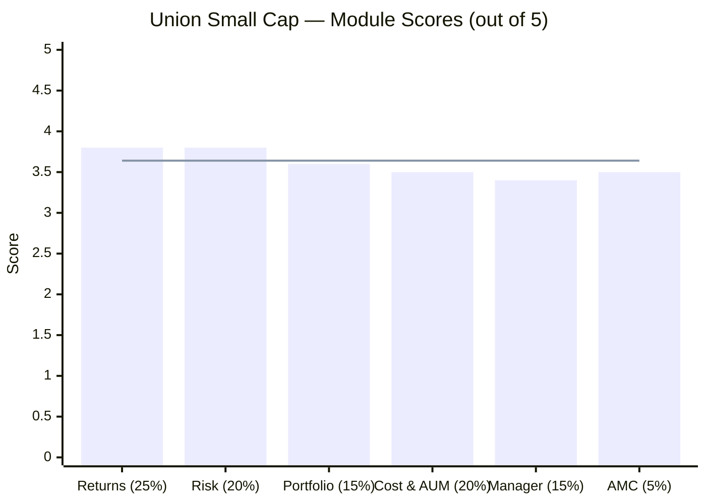
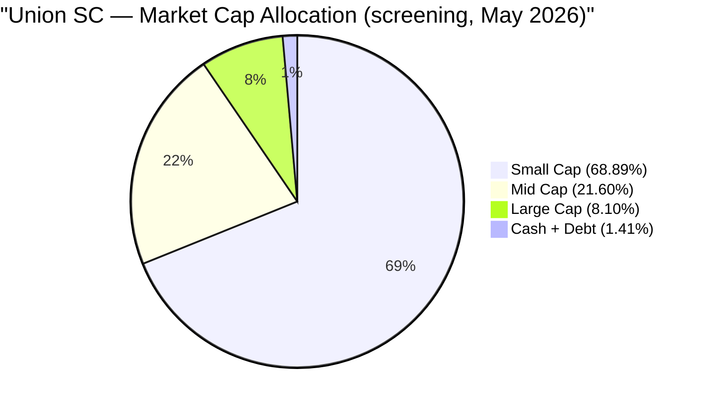
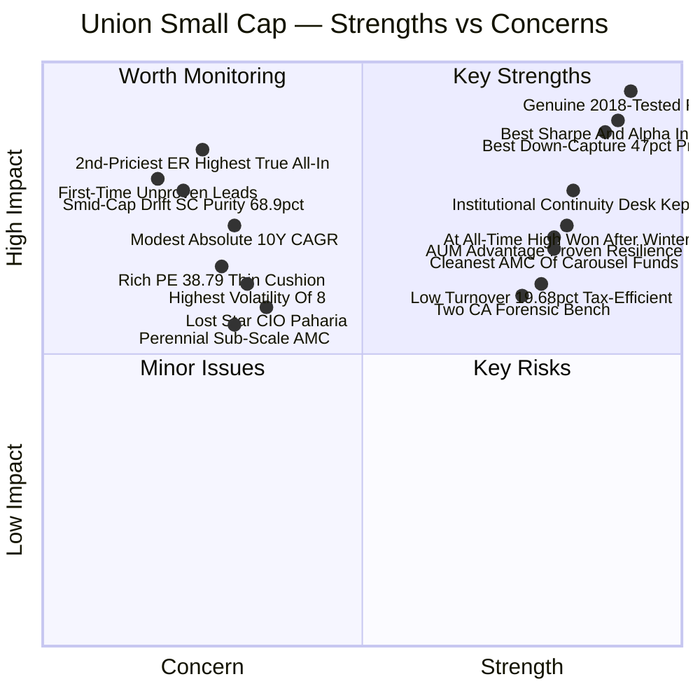
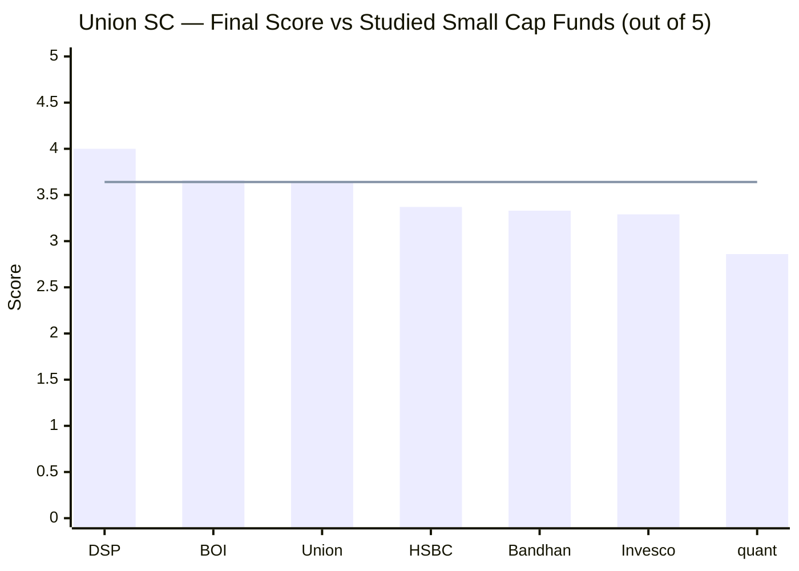
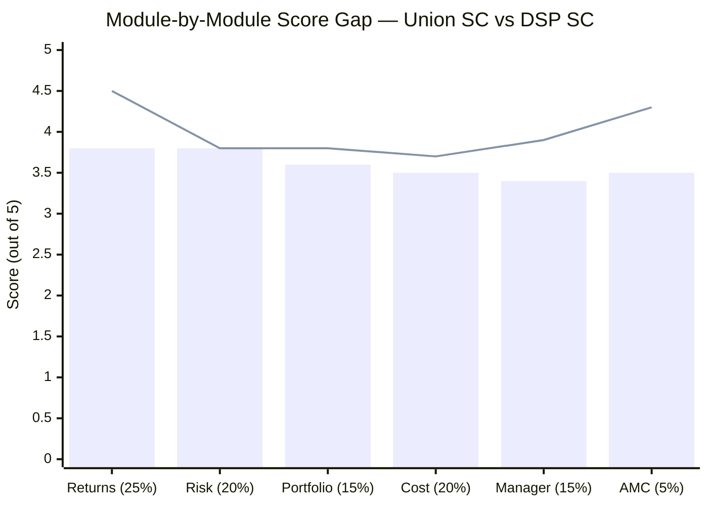
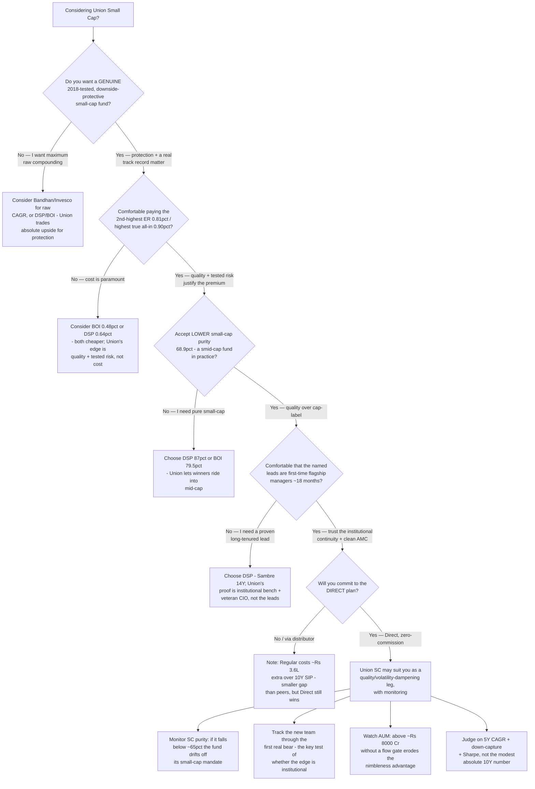
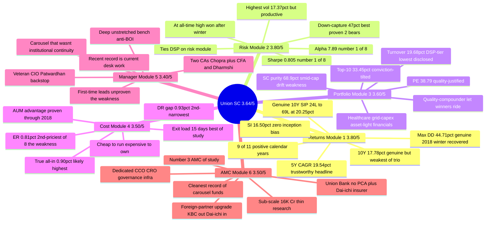

# Union Small Cap Fund — Deep Study

## Fund Identity

| Field | Value |
|-------|-------|
| **AMC** | Union Asset Management Co. Pvt. Ltd. |
| **AMC Parents** | **Union Bank of India (~60.4%)** + **Dai-ichi Life Holdings, Japan (~39.6%)** — dual-strong parentage |
| **AMC Heritage** | Launched 2011 as **Union KBC** (Union Bank 51% / KBC Belgium 49%); KBC exited 2016 (Union Bank → 100%); **Dai-ichi Life acquired 39.62% in 2017** |
| **Fund Inception** | **June 17, 2014** (~12 years; NFO 10-Jun-2014; inception NAV ₹10.06) — a genuine, multi-cycle record |
| **Lead Manager** | **Gaurav Chopra** (CA + CFA L3) — internal promotion (Union analyst 2020→23; continuous on SC) |
| **Co-Manager Since** | **December 9, 2024** — Pratik Dharmshi (CA; ex-PM Girik Capital) |
| **Equity Oversight** | CIO **Harshad Patwardhan** (ex-CIO Edelweiss MF / ex-Head Equities JPM India) + Head-Equity **Sanjay Bembalkar** |
| **Predecessor (architect)** | **Vinay Paharia** — CIO 2018–Jan 2023 (built the 2018-protection record) → **left for PGIM India** |
| **Category** | Small Cap Fund (Equity) |
| **Benchmark** | Nifty Smallcap 250 TRI (mandate: BSE 250 SmallCap TRI) |
| **AUM (Total)** | ₹1,980–2,094 Cr (June 2026) — **2nd-smallest of the 8 shortlisted** |
| **Current NAV (Direct Growth)** | ₹62.94 (June 19, 2026) — **at all-time high** |
| **Expense Ratio (Direct)** | **~0.80–0.82%** — **2nd-most-expensive** of the 8 shortlisted |
| **Expense Ratio (Regular)** | ~1.75% |
| **Direct-Regular Gap** | **~0.93%** — 2nd-narrowest of the studied SC funds |
| **Exit Load** | **1% if redeemed within 15 days; Nil after** — most investor-friendly of the study |
| **Min SIP** | ₹500 (₹100 on some platforms) |
| **Min Lumpsum** | ₹1,000 |
| **Lock-in** | None |
| **VRO Rating** | **4★** |

---

## The One-Line Context

Union Small Cap Fund is the study's **"genuine quality-defensive compounder, vindicated"** case — the fund the screening flagged as a *pending wildcard* ("why 2× the next-best Sharpe — genuine, or a data artefact to eliminate?") and which the full study answers emphatically in its favour. Union is **one of only four shortlisted funds with a genuine 12-year, 2018-tested record**, and it pairs that with the **best risk-adjusted profile of all eight funds** (Sharpe 0.805, alpha 7.89, and a *proven* 47% down-capture — all #1). The screening's Sharpe anomaly is resolved: it is **not** low volatility (Union has the highest raw vol of the eight) but **asymmetric capture** (94% up / 47% down) — the signature of a genuine quality-defensive book that *protects via durable franchises, not cheapness* (which also explains its rich PE of 38.79). The "manager carousel" fear that haunts its peers is **largely allayed**: the founder-CIO (Paharia) left, but his equity desk *stayed and was promoted*, a heavyweight veteran CIO (Patwardhan) was added, and the day-to-day lead (Chopra) is an internal-continuity hire — giving Union the strongest post-founder continuity and the cleanest AMC of the carousel-era funds. The genuine reservations are a **2nd-most-expensive expense ratio** (the highest true all-in of the group), a **lower small-cap purity** (68.9% — the "smid-cap drift" of a let-winners-ride style), and **first-time flagship leads** unproven through a bear. The result — **≈3.64/5, in a virtual tie with BOI for #2 behind only DSP** — establishes Union as a legitimate top-3 small cap and a natural quality/volatility-dampening leg.

---

## Module Status

| Module | Weight | Status | Score | File |
|--------|--------|--------|-------|------|
| 1 — Returns Consistency | 25% | ✅ Complete | 3.80/5 | [module1_returns.md](module1_returns.md) |
| 2 — Risk Profile | 20% | ✅ Complete | 3.80/5 | [module2_risk.md](module2_risk.md) |
| 3 — Portfolio DNA | 15% | ✅ Complete | 3.60/5 | [module3_portfolio.md](module3_portfolio.md) |
| 4 — Cost & AUM Impact | 20% | ✅ Complete | 3.50/5 | [module4_cost.md](module4_cost.md) |
| 5 — Fund Manager Quality | 15% | ✅ Complete | 3.40/5 | [module5_manager.md](module5_manager.md) |
| 6 — AMC Quality | 5% | ✅ Complete | 3.50/5 | [module6_amc.md](module6_amc.md) |

---

## Final Scorecard

> Bars = module scores | Line = overall weighted score (≈3.64/5)

| Module | Score | Weight | Weighted Score |
|--------|-------|--------|----------------|
| 1 — Returns Consistency | 3.80/5 | 25% | 0.9500 |
| 2 — Risk Profile | 3.80/5 | 20% | 0.7600 |
| 3 — Portfolio DNA | 3.60/5 | 15% | 0.5400 |
| 4 — Cost & AUM Impact | 3.50/5 | 20% | 0.7000 |
| 5 — Fund Manager Quality | 3.40/5 | 15% | 0.5100 |
| 6 — AMC Quality | 3.50/5 | 5% | 0.1750 |
| **Overall** | — | **100%** | **≈ 3.64 / 5.00** |

> **The structural story in one line:** Union's strengths are *genuine and tested* (a real 2018 record + best-in-study risk-adjusted return) but its highest-weight module (Returns 25%) is capped by modest absolute CAGR, and its biggest single weakness (cost, 20%) is the expense ratio — leaving it a hair behind BOI's cheaper profile at **co-#2**.

---

## Key Performance Metrics

| Metric | Value | Context |
|--------|-------|---------|
| **1Y CAGR** | **22.25%** | **+16.73% alpha** — new team leading strongly |
| **3Y CAGR** | **20.58%** | +1.86% vs benchmark |
| **5Y CAGR** | **19.54%** | ⭐ **The trustworthy headline — +3.07% vs benchmark; matches screening 19.56% exactly** |
| **7Y CAGR** | **24.19%** | — |
| **10Y CAGR** | **17.78%** | ✅ **Genuine 10Y record — but the weakest of the genuine-history trio (cost of caution)** |
| **Since Inception CAGR** | **16.50%** (Jun 2014–Jun 2026) | ✅ **Genuine, full-cycle — zero inception bias** |
| **Max Drawdown** | **−44.71%** | ✅ **Genuine 2018+COVID winter (2.9Y underwater); shallowest of the 4 *tested* funds** |
| **% from ATH** | **0.00%** | ⭐ **At all-time high — a peak *won after a real winter*** |
| **Sharpe (screening / computed 3Y)** | **0.805 / 0.683** | ⭐ **#1 of 8 (≈2× next-best); stable across windows** |
| **Sortino (3Y / 5Y)** | **0.911 / 0.902** | Consistent, positive |
| **Beta (3Y)** | **0.92** | Sensible, mildly defensive |
| **R² (3Y)** | **90.6** | ✅ Healthy active share (~9% independent) — not index-hugging |
| **Jensen Alpha (3Y / 5.7Y)** | **+2.31% / +3.47%** | Positive (conservative — window excludes Union's best 2018–19 alpha) |
| **Information Ratio (3Y)** | **+0.25** | Positive but modest — lumpy, down-year-loaded alpha (the IR Paradox) |
| **Alpha (screening)** | **7.89** | ⭐ **Best of all 8 shortlisted funds** |
| **Calmar (5Y)** | **0.437** | Best of the *genuinely-tested* cohort (DSP 0.39, HSBC 0.36) |
| **Up-Capture / Down-Capture** | **94% / 47%** | ⭐ **Best down-capture in the study — proven across two bears (2018 + 2025)** |
| **3Y SIP XIRR** | **16.94%** | Sailed through 2025 (vs HSBC 8.71%, DSP 12.78%) |
| **10Y SIP** | **₹24L → ₹69.16L (20.25% XIRR)** | ✅ A genuine 10-year SIP — one of only four funds old enough |
| **Portfolio PE** | **38.79** | ⚠️ 2nd-highest of 8 — but *quality-justified* (durable franchises) |
| **Portfolio Turnover** | **19.68%** | ✅ **DSP-tier (lowest disclosed) — patient, tax-efficient** |
| **Total Holdings** | **~70 stocks** | Conviction-tilted (top-10 33.45%) |
| **Small Cap %** | **68.89%** | ⚠️ Lowest of the deeply-studied non-Invesco funds — the smid-cap drift |
| **Cash** | ~1.1% | Thinnest buffer of the tested funds |
| **Volatility** | **17.37%** | ⚠️ Highest of the 8 — but *productive* (best Sharpe) |

---

## ⚠️ The Five Critical Lenses — Read Before the Numbers

### Lens 1 — ⭐ Genuine, 2018-Tested Record (The Anti-Inception-Bias)
Union is the polar opposite of the inception-biased funds (BOI, Bandhan, Invesco). It launched in **June 2014** and lived through the **entire 2018–2020 IL&FS small-cap winter as a real fund** — a genuine 2.9-year, −44.71% drawdown that it *protected* through (+6.4% alpha in 2018) and *fully recovered* from to new highs. It is one of only four shortlisted funds with a genuine 10-year record, and the only metrics that are "flattered" here are *modest* (its 10Y CAGR of 17.78% is the weakest of the genuine-history trio — the deliberate cost of a defensive style). **Every risk number Union posts is battle-tested, not measured-in-a-bull-market** — the credibility that BOI's spotless-but-untested record cannot claim.

### Lens 2 — ⭐ The Sharpe Anomaly, Resolved: Quality-Defensive, Not Low-Vol
The screening flagged Union's Sharpe (0.805, ≈2× the next-best) as a wildcard: *genuine, or an artefact?* The answer: **genuine, and it is an asymmetric-capture story, not a low-vol one.** Union has the *highest* raw volatility of the eight (17.37%) — yet the best Sharpe — because it delivers **94% of the index's upside while taking only 47% of its downside**, with positive alpha in *all four* down-benchmark years (2018, 2019, 2022, 2025). The portfolio (Module 3) explains *how*: Union protects via **quality** (durable, high-ROCE franchises like GE T&D, Hitachi Energy, Navin Fluorine, MCX) rather than **cheapness** — which is also why its PE (38.79) is rich. It is the study's clearest *quality-defensive* fund.

### Lens 3 — ⭐ "The Carousel That Wasn't": Continuity Despite the Founder's Exit
The 2018-protection architect (Vinay Paharia) left for PGIM in Jan 2023 — but unlike BOI (where *both* hands-on architects fled to competitors), **Union retained its operating desk and upgraded its leadership.** Paharia's deputies stayed and were *promoted* (Sanjay Bembalkar → Head of Equity; Hardick Bora → Co-Head), a heavyweight veteran CIO (Harshad Patwardhan, ex-CIO Edelweiss MF / ex-Head Equities JPM India) was added, and the day-to-day lead (Gaurav Chopra) is an *internal promotion* who learned the process under Paharia. The portfolio still expresses the house quality DNA, and the strong *recent* record (2023 +43%, 2024 +25%, 2026 +16%) is the *current* desk's own work. **The edge is largely institutional, not personal — the strongest post-founder continuity of the carousel-era funds.**

### Lens 4 — The Cost Weakness: Expensive to Own (But Cleanly So)
Union's clearest weakness is cost. Its Direct ER (~0.81%) is the **2nd-most-expensive of the eight**, and its true all-in (~0.90%) is likely the **highest of the studied funds** — ~₹1.4L more than BOI over a 10-year ₹20K SIP on equal gross returns. The mitigant: the cost is *transparent and tax-efficient* ("cheap to run, expensive to own") — the low turnover (19.68%) keeps hidden costs minimal, the Direct–Regular gap (0.93%) is the 2nd-narrowest of the study, and the exit load (15 days) is the most investor-friendly. But ~0.90% is still ~0.90%, and it is the dominant reason Union sits a hair behind cheaper BOI.

### Lens 5 — The Honest Reservations: Smid-Cap Drift + Junior Leads
Two genuine caveats. **(1) Small-cap purity (68.89%)** is the lowest of the deeply-studied non-Invesco funds — Union's *let-winners-ride* style holds quality compounders as they graduate to mid-cap (21.6% mid-cap, the highest of studied funds), so only ~₹13,800 of a ₹20K SIP reaches genuine small caps. It is a *benign* drift (quality + patience, not momentum-chasing) but it dilutes the small-cap mandate. **(2) The named leads (Chopra, Dharmshi) are first-time flagship managers** (~18 months, no bear test as leads) — well-credentialed (two CAs) and well-supported (veteran CIO + deep bench), but their individual skill is *promising, not yet proven through a cycle.* The proof is institutional, not individual.

---

## Portfolio DNA

| Metric | Value | Significance |
|--------|-------|--------------|
| **Equity** | **~98.6%** | Near-fully invested — thinnest cash buffer of tested funds |
| **Small Cap %** | **68.89%** | ⚠️ Lowest of deeply-studied non-Invesco funds — smid-cap drift |
| Mid Cap % | **21.60%** | Highest of studied funds — the graduated-winner bucket |
| Large Cap % | ~8.10% | Quality names re-rated up the cap spectrum |
| Cash + Debt | **~1.4%** | Near-zero dry powder; protection from book quality, not cash |
| **Total Holdings** | **~70 stocks** | Conviction-tilted (top-10 33.45%, highest of quality funds) |
| Top Holding | **GE T&D India 4.20%** | No dominant position |
| Portfolio PE | **38.79** | ⚠️ 2nd-highest — but quality-justified (durable franchises) |
| **Turnover** | **19.68%** | ✅ DSP-tier; lowest disclosed; patient + tax-efficient |
| AUM | ₹2,094 Cr | ⭐ 2nd-smallest of 8 — the execution advantage (shared with BOI) |
| Lead Sector | **Electrical Equipment 13.49%** | Grid/capex spine (GE T&D, Hitachi Energy) |
| Biggest Theme | **Healthcare ~14.6%** | Pharma 10.11% + Hospitals 4.52% |
| Asset-Light Financials | **Capital Markets 9.21%** | MCX, KFin — no NBFC credit risk |
| Top-20 consensus overlap | **~4 names (moderate)** | Between BOI (~1) and HSBC (~7) |

### Key Structural Insight — The Let-Winners-Ride Style

Three Union facts that look like separate flaws are in fact one coherent style:

1. **Low turnover (19.68%)** — the *cause*: patient, buy-and-hold discipline
2. **Lower SC purity (68.9%) + high mid-cap (21.6%)** — the *effect*: winners bought small are held as they graduate up the cap spectrum
3. **High PE (38.79)** — the *effect*: held compounders have re-rated upward over the holding period

Union buys genuinely small, identifies durable quality franchises, and *lets them compound regardless of the cap label.* This is a more growth/quality-tilted cousin of DSP's quality-value style — and it is the portfolio-level engine of the best-in-study down-capture (quality defends in fundamentals-driven sell-offs).

---

## Strengths vs Concerns

---

## Key Strengths

- **⭐ Genuine, 2018-tested, full-cycle record.** One of only four shortlisted funds with a real 12-year history — and it *protected* through the IL&FS winter (+6.4% alpha) and *fully recovered* from a −44.71% drawdown. Zero inception bias — the opposite of BOI/Bandhan/Invesco.

- **⭐ Best risk-adjusted profile of all eight funds.** Sharpe 0.805 (#1, ≈2× next-best), alpha 7.89 (#1), down-capture 47% (#1) — and the down-capture is *proven* across two distinct bears (2018 grind + 2025 correction), not inferred from a single COVID V.

- **⭐ A coherent quality-defensive engine.** The 94%-up / 47%-down asymmetric capture is the signature of a genuine defensive book — Union protects via *quality* (durable, high-ROCE franchises), the portfolio-level resolution of the Sharpe anomaly.

- **At its all-time high (0.00% from peak) — won after a real winter.** Like BOI, at ATH — but Union's peak was reached *after surviving a genuine 2.9-year small-cap winter*, the stronger health signal.

- **DSP-tier low turnover (19.68%).** Patient, buy-and-hold, tax-efficient — the lowest disclosed of the studied funds.

- **Institutional continuity — "the carousel that wasn't."** The equity desk survived the founder's exit (Bembalkar/Bora retained + promoted), a veteran CIO (Patwardhan) was added, and the lead (Chopra) is an internal promotion — the strongest post-founder continuity of the carousel funds.

- **The best forensic bench of the carousel cohort.** Two Chartered Accountants on the fund (Chopra also CFA L3) + a CFA veteran CIO — thesis-relevant for a quality book; out-credentials BOI, HSBC, and Invesco.

- **The cleanest AMC of the carousel-era funds.** No SEBI penalty/debacle/insider lapse in 15 years; dual-strong parents (Union Bank — a PCA-free PSU bank — + Dai-ichi Life, a global insurer who *chose* to buy in); proper governance infrastructure (dedicated CCO + CRO).

- **The AUM advantage, with proven resilience.** At ₹2,094 Cr (2nd-smallest), full micro-cap access and no deployment friction — *and*, uniquely vs BOI, demonstrated survival of the 2018–20 winter at this size.

- **Investor-friendly structure.** The most flexible exit load of the study (15-day window) and the 2nd-narrowest Direct–Regular gap (0.93%).

---

## Key Concerns

- **⭐ 2nd-most-expensive Direct ER (~0.81%) — and the highest true all-in (~0.90%).** The dominant weakness; ~₹1.4L less than BOI over a 10Y ₹20K SIP on equal gross returns. The low turnover keeps hidden costs minimal, but the high base ER cannot be offset.

- **Smid-cap drift — small-cap purity only 68.89%.** The lowest of the deeply-studied non-Invesco funds; ~21.6% mid-cap (highest of studied). A benign let-winners-ride artefact, but it dilutes the small-cap mandate (~₹13,800 of a ₹20K SIP reaches genuine small caps).

- **First-time flagship leads, unproven through a bear.** Chopra and Dharmshi (~18 months as named leads) are well-credentialed and well-supported, but neither has led a flagship small-cap fund through a crash; the proof is institutional, not individual.

- **Modest absolute long-run CAGR.** The 10Y CAGR (17.78%) and SI (16.50%) are the weakest of the genuine-history trio — the deliberate cost of a defensive style that lags frothy momentum bulls (2017 −14% alpha, 2023 −5%). Union buys *less drawdown*, not *more compounding*.

- **Highest volatility of the eight (17.37%) + a choppy daily tail.** The most nerve-wracking day-to-day ride (1.57× sharp-down days) — though *productive* (best Sharpe) and protective over full down-years.

- **Rich PE (38.79) — thin valuation cushion.** Quality-justified, but a *valuation-driven* de-rating (vs the fundamentals-driven bears Union has faced) would compress an expensive book hardest; the ~1.1% cash gives no offset.

- **Perennially sub-scale AMC.** ~₹16–17K Cr after 15 years — thin research depth, weak franchise traction, minimal proactive investor communication (no quarterly letters, no disclosed skin-in-game).

- **The star CIO left.** Vinay Paharia (the 2018-protection architect) departed for PGIM — a genuine talent-flight data point, mitigated (not erased) by the retained bench and the Patwardhan hire.

---

## Comparison vs Small Cap Shortlist

> Line = Union score (≈3.64/5)

| Rank | Fund | Score | Key Differentiator |
|------|------|-------|-------------------|
| 1 | **DSP Small Cap** | **4.00/5** | 14Y dedicated manager; all-employee skin-in-game; flow discipline; 87% SC |
| **2** | **BOI Small Cap** | **3.66/5** | Cheap + nimble + differentiated + best IR — vs carousel, no 2018 test, AMC scar |
| **3** | **Union Small Cap** | **≈3.64/5** | **Genuine 2018-tested + best risk-adjusted + clean AMC — vs expensive, smid drift, junior leads** |
| 4 | HSBC Small Cap | 3.37/5 | 12Y genuine record, 2018 protection — vs open-door AUM, highest cost, index-hugging |
| 5 | Bandhan Small Cap | 3.33/5 | Cheapest ER — vs inception bias, first-PM risk, AUM explosion |
| 6 | Invesco India SC | 3.29/5 | AUM sweet spot; raw returns — vs SEBI settlement, 4 ownership changes |
| — | quant SC (OOS) | 2.86/5 | Top raw returns — vs mandate drift, governance floor, eliminated |
| — | Edelweiss Small Cap | Pending | Now run by ex-BOI Dhruv Bhatia |
| — | Sundaram Small Cap | Pending | Longest track record |

> **Union vs BOI (3.64 vs 3.66) — the co-#2 finding:** a virtual dead heat between near-mirror-images. BOI wins decisively on *cost* (M4: 3.9 vs 3.5, the single biggest weighted lever). Union wins on *genuine-2018-tested returns/risk* (M1/M2), *manager continuity* (M5: 3.4 vs 3.3), and *AMC cleanliness* (M6: 3.5 vs 3.2). BOI is the *cheap, nimble, untested* fund; Union is the *genuinely-tested, best-risk-adjusted, clean-AMC, expensive* fund. The 0.02 gap is noise.

---

## Score Gap Analysis — Union vs DSP (Reference Fund)

> Bars = Union SC | Line = DSP SC

| Module | Union | DSP | Gap | Primary Driver of Gap |
|--------|-------|-----|-----|-----------------------|
| Returns (25%) | 3.80 | 4.50 | **−0.70** | Modest absolute CAGR (10Y 17.78%, weakest of genuine trio); the cost of a defensive style |
| Risk (20%) | 3.80 | 3.80 | **0.00** | ✅ **Parity** — Union's #1 Sharpe/down-capture offsets its higher vol; both genuinely tested |
| Portfolio (15%) | 3.60 | 3.80 | **−0.20** | Lower SC purity (68.9% vs 87.4%) + richer PE (38.79 vs 29.54) |
| Cost (20%) | 3.50 | 3.70 | **−0.20** | Higher ER (0.81% vs 0.64%) + highest true all-in; offset by Union's AUM advantage |
| Manager (15%) | 3.40 | 3.90 | **−0.50** | First-time leads (~18mo) vs Sambre's 14Y dedicated tenure |
| AMC (5%) | 3.50 | 4.30 | **−0.80** | Sub-scale + quiet communication vs 160Y family house + skin-in-game |
| **Overall** | **3.64** | **4.00** | **−0.36** | Manager + Returns are the dominant gaps; **Union *ties DSP on Risk*** |

**Key insight:** Union is one of only two studied funds to **match DSP on a module (Risk, parity at 3.80)** — its #1 Sharpe, #1 alpha, and #1 (proven) down-capture genuinely equal DSP's battle-tested risk profile. The gap to DSP is concentrated in **Returns (−0.70, modest absolute CAGR)** and **Manager/AMC (the small-house, junior-lead deficit)**. Where BOI's case is *"cheap but untested,"* Union's is *"tested and best-risk-adjusted, but expensive with junior leads."* If Union had DSP's proven 14-year manager and lower cost, it would contest #1 — that single sentence is the Union investment case and its caveat.

---

## ₹20K/Month SIP Projections (10 Years)

| Scenario | CAGR Assumption | Projected Corpus | Multiple of Principal |
|----------|----------------|------------------|-----------------------|
| Bear (defensive style + SC cycle down) | 13% | ₹48.5 lakh | 2.02× |
| Conservative (style holds, modest absolute) | 15% | ₹55.6 lakh | 2.32× |
| Base case (quality-defensive process holds) | 17% | ₹64.0 lakh | 2.67× |
| Optimistic (new team sustains the edge) | 19% | ₹73.8 lakh | 3.08× |

**Total invested over 10 years:** ₹24,00,000 | **Realized 10Y SIP (actual history):** ₹24L → ₹69.16L at 20.25% XIRR

**Cost comparison on identical gross returns (18% CAGR, ₹20K SIP, 10Y):**
- Union at ~0.81% Direct ER: the highest ER drag of the studied funds (~₹1.4L less than BOI, ~₹0.6L less than DSP on ER alone)
- **Union Regular plan at ~1.75%: costs ~₹3.6L extra vs Union Direct over 10Y — the 2nd-smallest Direct-Regular penalty of the study; still, invest Direct**

> **The cost reality:** Union's ~0.81% Direct ER is the 2nd-priciest of the shortlist, and even its low turnover (19.68%) can't offset it — true all-in ~0.90% is likely the highest of the studied funds. The redeeming feature is *quality of cost*: transparent, tax-efficient, with the narrowest D-R gap and best exit load of the study. You pay up for a genuinely tested, best-risk-adjusted, cleanly-run quality book.

---

## Investment Decision Framework

---

## Union Small Cap — In One View

---

## The Critical Facts — In 10 Sentences

1. Union Small Cap is the #3 fund in the study (≈3.64/5) in a virtual tie with BOI (3.66) for #2 behind DSP (4.00) — and it is the "pending wildcard" the screening flagged, now vindicated as a genuine top-3 small cap rather than an elimination candidate.

2. It is one of only four shortlisted funds with a genuine 12-year, 2018-tested record — it lived through and *protected* in the IL&FS winter (+6.4% alpha 2018), survived a real −44.71% / 2.9-year drawdown, and fully recovered to new highs; it carries zero inception bias.

3. It has the best risk-adjusted profile of all eight funds — Sharpe 0.805 (#1, ≈2× next-best), alpha 7.89 (#1), and down-capture 47% (#1) — and the down-capture is *proven* across two distinct bears (2018 + 2025), not inferred from a single COVID V.

4. The screening's Sharpe anomaly is resolved: Union is *not* a low-volatility fund (it has the *highest* raw vol of the eight, 17.37%) but an *asymmetric-capture* one — 94% of the index's upside, 47% of its downside — the signature of a genuine quality-defensive book.

5. The portfolio explains the protection: Union holds durable, high-ROCE quality franchises (GE T&D, Hitachi Energy, Navin Fluorine, MCX, KFin) at a DSP-tier low turnover (19.68%) — it protects via *quality, not cheapness*, which also explains its rich PE (38.79).

6. The "manager carousel" fear is largely allayed: the founder-CIO (Paharia) left for PGIM, but his equity desk *stayed and was promoted* (Bembalkar → Head of Equity), a heavyweight veteran CIO (Patwardhan) was added, and the lead (Chopra) is an internal-continuity promotion — the strongest post-founder continuity of the carousel funds.

7. Both named leads are Chartered Accountants (Chopra also CFA L3) — the best forensic credentials of the carousel cohort — but they are first-time flagship managers (~18 months) whose individual skill is promising rather than proven through a bear; the proof is institutional (veteran CIO + deep bench).

8. The clear cost weakness: the Direct ER (~0.81%) is the 2nd-most-expensive of the eight and the true all-in (~0.90%) is likely the highest — but the cost is transparent and tax-efficient (low turnover), with the 2nd-narrowest Direct–Regular gap (0.93%) and the most investor-friendly exit load of the study (15 days).

9. The genuine portfolio reservation is the smid-cap drift — small-cap purity is only 68.89% (lowest of deeply-studied non-Invesco funds), the benign result of letting quality winners graduate to mid-cap (21.6% mid-cap), so the fund delivers less pure small-cap exposure than DSP or BOI.

10. The AMC is the cleanest of the carousel-era funds — no SEBI scar in 15 years, dual-strong parents (Union Bank, a PCA-free PSU bank, + Dai-ichi Life, a global insurer who *chose* to buy in), and proper governance infrastructure — capped only by perennial sub-scale (~₹16–17K Cr) and quiet investor communication.

---

## Quick Verdict

**Best suited for:**
- **Quality/defensive-leg seekers** — Union's 94%-up / 47%-down asymmetric capture is exactly what dampens the volatility of a high-beta satellite (BOI/Invesco); it is the study's clearest quality-defensive small cap
- Investors who **need a genuine, 2018-tested track record** — one of only four funds with a real 12-year, multi-cycle history, and the best-risk-adjusted of them
- Those who value **risk-adjusted return and downside protection** over raw compounding — best Sharpe, best alpha, best down-capture of the eight
- **Believers in institutional process** — those comfortable betting on a deep, credentialed bench (veteran CIO + Head of Equity + two CAs) rather than a single proven star
- Investors who want a **clean AMC** — the cleanest regulatory record of the carousel-era funds, with dual-strong parentage and proper governance infrastructure
- **Tax-conscious, patient SIP investors** — the low turnover (19.68%) is tax-efficient, and the 15-day exit load is the most flexible of the study

**Not suited for:**
- **Cost-minimisers** — the 2nd-most-expensive ER (~0.81%) and the highest true all-in (~0.90%); BOI and DSP are materially cheaper
- Those who want **maximum raw small-cap CAGR** — Union's defensive style caps absolute returns (10Y 17.78%, the weakest of the genuine trio); it lags frothy momentum bulls
- **Small-cap purists** — at 68.89% SC purity (21.6% mid-cap), it is a smid-cap fund in practice; DSP (87%) and BOI (79.5%) are purer
- Investors who **need a proven, long-tenured individual lead** — the named managers are first-time flagship leads (~18 months), unproven through a bear
- Those who **watch the NAV daily** — Union is the highest-volatility, choppiest day-to-day ride of the eight (though protective over full down-years)
- Investors who weight **deep institutional research + skin-in-game** heavily — Union is a perennially sub-scale AMC with a thin bench and no disclosed alignment policy

---

## Union SC vs BOI vs DSP — Three-Fund Comparison

| Dimension | Union SC | BOI SC | DSP SC |
|-----------|----------|--------|--------|
| **Headline 5Y CAGR** | 19.54% | 20.57% | 19.18% |
| **Inception-adjusted** | **~16.50% ✅ (genuine, no bias)** | ⚠️ flattered (no 2018) | **~20.85% ✅ (no bias)** |
| **Genuine 2018 test (as a fund)** | **Yes ✅** | ❌ No | **Yes ✅** |
| SC purity | ⚠️ 68.89% | 79.52% | **87.35% ✅** |
| Max drawdown | −44.71% (genuine winter) | **−32.37% (COVID-only)** | −49% (2 crises) |
| % from ATH | **0.00% ✅** | **0.00% ✅** | −2.22% |
| AUM | **₹2,094 Cr (advantage) ✅** | **₹2,318 Cr (advantage) ✅** | ₹17,906 Cr (constrained) |
| ER (Direct) | ⚠️ 0.81% (priciest) | **~0.48% ✅** | 0.64% |
| Direct-Regular gap | **0.93% ✅** | ⚠️ 1.58% (widest) | 1.03% |
| Turnover | **19.68% ✅ (disclosed)** | Undisclosed | ~20% |
| Sharpe (screening) | **0.805 ✅ (#1)** | 0.491 | 0.379 |
| Down-capture | **47% ✅ (best, proven)** | unproven | moderate |
| Portfolio PE | ⚠️ 38.79 | 34.63 | **29.54 ✅** |
| Lead manager | First-time leads ~18mo | Singh ~20mo (carousel) | **Sambre 14Y ✅** |
| Manager continuity | **Bench retained + veteran CIO ✅** | ⚠️ both architects fled | **Stable + co-mgr ✅** |
| AMC quality | **Clean; dual parents ✅** | Govt-bank; debt scar | **160Y family; skin-in-game ✅** |
| **Final Score** | **≈3.64/5** | **3.66/5** | **4.00/5** |

---

## One-Line Verdict

Union Small Cap is the study's genuine quality-defensive compounder — the only fund that is simultaneously 2018-tested (a real, recovered −44.71% winter), best-risk-adjusted (Sharpe, alpha, and a *proven* 47% down-capture all #1), and cleanly run (the cleanest AMC of the carousel-era funds, with dual-strong parents and retained institutional continuity) — let down by the 2nd-most-expensive expense ratio, a lower small-cap purity (the let-winners-ride smid-cap drift), and first-time flagship leads unproven through a bear. **The "pending wildcard" vindicated: ≈3.64/5, in a virtual tie with BOI for #2, and a natural quality/volatility-dampening leg for a small-cap sleeve.**

---

*Study completed: June 2026 | Framework: 6-Module Weighted Scoring | Final Score: ≈3.64/5 | Small Cap Rank: #3 of 6 evaluated (co-#2 with BOI; 8 funds shortlisted, 2 pending) | All metrics computed from MFAPI scheme 129649 (2,952 NAV points, Jun 2014–Jun 2026) + official AMC factsheet*
