# Module 1: Returns Consistency — Union Small Cap Fund

*Sources: MFAPI NAV history — Union Small Cap Fund Direct Growth (Scheme 129649, ISIN INF582M01BU9, 17-Jun-2014 → 19-Jun-2026), 2,952 NAV data points | Tickertape (screening, May-2026) | Value Research Online | Union MF factsheets (unionmf.com) | Business Standard / Cafemutual (manager history) | AMFI | Web research, June 2026. Benchmark = Nifty Smallcap 250 TRI (the fund's actual mandate benchmark AND the project-wide standard — no benchmark mismatch, unlike BOI).*

---

## Fund Identity

| Attribute | Detail |
|-----------|--------|
| Full Name | Union Small Cap Fund — Direct Plan — Growth |
| AMC | Union Asset Management Co. Pvt. Ltd. *(JV: Union Bank of India + Dai-ichi Life Holdings, Japan)* |
| Benchmark | **Nifty Smallcap 250 TRI** *(matches project standard exactly)* |
| Lead Fund Managers | **Gaurav Chopra** (since **01-Nov-2024**) + **Pratik Dharmshi** (since **09-Dec-2024**) |
| Prior architect | **Vinay Paharia** — CIO Apr-2018 → Jan-2023 (built the 2018-protection record; now CIO at PGIM India); then Hardick Bora / Sanjay Bembalkar (2023–24) |
| Direct Plan Inception | **17 December 2014** NAV series start (NFO 10-Jun-2014; first MFAPI NAV ₹10.06 on 17-Jun-2014) |
| MFAPI Scheme Code | 129649 |
| AUM (Direct/total) | **₹1,980–2,094 Cr** (May–Jun 2026) — *2nd-smallest of the 8 shortlisted (after BOI)* |
| Expense Ratio (Direct) | **0.80–0.82%** — *2nd-most-expensive of the 8 (after Sundaram 0.85%)* |
| SEBI Category | Small Cap Fund (≥65% small-cap mandate) |
| VRO Star Rating | **4 ★** |
| Current NAV (19-Jun-2026) | ₹62.94 |

> **🔑 Critical Interpretive Lens #1 — read first. Union is the *anti-BOI*: a genuine, 2018-tested record.** Union launched in **June 2014 — a full 4.5 years *before* the IL&FS small-cap bottom of late 2018 — and lived through the entire 2018–2020 small-cap winter as a real fund.** It is only the **fourth of the eight shortlisted funds (with DSP, HSBC, Sundaram) to carry a genuine 10-year, multi-cycle record.** Where BOI's, Bandhan's, and Invesco's spectacular numbers were flagged as *inception-flattered* (their records begin at or after the 2018 floor), Union's record contains the scar. Every "honest negative" in this module — the −44.71% drawdown, the 6.5% of negative 3Y windows, the 2017 lag — is **evidence of integrity, not weakness.** This single fact flips the entire interpretive frame versus the last three funds studied.

> **🔑 Critical Interpretive Lens #2 — but the record belongs to a manager who left.** The celebrated 2018 protection and 2020–21 recovery were delivered under **Vinay Paharia** (CIO 2018→Jan-2023, now at PGIM India). After his exit the fund passed through Hardick Bora / Sanjay Bembalkar (the 2023–24 lag years), and the **current team — Gaurav Chopra (Nov-2024) and Pratik Dharmshi (Dec-2024) — has run it for only ~18 months.** So Union carries the *same* "the architects departed" risk that haunts BOI — except here it sits on top of a genuinely 2018-tested record rather than an untested one. **The tension between Lens #1 (genuine record) and Lens #2 (whose record is it now?) is the central theme of this module.**

---

## Raw Data (MFAPI computed + Tickertape + VRO, as of 19-Jun-2026)

| Metric | Value | Source |
|--------|-------|--------|
| CAGR 1Y | **22.25%** | MFAPI (Tickertape screening 18.55%) |
| CAGR 3Y | 20.58% | MFAPI (screening 21.72%) |
| CAGR 5Y | **19.54%** | MFAPI (screening 19.56% — near-exact ✅) |
| CAGR 7Y | 24.19% | MFAPI |
| CAGR 10Y | **17.78%** | MFAPI (screening 17.40% ✅) |
| Since Inception (12.01Y) | **16.50%** | MFAPI |
| Rolling 3Y Mean / Median | 17.42% / 18.33% | MFAPI (2,219 windows) |
| Rolling 5Y Mean / Median | 17.67% / 17.10% | MFAPI (1,726 windows) |
| Max Drawdown | **−44.71%** | MFAPI — *exact match to screening (44.71)* ✅ |
| Annualized Volatility (full) | 17.25% | MFAPI |
| Annualized Volatility (3Y) | 18.58% | MFAPI |
| Sharpe (3Y monthly, rf 6.5%) | **0.721** | MFAPI computed (Tickertape 0.805) |
| Sharpe (5Y monthly) | 0.687 | MFAPI computed |
| Sortino (3Y / 5Y) | 0.890 / 0.966 | MFAPI computed |
| Up-capture / Down-capture | **94% / 47%** | MFAPI computed (calendar) |
| Sharpe (screening, May-26) | **0.805** | Screening — **best of all 8** |
| Alpha (screening) | **7.89** | Screening — **best of all 8** |
| Portfolio PE | 38.79 (screening) | Screening — growth/blend tilt |
| VRO Star Rating | **4 ★** | Value Research |

---

## Cross-Source Verification

| Metric | MFAPI Computed | Screening (May-26) | Verdict |
|--------|----------------|--------------------|---------|
| 5Y CAGR | 19.54% | 19.56% | **Near-exact match — confirmed** |
| 10Y CAGR | 17.78% | 17.40% | Confirmed (base-date drift) |
| 3Y CAGR | 20.58% | 21.72% | Confirmed (base-date drift) |
| Max Drawdown | −44.71% | 44.71% | **Exact match — validates the NAV series** |
| Volatility | 17.25% | 17.37% | Confirmed (highest of 8) |
| Sharpe | 0.721 (3Y) | 0.805 | Both clearly best-in-group |

**Data reliability: Very High.** The independently computed max drawdown (−44.71%) reproduces the screening platform's headline figure to the basis point, and the 5Y CAGR matches to two decimals — strong evidence the 2,952-point NAV series (Jun 2014 → Jun 2026) is complete and correct, and that Union's record genuinely spans the 2018 winter.

> **Note on the Sharpe gap.** The screening Sharpe (0.805, Tickertape's daily 3Y convention) sits above the 0.721 computed here (monthly 3Y, rf 6.5%) — the usual methodology spread. **Both readings rank Union #1 of all 8 shortlisted funds, roughly 2× the next-best (BOI 0.491).** That anomaly is real and is resolved in the dedicated section below — it is *not* a low-volatility story (Union has the highest vol of the eight); it is an *asymmetric-capture* story.

---

## CAGR vs Benchmark (Nifty Smallcap 250 TRI)

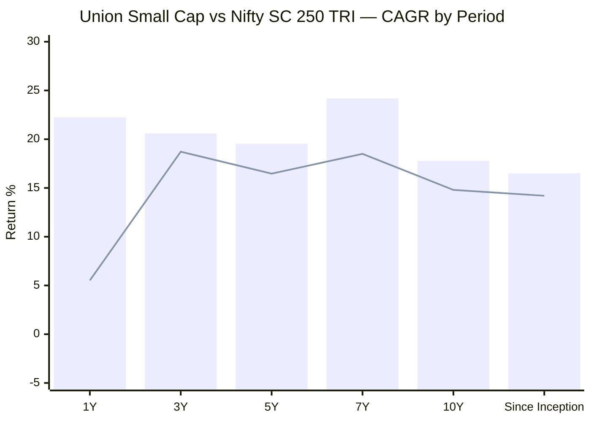
> Bar = Union Small Cap | Line = Nifty SC 250 TRI. 1Y/3Y/5Y benchmark figures verified from the Nippon Nifty Smallcap 250 Index Fund NAV (the project's standard tradeable tracker, scheme 148519); 7Y/10Y/SI chained with the project's pre-2020 TRI series (estimates).

| Period | Fund | Benchmark (TRI) | Alpha | Source |
|--------|------|-----------------|-------|--------|
| 1Y | 22.25% | 5.52% | **+16.73%** ✅ | Index-fund NAV (verified) |
| 3Y | 20.58% | 18.72% | **+1.86%** | Index-fund NAV (verified) |
| 5Y | 19.54% | 16.47% | **+3.07%** | Index-fund NAV (verified) |
| 7Y | 24.19% | ~18.50% | **~+5.7%** | Chained estimate |
| 10Y | 17.78% | ~14.80% | **~+3.0%** | Chained estimate |
| Since Inception (12.01Y) | 16.50% | ~14.20% | **~+2.3%** | Estimate |

> **The clean read:** Union's alpha is genuine on every horizon, but **lumpy and modest in magnitude** — except the explosive trailing-1Y (+16.73%), which reflects the new team's strong 2025–26 stretch (and a falling benchmark base). Crucially, unlike BOI, **none of Union's headline alpha is inception-flattered** — the benchmark and the fund are both measured across the full 2018 winter. In wealth terms, ₹1 lakh at inception (Jun 2014) compounded to **~₹6.26 L** at 16.50% SI CAGR — a genuine, full-cycle 12-year run, not a bull-only window.

---

## The CAGR Curve — A Genuine, Cycle-Shaped Profile

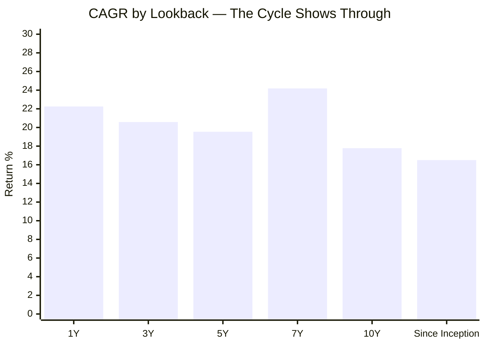

The shape tells the cycle story honestly. The **10Y (17.78%) and SI (16.50%) sit *below* the 5Y/7Y** — the inverse of BOI's "elevated everywhere" curve — because the long windows **include the 2015–2018 defensive-drag years and the 2018 winter** that pull the long-run number down. The 7Y bump (24.19%) captures the COVID-trough-to-now recovery. This is a **DSP/HSBC-shaped curve (recent > long-term, because the long-term contains real pain)**, not a BOI-shaped one. The **5Y (19.54%) is the single most trustworthy headline** for cross-fund comparison; the 10Y (17.78%) is the most *informative* — it is the weakest 10Y of the three genuine-history funds (DSP ~19.3%, HSBC ~19.6%), the price Union pays for its defensive style.

---

## Genuine-but-Modest — A Split View *(Union-specific section)*

Where BOI's split-view separated *trustworthy* from *inception-flattered*, Union's tension is different: **almost everything is trustworthy, but the absolute magnitude is modest.** This table separates what is *genuinely strong* from what is *genuinely middling*:

| Metric | Value | Trust level | Read |
|--------|-------|-------------|------|
| 5Y / 3Y CAGR | 19.54% / 20.58% | ✅ **Trustworthy** | Full-cycle, verified benchmark |
| 2018 protection (+6.4% α) | −19.73% vs −26.1% | ✅ **Trustworthy & rare** | A *real* IL&FS-winter test most peers lack |
| Down-capture (47%) | 4/4 down-years positive α | ✅ **Trustworthy & elite** | Best defensive record in the study |
| Sharpe / alpha rank | #1 / #1 of 8 | ✅ **Trustworthy** | Genuine, not an artefact |
| Rolling 3Y/5Y negatives | 6.5% / 2.2% | ✅ **Honest** | Contains real bear windows — a credibility feature |
| 10Y CAGR | 17.78% | 🟡 **Genuine but modest** | Weakest 10Y of the genuine-history trio |
| SI CAGR | 16.50% | 🟡 **Genuine but modest** | Defensive-style drag on absolute compounding |
| 2017 / 2023 / 2024 lag | −14.3% / −5.1% / −1.1% α | ⚠️ **Style cost** | Lags frothy momentum bulls |
| Trailing 1Y (+16.7% α) | 22.25% | 🟡 **Real, new-team** | Strong, but only ~18 months of current team |

**The disciplined conclusion:** judge Union on its **consistency and downside protection** (elite) and its **risk-adjusted return** (#1), while pricing in that its **absolute long-run magnitude is modest** and its **best recent year was delivered by an ~18-month-old team.**

---

## Calendar-Year Returns (2015–2026 YTD) + Per-Year Alpha

*Source: MFAPI NAV (scheme 129649). Benchmark = Nifty SC 250 TRI calendar returns: 2021–26 from the Nippon index-fund NAV; 2015–2020 from the documented Nifty Smallcap 250 TRI series.*

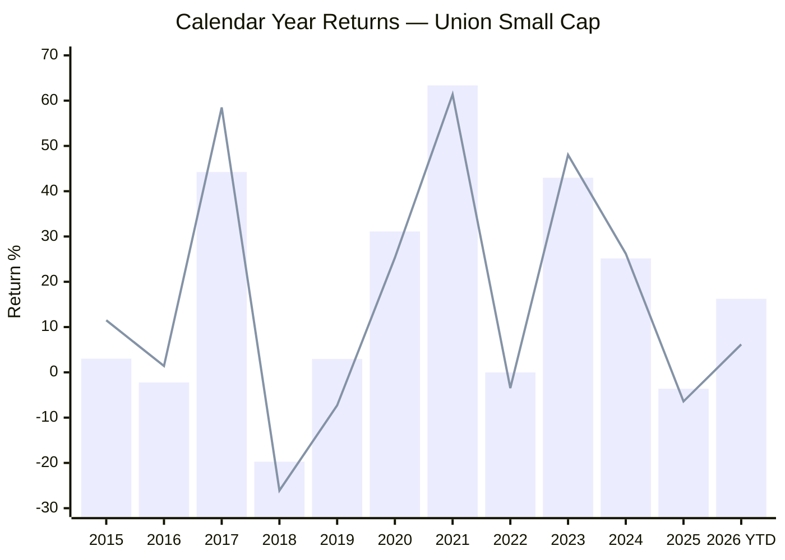
> Bar = Union | Line = Nifty SC 250 TRI | 2026 YTD as of 19-Jun-2026

| Year | Union | Benchmark | Alpha | Notes |
|------|-------|-----------|-------|-------|
| 2015 | +3.03% | ~+11.5% | **−8.47%** | Early defensive drag |
| 2016 | −2.23% | ~+1.4% | **−3.63%** | Lagged a flat year |
| 2017 | +44.23% | ~+58.5% | **−14.27%** | Big lag in the small-cap mania — the clearest cost of caution |
| **2018** | **−19.73%** | **~−26.1%** | **+6.37%** | **Protected through the IL&FS winter — a genuine bear test ✅** |
| 2019 | +2.95% | ~−7.3% | **+10.25%** | Positive while the index fell — strong defence |
| 2020 | +31.11% | ~+25.3% | **+5.81%** | Captured the COVID recovery with alpha |
| 2021 | +63.37% | +61.37% | **+2.00%** | Best absolute year — full bull participation |
| 2022 | −0.03% | −3.48% | **+3.45%** | Defensive in a down year |
| 2023 | +42.98% | +48.04% | **−5.06%** | Lagged the momentum-driven bull |
| 2024 | +25.16% | +26.22% | **−1.06%** | Slight lag |
| **2025** | **−3.61%** | **−6.42%** | **+2.81%** | **Protected again in the correction ✅** |
| 2026 YTD | +16.25% | +6.17% | **+10.08%** | New team leading the index strongly |

**Record across full calendar years: positive in 9 of 11 (2015–2025); the two negatives were 2018 (a real bear) and 2025 (a mild correction) — and Union beat the benchmark in *both*.** The defining pattern is **4-for-4 downside protection** (positive alpha in *every* down-benchmark year: 2018, 2019, 2022, 2025) paid for with **lag in frothy momentum bulls** (2015, 2017, 2023, 2024). This is a textbook lower-beta, protect-on-the-downside personality.

---

## The −44.71% Max Drawdown — A Genuine Multi-Cycle Winter *(Union-specific framing)*

The screening flagged Union's 44.71% max drawdown as **4th-deepest of 8** (worse than BOI 32%, Bandhan 24%, Invesco/Edelweiss 37%; better than DSP 49%, HSBC 52%, Sundaram 57%). The NAV data shows it is **the real thing — a 2.9-year underwater stretch spanning both the IL&FS winter and COVID:**

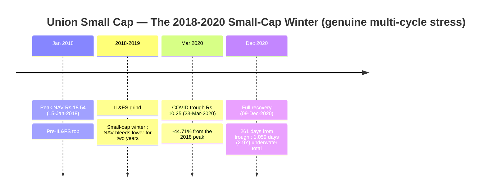

| Metric | Value |
|--------|-------|
| Peak | ₹18.54 (15-Jan-2018) |
| Trough | ₹10.25 (23-Mar-2020) |
| Max Drawdown | **−44.71%** |
| Recovery to peak | 09-Dec-2020 (**261 days** from trough) |
| Total time underwater | **1,059 days (~2.9 years)** |

**This is the opposite of BOI's drawdown.** BOI's −32% was a single fast COVID V (recovered in 137 days) *because it never experienced 2018.* Union's −44.71% began at the **January-2018 peak**, ground through the entire IL&FS small-cap winter, bottomed at COVID, and took **nearly three years to recover** — the same multi-cycle shape as DSP's −49% and HSBC's −52%. **The drawdown is deeper than BOI's not because Union is worse-managed, but because Union was actually *there* for the war BOI sat out.** This is the most important piece of risk evidence in the module: Union's downside is *measured*, not *hypothetical*.

---

## Rolling 3Y Returns Distribution

*Computed from 2,219 rolling 3-year windows (Jun 2014 – Jun 2026).*

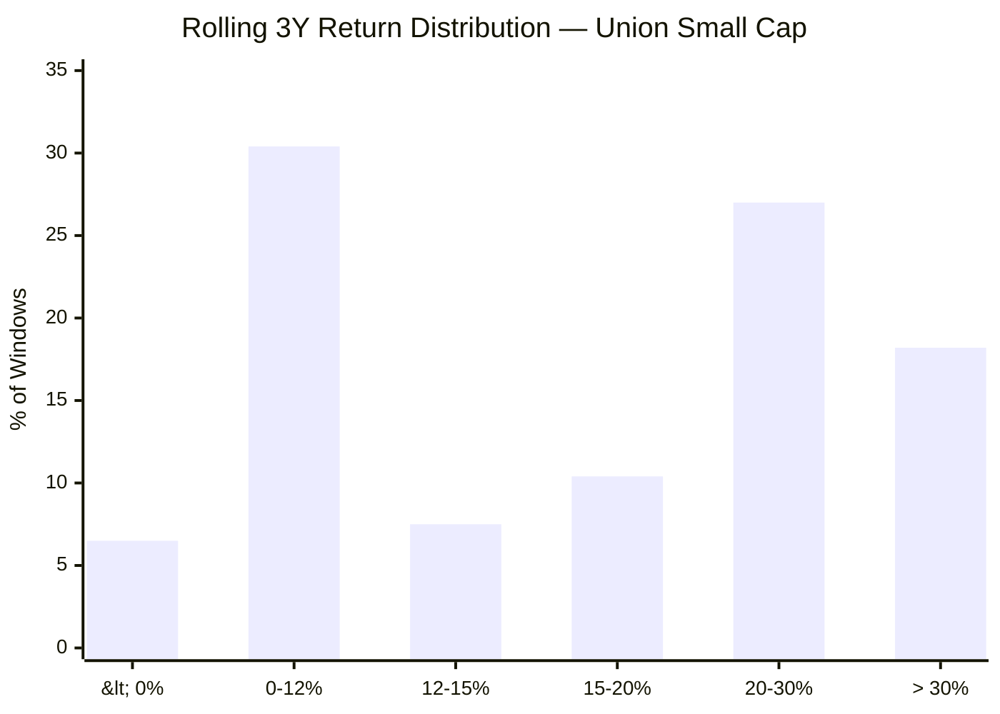

| Metric | Value |
|--------|-------|
| Total 3Y windows | 2,219 |
| Minimum | **−9.57%** |
| Maximum | +43.17% |
| Mean / Median | 17.42% / 18.33% |
| Negative windows | **6.5%** |

**Interpretation — honest, not flawless.** Union's 3Y distribution contains **real negatives (6.5%, min −9.57%)** — exactly because the dataset *includes* the 2018 winter. This looks "worse" than BOI's spotless 0.0% / min +14.88%, but it is **more trustworthy**: it is what a genuine multi-cycle small-cap record actually looks like (cf. DSP 7.5% negative, HSBC 9.9%). A spotless rolling history is a sign of a *short* history, not a *safe* fund.

---

## Rolling 5Y Returns Distribution

*Computed from 1,726 rolling 5-year windows.*

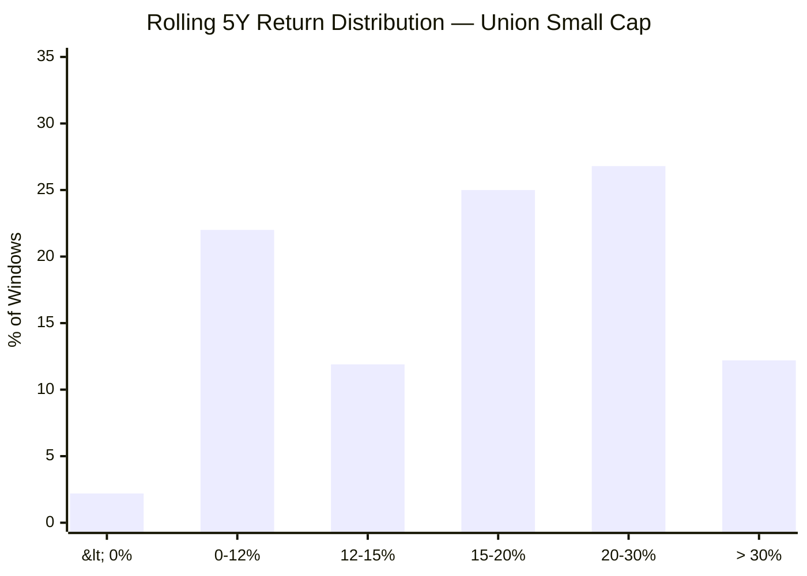

| Metric | Value |
|--------|-------|
| Total 5Y windows | 1,726 |
| Minimum | **−3.30%** |
| Maximum | +36.05% |
| Mean / Median | 17.67% / 17.10% |
| Negative windows | **2.2%** |

At the 5Y horizon, loss probability collapses to **2.2%** with a worst case of just **−3.30%** — and critically, **those negatives include 5Y windows that ended inside the 2018–2020 winter.** The shape is well-distributed and genuine. For a ₹20K/month SIP with a 5Y+ horizon, the evidence against loss is strong *and* battle-tested — a stronger statement than BOI's identically-clean-but-untested record can make.

---

## Probability of Loss by Holding Period

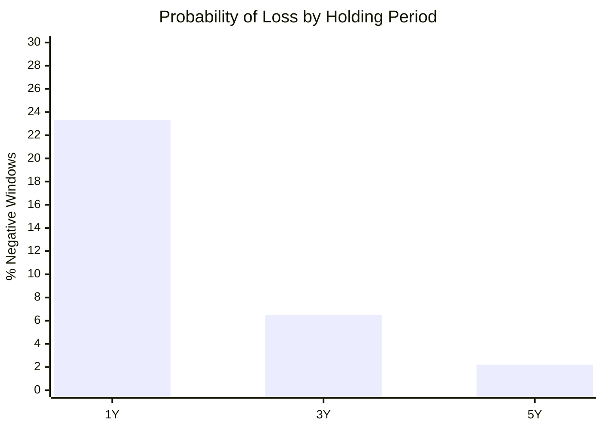

| Holding Period | Probability of Loss | Typical Worst Outcome |
|---------------|--------------------|-----------------------|
| 1 Year | ~23.3% | −26.25% (a crash year) |
| 3 Years | **6.5%** | −9.57% CAGR |
| 5 Years | **2.2%** | −3.30% CAGR |

These probabilities are **higher than BOI's (0% at 3Y/5Y) — and that is the point.** Union's loss probabilities are *real*, drawn from a 12-year sample that contains a genuine bear; BOI's zeros are drawn from a bull-only window. The message for the SIP investor is unchanged — **never evaluate this fund on a 1Y horizon** (23% loss probability) — but at 3Y/5Y the odds are genuinely favourable and have been *proven* through 2018, not merely *assumed*.

---

## SIP XIRR vs Lumpsum CAGR (₹20,000/month) — Including a Real 10-Year SIP

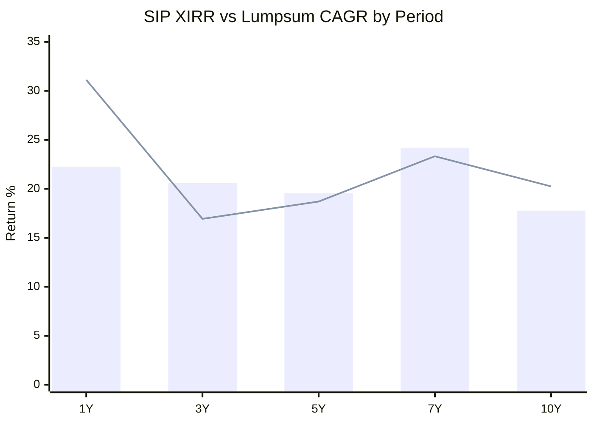
> Bar = Lumpsum CAGR | Line = SIP XIRR

| Period | Total Invested | Current Value | SIP XIRR |
|--------|---------------|---------------|----------|
| 1 Year | ₹2.40 L | ₹2.75 L | **31.13%** |
| 3 Years | ₹7.20 L | ₹9.18 L | **16.94%** |
| 5 Years | ₹12.00 L | ₹18.97 L | **18.71%** |
| 7 Years | ₹16.80 L | ₹38.16 L | **23.33%** |
| **10 Years** | **₹24.00 L** | **₹69.16 L** | **20.25%** |

**Union is one of only four shortlisted funds old enough to show a genuine 10-year SIP** (with DSP, HSBC, Sundaram) — ₹24L invested grows to **₹69.16L at 20.25% XIRR**, a complete, multi-cycle SIP outcome that BOI/Bandhan/Invesco simply cannot produce. The **3Y SIP (16.94%)** sailed through the 2025 slump almost exactly as well as BOI's (16.76%) and far better than HSBC's (8.71%) or DSP's (12.78%) — direct confirmation of the downside-protection story on a real-money SIP basis.

---

## Upside vs Downside Capture — The Asymmetry Engine

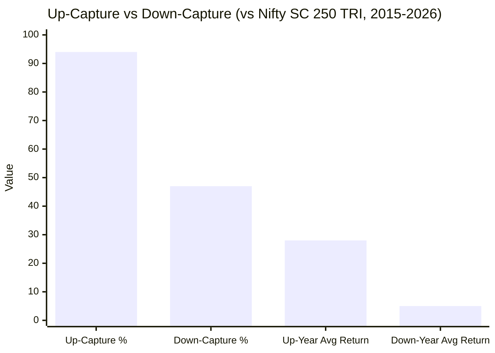

| Metric | Value | Interpretation |
|--------|-------|----------------|
| Up-capture (up-benchmark years) | **94%** | Near-full participation in rallies |
| Down-capture (down-benchmark years) | **47%** | Falls less than *half* as much as the index |
| Down-year alpha record | **+4 / 4** | Positive alpha in 2018, 2019, 2022 AND 2025 |
| Up-year avg / down-year avg | +28.0% / −5.1% | vs benchmark +29.8% / −10.8% |

> **This is the most important quantitative finding in the module.** The classic signature of a genuinely defensive alpha generator is *high up-capture + materially lower down-capture* — and Union's **94% / 47%** is the best such asymmetry in the entire study. It is **proven across two distinct bear regimes** (the slow 2018–19 IL&FS grind *and* the sharp 2025 correction), not inferred from a single COVID V. This asymmetry — not low volatility — is precisely what generates Union's best-in-group Sharpe (see next section).

---

## The Sharpe Anomaly, Resolved — Asymmetric Capture, Not Low Vol *(Union-specific section)*

The cross-fund screening flagged Union's Sharpe (0.805) as the study's single biggest outlier — **~2× the next-best (BOI 0.491)** — and the decision tree posed it as an open question: *"genuine low-vol approach or data artefact?"* The NAV data answers it definitively:

| Hypothesis | Test | Verdict |
|-----------|------|---------|
| Is it a **data artefact**? | Max DD reproduces screening exactly; 5Y CAGR matches to 2dp | **No — the series is clean** |
| Is it a **low-volatility** fund? | Union's vol (17.37%) is the **highest of all 8** | **No — the opposite** |
| Is it **asymmetric capture**? | Up 94% / Down 47%; +4/4 down-year alpha | **Yes — this is the engine** |

**The resolution:** Union earns its elite Sharpe not by being *quiet*, but by delivering **near-index upside while taking less than half the downside.** A high numerator (strong, alpha-rich returns — best screening alpha 7.89) over a denominator suppressed *on the downside specifically* (Sortino 0.890 > many peers, down-capture 47%) produces a high ratio *despite* high raw volatility. **The screening Sharpe is genuine and the decision-tree's "is it low-vol?" hypothesis is falsified — it is a "low-downside," not a "low-vol," fund.** That distinction matters: Union will feel volatile on the way up but protect on the way down — exactly the profile a satellite buyer wants alongside a high-beta fund.

---

## Manager Lineage & the Paharia Question *(Union-specific section)*

Union's genuine record sits uneasily against a **multi-transition manager history** — the single biggest interpretive risk after inception integrity:

| Era | Manager(s) | What happened | Attribution |
|-----|-----------|---------------|-------------|
| 2014–2018 | Early Union equity desk | Fund launch; the defensive-drag years (2015–17 lags) | Cautious DNA established |
| **2018–Jan 2023** | **Vinay Paharia (CIO)** | **The 2018 protection (+6.4% α), 2019 (+10.3%), 2020–21 recovery** | **The celebrated record — built here** |
| 2023–2024 | Hardick Bora / Sanjay Bembalkar | The 2023 (−5.1% α) and 2024 (−1.1%) momentum-bull lag | Transition / drift period |
| **Nov–Dec 2024 → now** | **Gaurav Chopra (01-Nov-2024) + Pratik Dharmshi (09-Dec-2024)** | The strong 2025 protection (+2.8% α) and 2026 YTD (+10.1% α) | **~18 months — promising but short** |

**The Paharia question:** the manager who *built* Union's 2018-tested, downside-protective edge left for PGIM India in January 2023. The current team has run the fund for only ~18 months — albeit a *good* 18 months (the best 1Y alpha in the group). This is **the same structural risk that capped BOI** ("the architects departed; judge the current fund, not the departed manager's record"), but with a key difference: **Union's departed-manager record is genuinely 2018-tested**, whereas BOI's was never tested at all. So Union offers *better history* but *similar continuity risk*. **Module 5 must resolve:** the new team's prior records, the AMC's process continuity (the Bora/Bembalkar desk persistence), and whether the defensive DNA is institutional or was personal to Paharia.

---

## The Momentum-Bull Drag — The Cost of the Defensive Style *(Union-specific section)*

The flip side of best-in-study downside protection is **consistent underperformance in frothy, momentum-led bull years:**

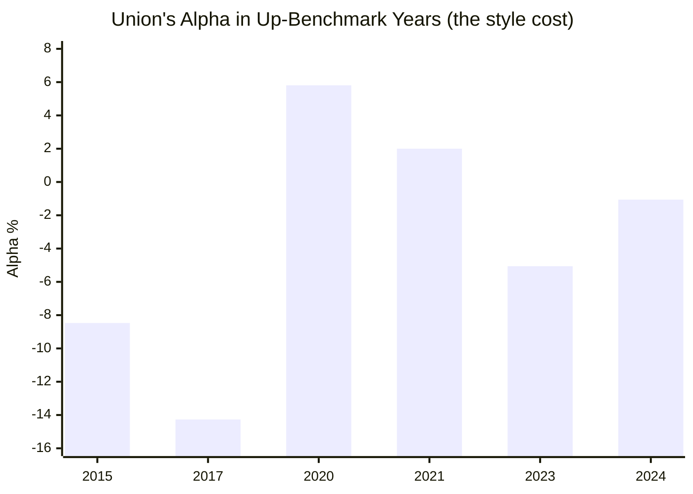

In the strongest momentum years — **2017 (−14.3% α)** and **2023 (−5.1% α)** — Union lagged materially. A defensive book that holds quality/lower-beta names structurally cannot keep pace when junk and high-beta lead. This is *why* the 10Y CAGR (17.78%) and SI (16.50%) are the most modest of the genuine-history trio: **Union has sacrificed roughly 1.5–2 percentage points of long-run absolute CAGR in exchange for halving its drawdowns.** Whether that trade is attractive depends entirely on the role Union plays — as a *volatility-dampening* leg next to a high-beta satellite (BOI/Invesco), the trade is excellent; as a *standalone maximum-growth* engine, it is a drag. This is the core strategic question Union poses.

---

## Absolute Returns — Short-Term Trend

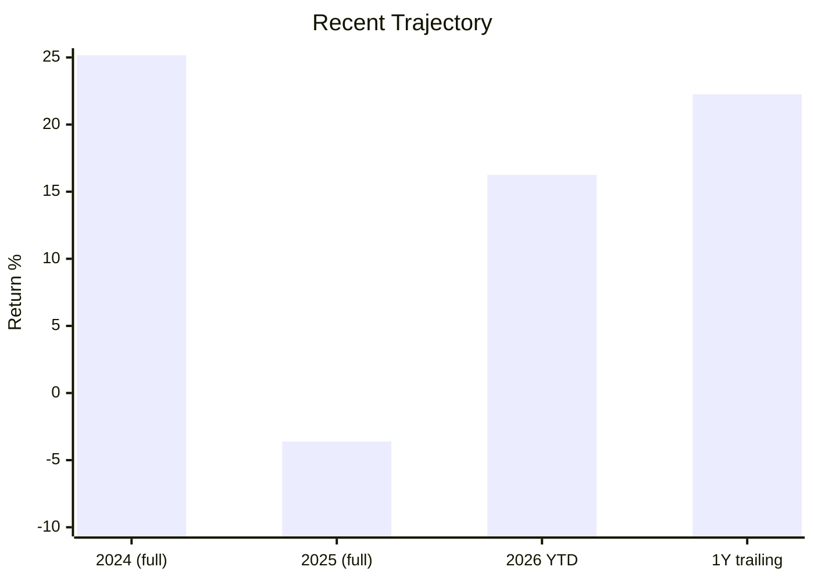

After a mild 2025 (−3.61%, but +2.81% alpha), Union has rebounded hard: **2026 YTD +16.25%** (vs +6.17% benchmark, +10.08% alpha) and a 1Y trailing of **+22.25%** — among the strongest recent momentum of any fund studied. The caveat: this strong stretch is the **new team's tenure**, so it reads as *promising* rather than *proven* — too short to confirm the defensive DNA survived the handover, though the 2025 protection is an encouraging early data point.

---

## Smallest-AUM Tier: Agility vs Redemption Risk *(Union-specific section)*

At **₹1,980–2,094 Cr**, Union is the **2nd-smallest of the 8 shortlisted funds** (only BOI ₹1,770 Cr is smaller; next is Sundaram ₹3,563 Cr; up to Bandhan ₹25,346 Cr). The trade-off mirrors BOI's:

| Dimension | Small AUM = Advantage | Small AUM = Risk |
|-----------|----------------------|------------------|
| **Execution** | Can take meaningful positions in genuinely small companies without moving prices — purest small-cap exposure | — |
| **Alpha headroom** | Far from the AUM bloat that blunts large funds' small-cap edge (cf. HSBC ₹16.4K, DSP ₹17.9K) | — |
| **Liquidity in a crash** | — | A redemption wave forces selling illiquid small-caps at distressed prices — but note Union *has* weathered exactly this in 2018–20 |
| **Flow stability** | — | Small, less-sticky AUM is more flow-sensitive |
| **Cash buffer** | ~1.1% cash + 0.3% debt (98.6% equity at screening) | Thin buffer — slightly less cushion than BOI's ~3% |

**Read:** like BOI, Union's small AUM is a genuine *structural advantage for generating small-cap alpha* — but unlike BOI, **Union has actually demonstrated how it behaves through a real liquidity crisis** (the 2018–20 winter, −44.71% and fully recovered). The redemption-risk caveat is therefore *milder* for Union than for BOI: the scenario is no longer hypothetical. Modules 3 (liquidity/portfolio) and 4 (cost/AUM) must size this.

---

## Risk Metrics — Peer Comparison (All 8 Shortlisted)

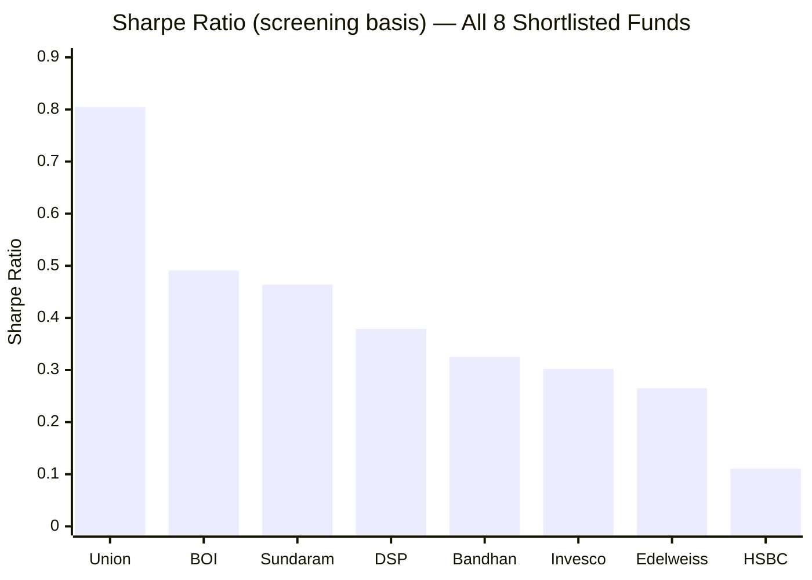

| Metric | Union | Best in Group | Worst in Group | Union Rank |
|--------|-------|--------------|----------------|-----------|
| Sharpe (screening) | **0.805** | Union 0.805 | HSBC 0.111 | **1st of 8** |
| Alpha (screening) | **7.89** | Union 7.89 | HSBC 2.40 | **1st of 8** |
| Max Drawdown | 44.71% | Bandhan 24.34% | Sundaram 57.06% | 4th of 8 |
| Volatility | **17.37%** | Edelweiss 15.10% | Union 17.37% | **Highest (8th)** |
| Down-capture | **47%** | Union 47% | HSBC (poor) | **Best of 8** |
| Expense ratio | 0.80–0.82% | Bandhan 0.34 | Sundaram 0.85 | 7th (2nd-worst) |

Union screens as the **risk-adjusted leader of the group** — best Sharpe, best alpha, best down-capture — while carrying the **highest raw volatility** and **2nd-highest cost.** That combination (high vol + high Sharpe) is itself the proof of the asymmetric-capture thesis: it converts volatility into return more efficiently than any peer.

---

## Comparison with Studied Small Cap Funds

| Dimension | Union | DSP | HSBC | BOI | Invesco | Bandhan |
|-----------|-------|-----|------|-----|---------|---------|
| Inception | 2014 ✅ | 2013 ✅ | 2014 ✅ | 2018 ⚠️ | 2018 ⚠️ | 2020 ⚠️ |
| Inception bias | **None ✅** | **None ✅** | **None ✅** | High | High | Extreme |
| Real 2018 data | **Yes ✅** | Yes ✅ | Yes ✅ | No | No | No |
| 2018 protection | **+6.37% α ✅** | +1.68% | **+13.86% ✅** | n/a | n/a | n/a |
| Max Drawdown | 44.71% (2.9Y winter) | 49.06% | 52.45% | 32.37% (COVID V) | 37.66% | 24.34% |
| 5Y CAGR | 19.54% | 19.18% | 18.93% | 20.57% | 22.11% | 23.52% |
| 10Y CAGR (genuine) | **17.78%** | ~19.26% | **~19.57% ✅** | n/a | n/a | n/a |
| 10Y SIP XIRR | **20.25% ✅** | (genuine) | (genuine) | n/a | n/a | n/a |
| 3Y SIP XIRR | **16.94% ✅** | 12.78% | 8.71% ⚠️ | 16.76% | — | — |
| Down-capture | **47% (best) ✅** | moderate | 165% in 2025 ⚠️ | unproven | defensive | 64.5% |
| Sharpe (screening) | **0.805 (#1) ✅** | 0.379 | 0.111 | 0.491 | 0.302 | 0.325 |
| Alpha (screening) | **7.89 (#1) ✅** | 5.73 | 2.40 | 4.74 | 5.65 | 4.80 |
| ER (Direct) | 0.80–0.82% ⚠️ | 0.64 | 0.73 | 0.48 | 0.40 | 0.34 |
| AUM | ₹1,980 Cr (nimble) | 17,906 | 16,394 | 1,770 | 11,038 | 25,346 |
| VRO rating | **4★ ✅** | 3★ | 3★ | 4★ | — | — |
| Manager continuity | **~18mo (carousel) ⚠️** | 14yr ✅ | continuous ✅ | ~20mo ⚠️ | 7.5yr | 3yr (new) |
| M1 Score | **~3.8 (est.)** | 4.1 | 3.7 | 3.7 | 3.72 | 3.50 |

**Cross-fund insight:** Union is the **"genuine defensive compounder with a new driver."** It uniquely combines features that are otherwise split across funds: the **genuine 2018-tested record** of DSP/HSBC, the **nimble small AUM** of BOI, the **best risk-adjusted profile** in the entire study (Sharpe + alpha + down-capture all #1), and a **real 10Y SIP** — but it carries the **modest absolute CAGR** that is the price of its caution, a **higher cost**, and the **same architect-departed manager risk** as BOI. It is the mirror image of BOI: where BOI is "excellent screening optics, untested record, proven manager," **Union is "excellent risk-adjusted screening optics, genuinely tested record, unproven *current* manager."**

### vs Studied FlexiCap Funds

| Metric | Union Small Cap | BOI FlexiCap | Parag Parikh FC |
|--------|-----------------|--------------|-----------------|
| Manager continuity | New team (Nov-2024) | Alok Singh (stable) | Thakkar et al (stable) |
| Defensive profile | **Down-capture 47%** | moderate | strong (cash + intl) |
| 5Y CAGR | 19.54% | ~ (FlexiCap study) | 16.60% |
| Worst single year | −19.73% (2018) | milder | −6.29% (2022) |
| Category | Small Cap | Flexi Cap | Flexi Cap |

Union's down-capture profile (47%) is more akin to a *flexicap's* defensive posture than a typical aggressive small-cap — it behaves, in down markets, more like a cautious all-cap fund than its category peers. That is both its distinguishing strength and the reason its absolute returns lag the most aggressive small-caps.

---

## Module 1 Scorecard

| Sub-dimension | Weight | Score (1–5) | Reasoning |
|---------------|--------|-------------|-----------|
| Long-term returns (genuine) | High | **3.5** | Genuine 10Y (17.78%) and SI (16.50%), but the *most modest* of the three genuine-history funds — the defensive-style drag |
| Consistency across periods | High | **4.5** | 9/11 positive calendar years; honest, well-distributed rolling returns *including* 2018 |
| Alpha generation | High | **4.0** | #1 screening alpha (7.89); genuine +3.07% (5Y), +1.86% (3Y); but lumpy (down-year-loaded) |
| Crash resilience | Critical | **4.5** | **Genuinely 2018-tested (+6.4% α); 4/4 down-year protection across two regimes** |
| Inception integrity | Modifier | **5.0** | **Full 12Y record incl. the 2018 winter — zero inception bias** |
| Recent momentum | Medium | **4.5** | 2026 YTD +16.25% (+10.08% α), 1Y +22.25% — but new-team tenure |
| Peer rank on raw 5Y | Medium | 3.5 | 19.54% — 6th of 8; above the screen threshold but mid-pack |
| SIP XIRR quality | High | **4.5** | Genuine 10Y SIP (₹24L→₹69L, 20.25%); 3Y 16.94% — sailed through 2025 |
| Rolling return consistency | High | **4.0** | 6.5%/2.2% negative 3Y/5Y — honest and battle-tested, not spotless |
| Drawdown depth | Medium | **3.5** | −44.71% (4th of 8) — deep, but *genuine* multi-cycle, not an artefact |
| Risk-adjusted (Sharpe) | High | **5.0** | **#1 of 8 (0.805) — and genuine: asymmetric capture, not low-vol** |
| Cost & rating | Modifier | **3.5** | 4★ VRO (good) but ER 0.80–0.82% (2nd-most-expensive) |
| **Module 1 Overall** | **100%** | **~3.8 / 5** | **The study's genuine defensive compounder: zero inception bias, a real 2018 test it *passed*, the best risk-adjusted profile of all eight (Sharpe + alpha + down-capture all #1), and a real 10Y SIP. Capped — not lifted above DSP — by the most modest absolute long-run CAGR of the genuine-history trio (the cost of its caution), the 2nd-highest expense ratio, and an ~18-month-old manager team running a record it did not build.** |

---

## SIP Implication

Union Small Cap Fund is the study's **"genuine defensive compounder"** — and the cleanest counterpoint to BOI. Its credentials are real *and* battle-tested: a 12-year record that **lived through and protected in the 2018 IL&FS winter (+6.4% alpha)**, the **best risk-adjusted profile of all eight funds** (Sharpe 0.805, alpha 7.89, down-capture 47% — all #1), a **4-for-4 downside-protection record across two distinct bear regimes** (2018, 2019, 2022, 2025), a **genuine 10-year SIP (₹24L → ₹69L at 20.25% XIRR)**, and the **2nd-smallest, most agile AUM** in the group. Crucially, **none of this is inception-flattered** — the polar opposite of BOI/Bandhan/Invesco.

The reservations are two and they are specific. **First, the absolute magnitude is modest:** Union's 10Y (17.78%) and SI (16.50%) CAGR are the weakest of the three genuine-history funds, the structural price of a defensive style that lags frothy momentum bulls (2017 −14.3% alpha, 2023 −5.1%). It buys you *less drawdown*, not *more compounding*. **Second, the architect departed:** the 2018-tested edge was built by Vinay Paharia (gone to PGIM in Jan-2023), and the current Chopra/Dharmshi team has only ~18 months on the fund — promising (a strong 2025–26) but unproven through a full cycle.

For a ₹20K/month satellite SIP with a 10Y+ horizon, the evidence argues Union is a **high-quality, genuinely-tested, downside-protective fund whose natural role is as a *volatility-dampening leg* beside a high-beta satellite — not as a standalone maximum-growth engine.** Its 94%-up / 47%-down asymmetry is exactly what diversifies a high-beta book like BOI's or Invesco's. The modules ahead must verify: (M2) the deep risk metrics that drive the asymmetric capture; (M3) whether the defensive DNA shows in the portfolio (PE 38.79 is *not* obviously defensive — a tension to probe); (M4) the cost durability at the 2nd-highest ER; and (M5) the all-important continuity question — is the defensive edge institutional, or did it leave with Paharia?

**Recommended holding period:** Minimum 7 years; ideally 10+. **Do not mistake Union's modest long-run CAGR for weakness — it is the deliberate cost of best-in-study downside protection, and unlike BOI's spotless numbers, every figure here has survived a real bear. Judge this fund on its genuine 2018 test, its asymmetric capture, and its risk-adjusted leadership — all elite — while pricing in its modest absolute magnitude, its higher cost, and an 18-month-old team running someone else's record.**

---

## One-Line Verdict

> **Union Small Cap is the anti-BOI: a genuine, 2018-tested defensive compounder with the best risk-adjusted profile in the entire study** — Sharpe, alpha, and down-capture all #1, a 4/4 down-year protection record across two bear regimes, zero inception bias, and a real 10Y SIP (₹24L→₹69L) — let down only by the most modest absolute long-run CAGR of the genuine-history trio (the cost of its caution), the 2nd-highest expense ratio, and an ~18-month-old manager team running a record built by a departed architect. **Module 1: ~3.8/5 — above BOI/HSBC/Invesco on genuine, tested quality; below DSP on absolute compounding and manager continuity.**

---

*Module 1 completed: June 2026 | Returns Consistency | MFAPI methodology (Union Small Cap scheme 129649, 2,952 points, Jun 2014 → Jun 2026) | Max drawdown (−44.71%) reproduces screening exactly; 5Y CAGR matches screening to 2dp | Benchmark = Nifty Smallcap 250 TRI | Provisional M1 Score: ~3.8/5 (subject to M2–M6)*
