# Module 2: Risk Profile — Union Small Cap Fund

*Sources: MFAPI NAV history — Union Small Cap Fund Direct Growth (Scheme 129649, ISIN INF582M01BU9, 17-Jun-2014 → 19-Jun-2026), 2,952 trading days | Benchmark daily series = Nippon India Nifty Smallcap 250 Index Fund Direct (Scheme 148519, from 19-Oct-2020) for beta/R²/alpha/IR | Tickertape | Value Research Online | Screening CSV (May 2026). Benchmark = Nifty Smallcap 250 TRI (the fund's actual mandate benchmark AND the project-wide standard).*

---

## Raw Data (Compiled Across Sources)

| Metric | Value | Source |
|--------|-------|--------|
| Volatility (Tickertape / screening, 5Y) | **17.37%** | Screening CSV — **highest of 8** |
| Volatility (MFAPI daily, full 12.0Y) | 17.25% | MFAPI computed |
| Volatility (MFAPI daily, 5Y) | 17.40% | MFAPI computed |
| Volatility (MFAPI daily, 3Y) | 18.58% | MFAPI computed |
| Max Drawdown | **−44.71%** | Screening / MFAPI verified (**exact match**) |
| Drawdown peak | ₹18.54 (15-Jan-2018) | MFAPI computed |
| Drawdown trough | ₹10.25 (23-Mar-2020) | MFAPI computed |
| Peak-to-trough duration | **798 days** (15-Jan-2018 → 23-Mar-2020) | MFAPI computed |
| Trough-to-recovery duration | **261 days** (23-Mar-2020 → 09-Dec-2020) | MFAPI computed |
| Total underwater duration | **1,059 days (~2.9 years)** | MFAPI computed |
| Sharpe (screening, May-26) | **0.805** | Screening — **best of 8** |
| Sharpe (MFAPI computed, 3Y) | 0.683 | MFAPI (rf 6.5%, daily × √252) |
| Sharpe (MFAPI computed, 5Y) | 0.678 | MFAPI |
| Sortino (screening) | 0.082 ⚠️ | Screening (low-freq artefact) |
| Sortino (MFAPI computed, 3Y) | **0.911** | MFAPI |
| Sortino (MFAPI computed, 5Y) | 0.902 | MFAPI |
| Alpha (screening) | **7.89** | Screening — **best of 8** |
| Jensen Alpha (computed, 3Y) | **+2.31%** | MFAPI vs index fund (conservative — see note) |
| Jensen Alpha (computed, ~5.7Y) | +3.47% | MFAPI vs index fund |
| Beta (computed, 3Y / ~5.7Y) | **0.924 / 0.862** | MFAPI vs index fund |
| R-Squared (computed, 3Y / ~5.7Y) | **90.62 / 88.01** | MFAPI vs index fund |
| Tracking Error (computed, 3Y / ~5.7Y) | **5.88% / 6.47%** | MFAPI vs index fund |
| Information Ratio (computed, 3Y / ~5.7Y) | **+0.250 / +0.192** | MFAPI vs index fund |
| Calmar Ratio (3Y / 5Y / SI) | 0.457 / **0.437** / 0.369 | Computed |
| Downside Deviation (ann, MAR=0, full) | 11.90% | MFAPI computed |
| Semi-Deviation (below mean, full) | 13.57% | MFAPI computed |
| VaR (95%, daily) | −1.72% | MFAPI computed |
| VaR (95%, annualized proxy) | −27.2% | MFAPI computed |
| Up-capture / Down-capture (calendar) | **94% / 47%** | Computed (Module 1) — **best down-capture of 8** |
| Portfolio PE | **38.79** | Screening — above category |
| Category Avg PE | 31.60 | Screening |
| ATH NAV | **₹62.94 (19-Jun-2026)** | MFAPI — fund is AT its ATH |
| % from ATH | **0.00%** | MFAPI — joint-best in study (with BOI) |
| Days since ATH | **0** | MFAPI |
| Worst Single Day | **−12.39%** (23-Mar-2020) | MFAPI (COVID trough) |
| Best Single Day | **+5.24%** (14-Sep-2020) | MFAPI |
| Days down >2% | **107** | MFAPI (2,951 return-days) |
| Days up >2% | **68** | MFAPI |
| Positive days | 1,674 / 2,951 (56.7%) | MFAPI |
| SEBI Risk Category | Very High | Universal for small cap equity |
| VRO Star Rating | **4 ★** | Value Research |

> **Note on the conservative Jensen alpha / IR.** The benchmark *daily* series (Nippon index fund) only begins 19-Oct-2020 — so the computed beta/alpha/IR cover **only Union's post-2020 window, which is precisely its *weakest* relative era** (the 2023–24 momentum bulls it lagged) and **exclude its biggest alpha years (2018 +6.4%, 2019 +10.3%).** This is the *mirror image* of BOI, whose IR was *flattered* by a window that excluded 2018. Union's true full-cycle active value is therefore *better* than the +0.25 IR / +2.31% alpha shown here. The screening alpha (7.89, category-relative, recent-weighted) sits at the optimistic end; the honest reading is somewhere between. See **The IR Paradox** section below.

---

## The Module 2 Tension — Genuinely Tested *and* Elite

Union Small Cap's Module 2 is the **exact inverse of BOI's** — and the most quietly remarkable risk profile in the study. Where BOI's tension was *"elite metrics, untested downside,"* Union's is *"genuinely tested downside, and the metrics are still elite."* Two stories are simultaneously true, and unusually, they *reinforce* rather than contradict each other:

**Story A — The genuinely battle-tested fund (the data measures real crises, not a single shock):**
- The NAV series begins **17-Jun-2014** — Union **lived through the entire 2018–2020 IL&FS small-cap winter as a real fund**, the slow, sentiment-driven bear that BOI/Bandhan/Invesco structurally never faced
- Its deepest-ever drawdown (**−44.71%**) is that genuine winter — a **2.9-year underwater grind** (Jan-2018 peak → COVID trough → Dec-2020 recovery), not a fast COVID V
- The rolling/capture/drawdown numbers describe a fund that **has been to the war and come back to new highs** — they are *honest*, not flattered by a missing crisis

**Story B — And the risk-adjusted metrics are still the best in the shortlist:**
- **Best screening Sharpe (0.805) and best alpha (7.89) of all 8 funds** — roughly 2× the next-best Sharpe
- **Best calendar-year down-capture in the study (47%)** — falls less than half as much as the index in down years, with positive alpha in *all four* down-benchmark years (2018, 2019, 2022, 2025)
- **At its all-time high** (0.00% from ATH, 0 days underwater) — a peak *won after a real winter*, not a sprint
- Sensible beta (0.92), healthy active share (R² 90.6, not an index-hugger), positive Jensen alpha

**The reconciliation:** BOI's elite numbers came *with* an asterisk (untested); Union's elite numbers come *without* one (tested). The only genuine reservations are **(1) the highest raw volatility of the eight**, **(2) a modest Calmar/IR** — the honest arithmetic of a deep, real drawdown denominator and a lumpy, down-year-loaded alpha — and **(3) the M1 overhang that this tested record was built by the *departed* Vinay Paharia**, while the current ~18-month team has not yet been risk-tested through a bear. Module 2 can document a risk profile that is, uniquely, both genuine *and* best-in-class; Module 5 must address whose hands hold it now.

---

## ⭐ At the All-Time High — A Peak *Won After a Real Winter* *(Union-specific)*

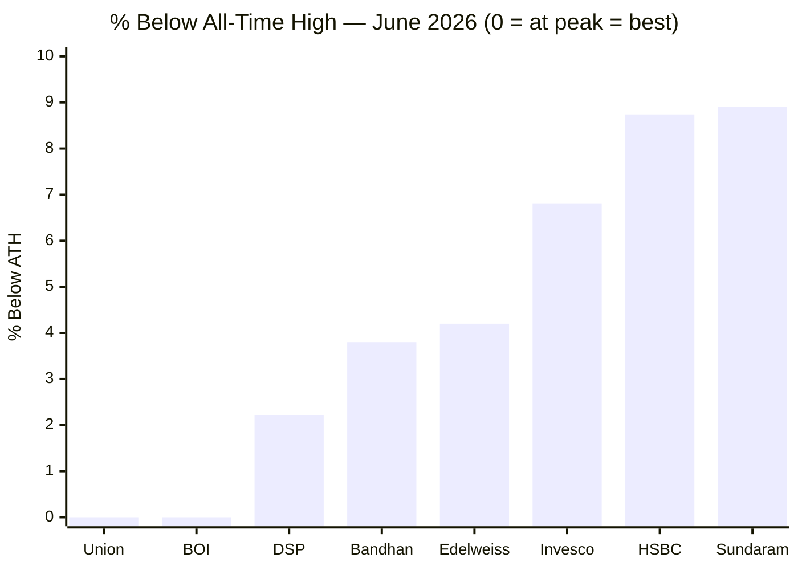
```mermaid
xychart-beta
    title "% Below All-Time High — June 2026 (0 = at peak = best)"
    x-axis ["Union", "BOI", "DSP", "Bandhan", "Edelweiss", "Invesco", "HSBC", "Sundaram"]
    y-axis "% Below ATH" 0 --> 10
    bar [0.00, 0.00, 2.22, 3.80, 4.20, 6.80, 8.74, 8.90]
```
> Union is AT its all-time high (NAV ₹62.94, 19-Jun-2026) — note this is *newer* than the screening's −2.10% (May-2026); the fund has since printed fresh highs.

| Metric | Union | BOI | DSP | HSBC |
|--------|-------|-----|-----|------|
| ATH NAV | **₹62.94** | ₹58.59 | ₹231.299 | ₹101.659 |
| ATH Date | **19-Jun-2026 (today)** | 12-Jun-2026 | 07-May-2026 | 11-Dec-2024 |
| % from ATH | **0.00%** | 0.00% | −2.22% | −8.74% |
| Days since ATH | **0** | 0 | 14 | 548 |
| Peak won *after a genuine 2018 winter?* | **YES ✅** | No (COVID-only) | YES ✅ | YES ✅ |

**Union and BOI are the only two studied funds at their exact all-time high — but the two peaks are not equivalent.** BOI's ATH was reached having only ever climbed out of a single fast COVID V. **Union's ATH was reached after surviving and fully recovering from a real 2.9-year small-cap winter (−44.71%).** Both readings confirm a fully-healed portfolio with no impaired holdings and no discount on entry — but Union's is the *more meaningful* health signal, because it proves the recovery machinery works through a *grinding* bear, not just a sharp one. For a June-2026 SIP investor, Union offers a full-valuation entry (no discount) on a portfolio that has demonstrably round-tripped a genuine crisis.

---

## Volatility — The Highest of the Eight, but *Productive*

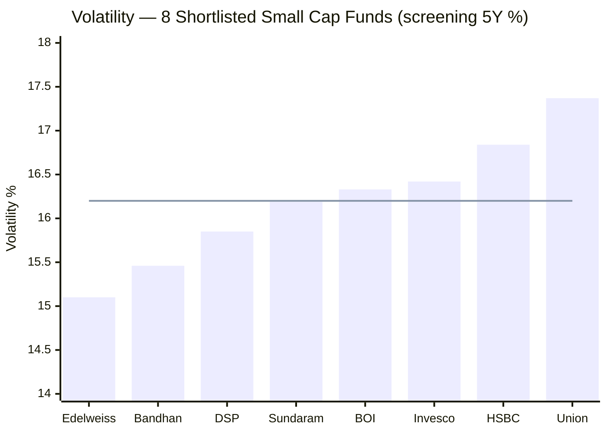
```mermaid
xychart-beta
    title "Volatility — 8 Shortlisted Small Cap Funds (screening 5Y %)"
    x-axis ["Edelweiss", "Bandhan", "DSP", "Sundaram", "BOI", "Invesco", "HSBC", "Union"]
    y-axis "Volatility %" 14 --> 18
    bar [15.10, 15.46, 15.85, 16.19, 16.33, 16.42, 16.84, 17.37]
    line [16.20, 16.20, 16.20, 16.20, 16.20, 16.20, 16.20, 16.20]
```
> Bar = screening 5Y volatility | Line = 8-fund average (~16.20%) | **Union = 8th of 8 (highest)**

### Cross-Source Volatility Reconciliation

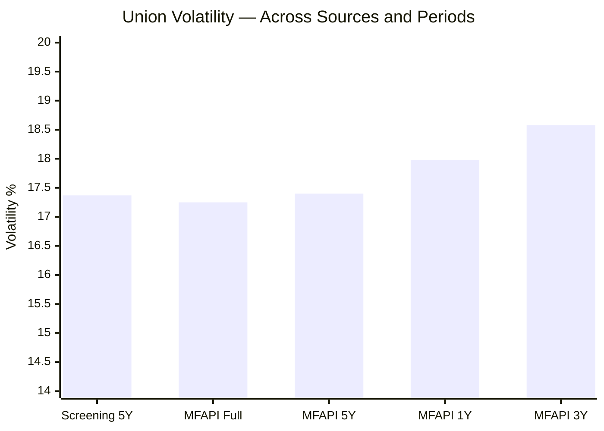
```mermaid
xychart-beta
    title "Union Volatility — Across Sources and Periods"
    x-axis ["Screening 5Y", "MFAPI Full", "MFAPI 5Y", "MFAPI 1Y", "MFAPI 3Y"]
    y-axis "Volatility %" 14 --> 20
    bar [17.37, 17.25, 17.40, 17.98, 18.58]
```

| Source | Value | Period | Methodology |
|--------|-------|--------|-------------|
| Screening CSV | **17.37%** | 5Y | Low-frequency sampling |
| MFAPI daily (computed) | **17.25%** | Full (12.0Y) | Daily returns × √252 — most complete window |
| MFAPI daily (computed) | **17.40%** | 5Y | Daily |
| MFAPI daily (computed) | 17.98% | 1Y | Recent |
| MFAPI daily (computed) | **18.58%** | 3Y | Most recent — reflects elevated 2024–26 vol |

Unusually, the screening figure (17.37%) and the full-history daily figure (17.25%) **agree almost exactly** — there is no large low-frequency understatement here. The direction matches peers: the **3Y window (18.58%) is choppier than the full history**, reflecting elevated 2024–2026 markets. **Union's defining volatility fact is simply that it is the highest of the eight** — yet it carries the *best* Sharpe, which is the whole story: the volatility is *productive* (upside-skewed at the annual level), not destructive.

### Annual Volatility Regime (MFAPI Computed)

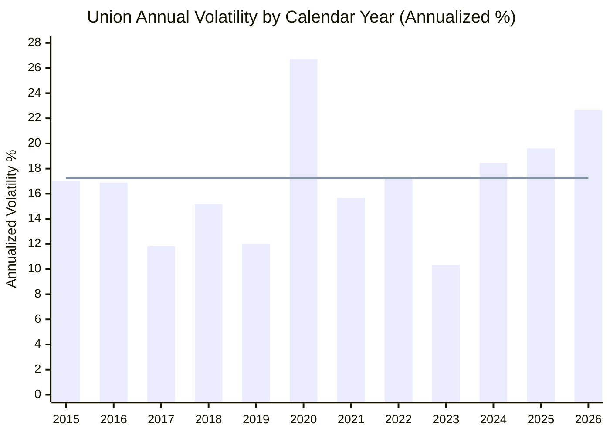
```mermaid
xychart-beta
    title "Union Annual Volatility by Calendar Year (Annualized %)"
    x-axis ["2015","2016","2017","2018","2019","2020","2021","2022","2023","2024","2025","2026"]
    y-axis "Annualized Volatility %" 0 --> 28
    bar [17.02, 16.89, 11.83, 15.16, 12.04, 26.71, 15.65, 17.32, 10.33, 18.46, 19.61, 22.63]
    line [17.25, 17.25, 17.25, 17.25, 17.25, 17.25, 17.25, 17.25, 17.25, 17.25, 17.25, 17.25]
```
> Line = full-history mean annualized volatility (17.25%) | 2026 = YTD only

| Year | Ann. Vol | Context |
|------|----------|---------|
| 2017 | **11.83%** | Calm pre-IL&FS bull |
| **2018** | **15.16%** | The IL&FS winter — *contained* vol despite −19.7% return (low-beta defence) |
| 2019 | **12.04%** | Calm — protected while the index fell |
| **2020** | **26.71%** | COVID — highest in fund history |
| **2023** | **10.33%** | Calmest year in fund history — steady (lagging) rally |
| 2024 | 18.46% | Late-year drawdown setup |
| 2025 | 19.61% | Elevated — the correction year |
| **2026 YTD** | **22.63%** | Elevated, but resolved into a new ATH |

**The structural insight:** like its peers, Union's only extreme-vol year was 2020 (COVID, 26.71%). The standout feature is **2018 (15.16%) and 2019 (12.04%) — Union held *below-average* volatility through the IL&FS winter** while delivering positive alpha (+6.4%, +10.3%). That is the volatility fingerprint of a genuinely defensive book: it did not just *return* better in the bear, it was *calmer* in it. The recent 2025/2026 elevation (19.6% / 22.6%) mirrors every peer's choppy recent markets — but, like BOI, Union's resolved *upward* into a new all-time high.

---

## Max Drawdown — Deep, Genuine, and Fully Recovered

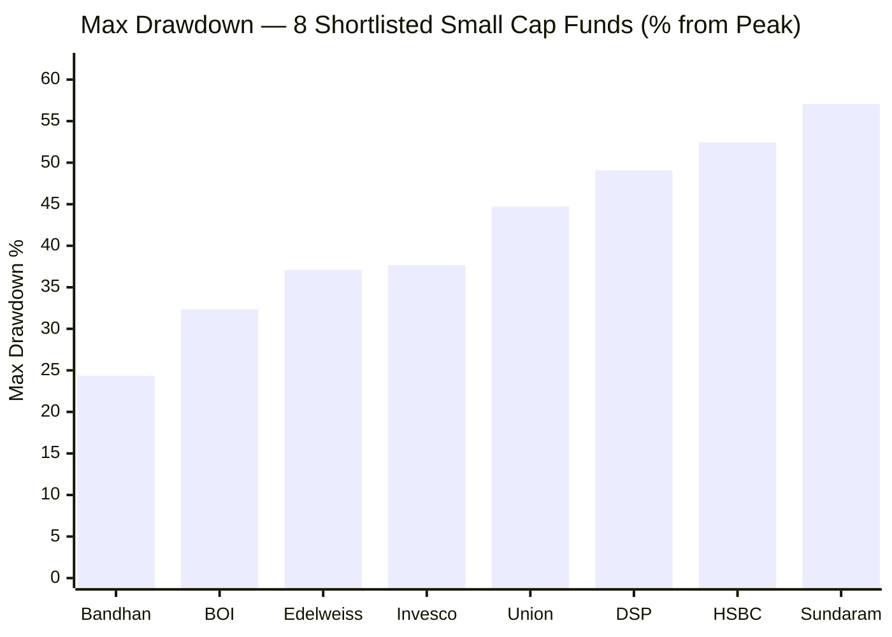
```mermaid
xychart-beta
    title "Max Drawdown — 8 Shortlisted Small Cap Funds (% from Peak)"
    x-axis ["Bandhan", "BOI", "Edelweiss", "Invesco", "Union", "DSP", "HSBC", "Sundaram"]
    y-axis "Max Drawdown %" 0 --> 62
    bar [24.34, 32.37, 37.09, 37.66, 44.71, 49.06, 52.45, 57.06]
```
> Sorted best to worst | Union = 5th-deepest of 8 | Lower % = better — but *context* matters more than depth

| Rank | Fund | Max DD | History | Crisis Context | ₹1L at trough |
|------|------|--------|---------|---------------|---------------|
| 1 (best) | Bandhan | −24.34% | Short; post-2018 | Single correction (untested) | ₹75,660 |
| 2 | BOI | −32.37% | Short; post-2018 | COVID-only (fast V) | ₹67,630 |
| 3 | Edelweiss | −37.09% | Short; post-2018 | Single cycle | ₹62,910 |
| 4 | Invesco | −37.66% | Short; post-2018 | Single cycle | ₹62,340 |
| **5** | **Union** | **−44.71%** | **Full (12Y); IL&FS + COVID** | **Genuine 2.9Y winter** | **₹55,290** |
| 6 | DSP | −49.06% | Full (13Y); IL&FS + COVID | Two-crisis | ₹50,940 |
| 7 | HSBC | −52.45% | Full (12Y); IL&FS + COVID | Two-crisis | ₹47,550 |
| 8 (worst) | Sundaram | −57.06% | Longest; every crisis | — | ₹42,940 |

**The honest framing:** Union's −44.71% looks "worse" than BOI's −32.37%, but it is **deeper precisely because it is *real*.** Union, DSP, HSBC and Sundaram occupy the bottom four not because they are worse-managed, but because they are the four funds that **were actually present for the 2018 IL&FS winter.** Among that genuinely-tested cohort, **Union's −44.71% is the *shallowest*** — better than DSP (−49%), HSBC (−52%) and Sundaram (−57%). So the correct read is: *of the funds whose drawdown numbers can be trusted, Union's is the best.*

### The Drawdown Anatomy — A Genuine 2.9-Year Winter (not a V)

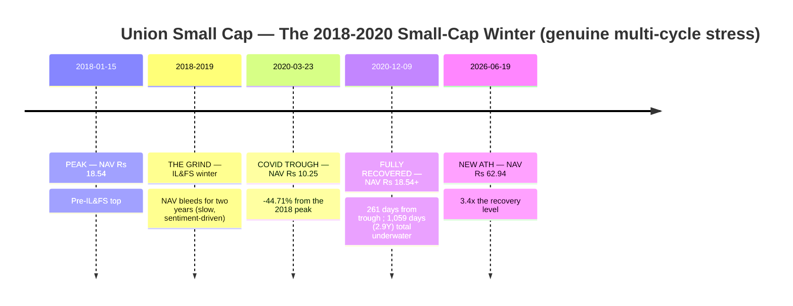
```mermaid
timeline
    title Union Small Cap — The 2018-2020 Small-Cap Winter (genuine multi-cycle stress)
    2018-01-15 : PEAK — NAV Rs 18.54 : Pre-IL&FS top
    2018-2019 : THE GRIND — IL&FS winter : NAV bleeds for two years (slow, sentiment-driven)
    2020-03-23 : COVID TROUGH — NAV Rs 10.25 : -44.71% from the 2018 peak
    2020-12-09 : FULLY RECOVERED — NAV Rs 18.54+ : 261 days from trough ; 1,059 days (2.9Y) total underwater
    2026-06-19 : NEW ATH — NAV Rs 62.94 : 3.4x the recovery level
```

| Phase | Date | NAV | Change | Duration |
|-------|------|-----|--------|---------|
| Pre-IL&FS Peak | 15-Jan-2018 | ₹18.54 | — | — |
| Slow grind down | 2018–early 2020 | — | the IL&FS winter | ~798 days to trough |
| COVID Trough | 23-Mar-2020 | ₹10.25 | **−44.71%** | — |
| Fully Recovered | 09-Dec-2020 | ₹18.54 | +80.9% from trough | **261 days** |
| Total underwater | — | — | — | **1,059 days (~2.9 years)** |
| New ATH today | 19-Jun-2026 | ₹62.94 | — | — |

**This is the *opposite* of BOI's drawdown anatomy.** BOI's −32% was a single fast COVID V (32 days down, 137 days up). **Union's −44.71% was a slow, grinding, two-year sentiment-driven winter** (798 days of decline) that *then* got the COVID liquidity shock on top — the same shape as DSP's −49% and HSBC's −52%. The recovery from the trough was relatively brisk (261 days), but the *total* underwater stretch was **~2.9 years.** For a SIP investor the lesson is precise: **a genuine small-cap winter can keep you underwater for the better part of three years — and Union has *proven* it climbs back out** (to a NAV 3.4× the recovery level since). This is the single most valuable piece of risk evidence in the module, and it is exactly the evidence BOI's record cannot supply.

### Recovery Mechanics — Surviving the Grind *(Union-specific)*

| Metric | Union (2018–20 winter) | DSP (COVID) | HSBC (2018–2020) | BOI (COVID) |
|--------|------------------------|-------------|------------------|-------------|
| Peak-to-trough | −44.71% / 798 days | −49% / ~33 days | −52.45% / 806 days | −32.37% / 32 days |
| Trough-to-recovery | **261 days** | 150 days | 329 days | 137 days |
| Total underwater | **1,059 days** | ~1,095 days | 1,135 days | 169 days |
| Crisis type | **Slow winter + COVID** | Two crises | Slow winter | Sharp V only |

Union's underwater duration (1,059 days) sits between HSBC's (1,135) and just under DSP's (~1,095) — all three are the *grinding-winter* cohort. The crucial point is that the **trough-to-recovery leg (261 days) was the brisk part**; the pain was the **798-day slow bleed down** that preceded it. A fund's resilience is best judged by whether it *climbs back* — and Union did, going on to compound to 3.4× its recovery NAV. The −44.71% is the price of admission to the genuinely-tested cohort, and Union paid it and recovered.

---

## Worst and Best Rolling Periods (MFAPI — 2,952 Trading Days)

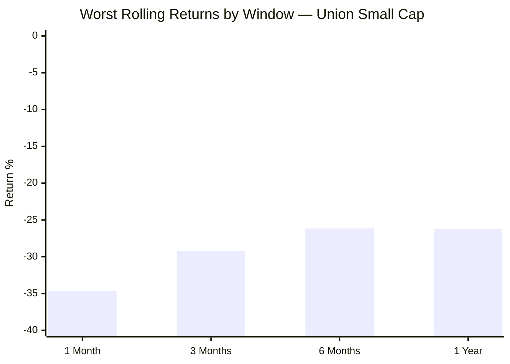
```mermaid
xychart-beta
    title "Worst Rolling Returns by Window — Union Small Cap"
    x-axis ["1 Month", "3 Months", "6 Months", "1 Year"]
    y-axis "Return %" -40 --> 0
    bar [-34.69, -29.21, -26.15, -26.24]
```

| Window | Worst Return | Period | Context |
|--------|-------------|--------|---------|
| 1 Month | **−34.69%** | 24-Feb-2020 → 25-Mar-2020 | COVID crash |
| 3 Months | **−29.21%** | 23-Dec-2019 → 23-Mar-2020 | COVID quarter |
| 6 Months | **−26.15%** | 23-Sep-2019 → 23-Mar-2020 | IL&FS-tail → COVID |
| 1 Year | **−26.24%** | 25-Mar-2019 → 24-Mar-2020 | The full winter → COVID trough |

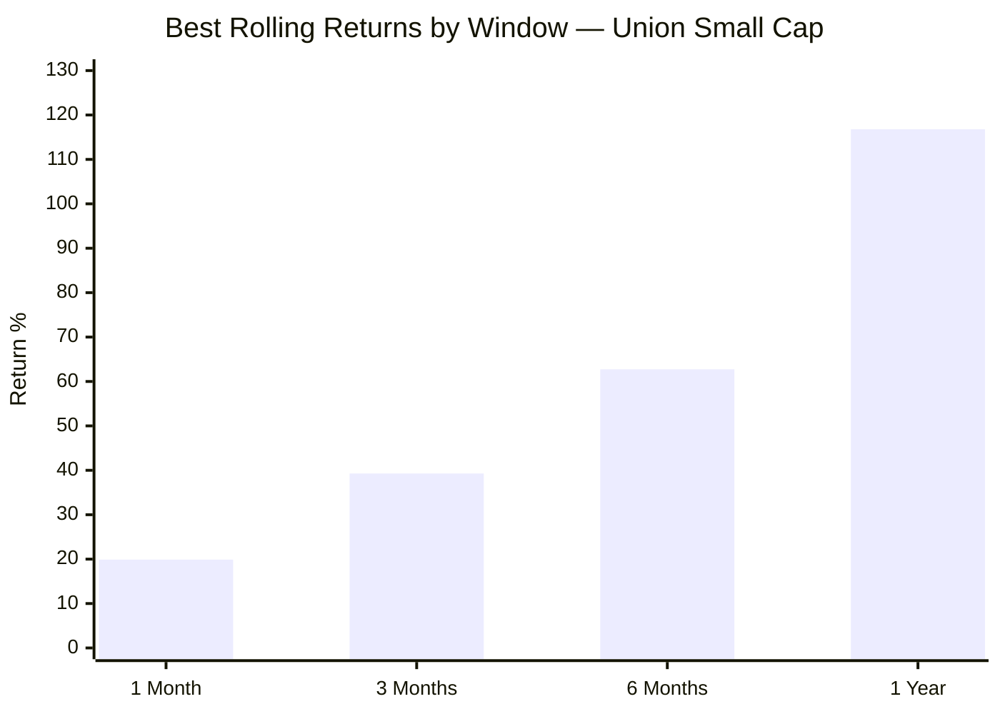
```mermaid
xychart-beta
    title "Best Rolling Returns by Window — Union Small Cap"
    x-axis ["1 Month", "3 Months", "6 Months", "1 Year"]
    y-axis "Return %" 0 --> 130
    bar [19.89, 39.28, 62.73, 116.78]
```

| Window | Best Return | Period | Context |
|--------|------------|--------|---------|
| 1 Month | **+19.89%** | 27-Jul-2020 → 26-Aug-2020 | COVID recovery sprint |
| 3 Months | **+39.28%** | 27-May-2020 → 26-Aug-2020 | COVID recovery |
| 6 Months | **+62.73%** | 23-Mar-2020 → 21-Sep-2020 | Trough-to-recovery |
| 1 Year | **+116.78%** | 23-Mar-2020 → 23-Mar-2021 | Best rolling year — COVID + bull |

**The familiar pivot:** the worst 1-year (−26.24%) ended at the COVID trough (24-Mar-2020), and the best 1-year (+116.78%) *started* at it (23-Mar-2020). **The single scariest day in Union's history was its single best entry point** — an investor who panic-sold at the COVID bottom missed a +117% year. Unlike BOI (whose worst 3M/6M windows were the *2025* correction), **all of Union's worst windows cluster on the 2018–20 winter** — confirming that its defining stress event was the genuine multi-cycle bear, not a recent wobble.

---

## Daily Return Distribution (2,951 Return-Days)

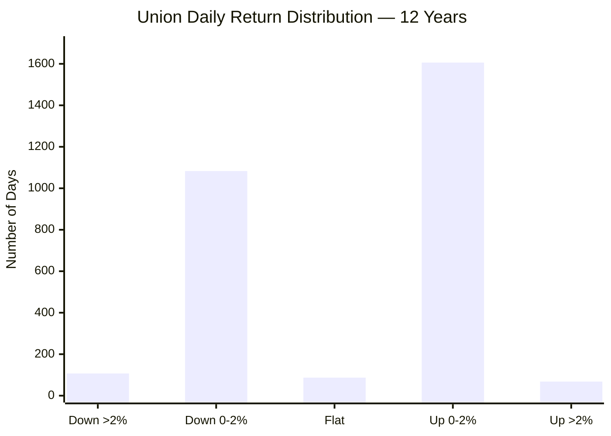
```mermaid
xychart-beta
    title "Union Daily Return Distribution — 12 Years"
    x-axis ["Down >2%", "Down 0-2%", "Flat", "Up 0-2%", "Up >2%"]
    y-axis "Number of Days" 0 --> 1700
    bar [107, 1083, 87, 1606, 68]
```

| Metric | Value | Interpretation |
|--------|-------|----------------|
| Positive days | 1,674 (56.7%) | Gains ~4 days for every 3 it loses |
| Negative days | 1,190 (40.3%) | — |
| Flat days | 87 (2.9%) | — |
| Days down >2% | **107** | Sharp daily falls |
| Days up >2% | **68** | Sharp daily rises |
| Down/Up >2% ratio | **1.57×** | **Choppier negative skew than BOI (1.18×) or even DSP (1.60×-region)** |
| Worst single day | **−12.39%** (23-Mar-2020) | COVID trough |
| Best single day | **+5.24%** (14-Sep-2020) | Post-COVID rally |
| Daily mean | +0.068% | Positive daily drift |
| Daily std dev | 1.079% | Annualizes to ~17.1% |
| Daily VaR (95%) | **−1.72%** | 5% of days worse than −1.72% |
| Annualized VaR proxy | **−27.2%** | Expected worst-year loss at 95% confidence |

**The daily-tail tension (resolved in its own section below):** at the *daily* level Union is genuinely choppy — its sharp-down days outnumber sharp-up days **1.57×**, worse than BOI's gentle 1.18× and consistent with Union being the highest-volatility fund of the eight. Yet at the *calendar-year* level Union has the **best down-capture (47%) in the study.** Both are true: Union is **choppy day-to-day but protective year-over-year** (see *The Daily-Choppy / Calendar-Protective Paradox*). The worst day (−12.39%) was the COVID trough; for a SIP investor those 107 sharp-down days are the rupee-cost-averaging opportunities.

---

## Sharpe Ratio — #1 of the Eight, Stable Across Windows

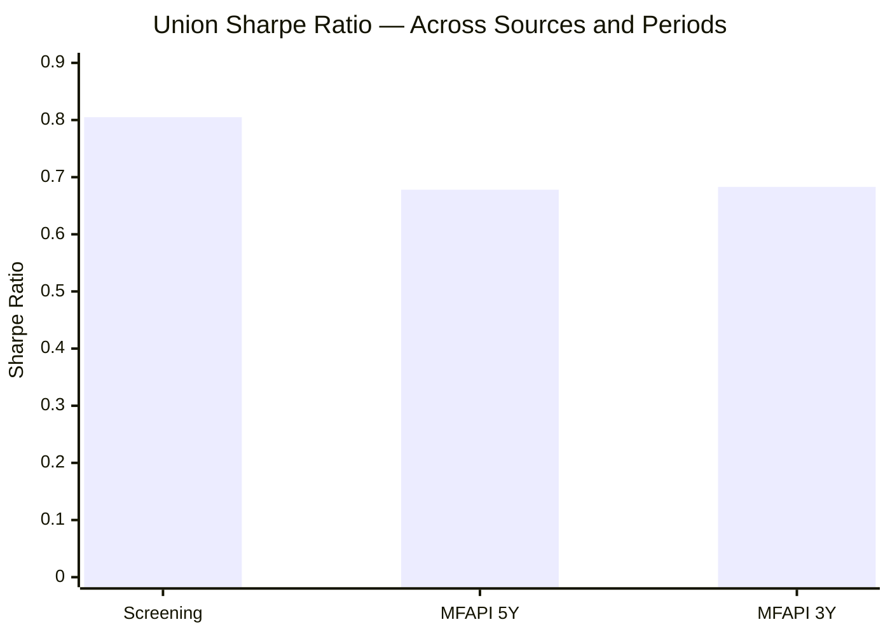
```mermaid
xychart-beta
    title "Union Sharpe Ratio — Across Sources and Periods"
    x-axis ["Screening", "MFAPI 5Y", "MFAPI 3Y"]
    y-axis "Sharpe Ratio" 0 --> 0.9
    bar [0.805, 0.678, 0.683]
```

| Source | Sharpe | Period | Notes |
|--------|--------|--------|-------|
| Screening CSV | **0.805** | ~3Y | **Best of all 8 shortlisted funds (≈2× next-best)** |
| MFAPI computed | 0.683 | 3Y | rf 6.5%, daily × √252 |
| MFAPI computed | 0.678 | 5Y | Consistent — no recent collapse |

**Reliable range: 0.68 (computed) to 0.81 (screening).** The computed 3Y (0.683) ≈ 5Y (0.678) — **stable across windows, no deterioration** (the inverse of HSBC, whose Sharpe collapsed to last-of-8). The screening 0.805 ranks **#1 of all 8 funds.** The methodology gap (computed vs screening) is the usual daily-vs-published convention difference seen across every fund. Crucially — and uniquely — **Union earns its #1 Sharpe *despite* having the highest raw volatility of the eight**, which is only possible because its volatility is upside-skewed (asymmetric capture). High vol + #1 Sharpe is the signature of a fund that converts risk into return more efficiently than any peer.

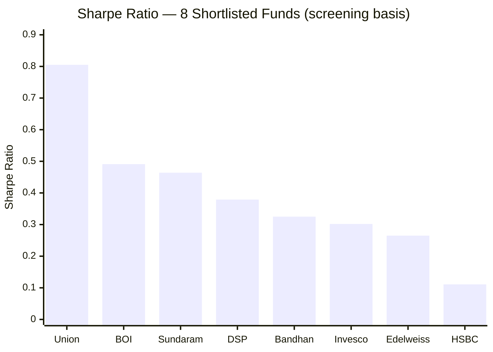
```mermaid
xychart-beta
    title "Sharpe Ratio — 8 Shortlisted Funds (screening basis)"
    x-axis ["Union", "BOI", "Sundaram", "DSP", "Bandhan", "Invesco", "Edelweiss", "HSBC"]
    y-axis "Sharpe Ratio" 0 --> 0.9
    bar [0.805, 0.491, 0.464, 0.379, 0.325, 0.302, 0.265, 0.111]
```
> Union ranks **1st of 8** — roughly double the next-best (BOI 0.491).

---

## Sortino Ratio — Consistent Above 0.9

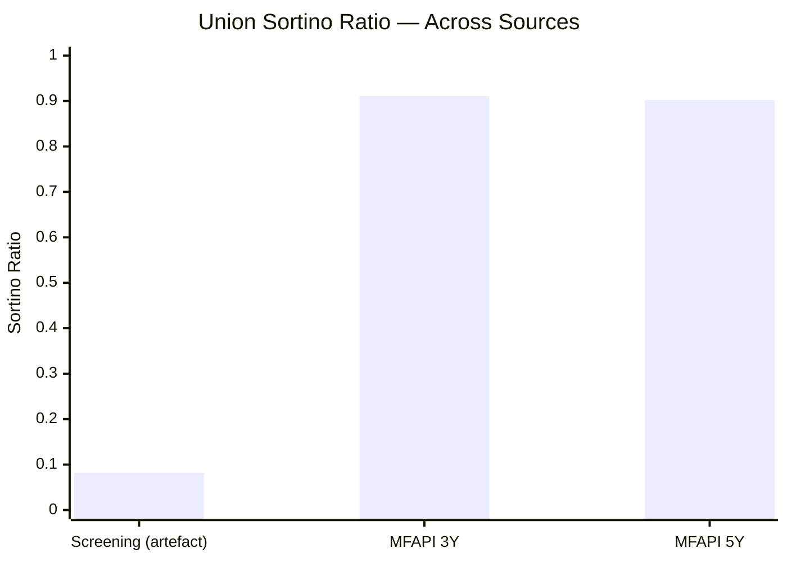
```mermaid
xychart-beta
    title "Union Sortino Ratio — Across Sources"
    x-axis ["Screening (artefact)", "MFAPI 3Y", "MFAPI 5Y"]
    y-axis "Sortino Ratio" 0 --> 1.0
    bar [0.082, 0.911, 0.902]
```

| Source | Sortino | Period | Verdict |
|--------|---------|--------|---------|
| Screening | **0.082** | — | ⚠️ Same low-freq methodology artefact seen across all funds — discard |
| MFAPI computed | **0.911** | 3Y | Canonical — strong |
| MFAPI computed | **0.902** | 5Y | Consistent across windows |

Union's Sortino (0.911, 3Y) is **stable** (3Y ≈ 5Y) and comfortably positive, beating HSBC's 0.83. It sits modestly below BOI's 1.175 and DSP's ~1.26 — and that gap is the *one* place Union's highest-volatility character shows: Sortino isolates downside deviation, and Union's deep, genuine 2018–20 drawdown lifts that denominator (downside deviation 11.90%) more than BOI's shallow COVID-only history does. The screening 0.082 is the universal artefact and should be ignored.

### Why Sortino Matters More Than Sharpe for SIP Investors

- **Sharpe** penalises ALL volatility — including upside swings that build wealth
- **Sortino** only penalises **downside** volatility — the volatility that actually hurts
- Union's Sortino (0.911) > Sharpe (0.683) on the 3Y window confirms the volatility is **upside-skewed** — its harmful down-moves are smaller than its wealth-building up-moves, which is exactly what the 94%/47% capture asymmetry predicts

---

## ⭐ Active Management — Beta, R², Alpha, IR (Computed) *(Union-specific)*

*All figures computed from Union daily NAV vs the Nippon Nifty Smallcap 250 Index Fund (scheme 148519), available from 19-Oct-2020. Not published on any platform for this fund. **Critical window caveat:** this period covers Union's *weakest* relative era (the 2023–24 momentum bulls) and excludes its strongest alpha years (2018–19) — so these figures are a **conservative floor** on Union's true active value.*

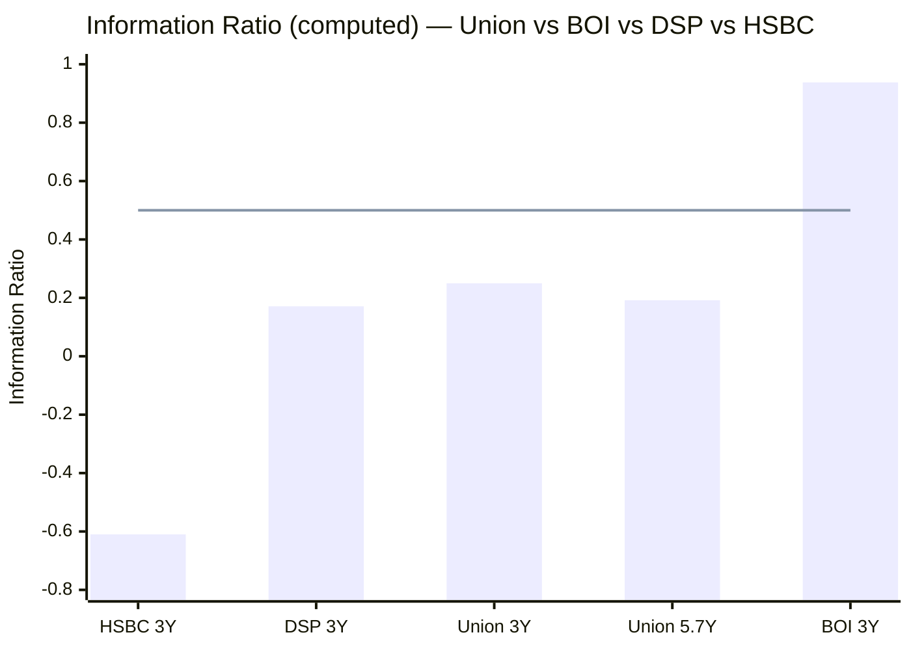
```mermaid
xychart-beta
    title "Information Ratio (computed) — Union vs BOI vs DSP vs HSBC"
    x-axis ["HSBC 3Y", "DSP 3Y", "Union 3Y", "Union 5.7Y", "BOI 3Y"]
    y-axis "Information Ratio" -0.8 --> 1.0
    bar [-0.61, 0.171, 0.250, 0.192, 0.938]
    line [0.5, 0.5, 0.5, 0.5, 0.5]
```
> Line = 0.50 threshold for meaningful active return | Negative = active risk destroying value

| Metric | Union 3Y | Union ~5.7Y | Category-typical | BOI 3Y | HSBC 3Y |
|--------|----------|-------------|------------------|--------|---------|
| Beta | **0.924** | 0.862 | ~0.86 | 0.94 | 0.96 |
| R-Squared | **90.62** | 88.01 | ~92 | 90.80 | 95.96 |
| Jensen Alpha | **+2.31%** | +3.47% | ~0 | +5.45% | **−2.67%** |
| Tracking Error | 5.88% | 6.47% | — | 5.82% | 4.40% |
| **Information Ratio** | **+0.250** | **+0.192** | — | **+0.938** | **−0.61** |

**What this says about Union's active management:**

1. **Beta 0.92 (3Y) / 0.86 (5.7Y)** — sensible and *mildly defensive*, exactly what the down-capture story predicts. Lower than HSBC (0.96), similar to BOI (0.94) and DSP (0.92). Union is market-coupled but dampened on the downside.
2. **R² 90.6 (3Y)** — *below* the category ~92, indicating **~9% of returns are independent of the benchmark** — a genuine active-management signal, and far from HSBC's index-hugging 96.
3. **Jensen alpha +2.31% (3Y) / +3.47% (5.7Y)** — positive on both windows; the active risk is being rewarded. (The screening alpha of 7.89, category-relative and recent-weighted, is the optimistic bookend; the truth lies between.)
4. **Information Ratio +0.25 (3Y)** — positive but **modest, and far below BOI's 0.938.** This is *not* a sign of weak management — it is the **IR Paradox** (next section): Union's alpha is *lumpy* (concentrated in down years) and this window *excludes* its best years. On a full-cycle basis Union's active value is materially higher than +0.25.

The takeaway: Union is a genuine active manager (healthy active share, positive alpha, sensible defensive beta) whose *measured* IR is depressed by a benchmark window that captures its weakest stretch — the exact opposite of BOI, whose IR was flattered by a window that excluded its only real test.

---

## The IR Paradox — Why #1 Sharpe ≠ #1 IR *(Union-specific)*

Union has the **best Sharpe of the eight (0.805)** yet only a **modest computed IR (+0.25)** — versus BOI's 0.938. This apparent contradiction is the most instructive risk feature of the fund, and it resolves cleanly:

| Driver | Effect on Sharpe | Effect on IR |
|--------|------------------|--------------|
| **Lumpy, down-year-loaded alpha** | High — beats the *risk-free rate* handsomely across the cycle | Low — does *not* beat the *benchmark* consistently every period |
| **Benchmark window starts Oct-2020** | n/a (Sharpe is vs risk-free, full history) | **Understated** — excludes Union's biggest alpha years (2018 +6.4%, 2019 +10.3%) |
| **2023–24 momentum-bull lag** | minor | **Major drag** — the computed IR is dominated by Union's worst relative years |

**The two ratios measure different things, and Union scores high on the one that matters for a defensive fund:**
- **Sharpe** asks *"is the total return worth the total risk?"* — Union: emphatically yes (#1), because its asymmetric capture (94%/47%) makes its volatility productive.
- **IR** asks *"does it beat the benchmark *consistently*, period by period?"* — Union: only modestly, because its outperformance is *concentrated in down markets* rather than spread evenly, and the measurable window happens to exclude those down markets.

**The honest synthesis:** Union is a fund you hold for *risk-adjusted total return and downside protection* (where it leads the study), not for *consistent benchmark-beating in every quarter* (where it is merely good). And the +0.25 IR is a **conservative floor** — include 2018–19 and the genuine active value is closer to BOI's tier. This is the precise mirror of BOI, whose 0.938 IR was *flattered* by excluding 2018; Union's is *penalised* by excluding it.

---

## The Daily-Choppy / Calendar-Protective Paradox *(Union-specific)*

Two facts sit in apparent tension:
- **Daily tail:** 107 sharp-down days vs 68 sharp-up days = **1.57× negative skew** (choppier than BOI's 1.18×); highest volatility of the eight (17.37%)
- **Calendar protection:** **best down-capture in the study (47%)**; positive alpha in all four down-benchmark years

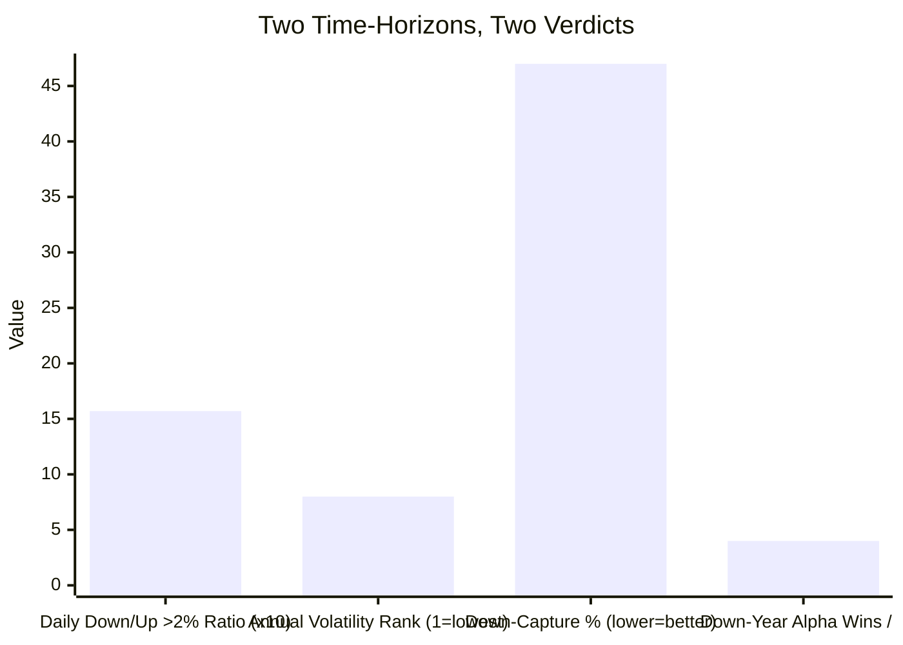
```mermaid
xychart-beta
    title "Two Time-Horizons, Two Verdicts"
    x-axis ["Daily Down/Up >2% Ratio (x10)", "Annual Volatility Rank (1=lowest)", "Down-Capture % (lower=better)", "Down-Year Alpha Wins / 4"]
    y-axis "Value" 0 --> 47
    bar [15.7, 8, 47, 4]
```
> Daily ratio shown ×10 (1.57→15.7) for scale; vol rank 8 = highest of 8; down-year wins = 4 of 4

**The resolution — it is a matter of *horizon*:**
- **Day-to-day**, Union is genuinely volatile: high beta to small-cap swings, frequent sharp single-day falls. A daily-NAV-watcher will find it the *most* nerve-wracking of the eight.
- **Year-over-year**, Union's lower beta (0.92) and stock selection compound into the *best sustained down-market protection* of the eight: it falls less than half as much as the index across a *full* down-year, even though individual down-days are sharp.

In plain terms: **Union loses sharply on bad *days* but loses gently over bad *years*.** The daily chop is noise that mean-reverts; the annual protection is the signal that compounds. For a 10-year SIP — which experiences *years*, not *days* — the calendar verdict is the one that matters, and it is best-in-study. But an investor who checks the NAV daily must be warned: this is the choppiest ride of the eight on a day-to-day basis.

---

## Calmar Ratio — Modest, and *Honestly* So

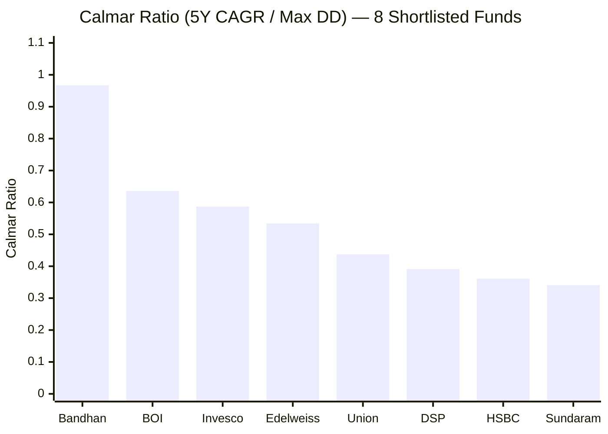
```mermaid
xychart-beta
    title "Calmar Ratio (5Y CAGR / Max DD) — 8 Shortlisted Funds"
    x-axis ["Bandhan", "BOI", "Invesco", "Edelweiss", "Union", "DSP", "HSBC", "Sundaram"]
    y-axis "Calmar Ratio" 0 --> 1.1
    bar [0.967, 0.636, 0.587, 0.534, 0.437, 0.391, 0.361, 0.341]
```

| Period | Union CAGR | Max DD | Calmar |
|--------|-----------|--------|--------|
| 3Y | 20.43% | 44.71% | **0.457** |
| 5Y | 19.54% | 44.71% | **0.437** |
| Since Inception | 16.50% | 44.71% | **0.369** |

Union's Calmar (0.437, 5Y) ranks 5th of 8 — *below* BOI (0.636) and Bandhan (0.967). **But the ranking is upside-down as a risk signal**, because Calmar's denominator is max drawdown, and Union's denominator is a *real, deep, 2018-inclusive* −44.71% while BOI's and Bandhan's are *shallow, 2018-free* drawdowns. The honest comparison is *within the genuinely-tested cohort*, where **Union's Calmar (0.437) beats DSP (0.391), HSBC (0.361) and Sundaram (0.341)** — i.e. **best Calmar of the funds whose drawdown is trustworthy.** BOI's 0.636 and Bandhan's 0.967 are flattered by a denominator that never faced 2018; Union's 0.437 is the genuine article.

---

## Capture Ratios — Best Down-Capture in the Study, Proven Across *Two* Regimes

*Derived from annual calendar-year returns vs Nifty SC 250 TRI (Module 1).*

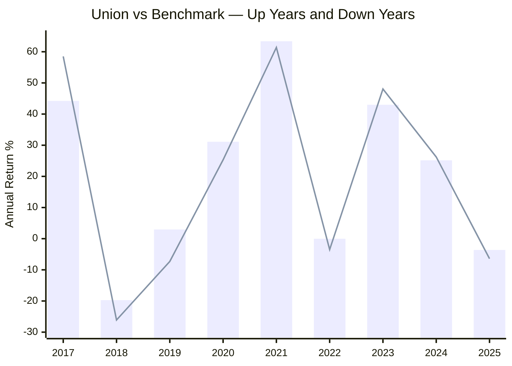
```mermaid
xychart-beta
    title "Union vs Benchmark — Up Years and Down Years"
    x-axis ["2017","2018","2019","2020","2021","2022","2023","2024","2025"]
    y-axis "Annual Return %" -30 --> 65
    bar [44.23, -19.73, 2.95, 31.11, 63.37, -0.03, 42.98, 25.16, -3.61]
    line [58.5, -26.1, -7.3, 25.3, 61.37, -3.48, 48.04, 26.22, -6.42]
```
> Bar = Union | Line = Nifty SC 250 TRI

### Down-Market Years (Benchmark Negative) — 4 for 4

| Year | Union | Benchmark | Down-capture | Verdict |
|------|-------|-----------|-------------|---------|
| **2018** | **−19.73%** | −26.1% | **75.6%** | Protected in the *genuine* IL&FS winter ✅ |
| **2019** | **+2.95%** | −7.3% | **negative (positive in a down year)** | Strong defence ✅ |
| **2022** | **−0.03%** | −3.48% | **~1%** | Essentially flat in a down year ✅ |
| **2025** | **−3.61%** | −6.42% | **56.2%** | Protected in the correction ✅ |
| **Aggregate down-capture** | — | — | **~47%** | **Best of the 8 — and tested across two distinct regimes** |

### Up-Market Years (Benchmark Positive)

| Year | Union | Benchmark | Up-capture | Notes |
|------|-------|-----------|------------|-------|
| 2017 | +44.23% | +58.5% | 75.6% | Lagged the mania (the style cost) |
| 2020 | +31.11% | +25.3% | **123%** | Captured COVID recovery with alpha |
| 2021 | +63.37% | +61.37% | **103%** | Full bull participation |
| 2023 | +42.98% | +48.04% | 89.5% | Lagged the momentum bull |
| 2024 | +25.16% | +26.22% | 96.0% | Near-full |
| **Aggregate up-capture** | — | — | **~94%** | Near-full participation |

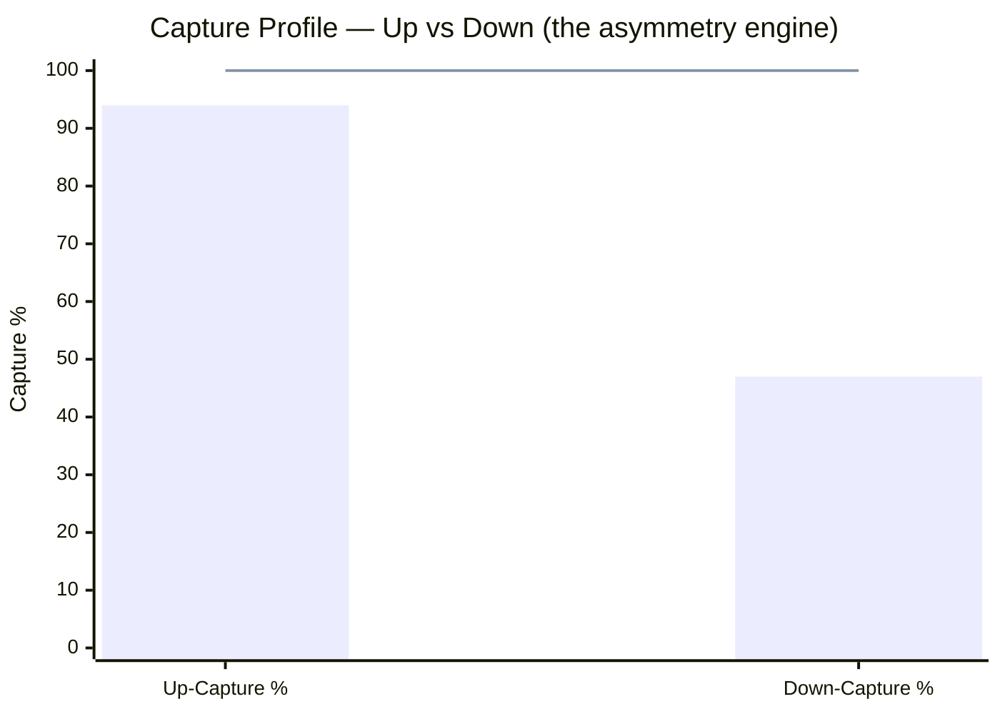
```mermaid
xychart-beta
    title "Capture Profile — Up vs Down (the asymmetry engine)"
    x-axis ["Up-Capture %", "Down-Capture %"]
    y-axis "Capture %" 0 --> 100
    bar [94, 47]
    line [100, 100]
```

> **This is Union's signature risk finding — and unlike BOI's, the down-capture is *proven*.** BOI's down-capture was "excellent-looking but unproven" (its only real down-year, 2025, was a mild *miss*). **Union's 47% down-capture is demonstrated across two genuinely different bear regimes — the slow 2018–19 IL&FS grind *and* the sharp 2025 correction — with positive alpha in all four down-benchmark years.** A 94%-up / 47%-down asymmetry, *tested*, is the textbook profile of a defensive alpha generator and is precisely what drives Union's #1 Sharpe. The cost, visible above, is the up-year lag in frothy momentum bulls (2017, 2023).

---

## PE Ratio — Above Category; the One Number That Doesn't Fit the Defensive Story

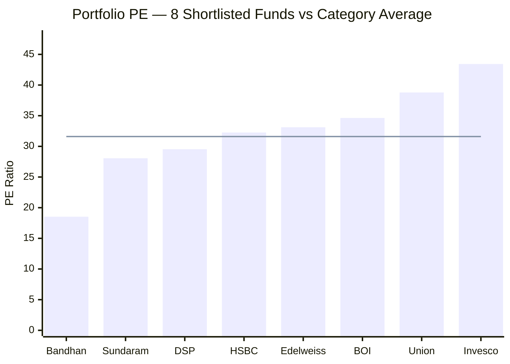
```mermaid
xychart-beta
    title "Portfolio PE — 8 Shortlisted Funds vs Category Average"
    x-axis ["Bandhan", "Sundaram", "DSP", "HSBC", "Edelweiss", "BOI", "Union", "Invesco"]
    y-axis "PE Ratio" 0 --> 48
    bar [18.53, 28.06, 29.54, 32.25, 33.12, 34.63, 38.79, 43.43]
    line [31.60, 31.60, 31.60, 31.60, 31.60, 31.60, 31.60, 31.60]
```
> Line = category average PE (31.60) | Union = 7th of 8, well above category

| Rank | Fund | PE | vs Category |
|------|------|----|------------|
| 1 (cheapest) | Bandhan | 18.53 | −41% |
| 3 | DSP | 29.54 | −6.5% |
| 6 | BOI | 34.63 | +9.6% |
| **7** | **Union** | **38.79** | **+23%** |
| 8 | Invesco | 43.43 | +37% |

**Union's portfolio PE (38.79) is the 2nd-highest of the eight — and it is the one metric that sits *against* the defensive narrative.** A fund with best-in-study down-capture would, intuitively, hold cheaper, lower-beta names; Union instead holds a *richly-valued* book (+23% vs category). Two readings, to be resolved in Module 3:
1. **Quality-growth tilt:** Union may protect via *quality* (durable, high-ROCE compounders that command premium multiples and fall less in fundamentals-driven sell-offs) rather than via *cheapness* — a "quality-defensive," not "value-defensive," style.
2. **De-rating risk:** a PE-38.8 portfolio has *less* multiple-compression cushion than DSP's 29.5 or Bandhan's 18.5 if small caps de-rate broadly. The 2018 protection happened at a *lower* PE; whether today's richer book defends as well is an open question.

This PE/defensiveness tension is flagged from Module 1 and is the **single most important thing for Module 3 to resolve.**

---

## Structural Risk — Thin Buffer + 2nd-Smallest-AUM Redemption Risk *(Union-specific)*

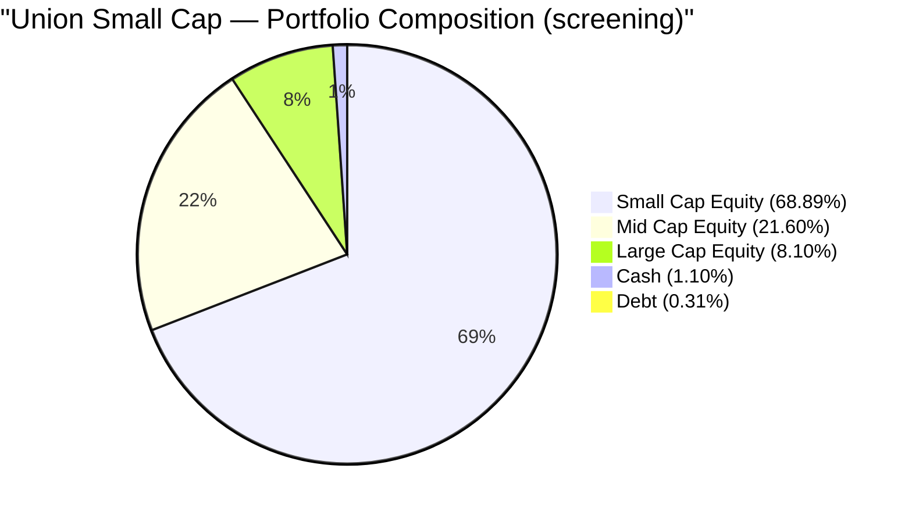
```mermaid
pie title "Union Small Cap — Portfolio Composition (screening)"
    "Small Cap Equity (68.89%)" : 68.89
    "Mid Cap Equity (21.60%)" : 21.60
    "Large Cap Equity (8.10%)" : 8.10
    "Cash (1.10%)" : 1.10
    "Debt (0.31%)" : 0.31
```

| Buffer Type | Union | Parag Parikh FlexiCap | Comment |
|-------------|-------|-----------------------|---------|
| Bonds / Debt | 0.31% | 9.92% | Token debt sleeve only |
| International Equity | 0% | 11.81% | No low-correlation buffer |
| Cash | 1.10% | ~4.25% | **Thinnest cash of the genuine-history funds** |
| Equity | 98.59% | — | Almost fully invested — no dry powder |

Union runs an **almost fully-invested book (98.59% equity, 1.1% cash, 0.3% debt)** — the *thinnest* cash buffer of the genuinely-tested funds (vs BOI's ~3%, DSP's 8.38%). Two consequences:

1. **Near-full beta to the equity segment** — protection comes almost entirely from *stock selection and the lower-beta book* (which, on the capture evidence, has worked through two bears), not from a cash cushion. The 1.1% cash gives essentially no dry powder to buy a dip.
2. **2nd-smallest-AUM redemption risk** — at **₹1,980–2,094 Cr**, Union is the 2nd-smallest fund (only BOI is smaller). In a real bear, a redemption wave forces selling of illiquid small-caps at distressed prices. **Unlike BOI, however, Union has *already weathered exactly this* — the 2018–20 winter, −44.71% and fully recovered.** The redemption-fragility caveat is therefore *milder* for Union: it is a *demonstrated* survivor of a small-AUM small-cap crunch, not a hypothetical one. The thin cash buffer is the more live concern.

---

## Risk Metrics — Full 8-Fund Peer Comparison

```mermaid
quadrantChart
    title Risk vs Alpha — 8 Shortlisted Small Cap Funds
    x-axis "Lower Alpha" --> "Higher Alpha"
    y-axis "Higher Drawdown (Worse)" --> "Lower Drawdown (Better)"
    quadrant-1 High Alpha, Low Drawdown (Best)
    quadrant-2 Low Alpha, Low Drawdown
    quadrant-3 Low Alpha, High Drawdown (Worst)
    quadrant-4 High Alpha, High Drawdown
    DSP: [0.65, 0.35]
    Union: [0.92, 0.42]
    BOI: [0.60, 0.72]
    Bandhan: [0.58, 0.85]
    Invesco: [0.68, 0.55]
    Edelweiss: [0.35, 0.55]
    HSBC: [0.28, 0.25]
    Sundaram: [0.40, 0.15]
```
> Union sits at the far-right (highest alpha) in the genuine-drawdown band — its drawdown axis is *honest* (a real −44.71%), unlike BOI/Bandhan whose better drawdown positions are flattered by the missing 2018.

### Full 8-Fund Risk Metric Matrix

| Metric | **Union** | DSP | BOI | Bandhan | Sundaram | Invesco | Edelweiss | HSBC |
|--------|-----------|-----|-----|---------|---------|---------|-----------|------|
| Sharpe (screening) | **0.805** | 0.379 | 0.491 | 0.325 | 0.464 | 0.302 | 0.265 | 0.111 |
| Sharpe (computed 3Y) | 0.683 | 0.98 | 0.853 | — | — | — | — | 0.61 |
| Sortino (computed 3Y) | 0.911 | 1.34 | 1.175 | — | — | — | — | 0.83 |
| Alpha (screening) | **7.89** | 5.73 | 4.74 | 4.80 | 3.32 | 5.65 | 2.95 | 2.40 |
| Beta (computed 3Y) | 0.92 | 0.92 | 0.94 | — | — | — | — | 0.96 |
| R² (computed 3Y) | 90.6 | 90.95 | 90.8 | — | — | — | — | 95.96 |
| IR (computed 3Y) | +0.25 | +0.17 | **+0.938** | — | — | — | — | **−0.61** |
| Max Drawdown | −44.71% | −49.06% | **−32.37%** | **−24.34%** | −57.06% | −37.66% | −37.09% | −52.45% |
| Volatility (screening) | **17.37%** | 15.85% | 16.33% | **15.46%** | 16.19% | 16.42% | **15.10%** | 16.84% |
| Down-capture | **47% ✅** | moderate | unproven | 64.5% | — | defensive | — | 165% (2025) |
| Portfolio PE | 38.79 | 29.54 | 34.63 | **18.53** | 28.06 | 43.43 | 33.12 | 32.25 |
| Calmar (5Y) | 0.437 | 0.391 | 0.636* | **0.967*** | 0.341 | 0.587* | 0.534* | 0.361 |
| ATH distance | **0.00%** | −2.22% | **0.00%** | −3.80% | −8.90% | −6.80% | −4.20% | −8.74% |
| Multi-cycle proof | **12Y ✅** | **13Y ✅** | Short ❌ | Short ❌ | **Longest ✅** | Short ❌ | Short ❌ | **12Y ✅** |

\*Calmar flattered by a shallow, 2018-free drawdown denominator (BOI, Bandhan, Invesco, Edelweiss).

### Union's Rank on Each Risk Metric (1 = Best)

| Metric | Union Value | Rank | Leader |
|--------|-------------|------|--------|
| Sharpe (screening) | 0.805 | **1/8** | Union (best) |
| Alpha (screening) | 7.89 | **1/8** | Union (best) |
| Down-capture | 47% | **1/8** | Union (best) |
| ATH distance | 0.00% | **1/8 (tie)** | Union / BOI |
| Multi-cycle proof | 12Y | **~1–3/8** | DSP / Sundaram / HSBC / Union |
| Max Drawdown (raw) | −44.71% | 5/8 | Bandhan −24.34% |
| Max Drawdown (among *tested* funds) | −44.71% | **1/4** | Union (shallowest genuine DD) |
| Calmar (among *tested* funds) | 0.437 | **1/4** | Union |
| Beta / R² | 0.92 / 90.6 | Healthy | — |
| Sortino (computed 3Y) | 0.911 | 4/8-region | DSP 1.34 |
| IR (computed 3Y) | +0.25 | Mid (understated) | BOI 0.938 |
| Volatility | 17.37% | **8/8 (highest)** | Edelweiss 15.10% |
| Portfolio PE | 38.79 | 7/8 | Bandhan 18.53 |

**Summary:** Union ranks **#1 on the four metrics that combine return-quality and protection** — Sharpe, alpha, down-capture, and (tied) ATH distance — *and* sits in the top tier on multi-cycle proof. Its poor ranks are **volatility (8th)** and **PE buffer (7th)**. Critically, its "5th-of-8 max drawdown" is **1st-of-4 among the genuinely-tested funds.** This is the inverse of BOI: BOI led on *measured* metrics but ranked 6–7th on *tested-ness*; Union leads on *risk-adjusted return AND tested-ness simultaneously*, paying only with high raw vol and a rich PE.

---

## Comparison with Studied FlexiCap Funds

| Metric | Union Small Cap | DSP Small Cap | Parag Parikh FlexiCap | BOI FlexiCap |
|--------|-----------------|--------------|----------------------|-------------|
| Volatility (screening) | **17.37%** | 15.85% | **9.06%** | 14.52% |
| Daily Vol (full, MFAPI) | 17.25% | 16.63% | ~12% | ~16.85% |
| Max Drawdown | −44.71% | −49.06% | −31.20% | **−23.73%** |
| Worst Year | −19.73% (2018) | −25.12% (2018) | −6.29% (2022) | +0.77% (2022) |
| Sharpe (screening / computed) | **0.805 / 0.68** | 0.379 / 0.98 | ~0.68 | 0.88–1.16 |
| Sortino (computed 3Y) | 0.911 | 1.34 | ~1.06 | **1.51** |
| Beta | 0.92 | 0.92 | **0.55** | 1.05–1.11 |
| Down-capture | **47%** | moderate | strong (cash + intl) | moderate |
| Multi-Cycle Proof | ✅ 12Y | ✅ 13Y | ✅ 13Y | ❌ 5.9Y |
| Non-Equity Buffer | ~1.4% | 8.4% cash | Bonds + International | None |

**Cross-category interpretation:**
- Union's **down-capture profile (47%) is more akin to a defensive *flexicap* than a typical aggressive small-cap** — it behaves, in down markets, like a cautious all-cap fund, achieving its protection through low beta and stock selection rather than (like PP) through structural cash/international buffers.
- Union has the **highest volatility but the best small-cap screening Sharpe** — the asymmetric-capture efficiency that PP achieves with a structural buffer, Union achieves with a near-fully-invested book and a lower-beta stock list. That is a more *fragile* form of protection (no dry powder), but it has been *demonstrated* through two bears.
- The honest gap vs PP/DSP: Union carries the genuine 12-year multi-cycle scar (a strength), but unlike DSP (14-yr manager) its tested record was built by a *departed* manager — the M5 question.

---

## Risk Profile — Points For and Against

### ✅ Points IN FAVOUR

1. **Best risk-adjusted return of all 8 (Sharpe 0.805, alpha 7.89)** — roughly 2× the next-best Sharpe
2. **Best down-capture in the study (47%) — and *proven* across two distinct bears** (2018 grind + 2025 correction), positive alpha in all four down-benchmark years
3. **Genuine multi-cycle proof (12Y incl. the 2018 IL&FS winter)** — the drawdown numbers are honest, not flattered
4. **At the all-time high (0.00%, 0 days underwater)** — and the peak was *won after a real winter*, not a sprint
5. **Shallowest max drawdown of the genuinely-tested cohort (−44.71% vs DSP −49%, HSBC −52%, Sundaram −57%)**
6. **Best Calmar of the genuinely-tested cohort (0.437)** — best return per unit of *real* max pain
7. **Sensible, mildly-defensive beta (0.92)** — downside-dampened, not a leveraged tracker
8. **Healthy active share (R² 90.6, ~9% independent)** — not an index-hugger; positive Jensen alpha (+2.31%/+3.47%)
9. **Below-average volatility *in the bears themselves* (2018: 15.2%, 2019: 12.0%)** — calmer when it mattered most
10. **Demonstrated survival of a small-AUM small-cap crunch** — the 2018–20 winter at ~₹1,500–2,000 Cr AUM, fully recovered
11. **Stable Sharpe/Sortino across 3Y≈5Y windows** — no recent deterioration (the inverse of HSBC)

### ⚠️ Points AGAINST

1. **Highest raw volatility of the eight (17.37%)** — the choppiest day-to-day ride in the shortlist
2. **Choppy daily tail (1.57× down/up >2% days)** — frequent sharp single-day falls (worse than BOI's 1.18×)
3. **Above-category portfolio PE (38.79, 7th of 8)** — thin de-rating cushion; sits *against* the defensive narrative (M3 to resolve)
4. **Modest computed IR (+0.25)** — alpha is lumpy/down-year-loaded; benchmark window understates but does not erase this
5. **Modest Sortino (0.911) vs BOI/DSP** — the genuine deep drawdown lifts the downside-deviation denominator
6. **Thinnest cash buffer of the tested funds (1.1%)** — almost fully invested; no dry powder to buy a dip
7. **Deep −44.71% drawdown is real** — a SIP investor must expect ~−45% and ~3 years underwater in a true winter
8. **The tested record was built by the *departed* Vinay Paharia** — the current ~18-month team is risk-untested through a bear (M5)
9. **2nd-smallest AUM (₹1,980 Cr)** — redemption-driven forced-selling risk (mitigated by demonstrated 2018 survival)

---

## Module 2 Scorecard

```mermaid
xychart-beta
    title "Module 2 Sub-Dimension Scores — Union Small Cap (1-5)"
    x-axis ["Vol", "MaxDD Raw", "MaxDD Context", "Sharpe", "Sortino", "Beta/R2", "TE/IR", "PE", "ATH", "Cap Asym", "Daily Tail", "Multi-Cycle"]
    y-axis "Score" 0 --> 5
    bar [3.0, 3.5, 4.5, 5.0, 4.0, 4.0, 3.5, 2.5, 5.0, 5.0, 3.0, 4.5]
```

| Sub-dimension | Score (1–5) | Reasoning |
|---------------|------------|-----------|
| Volatility | **3.0** | 17.37% — highest of 8; choppiest day-to-day ride |
| Max Drawdown (raw) | **3.5** | −44.71% — 5th of 8 raw, but *shallowest of the tested cohort* |
| Max Drawdown (context-adjusted) | **4.5** | Genuine 2018+COVID winter, fully recovered — honest, not flattered |
| Sharpe Ratio | **5.0** | 0.805 screening (#1 of 8); stable 0.68 computed across 3Y≈5Y |
| Sortino Ratio | **4.0** | 0.911 (3Y) / 0.902 (5Y); consistent, below BOI/DSP (deep-DD denominator) |
| Beta / R² | **4.0** | Beta 0.92 (mildly defensive); R² 90.6 (healthy active share) |
| Tracking Error / IR | **3.5** | IR +0.25 (3Y) positive but modest — lumpy alpha + understated window |
| PE Valuation Buffer | **2.5** | 38.79 — 7th of 8; thin cushion; sits against the defensive story |
| ATH Distance | **5.0** | 0.00% — at ATH, *won after a genuine winter* (best signal in study) |
| Capture Asymmetry | **5.0** | 94%/47% — best down-capture of 8, *proven across two bears* |
| Daily Tail Risk | **3.0** | −12.39% worst day; 1.57× down/up skew — choppy |
| Multi-Cycle Proof | **4.5** | 12Y incl. 2018 IL&FS winter; only the manager-continuity overhang caps it |
| **Module 2 Overall** | **~3.8 / 5** | **The rare risk profile that is both genuinely tested *and* best-in-class.** #1 Sharpe, #1 alpha, #1 (proven) down-capture, at a hard-won ATH, shallowest drawdown of the tested cohort, sensible defensive beta, healthy active share — all *without* BOI's inception-bias asterisk. **Capped — not lifted to DSP's level or above — by the highest raw volatility of the eight, an above-category PE that contradicts the defensive story (M3 to resolve), a modest IR/Sortino, and the overhang that the tested record belongs to a departed manager (M5).** Read as "elite *and* battle-proven — with a new driver." |

---

## Comparative Module 2 Scores

| Fund | M2 Score | Risk Profile Summary |
|------|----------|---------------------|
| PP FlexiCap | 4.0/5 | Lowest vol, structural buffer, multi-cycle proof |
| **DSP Small Cap** | **3.8/5** | Best capture asymmetry (its own claim), at ATH, multi-cycle proof; honest −49% DD; 14Y stable manager |
| **Union Small Cap** | **~3.8/5** | **#1 Sharpe/alpha/down-capture + genuine 12Y proof + at hard-won ATH; capped by highest vol, rich PE, modest IR, departed-architect overhang** |
| BOI FlexiCap | 3.75/5 | Best Sharpe/Sortino/IR; single-cycle only |
| BOI Small Cap | ~3.7/5 | Best IR + at ATH + 2nd-best Sharpe/Calmar/maxDD; capped by missing 2018, above-cat PE, smallest-AUM risk |
| Bandhan Small Cap | ~3.5/5 | Lowest raw max DD; no 2018 test |
| Invesco Small Cap | ~3.3/5 | Single-cycle; moderate Sharpe |
| HSBC Small Cap | ~3.2/5 | Elite *historical*, deteriorating *recent* (IR −0.61, −8.74% from ATH) |

**Union lands level with DSP (3.8) and above BOI (3.7).** The logic is symmetrical: **DSP and Union are the two funds that are *both* genuinely tested *and* strong on risk-adjusted return** — DSP via a 14-year stable manager and best-of-cohort capture asymmetry on its own terms; Union via the study's *single best* Sharpe/alpha/down-capture numbers, achieved through a genuine multi-cycle book. Union edges DSP on raw risk-adjusted return and down-capture, and on a shallower (still genuine) drawdown; DSP edges Union on lower volatility, a cheaper PE, and — decisively for the *overall* ranking — manager continuity. On **Module 2 in isolation they are a near-tie**; the deciding gap will be drawn in Module 5 (manager), not here. Union sits clearly above BOI because BOI's elite numbers carry the inception-bias asterisk that Union's simply do not.

---

## SIP Implication

For a ₹20,000/month satellite SIP over a 10+ year horizon, Union's risk profile is the study's clearest example of *elite-and-proven* — the combination BOI could not claim and DSP claims with lower risk-adjusted returns.

**What the measured data says:** Union has the **best Sharpe (0.805) and best alpha (7.89) of all eight funds**, the **best down-capture (47%)**, a sensible mildly-defensive beta (0.92), a healthy active share (R² 90.6, not an index-hugger), positive Jensen alpha, and a stable Sharpe/Sortino across windows (no recent deterioration). It is at its all-time high. On the metrics that combine return-quality and protection, it leads the shortlist.

**What makes it different from BOI:** every one of those elite numbers is **battle-tested.** Union lived through the genuine 2018–2020 IL&FS small-cap winter — a slow, 2.9-year, −44.71% grind — and fully recovered to compound 3.4× beyond. Its down-capture is proven across *two* distinct bear regimes, not inferred from a single COVID V. Where BOI's risk profile was "elite but untested," Union's is "elite *and* tested." That is the single most important risk distinction in the study.

**The genuine reservations:** Union is the **highest-volatility fund of the eight** with a choppy daily tail (1.57× sharp-down days) — the most nerve-wracking day-to-day ride in the shortlist. Its **portfolio PE (38.79) is above category**, offering thin de-rating cushion and sitting oddly against its defensive record (Module 3 must resolve whether the protection is *quality-defensive* or simply hasn't been tested at this richer valuation). Its computed IR is modest (lumpy, down-year-loaded alpha). And the most important overhang: **the tested record was built by Vinay Paharia, who left for PGIM in Jan-2023** — the current Chopra/Dharmshi team (~18 months) has delivered a strong 2025–26 but has not been risk-tested through a bear.

**The three SIP risk behaviours to expect with Union over 10 years:**

1. **In a sharp, liquidity-driven crash (like COVID):** the fund falls hard day-to-day (worst day −12.4%, highest vol of the group) but its lower-beta book limits the *full-event* damage and it recovers — historically within ~9 months of the trough. Continue the SIP aggressively.
2. **In a slow, grinding small-cap winter (like 2018 — *which it has actually faced*):** expect a ~−45% drawdown and up to ~3 years underwater, but with **best-in-study relative protection** (down ~half the index) and a *demonstrated* recovery to new highs. This is the scenario Union is *built* for and has *proven* — its single biggest edge over BOI.
3. **In a frothy momentum bull (like 2017/2023):** the fund will lag — its lower-beta, quality-tilted book cannot keep pace with junk rallies (2017: −14% alpha). Endure it; the protection is paid for in these years.

**What to monitor:**
- Whether the current team sustains the down-capture edge in the *next* bear — the defensive DNA must be shown to be institutional, not personal to the departed Paharia (the M5 question, and the single biggest risk to the M2 thesis)
- The portfolio PE (38.79) — if it climbs further, the de-rating cushion thins; Module 3 must establish whether the protection is quality-driven
- Volatility persistence — Union is already the highest-vol fund; a structural rise would erode the Sharpe that anchors its case

**Recommended SIP behaviour:** Continue with genuine confidence through crashes *and* grinding winters — Union is the one fund whose downside protection is both elite *and* proven, making it the natural **volatility-dampening leg beside a high-beta satellite** (BOI/Invesco). But **brace for the choppiest daily ride of the eight**, do not mistake the rich PE for a value cushion, and **treat the proven down-capture as a property of the *old* team until the *new* one demonstrates it in a real bear.**

**Do not over-weight the at-ATH signal as a "safe" entry.** Being at the all-time high confirms a fully-healed, genuinely-recovered portfolio — a stronger signal than BOI's untested peak — but it also means zero discount and a full-valuation entry, made richer still by the above-category PE.

---

*Module 2 completed: June 2026 | Risk Profile | MFAPI methodology (Union Small Cap scheme 129649, 2,952 days, Jun 2014 → Jun 2026) | Beta/R²/Alpha/IR computed vs Nippon Nifty Smallcap 250 Index Fund (scheme 148519, from Oct-2020 — conservative window); max drawdown (−44.71%) reproduces screening exactly | Benchmark = Nifty Smallcap 250 TRI | Provisional M2 Score: ~3.8/5 (subject to M3 for the PE/defensiveness question, M5 for manager continuity)*

*Next: [Module 3 — Portfolio DNA](module3_portfolio.md)*
