# Module 3: Portfolio DNA — Union Small Cap Fund

*Sources: Union MF official factsheet (May 2026 — holdings, sector allocation, market-cap split, turnover ratio, stock count) | Groww (top-20 holdings + cash, Jun 2026) | Value Research Online (top holdings + AUM + ER, Jun 2026) | Screening CSV (market-cap split + concentration + PE, May 2026) | MFAPI NAV history (scheme 129649). Benchmark = Nifty Smallcap 250 TRI (project-wide standard; the fund's stated mandate benchmark is **BSE 250 SmallCap TRI** — see footnote).*

---

## Module 3 Score: ~3.6 / 5

Union's portfolio is the study's **"quality-compounder small-cap fund that lets its winners ride"** — and Module 3 is where the central paradox of Modules 1–2 finally resolves. Those modules kept circling one contradiction: *how does the fund with the **best down-capture in the study (47%)** also carry the **2nd-highest portfolio PE (38.79)?*** The holdings answer it definitively: **Union protects through *quality*, not *cheapness*.** Its book is built on high-ROCE, premium-multiple compounders (GE T&D, Hitachi Energy, Navin Fluorine, KEI, MCX, Radico, KFin) held with **DSP-tier low turnover (19.68%)** — and those durable-earnings businesses fall less in fundamentals-driven sell-offs (the down-capture) while commanding rich multiples (the PE). The same style explains the one genuine weakness: a **let-winners-ride discipline that has pulled small-cap purity down to ~69%**, the lowest of the deeply-studied non-Invesco funds, with the highest mid-cap drift (21.6–24.1%). Coherent identity, elite turnover discipline, and asset-light financials lift it clearly above the HSBC/Bandhan/Invesco cluster; the smid-cap drift and the absent valuation cushion hold it below DSP and BOI.

---

## The Headline Finding — Quality, Not Cheapness, Is the Protection Mechanism

Modules 1–2 established that Union has the best risk-adjusted profile of the eight (Sharpe #1, alpha #1, down-capture #1) — *and* the highest volatility and a rich PE. Module 3 resolves how those coexist:

| The Paradox (from M1/M2) | The Portfolio Answer (M3) |
|---|---|
| Best down-capture (47%) **but** PE 38.79 (2nd-highest) | Protection comes from **quality** (durable earnings), not **valuation** (cheapness) |
| Highest volatility **but** best Sharpe | Volatility is in **graduated, re-rated compounders** — productive, upside-skewed |
| Only ~69% small-cap purity for a "small-cap fund" | A **let-winners-ride** style: buys small, holds as they graduate to mid-cap |
| Modest IR vs benchmark (M2) | **Moderate consensus overlap** — owns some of the same quality names others like |

**The unifying thesis:** Union is a **quality-compounder fund wearing a small-cap label.** It buys genuinely small companies, identifies durable franchises, and — at just **19.68% turnover** — *holds them as they compound and graduate up the cap spectrum.* That single behavioural choice produces, simultaneously, the high PE (quality is expensive), the lower small-cap purity (winners have graduated), the low turnover (patience), and the down-capture (quality defends). It is a more growth/quality-tilted cousin of DSP's quality-value style.

```mermaid
quadrantChart
    title Portfolio Positioning Matrix (Studied SC Funds)
    x-axis Low Concentration --> High Concentration
    y-axis Low SC Purity --> High SC Purity
    quadrant-1 Pure + Concentrated (Ideal)
    quadrant-2 Pure + Diffuse
    quadrant-3 Diluted + Diffuse
    quadrant-4 Diluted + Concentrated
    DSP SC: [0.62, 0.93]
    BOI SC: [0.55, 0.80]
    HSBC SC: [0.28, 0.72]
    Union SC: [0.60, 0.30]
    Invesco SC: [0.72, 0.10]
    Bandhan SC: [0.05, 0.08]
```
> Union sits in the "moderately-concentrated, moderate-purity" zone — conviction-held like DSP/BOI, but lower on small-cap purity because its quality winners have graduated to mid-cap.

---

## Raw Data (Compiled and Cross-Verified Across Sources)

| Metric | Value | Source(s) | Confidence |
|---|---|---|---|
| **Total equity stocks** | **~70–73** | Factsheet 70 / Groww 73 | ✅ |
| **Portfolio Turnover** | **19.68%** | **AMC factsheet (May-26)** | ✅ Single-source (official) |
| **Small Cap %** | **68.89%** (screening) / **73.66%** (factsheet) | Screening / Factsheet (AMFI) | ✅✅ |
| **Mid Cap %** | **21.60%** / 24.11% | Screening / Factsheet | ✅✅ |
| **Large Cap %** | **8.10%** / ~0% | Screening / Factsheet (classification differs) | 🟡 |
| **Equity %** | **98.59%** | Screening (factsheet ~97.8%) | ✅ |
| **Cash & Equivalents %** | **~1.1–2.1%** | Factsheet 1.09% / Groww 2.13% (repo 1.14 + receivables 0.99) | ✅ |
| **Debt %** | **0.31%** | Screening | ✅ |
| **Portfolio PE** | **38.79** (cat 31.60) | Screening | ✅ 2nd-highest of 8 |
| **Portfolio PB** | Not disclosed | — | ❌ Data gap |
| **AUM** | **₹1,980–2,094 Cr** | VRO / factsheet | ✅ 2nd-smallest of 8 |
| **Top Holding (GE T&D India)** | **4.20%** | Groww / VRO | ✅✅ |
| **Top 3 concentration** | **12.28%** | Screening | ✅ |
| **Top 5 concentration** | **19.42%** | Screening | ✅ |
| **Top 10 concentration** | **33.45%** | Factsheet (screening 33.88%) | ✅✅ |
| **Lead sub-sector** | Electrical Equipment **13.49%** | Factsheet | ✅ |
| **Manager** | **Gaurav Chopra** (Nov-2024) + **Pratik Dharmshi** (Dec-2024) | VRO / web | ✅ |
| **Direct Expense Ratio** | **0.80–0.82%** | Screening / VRO | Resolved in M4 |
| **SEBI SC Mandate Minimum** | 65% | Universal | — |
| **Union SC vs Minimum** | **+3.9pp (screening) / +8.7pp (factsheet) above floor** | Computed | — |
| **AMC-stated Beta / Sharpe** | 0.45× / 0.84 | Factsheet | 🟡 beta anomalous (see note) |

> **Note on the factsheet beta (0.45×).** The AMC factsheet reports a portfolio beta of 0.45×, which is implausibly low for a fund with 17.4% volatility holding a small/mid-cap book. The independently computed beta vs the Nifty Smallcap 250 index fund (Module 2) is **0.92 (3Y) / 0.86 (5.7Y)** — a sensible, mildly-defensive figure. The 0.45 likely reflects a different reference index or computation convention; **0.92 is treated as canonical**, consistent with how earlier modules handled platform-vs-computed divergences.

---

## The Core Thesis — A Patient, Quality-Compounder Book That Lets Winners Graduate

SEBI's Small Cap mandate requires a minimum 65% in small-cap stocks at all times. A manager's *choices* on top of that floor reveal the philosophy. Union's choices form a coherent — and distinctive — picture:

- **68.89% small cap (screening) / 73.66% (factsheet)** — 5th–6th of 8; the *lowest of the deeply-studied funds bar Invesco/Bandhan*
- **21.60% mid cap (screening) / 24.11% (factsheet)** — the **highest mid-cap allocation of the deeply-studied funds** — but by *graduation*, not by buying mid-caps
- **~8.1% large cap (screening) / ~0% (factsheet)** — classification-dependent; the biggest names (GE T&D, Hitachi) sit at the small/mid–large boundary
- **~1.1–2.1% cash** — thinnest of the genuine-history funds; near-fully invested
- **~70 stocks** — moderate, conviction-diversified (between DSP's 81 and Invesco's 67)
- **19.68% turnover** — DSP-tier patience; the lowest among funds where it is disclosed
- **PE 38.79** — *well above* category (the clear weakness — but quality-justified)

The current managers' philosophy (inferred from the portfolio): **identify durable, high-ROCE small-cap franchises around three spines — healthcare, grid/electrical-capex, and asset-light financials — buy them genuinely small, and hold them with real patience (19.68% turnover) as they compound and graduate to mid-cap, accepting a lower headline "small-cap purity" and a premium valuation as the price of owning quality.** This is "protect-via-quality, let-winners-ride" — the portfolio-level explanation for the best down-capture in the study.

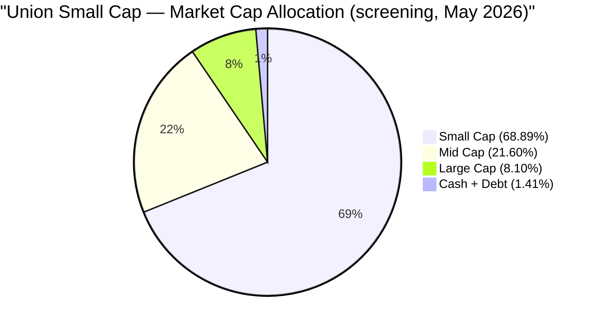

---

## ⭐ The Quality-Compounder Resolution — How the Holdings Explain the Paradox *(Union-specific)*

The single most important thing Module 3 does is resolve the M1/M2 paradox. Here is the evidence, holding by holding:

| Quality Compounder | Wt% | Why it protects (down-capture) | Why it's expensive (PE) |
|---|---|---|---|
| **GE T&D India** | 4.20% | Grid-transmission franchise; multi-year order visibility | Re-rated leader; *graduated to large-cap* |
| **Hitachi Energy India** | 2.81% | Premium grid/power-systems; technology moat | Among the richest multiples in the market |
| **Navin Fluorine** | 3.57% | High-ROCE specialty fluorochemicals; sticky contracts | Quality-chemical premium |
| **KEI Industries** | 2.51% | Cables market-share leader; brand + distribution | Re-rated compounder; *large-cap now* |
| **MCX** | 3.31% | Exchange monopoly; asset-light, zero credit risk | Toll-booth premium |
| **KFin Technologies** | 1.67% | RTA duopoly (CAMS peer); asset-light | Financialisation premium |
| **Radico Khaitan** | 1.93% | Premium-spirits franchise; pricing power | Consumer-premiumisation multiple |

**The mechanism:** durable-earnings businesses with pricing power and high ROCE **draw down less when small caps sell off on fundamentals** (earnings hold up, so price falls less) — this is the 47% down-capture. But the market *knows* they are high quality, so it **prices them at a premium** — this is the PE 38.79. The two are not a contradiction; they are **two consequences of the same quality bias.** Union is the study's clearest example of *quality-defensive* (vs Bandhan's *value-defensive*, PE 18.5) construction.

> **The corollary risk:** quality-defence works in *fundamentals-driven* sell-offs (2018, 2025 — where Union protected). It works *less well* in a *valuation-driven* de-rating, where expensive quality compresses hardest. Union's 2018 protection happened when these names were *cheaper*; whether today's PE-38.8 book defends as well in a *multiple-compression* bear is the one thing the quality thesis cannot guarantee. This is the precise portfolio-level expression of the M2 "rich-PE / thin-cushion" caveat.

---

## ⭐ The Let-Winners-Ride Signature — Three "Flaws" That Are One Style *(Union-specific)*

Three Union metrics look like separate weaknesses but are in fact a single coherent behaviour:

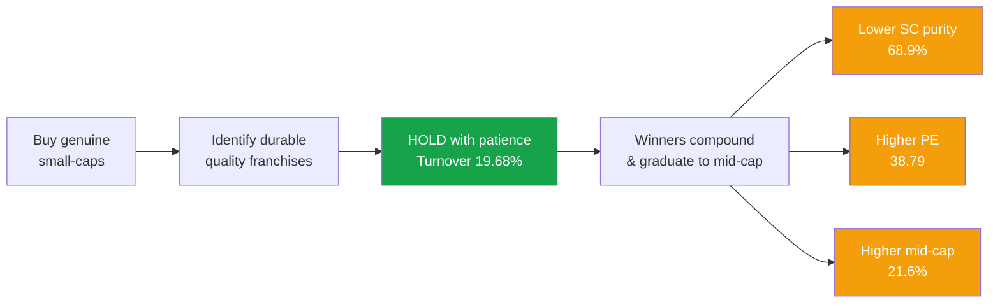

| The "Flaw" | The Reading as a Style |
|---|---|
| Small-cap purity only 68.9% (5th–6th of 8) | Winners *bought small* have *graduated to mid* and not been sold |
| PE 38.79 (2nd-highest) | Held compounders have *re-rated upward* over the holding period |
| Mid-cap 21.6% (highest of studied) | The graduated-winner bucket |
| **Turnover 19.68% (lowest disclosed)** | **The cause — patience lets all three happen** |

**The interpretive choice this forces:** if you believe a small-cap fund should *recycle* — sell winners as they graduate and redeploy into fresh small-caps to keep purity high (the DSP/BOI approach) — then Union's drift is a mild mandate weakness. If you believe a fund should *let quality compound* regardless of the cap label (the patient-quality approach), then Union's drift is a *feature* and the low turnover is a virtue (less transaction cost, less STCG, more compounding). **Both readings are defensible; the module scores it as a modest net negative for a *dedicated small-cap sleeve*, where small-cap exposure is the point — but credits the turnover discipline heavily.**

---

## The Smid-Cap Drift Question — Is Union Still a Small-Cap Fund? *(Union-specific)*

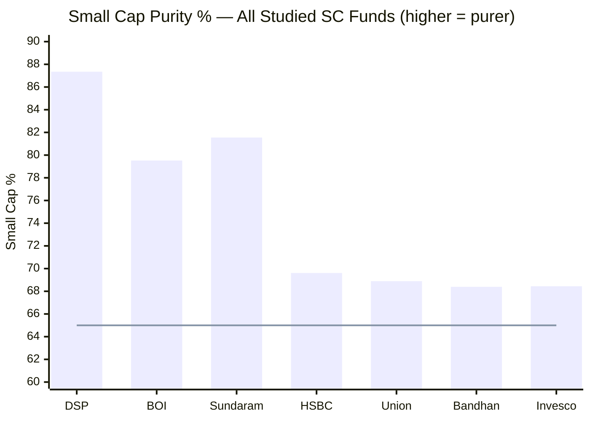
> Line = SEBI 65% minimum | Union (68.89%) sits just above the floor — only +3.9pp of headroom on the screening figure.

| Fund | Small Cap | Mid Cap | Large Cap | Identity |
|---|---|---|---|---|
| DSP SC | **87.35%** | 4.29% | ~0% | Purest |
| BOI SC | 79.52% | 12.57% | 3.44% | Nimble pure SC |
| HSBC SC | 69.5% | 27.0% | 2.1% | Smid-cap |
| **Union SC** | **68.89%** | **21.60%** | 8.10% | **Quality smid-cap drift** |
| Bandhan SC | 66.9% | 15.0% | 4.0% | Diffuse deep-value |
| Invesco SC | 65.1% | 19.6% | 13.8% | Multi-cap growth wrapper |

**The honest read:** at 68.89% small-cap (screening), Union has only **+3.9pp above the SEBI floor** — barely purer than Invesco (65.1%) and Bandhan (66.9%), and far below DSP (87%) and BOI (79.5%). For a ₹20,000/month SIP, roughly **₹13,800/month reaches genuine small caps** — meaningfully less than DSP (~₹17,500) or BOI (~₹15,900). The factsheet's 73.66% is more flattering (classification/date difference), but on either basis **Union delivers *less* pure small-cap exposure than its two higher-ranked peers.**

**The crucial mitigant:** the drift is *benign in origin.* Union is not buying mid-caps for safety (the way a struggling fund de-risks), nor sitting in cash. It is **letting genuinely small purchases ride into mid-cap as they succeed** — a quality-and-patience artefact, evidenced by the 19.68% turnover. That is a categorically different (and more defensible) reason for low purity than chasing momentum mid-caps. But for an investor whose *whole point* in this sleeve is small-cap exposure, the dilution is real and is the module's main reservation.

---

## Asset Allocation — Near-Fully Invested, Thinnest Buffer of the Tested Funds

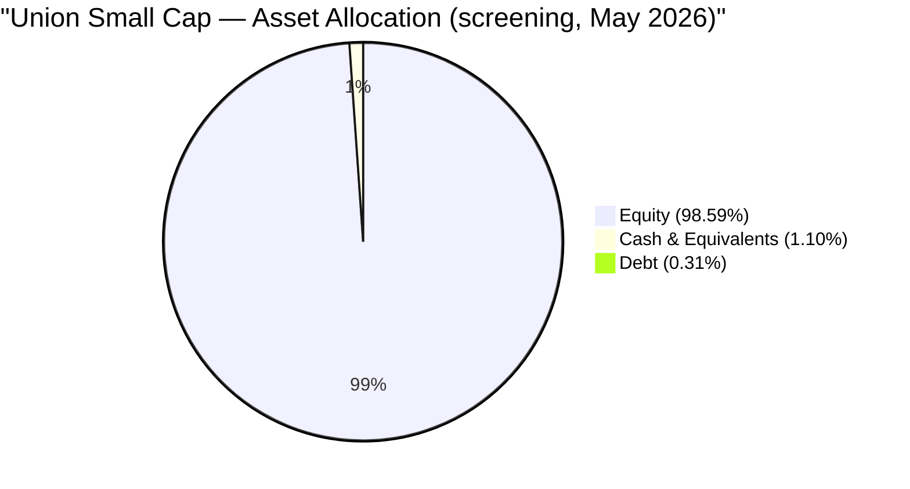

| Fund | Cash % | Implication |
|---|---|---|
| Invesco SC | 0.1% | Essentially zero |
| **Union SC** | **~1.1%** | **Thinnest of the genuine-history funds** |
| HSBC SC | 1.4% | Negligible |
| BOI SC | ~3.1% | Thin operational float |
| DSP SC | 8.4% | Meaningful war chest |
| Bandhan SC | 13.3% | Maximum dry powder |

Union runs **~1.1% cash + 0.3% debt** — essentially fully invested (98.59% equity), the thinnest buffer of the four genuinely-tested funds. Consequences:

1. **No opportunistic dry powder.** Unlike DSP's ₹1,499 Cr war chest, Union's ~₹22 Cr cash cannot fund meaningful dip-buying without trimming existing names. Its downside protection comes *entirely* from the quality of the book and its lower beta — not from a cash cushion.
2. **Near-full participation, both ways.** ~98.6% equity at beta 0.92 means Union participates in essentially all of a move — yet its *calendar* down-capture is still the best of the eight (47%), which is striking: it achieves best-in-study protection **with almost no cash buffer**, purely through stock quality and a lower-beta book. That is a more *fragile* form of protection than PP FlexiCap's structural cash/international buffer — but it has been *demonstrated* through two bears.

---

## Top 20 Holdings — Stock-by-Stock Analysis

Total portfolio: **~70 stocks**. Top 20 ≈ **53%** of assets; top holding only **4.20%** (no dominant position — a 50% collapse in GE T&D costs ~2.1% of NAV).

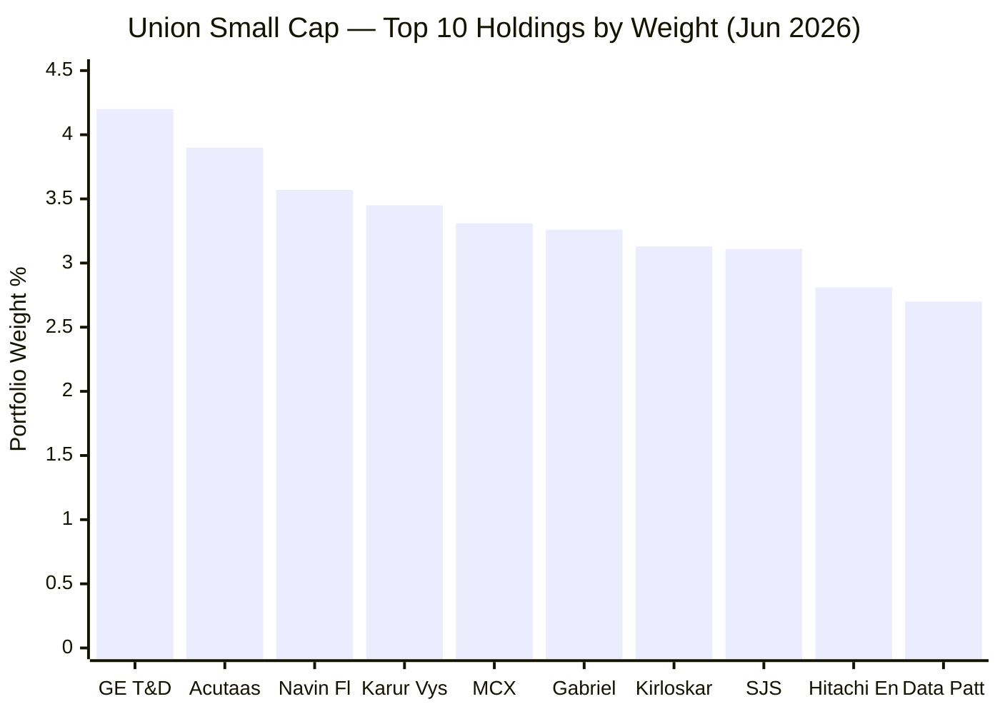

| # | Stock | Wt% | Sector | Investment Thesis | Cross-Fund |
|---|---|---|---|---|---|
| 1 | **GE T&D India** (GE Vernova T&D) | 4.20% | Electrical/Grid | Power-transmission equipment leader; grid-capex + energy-transition; large order book | Consensus power name |
| 2 | **Acutaas Chemicals** (ex-Ami Organics) | 3.90% | Specialty Chem | Pharma intermediates + specialty chem; China+1; rebranded 2025 | **Also BOI (#3)** |
| 3 | **Navin Fluorine International** | 3.57% | Specialty Chem | High-ROCE fluorochemicals; long-term CRAMS/agrochem contracts | Union-distinctive |
| 4 | **Karur Vysya Bank** | 3.45% | Bank | Old-private TN bank; conservative SME lending; improving RoA | **Also HSBC** |
| 5 | **MCX** | 3.31% | Capital Markets | Commodity-exchange monopoly; asset-light, zero credit risk | Quality financial |
| 6 | **Gabriel India** | 3.26% | Auto Components | Suspension/ride-control; EV-agnostic ancillary; restructuring optionality | Union-distinctive |
| 7 | **Kirloskar Oil Engines** | 3.13% | Industrial | Engines/gensets/power solutions; B2B capex | Union-distinctive |
| 8 | **SJS Enterprises** | 3.11% | Auto Components | Decorative aesthetics/logos; high-margin niche; acquisitive | Union-distinctive |
| 9 | **Hitachi Energy India** | 2.81% | Electrical/Grid | Premium grid/HVDC/power-systems; technology moat | Quality grid play |
| 10 | **Data Patterns** | 2.70% | Aerospace/Defence | Indigenous defence electronics; high-margin; order-book visibility | Union-distinctive |
| 11 | **KEI Industries** | 2.51% | Industrial/Cables | Cables & wires leader; brand + distribution moat; capex beneficiary | Quality compounder |
| 12 | **Ujjivan Small Finance Bank** | 2.36% | Bank | Microfinance-to-SFB; high-yield lending; transitioning book | Union-distinctive |
| 13 | **Azad Engineering** | 2.17% | Aerospace/Defence | Precision aero/energy components; global OEM supply; recent listing | Union-distinctive |
| 14 | **KIMS** | 2.07% | Hospitals | South-India hospital chain; bed expansion; affordable-premium | **Also BOI** |
| 15 | **JB Chemicals & Pharma** | 1.94% | Pharma | Branded domestic + CMO; chronic-therapy franchises | Quality pharma |
| 16 | **Radico Khaitan** | 1.93% | Beverages | Premium-spirits franchise; pricing power; premiumisation | Union-distinctive |
| 17 | **Eureka Forbes** | 1.83% | Consumer Durables | Water-purifier leader; post-demerger turnaround | Union-distinctive |
| 18 | **Amber Enterprises** | 1.82% | Consumer Durables | RAC contract-manufacturing leader; PLI beneficiary | Quality EMS |
| 19 | **Sai Life Sciences** | 1.75% | Pharma CDMO | Discovery-to-manufacturing CDMO; recent listing | Union-distinctive |
| 20 | **KFin Technologies** | 1.67% | Capital Markets | RTA duopoly (CAMS peer); asset-light financialisation toll-booth | Quality financial |

### Four Patterns in the Top 20

**Pattern 1 — Grid / electrical-capex is the lead spine (13.49%).**
GE T&D (transmission), Hitachi Energy (HVDC/grid), KEI (cables) — Union plays India's grid-buildout and energy-transition theme through *quality leaders*, several of which have re-rated to large-cap. This is thematically identical to BOI's and HSBC's power-capex tilt, but Union expresses it through the *premium, established* names rather than BOI's smaller, less-covered picks — a quality-over-nimbleness choice.

**Pattern 2 — Broad, multi-model healthcare (~14.6%).**
Acutaas (intermediates), Navin Fluorine (CRAMS-adjacent), JB Chemicals (branded), Sai Life (CDMO), KIMS (hospitals) — the *largest* theme in the book, spanning five different healthcare business models. A genuine, diversified healthcare conviction, not a single pharma bet.

**Pattern 3 — Asset-light, quality financials (no NBFC credit risk).**
MCX (exchange monopoly), KFin (RTA duopoly), Karur Vysya (conservative bank) lead, with only token NBFC exposure (Home First, PNB Housing < 1.3% each). The flagships — MCX and KFin — are **financialisation toll-booths with zero balance-sheet risk**, echoing DSP's (Prudent Corporate) and BOI's (CAMS) preference for fee-based financials over leveraged lenders. **Capital Markets alone is 9.21%.**

**Pattern 4 — Quality auto-ancillary cluster (9.78%).**
Gabriel (suspension), SJS (aesthetics) — niche, high-margin, EV-agnostic auto-component leaders. A distinctive Union tilt absent from most peers' top books.

---

## Differentiation vs Consensus — Moderate Overlap

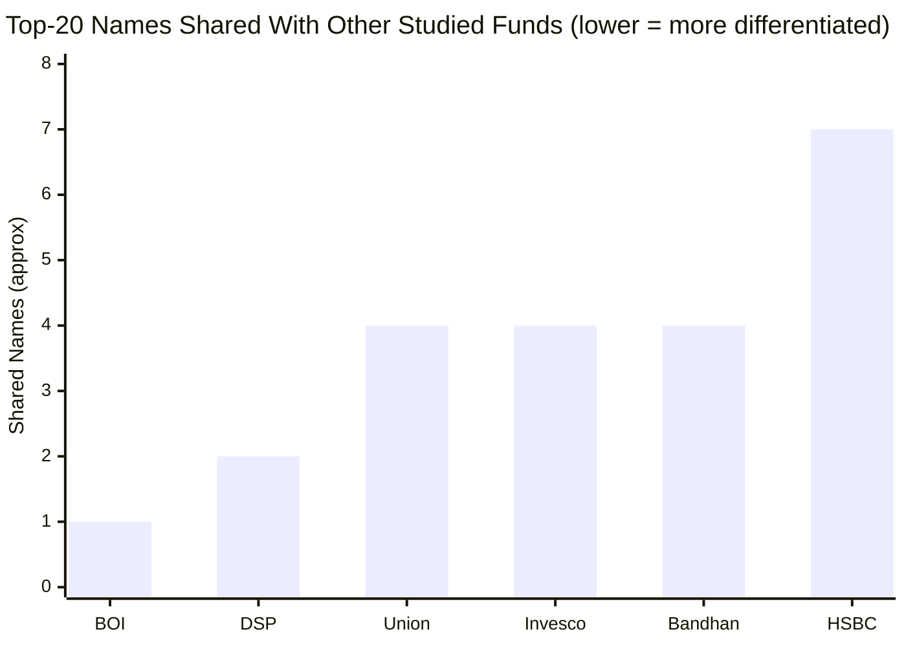

| Differentiation Test | Union | BOI | HSBC |
|---|---|---|---|
| Top-20 names shared with other studied funds | **~4** (GE T&D, Acutaas, KIMS, Karur Vysya; + Apar in the tail) | ~1 (Apar) | ~7 |
| R² (Module 2) | 90.6 (~9% independent) | 90.8 | 95.96 (index-hugging) |
| Information Ratio (Module 2) | +0.25 | **+0.938** | −0.61 |
| Distinctive top names | Navin Fluorine, Gabriel, SJS, Data Patterns, Radico | Wockhardt, Sky Gold, Lloyds Metals | (mostly consensus) |

Union sits **between BOI and HSBC** on differentiation — more overlap than BOI's ultra-distinctive book (~1 name), but far from HSBC's index-hugging (~7). It shares the *quality-consensus* names (GE T&D, KIMS, Karur Vysya, Acutaas) that several good funds independently like, while adding genuinely distinctive picks (Navin Fluorine, Gabriel, SJS, Data Patterns, Radico). This moderate overlap is the portfolio-level cause of Union's **modest computed IR (+0.25)**: a quality book that owns *some* of the same quality names everyone else owns will track the active universe more closely than BOI's idiosyncratic book — and so generates less *consistent* benchmark-relative alpha, even as its *risk-adjusted* return (Sharpe) leads.

---

## Sector Allocation — Healthcare + Grid-Capex + Asset-Light Financials, Across a Broad Book

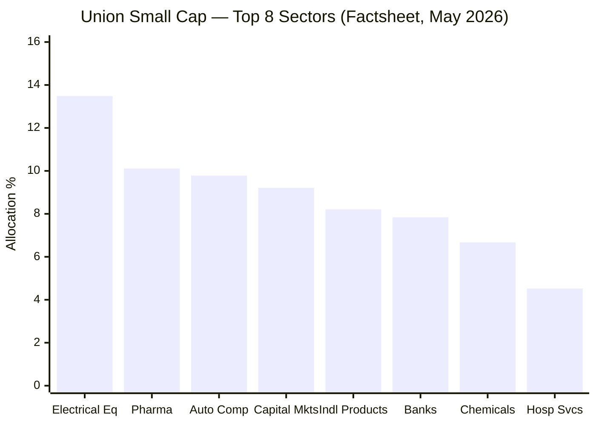
> These are the top 8 of **28 sectors** the fund holds — a broad, well-diversified book beneath three clear thematic spines.

| Sub-Sector | Union % | Read |
|---|---|---|
| **Electrical Equipment** | **13.49%** | Grid/transmission spine (GE T&D, Hitachi Energy) |
| **Pharmaceuticals & Biotech** | **10.11%** | Multi-model pharma (Acutaas, JB Chem, Sai Life) |
| **Auto Components** | **9.78%** | Quality ancillaries (Gabriel, SJS) |
| **Capital Markets** | **9.21%** | Asset-light financials (MCX, KFin) |
| Industrial Products | 8.21% | KEI, Kirloskar — capex |
| Banks | 7.84% | Karur Vysya, Ujjivan |
| Chemicals & Petrochem | 6.67% | Navin Fluorine |
| Healthcare Services | 4.52% | KIMS |
| Aerospace & Defence | 3.65% | Data Patterns, Azad |
| Consumer Durables | 3.65% | Amber, Eureka Forbes |
| (+ 18 more sectors) | balance | Long, diversified tail |

**Union's macro identity:** **"Healthcare + grid/electrical-capex + asset-light financials, expressed through quality leaders, across a broad 28-sector base."** Aggregating: **Financials ≈ 21%** (Banks 7.84 + Capital Markets 9.21 + Finance 3.50 + Insurance 0.74) — but quality/fee-tilted, not NBFC-heavy. **Healthcare ≈ 14.6%** (Pharma 10.11 + Hospitals 4.52) is the single largest theme. The **grid/electrical-capex lead (13.49%)** carries the same policy-sensitivity risk flagged for BOI and HSBC — a government-capex slowdown would pressure the cluster — but Union's version is expressed through *premium, established* names that are somewhat more resilient than smaller pure-capex plays.

---

## Portfolio Concentration Analysis

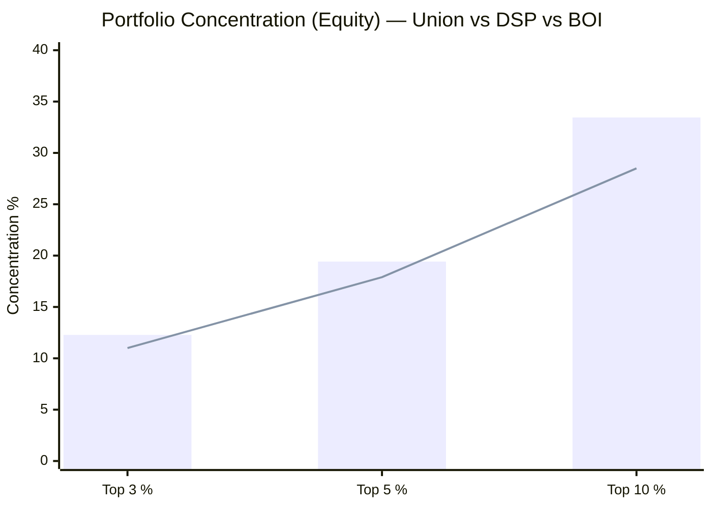
> Bar = Union | Line = DSP. Union is *more* concentrated at the top-10 (33.45% vs 28.5%) — meaningful conviction in its quality leaders.

| Metric | Union SC | DSP SC | BOI SC | HSBC SC | Bandhan SC |
|---|---|---|---|---|---|
| Total Stocks | **~70** | 81 | 84 | 109 | 239–256 |
| Top Holding % | 4.20% | **5.38%** | 3.86% | 3.65% | 3.49% |
| Top 3 % | 12.28% | ~11.0% | ~9.6% | 7.38% | 20.75% |
| Top 5 % | 19.42% | 17.9% | 15.0% | 11.50% | 24.55% |
| Top 10 % | **33.45%** | 28.5% | 26.6% | 20.38% | 18.9% |

**Union's concentration is the *highest top-10* of the deeply-studied quality funds (33.45%)** — more concentrated than DSP (28.5%) or BOI (26.6%), though far from a single-name bet (top holding only 4.20%). This is "conviction-diversified, tilted to conviction": ~70 stocks for breadth, but the top-10 genuinely drives returns. It is the construction profile of a manager who **holds high-conviction quality leaders at meaningful weight and lets the tail diversify the residual risk.** The long tail (positions ~21–70, ≈50 names at ~0.9% average) provides blow-up insurance without diluting the thesis.

---

## ⭐ Portfolio Turnover — 19.68%, DSP-Tier Patience *(now resolved with factsheet data)*

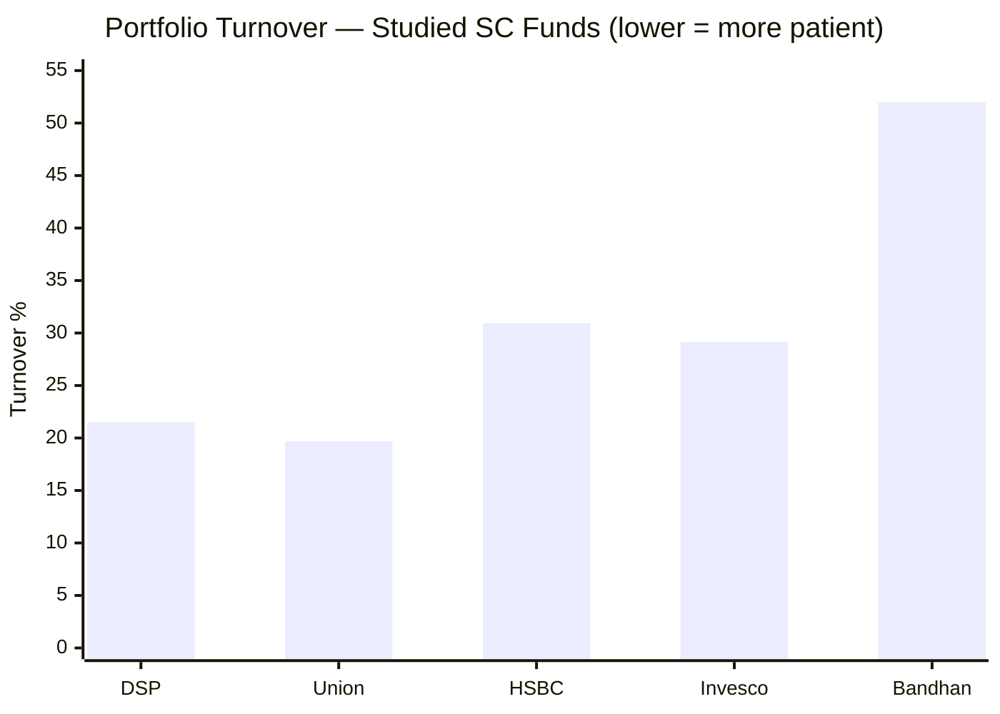
> Union's 19.68% is the **lowest of the funds where turnover is disclosed** — even marginally below DSP's ~19–24% range.

**Union's turnover (19.68%, AMC factsheet) is a genuine positive and a defining finding.** It confirms what the holdings imply: this is a **patient, buy-and-hold, let-winners-ride fund**, not a rotational one. Consequences:

1. **Low transaction-cost drag** — minimal brokerage/impact churn; a ~20% turnover keeps hidden trading costs low (a Module 4 input that *helps* offset the 2nd-highest headline ER).
2. **Low STCG friction** — patient holding means most gains are long-term-taxed; tax-efficient for a 10-year SIP.
3. **The cause of the smid-cap drift** — the *same* patience that earns these benefits is *why* winners graduate to mid-cap and purity falls to ~69%. The turnover discipline and the purity weakness are two sides of one coin.

This is the cleanest contrast with Bandhan (52% turnover, diffuse deep-value rotation): Union is the **patient quality-holder**, Bandhan the **active value-rotator** — opposite ends of the small-cap construction spectrum.

---

## Portfolio PE — 2nd-Highest of the Eight (the Clear Weakness — but Quality-Justified)

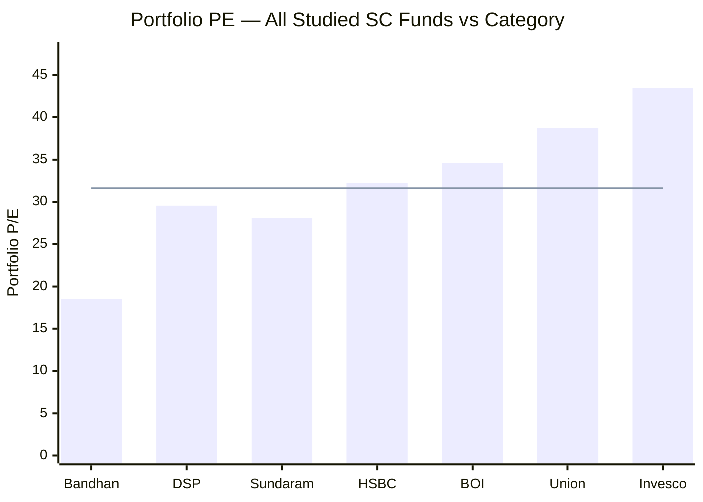
> Line = category average PE (31.60). Union at 38.79 trades a ~23% premium — no valuation cushion.

| Fund | PE | vs Category | Interpretation |
|---|---|---|---|
| Bandhan SC | 18.53 | −41% | Maximum valuation protection (deep value) |
| DSP SC | 29.54 | −6.5% | Meaningful cushion (quality-value) |
| HSBC SC | 32.25 | +2% | Slight premium |
| BOI SC | 34.63 | +9.6% | Above category |
| **Union SC** | **38.79** | **+23%** | **No cushion — but premium is quality-driven** |
| Invesco SC | 43.43 | +37% | Maximum fragility (growth) |

**Union's PE 38.79 is the portfolio's clearest weakness** — 23% above category, 2nd-richest of the eight. The crucial distinction from Invesco (43.43): **Union's premium is paid for *quality* (durable, high-ROCE compounders), whereas Invesco's is paid for *growth* (high-multiple new-economy names like Zomato/Trent).** Quality premiums are more *durable* in a sell-off than growth premiums — which is exactly why Union's down-capture (47%) is best-in-study while Invesco's is weaker. **But the cushion is thin either way:** in a *valuation-driven* de-rating (not Union's tested fundamentals-driven bears), an expensive book compresses hardest, and Union's ~1.1% cash gives no offset. The PE is the portfolio fingerprint of the M2 "rich-PE / thin-cushion" caveat — quality-mitigated, not eliminated.

---

## ⭐ AUM Advantage — Shared with BOI, Spent Differently *(Union-specific)*

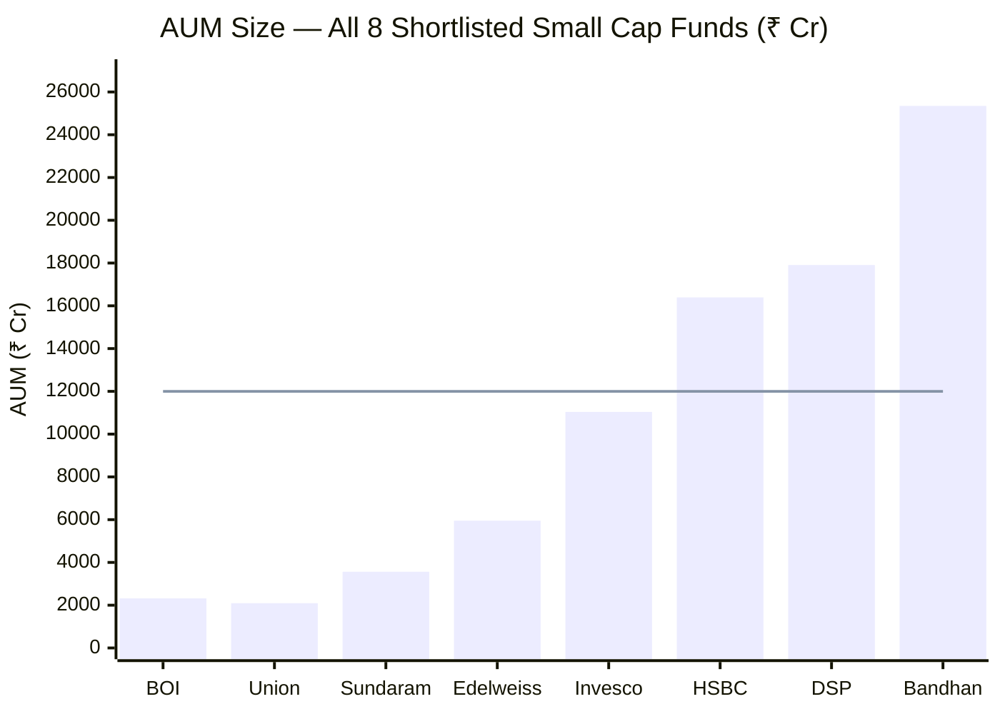
> Line = ~₹12,000 Cr threshold above which deployment friction becomes significant. Union (₹2,094 Cr) is the **2nd-smallest** — sharing BOI's nimble advantage.

Union and BOI are the two smallest funds in the shortlist, and both enjoy the same structural edge: a **1% position is only ~₹21 Cr**, giving full access to the inefficient micro-cap universe and zero deployment friction. **But the two funds spend the advantage on opposite philosophies:**

| Dimension | BOI (₹2,318 Cr) | Union (₹2,094 Cr) |
|---|---|---|
| 1% position | ~₹23 Cr | **~₹21 Cr** |
| Micro-cap access | Full | Full |
| **How the advantage is spent** | **Small-cap *purity*** (79.5% SC; micro-cap IPOs: Sky Gold, Quality Power) | **Quality** (holds premium compounders even as they graduate to mid-cap) |
| Result | Purest nimble book; differentiated | Quality book; lower purity, higher PE |
| Turnover | Undisclosed (IPO activity → moderate) | **19.68% (patient)** |

**The read:** both funds have the nimbleness edge that DSP/HSBC have structurally outgrown. BOI *exploits* it for micro-cap purity and differentiation (the source of its 0.938 IR). Union *under-uses* it for purity — it prefers to own quality leaders even when they're no longer small — and instead converts the small AUM into *patient, low-impact holding* of a concentrated quality book. Neither is wrong; they are two valid uses of the same structural gift.

**The flip side — redemption fragility (carry from M1/M2).** Like BOI, Union's small AUM means a sustained-outflow bear could force selling of illiquid names at distressed prices, with only ~1.1% cash as buffer (thinner than BOI's ~3%). **But unlike BOI, Union has *already weathered exactly this* — the 2018–20 winter at ~₹1,500–2,000 Cr AUM, fully recovered.** The redemption risk is real but *demonstrated-survivable* for Union, where it remains hypothetical for BOI.

---

## AUM Scalability & Liquidity — The Stress-Test Angle

| Scenario | Union (₹2,094 Cr) | BOI (₹2,318 Cr) | DSP (₹17,906 Cr) | HSBC (₹16,394 Cr) |
|---|---|---|---|---|
| 1% position | ₹21 Cr | ₹23 Cr | ₹179 Cr | ₹164 Cr |
| Est. days to liquidate 25% | **<10 days** | <10 days | 21–25 days | 15–20 days |
| Deployment friction | **None** | None | Significant | Significant |
| Alpha headroom from size | **High** | High | Constrained | Constrained |
| Redemption-wave vulnerability | **High (thin 1.1% cash) — but demonstrated-survivable** | High | Moderate | Moderate |

Union's small size gives it the **best liquidity profile for a going-concern** (fast, low-impact trading) and **high alpha headroom** — but the **highest redemption-wave vulnerability**, sharpened by the thinnest cash buffer of the tested funds. The decisive difference from BOI: **Union's redemption resilience is proven** (it round-tripped the 2018–20 winter at small AUM), whereas BOI's is untested. SEBI stress-test disclosures (M4) should quantify the liquidation days precisely.

---

## Manager-Style Continuity — Does the Book Reflect the Architect or the New Team? *(Union-specific)*

A unique Module 3 question for Union (carried from M1/M2): the **genuine 2018-tested record was built by Vinay Paharia (CIO 2018→Jan-2023)**, but the current book is run by **Gaurav Chopra (Nov-2024) + Pratik Dharmshi (Dec-2024)**. Does today's portfolio still express the quality-defensive DNA that earned the down-capture?

| Construction Signature | Paharia-era hallmark | Current book (this snapshot) | Continuity? |
|---|---|---|---|
| Quality-compounder bias | Strong | **Strong** (GE T&D, Navin, KEI, MCX) | ✅ Intact |
| Asset-light financials | Yes | **Yes** (MCX, KFin — Capital Markets 9.21%) | ✅ Intact |
| Low turnover / patience | Yes | **Yes (19.68%)** | ✅ Intact |
| Healthcare breadth | Yes | **Yes (~14.6%)** | ✅ Intact |
| Let-winners-ride (low SC purity) | Yes | **Yes (68.9%)** | ✅ Intact |

**Encouraging finding:** the *portfolio* shows strong stylistic continuity — the current book still looks like a Paharia-DNA quality-compounder fund (low turnover, quality leaders, asset-light financials, healthcare breadth). This suggests the defensive edge may be **at least partly institutional** (a house process) rather than purely personal to the departed Paharia — a meaningful, if provisional, positive for the M5 continuity question. The caveat: a portfolio *snapshot* shows *positioning*, not *decision-making quality under stress*; whether the new team *manages* the book as well in the next bear (vs merely *holding* an inherited one) remains the open M5 question. But on portfolio evidence alone, the style has transferred intact.

---

## Points For / Points Against (Portfolio Angle)

### ✅ Points For

1. **DSP-tier low turnover (19.68%)** — patient buy-and-hold; low transaction-cost and STCG drag; the lowest of the funds where it's disclosed
2. **Coherent quality-compounder identity** — genuinely *explains* the best-in-study down-capture (quality, not cheapness, is the protection)
3. **Asset-light financial bias** — MCX, KFin (Capital Markets 9.21%); avoids NBFC credit risk, echoing DSP/BOI
4. **AUM advantage (₹2,094 Cr, 2nd-smallest)** — full micro-cap access, no deployment friction; nimble
5. **Conviction-tilted concentration** — top-10 33.45% genuinely drives returns; top holding only 4.20% contains blow-up risk
6. **Three coherent multi-year themes** — healthcare (14.6%), grid/electrical-capex (13.5%), asset-light financials (~21% total)
7. **Distinctive quality picks** — Navin Fluorine, Gabriel, SJS, Data Patterns, Radico (genuine differentiation alongside the consensus quality names)
8. **Portfolio-level style continuity** — the current book still expresses the Paharia-era quality DNA (a positive signal for M5)
9. **Demonstrated small-AUM resilience** — round-tripped the 2018–20 winter at small AUM (the redemption-risk mitigant BOI lacks)

### ❌ Points Against

1. **Lowest small-cap purity of the deeply-studied non-Invesco funds (68.89%)** — the smid-cap drift; only +3.9pp above the SEBI floor; ~₹13,800 of a ₹20K SIP reaches genuine small caps
2. **Highest mid-cap allocation of the studied funds (21.6–24.1%)** — increasingly a "smid-cap" fund in practice
3. **Portfolio PE 38.79 — 2nd-highest (+23% vs category)** — no valuation cushion; quality-justified but thin in a de-rating
4. **Thinnest cash buffer of the tested funds (~1.1%)** — no dry powder; protection rests entirely on book quality + lower beta
5. **Moderate consensus overlap (~4 shared names)** — less differentiated than BOI; the cause of the modest computed IR
6. **Grid/electrical-capex theme is policy-sensitive (13.5%)** — exposed to government-capex continuity
7. **PB ratio undisclosed** — a minor data gap
8. **Redemption fragility from small AUM + thin cash** — mitigated by demonstrated 2018 survival, but still a structural vulnerability
9. **Style continuity is portfolio-deep only** — positioning has transferred; *stress-decision* quality of the new team is unproven (→ M5)

---

## Module 3 Scorecard

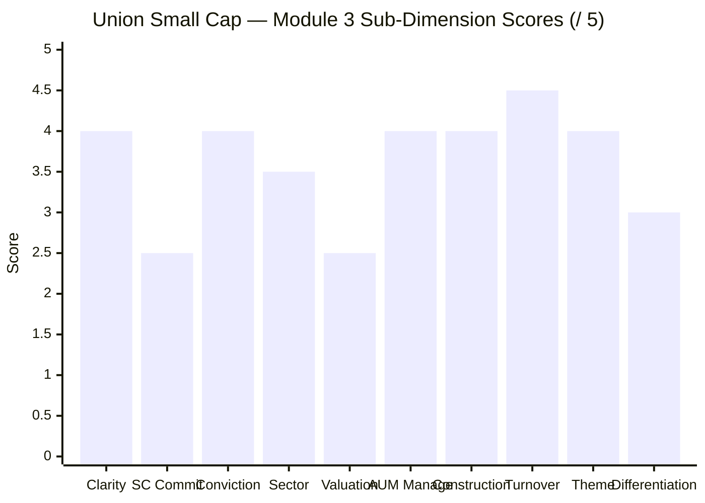

| Sub-Dimension | Score | Reasoning |
|---|---|---|
| Portfolio Clarity / Identity | **4.0** | Clear "patient quality-compounder with healthcare/grid/asset-light-financial spines"; coherent |
| Small Cap Commitment | **2.5** | 68.89% — 5th–6th of 8; only +3.9pp above floor; the smid-cap drift is the main weakness |
| Manager Conviction Quality | **4.0** | Top-10 33.45% (highest of quality funds); top holding 4.20% — conviction-tilted, blow-up-safe |
| Sector Positioning | **3.5** | Three coherent themes; grid-capex policy-sensitive; healthcare breadth a plus |
| Valuation Discipline | **2.5** | PE 38.79 — 2nd-highest; no cushion (but quality-justified, more durable than Invesco's growth premium) |
| AUM Manageability | **4.0** | ₹2,094 Cr — full micro-cap access, no friction; redemption risk mitigated by demonstrated 2018 survival |
| Portfolio Construction | **4.0** | ~70 stocks, conviction-tilted concentration; clean construction |
| Turnover & Cost Efficiency | **4.5** | **19.68% — DSP-tier; lowest disclosed; patient, tax-efficient** |
| Theme Quality | **4.0** | Healthcare + energy-transition/grid + financialisation — real multi-year themes via quality leaders |
| Peer Differentiation | **3.0** | Moderate overlap (~4 names); between BOI's distinctiveness and HSBC's index-hugging |
| **Module 3 Overall** | **~3.6 / 5** | **A coherent, patient, quality-compounder book whose low turnover (19.68%) and quality-defensive construction genuinely explain the best down-capture in the study — but which delivers less pure small-cap exposure (68.9%) at a richer valuation (PE 38.79) than its higher-ranked peers.** Above the HSBC/Bandhan/Invesco cluster on turnover discipline, quality coherence, and asset-light financials; below DSP (3.8) and BOI (3.7) on small-cap purity, valuation cushion, and differentiation. |

---

## Comparison with All Studied Funds

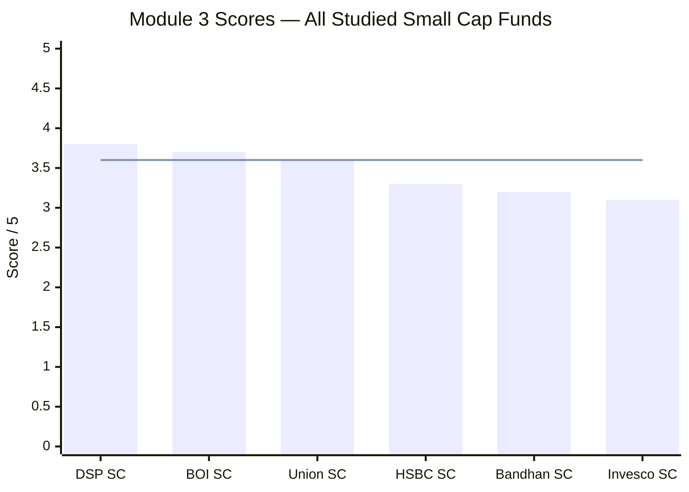
> Line = Union score (3.6) for reference

| Dimension | Union SC | DSP SC | BOI SC | HSBC SC | Invesco SC | Bandhan SC |
|---|---|---|---|---|---|---|
| Total Stocks | ~70 | 81 | 84 | 109 | 67 | 239–256 |
| Small Cap % | 68.89% | **87.35%** | 79.52% | 69.5% | 65.1% | 66.9% |
| Mid Cap % | **21.60%** | 4.29% | 12.57% | 27.0% | 19.6% | 15.0% |
| Cash % | ~1.1% | 8.38% | ~3.1% | 1.4% | 0.1% | 13.3% |
| Top Holding % | 4.20% | **5.38%** | 3.86% | 3.65% | 4.87% | 3.49% |
| Top-10 % | **33.45%** | 28.5% | 26.6% | 20.3% | 37.8% | 18.9% |
| Turnover | **19.68%** | ~21.5% | undisclosed | 30.93% | 29.17% | **51.96%** |
| Portfolio PE | 38.79 | 29.54 | 34.63 | 32.25 | 43.43 | **18.53** |
| AUM | **₹2,094 Cr** | ₹17,906 Cr | ₹2,318 Cr | ₹16,394 Cr | ₹11,038 Cr | ₹25,346 Cr |
| AUM as constraint | **Advantage** | High | **Advantage** | High | Low | Severe |
| Top-20 consensus overlap | ~4 (moderate) | Low | **~1 (lowest)** | ~7 (high) | Medium | Medium |
| Defining sector | Electrical 13.5% | Consumer Cyc 34.2% | Electrical 15.4% | Industrial 27.1% | Financials 27.7% | Financials 24.1% |
| Style | **Quality-compounder (let winners ride)** | Quality-value | Nimble pure SC | Broad smid-cap | Multi-cap growth | Diffuse deep-value |
| Module 3 Score | **3.6/5** | **3.8/5** | **3.7/5** | **3.3/5** | **3.1/5** | **3.2/5** |

**Union's distinctive positioning across all studied funds:**
- **Lowest disclosed turnover (19.68%)** — ties with DSP for the most patient, buy-and-hold construction
- **The clearest quality-defensive book** — quality (not value, not growth) is the explicit protection mechanism
- **Shares BOI's AUM advantage** — but spends it on quality rather than purity
- **The clear costs:** lowest small-cap purity of the quality funds (smid-cap drift) and the 2nd-highest PE (no cushion)

### vs Studied FlexiCap Funds

| Metric | Union Small Cap | DSP Small Cap | PP FlexiCap | BOI FlexiCap |
|---|---|---|---|---|
| Stocks | ~70 | 81 | ~25–30 | ~49–55 |
| Portfolio PE | 38.79 | 29.54 | ~22 | ~16–23 |
| Turnover | **19.68%** | ~21.5% | low | low |
| Cash buffer | ~1.1% | 8.4% | bonds + intl | none |
| AUM constraint | **Advantage** | High | Low (closed SIPs) | Very low |
| Style | Quality-compounder | Quality-value | Quality + buffer | Quality/growth |

Union's quality-compounder, low-turnover style is **philosophically closest to DSP and the FlexiCap quality houses** — but expressed at a *richer valuation* and with *less of a cash/structural buffer* than any of them. It is the "quality" archetype of the small-cap study, just with thinner margins of safety (valuation and cash) than the FlexiCap exemplars carry.

---

## SIP Implication

For a ₹20,000/month satellite SIP with a 10+ year horizon, Union's portfolio DNA is the study's **clearest "quality-compounder" build** — coherent, patient, and the structural explanation for its best-in-study downside protection, but delivering that protection through a *less pure, more expensive* small-cap book than its top two peers.

**What you are actually buying:** A patient (19.68% turnover), conviction-tilted book of ~70 high-quality franchises — grid-capex leaders (GE T&D, Hitachi), high-ROCE chemicals (Navin Fluorine, Acutaas), asset-light financials (MCX, KFin), branded healthcare (JB Chem, Sai Life), and quality auto-ancillaries (Gabriel, SJS) — bought genuinely small and *held as they compound up the cap spectrum*. This is the portfolio-level engine of the 47% down-capture: durable-earnings businesses defend in fundamentals-driven sell-offs. For a satellite SIP whose role (from the strategy doc) is a **volatility-dampening, quality leg beside a high-beta fund**, Union's construction is genuinely well-suited.

**What you must accept:** the lowest small-cap purity of the quality funds (**68.9%** — you are buying a *smid-cap* fund in practice, with ~₹13,800 of every ₹20K reaching genuine small caps), the **2nd-highest PE (38.79)** with no valuation cushion (quality-justified, but thin in a *valuation-driven* de-rating), the thinnest cash buffer of the tested funds (~1.1%), and the redemption fragility of the 2nd-smallest AUM (mitigated — uniquely — by *demonstrated* survival of the 2018–20 winter).

**What to monitor:**
1. **Small-cap purity** — if it drifts below ~65% the fund risks breaching its mandate and becoming a smid-cap fund in name too; watch whether the new team *recycles* graduated winners or keeps letting them ride.
2. **Portfolio PE** — at 38.79 it is already rich; a further rise toward 43+ (Invesco territory) would erode the quality-defence margin.
3. **AUM trajectory** — the nimble advantage holds only while small; success-driven bloat toward ₹8,000–10,000 Cr would import deployment friction.
4. **Style continuity** — the book *currently* reflects the Paharia-era quality DNA; watch whether the Chopra/Dharmshi team *sustains* the low turnover and quality bias, or drifts (the M5 question).

**SIP verdict:** Union Small Cap is a coherent, patient, quality-compounder fund whose construction genuinely explains its elite downside protection — the natural quality/low-volatility leg of a small-cap sleeve. For a ₹20K/month satellite with a 10Y+ horizon, the portfolio DNA supports it as a *complement* to a purer, higher-beta fund (BOI/DSP) — provided you accept that you are buying *quality smid-cap exposure at a premium valuation*, not the purest or cheapest small-cap book in the study.

---

## Comparative Module 3 Scores

| Fund | M3 Score | Portfolio Identity |
|---|---|---|
| **DSP SC** | **3.8/5** | Pure SC concentrated conviction; lowest turnover; AUM ceiling the constraint |
| **BOI SC** | **3.7/5** | Nimble pure SC; AUM advantage; differentiated non-consensus book; above-cat PE the constraint |
| **Union SC** | **3.6/5** | **Patient quality-compounder; DSP-tier turnover; best-explained down-capture; but lower SC purity + 2nd-highest PE** |
| HSBC SC | 3.3/5 | Broad smid-cap quality; index-hugging triad; consensus construction |
| Bandhan SC | 3.2/5 | Diffuse deep-value; lowest PE; highest cash drag; AUM-constrained |
| Invesco SC | 3.1/5 | Multi-cap growth wrapper; highest PE; mandate misalignment |

Union's M3 of 3.6/5 places it **third of the studied funds — just below BOI** — and on the dimensions DSP/BOI most prize, the verdict is split: Union *matches* DSP on turnover discipline and *shares* BOI's AUM advantage, but *trails both* on small-cap purity and valuation. The 0.1-point gap to BOI is the price of Union's lower purity (68.9% vs 79.5%), richer PE (38.79 vs 34.63), and greater consensus overlap (~4 vs ~1 names) — partly offset by Union's superior, *disclosed* turnover discipline and its demonstrated small-AUM crisis survival. It sits clearly above the HSBC/Bandhan/Invesco cluster, whose construction is either index-hugging, diffuse, or mandate-misaligned.

---

*Module 3 complete. Portfolio DNA is a patient, quality-compounder book: ~70 stocks, 68.89% small cap (the smid-cap-drift weakness), 21.6% mid cap (highest of studied), ~1.1% cash, PE 38.79 (2nd-highest — quality-justified), top-10 33.45% (conviction-tilted), turnover 19.68% (DSP-tier, the standout positive), built around healthcare + grid/electrical-capex + asset-light financials. The holdings resolve the M1/M2 paradox — Union protects via quality, not cheapness — and show strong portfolio-level continuity with the departed Paharia's style. Offsets: lower small-cap purity, no valuation cushion, moderate consensus overlap. Module 3 score: ~3.6/5.*

*Next: [Module 4 — Cost & AUM Impact](module4_cost.md)*
