# Module 4: Cost & AUM Impact — Union Small Cap Fund

*Sources: Union MF official factsheet (May 2026 — ER both plans, exit load, turnover, AUM) | Value Research Online (Jun 2026) | Groww / mStock / Paytm Money / ClearTax (min SIP, exit load) | Screening CSV (May 2026) | Angel One / Dezerv (AMC AUM, manager scheme loads) | AMFI | SEBI TER circular (2018). Benchmark = Nifty Smallcap 250 TRI (the fund's stated mandate benchmark is BSE 250 SmallCap TRI).*

---

## Module 4 Score: ~3.5 / 5 — The Mirror Image of BOI

Union Small Cap is, for cost-and-AUM, the **near-perfect inverse of BOI.** BOI's Module 4 was *"cheap AND nimble"* (the study's best cost package, 3.9/5). Union is *"expensive to own, but nimble, patient, and cleanly run."* It **shares BOI's single biggest M4 strength** — the AUM advantage (₹2,094 Cr, the 2nd-smallest fund, with full micro-cap access and zero deployment friction) — but **inverts BOI's biggest one**: where BOI is the 2nd-*cheapest* fund, Union is the **2nd-most-*expensive* (Direct ER 0.80–0.82%, only Sundaram higher).**

The expense ratio is the clear and dominant weakness. Almost everything else is favourable: a **disclosed, low turnover (19.68%)** that caps hidden costs and aids tax-efficiency (BOI's was an undisclosed gap), a **narrow Direct–Regular gap (0.93%)** — the 2nd-narrowest of the study and far better than BOI's 1.58% — the **most investor-friendly exit load in the shortlist (1% within just 15 days, nil thereafter)**, **moderate manager scheme-loads** (Dharmshi 6 / Chopra 5 — the anti-BOI's 23), and the **demonstrated small-AUM crisis resilience** (the 2018–20 winter survived at this size) that BOI lacks. The net is a fund whose *structure and execution* are genuinely strong but whose *price of admission* is the highest true-all-in of the group — landing it above the HSBC/Invesco/Bandhan cluster but below DSP and BOI.

---

## Raw Data (Compiled Across Sources)

| Metric | Value | Source | Notes |
|--------|-------|--------|-------|
| Expense Ratio (Direct Plan) | **0.80–0.82%** | Screening 0.80 / factsheet & VRO 0.82 | **2nd-priciest of 8** (only Sundaram 0.85 higher) |
| Expense Ratio (Regular Plan) | **1.75%** | Union factsheet (May-26) | Moderate — well below SEBI ceiling |
| Direct vs Regular Gap | **0.93%** | Computed (1.75 − 0.82) | **2nd-narrowest of the study** (after HSBC 0.70) |
| Exit Load | **1% if redeemed within 15 days; nil thereafter** | Union factsheet | **Most investor-friendly of the study** |
| AUM (Jun 2026) | **₹2,094 Cr** (AAUM May-26 ₹2,054 Cr) | VRO / factsheet | 2nd-smallest of 8 (after BOI) |
| Portfolio Turnover | **19.68%** | Union factsheet (May-26) | **Disclosed and low — DSP-tier** |
| 1% Position Size | **~₹21 Cr** | Computed | Full micro-cap access |
| Minimum SIP | **₹500** (Groww) / ₹100 (mStock) | Brokers | Accessible |
| Minimum Lumpsum | **₹1,000** | Brokers | Low bar |
| Fund Inception (Direct) | **17-Jun-2014** (NFO 10-Jun-2014) | MFAPI / AMC | Genuine 12-year history |
| Benchmark | Nifty Smallcap 250 TRI | AMC | Mandate: BSE 250 SmallCap TRI |
| Lead Managers | **Gaurav Chopra + Pratik Dharmshi** | Factsheet / addenda | Under CIO Patwardhan + Head-Equity Bembalkar |
| Chopra — schemes / AUM | **5 schemes / ~₹5,107 Cr** | Dezerv / 5paisa | Moderate load |
| Dharmshi — schemes / AUM | **6 schemes / ~₹5,266 Cr** | Dezerv / 5paisa | Moderate load |
| Union AMC Total AUM | **~₹16,000–17,000 Cr** | Search / AMC | Small AMC (larger than BOI ₹12K) |
| Wtd Avg Market Cap | **₹36,859 Cr** (vs bench ₹21,246 Cr) | Factsheet | Confirms smid-cap drift (M3) |
| Flow Restriction History | **None** | AMFI / AMC | Never needed (small fund) |
| VRO Star Rating | **4 ★** | Value Research | High |

> **Direct ER Note:** Screening shows 0.80%; the May-2026 AMC factsheet and VRO show 0.82%. **~0.81% central estimate** is used throughout. Either way, Union is the **2nd-most-expensive Direct plan of the 8 shortlisted funds**, behind only Sundaram (0.85%).

> **AMC AUM Note:** Union MF's total AUM is best stated as a **~₹16,000–17,000 Cr range** (one aggregator listed ₹26,633 Cr across "94 schemes," but that counts plan/option variants and is treated as an outlier). The distinct-fund count is ~15–20. Union is a **small AMC** — larger than BOI (~₹12,000 Cr) but a fraction of DSP (₹2.2 L Cr) or HSBC (₹1.37 L Cr).

---

## What Module 4 Is Really Asking

Module 4 answers three questions most investors skip:

**Question 1 — How much of your return is silently consumed by cost every year?**
Union's ~0.81% Direct ER is the **2nd-highest of the 8 shortlisted funds** — a permanent annual headwind materially larger than BOI's (0.48%) or DSP's (0.64%). Over a decade of SIP compounding, that higher drag is real money surrendered. This is Union's clear M4 weakness.

**Question 2 — Is the AUM so large the manager can no longer run the strategy?**
For DSP (₹17,906 Cr) and HSBC (₹16,394 Cr) the answer was unfavourable. **For Union, as for BOI, it is emphatically favourable: at ₹2,094 Cr the fund is nowhere near a capacity constraint.** A 1% position is only ~₹21 Cr, deployable in days with negligible market impact. The AUM is an *advantage*, not a drag.

**Question 3 — Is the institutional machine robust enough?**
Here Union's answer is *mixed-positive*: a small AMC (~₹16–17K Cr) constrains research budget, but — unlike BOI — the **managers are not stretched** (5–6 schemes each within a deep team) and the **turnover is disclosed and low.** The small-AMC concern is milder than BOI's.

---

## Expense Ratio — 2nd-Most-Expensive of the Shortlist

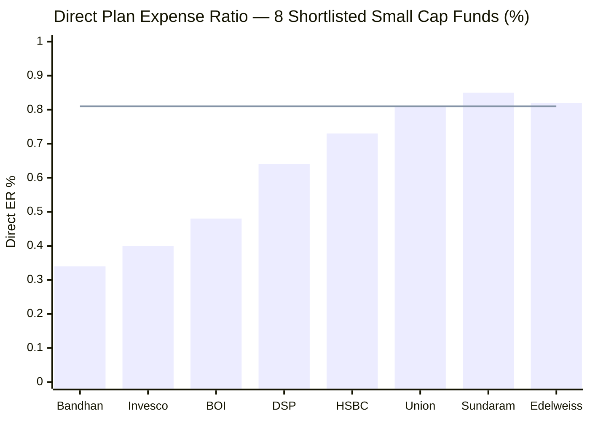
> Line = Union's ER (~0.81%) | Union is the 2nd-most-expensive of the 8 (Edelweiss 0.82 and Sundaram 0.85 are near it; the cheap cluster — Bandhan/Invesco/BOI — is far below).

**~0.81% Direct Plan** places Union among the **most expensive of the studied funds.** Among the deeply-studied set it is the clear cost laggard:

| Fund | Direct ER | AUM (₹ Cr) | Annual Cost per ₹100 | Studied Rank |
|------|-----------|-----------|----------------------|-------------|
| Bandhan Small Cap | **0.34%** | 25,346 | ₹0.34/year | 1st (cheapest) |
| BOI Small Cap | 0.48% | 2,318 | ₹0.48/year | 2nd |
| Invesco Small Cap | 0.59% | 11,038 | ₹0.59/year | 3rd |
| DSP Small Cap | 0.64% | 17,906 | ₹0.64/year | 4th |
| HSBC Small Cap | 0.73% | 16,394 | ₹0.73/year | 5th |
| **Union Small Cap** | **~0.81%** | **2,094** | **₹0.81/year** | **6th (most expensive studied)** |

**The BOI–Union contrast is the most instructive.** The two funds are near-twins on AUM (₹2,318 Cr vs ₹2,094 Cr) and on the nimble execution advantage — but Union charges ~0.81% to BOI's ~0.48%, **69% more expensive for a structurally similar small-AUM fund.** Two funds with the same biggest strength (smallness), opposite cost positions. For a Direct-plan investor weighing the two nimble micro-cap funds, BOI's cost edge is a genuine, recurring advantage.

**The mitigant — the ER buys a *better-credentialed, low-turnover, quality* book.** Union's higher ER is not "expensive because low quality": it is paired with a 4★ rating, the best risk-adjusted profile of the eight (Module 2), and a two-CA management team (Module 5). The cost is high, but the product is not cheap-and-cheerful. Still, on pure cost-for-cost, Union is the laggard of the nimble funds.

---

## ⭐ The Cost Paradox — Cheap to Run, Expensive to Own *(Union-specific)*

Union inverts the usual cost story. Most expensive funds are expensive because they *churn* (high turnover → high hidden trading costs). Union is the opposite: its **headline ER is high, but its hidden costs are *low*** — because its turnover (19.68%) is among the lowest in the category.

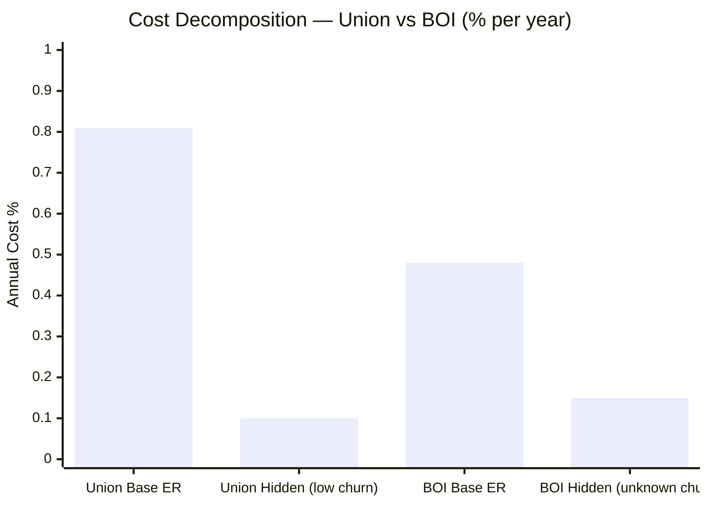
> Union's cost is **base-ER-dominated** (low churn adds little); BOI's is cheaper at base but carries more hidden-cost uncertainty.

| Cost Component | Union | Read |
|---|---|---|
| **Base ER (the wrapper)** | **0.81%** | High — the dominant cost; you pay for the *management*, not the *churn* |
| **Hidden / trading (the churn)** | **~0.08–0.12%** | Low — 19.68% turnover keeps impact/brokerage minimal |
| **STCG tax friction** | **Low** | Patient holding → most gains long-term-taxed (tax-efficient) |
| **True all-in (est.)** | **~0.88–0.92%** | Base-ER-dominated |

**The interpretive point:** Union is **"cheap to *run* but expensive to *own*."** A high-churn fund's cost is hidden and tax-inefficient; Union's cost is **transparent and tax-efficient** — it's almost entirely the visible ER, with little hidden drag and low STCG leakage. That is a *better-quality* form of cost than the same number achieved through churn (e.g. a hypothetical 0.50% ER + 0.40% churn = 0.90% all-in but tax-inefficient). The catch: even *transparent, tax-efficient* cost of ~0.90% all-in is **likely the highest true-all-in of the studied funds**, because a 0.81% base simply can't be offset by low turnover.

---

## ⭐ The Disclosed-Turnover Dividend *(Union-specific)*

A direct contrast with BOI's Module 4: where **BOI's turnover was undisclosed** (forcing its true-all-in to be a *range*), **Union's is disclosed and low (19.68%)** — so its true cost is a *point estimate*, and a tax-efficient one.

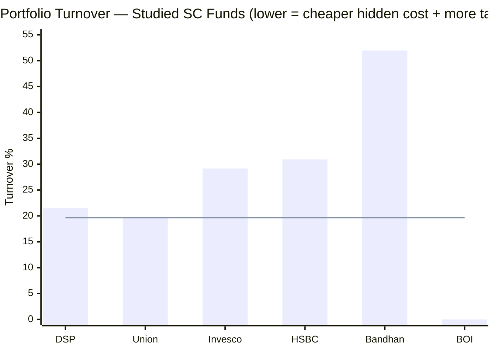
> Line = Union (19.68%). BOI shown as 0 = *undisclosed* (a genuine data gap in BOI's M4). Union's turnover is the **lowest disclosed** of the studied funds.

**Two dividends from the low, disclosed turnover:**
1. **Cost certainty.** Union's true all-in (~0.90%) is a *known point estimate*, not BOI's ~0.53–0.68% *range*. The investor knows what they pay.
2. **Tax efficiency.** At 19.68% turnover (DSP-tier patience), most gains are realised long-term and taxed at the lower LTCG rate — a real, if hard-to-quantify, after-tax benefit over a 10-year SIP versus a 52%-turnover fund like Bandhan.

This is the M4 expression of the Module-3 "let-winners-ride" style: patience that lowers hidden costs and taxes. It **partially offsets** the high headline ER — though not enough to make Union cheap.

---

## True All-In Cost — Likely the Highest of the Studied Funds

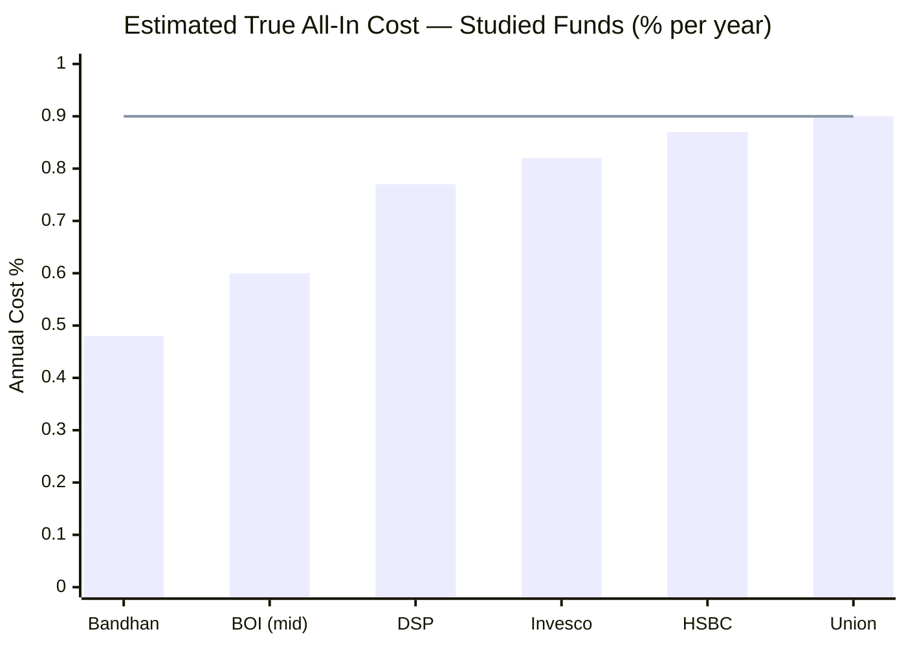
> Line = Union (~0.90%) | Union's true all-in is the highest of the studied group — the base ER dominates even with low churn.

| Fund | Stated Direct ER | Hidden Costs (est.) | True All-In | Note |
|------|-----------------|--------------------|-----------| ----|
| Bandhan SC | 0.34% | ~0.14% | ~0.48% | Cheapest |
| BOI SC | ~0.48% | ~0.05–0.20% | ~0.53–0.68% | Turnover unknown (range) |
| DSP SC | 0.64% | ~0.13% | ~0.77% | Low turnover (~20%) |
| Invesco SC | 0.59% | ~0.23% | ~0.82% | Higher turnover |
| HSBC SC | 0.73% | ~0.14% | ~0.87% | — |
| **Union SC** | **~0.81%** | **~0.08–0.12%** | **~0.88–0.92%** | **Highest base; low churn can't offset it** |

**The honest verdict:** despite the lowest-disclosed turnover, **Union's true all-in (~0.90%) is likely the highest of the studied funds** — because hidden costs (where its low turnover helps) are a *small* part of the total, and the *base ER* (where Union is the laggard) is the *large* part. Union pays a clean, transparent, tax-efficient ~0.90% — but ~0.90% is still ~0.90%, and it is the most of any fund here. The cost is the unambiguous M4 weakness.

---

## 10-Year SIP Cost Simulation — The Rupee Impact

**Methodology:** 18% gross CAGR assumed for all funds; Net CAGR = 18% − Direct ER; SIP ₹20,000/month for 10 years (₹24 lakh principal). Illustrative — gross returns are not identical in practice; the *relative* gaps are the point.

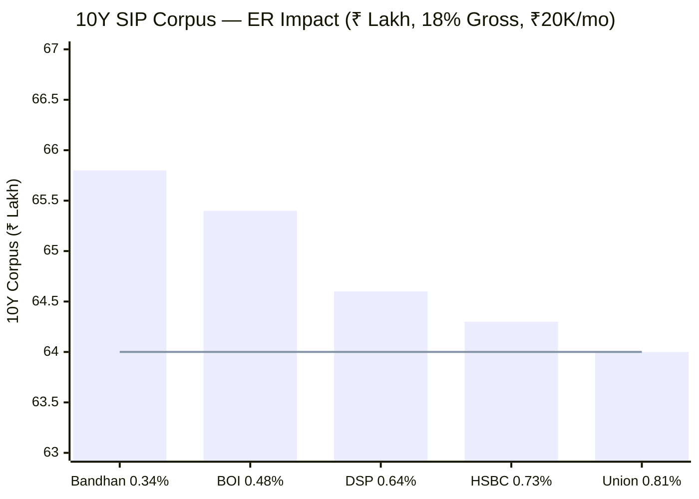
> Line = Union's corpus (~₹64.0L) | Union is the lowest of the studied funds on identical gross returns — purely from the ER drag.

| Fund | Direct ER | Net CAGR | 10Y Corpus | vs Union |
|------|-----------|----------|-----------|--------|
| Bandhan Small Cap | 0.34% | 17.66% | ₹65.8L | +₹1.8L |
| BOI Small Cap | 0.48% | 17.52% | ₹65.4L | +₹1.4L |
| DSP Small Cap | 0.64% | 17.36% | ₹64.6L | +₹0.6L |
| HSBC Small Cap | 0.73% | 17.27% | ₹64.3L | +₹0.3L |
| **Union Small Cap** | **~0.81%** | **17.19%** | **₹64.0L** | — |

**On identical gross returns, Union's higher ER costs the investor ~₹1.4L vs BOI and ~₹1.8L vs Bandhan over a 10-year ₹20K SIP** — purely from cost. At ₹50,000/month these gaps scale 2.5× (≈ −₹3.5L vs BOI). **The critical caveat (in Union's favour):** gross returns are *not* identical — Union has the best risk-adjusted profile and the best down-capture of the eight (Module 2). If its quality-compounder process adds gross return (especially in down markets), it can *more than* offset the cost gap. The ER drag is real and certain; the alpha offset is real but regime-dependent.

---

## Direct vs Regular Plan — A Narrow Gap (0.93%), the 2nd-Best of the Study

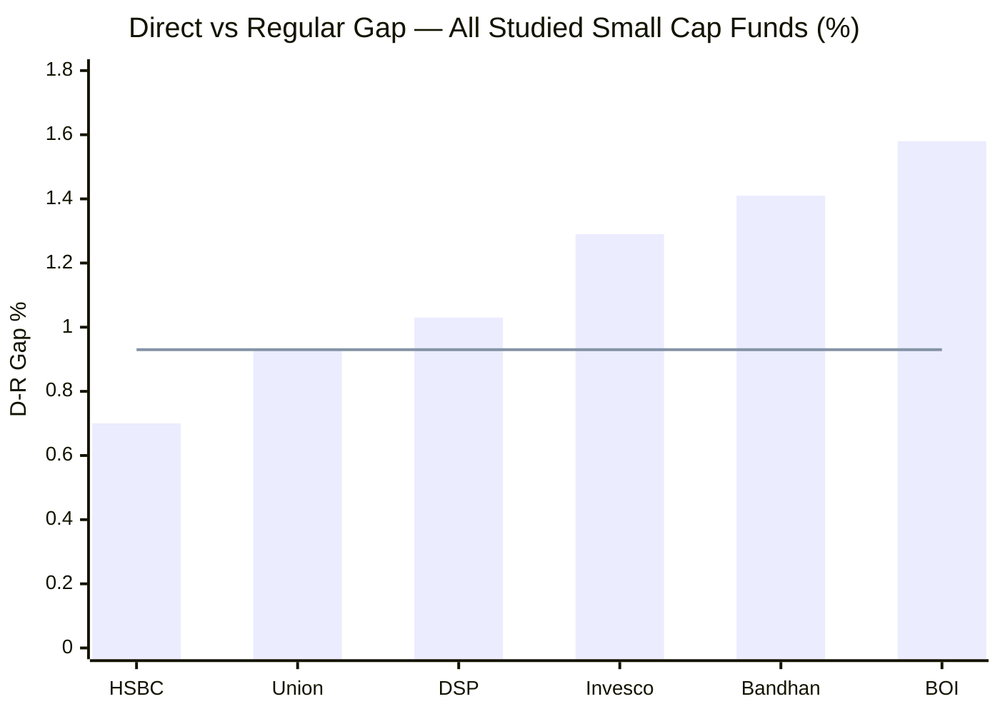
> Line = Union's D-R gap (0.93%) — the 2nd-narrowest of the study, far better than BOI's 1.58%

| Plan | ER | Net CAGR (18% gross) | 10Y Corpus | Lost to Distributor |
|------|----|----------------------|-----------|---------------------|
| **Direct** | **0.82%** | ~17.18% | **₹64.0L** | — |
| Regular | 1.75% | ~16.25% | ~₹60.4L | **~₹3.6L** |

**Union's 0.93% Direct–Regular gap is the 2nd-narrowest of the study** (after HSBC's 0.70%), and a stark contrast to BOI's study-widest 1.58%. The regular plan (1.75%) is *restrained* — well below the SEBI ceiling and below many peers' regular plans. Two consequences:

1. **The Direct penalty for going Regular (~₹3.6L over 10Y) is the 2nd-smallest of the study** — still meaningful (~15% of principal), so Direct remains the right choice, but the stakes are lower than for BOI (~₹6.6L) or Bandhan.
2. **Union's regular-plan discipline is a quiet positive** — it does not gouge regular-plan (distributor-channel) investors the way BOI's near-ceiling 2.07% does. For a small AMC, a restrained 1.75% regular ER signals it is not over-paying for distribution at the investor's expense.

**Still, go Direct.** Same fund, same ~70 stocks, same Chopra/Dharmshi — only the route differs. Direct plans are available commission-free on MF Central, Zerodha Coin, Kuvera, Groww Direct, INDmoney, Paytm Money, and unionmf.com.

---

## ⭐ The Ultra-Short Exit Load — The Most Investor-Friendly of the Study *(Union-specific)*

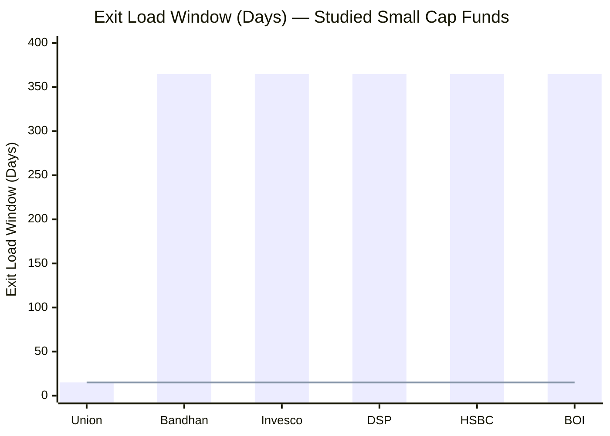
> Union's exit-load window is just **15 days** — every other studied fund uses 365 days.

**Union's exit load: 1% if redeemed within just 15 days of allotment; nil thereafter** (confirmed from the official factsheet). This is **dramatically more flexible than every other studied fund**, all of which impose the standard 1% / 365-day window:

| Fund | Exit Load | Window |
|------|-----------|--------|
| **Union** | **1%** | **15 days (nil after)** |
| Bandhan / Invesco / DSP | 1% | 365 days |
| HSBC / BOI | 1% (10% free) | 365 days |

**Why it matters (and where it doesn't):** for a 10-year SIP investor, every instalment ages past 15 days almost immediately, so the practical benefit is the same as any fund — *irrelevant to the buy-and-hold case.* But the ultra-short window is a genuine *flexibility* edge for anyone who might need to redeem early, rebalance, or exit a position within the first year: Union lets you out free after two weeks, where peers lock you for a full year. It is a small but real investor-friendly structural feature, and a signal of an AMC not relying on lock-ins to retain assets.

---

## ⭐ The AUM Advantage — Shared with BOI, but with Proven Resilience *(Union-specific)*

This is Union's defining M4 *strength* and the mirror of DSP's/HSBC's weakness — the same arithmetic that frees BOI frees Union:

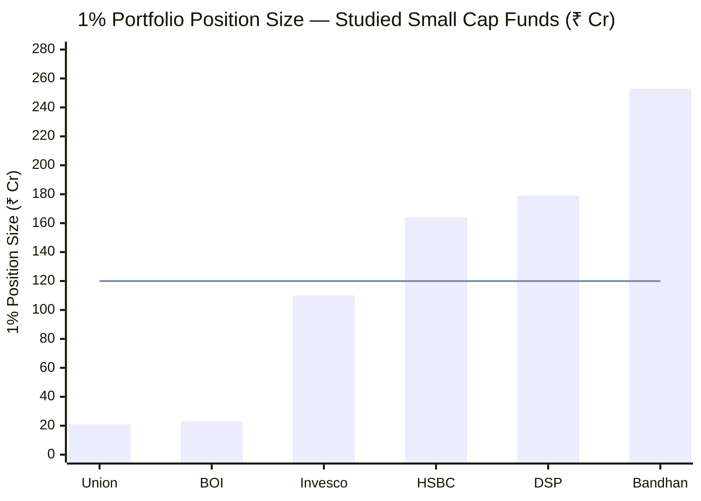
> Line = ~₹120 Cr threshold above which clean small-cap position-building takes 10+ days | Union is an order of magnitude below it.

| Dimension | Union (₹2,094 Cr) | BOI (₹2,318 Cr) | DSP (₹17,906 Cr) | HSBC (₹16,394 Cr) |
|-----------|-------------------|-----------------|------------------|-------------------|
| 1% position requires | **~₹21 Cr** | ~₹23 Cr | ₹179 Cr | ₹164 Cr |
| Clean entry/exit time | **1–3 days** | 1–3 days | 10–15 days | 10–14 days |
| Access to sub-₹2,000 Cr micro-caps | **Full** | Full | Largely closed | Largely closed |
| Forced-buyer dynamics | **None** | None | ₹200–350 Cr backlog | Near-compelled buyer |
| Cash buffer needed for flows | **~1.1% operational** | ~3% operational | 8.4% (queue) | 1.4% (forced) |
| Flow restrictions ever needed | **No — vast headroom** | No | Closed 3× | Never (problematic at scale) |
| **Crisis resilience at this AUM** | **PROVEN (2018–20 winter survived)** | Untested (no 2018) | Tested | Tested |

**Union's distinctive M4 edge over BOI: proven resilience.** Both funds enjoy the nimble micro-cap advantage. But Union has **demonstrated** how it behaves at small AUM through a genuine crisis — it round-tripped the 2018–20 small-cap winter at ~₹1,500–2,000 Cr and recovered to new highs (Module 2). BOI's identical-looking AUM advantage has **never** faced that test (no 2018). So Union's smallness carries the *same* upside (execution headroom, alpha access) with *less* unproven downside (redemption fragility) — the one place Union's longer, genuine history beats BOI's on a shared structural trait.

**The "stay small" caveat applies equally.** Union's edge — cheap-amortisation aside — depends on staying nimble. Strong performance and the 4★ rating could drive AUM toward ₹8,000–10,000 Cr, at which point Union begins to inherit DSP/HSBC-style deployment friction. As with BOI, **monitor AUM and treat a move above ~₹8,000 Cr without flow control as a yellow flag.**

---

## ⭐ Manager Bandwidth — The Anti-BOI *(Union-specific)*

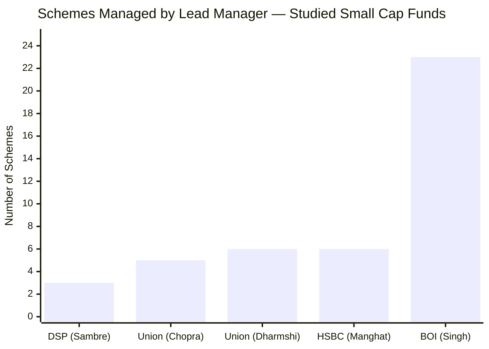

Union's small-AMC status does **not** produce a stretched-manager problem. Its leads carry **moderate scheme loads — Chopra 5 (~₹5,107 Cr), Dharmshi 6 (~₹5,266 Cr)** — within a deep team (CIO Patwardhan + Head-Equity Bembalkar + Co-Head Bora + three FMs). This is the **direct inverse of BOI**, whose lead Alok Singh is stretched across **23 schemes** as a near-solo equity engine.

**The M4 implication:** where BOI's cheap, nimble fund sits on a *thin, stretched* management base (the offset to its 3.9 score), Union's *expensive*, nimble fund sits on a *deep, unstretched* one. Union swaps BOI's cost advantage for a bandwidth-and-bench advantage. For the "is the institutional machine robust?" question, Union's answer is **better** than BOI's — the AMC is small, but the managers are not over-loaded and the bench is genuine (Module 5).

---

## The Small-AMC Trade-off — Milder than BOI's

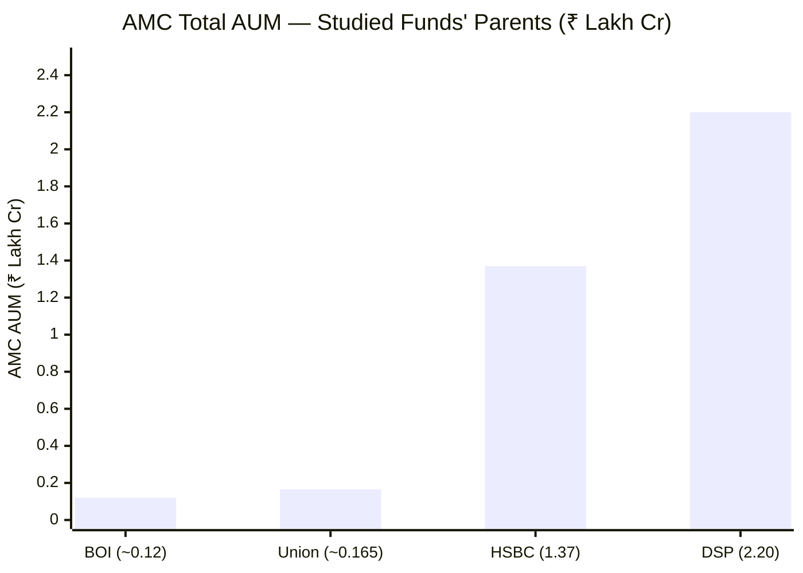

| Dimension | Union | BOI | DSP | HSBC |
|-----------|-------|-----|-----|------|
| AMC total AUM | **~₹16–17K Cr** | ~₹12K Cr | ₹2,20,000 Cr | ₹1,36,788 Cr |
| Est. revenue (this fund) | **~₹17–20 Cr** | ~₹13–15 Cr | ~₹179 Cr | ~₹170 Cr |
| Manager bandwidth | **Moderate (5–6 schemes)** | Stretched (23) | Focused (3) | Medium (4–7) |
| Research-funding capacity | **Constrained** | Constrained | Deep | Deep (+ global) |
| Parent | Union Bank of India + Dai-ichi Life (Japan) | Bank of India (govt) | DSP Group | HSBC plc |

Union is a **small AMC (~₹16–17K Cr)** — slightly larger than BOI, far below DSP/HSBC. The same structural constraint applies: thin fund revenue (~₹17–20 Cr) funds a smaller research bench than DSP's/HSBC's ~₹170–179 Cr. **But Union's small-AMC trade-off is milder than BOI's in two ways:** (1) the managers are *not* stretched (5–6 schemes vs Singh's 23), so the thin budget is not compounded by over-loading; and (2) the **parent mix is reassuring** — Union Bank of India (a large public-sector bank) plus **Dai-ichi Life Holdings of Japan** (a major global insurer) lends balance-sheet stability and a foreign-institutional governance overlay. The research-depth gap vs DSP/HSBC is genuine, but the institutional base is steadier than the AUM figure alone suggests. (Full AMC assessment → Module 6.)

---

## SEBI TER Positioning — Restrained at the Regular-Plan Level

At ₹2,094 Cr, more of Union's AUM sits in the higher-TER low-AUM slabs, so the regulatory ceiling is structurally higher than for DSP/HSBC. Yet Union's *actual* regular ER (1.75%) sits comfortably below it:

| AUM Slab | SEBI Max TER | Union AUM in Slab |
|----------|-------------|-----------------|
| First ₹500 Cr | 2.25% | ₹500 Cr |
| Next ₹250 Cr | 2.00% | ₹250 Cr |
| Next ₹1,250 Cr | 1.75% | ₹1,250 Cr |
| Next ₹3,000 Cr | 1.60% | ₹94 Cr |
| **Blended SEBI Max (Regular)** | **~1.88%** | — |
| + B30 incentive (if any) | +0.30% | — |
| **Union Actual Regular ER** | **~1.75%** | **~0.13% below blended ceiling** |

Union's regular ER (1.75%) sits a meaningful **~0.13% below the blended ceiling** — *more* restrained than BOI's near-ceiling 2.07%. This is a quiet governance positive: a small AMC that is **not** maximising its regulatory headroom on the distributor-facing plan. The *direct* plan (the target audience), at ~0.81%, is the cost weakness — but it reflects the AMC's pricing of its *own* management, not over-payment for distribution.

---

## 8-Fund Cost & AUM Comparison Matrix

| Metric | **Union SC** | DSP SC | BOI SC | HSBC SC | Bandhan SC | Invesco SC |
|--------|--------------|--------|--------|---------|------------|------------|
| Direct ER | **~0.81%** | 0.64% | **0.48%** | 0.73% | **0.34%** | 0.59% |
| ER Rank (studied) | **6th (priciest)** | 4th | 2nd | 5th | 1st | 3rd |
| Regular ER | **1.75% (restrained)** | ~1.67% | ~2.07% | ~1.43% | ~1.75% | ~1.88% |
| D-R Gap | **0.93% (2nd-narrowest)** | 1.03% | **1.58% (widest)** | **0.70%** | 1.41% | 1.29% |
| Exit Load | **1% / 15 days (best)** | 1%/365d | 1%/365d +10% | 1%/365d +10% | 1%/365d | 1%/365d |
| AUM (₹ Cr) | **2,094 (2nd-smallest)** | 17,906 | 2,318 | 16,394 | 25,346 | 11,038 |
| AUM as constraint | **Advantage (proven)** | High | Advantage | High | Severe | Low |
| 1% Position | **₹21 Cr** | ₹179 Cr | ₹23 Cr | ₹164 Cr | ₹253 Cr | ₹110 Cr |
| Turnover | **19.68% (low, disclosed)** | ~20% | Undisclosed | ~31% | ~52% | ~29% |
| True All-In (est.) | **~0.90% (highest)** | ~0.53–0.68% | ~0.77% | ~0.87% | ~0.48% | ~0.82% |
| Min SIP | ₹500 / ₹100 | **₹100** | ₹1,000 | ₹500 | ₹1,000 | ₹1,000 |
| Mgr scheme load | **5–6 (moderate)** | 3 | **23 (most)** | 4–7 | — | 4–5 |
| AMC Total AUM | ~₹16–17K Cr | ₹2.2L Cr | ~₹12K Cr | ₹1.37L Cr | — | — |
| Flow Restriction History | None (too small) | 3 closures | None | None | None | None |
| M4 Score (this study) | **~3.5/5** | 3.7/5 | **3.9/5** | 3.2/5 | ~3.3/5 | ~3.1/5 |

**Key observations:**
1. **Union's cost is its weakness — 2nd-priciest ER and the highest true all-in** of the studied funds.
2. **Union's structure is its strength** — AUM advantage (proven through 2018), low disclosed turnover, moderate manager loads, narrow D-R gap, best-in-study exit load.
3. **Union vs BOI is the cleanest contrast** — same AUM advantage, opposite cost positions; BOI wins decisively on ER, Union wins on manager bandwidth, D-R gap, exit load, disclosed turnover, and proven resilience.
4. **The cost is partly redeemed by quality** — the high ER buys the best risk-adjusted, best-down-capture, two-CA-managed book of the eight; whether that justifies the premium is the investor's call.

---

## Points For / Points Against — Cost & AUM

### ✅ Points For

1. **AUM advantage (₹2,094 Cr), with proven resilience** — full micro-cap access, 1–3 day execution, no deployment friction; *and* demonstrated survival of the 2018–20 winter at this size (the edge BOI's untested AUM lacks)
2. **Low, disclosed turnover (19.68%)** — DSP-tier patience; caps hidden costs, aids tax-efficiency; a *point* estimate where BOI's was a range
3. **2nd-narrowest Direct–Regular gap (0.93%)** — restrained regular plan; far better than BOI's 1.58%; lower Direct penalty
4. **Most investor-friendly exit load of the study (1% / 15 days)** — genuine early-redemption flexibility
5. **Moderate manager bandwidth (5–6 schemes each)** — the anti-BOI; deep, unstretched team
6. **Restrained regular-plan ER (1.75%, ~0.13% below ceiling)** — does not gouge distributor-channel investors
7. **Reassuring parent mix** — Union Bank of India + Dai-ichi Life (Japan) institutional backing
8. **No forced-buyer dynamics** — small AUM absorbs flows effortlessly; ~1.1% cash is operational
9. **Cost is transparent and tax-efficient** — base-ER-dominated, not hidden-churn-driven

### ❌ Points Against

1. **2nd-most-expensive Direct ER of the 8 (~0.81%)** — the dominant cost weakness; ~₹1.4L less than BOI over a 10Y ₹20K SIP on equal gross returns
2. **Highest true all-in of the studied funds (~0.90%)** — low turnover can't offset the high base ER
3. **Small AMC (~₹16–17K Cr)** — constrained research budget vs DSP/HSBC (though milder than BOI's, given the unstretched managers)
4. **The advantage is contingent on staying small** — strong performance could bloat AUM and erode the execution edge
5. **No flow-management track record** — never restricted flows; untested on whether the AMC would protect the strategy at scale
6. **First-time flagship leads (M5 cross-link)** — the deep bench mitigates, but the named managers are unproven (a quality-of-management cost consideration)

---

## Module 4 Scorecard

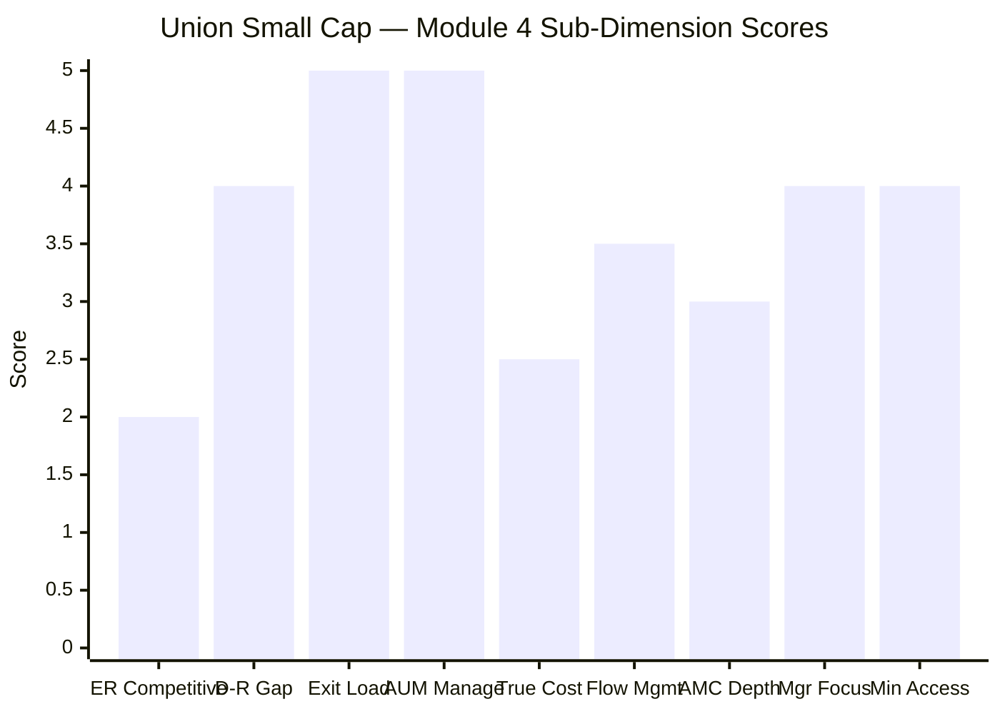

| Sub-Dimension | Score (1–5) | Reasoning |
|---------------|------------|-----------|
| Expense Ratio Competitiveness | **2.0** | ~0.81% — 2nd-priciest of 8; the clear cost weakness; 69% above BOI |
| Direct vs Regular Gap | **4.0** | 0.93% — 2nd-narrowest of study; restrained regular plan; far better than BOI |
| Exit Load Structure | **5.0** | 1% / 15 days — the most investor-friendly of the entire study |
| AUM Manageability | **5.0** | ₹2,094 Cr — full micro-cap access, no friction, *and* proven through 2018; best-in-class with BOI |
| True (Turnover-Adj) Cost | **2.5** | ~0.90% — likely the highest of the studied funds; low turnover can't offset the high base |
| Flow Management | **3.5** | Vast headroom (no restriction needed); but no investor-first gate-keeping track record |
| AMC Institutional Depth | **3.0** | Small AMC (~₹16–17K Cr); thin research budget; but steadier parent mix than BOI and unstretched managers |
| Fund Manager Focus | **4.0** | 5–6 schemes per lead; deep team; the anti-BOI on bandwidth |
| Minimum Accessibility | **4.0** | ₹500/₹100 SIP, ₹1,000 lumpsum — accessible |
| **Module 4 Overall** | **~3.5 / 5** | **The mirror image of BOI: nimble, patient, and cleanly structured — but expensive to own.** Shares BOI's AUM advantage (with the bonus of *proven* 2018 resilience), adds a low disclosed turnover, a narrow D-R gap, the best exit load of the study, and unstretched managers — but carries the 2nd-priciest ER and the highest true all-in of the group. The structure earns a strong score; the cost caps it below DSP and BOI. |

---

## Comparative Module 4 Scores

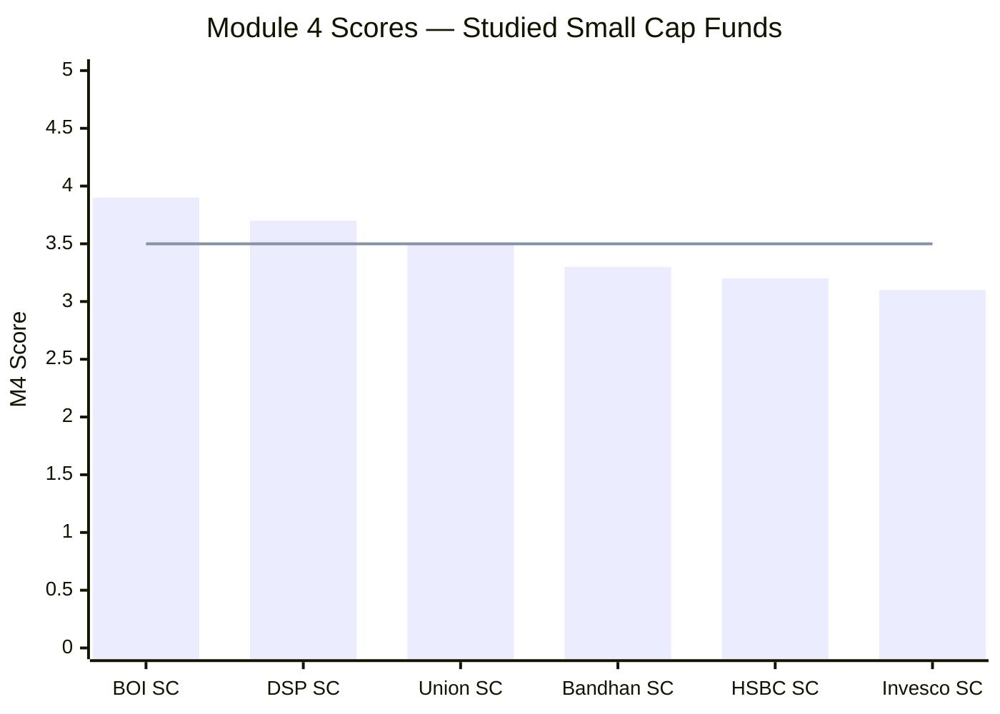
> Line = Union's M4 score (~3.5)

| Fund | Module 4 Score | Key Cost/AUM Differentiator |
|------|---------------|-----------------------------|
| BOI Small Cap | **3.9/5** | 2nd-cheapest ER + best execution headroom; offset by small AMC, 23-scheme manager, widest D-R gap |
| DSP Small Cap | 3.7/5 | Best flow-management history; lowest turnover; deep AMC; mid ER + large-AUM constraint |
| **Union Small Cap** | **~3.5/5** | **AUM advantage (proven) + low disclosed turnover + narrow D-R gap + best exit load + unstretched mgrs; capped by the 2nd-priciest ER and highest true all-in** |
| Bandhan Small Cap | ~3.3/5 | Cheapest ER + true all-in; but open-door at ₹25,346 Cr (severe AUM constraint) |
| HSBC Small Cap | 3.2/5 | Narrowest D-R gap; but expensive ER, poor true all-in, zero flow management |
| Invesco Small Cap | ~3.1/5 | Decent ER + manageable AUM; lower AMC depth |

**Union takes the middle M4 slot — above the HSBC/Bandhan/Invesco cluster, below DSP and BOI.** The logic: Union shares BOI's best-in-class AUM/execution position (and beats BOI on manager bandwidth, D-R gap, exit load, and disclosed-turnover certainty), but loses decisively on the single most important M4 lever — the expense ratio. BOI's cheap-plus-nimble package (3.9) and DSP's flow-discipline-plus-depth (3.7) both edge Union's nimble-but-expensive profile. Union sits clearly above the cluster because its *structural* quality (AUM, turnover, bandwidth, exit load) is genuinely strong — only the cost holds it back.

---

## One-Line Verdict

Union Small Cap is the mirror image of BOI on cost and AUM — it shares the best-in-class nimble execution advantage (₹2,094 Cr, ₹21 Cr per 1% position, and uniquely *proven* through the 2018–20 winter), pairs it with a low disclosed turnover, a narrow Direct–Regular gap, the most investor-friendly exit load of the study, and unstretched managers — but carries the 2nd-most-expensive expense ratio (~0.81%) and the highest true all-in cost (~0.90%) of the studied funds, landing it at ~3.5/5: structurally excellent, but the costliest to own.

---

*Module 4 complete. Cost & AUM is a story of strong structure undercut by a high price: the AUM advantage (proven through 2018), low disclosed turnover (19.68%), narrow D-R gap (0.93%), best-in-study exit load (15 days), and unstretched managers are all genuine positives — but the 2nd-priciest Direct ER (~0.81%) and the highest true all-in (~0.90%) are the dominant weakness. Module 4 score: ~3.5/5.*

*Next: [Module 6 — AMC Quality](module6_amc.md)*
