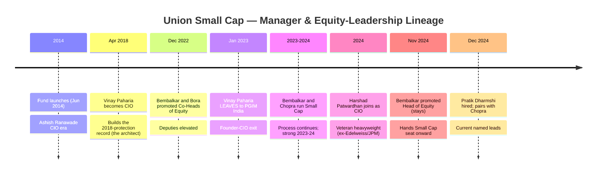
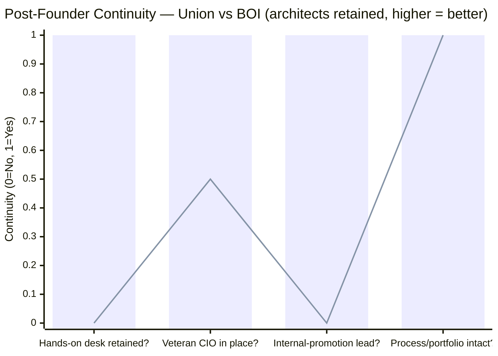
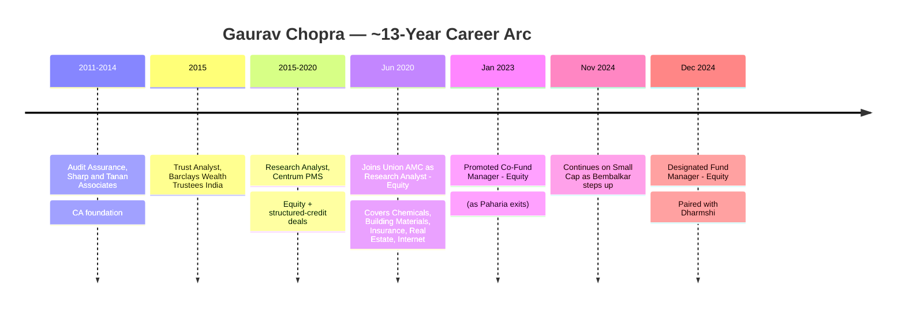
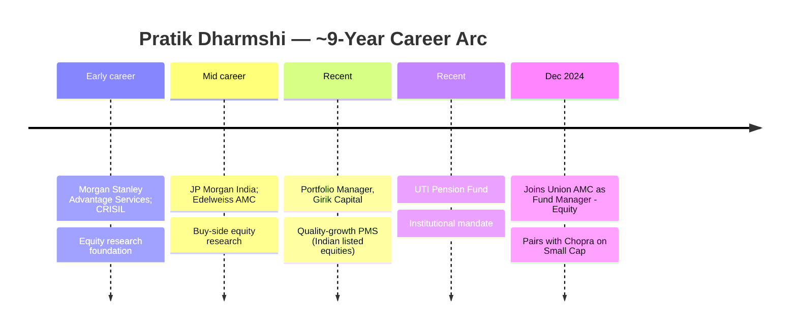
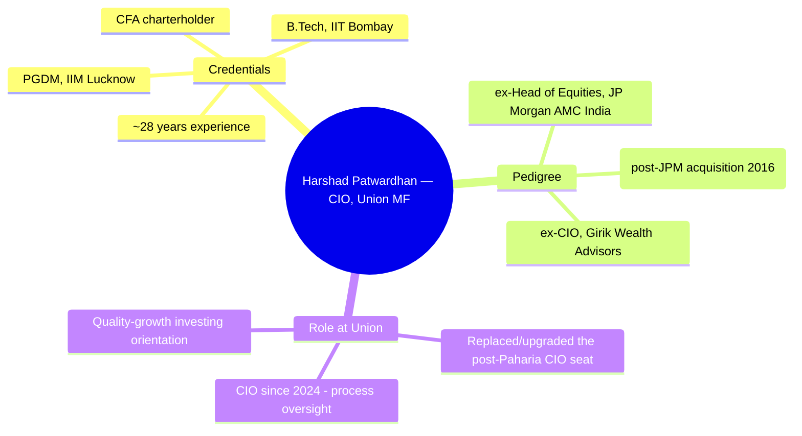
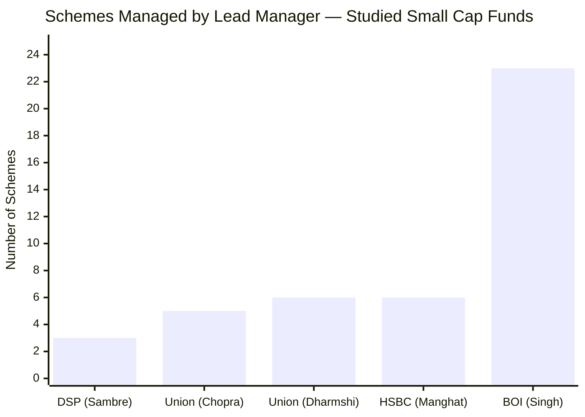
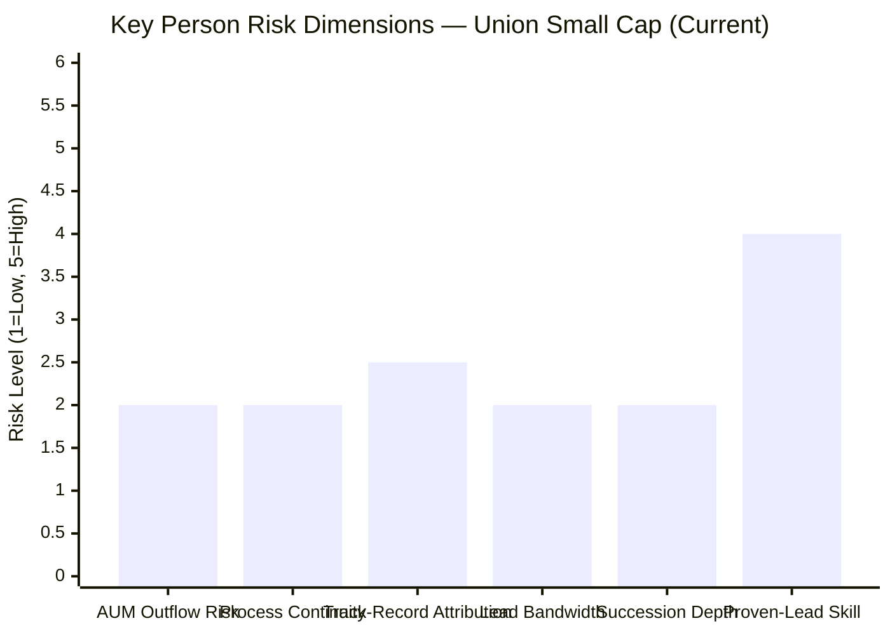
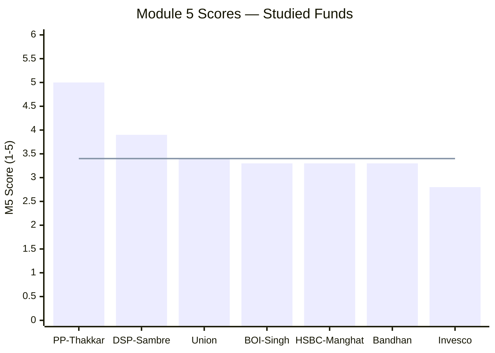
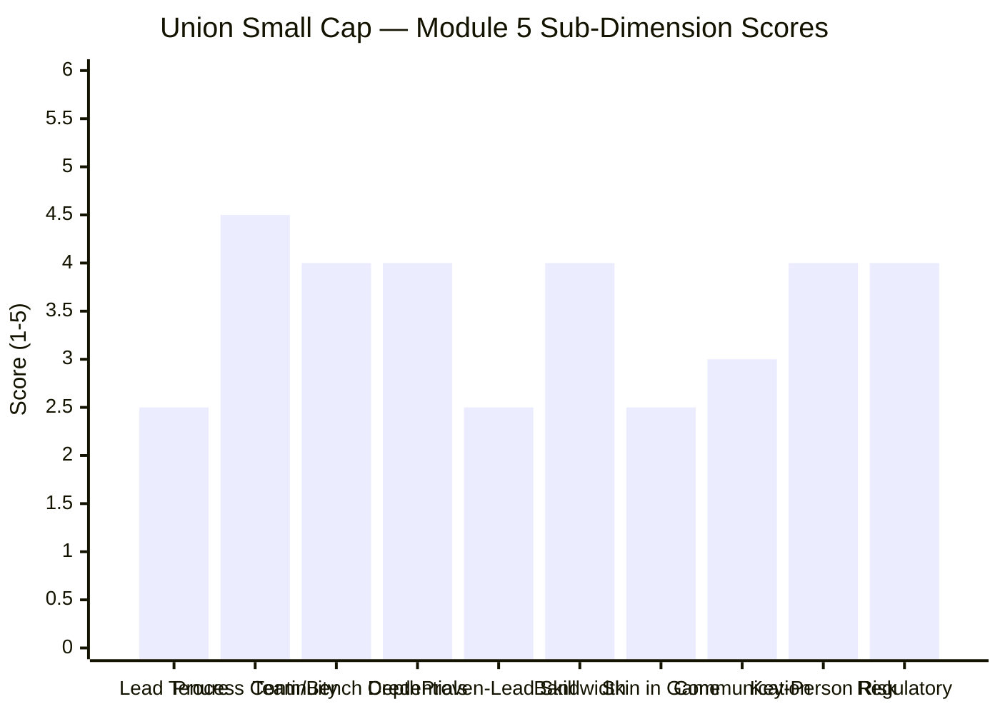

# Module 5: Fund Manager Quality — Union Small Cap Fund

*Sources: Union MF official (unionmf.com) — management team, factsheet, SID/SAI addenda (Oct-31-2024, Dec-08-2024) | Value Research Online (manager appointment notices) | Finalyca / Dezerv / 5paisa / Paytm Money / ICICIdirect fund-manager databases | LinkedIn (Gaurav Chopra, Pratik Dharmshi, Sanjay Bembalkar, Harshad Patwardhan career histories) | Cafemutual / Business Standard (Paharia & Patwardhan moves) | Bloomberg (Ashish Ranawade) | Web research, June 2026*

---

## Module 5 Score: ~3.4 / 5 — The "Carousel That Wasn't"

Module 5 is where Union's defining cross-module question — repeatedly deferred from Modules 1–4 — finally gets answered: ***the genuine 2018-tested, quality-defensive record was built by Vinay Paharia, who left for PGIM in January 2023. Is the edge institutional, or did it walk out the door with him?*** The research answer is **largely institutional**, and it materially *relieves* the manager-risk concern that hung over the earlier modules.

Union is **not** a BOI-style carousel where both hands-on architects fled to competitors. The founder-CIO (Paharia) did leave — a real loss — **but his equity deputies stayed and were *promoted*** (Sanjay Bembalkar, who co-managed Small Cap 2022–24, is now Head of Equity; Hardick Bora remains Co-Head), the AMC recruited a **heavyweight veteran CIO (Harshad Patwardhan, ex-CIO Edelweiss MF & ex-Head of Equities JP Morgan India)**, and the current lead **Gaurav Chopra is an internal promotion** who learned the house process as a Union analyst from 2020. The portfolio (Module 3) still expresses the house quality DNA — confirming the *process* survived the founder's exit.

The result is the **strongest post-founder continuity of any "carousel" fund in the study**, paired with the **best forensic credentials of the carousel cohort** (both small-cap leads are Chartered Accountants; Chopra also CFA L3) and a **deep, unstretched bench** (the anti-BOI). What holds the score below DSP (3.9) is the **proven-skill gap**: Chopra and Dharmshi are well-credentialed, well-supported, and continuity-linked — but they are **first-time flagship small-cap leads with ~18 months' tenure and no bear test as leads.** Union has the best *team and credentials* of the carousel funds, and the least *proven individual lead track record* — the precise inverse of BOI's trade-off.

---

## What Module 5 Is Really Asking

Mutual fund returns are the output. The fund manager — and the institutional process around them — is the machine that produces them. Module 5 asks: who runs this machine, why trust them with ₹20,000 every month for ten years, and what happens to your investment if a key person leaves?

For most funds this is a question about *one person*. For Union, it is unusually a question about *an institution*, because the fund has passed through multiple named managers while its *style and quality* have remained strikingly constant. The central Module 5 task for Union is therefore to distinguish **personal skill that left with Paharia** from **a house process that persisted** — and to judge whether the *current* leads (Chopra and Dharmshi), supported by a deep bench, can carry it forward. The honest finding: the *process* is clearly intact; the *current leads' individual skill* is well-credentialed but not yet independently proven over a cycle.

---

## ⭐ The Carousel That Wasn't — Continuity Despite the Founder's Exit *(Union-specific)*

This is the most important section of the module — and the one that overturns the "manager carousel" worry carried from Modules 1–2. Union *has* had multiple manager transitions, but unlike BOI, **the equity desk that operated the process survived the founder's departure intact.**



| Era | Lead(s) on Small Cap | What happened to them |
|--------|----------------------|------------------------|
| 2014 – Apr 2018 | Ashish Ranawade CIO era | Departed (pre-history) |
| **Apr 2018 – Jan 2023** | **Vinay Paharia (CIO)** — the 2018-protection architect | **Left → CIO at PGIM India** |
| 2022/23 – Nov 2024 | **Sanjay Bembalkar + Gaurav Chopra** | **Bembalkar → promoted Head of Equity (STAYED); Chopra continuous** |
| **Dec 2024 – present** | **Pratik Dharmshi + Gaurav Chopra** | Current named leads |
| Oversight (current) | **CIO Harshad Patwardhan + Head-Equity Bembalkar + Co-Head Bora** | Deep, intact bench |

**Why this is categorically different from BOI's carousel:**


> Bar = Union | Line = BOI. BOI lost *both* hands-on architects (Manghani→Trust, Bhatia→Edelweiss) and handed the fund to one stretched CIO. Union lost the *founder-CIO* but retained the operating desk and added a heavyweight CIO.

1. **The operating desk stayed.** Bembalkar and Bora — who ran the fund through 2022–24 after Paharia stepped back — did **not** leave. Bembalkar was *promoted to Head of Equity*; Bora remains Co-Head. The people who actually managed the money post-Paharia are still here, elevated.
2. **A veteran CIO replaced the founder — arguably an upgrade.** Harshad Patwardhan (28 yrs; ex-CIO Edelweiss MF, ex-Head of Equities JP Morgan AMC India) is a bigger industry name than Paharia was when he joined. The CIO chair is *stronger*, not vacant.
3. **The day-to-day lead is an internal promotion.** Gaurav Chopra was a Union research analyst from 2020 — through the Paharia era — before becoming a fund manager. He carries the house process forward by *direct lineage*, not as an outside hire learning it cold.
4. **The portfolio proves the process persisted.** Module 3 found the current book *still* expresses the quality-compounder, low-turnover, asset-light-financials DNA of the Paharia era. The style did not break with the founder's exit.

**The verdict:** the "carousel" framing from Modules 1–2 was too pessimistic. The 2018-architect did leave, but **the institutional process that produced Union's edge is demonstrably intact** — operated by a retained, promoted desk, overseen by a stronger CIO, and led day-to-day by an internal-continuity manager. This is the **best post-founder continuity of any carousel fund studied.**

---

## ⭐ The Paharia Question, Answered *(Union-specific)*

Modules 1–4 each flagged the same unresolved thread. Here is the explicit resolution:

| The Question (from earlier modules) | Module 5 Answer |
|---|---|
| Who built the genuine 2018 protection (+6.4% alpha)? | **Vinay Paharia** (CIO 2018–Jan 2023) — *departed* |
| Did the edge leave with him? | **No — largely institutional.** Deputies (Bembalkar/Bora) stayed & were promoted; process & portfolio intact |
| Who delivered the strong *recent* record (2023 +43%, 2024 +25%, 2026 +16%)? | **The post-Paharia desk** (Bembalkar/Chopra) — *evidence the process survived* |
| Who runs it now? | **Chopra (internal continuity) + Dharmshi (quality-growth import)**, under **CIO Patwardhan + Head-Equity Bembalkar** |
| Is the current team proven as *leads*? | **Not yet** — well-credentialed (2 CAs) and well-supported, but first-time flagship leads, ~18-month tenure |

**The crucial nuance — the recent record is the *current desk's* work.** Paharia left in January 2023. The fund's strong 2023 (+43%), 2024 (+25%), 2025 protection (+2.8% alpha), and 2026 YTD (+16%) were all delivered *after* his exit, by the Bembalkar/Chopra desk. So unlike BOI — where the celebrated record belongs *entirely* to departed managers — **Union's current team has its own ~3.5-year body of (good) post-founder evidence.** The 2018 protection is Paharia's; the strong recent stretch is the current desk's. That materially de-risks the attribution relative to BOI.

---

## ⭐ The Two-CA Forensic Bench *(Union-specific)*

For the governance-risky small-cap universe — where the dominant tail risk is fraud, related-party tunnelling, and revenue-recognition games — the **Chartered Accountant credential** (deep financial-statement forensics) is the single most valuable manager qualification. Union fields the strongest forensic small-cap team of the carousel cohort:

| Manager | Qualification | Forensic depth |
|---------|--------------|----------------|
| **Gaurav Chopra (Union, lead)** | **B.Com + CA + CFA L3** | **Forensic + analytical — the dual credential** |
| **Pratik Dharmshi (Union, co-lead)** | **B.Com + CA** | **Forensic** |
| Vinit Sambre (DSP) | FCA | Forensic (the gold standard) |
| Kirthi Jain (Bandhan) | CA + CS | Forensic + secretarial |
| Alok Singh (BOI) | CFA + PGDBA | **No FCA** — macro/quant, weaker forensics |
| Venugopal Manghat (HSBC) | MBA + B.Sc Math | **No FCA** |
| Taher Badshah (Invesco) | BE + MMS | **No FCA** |

**Union is the only studied fund with *two* Chartered Accountants on the small-cap team** — and Chopra adds CFA Level III on top. For a quality-compounder fund whose entire down-capture edge (Module 2: 47%) rests on owning *genuinely* durable franchises rather than accounting mirages, this forensic depth is a direct, thesis-relevant strength. It decisively out-credentials BOI's Singh (no FCA, fixed-income origin), HSBC's Manghat, and Invesco's Badshah, and matches the Sambre/Jain forensic tier.

---

## ⭐ The Girik DNA Infusion — A Coherent Team-Building Story *(Union-specific)*

A striking pattern emerges in Union's recent equity hires: **two of the three senior figures come from the Girik orbit** — a renowned quality-growth (CANSLIM-style) investing house.

| Person | Role at Union | Girik link |
|--------|---------------|------------|
| **Harshad Patwardhan** | CIO (joined 2024) | **ex-CIO, Girik Wealth Advisors** |
| **Pratik Dharmshi** | Co-lead, Small Cap (Dec 2024) | **ex-Portfolio Manager, Girik Capital** |

This is not a random reshuffle — it is a **coherent quality-growth team-building strategy.** Module 3 established that Union's portfolio is a *quality-compounder* book (high-ROCE leaders, low turnover, let-winners-ride). The current team's pedigree — a Girik-trained CIO and a Girik-trained co-manager — **reinforces exactly that style.** The fund is not drifting from its house DNA under new management; it is **doubling down on the quality-growth identity** with managers whose training matches it. For an investor worried that a manager change might mean a style change, this alignment is reassuring: the people are new(er), but the philosophy is being *deepened*, not reinvented.

---

## Manager Profile: Gaurav Chopra — The Internal-Continuity Lead

### Career Timeline



**Who is Gaurav Chopra?** A **B.Com + Chartered Accountant + CFA Level III**, with ~8 years in equity markets. His defining feature for *this* fund is **internal continuity**: he joined Union as an equity research analyst in **June 2020**, during the Paharia era, covering **Chemicals, Building Materials, Insurance, Real Estate and Internet** — sectors that map directly onto the current portfolio (Navin Fluorine, Acutaas, Amber, Eureka Forbes, the financials). He was promoted to co-fund-manager in January 2023 — precisely as Paharia departed — and has been a named manager on Small Cap continuously since. Prior to Union: Centrum PMS (research, 2015–2020), Barclays Wealth Trustees, and audit at Sharp & Tanan.

**Why he matters:** Chopra is the **human link between the Paharia-era process and today's fund.** He learned the house framework as an analyst under the architect, then was promoted to operate it. His CA+CFA combination gives him both forensic depth and portfolio-analysis rigour. The caveat: ~8 years' total experience and a *first* flagship-lead role make him a **promising but unproven lead** — strong credentials, short solo track record.

---

## Manager Profile: Pratik Dharmshi — The Quality-Growth Import

### Career Timeline



**Who is Pratik Dharmshi?** A **B.Com (R.A. Podar) + Chartered Accountant (ICAI)** with ~9 years' experience, hired by Union in **December 2024**. His standout prior role is **Portfolio Manager at Girik Capital** — a respected quality-growth boutique PMS — supplemented by buy-side stints at **Edelweiss AMC, JP Morgan India, CRISIL, Morgan Stanley, and UTI Pension Fund.** His stated philosophy ("businesses with sound fundamentals, strong management, scalable opportunities") is textbook quality-growth.

**Why he matters:** Dharmshi brings **fresh, directly-relevant quality-growth PMS experience** that reinforces the fund's existing style (and aligns with CIO Patwardhan's Girik pedigree). His CA credential adds a second forensic lens to the team. The caveats: he is **brand new to Union (Dec 2024)** — so he is *not* the continuity link (Chopra is) — and, like Chopra, this is his first flagship small-cap lead role.

---

## The Backstop: Harshad Patwardhan — A Heavyweight Veteran CIO



**The CIO chair is a genuine strength, not a gap.** Patwardhan is one of the more decorated equity CIOs available — IIT-B + IIM-L + CFA, ~28 years, and a CV (JP Morgan Head of Equities → Edelweiss CIO → Girik Wealth CIO) that arguably *exceeds* Paharia's standing. His presence means the junior named leads (Chopra, Dharmshi) operate under **experienced, quality-growth-aligned oversight** — the institutional equivalent of training wheels that are themselves a championship cyclist. This is the single biggest reason Union's key-person risk is *lower* than its short-tenure leads would suggest.

---

## Credentials in Context

| Manager / Role | Qualification | Interpretation |
|---------|--------------|----------------|
| Rajeev Thakkar (PP) | FCA | Deepest accounting forensics |
| Vinit Sambre (DSP) | FCA | Same — critical for SC governance risk |
| **Gaurav Chopra (Union, lead)** | **CA + CFA L3** | **Forensic + analytical; the dual credential; short lead tenure** |
| **Pratik Dharmshi (Union, co-lead)** | **CA** | **Forensic; quality-growth PMS pedigree (Girik)** |
| **Harshad Patwardhan (Union, CIO)** | **IIT-B + IIM-L + CFA** | **Elite generalist; 28Y; heavyweight oversight** |
| Kirthi Jain (Bandhan) | CA + CS | Forensic + secretarial |
| Alok Singh (BOI) | CFA + PGDBA | No FCA; macro/fixed-income origin |
| Venugopal Manghat (HSBC) | MBA + B.Sc | No FCA |
| Taher Badshah (Invesco) | BE + MMS | No FCA |

**Union's *team* credential stack is among the strongest of the study** — two CAs on the fund plus a CFA-charterholder veteran CIO. On paper, only DSP (Sambre FCA, 14-yr tenure) clearly out-ranks it, and that edge is about *tenure and proven track record*, not *credentials*. Union's credential depth is a real, thesis-relevant asset for a quality-compounder small-cap fund.

---

## The Crisis-Test Gap — The Current Leads Have Not Managed a Bear

A critical limitation, shared with most carousel funds: **neither Chopra nor Dharmshi has led Union Small Cap through a genuine bear market.**

| Manager | Crisis Test as Lead on THIS Fund | At What AUM |
|---------|----------------------------------|-------------|
| Sambre (DSP) | 2018 IL&FS + 2020 COVID | ₹7,000–15,000 Cr |
| Manghat (HSBC) | 2020 COVID | ~₹5,000 Cr |
| **Chopra + Dharmshi (Union)** | **None as leads — only the strong 2025–26 stretch** | **~₹2,000 Cr** |

**The genuine 2018 protection belongs to Paharia; the −44.71% drawdown was navigated by the Ranawade/Paharia eras.** The current leads have only run the fund through the favourable 2024–26 window (with a mild 2025 correction, which they protected well: +2.8% alpha). **How this specific team handles a violent, grinding small-cap bear on this mandate is unproven.** This compounds the standing caveat: the *fund's* best risk credentials are genuine and tested, but the *current team's* crisis-management is not. The mitigant is the CIO/Head-of-Equity backstop (Patwardhan and Bembalkar *have* managed through cycles elsewhere) — the leads are junior, but their oversight is not.

---

## Investment Philosophy — Continuity, Confirmed by the Portfolio

Because the current leads have short tenure, their philosophy is best read from (a) the persistent house style, (b) the Girik quality-growth pedigree of the CIO and co-lead, and (c) the Module-3 portfolio evidence.

```mermaid
mindmap
  root((Union SC — Investment Philosophy))
    House Process (persisted)
      Quality-compounder bias
      Low turnover (19.68%) - let winners ride
      Asset-light financials (MCX, KFin)
      Healthcare + grid-capex spines
    Reinforced by new team
      Patwardhan - Girik quality-growth CIO
      Dharmshi - Girik quality-growth PM
      Chopra - internal continuity, CA+CFA
    Caveats
      Only ~18 months as named leads
      First flagship lead role for both
      Rich PE (38.79) - quality premium
      No bear test as this team
```

**The philosophy is coherent and confirmed-continuous** (Module 3): a quality-compounder book held patiently (19.68% turnover), built around durable franchises in healthcare, grid-capex, and asset-light financials. Crucially, **this is not an *inferred* philosophy that *might* change** — it is the *observed*, persistent house style, now reinforced by a team whose Girik pedigree matches it. The honest limitation: ~18 months of *named-lead* evidence is too short to certify the leads will sustain it independently of the bench — but the alignment between style, portfolio, and team training is the strongest such coherence among the carousel funds.

---

## Manager Bandwidth — The Anti-BOI



Union's managers carry **moderate, healthy scheme loads** — **Chopra 5 schemes (~₹5,107 Cr), Dharmshi 6 schemes (~₹5,266 Cr)** — within a proper team structure (CIO Patwardhan + Head-Equity Bembalkar + Co-Head Bora + FMs Chopra/Dharmshi/Malviya). This is the **direct inverse of BOI**, whose lead Alok Singh is stretched across **23 schemes** as a near-solo equity engine. Union's small-AMC status (Module 4) does **not** translate into a stretched-manager problem: the equity desk is deep and the per-manager load is reasonable. Attention-dispersion risk — acute at BOI — is **low at Union.**

---

## Co-Management Structure — A Genuine Team, Not a Token Buffer

| Attribute | Union | BOI (for contrast) |
|-----------|-------|--------------------|
| Named leads | Chopra + Dharmshi (genuine co-leads) | Singh + Bhardwaj (co 11mo) |
| Oversight | **CIO Patwardhan + Head-Equity Bembalkar + Co-Head Bora** | Singh *is* the CIO (no layer above) |
| Bench depth | Deep (3 FMs + 2 equity heads + CIO) | Thin (Singh-centric) |
| Succession void? | **No — multiple capable successors** | CIO-as-backstop, but stretched |

Union's co-management is a **real team structure**, not a token. If either named lead departed, the fund would fall back on a *retained, experienced* bench (Bembalkar ran it 2022–24; Patwardhan is a veteran CIO; Bora and Malviya are seasoned FMs). This is a meaningfully **lower key-person risk** than a single-manager fund (DSP's Sambre void) or a stretched-CIO fund (BOI's Singh). The trade-off: no single dominant, long-proven star — the skill is distributed and institutional rather than concentrated and celebrated.

---

## Cross-Fund / Prior-Record Performance — The Mixed Evidence

Unlike BOI (where Singh's FlexiCap #2 is a clean proof-point), Union's current leads do **not** have a long, independently-attributable lead track record to point to:

| Person | Proof-point | Strength of signal |
|--------|-------------|--------------------|
| Chopra | Co-managed Union SC/Midcap since Jan-2023 (strong 2023–24) | Moderate — co-managed, short, desk-supported |
| Dharmshi | Girik Capital PMS record (not publicly attributable) | Weak — not independently verifiable |
| Patwardhan (CIO) | **Long record at JP Morgan India / Edelweiss MF** | **Strong — but on other funds/houses** |
| Bembalkar (Head) | Ran Union SC 2022–24 (strong stretch) | Moderate — but now a step removed |

**The proof is institutional, not individual.** The strongest track-record evidence sits with the *bench* (Patwardhan's multi-decade record; Bembalkar's 2022–24 stretch) rather than with the *named leads* (Chopra's co-managed ~3.5 years; Dharmshi's non-public PMS record). This is the inverse of BOI, where the *individual* (Singh) is proven but the *team* is thin. Union's bet is on a *capable institution*; BOI's is on a *capable individual*.

---

## SEBI / Regulatory History — Clean (Pending Full M6 Review)

| Entity | SEBI Issue | Character |
|--------|-----------|-----------|
| **Gaurav Chopra (personal)** | None found | **Clean** |
| **Pratik Dharmshi (personal)** | None found | **Clean** |
| **Harshad Patwardhan (personal)** | None found | **Clean** |
| **Union AMC** | No major action found (clean in screening / FlexiCap comparison) | **Clean — to confirm in M6** |
| (contrast) Invesco India AMC | ₹4.98 Cr investor-harm settlement; CEO named | Severe |
| (contrast) BOI AMC | ₹10L debt-side insider-redemption penalty | Moderate yellow flag |

**No regulatory issues found against any Union manager or against the AMC** — consistent with the screening and the companion FlexiCap study, both of which flagged Union as governance-clean. This is a genuine positive: Union carries **none** of the AMC-governance baggage that weighs on Invesco (severe) or, more mildly, BOI (debt-side). Full AMC governance assessment is reserved for Module 6, but the manager-level record is clean.

---

## Investor Communication and Transparency

| Communication Form | Union (Chopra/Dharmshi) | DSP (Sambre) | PP (Thakkar) |
|-------------------|--------------------------|--------------|--------------|
| Quarterly letters to unitholders | No | No | **Yes** |
| Standalone philosophy document | No (factsheets only) | Yes | Yes |
| Public interview frequency | Low–moderate | Moderate | High |
| Manager-change disclosure | **Via clear SID/SAI addenda** | N/A | N/A |
| "Know Your Fund Manager" features | Yes (LinkedIn/AMC) | — | — |

**Assessment:** category-standard — below DSP, well below PP. No quarterly letters or standalone philosophy document. However, Union's **manager-change disclosure was clean and timely** (the Oct-2024 and Dec-2024 SID/SAI addenda clearly documented every appointment and designation change), and the AMC runs "Know Your Fund Manager" features. An investor *could* reconstruct the lineage from public disclosures — better transparency than a fund that buries changes. The gap is proactive *philosophy* communication, not *disclosure* of the team.

---

## Key Person Risk Assessment



| Risk Dimension | Assessment | Score (5 = highest risk) |
|----------------|-----------|--------------------------|
| AUM outflow on a manager exit | **Low (2.0)** | Brand is the AMC/process, not a star; deep bench absorbs a departure |
| Process / philosophy continuity | **Low (2.0)** | Desk retained, portfolio intact, Girik-aligned team reinforces the style |
| Track-record attribution | **Low-Med (2.5)** | 2018 protection is Paharia's, but strong 2023–26 is the *current* desk's work |
| Lead bandwidth | **Low (2.0)** | 5–6 schemes each; deep team; the anti-BOI |
| Succession depth | **Low (2.0)** | Multiple capable successors (Patwardhan, Bembalkar, Bora, Malviya) |
| **Proven-lead skill** | **High (4.0)** | **First flagship lead role; ~18-month tenure; no bear test as leads — the dominant residual risk** |

**The key-person profile is unusually *favourable* for a fund that changed managers.** Because the skill is *institutional* (deep bench, retained desk, veteran CIO) rather than concentrated in one star, almost every key-person dimension scores *low-risk*. The **single elevated risk is the unproven individual skill of the named leads** — they are well-credentialed and well-supported, but have not yet demonstrated, independently and through a cycle, that they can *generate* the alpha rather than *maintain* an inherited book. That is the honest residual concern, and it is the inverse of BOI's (proven individual, fragile institution).

---

## Peer Manager Comparison


> Line = Union's M5 score (~3.4)

| Fund | Manager(s) | Tenure on Fund | Key Strength | Key Weakness | M5 |
|------|-----------|---------------|-------------|--------------|----|
| PP FlexiCap | Thakkar | 13Y | FCA; letters; skin-in-game | Retirement horizon | 5.0 |
| DSP SmallCap | Sambre | 14Y | FCA; dedicated co; flow discipline | No letters | 3.9 |
| **Union SmallCap** | **Chopra + Dharmshi** | **~18mo** | **2× CA (+CFA L3); retained desk + veteran CIO; deep bench; clean record** | **First-time flagship leads; unproven through a bear** | **~3.4** |
| BOI SmallCap | Singh | 20mo | CIO continuity; FlexiCap #2 proof | Carousel (both architects fled); 23 schemes; no FCA | 3.3 |
| HSBC SmallCap | Manghat | 6.5Y | 29Y exp; COVID at scale | Benchmark-hug; co-mgr carousel; no FCA | 3.3 |
| Bandhan SmallCap | Jain + Gunwani | 3Y | CA+CS; CIO oversight | First lead role; 3Y; new team | 3.3 |
| Invesco SmallCap | Badshah | 7.5Y | Inception clarity; 27Y exp | Severe AMC SEBI history | 2.8 |

**How Union edges above the carousel cohort (BOI/HSBC/Bandhan, all 3.3):**

| Dimension | Union | BOI | Bandhan | Edge |
|-----------|-------|-----|---------|------|
| Forensic credentials | **2× CA + CFA** | CFA only | CA+CS | **Union / Bandhan** |
| Post-founder continuity | **Desk retained + veteran CIO** | Both architects fled | Original mgr left | **Union** |
| Lead bandwidth | **5–6 schemes** | 23 schemes | moderate | **Union** |
| Bench depth | **Deep (CIO+Head+Co-Head+3 FM)** | Thin (Singh-centric) | CIO + 1 lead | **Union** |
| Proven individual lead | First flagship lead | **FlexiCap #2** | First lead | **BOI** |
| Crisis test as lead | None | Mild 2025 only | None | Even |
| Clean regulatory record | **Yes** | Debt-side flag | **Yes** | Union / Bandhan |

**Union out-scores the other carousel funds on credentials, continuity, bandwidth, and bench depth** — losing to BOI only on *proven individual lead skill* (Singh's FlexiCap #2). On balance the institutional strengths outweigh the single individual-proof gap, landing Union at **~3.4, a notch above the 3.3 cluster** and clearly below DSP's 14-year FCA gold standard.

---

## Points For / Points Against — Fund Manager Quality

### ✅ Points For

1. **Genuine institutional continuity** — the equity desk (Bembalkar/Bora) that ran the fund post-Paharia *stayed and was promoted*; not a both-architects-fled carousel
2. **Two Chartered Accountants on the fund** (Chopra also CFA L3) — best forensic credentials of the carousel cohort; thesis-relevant for a quality book
3. **Heavyweight veteran CIO backstop** — Patwardhan (IIT-B/IIM-L/CFA, 28Y; ex-CIO Edelweiss, ex-Head Equities JPM India) — arguably a CIO upgrade over Paharia
4. **Internal-continuity lead** — Chopra was a Union analyst from 2020, covering the portfolio's sectors; carries the house process by direct lineage
5. **Coherent Girik quality-growth team identity** — Patwardhan + Dharmshi pedigree reinforces (not reinvents) the M3 portfolio style
6. **Deep, unstretched bench** — 5–6 schemes per lead; CIO + Head + Co-Head + 3 FMs; the anti-BOI on bandwidth
7. **Strong *recent* record is the current desk's own work** — 2023 (+43%), 2024 (+25%), 2025 protection, 2026 (+16%) all post-Paharia
8. **Low key-person risk** — skill is institutional/distributed; multiple capable successors; no succession void
9. **Clean regulatory record** — no SEBI issues against any manager or the AMC (vs BOI's debt flag, Invesco's severe settlement)
10. **Clean, timely manager-change disclosure** — SID/SAI addenda documented every transition

### ❌ Points Against

1. **First-time flagship small-cap leads** — neither Chopra nor Dharmshi has led a flagship fund before; the dominant residual risk
2. **Short named-lead tenure (~18 months)** — too brief to certify the leads independently of the bench
3. **The 2018-architect departed** — Union's signature protection record belongs to the now-departed Paharia (at PGIM)
4. **No bear test as this team** — only the favourable 2024–26 window navigated as leads
5. **Dharmshi brand new to Union (Dec 2024)** — the continuity rests on Chopra + the bench, not on him
6. **No long, independently-attributable lead track record** — proof is institutional (Patwardhan/Bembalkar), not individual (the leads)
7. **Skin-in-game not disclosed** — same gap as DSP/BOI/HSBC vs PPFAS
8. **No proactive philosophy communication** — factsheets only; no quarterly letters or framework document
9. **Multiple historical transitions** — Ranawade → Paharia → Bembalkar/Bora → Chopra/Dharmshi adds attribution complexity for a new investor

---

## Module 5 Scorecard



| Sub-Dimension | Score (1–5) | Reasoning |
|---------------|------------|-----------|
| Manager tenure on this fund | **2.5** | ~18 months as named leads; first flagship lead role — short, but Chopra co-managed since Jan-2023 |
| Process / institutional continuity | **4.5** | Desk retained & promoted; veteran CIO added; portfolio DNA intact — the key strength |
| Team / bench depth | **4.0** | CIO + Head + Co-Head + 3 FMs; deep and stable; multiple successors |
| Credentials / forensic depth | **4.0** | Two CAs (+ CFA L3) on the fund + CFA veteran CIO — best of the carousel cohort |
| Proven individual lead skill | **2.5** | First-time flagship leads; no long solo track record; the dominant weakness |
| Bandwidth / focus | **4.0** | 5–6 schemes each; the anti-BOI; no attention-dispersion problem |
| Skin in the game | **2.5** | Not disclosed; same gap as most non-PPFAS funds |
| Investor communication | **3.0** | Clean change-disclosure + KYFM features; no letters or philosophy doc |
| Key person / succession risk | **4.0 (low risk)** | Institutional/distributed skill; deep bench; no succession void |
| Regulatory / record | **4.0** | Clean — no manager or AMC SEBI issues found |
| **Module 5 Overall** | **~3.4 / 5** | **The "carousel that wasn't."** Genuine institutional continuity (retained desk + veteran CIO + internal-promotion lead + intact process), the best forensic credentials of the carousel cohort (two CAs), and a deep, unstretched bench — relieving the manager-risk fear from Modules 1–2. **Held below DSP (3.9) by the one thing the team lacks: a proven, long-tenured individual lead** — Chopra and Dharmshi are well-credentialed and well-supported first-time flagship leads, unproven through a bear. A notch above the BOI/HSBC/Bandhan cluster (3.3) on continuity, credentials, and bench depth. |

---

## Comparative Module 5 Scores — All Studied Funds

| Fund | Module 5 Score | Manager(s) | One-Line |
|------|---------------|-----------|----------|
| PP FlexiCap | 5.0/5 | Thakkar | FCA; 13Y inception; letters; skin-in-game |
| DSP SmallCap | 3.9/5 | Sambre | FCA; 14Y; dedicated co-mgr; flow discipline |
| BOI FlexiCap | 3.6/5 | Singh | AMC-builder; ran from inception |
| **Union SmallCap** | **~3.4/5** | **Chopra + Dharmshi** | **Retained desk + veteran CIO + 2 CAs; but first-time, short-tenure leads** |
| BOI SmallCap | 3.3/5 | Singh | CIO continuity + FlexiCap proof; but carousel + 23 schemes |
| HSBC SmallCap | 3.3/5 | Manghat | 29Y; COVID at scale; benchmark-hug |
| Bandhan SmallCap | 3.3/5 | Jain + Gunwani | CA+CS; CIO oversight; first lead role |
| Invesco SmallCap | 2.8/5 | Badshah | Inception clarity; severe AMC SEBI history |

**Union lands at ~3.4 — the top of the carousel cohort, below DSP's single-manager gold standard.** The logic: Union substitutes *institutional* strength (retained desk, veteran CIO, deep bench, two CAs) for the *individual* star quality that DSP (Sambre, 14Y FCA) and even BOI (Singh, FlexiCap #2) offer. For a fund whose edge is a *process* (quality-compounder, low-turnover — Module 3) rather than a single stock-picker's genius, an institutional answer is arguably the *right* answer — but the unproven individual leads keep it from reaching the Sambre tier.

---

## SIP Implication — What Module 5 Means for Your ₹20,000/Month

For a ₹20K/month satellite SIP, Module 5 is the module that **relieves** the manager-risk worry that Modules 1–2 raised — without fully resolving it:

1. **The defensive edge is institutional, not personal — so it largely survived Paharia.** The retained desk (Bembalkar/Bora), the veteran CIO (Patwardhan), the internal-continuity lead (Chopra), and the intact portfolio (Module 3) together mean the *process* that produced Union's quality-defensive record is still in place. You are not buying a fund whose magic walked out the door — you are buying a fund whose magic is a *house process* now operated by a deep, credentialed bench.

2. **You are betting on an institution, not a star.** The investable thesis is: "a quality-growth process, overseen by a heavyweight CIO and a retained Head of Equity, operated by two CA-qualified leads, will sustain the down-capture edge." That is a *reasonable* bet — and a more *robust* one than betting on a single irreplaceable manager (DSP's Sambre-dependency) — but it trades away the comfort of a long, proven individual track record.

3. **The one genuine reservation is the leads' unproven skill through a bear.** Chopra and Dharmshi are well-credentialed and well-supported, but neither has led a flagship small-cap fund through a grinding crash. The 2018 protection that defines Union's risk profile is *Paharia's* work. Until this team is bear-tested as leads, treat the *fund's* proven down-capture as a property of the *house process and the departed architect* — and the *current leads' ability to reproduce it* as *probable but not yet demonstrated.*

4. **Monitor three things:** (a) Chopra remaining as the continuity anchor and Dharmshi settling in; (b) Patwardhan and Bembalkar remaining in the CIO/Head-of-Equity chairs (the oversight backstop is doing real work); (c) the first genuine small-cap bear under this team — the single most important forward test of whether the institutional edge reproduces the alpha.

5. **The credentials are a genuine, thesis-relevant comfort.** For a quality-compounder fund whose entire down-capture rests on owning *real* franchises (not accounting illusions), having *two Chartered Accountants* on the desk plus a CFA veteran CIO is exactly the right credential stack. This is a *better* forensic team than BOI, HSBC, or Invesco field.

---

## One-Line Verdict

Union Small Cap is the "carousel that wasn't": the 2018-architect (Paharia) left, but the operating desk stayed and was promoted, a heavyweight veteran CIO (Patwardhan) was added, an internal-continuity lead (Chopra, CA+CFA) carries the house process forward alongside a quality-growth import (Dharmshi, CA), and the portfolio DNA is demonstrably intact — giving Union the strongest post-founder continuity and best forensic credentials of the carousel cohort (~3.4/5, a notch above BOI/HSBC/Bandhan), held below DSP's 14-year FCA gold standard only by the one thing the team still lacks: a proven, bear-tested individual lead.

---

*Module 5 complete. Fund manager quality is, surprisingly, a relative *strength* among the carousel funds: genuine institutional continuity (retained desk + veteran CIO Patwardhan + internal-promotion lead Chopra), the best forensic credentials of the cohort (two CAs + CFA L3), a deep unstretched bench, and a clean record — offset by first-time, short-tenure flagship leads unproven through a bear. The Paharia-continuity question is answered: the edge is largely institutional. Module 5 score: ~3.4/5.*

*Next: [Module 6 — AMC Quality](module6_amc.md)*
