# Module 6: AMC Quality — Union Small Cap Fund

*Sources: Union MF official (unionmf.com — About Us, management team, factsheet) | AMFI member data | Union Bank of India FY25/Q3FY26 results & filings | Wikipedia (Dai-ichi Life, Union Bank of India, Andhra/Corporation Bank amalgamation) | Business Standard / Value Research / Cafemutual (Paharia & Patwardhan moves, KBC exit, Dai-ichi entry) | Dezerv / Groww / Angel One AMC pages | SEBI orders search | Web research, June 2026. Benchmark = Nifty Smallcap 250 TRI (mandate: BSE 250 SmallCap TRI).*

---

## Module 6 Score: ~3.5 / 5 — The Clean Counterpoint

Where BOI's Module 6 was *"a good equity franchise inside a governance-scarred house,"* **Union's is the inverse: a sub-scale franchise inside a clean, well-governed, well-parented house.** The single most important finding is what is *absent*: **Union AMC carries no governance scar** — no SEBI penalty, no capital-destroying fund debacle, no insider-trading lapse, no inherited regulatory matter, in 15 years of operation. That clean record is precisely what BOI (debt-side Credit Risk Fund debacle + ₹10L insider penalty), Invesco (₹4.98 Cr multi-jurisdiction settlement), and even HSBC (inherited §15HB) all lack.

The positives are genuine and, for the trust-question that Module 6 exists to answer, substantial: a **dual-strong parentage** (Union Bank of India — the 5th-largest PSU bank, *never under RBI PCA*, record FY25 profit — *plus* Dai-ichi Life, a 130-year-old global Japanese insurer who *chose* to buy in), **proper governance infrastructure** (a full C-suite including dedicated Chief Compliance and Chief Risk Officers), **Tier-1 service providers**, and **better talent retention than BOI** (the equity bench was kept and the CIO upgraded). The negatives are structural rather than ethical: a **perennially sub-scale AMC** (~₹16–17K Cr after 15 years) with thin research depth, minimal investor-first communication, and no disclosed skin-in-the-game. The net is a clean, well-parented, adequately-governed but small house — **~3.5, marginally above HSBC, clearly above BOI/Bandhan/Invesco, a tier below DSP/PP.**

---

## Raw Data (Cross-Source Verified)

| Metric | Value | Source(s) |
|--------|-------|-----------|
| **AMC Full Name** | **Union Asset Management Co. Pvt. Ltd.** | AMFI, Union MF |
| **Formerly Known As** | Union KBC Asset Management (until 2016) | Web research |
| **Ownership** | **Union Bank of India ~60.4% + Dai-ichi Life Holdings (Japan) ~39.62%** | Web research / AMC |
| **Ownership history** | 2011 Union KBC (Union Bank 51% / KBC Belgium 49%) → 2016 KBC exits, Union Bank 100% → **2017 Dai-ichi acquires 39.62%** | Web research |
| **Parent 1 — Union Bank of India** | **5th-largest PSU bank;** total assets ~₹15.3 lakh Cr; **FY25 net profit ₹18,027 Cr (+31.3% YoY)**; total business ~₹22.9 lakh Cr; ~8,466 branches | Bank filings |
| **Parent 1 regulatory note** | **Never under RBI PCA** (absorbed Andhra Bank + Corporation Bank in the Apr-2020 amalgamation) | RBI / bank filings |
| **Parent 2 — Dai-ichi Life Holdings** | **3rd-largest Japanese life insurer; founded 1902; total assets ~¥41 trillion (~$280bn+); Tokyo-listed; global platform** | Wikipedia |
| **CEO** | **Madhukumar Nair** (G. Pradeepkumar was the long-serving predecessor) | Union MF |
| **CIO** | **Harshad Patwardhan** (ex-CIO Edelweiss MF / Girik Wealth; ex-Head Equities JPM India) | Union MF (Module 5) |
| **Head of Equity** | **Sanjay Bembalkar** (CFA); Co-Head Hardick Bora | Union MF |
| **Other C-suite** | COO/CFO Rajkamal Tiwari; CMO Saurabh Jain; **CCO Richa Parasrampuria; CRO Maulik Bhansali** | Union MF |
| **Total AMC AUM** | **~₹16,000–17,000 Cr** (~15–20 distinct schemes) | Web research |
| **Custodian / Fund Accountant** | **SBI-SG Global Securities** (Tier-1; SBI + Société Générale JV) | Union MF |
| **RTA** | **CAMS** (Tier-1) | Union MF |
| **Auditor** | S.R. Batliboi & Co. LLP (EY network) + P Parikh & Associates | Union MF |
| **SEBI — AMC** | **None found — clean** | SEBI search |
| **SEBI — managers (personal)** | **None found** | Web research |
| **Major risk-management episode** | **None found** | Web research |
| **Quarterly investor letters** | Not found | Web review |
| **Skin-in-game disclosure** | Not disclosed | Not found |
| **Flow-restriction history** | None (never large enough) | AMC history |
| **Equity-talent retention** | **Mixed** — lost star CIO Paharia (→ PGIM), but retained bench (Bembalkar/Bora) and upgraded CIO (Patwardhan) | Module 5 |
| **VRO Star Rating (the fund)** | 4 ★ | Value Research |

---

## What Module 6 Is Really Asking

You can have a capable fund manager, but if the institution around them is regulatorily compromised, financially fragile, or culturally indifferent to investors, everything else can unravel. Module 6 evaluates the *house*: governance, regulatory record, ownership, financial stability, and whether it systematically puts investors first.

For Union, the question resolves more favourably than for any other carousel-era fund — because the institution is **clean and well-parented.** The fund's earlier-module weaknesses (high cost, junior leads) are *execution* issues; Module 6 asks whether the *house* is trustworthy as a 10-year custodian, and here Union's answer is genuinely good: no governance scar, two strong owners (a PSU bank that avoided PCA and a blue-chip global insurer), proper compliance/risk infrastructure, and Tier-1 service providers. **The one real caveat is scale: a house that has stayed small for 15 years has thin research depth and limited franchise traction.** Module 6 is where Union's institutional *trustworthiness* offsets some of the *execution* doubts the earlier modules raised.

---

## The AMC Structure — Who You Are Actually Backing

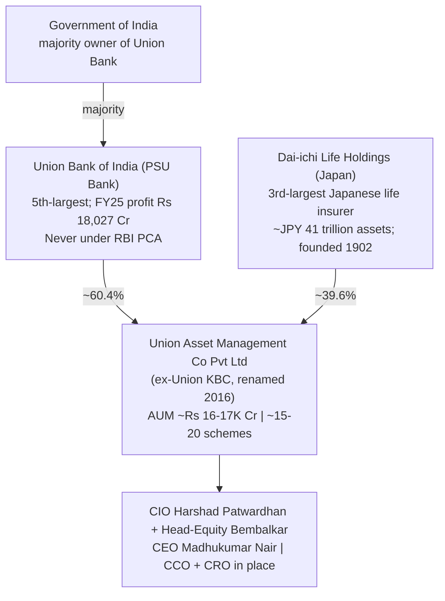

| Dimension | Union | BOI | DSP | Invesco |
|-----------|-------|-----|-----|---------|
| Ownership type | **PSU bank + global insurer** | Govt-bank PSU (100% BOI) | Family-private | Foreign → IIHL |
| Number of strong parents | **Two (bank + insurer)** | One (govt bank) | One (family) | Shifting |
| Parent under PCA ever? | **No** | **Yes (2017–19)** | n/a | n/a |
| Foreign-institutional overlay | **Yes (Dai-ichi)** | No (AXA left) | No | Yes (but unstable) |
| Can AMC be acquired? | **Low (Dai-ichi committed)** | No (govt won't sell) | Very unlikely | **4 changes already** |
| Regulatory scar | **None** | Debt-side scar | Procedural only | **Severe** |

**What the dual-parent structure means — genuinely the best-parented of the small/PSU funds:**
- **Financial unsinkability ×2.** Union is backed by *both* a large government-owned bank (Union Bank, FY25 profit ₹18,027 Cr) *and* a ¥41-trillion global insurer (Dai-ichi). Either alone would guarantee survival; together they are a robust backstop.
- **A foreign-institutional governance overlay.** Dai-ichi Life — a conservative, 130-year-old, Tokyo-listed insurer — brings board-level oversight and long-term-capital discipline that a pure-PSU house (BOI) lacks. This is the kind of partner that *raises* governance standards.
- **A stronger bank parent than BOI's.** Union Bank of India is larger (5th-largest PSU bank, post-merger), more profitable (₹18,027 Cr FY25), and — critically — **never went under RBI Prompt Corrective Action**, unlike BOI (under PCA 2017–Jan 2019). Union's parent is a stronger, cleaner bank than BOI's.

The honest synthesis: Union offers **survival, continuity, *and* a governance overlay** — financial unsinkability from the bank, plus the discipline of a blue-chip foreign institutional co-owner. The cap is *scale*, not *stability*.

---

## ⭐ The Clean Counterpoint — No Governance Scar *(Union-specific)*

This is the defining positive of Union's Module 6, and the cleanest contrast with BOI. A side-by-side of the AMCs' regulatory characters:

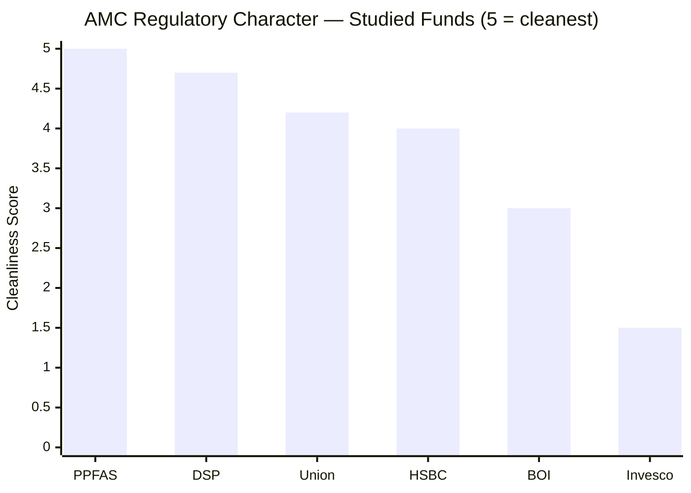

| Entity | Regulatory Issue | Character |
|--------|------------------|-----------|
| **Union AMC** | **None found** | **Clean — no penalty, no debacle, no insider lapse** |
| **Union managers (personal)** | **None found** | **Clean** |
| DSP AMC | ETF expense procedural (₹2L) | Procedural |
| HSBC AMC | Decision-documentation (₹5L, L&T era) | Procedural / inherited |
| BOI AMC | Credit Risk Fund capital destruction + ₹10L insider redemption | **Genuine governance scar** |
| Invesco AMC | Inter-scheme transfers; multi-jurisdiction probe (₹4.98 Cr) | **Severe investor-harm** |

**Union is one of only two studied AMCs with a genuinely clean sheet** (with Bandhan) — and unlike Bandhan, it carries no PE-investor exit clock. In 15 years, no SEBI penalty, no fund blow-up, no insider matter, no investor-harm finding has surfaced against Union AMC or its managers. For a Module whose central purpose is to screen out *governance tail risk over a 10-year hold*, this is the most valuable possible attribute — and it decisively differentiates Union from BOI (whose 3.2 was dragged down precisely by the debt-side scar that Union does not have). The clean record is the single biggest reason Union's M6 (~3.5) sits above BOI's (3.2).

---

## ⭐ The Dual-Parent Structure — PSU Bank + Global Insurer *(Union-specific)*

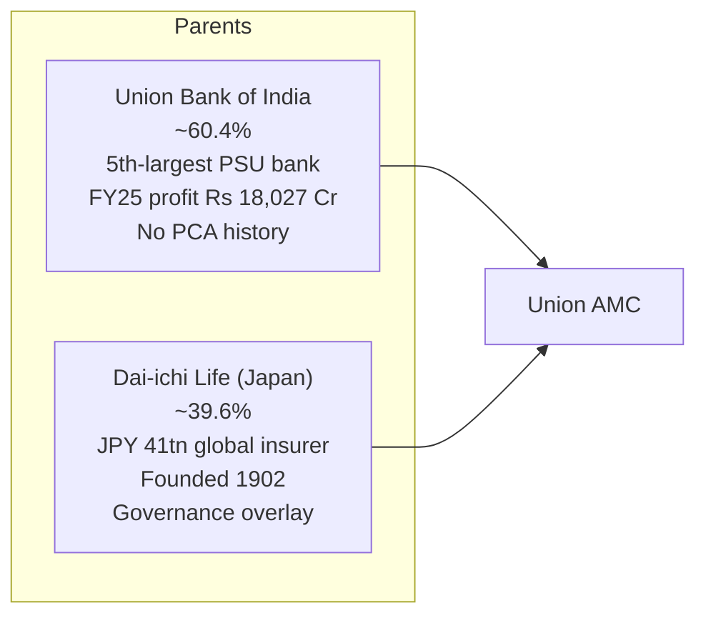

**Why two strong parents matter more than one:**

| Backstop | Union (dual) | BOI (single) |
|----------|--------------|--------------|
| Domestic bank balance sheet | Union Bank (₹15.3L Cr assets) | Bank of India |
| Bank's own health | **Never under PCA; record FY25 profit** | **Under PCA 2017–19** |
| Foreign institutional co-owner | **Dai-ichi Life (¥41tn insurer)** | None (AXA departed) |
| Governance overlay | **Foreign-insurer board discipline** | PSU-only |
| Long-term capital commitment | **Dai-ichi (strategic, 2017+)** | Govt (default) |

Union's parentage is **strictly stronger than BOI's** on the bank dimension (Union Bank is bigger, more profitable, and never under PCA) *and adds* a dimension BOI lacks entirely (a committed blue-chip foreign insurer). Dai-ichi is not a passive financial investor — it is a strategic global insurance-and-asset-management group that brings the conservative, long-horizon governance culture characteristic of Japanese institutional owners. For a 10-year SIP, this dual structure delivers both **financial unsinkability** (the bank) and **governance discipline** (the insurer) — a combination no other studied small-cap AMC matches.

---

## ⭐ The Foreign-Partner Upgrade — KBC Out, Dai-ichi In *(Union-specific)*

Union's foreign-partner history superficially resembles BOI's (a foreign JV partner exited), but the *quality* of the outcome is the inverse:

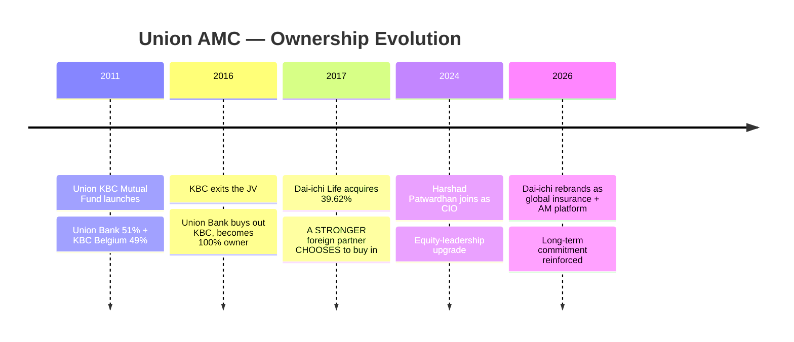

| Dimension | Union (KBC → Dai-ichi) | BOI (AXA exit) |
|-----------|------------------------|----------------|
| Foreign partner #1 | KBC Asset Management (Belgium) — *left 2016* | AXA — *left 2021–22* |
| What replaced it | **Dai-ichi Life bought IN (2017)** | Nothing — govt bank absorbed the stake |
| Nature | **Upgrade — a stronger partner chose to invest** | Reactive absorption of a departing partner |
| Governance signal | **Positive — blue-chip insurer's conviction** | Neutral — continuity by default |

**The key distinction:** BOI's foreign partner left and was *not* replaced — the govt bank simply absorbed the stake. Union's first foreign partner (KBC) also left, but was **replaced by a materially stronger one**: Dai-ichi Life, a global insurer that *voluntarily acquired* 39.62% in 2017 and has reinforced its commitment since (rebranding into a global platform in 2026). A blue-chip insurer *choosing* to buy into a small Indian AMC is a **conviction signal** about the franchise's governance and prospects — the opposite of a partner fleeing. Union turned a foreign-partner exit into a foreign-partner *upgrade*.

---

## ⭐ Proper Governance Infrastructure — The *Cause* of the Clean Record *(Union-specific)*

Union's clean regulatory sheet is not luck — it reflects a properly-built governance machine, unusual for a sub-scale AMC:

| Governance Function | Union | Read |
|---------------------|-------|------|
| Dedicated Chief Compliance Officer | **Yes (Richa Parasrampuria)** | Independent compliance oversight |
| Dedicated Chief Risk Officer | **Yes (Maulik Bhansali)** | Formal risk-management function |
| CIO / Head of Equity separation | **Yes (Patwardhan / Bembalkar)** | Investment governance layering |
| Custodian | **SBI-SG Global Securities** | Tier-1 (SBI + Société Générale) |
| RTA | **CAMS** | Tier-1 (the industry standard) |
| Auditor | **S.R. Batliboi (EY network)** | Big-4-affiliated |
| Foreign-insurer board overlay | **Dai-ichi** | Additional governance layer |

**A full C-suite with *separate* compliance and risk officers, Tier-1 service providers, an EY-affiliated auditor, and a foreign-insurer board overlay** — this is the institutional plumbing that *produces* a clean record. It contrasts with BOI, whose Valuation-Committee compliance environment allowed an officer to front-run his own fund. Union's governance infrastructure is genuinely better-built than its small size would suggest, and it is the structural reason the regulatory sheet is clean. For a long-horizon investor, *robust guardrails* are worth as much as a *clean history* — Union has both.

---

## ⭐ The Perennial Sub-Scale Problem — The Honest Weakness *(Union-specific)*

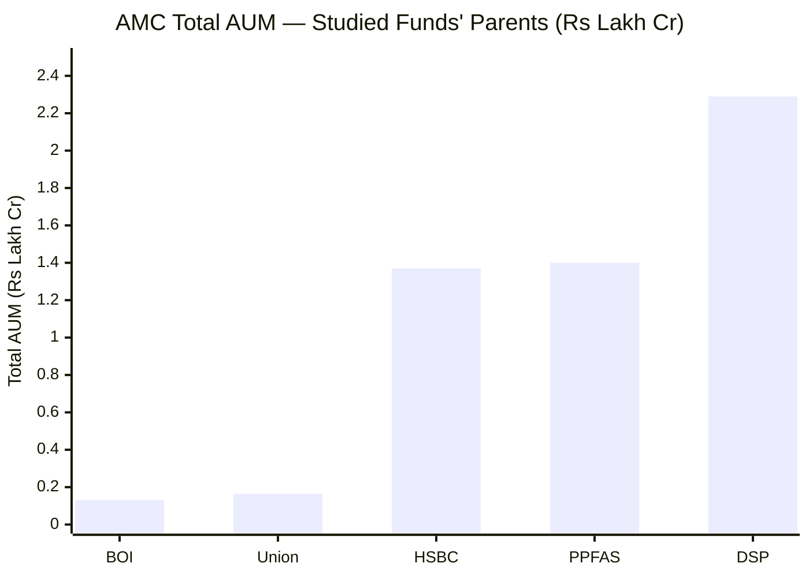

The genuine negative: **Union AMC is ~₹16–17K Cr after 15 years — it has never scaled.** Despite a long runway, two strong parents, and (during the Paharia era) a respected CIO, the franchise has not broken out of the small-AMC tier.

| Consequence | Detail |
|-------------|--------|
| **Thin research depth** | Estimated fee revenue ~₹17–20 Cr/scheme-cluster supports a far smaller analyst bench than DSP (508 staff) or HSBC (global) |
| **Weak franchise traction** | 15 years and still sub-scale signals limited distribution/brand pull |
| **Economies-of-scale gap** | Higher per-unit costs (part of why the fund's ER is the 2nd-highest — Module 4) |
| **Key-person dependence** | A small bench means the fund leans on a handful of people (mitigated by the M5 team structure, but real) |

**The mitigant:** sub-scale is a *quality/depth* weakness, not a *trust* weakness — and Module 6's core question is trust. A *small, clean, well-parented* house is a lower-risk 10-year custodian than a *large, scarred* one (BOI's debt debacle; Invesco's settlement). The sub-scale problem caps Union's M6 below DSP/HSBC's deep institutional platforms, but it does not undermine the *trustworthiness* that is M6's central concern. It also helps explain (and is partly offset by) the fund's structural edge: a small AMC running a small fund is exactly what delivers the nimble micro-cap advantage of Modules 3–4.

---

## Talent Retention — Better than BOI, Not Great (M5 ↔ M6 Bridge)

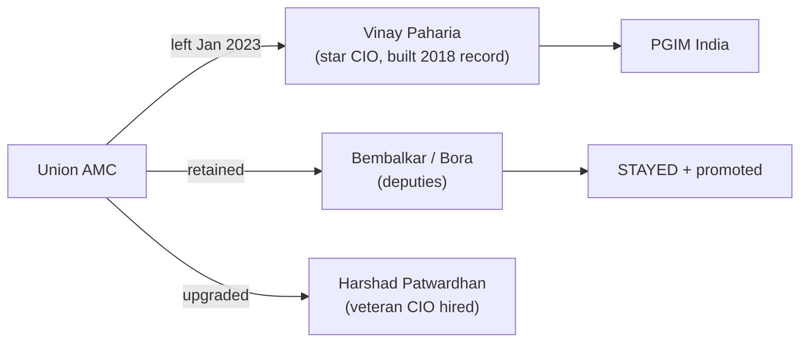

Union's talent story is a **partial** AMC-quality concern — milder than BOI's. It *lost* its star CIO (Paharia → PGIM India), which is a genuine talent-flight data point and reflects the same structural reality (a sub-scale AMC can't always match private-house compensation/prestige). **But — unlike BOI, which lost *both* hands-on architects to competitors (one to shortlist rival Edelweiss)** — Union **retained its equity bench** (Bembalkar and Bora stayed and were promoted) and **upgraded the vacated CIO chair** with a heavyweight (Patwardhan, ex-Edelweiss/JPM CIO). So Union demonstrated an ability to *retain and promote* its second tier and to *attract* senior talent — a materially better institutional-retention signal than BOI's wholesale architect flight. The concern is real (the star left) but the response was strong (bench kept, CIO upgraded).

---

## Regulatory Record — Clean Across the Board

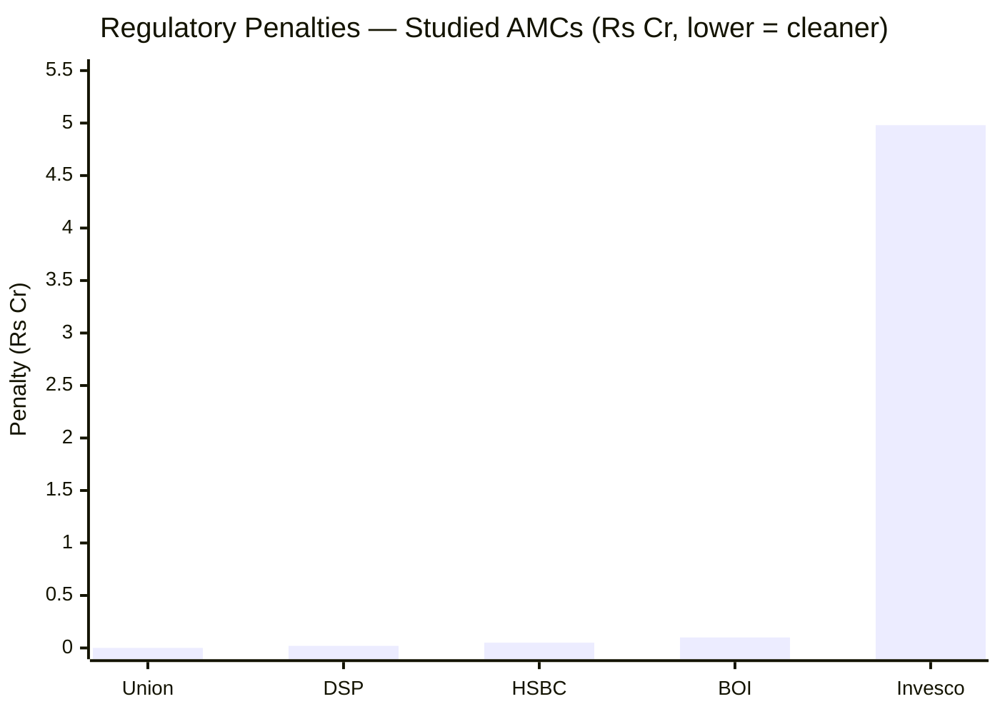

| Entity | Issue | Amount | Character |
|--------|-------|--------|-----------|
| **Union AMC + managers** | **None found** | **₹0** | **Clean** |
| DSP AMC | ETF expense procedural | ₹2 lakh | Procedural |
| HSBC AMC | Documentation (L&T era) | ₹5 lakh | Procedural / inherited |
| BOI AMC | Insider redemption + Credit Risk debacle | ₹10 lakh + capital loss | Governance scar |
| Invesco AMC | Inter-scheme transfers; multi-jurisdiction probe | ₹4.98 Cr | Severe |

**Union has the cleanest regulatory record of the studied small-cap AMCs** — not even a procedural fine surfaced (where DSP and HSBC each carry minor ones). This is the strongest possible regulatory profile and the foundation of Union's above-peer M6 score. The only caveat is epistemic: a *smaller* AMC simply does fewer things and attracts less regulatory scrutiny than a giant, so a clean sheet is *somewhat* easier to keep. But combined with the genuine governance infrastructure (dedicated CCO/CRO, Dai-ichi overlay), the clean record reads as *built*, not merely *unexamined*.

---

## Investor-First Signals — Clean but Quiet

| Signal | Union | DSP | PP | BOI |
|--------|-------|-----|-----|-----|
| Regulatory cleanliness | **Best of studied** | Procedural only | Clean | Debt scar |
| Restrained regular ER | **Yes (1.75%, ~0.13% below ceiling)** | Yes | Yes | No (near ceiling) |
| Investor-friendly exit load | **Yes (15-day window — best of study)** | Standard | Standard | Standard |
| Flow-restriction history | None (never needed) | 3 closures | SIP cap | None |
| Quarterly investor letters | No | No | **Yes** | No |
| Standalone philosophy doc | No | Yes | Yes | No |
| Skin-in-game disclosed | No | All-employee | Manager-disclosed | No |

Union's investor-first profile is **clean and structurally fair, but communicatively quiet.** The genuine pro-investor signals are real: the cleanest regulatory record, a *restrained* regular-plan ER (it does not gouge distributor-channel investors — unlike BOI's near-ceiling 2.07%), and the **most investor-friendly exit load of the entire study** (15-day window vs everyone else's 365 days, Module 4). What is missing is *proactive communication*: no quarterly letters, no standalone philosophy document, no disclosed skin-in-game. This is the **clean-but-quiet** profile typical of a conservative, sub-scale, bank-and-insurer-owned house — it treats investors *fairly* (clean record, fair fees structure) without *courting* them the way DSP or PP do. For a self-directed Direct investor, the fairness matters more than the marketing.

---

## AMC Scale, Economics & Research Depth

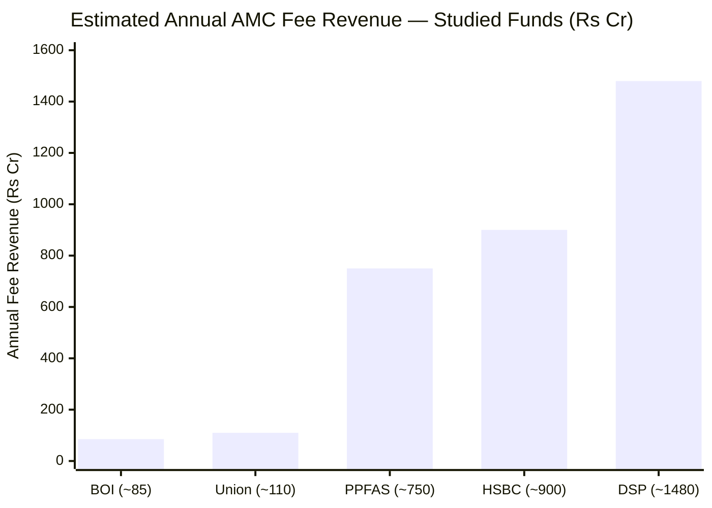

| Metric | Union | BOI | DSP | HSBC |
|--------|-------|-----|-----|------|
| Total AUM | ~₹16–17K Cr | ~₹13K Cr | ₹2.29L Cr | ₹1.37L Cr |
| Est. AMC revenue | **~₹100–120 Cr** | ~₹85 Cr | ~₹1,480 Cr | ~₹900 Cr |
| Schemes | ~15–20 | ~17–19 | 66+ | 122 |
| Research depth | **Thin (small bench)** | Thin | Deep (508 staff) | Deep (+ global) |
| Age of AMC | **~15 years (still small)** | ~17 years (still small) | Decades (scaled) | Decades (scaled) |

**The sub-scale problem is structural and long-standing.** At ~₹16–17K Cr after 15 years, Union — like BOI — runs a thin research bench versus the institutional platforms at DSP/HSBC, and its franchise has not demonstrated the distribution traction to scale. Revenue (~₹100–120 Cr) is a fraction of DSP's (~₹1,480 Cr). The fund's edge therefore rests on the *quality and continuity of its equity team* (Module 5: Patwardhan/Bembalkar/Chopra/Dharmshi) and the *nimbleness of small AUM* (Modules 3–4), rather than on deep institutional infrastructure. This is the same small-AMC trade-off as BOI — but Union carries it *without* BOI's compounding negatives (no governance scar, less talent flight, stronger parents).

---

## Peer AMC Comparison — Full Picture

| Dimension | Union | BOI | DSP | PPFAS | HSBC | Invesco |
|-----------|-------|-----|-----|-------|------|---------|
| Ownership | **PSU bank + global insurer** | Govt-bank PSU | Family-private | Promoter-private | Global bank | Hinduja/IIHL |
| Total AUM | ~₹16–17K Cr | ~₹13K Cr | ₹2.29L Cr | ₹1.40L Cr | ₹1.37L Cr | ~₹1.1L Cr |
| Financial stability | **Very high (dual)** | High (govt) | Very high | High | Very high | Moderate |
| Acquisition risk | **Low (Dai-ichi committed)** | None (govt) | Very low | Low | Low | **High (serial)** |
| Regulatory character | **Cleanest of studied** | Debt-side scar | Procedural | Clean | Procedural/inherited | **Severe** |
| Talent retention | **Mixed (kept bench)** | Weak (both fled) | Strong | Strong | Moderate | Weak |
| Governance infra | **Full C-suite + Dai-ichi overlay** | Adequate | Deep | Best | Deep | Weak |
| Investor communication | Clean but quiet | Minimal | Above-avg | **Best** | Moderate | Below-avg |
| Skin-in-game | Not disclosed | Not disclosed | **All-employee** | Manager-disclosed | Not disclosed | Not disclosed |
| Research depth | **Thin (sub-scale)** | Thin | Deep | Moderate | Deep | Moderate |
| **M6 Score** | **~3.5** | 3.2 | 4.3 | 4.5 | 3.4 | 2.3 |

---

## Points For / Points Against — AMC Quality

### ✅ Points For

1. **Cleanest regulatory record of the studied small-cap AMCs** — no SEBI penalty, no fund debacle, no insider lapse, in 15 years (the BOI/Invesco differentiator)
2. **Dual-strong parentage** — Union Bank of India (5th-largest PSU bank, *never under PCA*, record FY25 profit ₹18,027 Cr) *plus* Dai-ichi Life (¥41tn global insurer) — financial unsinkability ×2
3. **Stronger bank parent than BOI** — Union Bank is larger, more profitable, and PCA-free, unlike BOI (under PCA 2017–19)
4. **Foreign-institutional governance overlay** — Dai-ichi Life brings blue-chip, long-horizon board discipline a pure-PSU house lacks
5. **Foreign-partner *upgrade*** — KBC left (2016) but a *stronger* partner (Dai-ichi) *chose* to buy in (2017) — a conviction signal
6. **Proper governance infrastructure** — dedicated CCO + CRO + Tier-1 providers (CAMS, SBI-SG, S.R. Batliboi) — the *cause* of the clean record
7. **Better talent retention than BOI** — lost the star CIO but kept the bench (Bembalkar/Bora) and upgraded the CIO (Patwardhan)
8. **Structurally fair to investors** — restrained regular ER (1.75%) + best-of-study exit load (15 days) (Module 4)
9. **Low acquisition risk** — Dai-ichi's strategic commitment (reinforced by its 2026 global rebrand) stabilises ownership

### ❌ Points Against

1. **Perennially sub-scale** — ~₹16–17K Cr after 15 years; the franchise has never broken out; thin research depth
2. **Lost its star CIO** — Paharia (the 2018-protection architect) left for PGIM; structural comp/prestige limits of a small AMC
3. **Thin research budget** — a fraction of DSP's/HSBC's; the analyst bench is shallow for a micro-cap-heavy portfolio
4. **Minimal proactive investor communication** — no quarterly letters, no philosophy document
5. **Skin-in-game not disclosed** — no all-employee or manager-level alignment policy on record
6. **No flow-discipline track record** — never large enough to need restrictions; untested on protecting the strategy at scale
7. **PSU-majority ownership** — carries some bureaucratic-culture risk (mitigated by the Dai-ichi overlay and private-AMC operation)
8. **A foreign partner *did* exit once (KBC, 2016)** — a historical ownership-churn data point, though resolved favourably

---

## Module 6 Scorecard

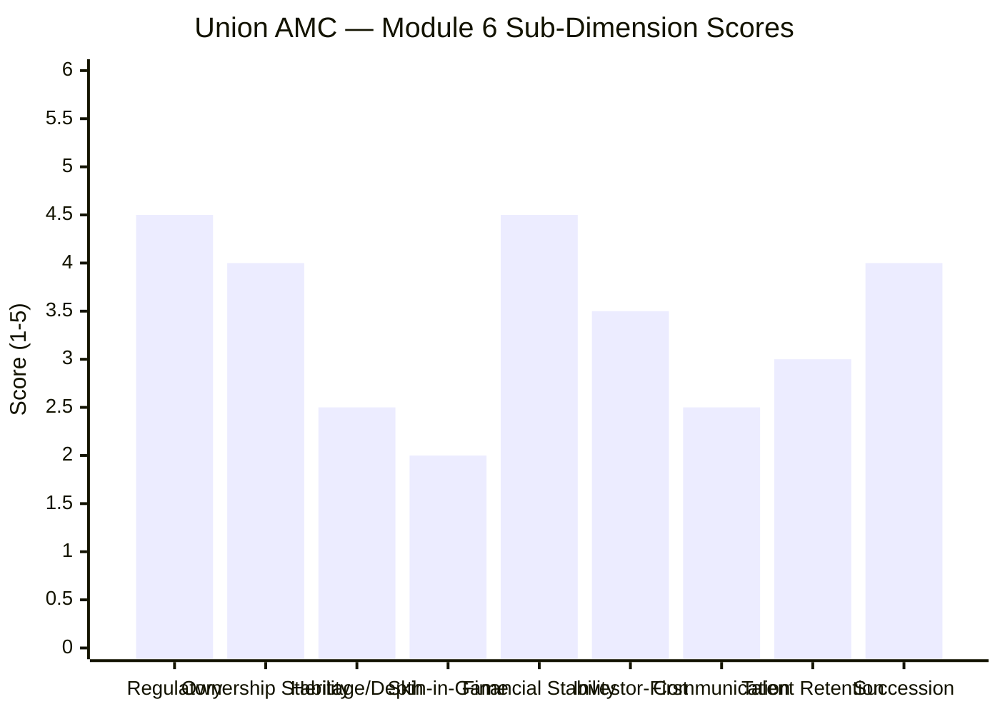

| Sub-Dimension | Score (1–5) | Reasoning |
|---------------|------------|-----------|
| Regulatory cleanliness | **4.5** | Cleanest of the studied small-cap AMCs; no penalty/debacle/insider lapse in 15 years; the defining strength |
| Ownership stability | **4.0** | Dual strong parents; Dai-ichi committed (low acquisition risk); minor ding for KBC's historical exit |
| Heritage & institutional depth | **2.5** | 15-yr heritage but perennially sub-scale; thin research bench |
| Skin-in-the-game | **2.0** | Not disclosed; no all-employee or manager-level policy on record |
| Financial stability | **4.5** | PSU bank (no PCA, record profit) + ¥41tn global insurer — dual unsinkable backstop |
| Investor-first culture | **3.5** | Clean record + restrained regular ER + best-of-study exit load; offset by no flow discipline / no skin-in-game |
| Investor communication | **2.5** | Clean but quiet; no quarterly letters or philosophy doc; below DSP, far below PP |
| Talent retention | **3.0** | Lost star CIO (Paharia), but retained bench and upgraded CIO (Patwardhan) — better than BOI |
| Succession / continuity | **4.0** | Deep current bench (CIO + Head + Co-Head + 3 FMs); no succession void |
| **Module 6 Overall** | **~3.5 / 5** | **A clean, well-parented, adequately-governed but sub-scale house.** The cleanest regulatory record of the studied small-cap AMCs, dual-strong parentage (a PCA-free PSU bank + a blue-chip global insurer), a foreign-institutional governance overlay, proper compliance/risk infrastructure, and better talent retention than BOI — capped by perennial sub-scale, thin research depth, minimal investor communication, and undisclosed skin-in-game. Marginally above HSBC; clearly above BOI/Bandhan/Invesco; a tier below DSP/PP. |

---

## Comparative Module 6 Scores — All Studied Funds

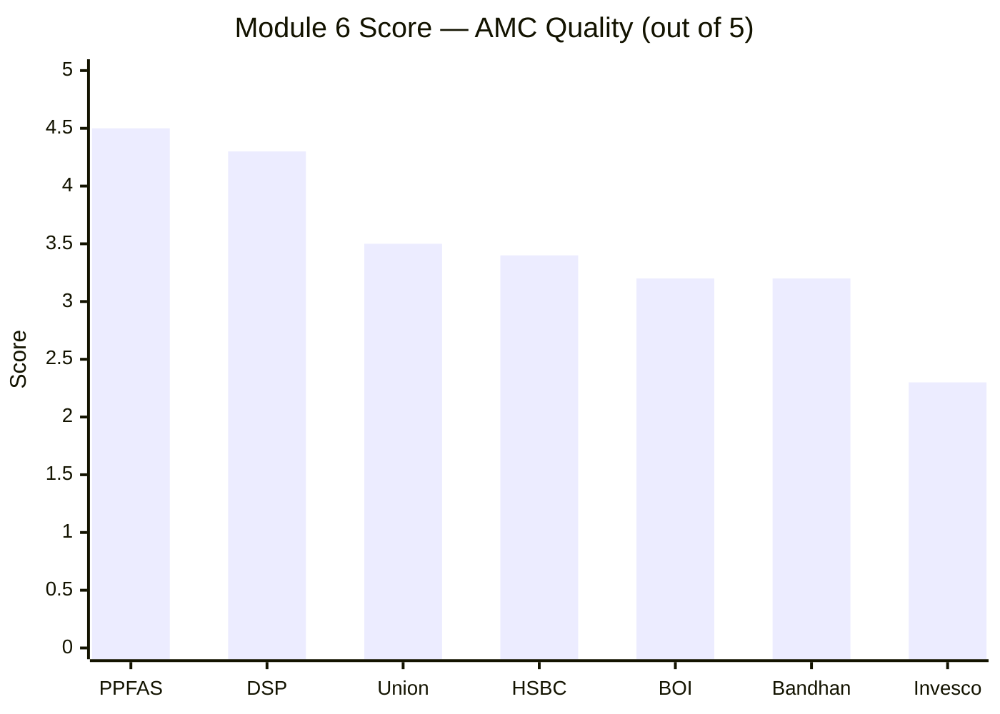

| Rank | AMC | Score | Key Differentiator |
|------|-----|-------|--------------------|
| 1 | PPFAS | 4.5 | Zero incidents; quarterly letters; focused range |
| 2 | DSP | 4.3 | 160Y heritage; all-employee skin-in-game; flow discipline |
| 3 | **Union** | **~3.5** | **Cleanest record + dual-strong parents (PSU bank + Dai-ichi) + governance infra; capped by sub-scale + quiet communication** |
| 4 | HSBC | 3.4 | $3T global parent; but open-door AUM; grafted heritage; inherited penalty |
| 5 | BOI | 3.2 | Govt-bank unsinkability + clean equity CIO; but debt-side scar, talent flight |
| 6 | Bandhan | 3.2 | IDFC heritage; but consortium ownership + ChrysCapital PE exit clock |
| 7 | Invesco | 2.3 | 4 ownership changes; multi-jurisdiction SEBI probe |

**Union takes the #3 AMC slot — behind only DSP and PP, and above HSBC/BOI/Bandhan/Invesco.** The logic: Union substitutes *cleanliness and dual-strong parentage* for the *scale and skin-in-game* that DSP/PP offer. It edges HSBC (whose bigger global parent is offset by an open-door, grafted, penalty-carrying franchise) and clearly beats BOI/Bandhan (governance scar / PE-clock) and Invesco (serial-change governance mess). For the trust question Module 6 exists to answer, Union is the *third-most-trustworthy* house in the study — a genuinely strong result that offsets some of the execution doubts (cost, junior leads) raised earlier.

---

## One-Line Verdict

Union Asset Management is the clean counterpoint to BOI — a sub-scale (~₹16–17K Cr) but genuinely well-governed house with the cleanest regulatory record of the studied small-cap AMCs, a uniquely dual-strong parentage (Union Bank of India, a PCA-free 5th-largest PSU bank, *plus* Dai-ichi Life, a ¥41-trillion global insurer who *chose* to buy in), proper compliance/risk infrastructure, and better talent retention than BOI — held below the DSP/PP tier only by perennial sub-scale, thin research depth, and quiet investor communication, landing at ~3.5/5: the third-most-trustworthy AMC in the study.

---

## Module 6 Final Score: **~3.5 / 5**

> **Module Weight:** 5% | **Weighted Contribution:** 3.5 × 0.05 = **0.175**

---

## Union Small Cap Fund — Complete Final Score (All 6 Modules)

| Module | Topic | Weight | Score | Weighted |
|--------|-------|--------|-------|----------|
| Module 1 | Returns Consistency | 25% | 3.8/5 | 0.950 |
| Module 2 | Risk Profile | 20% | 3.8/5 | 0.760 |
| Module 3 | Portfolio DNA | 15% | 3.6/5 | 0.540 |
| Module 4 | Cost & AUM Impact | 20% | 3.5/5 | 0.700 |
| Module 5 | Fund Manager Quality | 15% | 3.4/5 | 0.510 |
| **Module 6** | **AMC Quality** | **5%** | **3.5/5** | **0.175** |
| **TOTAL** | | **100%** | | **≈ 3.64 / 5** |

> **Union Small Cap Fund final weighted score: ≈ 3.64 / 5 — the #3 small cap fund in this study, in a virtual tie with BOI (3.66) for #2, behind only DSP (4.00).**

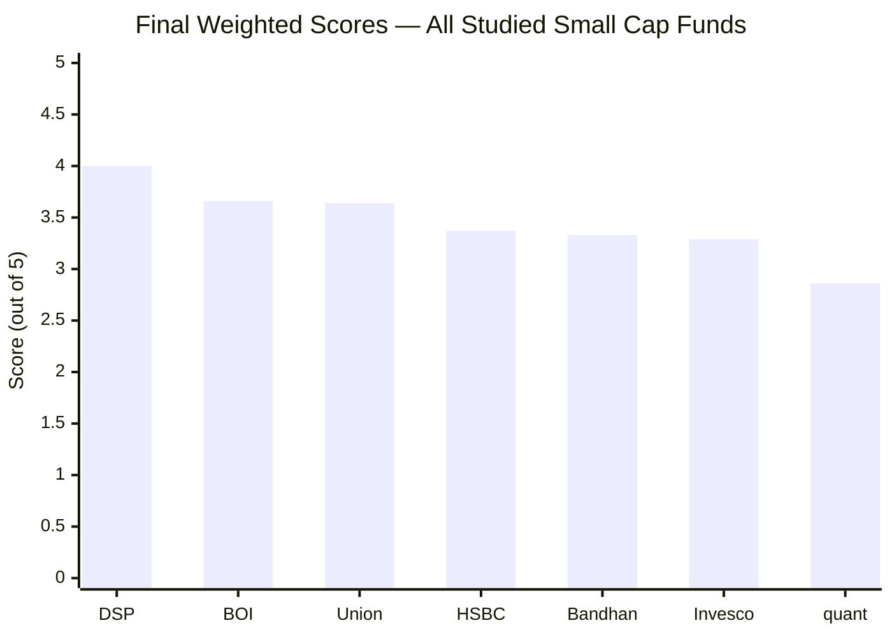

### Union vs BOI — The Co-#2 Finding

Union and BOI finish in a **virtual dead heat (3.64 vs 3.66)** — and they are near-mirror-images:

| Module | Union | BOI | Winner |
|--------|-------|-----|--------|
| M1 Returns | 3.8 | 3.7 | **Union** (genuine 2018 test) |
| M2 Risk | 3.8 | 3.7 | **Union** (#1 Sharpe, *tested*) |
| M3 Portfolio | 3.6 | 3.7 | BOI (purer, more differentiated) |
| M4 Cost & AUM | 3.5 | 3.9 | **BOI** (far cheaper) |
| M5 Manager | 3.4 | 3.3 | **Union** (continuity + 2 CAs) |
| M6 AMC | 3.5 | 3.2 | **Union** (clean vs scarred) |
| **Total** | **3.64** | **3.66** | **Tie** |

**The trade is clear:** BOI wins decisively on *cost* (the single biggest weighted lever, M4); Union wins on *genuine-tested returns/risk* (M1/M2), *manager continuity* (M5), and *AMC cleanliness* (M6). BOI is the **cheap, nimble, differentiated, proven-manager fund that has never faced a bear**; Union is the **genuinely-2018-tested, best-risk-adjusted, clean-AMC fund that is more expensive with junior leads.** The 0.02-point gap is noise — *they are co-#2.*

### Strategic Implication — The Wildcard Vindicated

The decision-tree flagged Union as a *"pending wildcard"*: *"Why 2× the next-best Sharpe — genuine low-vol, or a data artefact? If genuine, a lower-volatility satellite candidate; if artefact, eliminate."* **The study answers it decisively: the Sharpe is genuine** (asymmetric capture, 94%/47%, M2), Union is a **genuine quality-defensive compounder with a real, passed 2018 test**, and it scores **≈3.64 — a legitimate top-3 fund, not an elimination candidate.** Union earns a place in the strategic conversation as:
- a **quality/volatility-dampening leg** (its 94%-up / 47%-down capture is exactly what diversifies a high-beta satellite like BOI or Invesco), and
- a **partial DSP-alternative for the anchor role** (genuine 2018 test + best-in-study down-capture + clean AMC), at the cost of a higher ER and less-proven current leads.

---

*Module 6 complete. AMC quality is a relative strength: the cleanest regulatory record of the studied small-cap AMCs, dual-strong parentage (a PCA-free PSU bank + Dai-ichi Life, a global insurer who chose to buy in), proper governance infrastructure, and better talent retention than BOI — capped by perennial sub-scale and quiet investor communication. Module 6 score: ~3.5/5. **Union Small Cap final score ≈ 3.64/5 — the #3 small cap of the study, in a virtual tie with BOI for #2.***

*Next: [README — Final Scorecard & Verdict](README.md)*
