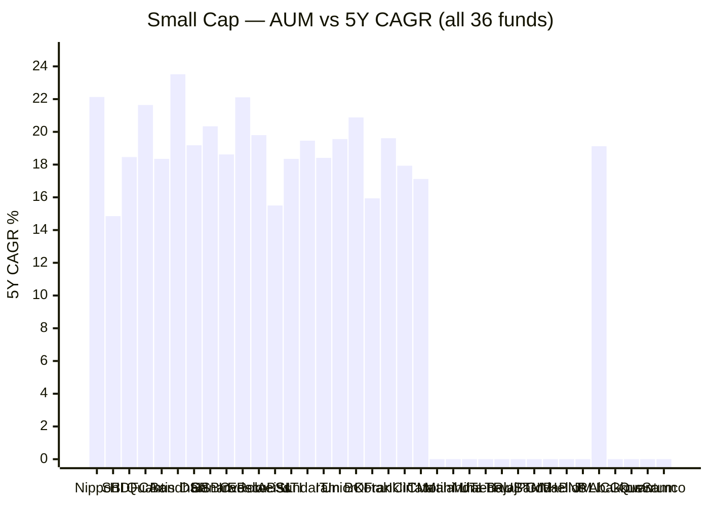
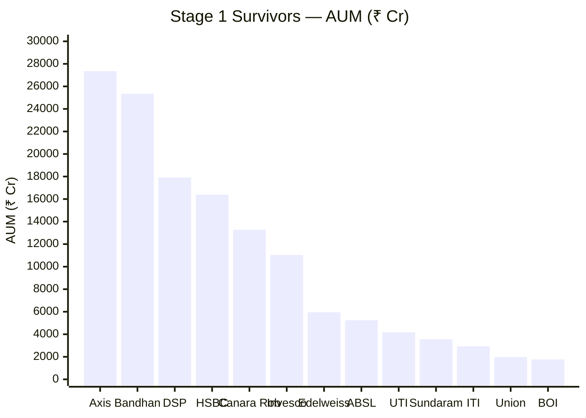

# Stage 1 — Hard Filters

**Universe:** 36 Small Cap Funds (Direct, Growth) — Tickertape, May 21, 2026
**Goal:** Eliminate funds with structural disqualifiers before performance evaluation

---

## Filters Applied (in order of priority)

| # | Filter | Threshold | Funds Eliminated |
|---|--------|-----------|-----------------|
| 1 | Expense Ratio | ER ≤ 1.0% (Direct) | 6 |
| 2 | AUM maximum | AUM ≤ ₹30,000 Cr | 4 (3 new; Quant already caught by ER) |
| 3 | Fund age | ≥ 60 months (5 years) | 8 new |
| 4 | Sharpe Ratio | Sharpe ≥ 0 | 4 new (SBI, HDFC caught by AUM filter; Bajaj by age) |
| 5 | AUM minimum | AUM ≥ ₹500 Cr | 2 new |
| | **Total eliminated** | | **23 of 36** |

---

## Eliminated Funds — Full Log

### Filter 1: ER > 1.0% (6 eliminated)

| Fund | AUM (Cr) | ER% | Verdict |
|------|----------|-----|---------|
| Quant Small Cap Fund | 30,374 | 1.13% | ✗ Eliminated — ER 1.13% > 1.0% |
| LIC MF Small Cap Fund | 660 | 1.47% | ✗ Eliminated — ER 1.47% |
| PGIM India Small Cap Fund | 1,539 | 1.11% | ✗ Eliminated — ER 1.11% |
| Abakkus Small Cap Fund | 453 | 1.03% | ✗ Eliminated — ER 1.03% (also <500 Cr AUM) |
| Groww Small Cap Fund | 296 | 1.12% | ✗ Eliminated — ER 1.12% (also <500 Cr, <5yr) |
| Samco Small Cap Fund | 141 | 1.54% | ✗ Eliminated — ER 1.54% (also <500 Cr, <5yr) |

### Filter 2: AUM > ₹30,000 Cr (3 new eliminations)

| Fund | AUM (Cr) | Note |
|------|----------|------|
| Nippon India Small Cap Fund | 72,673 | ✗ Eliminated — ₹72,673 Cr > ₹30,000 Cr. Largest small cap fund in India. At this AUM, genuine deep small-cap execution is impossible. |
| SBI Small Cap Fund | 37,141 | ✗ Eliminated — ₹37,141 Cr > ₹30,000 Cr. Also has negative Sharpe. |
| HDFC Small Cap Fund | 33,724 | ✗ Eliminated — ₹33,724 Cr > ₹30,000 Cr. Also has negative Sharpe. |

> Note on Nippon: Despite having the highest AUM, Nippon India Small Cap actually has strong returns (22.13% 5Y, 20.94% 3Y) and a respectable Sharpe (0.156). However, its AUM structurally prevents genuine small-cap execution. At ₹72,673 Cr with 65% in small caps = ~₹47,238 Cr in small-cap positions across approximately 100-120 stocks. The average position is ₹393-472 Cr per stock. For a small-cap stock with ₹1,000-2,000 Cr market cap, that's 20-47% of the company — exceeding SEBI's 10% limit. In practice, Nippon's "small cap" allocation skews heavily toward the 250th-350th companies, which are essentially mid-caps. Eliminated on structural grounds, not return grounds.

### Filter 3: Fund age < 60 months (8 new eliminations)

| Fund | Age (months) | Note |
|------|-------------|------|
| Motilal Oswal Small Cap Fund | 30 months | ✗ Eliminated — only 2.5 years old |
| Mahindra Manulife Small Cap Fund | 42 months | ✗ Eliminated — 3.5 years old; no 5Y CAGR |
| Bajaj Finserv Small Cap Fund | 11 months | ✗ Eliminated — < 1 year old |
| TRUSTMF Small Cap Fund | 19 months | ✗ Eliminated — 1.6 years old |
| Baroda BNP Paribas Small Cap Fund | 32 months | ✗ Eliminated — 2.7 years old |
| JM Small Cap Fund | 24 months | ✗ Eliminated — 2 years old |
| Mirae Asset Small Cap Fund | 17 months | ✗ Eliminated — 1.4 years old |
| Helios Small Cap Fund | 7 months | ✗ Eliminated — 7 months old (also negative Sharpe) |

> Note on TRUSTMF: Had an eye-catching Sharpe of 1.108 — but this is measured over only 19 months during a bull market. Any fund launched in a bull market will show inflated Sharpe. Eliminated on age grounds.

> Note on Mahindra Manulife: Shows strong 3Y CAGR (24.57%) but is only 3.5 years old. Has no 5Y CAGR. The 3Y window (May 2023–May 2026) is almost entirely a bull market. No meaningful track record.

### Filter 4: Sharpe < 0 (4 new eliminations)

| Fund | AUM (Cr) | Sharpe | 5Y CAGR | Note |
|------|----------|--------|---------|------|
| Kotak Small Cap Fund | 17,416 | -0.062 | 15.94% | ✗ Eliminated — negative Sharpe; also weakest 5Y in surviving large-AUM group |
| Franklin India Small Cap Fund | 13,850 | -0.194 | 19.61% | ✗ Eliminated — negative Sharpe despite 19.61% 5Y CAGR. Strong long-term returns but current return quality poor. |
| ICICI Pru Smallcap Fund | 8,741 | -0.151 | 17.93% | ✗ Eliminated — negative Sharpe |
| Tata Small Cap Fund | 11,330 | -0.781 | 17.12% | ✗ Eliminated — deeply negative Sharpe (worst of all: -0.781) |

> Note on Franklin India Small Cap: This is the most notable casualty of the Sharpe filter. Franklin has 19.61% 5Y CAGR — higher than 3 of the 8 shortlisted funds. However, its recent 3-year Sharpe of -0.194 reflects that it has delivered below risk-free returns after adjusting for risk in the recent period. This suggests the fund's strong 5Y CAGR was driven by the 2021-2022 period, while recent performance (2023-2025) has been poor. For a 10-year SIP investor, a fund that cannot sustain quality in recent years is a concern.

### Filter 5: AUM < ₹500 Cr (2 new eliminations)

| Fund | AUM (Cr) | Note |
|------|----------|------|
| Quantum Small Cap Fund | 209 | ✗ Eliminated — ₹209 Cr; far too small; redemption risk during market stress |
| The Wealth Company Small Cap Fund | 39 | ✗ Eliminated — ₹39 Cr; startup-scale fund |

---

## Stage 1 Result

**36 total → 23 eliminated → 13 survivors**

| # | Fund | AUM (Cr) | ER% | 5Y CAGR | 3Y CAGR | Roll 3Y | Sharpe | Max DD | Age (mo) |
|---|------|----------|-----|---------|---------|---------|--------|--------|----------|
| 1 | Axis Small Cap Fund | 27,364 | 0.65 | 18.35 | 17.83 | 21.89 | 0.090 | 34.64 | 151 |
| 2 | Bandhan Small Cap Fund | 25,346 | 0.34 | 23.52 | 30.95 | 35.92 | 0.325 | 24.34 | 76 |
| 3 | DSP Small Cap Fund | 17,906 | 0.64 | 19.18 | 20.64 | 23.27 | 0.379 | 49.06 | 161 |
| 4 | HSBC Small Cap Fund | 16,394 | 0.73 | 20.34 | 17.85 | 23.01 | 0.111 | 52.45 | 145 |
| 5 | Canara Rob Small Cap Fund | 13,276 | 0.45 | 18.62 | 16.30 | 19.68 | 0.006 | 36.18 | 88 |
| 6 | Invesco India Smallcap Fund | 11,038 | 0.40 | 22.11 | 24.50 | 29.08 | 0.302 | 37.66 | 92 |
| 7 | Edelweiss Small Cap Fund | 5,952 | 0.82 | 19.80 | 20.12 | 24.12 | 0.265 | 37.09 | 88 |
| 8 | Aditya Birla SL Small Cap Fund | 5,253 | 0.79 | 15.50 | 18.98 | 21.47 | 0.446 | 57.41 | 161 |
| 9 | UTI Small Cap Fund | 4,164 | 0.68 | 18.35 | 18.60 | 21.46 | 0.175 | 22.34 | 66 |
| 10 | Sundaram Small Cap Fund | 3,563 | 0.85 | 19.46 | 21.27 | 23.84 | 0.464 | 57.06 | 161 |
| 11 | ITI Small Cap Fund | 2,937 | 0.54 | 18.41 | 27.07 | 31.15 | 0.408 | 39.88 | 76 |
| 12 | Union Small Cap Fund | 1,980 | 0.80 | 19.56 | 21.72 | 21.69 | 0.805 | 44.71 | 144 |
| 13 | Bank of India Small Cap Fund | 1,770 | 0.49 | 20.88 | 22.45 | 24.60 | 0.491 | 32.37 | 90 |

---

## Notable Observations from Stage 1

1. **Best Sharpe is Union (0.805)** — counterintuitive for a small AUM fund in the "Very High" risk category. Needs investigation in Module 2.

2. **Bandhan has the lowest MaxDD (24.34%)** — likely because it was launched Jan 2020 and avoided the 2018 crash. Its low drawdown is inception bias, not superior risk management. See inception warning.

3. **HSBC has the highest MaxDD of survivors (52.45%)** — in a category where 40-45% is normal, 52.45% stands out. Must understand what happened and when.

4. **Sundaram and AB SL have identical MaxDD patterns (57.06% and 57.41%)** — both 13+ year old funds. Their high max DD includes the 2018 crash, which the newer funds don't reflect.

5. **Axis barely survives** — Sharpe of 0.090 is effectively zero. Stays in Stage 1 pool but likely falls out in Stage 2.

---

*Stage 1 complete | 36 → 13 | Data: Tickertape May 21, 2026*
