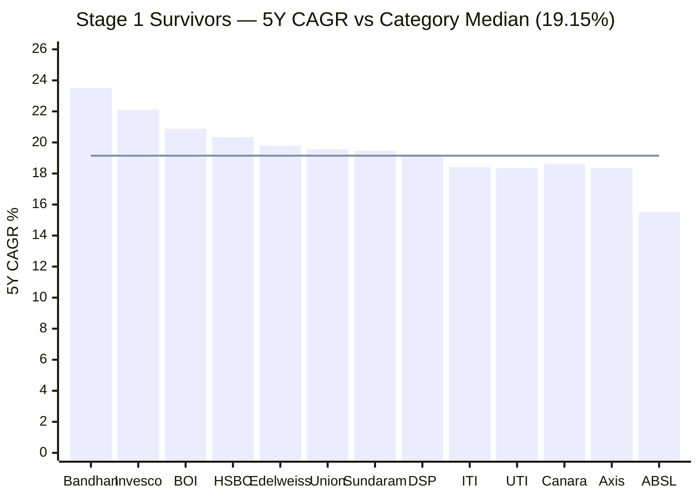
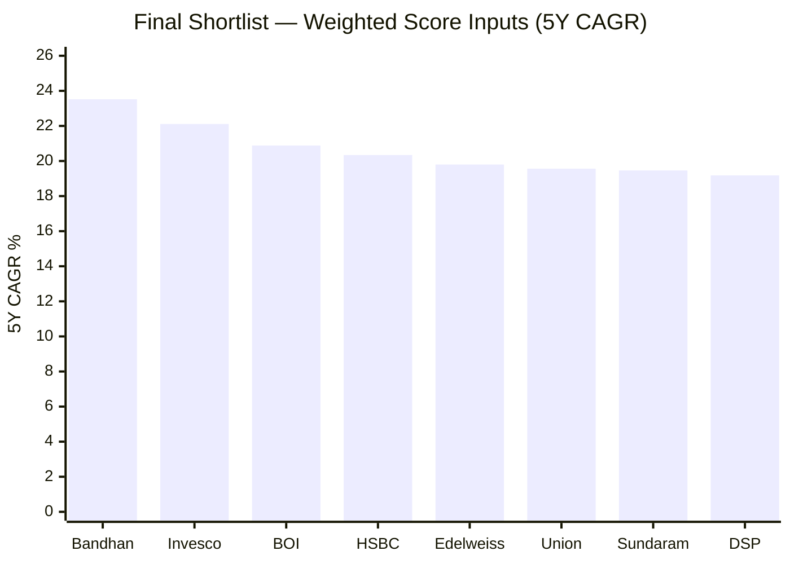

# Stage 2 — Performance Filters

**Input:** 13 Stage-1 survivors
**Goal:** Keep only above-median performers with consistent peer outperformance
**Output:** Final shortlist for deep study

---

## Filters Applied

### Filter 1 — 5Y CAGR > Category Median

The median is computed across all 36 small cap funds with non-zero 5Y CAGR data (22 funds as of May 21, 2026).

**All non-zero 5Y CAGRs (sorted):**

| Rank | Fund | 5Y CAGR |
|------|------|---------|
| 1 | Bandhan Small Cap | 23.52% |
| 2 | Invesco India Smallcap | 22.11% |
| 3 | Nippon India Small Cap | 22.13% |
| 4 | Quant Small Cap | 21.64% |
| 5 | Bank of India Small Cap | 20.88% |
| 6 | HSBC Small Cap | 20.34% |
| 7 | Edelweiss Small Cap | 19.80% |
| 8 | Franklin India Small Cap | 19.61% |
| 9 | Union Small Cap | 19.56% |
| 10 | Sundaram Small Cap | 19.46% |
| **11** | **DSP Small Cap** | **19.18%** |
| **12** | **LIC MF Small Cap** | **19.12%** |
| 13 | Canara Rob Small Cap | 18.62% |
| 14 | ITI Small Cap | 18.41% |
| 15 | Axis Small Cap | 18.35% |
| 16 | UTI Small Cap | 18.35% |
| 17 | HDFC Small Cap | 18.46% |
| 18 | Kotak Small Cap | 15.94% |
| 19 | ICICI Pru Smallcap | 17.93% |
| 20 | Tata Small Cap | 17.12% |
| 21 | AB SL Small Cap | 15.50% |
| 22 | SBI Small Cap | 14.85% |

**Median (11th + 12th values) / 2 = (19.18 + 19.12) / 2 = 19.15%**

**Threshold: 5Y CAGR > 19.15%**

### Filter 2 — Returns vs Sub-category (3Y) > 1.0x

A value > 1.0 means the fund returned more than the sub-category average over 3 years. A value of 1.2 means 20% better than the average peer.

---

## Stage 2 Results (from 13 Stage-1 survivors)

> Bar = 5Y CAGR | Line = 19.15% category median threshold

### Funds Eliminated in Stage 2

| Fund | 5Y CAGR | vs Median | Sub-cat 3Y | Reason |
|------|---------|-----------|-----------|--------|
| Axis Small Cap Fund | 18.35% | -0.80pp below | 1.135x | ✗ 5Y CAGR below median |
| Canara Rob Small Cap Fund | 18.62% | -0.53pp below | 1.037x | ✗ 5Y CAGR below median |
| Aditya Birla SL Small Cap Fund | 15.50% | -3.65pp below | 1.208x | ✗ 5Y CAGR below median |
| UTI Small Cap Fund | 18.35% | -0.80pp below | 1.183x | ✗ 5Y CAGR below median |
| ITI Small Cap Fund | 18.41% | -0.74pp below | 1.722x | ✗ 5Y CAGR below median |

> Note on ITI: Has an exceptional Returns vs sub-cat 3Y of 1.722x — strong recent outperformance. But its 5Y CAGR (18.41%) is below the median, and the fund is only 76 months old (launched Jan 2020), limiting the credibility of the long-run return. If a deeper study is ever needed, ITI would be the first to reinstate.

---

## Final Shortlist — 8 Funds

### Full Data Table

| # | Fund | AUM (Cr) | ER% | 10Y | 5Y | 3Y | Roll 3Y | Sharpe | Sortino | Max DD | Sub-cat 3Y | Age (mo) |
|---|------|----------|-----|-----|----|----|---------|--------|---------|--------|-----------|----------|
| 1 | **Bandhan Small Cap** | 25,346 | 0.34 | — | 23.52 | 30.95 | 35.92 | 0.325 | — | 24.34% | 1.970x | 76 |
| 2 | **Invesco India Smallcap** | 11,038 | 0.40 | — | 22.11 | 24.50 | 29.08 | 0.302 | — | 37.66% | 1.559x | 92 |
| 3 | **Bank of India Small Cap** | 1,770 | 0.49 | — | 20.88 | 22.45 | 24.60 | 0.491 | — | 32.37% | 1.429x | 90 |
| 4 | **HSBC Small Cap** | 16,394 | 0.73 | 19.82 | 20.34 | 17.85 | 23.01 | 0.111 | — | 52.45% | 1.136x | 145 |
| 5 | **Edelweiss Small Cap** | 5,952 | 0.82 | — | 19.80 | 20.12 | 24.12 | 0.265 | — | 37.09% | 1.281x | 88 |
| 6 | **Union Small Cap** | 1,980 | 0.80 | 17.40 | 19.56 | 21.72 | 21.69 | 0.805 | — | 44.71% | 1.382x | 144 |
| 7 | **Sundaram Small Cap** | 3,563 | 0.85 | 16.10 | 19.46 | 21.27 | 23.84 | 0.464 | — | 57.06% | 1.353x | 161 |
| 8 | **DSP Small Cap** | 17,906 | 0.64 | 17.55 | 19.18 | 20.64 | 23.27 | 0.379 | — | 49.06% | 1.314x | 161 |

---

## Key Observations from Shortlist

### On Track Records
- Only **4 of 8 funds have 10Y CAGR data**: HSBC (19.82%), Union (17.40%), DSP (17.55%), Sundaram (16.10%)
- The other 4 (Bandhan, Invesco, BOI, Edelweiss) are all <8 years old — 2018 crash coverage is incomplete or absent
- For 10Y evaluation: HSBC has the strongest 10Y CAGR (19.82%), followed by DSP (17.55%) and Union (17.40%)

### On Risk
- **Best MaxDD: Bandhan (24.34%)** — but this is inception bias (launched Jan 2020, missed 2018)
- **Worst MaxDD: Sundaram (57.06%)** — the fund that went through every crash including 2018. This is what genuine small cap risk looks like.
- **Union Sharpe (0.805) is the best** — 2x the next best (BOI 0.491). Needs Module 2 investigation.
- **HSBC MaxDD (52.45%) stands out** — 5 of the 8 shortlisted funds have MaxDD below 45%; HSBC at 52.45% is an outlier. The MaxDD analysis in Module 2 must find when this happened.

### On Cost
- **Bandhan is the cheapest (0.34%)** — well below the next cheapest Invesco (0.40%)
- **Sundaram is the most expensive (0.85%)** — the cost drag at 0.85% vs 0.34% for Bandhan compounds to material difference over 10Y SIP

### On AUM
- **Only 2 funds are in the AUM sweet spot (₹2,000-12,000 Cr) with no concerns:** Edelweiss (5,952), BOI (1,770)... wait, BOI at ₹1,770 Cr may be approaching too-small territory in a stress scenario
- **Bandhan at ₹25,346 Cr is the highest AUM** in the shortlist — approaching the zone where small-cap execution gets impaired
- **DSP at ₹17,906 Cr and HSBC at ₹16,394 Cr** are large but below the 30K elimination threshold
- **Union (₹1,980 Cr) and BOI (₹1,770 Cr)** are the smallest — good for small-cap execution but vulnerable to flow-driven AUM changes

### Known AMC Overlaps with FlexiCap Study
| AMC | FlexiCap Score | Small Cap Fund | Note |
|-----|---------------|----------------|------|
| HSBC AMC | Studying (PLAN.md) | HSBC Small Cap | Same AMC, same foreign-exit risk, same ER concern |
| BOI AMC | 3.93/5 (Rank #2) | BOI Small Cap | Same Alok Singh? Or different manager? — verify in Module 5 |
| Edelweiss AMC | 3.77/5 (Rank #4) | Edelweiss Small Cap | Same Trideep Bhattacharya? Or different CIO for small cap? — verify |

---

## Comparison: FlexiCap Shortlist vs Small Cap Shortlist

| Dimension | FlexiCap (9 funds) | Small Cap (8 funds) |
|-----------|-------------------|---------------------|
| Category AUM range | ₹2,294 – ₹1,40,950 Cr | ₹1,770 – ₹25,346 Cr |
| Shortlist ER range | 0.52% – 1.22% | 0.34% – 0.85% |
| Category median 5Y CAGR | 14.45% | 19.15% |
| Best 5Y CAGR (shortlist) | 20.42% (BOI) | 23.52% (Bandhan) |
| Worst Max DD (shortlist) | 54.60% (Quant) | 57.06% (Sundaram) |
| Funds with 10Y CAGR | 7 of 9 | 4 of 8 |
| Governance disqualification | 1 (Quant — active SEBI probe) | 0 (none yet — to check in Module 6) |

---

*Stage 2 complete | 13 → 8 shortlisted | Category median 5Y CAGR: 19.15% | Data: Tickertape May 21, 2026*
